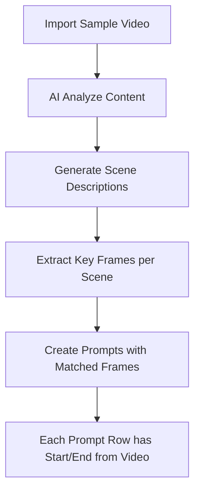

# 🖼️ Image Library System (Fully Automated)

**Version**: 1.0  
**Last Updated**: 2026-02-03  
**Status**: ✅ Approved for Implementation

---

## Core Principle

> **100% Offline + Automated**: App KHÔNG có bất kỳ manual upload UI nào.
> Tất cả hình ảnh đến từ **Library** (via `[tag]`) hoặc **Continuation** (video frame).

```
┌─────────────────────────────────────────────────────────────────────┐
│                    VEO PRO MAX APP (100% Offline)                    │
├─────────────────────────────────────────────────────────────────────┤
│  ┌──────────────────┐     ┌──────────────────┐                      │
│  │  IMAGE LIBRARY   │     │   CONTINUATION   │                      │
│  │  [tag] in Prompt │     │  Frame từ Video  │                      │
│  └────────┬─────────┘     └────────┬─────────┘                      │
│           └────────────┬───────────┘                                 │
│                        ▼                                             │
│           ┌─────────────────────────┐                               │
│           │   Job Queue (Base64)    │                               │
│           └─────────────┬───────────┘                               │
│                         ▼                                            │
│           ┌─────────────────────────┐                               │
│           │       Playwright        │ → Inject to VEO Web           │
│           └─────────────────────────┘                               │
│                                                                      │
│  ❌ NO Manual Upload UI                                              │
│  ❌ NO User interaction với web                                      │
│  ✅ 100% Automated từ Library + Continuation                         │
└─────────────────────────────────────────────────────────────────────┘
```

---

## 1. Image Sources

| Source | Trigger | Mô tả |
|--------|---------|-------|
| **Library `[tag]`** | `[tag_name]` trong prompt | Auto-match với file trong library folder |
| **Continuation** | CONT toggle enabled | Auto-extract frame từ previous video |

---

## 2. Tag Format Specification

### 2.1 Basic Tag
```
[tag_name]
```
→ Match file `[tag_name].png/jpg/webp` trong library

### 2.2 Prefixed Tag (Auto-categorize)

| Prefix | Category | Ví dụ |
|--------|----------|-------|
| `char_` | Character | `[char_hero]` |
| `bg_` | Background | `[bg_castle]` |
| `style_` | Style ref | `[style_anime]` |
| `ref_` | General ref | `[ref_pose]` |

---

## 3. Library Folder Structure

```
📁 {app_data}/Library/
├── [char_hero].png
├── [char_villain].png
├── [bg_castle].webp
├── [bg_forest].jpg
├── [style_anime].png
└── [ref_lighting].png
```

> ⚠️ **File naming**: Filename PHẢI có format `[tag].ext`

---

## 4. Tab-Specific Usage Matrix

| Tab | Input Type | Library `[tag]` | Continuation | Max Images |
|-----|------------|-----------------|--------------|------------|
| TAB_02 (I2V) | Start Frame | ✅ First tag | ✅ "Use as First" | 1 per slot |
| TAB_02 (I2V) | End Frame | ✅ Last tag | ✅ "Use as Last" | 1 per slot |
| TAB_03 (R2V) | Ingredients | ✅ Tag 1,2,3 | ✅ Slot 1 | 3 total |
| TAB_04 (T2I) | ❌ None | ❌ **KHÔNG** | ❌ Không áp dụng | 0 |
| TAB_05 (I2I) | Source | ✅ First tag | ✅ Previous output | 1 |

> ⚠️ **TAB_04 (Text-to-Image)** là tab thuần văn bản, không sử dụng bất kỳ image input nào.

---

## 5. TAB_02 Auto-Detection Logic

### 5.1 Per-Row Tag Detection

> ⚠️ **QUAN TRỌNG**: Mỗi row trong PARSED PROMPTS có Start Frame và End Frame **RIÊNG BIỆT**,
> được auto-detect từ `[tag]` trong prompt của row đó.

**Ví dụ PARSED PROMPTS table:**

| # | Start Frm | End Frm | Prompt | CONT |
|---|-----------|---------|--------|------|
| 1 | `[hero]` ✅ | 🔒 N/A | `[hero] walks through forest` | ⚪ |
| 2 | `[villain]` ✅ | 🔒 N/A | `[villain] appears from shadow` | ⚪ |
| 3 | 🔗 CONT | 🔒 N/A | `Battle scene continues` | 🔵 |
| 4 | `[dragon]` ✅ | `[castle]` ✅ | `[dragon] flies toward [castle]` | ⚪ |

### 5.2 Detection Rules by Frame Mode

| Frame Mode | First Tag → | Last Tag → | Example |
|------------|------------|------------|---------|
| Start Only | Start Frame | (ignored) | `[hero] runs` → Start=hero |
| End Only | (ignored) | End Frame | `Camera reveals [castle]` → End=castle |
| Start+End | Start Frame | End Frame | `[hero] reaches [castle]` → Start=hero, End=castle |

### 5.3 Code Implementation

```python
TAG_PATTERN = re.compile(r'\[([^\]]+)\]')

def extract_i2v_frames(prompt: str, frame_mode: str, library: dict) -> dict:
    """Extract Start/End frames from [tags] in prompt."""
    tags = TAG_PATTERN.findall(prompt)
    
    result = {"start": None, "end": None, "missing": []}
    
    if frame_mode == "start_only" and tags:
        tag = tags[0]
        if tag.lower() in library:
            result["start"] = library[tag.lower()]
        else:
            result["missing"].append(f"[{tag}]")
            
    elif frame_mode == "end_only" and tags:
        tag = tags[-1]
        if tag.lower() in library:
            result["end"] = library[tag.lower()]
        else:
            result["missing"].append(f"[{tag}]")
            
    elif frame_mode == "start_end":
        if tags:
            start_tag = tags[0]
            if start_tag.lower() in library:
                result["start"] = library[start_tag.lower()]
            else:
                result["missing"].append(f"[{start_tag}]")
        
        if len(tags) > 1:
            end_tag = tags[-1]
            if end_tag.lower() in library:
                result["end"] = library[end_tag.lower()]
            else:
                result["missing"].append(f"[{end_tag}]")
    
    return result
```

---

## 6. Priority Rules (All Tabs)

| Priority | Source | Condition |
|----------|--------|-----------|
| **1** | Continuation | CONT toggle enabled → Extract frame |
| **2** | Library `[tag]` | Tags trong prompt → Match library |
| **3** | Error | No source → Show warning, block queue |

> ⚠️ **Không có fallback Manual Upload** - nếu thiếu source → error

---

## 7. Continuation + Library Combination

### TAB_03 (Ingredients) với Continuation

Khi CONT enabled, extracted frame chiếm Slot 1, library images chiếm Slot 2-3:

| Slot | Source |
|------|--------|
| 1 | 🔗 Continuation frame (auto) |
| 2 | `[tag2]` từ library |
| 3 | `[tag3]` từ library |

**Total: 1 cont + 2 library = 3 images max**

---

## 8. Validation & Error Handling

### Parse-time Validation

| Check | Icon | Action |
|-------|------|--------|
| Tag found in library | ✅ | Allow queue |
| Tag NOT found | ❌ | Block queue, highlight red |
| CONT enabled, no prev video | ⚠️ | Warning, queue with dependency |

### UI Indicators in Table

| Cell Content | Meaning |
|--------------|---------|
| `[hero]` ✅ | Tag matched, ready |
| `[hero]` ❌ | Tag missing, cannot queue |
| 🔗 CONT | Will use Continuation |
| 🔒 N/A | Not required by mode |

---

## 9. Future Enhancement: Auto Video Frame Extraction

> 🔮 **Phase 3 Feature**: Auto-extract frames từ sample video

### Workflow (Planned)



### Use Case

1. User imports một video mẫu (ví dụ: movie trailer)
2. AI phân tích và tách video thành các scene
3. Mỗi scene → 1 prompt row với:
   - Start Frame: First frame của scene
   - End Frame: Last frame của scene
   - Prompt: AI-generated description
4. Toàn bộ prompts có chung style/character consistency

### Benefits

- **Character Consistency**: Cùng nhân vật từ đầu đến cuối
- **Action Continuity**: Hành động liền mạch
- **Style Matching**: Giữ nguyên phong cách visual

---

## 10. UI Components for Library

### Sidebar: Library Browser

```
┌────────────────────────────────┐
│ 📂 IMAGE LIBRARY               │
├────────────────────────────────┤
│ 🔍 Search: [          ]        │
│ ─────────────────────────────  │
│ ▼ char_ (12 images)            │
│   [hero] [villain] [mentor]... │
│ ▼ bg_ (8 images)               │
│   [castle] [forest] [city]...  │
│ ▼ style_ (5 images)            │
│   [anime] [realistic]...       │
│ ─────────────────────────────  │
│ [📥 Import] [🗑️ Delete]        │
└────────────────────────────────┘
```

### Quick Insert: Tag Autocomplete

Khi gõ `[` trong prompt input:

```
┌─────────────────────────────────┐
│ [ ▼                             │
│ ┌─────────────────────────────┐ │
│ │ 🖼️ char_hero              │ │
│ │ 🖼️ char_villain           │ │
│ │ 🏞️ bg_castle              │ │
│ │ 🏞️ bg_forest              │ │
│ └─────────────────────────────┘ │
└─────────────────────────────────┘
```

---

## 11. Cross-References

| Document | Mô tả |
|----------|-------|
| [TAB_02_IMAGE_TO_VIDEO.md](TAB_02_IMAGE_TO_VIDEO.md) | I2V/F2V với auto Start/End Frame |
| [TAB_03_INGREDIENTS.md](TAB_03_INGREDIENTS.md) | 3 ingredients từ library |
| [TAB_04_TEXT_TO_IMAGE.md](TAB_04_TEXT_TO_IMAGE.md) | ❌ Không dùng library (pure text) |
| [TAB_05_IMAGE_TO_IMAGE.md](TAB_05_IMAGE_TO_IMAGE.md) | Source image từ library |
| [POPUP_LAYOUTS.md](POPUP_LAYOUTS.md#p02-image-manager-popup) | Image Manager Popup |
