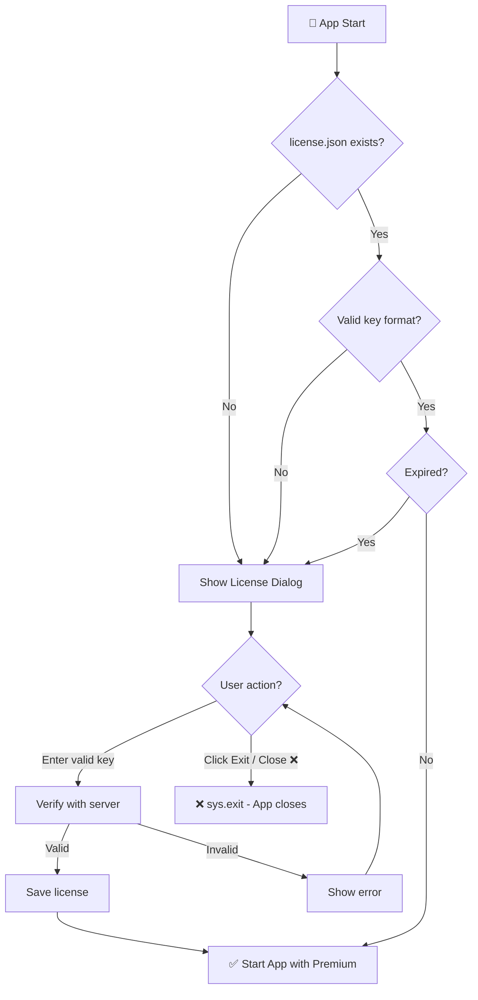

# 🔐 Tab: License

> **Framework**: PySide6 (Qt6)  
> **Reference**: [00_DESIGN_SYSTEM.md](./00_DESIGN_SYSTEM.md)  
> **Version**: 3.0 - PySide6 Migration

---

## 🗂️ Tab Menu

| Tab | Display Name | Key |
|-----|--------------|-----|
| 01-07 | [Previous tabs...] | |
| **→ 08** | **License** | `license` |
| 09 | [About](./TAB_09_ABOUT.md) | `about` |
| 10 | [Dev Console](./TAB_10_DEV_CONSOLE.md) | `dev` (hidden) |

---

## 💰 Pricing Tiers

| Tier | Price (VND) | Duration | Savings |
|------|-------------|----------|---------|
| ⏰ **1 Tuần** | 150,000 | 7 ngày | - |
| 📅 **1 Tháng** | 250,000 | 30 ngày | 44% |
| 📆 **3 Tháng** | 500,000 | 90 ngày | 56% |
| 📅 **1 Năm** | 1,200,000 | 365 ngày | 67% |
| ♾️ **Vĩnh viễn** | 3,000,000 | Không giới hạn | 92% |

---

## 🆓 Trial vs 💎 Premium

| Feature | 🆓 Trial | 💎 Premium |
|---------|----------|------------|
| **Số Cookies** | 1 | Không giới hạn |
| **Luồng đồng thời** | 2 | Không giới hạn |
| **Prompts/Task** | 10 | Không giới hạn |
| **Tất cả modes** | ✅ | ✅ |
| **Chất lượng** | ✅ | ✅ |

---

## 🎨 Layout (Full Width - Centered)

```
┌────────────────────────────────────────────────────────────────────────────────────────────────────────────────────┐
│ VEO Pro Max │ Text to Video │ Image to Video │ Ingredients │ Text to Image │ Image to Image │ Queue │ Settings │[License]│ About │
├────────────────────────────────────────────────────────────────────────────────────────────────────────────────────┤
│ ┌─────────────────────────────────────────────────────────────────────────────────────────────┐ │
│ │ 💎 TRẠNG THÁI LICENSE                                                                       │ │
│ │                                                                                              │ │
│ │  Status: ✅ Đã kích hoạt (Premium)                                                          │ │
│ │  Expires: 2026-05-15 (89 ngày còn lại)                                                      │ │
│ │  Machine ID: A1B2C3D4E5F6                                          [📋 Copy]               │ │
│ │                                                                                              │ │
│ │  License Key: [QLineEdit XXXX-XXXX-XXXX-XXXX                                       ]        │ │
│ │  [QPushButton ✅ Kích hoạt] [QPushButton 🔄 Làm mới] [QPushButton 📋 Dán]                   │ │
│ └─────────────────────────────────────────────────────────────────────────────────────────────┘ │
│                                                                                                  │
│ ┌─────────────────────────────────────────────────────────────────────────────────────────────┐ │
│ │ 💰 BẢNG GIÁ                                                                                 │ │
│ │  [1 Tuần]  [1 Tháng]  [3 Tháng]  [1 Năm]  [Vĩnh viễn]                                       │ │
│ │  [🛒 Mua]  [🛒 Mua]   [🛒 Mua]   [🛒 Mua]  [🛒 Mua]                                         │ │
│ └─────────────────────────────────────────────────────────────────────────────────────────────┘ │
│                                                                                                  │
│ ┌─────────────────────────────────────────────────────────────────────────────────────────────┐ │
│ │ 📊 THỐNG KÊ SỬ DỤNG                                                                         │ │
│ │  │ Feature │ Đã dùng │ Giới hạn │ Progress                                                  │ │
│ │  │ Cookies │ 2       │ ∞        │ ███████████████████████████████████████████ 100%         │ │
│ │  │ Workers │ 3       │ 3        │ ███████████████████████████████████████████ 100%         │ │
│ │  Tổng tháng này: 342 generations                                                            │ │
│ └─────────────────────────────────────────────────────────────────────────────────────────────┘ │
├──────────────────────────────────────────────────────────────────────────────────────────────────┤
│ QStatusBar                                                                                      │
└──────────────────────────────────────────────────────────────────────────────────────────────────┘
```

---

## 🧩 Widget Specifications

### License Status Section

| Widget | Type | Description |
|--------|------|-------------|
| `status_label` | `QLabel` | ✅/⚠️/❌ + text |
| `expires_label` | `QLabel` | Ngày hết hạn + countdown |
| `machine_id` | `QLabel` + `QPushButton` | ID + Copy button |
| `license_input` | `QLineEdit` | License key input |
| `activate_btn` | `QPushButton` | "✅ Kích hoạt" |
| `refresh_btn` | `QPushButton` | "🔄 Làm mới" |
| `paste_btn` | `QPushButton` | "📋 Dán" |
| `contact_label` | `QLabel` | Thông tin liên hệ |

### Pricing Section

| Widget | Type | Description |
|--------|------|-------------|
| `pricing_cards` | `QHBoxLayout` với 5 `QFrame` | Pricing cards |
| `buy_btn_{tier}` | `QPushButton` | "🛒 Mua" per tier |

### Usage Statistics

| Widget | Type | Description |
|--------|------|-------------|
| `usage_table` | `QTableWidget` | Bảng thống kê |
| `progress_bar_{feature}` | `QProgressBar` | Thanh tiến trình |
| `monthly_total` | `QLabel` | Tổng tháng |

---

## 🎨 Status Colors

| Status | Color | Background | Icon |
|--------|-------|------------|------|
| Active | `#22C55E` | `#052E16` | ✅ |
| Expiring (<30d) | `#EAB308` | `#422006` | ⚠️ |
| Trial | `#3B82F6` | `#172554` | 🆓 |
| Expired | `#EF4444` | `#450A0A` | ❌ |

---

## 🚀 Startup License Validation Flow



| Condition | Result | Action |
|-----------|--------|--------|
| No `license.json` | ❌ Invalid | Show dialog → Exit if no key |
| Invalid key format | ❌ Invalid | Show dialog → Exit if no key |
| Key expired | ❌ Expired | Show dialog → Exit if no key |
| Valid & not expired | ✅ Active | Start app normally |

---

## 📄 License File Format

```json
{
    "key": "XXXX-XXXX-XXXX-XXXX",
    "type": "3_months",
    "activated_at": "2026-02-01T10:00:00",
    "expires_at": "2026-05-01T10:00:00",
    "machine_id": "A1B2C3D4E5F6",
    "features": {
        "max_cookies": -1,
        "max_concurrent_threads": -1,
        "max_prompts_per_task": -1
    }
}
```

---

## 🔒 Trial Enforcement UI

### Cookie Limit (Trial)
```
┌─────────────────────────────────────────────────────┐
│ 🍪 COOKIES                                     [+]  │
├─────────────────────────────────────────────────────┤
│ ✅ account1@gmail.com                    [Active]   │
│ ─────────────────────────────────────────────────── │
│ 🔒 Upgrade để thêm cookie                           │
│    [💎 Nâng cấp Premium]                            │
└─────────────────────────────────────────────────────┘
```

### Thread Limit (Trial)
```
┌─────────────────────────────────────────────────────┐
│ ⚙️ CONCURRENT WORKERS                               │
├─────────────────────────────────────────────────────┤
│ Workers: [1 ▼] [2 ▼] [🔒] [🔒] [🔒]                  │
│ ⚠️ Trial: Tối đa 2 luồng. Nâng cấp để mở khóa.     │
└─────────────────────────────────────────────────────┘
```

### Prompt Limit (Trial)
```
┌─────────────────────────────────────────────────────┐
│ 📝 BULK INPUT                                       │
├─────────────────────────────────────────────────────┤
│ ⚠️ Đã đạt giới hạn 10 prompts (Trial)              │
│ [💎 Nâng cấp để nhập không giới hạn]               │
└─────────────────────────────────────────────────────┘
```

---

## 🆕 💰 Savings Calculation

| Gói | Giá/Tháng | So với 1 tháng | Tiết kiệm |
|-----|-----------|----------------|-----------|
| 1 Tuần | 600,000* | 240% | - |
| 1 Tháng | 250,000 | 100% | 0% |
| 3 Tháng | 167,000 | 67% | **33%** |
| 1 Năm | 100,000 | 40% | **60%** |
| Vĩnh viễn | ~25,000** | 10% | **90%** |

*Tính theo tháng | **Tính theo 10 năm sử dụng

---

## 🆕 ❌ Expiration Dialog (Khi hết hạn)

```
┌──────────────────────────────────────────────────────────────────────────────┐
│ ❌ LICENSE ĐÃ HẾT HẠN                                                    [X] │
├──────────────────────────────────────────────────────────────────────────────┤
│                                                                              │
│  ⚠️ License của bạn đã hết hạn vào ngày 2026-01-15                          │
│                                                                              │
│  ┌──────────────────────────────────────────────────────────────────────┐   │
│  │ 🆔 Machine ID: A1B2C3D4E5F6                              [📋 Copy]   │   │
│  │ 🔑 License Key: [                                            ]       │   │
│  │                                              [✅ Kích hoạt License]  │   │
│  └──────────────────────────────────────────────────────────────────────┘   │
│                                                                              │
│  ─────────────────────────────────────────────────────────────────────────   │
│                                                                              │
│  💰 BẢNG GIÁ:                                                                │
│  ┌──────────────┬──────────────┬──────────────┬──────────────┬───────────┐  │
│  │ 1 Tuần       │ 1 Tháng      │ 3 Tháng      │ 1 Năm        │ Vĩnh viễn │  │
│  │ 150,000đ     │ 250,000đ     │ 500,000đ     │ 1,200,000đ   │ 3,000,000đ│  │
│  └──────────────┴──────────────┴──────────────┴──────────────┴───────────┘  │
│                                                                              │
│  📞 Liên hệ mua license:                                                    │
│     Zalo: 0865 819 458 hoặc 0865 679 288                                    │
│                                                                              │
│  ┌────────────────────────────────────────┐                                 │
│  │         [QR CODE THANH TOÁN]           │                                 │
│  │    Techcombank: 4584 5866 88           │                                 │
│  │    LE VAN LINH                         │                                 │
│  └────────────────────────────────────────┘                                 │
│                                                                              │
│  Nội dung CK: VEO [Machine ID] [Gói]                                        │
│  Ví dụ: VEO A1B2C3D4E5F6 3THANG                                             │
│                                                                              │
│                                  [❌ Thoát ứng dụng]                         │
│                                                                              │
└──────────────────────────────────────────────────────────────────────────────┘
```

---

## 🆕 🚫 Startup License Check (LicenseChecker)

```python
from datetime import datetime
import sys

class LicenseChecker:
    """
    Kiểm tra license khi khởi động ứng dụng.
    Nếu không có license hợp lệ → Hiển thị dialog → Thoát app
    """
    
    def __init__(self, license_manager: LicenseManager):
        self.license_manager = license_manager
    
    def check_on_startup(self) -> bool:
        """
        Kiểm tra license khi khởi động.
        Returns True nếu có license hợp lệ, False nếu cần thoát.
        """
        if self.license_manager.is_premium() and not self.license_manager.is_expired():
            return True  # License hợp lệ → Tiếp tục
        
        # License hết hạn hoặc không có → Hiển thị dialog
        return self._show_license_required_dialog()
    
    def _show_license_required_dialog(self) -> bool:
        """Hiển thị dialog yêu cầu nhập license."""
        dialog = LicenseRequiredDialog(
            machine_id=self.license_manager.get_machine_id(),
            on_activate=self._try_activate_license
        )
        result = dialog.show()  # Blocking
        return result == "activated"
    
    def _try_activate_license(self, key: str) -> tuple[bool, str]:
        """Thử kích hoạt license key."""
        try:
            success = self.license_manager.activate(key)
            if success:
                return True, "✅ Kích hoạt thành công!"
            else:
                return False, "❌ License key không hợp lệ"
        except Exception as e:
            return False, f"❌ Lỗi: {str(e)}"


def main():
    """Entry point của ứng dụng"""
    license_manager = LicenseManager()
    checker = LicenseChecker(license_manager)
    
    if not checker.check_on_startup():
        print("❌ No valid license. Application will exit.")
        sys.exit(0)
    
    app = VEOProMaxApp(license_manager)
    app.run()
```

---

## 📋 Transfer Message Template

| Gói | Nội dung CK |
|-----|-------------|
| 1 Tuần | `VEO XXXXX 1TUAN` |
| 1 Tháng | `VEO XXXXX 1THANG` |
| 3 Tháng | `VEO XXXXX 3THANG` |
| 1 Năm | `VEO XXXXX 1NAM` |
| Vĩnh viễn | `VEO XXXXX VINHVIEN` |

---

## 🔗 Related

- [LICENSE_TIERS_FEATURES.md](../05_Security/docs/LICENSE_TIERS_FEATURES.md) - Tier matrix, pricing, feature limits
- [LICENSE_OVERVIEW.md](../05_Security/docs/LICENSE_OVERVIEW.md) - License system overview

---

**Status**: ✅ Migrated to PySide6
