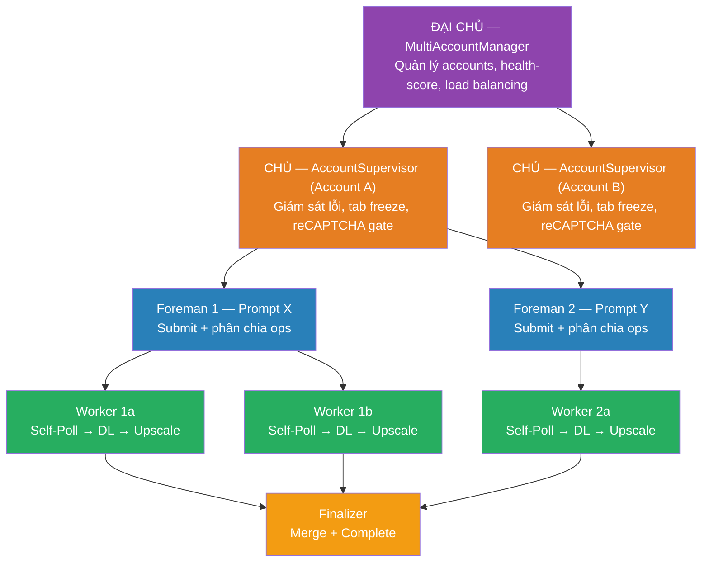
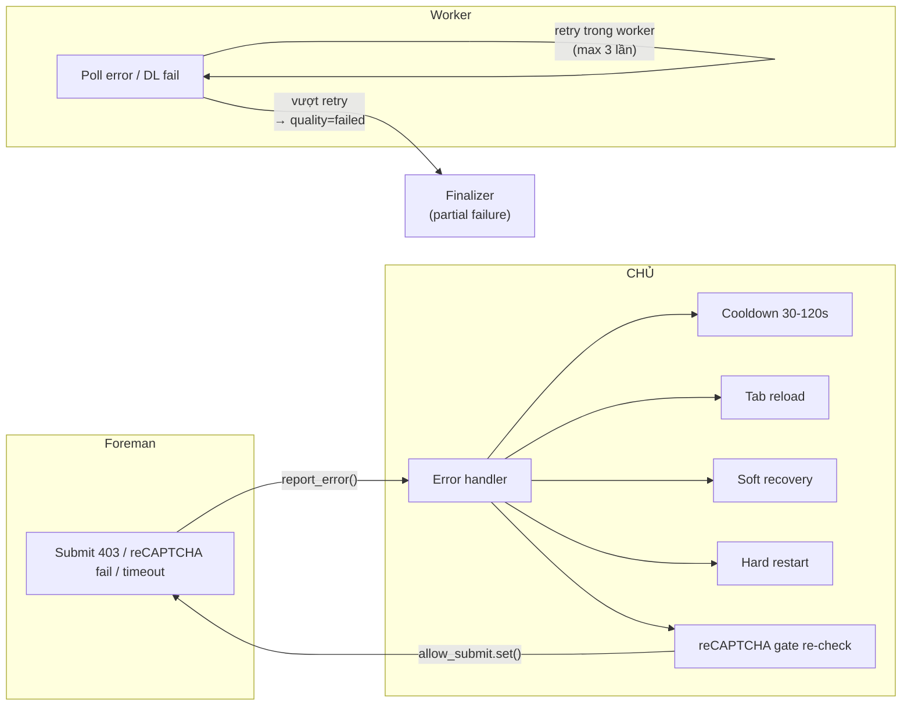
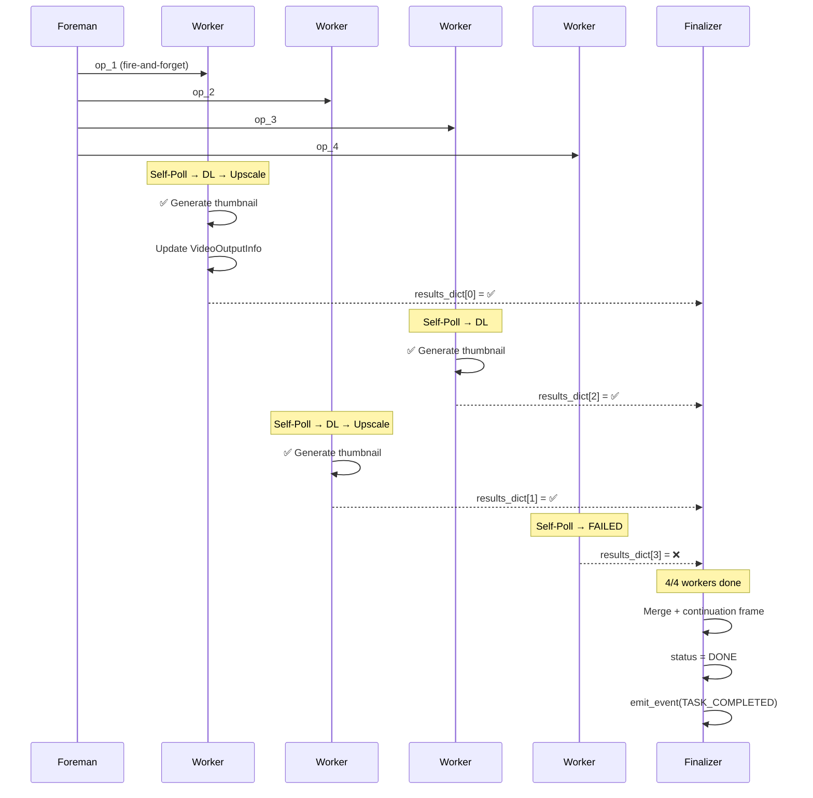
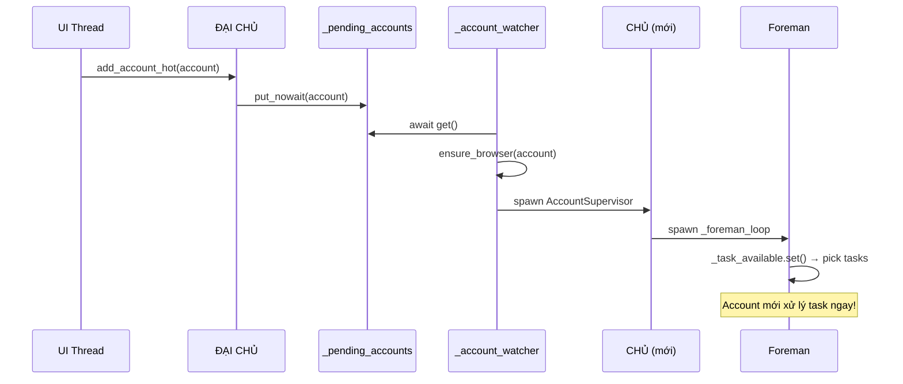
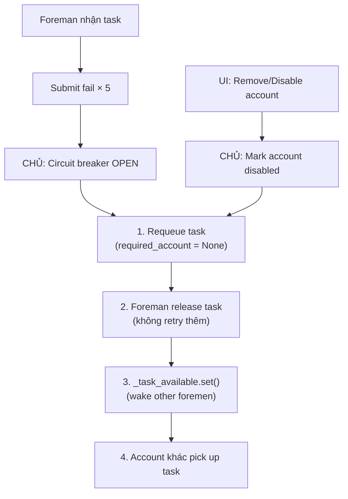
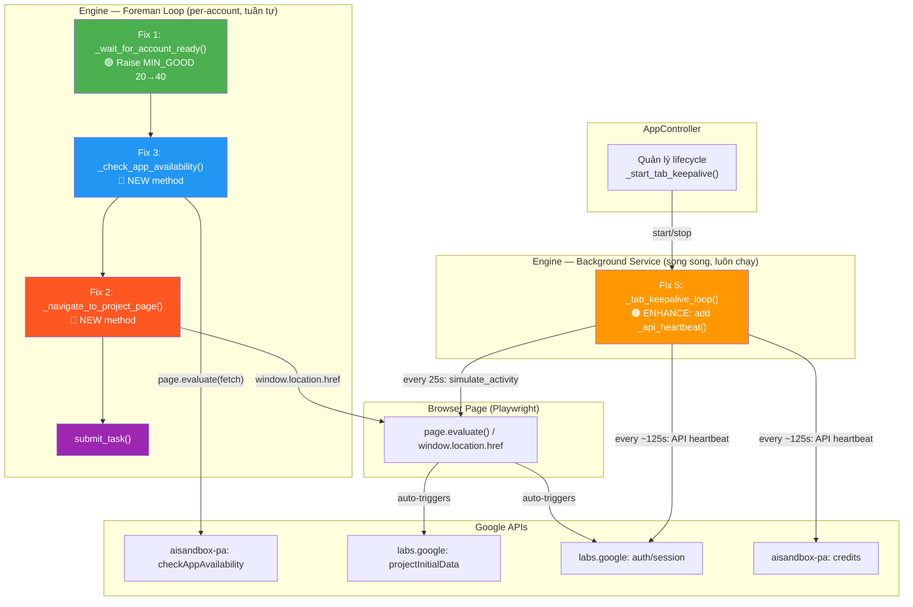
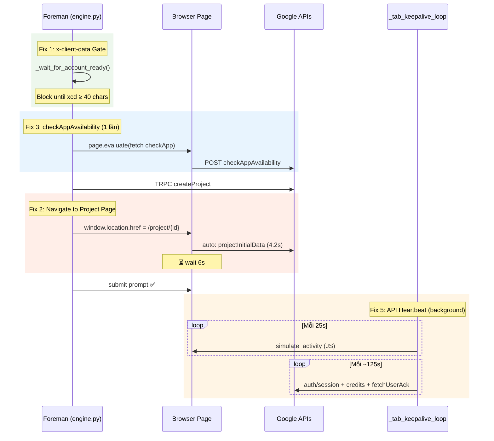

# Kế Hoạch Refactor: Kiến Trúc 4 Tầng ĐẠI CHỦ → CHỦ → FOREMAN → WORKER

## Mục tiêu

Tái cấu trúc engine theo đúng phân cấp 4 tầng, mỗi tầng có trách nhiệm rõ ràng:



---

## Phân Cấp Trách Nhiệm

| Tầng | Role | Trách nhiệm | Đã có? |
|------|------|-------------|--------|
| **ĐẠI CHỦ** | `MultiAccountManager` | Quản lý pool accounts, health-score load balancing, hot-add/remove | ✅ Đã có |
| **CHỦ** | `AccountSupervisor` (mới) | Nhận báo lỗi từ foreman, xử lý tab freeze, **reCAPTCHA gate** (token≥1000), circuit breaker, cooldown | ⚠️ Tách ra |
| **FOREMAN** | `_foreman_loop()` | Submit 1 prompt, nhận ops, phân chia cho workers | ⚠️ Refactor |
| **WORKER** | `_video_worker()` | Sở hữu 1 op: **tự poll** → download → upscale → report | ❌ Mới |
| **FINALIZER** | `_finalize_task()` | Chờ ALL workers → merge results → complete | ❌ Mới |

---

## Trách Nhiệm Chi Tiết Từng Tầng

### 1. ĐẠI CHỦ — `MultiAccountManager` (✅ Đã có, không thay đổi)

| | Mô tả |
|---|-------|
| **LÀM** | Quản lý pool accounts, health-score per account, load balancing (round-robin/ít lỗi nhất), hot-add/remove accounts, spawn 1 CHỦ per account |
| **KHÔNG làm** | ❌ Không submit prompt, không poll, không download, không xử lý lỗi 403/tab freeze |
| **Nhận từ** | UI (thêm/xóa account), CHỦ (health report) |
| **Giao cho** | CHỦ (AccountSupervisor) — mỗi account 1 CHỦ |
| **Code** | `Engine.start()` → `_spawn_account_supervisor()` per account |

### 2. CHỦ — `AccountSupervisor` (⚠️ Tách từ foreman loop)

| | Mô tả |
|---|-------|
| **LÀM** | (a) Nhận error report từ Foreman (403, reCAPTCHA fail, timeout); (b) Quyết định: cooldown / recovery / circuit break; (c) **reCAPTCHA gate**: chặn Foreman cho đến khi token ≥1000; (d) Tab freeze escalation (reload → soft → hard restart); (e) Cấp phép submit qua `allow_submit` Event |
| **KHÔNG làm** | ❌ Không submit prompt, không poll, không download, không upscale, không biết chi tiết ops/workers |
| **Nhận từ** | Foreman (`report_error(type, details)`) |
| **Giao cho** | Foreman (`allow_submit.set()` — clearance to proceed) |
| **Code** | `AccountSupervisor.run()` loop — xử lý error_queue |

### 3. FOREMAN — `_foreman_loop()` (⚠️ Refactor)

| | Mô tả |
|---|-------|
| **LÀM** | (a) `await supervisor.wait_for_clearance()` trước mỗi submit; (b) Lấy task từ queue (`acquire_workers`); (c) Ensure access_token; (d) **Submit prompt TUẦN TỰ** (1 API call + 1 reCAPTCHA per prompt); (e) Nhận `operation_names[]` + `scene_ids[]`; (f) **Pre-allocate** `VideoOutputInfo` slots (G9); (g) **Dispatch** N workers (fire-and-forget) + Finalizer; (h) Log identity mapping: Slot #i ← Worker #i ← op (G10); (i) Report error lên CHỦ khi submit fail |
| **KHÔNG làm** | ❌ Không poll ops (worker tự poll), ❌ không download, ❌ không upscale, ❌ không xử lý recovery (CHỦ xử lý), ❌ không chờ workers xong (Finalizer chờ) |
| **Nhận từ** | CHỦ (clearance), Queue (task) |
| **Giao cho** | Workers (ops + scene_ids), CHỦ (error reports) |
| **Code** | `_foreman_loop()` sequential submit loop → `_foreman_dispatch_workers()` → spawn workers |

### 4. WORKER — `_video_worker()` (❌ Mới)

| | Mô tả |
|---|-------|
| **LÀM** | **1 Worker = 1 Video lifecycle tự chủ hoàn toàn:** (a) **Tự poll op riêng** ~5s/lần via `_worker_poll_op()` (không cần reCAPTCHA); (b) Nhận SUCCESSFUL → download 720p via `_download_single()`; (c) Generate thumbnail cho video mình; (d) Update `task.video_outputs[index]` trực tiếp (quality, file, thumbnail); (e) Upscale nếu cần via `_upscale_single()` (cần reCAPTCHA); (f) Hoặc delegate upscale → UpscaleQueue (prompts_first mode); (g) Ghi kết quả vào `results_dict[index]` — báo cáo cho Finalizer |
| **KHÔNG làm** | ❌ Không submit prompt (Foreman), ❌ không xử lý recovery 403 / tab freeze (CHỦ), ❌ không merge results (Finalizer), ❌ không update global progress (Finalizer), ❌ không biết workers khác |
| **Nhận từ** | Foreman (op_name, scene_id, video_index) |
| **Giao cho** | Finalizer (results_dict), UpscaleQueue (nếu prompts_first) |
| **Code** | `_video_worker()` → `_worker_poll_op()` → `_download_single()` → `_upscale_single()` |

### 5. FINALIZER — `_finalize_task()` (❌ Mới)

| | Mô tả |
|---|-------|
| **LÀM** | (a) Chờ `asyncio.gather()` tất cả workers; (b) Đếm success/failed; (c) Partial failure → `_auto_retry_partial_failure()`; (d) Merge `output_uris` theo submit order; (e) Continuation frame (from video[0] only); (f) `complete_task()` + `save_manifest()`; (g) `emit_event(TASK_COMPLETED)`; (h) Update progress 85→100% |
| **KHÔNG làm** | ❌ Không poll, ❌ không download, ❌ không upscale, ❌ không submit |
| **Nhận từ** | Workers (results_dict, task.video_outputs đã update sẵn) |
| **Giao cho** | Dispatcher (complete), UI (events), ĐẠI CHỦ (health update) |
| **Code** | `_finalize_task()` |

### Error Escalation Path



> [!NOTE]
> **Worker errors (poll fail, download fail):** Worker tự retry (max 3), nếu vượt → mark failed, Finalizer xử lý partial failure.
> **Foreman errors (403, reCAPTCHA):** Escalate lên CHỦ → CHỦ quyết định recovery → Foreman chờ clearance.
> **Worker KHÔNG escalate lên CHỦ** trực tiếp — chỉ thông qua Foreman (nếu cần).

---

## Phase 0: Naming Convention Alignment (ĐỔI TÊN ĐỒNG NHẤT)

> [!CAUTION]
> **Vấn đề hiện tại:** Code hiện tại dùng tên hàm/biến/log mỗi nơi mỗi kiểu, gây nhầm lẫn nghiêm trọng giữa các vai trò.

### Bảng Audit — Tên hiện tại vs vai trò thực tế

| File | Tên hiện tại | Vai trò THỰC TẾ | Vấn đề |
|------|-------------|-----------------|--------|
| [worker.py](file:///D:/Music/Ruby/Produce%20for%20Customer/%23%23Tools/VEO%20Tool/%23NEW%20VEO%20API/02%20-%20CLIENT%20-%20VEO%20PRO%20MAX/core/worker.py) L1: docstring `"THỢ"` | `Worker` class | API executor — submit prompt, process response | ❌ Gọi "THỢ" nhưng thực ra là **bộ executor cho Foreman** |
| [worker.py](file:///D:/Music/Ruby/Produce%20for%20Customer/%23%23Tools/VEO%20Tool/%23NEW%20VEO%20API/02%20-%20CLIENT%20-%20VEO%20PRO%20MAX/core/worker.py) L60: docstring `"THỢ - Executes tasks"` | `Worker` class body | Foreman executor | ❌ "THỢ" = Worker nhưng lại dùng cho submit, không phải video lifecycle |
| [engine.py](file:///D:/Music/Ruby/Produce%20for%20Customer/%23%23Tools/VEO%20Tool/%23NEW%20VEO%20API/02%20-%20CLIENT%20-%20VEO%20PRO%20MAX/core/engine.py) L1269 | `_spawn_account_foreman()` tạo `Worker(worker_id="foreman-...")` | Foreman coroutine | ❌ **Dùng class `Worker` làm Foreman** — tên class vs vai trò mâu thuẫn |
| engine.py L1429 | `_account_foreman_loop(worker: Worker, ...)` | Foreman loop | ❌ Param gọi `worker` nhưng thực ra là **foreman** |
| engine.py L2412 | `_run_pipeline_bg()` | Pipeline (tên trung tính) | ⚠️ Không rõ vai trò: ai chạy pipeline? Foreman? Worker? |
| engine.py L2864 | `_poll_operation()` | Monolithic poller (tên trung tính) | ⚠️ Không rõ vai trò |
| [session.py](file:///D:/Music/Ruby/Produce%20for%20Customer/%23%23Tools/VEO%20Tool/%23NEW%20VEO%20API/02%20-%20CLIENT%20-%20VEO%20PRO%20MAX/core/session.py) L85 | `active_workers` — comment `"THỢ (videos)"` | **Capacity slots** — counting concurrent pipelines | ❌ `worker` ≠ video worker, đây là pipeline slot |
| session.py L86 | `max_workers` — comment `"1 THỢ = 1 video"` | Max concurrent pipelines | ❌ Sai: 1 "worker" = 1 pipeline (which has N videos) |
| session.py L131 | `available_workers` property | Available pipeline slots | ⚠️ Misleading — sounds like individual video workers |
| session.py L177 | `acquire_workers(n)` | Acquire N pipeline slots | ❌ `n` = output_count, không phải "workers" theo nghĩa mới |
| session.py L189 | `release_workers(n)` | Release pipeline slots | ❌ Cùng vấn đề |
| [upscale_queue.py](file:///D:/Music/Ruby/Produce%20for%20Customer/%23%23Tools/VEO%20Tool/%23NEW%20VEO%20API/02%20-%20CLIENT%20-%20VEO%20PRO%20MAX/core/upscale_queue.py) L286 | `self._workers` dict | Background upscale processors per account | ⚠️ Trùng tên với pipeline workers |
| upscale_queue.py L389 | `_worker_loop()` | Upscale processor loop | ⚠️ Trùng tên concept |
| engine.py L1115 | `Engine.start()` docstring: `"account (CHỦ)"`, `"queue (THẦU)"` | Start docstring | ❌ **CHỦ chỉ account** nhưng design mới: CHỦ = AccountSupervisor |
| engine.py L~1551 | Log: `[Foreman:{email}]` | Foreman log prefix | ✅ Đúng |
| engine.py L~3900 | Log: `[Foreman:{email}]` in `_wait_for_recaptcha_ready` | reCAPTCHA wait log | ❌ Đây là chức năng của **CHỦ** (gate), không phải Foreman |

### Rename Mapping — Quy ước đặt tên thống nhất

#### Quy tắc đặt tên

| Tầng | Prefix cho functions | Prefix cho logs | Class/Variable naming |
|------|---------------------|----------------|----------------------|
| **ĐẠI CHỦ** | `_master_*` | `[Master]` | `MultiAccountManager` (giữ nguyên) |
| **CHỦ** | `_supervisor_*` | `[Supervisor:{email}]` | `AccountSupervisor` |
| **FOREMAN** | `_foreman_*` | `[Foreman:{email}]` | Foreman coroutine (không cần class riêng) |
| **WORKER** | `_video_worker_*` | `[Worker:{email}:#{idx}]` | `_video_worker()` coroutine |

#### Rename Table — Đổi tên cụ thể

```diff
# ═══ worker.py ═══
- class Worker:          # "THỢ - Executes individual tasks"
+ class PromptExecutor:  # "Prompt API executor — submit + process response"

# ═══ engine.py — Functions ═══
- _spawn_account_foreman()
+ _spawn_account_supervisor()       # Spawns CHỦ (which spawns foreman loop)

- _account_foreman_loop(worker: Worker, ...)
+ _foreman_loop(executor: PromptExecutor, ...)  # Foreman loop — sequential submit

- _run_pipeline_bg()
+ _foreman_dispatch_workers()       # Foreman dispatches ops → workers

- _poll_operation()
+ (decomposed into)  _video_worker() + _worker_poll_op()  # Worker: 1 op lifecycle

- (new) _supervisor_run()           # CHỦ: error handling + gate

# ═══ engine.py — Log prefixes ═══
- log.info(f"[Foreman:{email}]")          # In _wait_for_recaptcha_ready
+ log.info(f"[Supervisor:{email}]")       # reCAPTCHA gate is CHỦ's job

# ═══ session.py — Fields (OPTIONAL, higher risk) ═══
- active_workers / max_workers             # "THỢ (videos)" 
+ active_pipelines / max_pipelines         # More accurate: counting pipeline slots
# OR keep `active_workers` nhưng update comments:
- # "Number of THỢ (videos) currently processing"
+ # "Number of concurrent pipeline slots in use (1 slot = 1 generation task)"

# ═══ session.py — Methods (OPTIONAL, higher risk) ═══
- acquire_workers(n) / release_workers(n)
+ acquire_slots(n) / release_slots(n)      # Reflect true meaning
# OR keep method names, update docstrings only

# ═══ upscale_queue.py ═══
- self._workers / _worker_loop()
+ self._upscale_processors / _upscale_processor_loop()  # Avoid confusion
```

> [!WARNING]
> **session.py renames (OPTIONAL):** `acquire_workers` → `acquire_slots` sẽ ảnh hưởng nhiều call sites trong `engine.py` và `account_manager.py`. Có thể giữ tên cũ + update comments/docstrings thay vì rename, để giảm risk.

> [!IMPORTANT]
> **Thứ tự thực hiện:** Phase 0 (naming) nên làm **CUỐI CÙNG** sau khi tất cả logic đã hoạt động đúng — tránh rename gây bugs trong quá trình refactor.

---

## Phase 1: Per-Video Worker Spawning (Worker Owns Poll)

> [!IMPORTANT]
> **Nguyên tắc:** Worker chịu trách nhiệm HOÀN TOÀN cho việc xử lý 1 video. Worker tự poll op riêng, tự download, tự upscale. Không có coordinator.

### [NEW] `WorkerVideoResult` Dataclass

```python
from dataclasses import dataclass, field
from typing import Optional

@dataclass
class WorkerVideoResult:
    """Kết quả từ 1 Worker — worker ghi vào results_dict[video_index]."""
    index: int
    op_name: str
    media_id: str = ""
    fife_url: str = ""
    file_720p: str = ""
    file_final: str = ""        # Path upscaled (1080p/4K) hoặc 720p nếu no-upscale
    quality: str = "pending"    # pending → polling → downloading → 720p → 1080p/4K → failed
    thumbnail_path: str = ""
    error: str = ""
```

> [!NOTE]
> Đặt trong `engine.py` hoặc tách riêng `core/models.py`. Import bởi `_video_worker()` và `_finalize_task()`.

### [MODIFY] [engine.py](file:///D:/Music/Ruby/Produce%20for%20Customer/%23%23Tools/VEO%20Tool/%23NEW%20VEO%20API/02%20-%20CLIENT%20-%20VEO%20PRO%20MAX/core/engine.py)

#### 1.1 Refactor `_run_pipeline_bg()` (L2412-2429) → `_foreman_dispatch_workers()`

**Hiện tại:** 1 coroutine → `_poll_operation()` xử lý tất cả ops.  
**Thay đổi:** Spawn N workers (1 per op) → await all → finalize:

```python
async def _foreman_dispatch_workers(self, task, account, worker_count):
    """Foreman dispatches ops → N autonomous workers → finalize."""
    try:
        ops = task.operation_names
        scene_ids = task.scene_ids
        results = {}  # video_index → WorkerVideoResult

        # Log phân chia ops
        for i, op in enumerate(ops):
            log.info(f"[Foreman] Task {task.id}: Worker #{i+1} ← op {op[:12]}...")

        # Spawn N autonomous workers (mỗi worker tự poll+DL+upscale)
        worker_tasks = [
            asyncio.create_task(
                self._video_worker(
                    task, account, op, scene_ids[i],
                    video_index=i, results_dict=results,
                )
            )
            for i, op in enumerate(ops)
        ]

        # Chờ TẤT CẢ workers hoàn thành
        await asyncio.gather(*worker_tasks, return_exceptions=True)

        # Finalize: merge results + complete
        await self._finalize_task(task, account, results)
    finally:
        if worker_count > 0:
            account.release_workers(worker_count)
```

#### 1.2 Thêm `_video_worker()` — per-video lifecycle (TỰ CHỦ HOÀN TOÀN)

```python
async def _video_worker(self, task, account, op_name, scene_id,
                        video_index, results_dict):
    """1 Worker = 1 Video: tự poll → download → upscale → report."""
    try:
        # ── Phase 1: TỰ POLL op riêng ──
        fife_url, media_id = await self._worker_poll_op(
            task, account, op_name, scene_id, video_index
        )
        if not fife_url:  # Op FAILED
            results_dict[video_index] = WorkerVideoResult(
                index=video_index, op_name=op_name,
                error="Generation failed", quality="failed",
            )
            return

        # ── Phase 2: Download 720p ──
        local_720p = await self._download_single(
            task, fife_url, video_index
        )

        # ── Phase 3: Upscale (nếu cần) ──
        local_final = local_720p
        quality = "720p"
        if task.download_quality != "720p" and media_id:
            local_upscaled = await self._upscale_single(
                task, account, media_id, local_720p, video_index
            )
            if local_upscaled:
                local_final = local_upscaled
                quality = task.download_quality

        # ── Report result ──
        results_dict[video_index] = WorkerVideoResult(
            index=video_index, op_name=op_name,
            media_id=media_id, fife_url=fife_url,
            file_720p=local_720p, file_final=local_final,
            quality=quality,
        )
    except Exception as e:
        log.error(f"[Worker:{account.email}:#{video_index}] Error: {e}")
        results_dict[video_index] = WorkerVideoResult(
            index=video_index, op_name=op_name,
            error=str(e), quality="failed",
        )
```

#### 1.3 Thêm `_worker_poll_op()` — per-worker poll (1 op per API call)

Tách logic poll từ `_poll_operation()` (L3016-3113). Mỗi worker gọi `check_status` với 1 op duy nhất:

```python
async def _worker_poll_op(self, task, account, op_name, scene_id, video_index):
    """Worker tự poll op riêng cho đến khi DONE.
    
    Returns: (fife_url, media_id) or (None, None) if FAILED.
    """
    from config.constants import AppConstants
    elapsed = 0
    max_poll_time = AppConstants.MAX_POLL_TIME
    status = "MEDIA_GENERATION_STATUS_PENDING"

    while elapsed < max_poll_time and not self._stop_event.is_set():
        # 2-phase poll interval
        base = (AppConstants.POLL_PHASE1_INTERVAL
                if elapsed < AppConstants.POLL_PHASE1_DURATION
                else AppConstants.POLL_PHASE2_INTERVAL)
        jitter = random.uniform(0, base * 0.3)
        await asyncio.sleep(base + jitter)
        elapsed += base + jitter

        # Cancellation check
        if task.state == TaskState.CANCELLED:
            return None, None

        try:
            token = await account.ensure_valid_token()
            if not token:
                continue

            # Per-worker poll: 1 op per API call
            sem = self._get_api_semaphore(account.email)
            async with sem:
                response = await self._api_client.check_status(
                    access_token=token,
                    recaptcha_token="",
                    operations=[{
                        "operation": {"name": op_name},
                        "sceneId": scene_id,
                        "status": status,
                    }],
                    account_headers=account.get_api_headers(),
                )

            if not response.success:
                if response.response_code == 401:
                    await account.refresh_access_token()
                continue

            ops = response.data.get("operations", [])
            if not ops:
                continue

            op = ops[0]
            op_status = op.get("status", "")

            if op_status == "MEDIA_GENERATION_STATUS_SUCCESSFUL":
                details = self._extract_output_details({"operations": [op]})
                if details:
                    return details[0]["fifeUrl"], details[0]["mediaId"]
                return None, None

            elif op_status == "MEDIA_GENERATION_STATUS_FAILED":
                error = op.get("error", {}).get("message", "")
                log.warning(f"[Worker:#{video_index}] Op FAILED: {error}")
                return None, None

            else:
                status = op_status  # Update for next poll

        except Exception as e:
            log.warning(f"[Worker:#{video_index}] Poll error: {e}")
            continue

    return None, None  # Timeout
```

> [!NOTE]
> **Trade-off:** Per-worker poll = N API calls/cycle thay vì 1 batch. Chấp nhận vì poll KHÔNG tốn reCAPTCHA/credits, API semaphore giới hạn 2 concurrent calls/account, và workers tự chủ = lỗi cách ly.

#### 1.4 Thêm `_download_single()` + `_upscale_single()`

Tách từ `_download_outputs()` (L5143) và `_auto_upscale()` (L4275) — wrapper cho 1 video.

#### 1.5 Thêm `_finalize_task()` — Merge + Complete

Chạy sau khi TẤT CẢ workers xong. Di chuyển merge logic từ L3391-3464:

```python
async def _finalize_task(self, task, account, results_dict):
    """Merge per-video results, continuation frame, complete task."""
    final_paths = []
    for i in sorted(results_dict.keys()):
        r = results_dict[i]
        vo = VideoOutputInfo(
            index=i, operation_name=r.op_name,
            media_id=r.media_id, quality=r.quality,
            file_720p=r.file_720p, file_upscaled=r.file_final,
        )
        task.video_outputs.append(vo)
        if r.file_final:
            final_paths.append(r.file_final)

    task.output_uris = final_paths
    self._sync_overall_upscale_status(task)

    # Continuation frame (from video[0] only)
    continuation = None
    if final_paths and self._dispatcher.has_children(task.id):
        continuation = await self._extract_continuation_frame(
            task, account, final_paths[0]
        )

    self._dispatcher.complete_task(task.id, ...)
    self._save_manifest(task)
```

#### 1.6 Checkpoint Resume Strategy

| Checkpoint | Ai resume? | Hành vi |
|-----------|-----------|--------|
| `SUBMITTED` | Foreman re-dispatch | Spawn workers với `task.operation_names` đã lưu |
| `GENERATED` | Workers (skip poll) | Worker nhận fifeUrl từ saved data → download trực tiếp |
| `DOWNLOADED_720` | Workers (skip poll+DL) | Worker chỉ upscale → report |
| `UPSCALING` | UpscaleQueue | Re-enqueue to background UpscaleQueue |
| `COMPLETED` | Skip | Không cần resume |

#### 1.7 Các logic bị ẩn trong `_poll_operation` cần chuyển

> [!CAUTION]
> Các logic sau hiện nằm trong `_poll_operation()` L2864-3499 nhưng **chưa được mô tả chi tiết** trong pseudo-code trên. Cần đảm bảo được chuyển đúng chỗ:

| # | Logic | Vị trí hiện tại | Chuyển vào | Ghi chú |
|---|-------|----------------|----------|--------|
| G1 | **Progress reporting** (`update_progress`) | L3017, L3162-3167, L3216, L3307, L3348, L3427, L3445 | `_worker_poll_op()` + `_finalize_task()` | Worker: progress 25-80% (poll). Finalizer: 85-100% |
| G2 | **Event emission** (`emit_event`) | L3123, L3210, L3455-3459, L3496 | `_video_worker()` (FAILED) + `_finalize_task()` (COMPLETED/PROGRESS) | Task events: TASK_FAILED, TASK_PROGRESS, TASK_COMPLETED |
| G3 | **Partial failure retry** (`_auto_retry_partial_failure`) | L3129-3158 | `_finalize_task()` | Khi một số ops failed, auto-retry các variants failed |
| G4 | **`decrement_running()`** | L3384 (720p_priority/prompts_first mode) | `_video_worker()` khi delegate upscale | ★ CRITICAL: Nếu không gọi → `running_count` không giảm → upscale deadlock |
| G5 | **`_error_count` tracking** | L2424, L3122-3127 | `_foreman_dispatch_workers()` (try/except) + `_finalize_task()` (all failed) | Cần increment `_error_count` khi task fail |
| G6 | **Cancellation handling** (`CancelledError`) | L2418, L3022 | `_video_worker()`, `_worker_poll_op()` | Worker phải cancellable — user có thể xóa task mid-poll |
| G7 | **UpscaleQueue (prompts_first mode)** | L3334-3389 | `_video_worker()` | Khi `prompts_first`: worker delegate upscale → UpscaleQueue, gọi `decrement_running()`, return sớm |
| G8 | **Continuation frame (3 locations)** | L3317-3332 (inline), L3351-3378 (background), L3428-3441 (post-process) | `_finalize_task()` (1 lần duy nhất) | Hiện tại 3 nơi extract frame — refactor vào Finalizer (1 lần) |
| G9 | **VideoOutputInfo pre-allocation** 🔴 | L3182-3202 (chỉ tạo SAU khi ALL ops done) | `_foreman_dispatch_workers()` tạo TRƯỚC | ★ CRITICAL: Hiện tại `video_outputs=[]` trong poll phase → UI không thấy per-video |
| G10 | **Worker identity tracking** 🔴 | Không có | `_foreman_dispatch_workers()` log + assign | Foreman phải ghi rõ: Worker #1 ← op_abc, Worker #2 ← op_xyz, poll tracing |

##### Chi tiết G9: Pre-Allocate VideoOutputInfo Slots tại Dispatch

> [!CAUTION]
> **Vấn đề hiện tại:** `task.video_outputs` được tạo từ L3182-3202 — **CHỈ SAU KHI TẤT CẢ ops đã complete**.
> Trong suốt giai đoạn poll (60-130s), `task.video_outputs = []` → UI (`app_controller.py` L3124-3136) không hiển thị bất kỳ per-video slot nào.

**Giải pháp: Foreman pre-allocate N slots ngay khi dispatch:**

```python
# Trong _foreman_dispatch_workers — TRƯỚC KHI spawn workers:
task.video_outputs = []
for i, op in enumerate(ops):
    vo = VideoOutputInfo(
        index=i,
        operation_name=op,
        scene_id=scene_ids[i] if i < len(scene_ids) else "",
        media_id="",          # Chưa biết — worker sẽ fill
        quality="polling",    # ★ Status mới: đang poll
    )
    task.video_outputs.append(vo)
    log.info(
        f"[Foreman:{account.email}] Task {task.id}: "
        f"Slot #{i} ← Worker #{i+1} ← op {op[:16]}..."
    )
```

**Worker update slot khi có progress:**

```python
# Trong _video_worker — mỗi giai đoạn:

# Phase 1: Poll started
task.video_outputs[video_index].quality = "polling"

# Phase 2: Op SUCCESSFUL → downloading
task.video_outputs[video_index].quality = "downloading"
task.video_outputs[video_index].media_id = media_id

# Phase 3: Download done → upscaling
task.video_outputs[video_index].quality = "720p"
task.video_outputs[video_index].file_720p = local_720p
# → Generate thumbnail tại đây
task.video_outputs[video_index].thumbnail_path = thumb_path

# Phase 4: Upscale done
task.video_outputs[video_index].quality = "1080p"  # or "4K"
task.video_outputs[video_index].file_upscaled = local_upscaled

# Phase X: Op FAILED
task.video_outputs[video_index].quality = "failed"
```

**UI impact — `border_color` cần update:**

```diff
# dispatcher.py — VideoOutputInfo.border_color
+ if self.quality == "polling":
+     return "gray"          # Đang chờ generate
+ if self.quality == "downloading":
+     return "orange"        # Đang download
  if self.upscale_status in ("submitting", "polling"):
      return "purple"
```

##### Chi tiết G10: Explicit Worker Identity Logging

```python
# Mọi log trong _video_worker và _worker_poll_op PHẢI có:
# [Worker:{email}:#{video_index}] — không dùng op_name (quá dài)

# Ví dụ dispatch log:
# [Foreman:user@gmail.com] Task abc: Slot #0 ← Worker #1 ← op dn3Kx7qB9m1L...
# [Foreman:user@gmail.com] Task abc: Slot #1 ← Worker #2 ← op pR8mZ2vN4wQ...
# [Foreman:user@gmail.com] Task abc: Slot #2 ← Worker #3 ← op kL5nY6tH7jS...
# [Foreman:user@gmail.com] Task abc: Slot #3 ← Worker #4 ← op wT9rX3cF2bU...

# Ví dụ worker poll log:
# [Worker:user@gmail.com:#0] Poll: PENDING → ACTIVE
# [Worker:user@gmail.com:#1] Poll: ACTIVE (40s elapsed)
# [Worker:user@gmail.com:#2] ✅ SUCCESSFUL → downloading
# [Worker:user@gmail.com:#3] ❌ FAILED: content policy
```

##### Chi tiết G1: Per-Worker Progress — Thumbnail + Report

> [!IMPORTANT]
> **User decision:** Mỗi Worker tự cập nhật **thumbnail riêng** khi hoàn thành, rồi **báo cáo lại** cho Foreman/Finalizer.
> Finalizer chờ tất cả workers xong → tổng hợp → status = DONE → thông báo.



**Luồng cụ thể trong code:**

```python
# _video_worker — Phase cuối: sau khi download/upscale xong
async def _video_worker(self, task, account, op_name, scene_id,
                        video_index, results_dict):
    # ... poll → download → upscale ...

    # ── Worker tự generate thumbnail ──
    thumb_path = await self._generate_thumbnail_for_worker(
        task, local_final, video_index
    )

    # ── Worker tự update VideoOutputInfo ──
    vo = VideoOutputInfo(
        index=video_index,
        operation_name=op_name,
        media_id=media_id,
        quality=quality,
        file_720p=local_720p,
        file_upscaled=local_final if quality != "720p" else "",
        thumbnail_path=thumb_path,
    )
    task.video_outputs[video_index] = vo  # Thread-safe: mỗi worker ghi index riêng

    # ── Báo cáo kết quả ──
    results_dict[video_index] = WorkerVideoResult(
        index=video_index, op_name=op_name,
        file_720p=local_720p, file_final=local_final,
        quality=quality, thumbnail_path=thumb_path,
    )
    # → Finalizer sẽ thấy results_dict[video_index] khi gather() hoàn tất
```

```python
# _finalize_task — Chờ TẤT CẢ workers → tổng hợp → DONE
async def _finalize_task(self, task, account, results_dict):
    """Finalizer: aggregate all worker results → status DONE."""

    # Đếm kết quả
    total = len(task.operation_names)
    success = sum(1 for r in results_dict.values() if r.quality != "failed")
    failed = total - success

    # Partial failure handling
    if failed > 0 and success > 0:
        self._auto_retry_partial_failure(task, failed, ...)
        self._dispatcher.update_progress(
            task.id, 85,
            f"⚠️ {success}/{total} done, {failed} retrying"
        )
    else:
        self._dispatcher.update_progress(task.id, 85, "✅ All generated")

    # Merge output paths
    task.output_uris = [
        r.file_final for r in sorted(results_dict.values(),
        key=lambda x: x.index) if r.file_final
    ]

    # Continuation frame (from video[0] only)
    if task.output_uris and self._dispatcher.has_children(task.id):
        await self._extract_continuation_frame(task, account, task.output_uris[0])

    # ★ Task = DONE
    self._dispatcher.complete_task(task.id, ...)
    self._save_manifest(task)
    emit_event(EventType.TASK_COMPLETED, {
        "task_id": task.id, "outputs": len(task.output_uris),
    }, source="engine")
```

> [!NOTE]
> **Thread safety:** `results_dict` là Python dict — mỗi worker ghi `results_dict[video_index]` riêng (index khác nhau) nên không race condition. `task.video_outputs` cũng an toàn vì mỗi worker ghi index riêng.

##### Chi tiết G7: UpscaleQueue Integration trong Worker

```python
# Trong _video_worker (khi prompts_first mode):
if pipeline_mode == "prompts_first":
    # Delegate upscale to background queue
    self._upscale_queue.enqueue(UpscaleJob(...))
    # ★ CRITICAL: decrement running count to unblock UpscaleQueue
    self._dispatcher.decrement_running()
    # Worker returns early — UpscaleQueue handles completion
    results_dict[video_index] = WorkerVideoResult(..., quality="720p")
    return
```

---

## Phase 2: Tầng CHỦ — AccountSupervisor

> [!IMPORTANT]
> **Tách trách nhiệm.** Hiện tại `_account_foreman_loop()` kiêm luôn: error handling, cooldown, circuit breaker, tab freeze, reCAPTCHA gate.
> CHỦ sẽ đảm nhận phần **giám sát + quyết định**, Foreman chỉ còn **thực thi**.

### [NEW] `AccountSupervisor` class hoặc coroutine

```python
class AccountSupervisor:
    """CHỦ — Account-level supervisor.

    Trách nhiệm:
    1. Nhận báo lỗi từ Foreman (403, reCAPTCHA fail, timeout)
    2. Quyết định: cooldown / recovery / circuit break
    3. Xử lý tab freeze (escalation: reload → soft → hard restart)
    4. reCAPTCHA readiness gate: chặn foreman cho đến khi token sẵn sàng
    5. Cấp phép cho foreman tiếp tục (allow_submit event)
    """

    def __init__(self, account: AccountManager, engine: 'Engine'):
        self.account = account
        self._engine = engine       # Needed for _do_browser_recovery()
        self._allow_submit = asyncio.Event()
        self._allow_submit.set()          # Mặc định cho phép
        self._error_queue = asyncio.Queue()  # Foreman gửi lỗi vào đây

    async def report_error(self, error_type: str, details: dict):
        """Foreman báo lỗi cho CHỦ."""
        await self._error_queue.put({"type": error_type, **details})

    async def wait_for_clearance(self):
        """Foreman gọi trước khi submit — chờ CHỦ cho phép."""
        await self._allow_submit.wait()

    async def run(self):
        """CHỦ loop — xử lý lỗi từ foreman."""
        while True:
            error = await self._error_queue.get()

            if error["type"] == "403":
                self._allow_submit.clear()           # Block foreman
                await self._handle_403(error)
                # Chờ reCAPTCHA sẵn sàng
                await self._recaptcha_gate()
                self._allow_submit.set()             # Cho phép foreman tiếp

            elif error["type"] == "tab_frozen":
                self._allow_submit.clear()
                await self._handle_tab_freeze(error)
                await self._recaptcha_gate()
                self._allow_submit.set()
```

### Tích hợp vào `_foreman_loop()` (formerly `_account_foreman_loop`)

**Hiện tại (L2034-2179):** Foreman tự xử lý recovery phases 0-3.
**Sau refactor:** Foreman gọi `supervisor.report_error()` → supervisor xử lý → foreman `await supervisor.wait_for_clearance()`.

```diff
- # ── Phase 0-3 recovery code (150+ lines) ──
- if recaptcha_fail or "403" in (result.error or ""):
-     ... (recovery logic) ...
+ # Foreman báo lỗi cho CHỦ
+ await self._supervisor.report_error("403", {
+     "error": result.error,
+     "attempt": attempt,
+     "task_id": task.id,
+ })
+ # Chờ CHỦ xử lý xong
+ await self._supervisor.wait_for_clearance()
```

---

## Phase 3: reCAPTCHA Token Gate ≥1000 chars

> [!NOTE]
> Kiểm tra ngưỡng reCAPTCHA token ≥1000 chars. Code hiện tại đã đạt chuẩn (readiness ≥1500, submit ≥1000).

### Vị trí thay đổi

| File | Vị trí | Hiện tại | Thay đổi |
|------|--------|---------|----------|
| [background.js](file:///D:/Music/Ruby/Produce%20for%20Customer/%23%23Tools/VEO%20Tool/%23NEW%20VEO%20API/02%20-%20CLIENT%20-%20VEO%20PRO%20MAX/extension/background.js) L595 | `check_recaptcha_ready` readiness check | `token.length >= 1500` | ✅ Đã ≥1500 — đúng |
| background.js L246 | `get_recaptcha_token` quality check | `token.length >= 1000` | ✅ Đã ≥1000 — đúng |
| background.js L784 | `submit_prompt` token check | `recaptchaToken.length < 1000` | ✅ Đã ≥1000 — đúng |

### CHỦ reCAPTCHA Gate (mới)

```python
async def _recaptcha_gate(self):
    """CHỦ chặn foreman cho đến khi reCAPTCHA sẵn sàng.

    Tiêu chí sẵn sàng: token length >= 1000 chars.
    Tiêu chí readiness trong extension: token.length >= 1500 (L595).
    """
    bridge = self.account.extension_bridge
    if not bridge:
        await asyncio.sleep(5.0)
        return

    while True:
        try:
            result = await bridge.check_recaptcha_ready(
                self.account.email, timeout=8.0
            )
            if result:
                # Extension đã xác nhận ready (token >= 1500)
                log.info(f"[Supervisor:{self.account.email}] ✅ reCAPTCHA gate OPEN")
                return
        except Exception:
            pass

        log.info(f"[Supervisor:{self.account.email}] ⏳ reCAPTCHA gate CLOSED — waiting...")
        await asyncio.sleep(3.0)
```

> [!NOTE]
> Hiện tại extension `check_recaptcha_ready` đã kiểm tra `token.length >= 1500` (L595).
> `submit_prompt` kiểm tra `token.length >= 1000` (L784).
> Cả hai đều > 1000 — đáp ứng yêu cầu. CHỦ sẽ dùng `check_recaptcha_ready` làm gate.

---

## Phase 4: CHỦ Xử Lý Tab Freeze

### Hiện tại (extension_bridge.py L1297-1347)

Tab freeze detection đã có trong `ExtensionBridge`:
- `_frozen_tab_counts` + `_FROZEN_ESCALATION_THRESHOLD = 3`
- Escalation: 3 frozen events in 5min → `on_tab_dead(email)`

### Thay đổi: CHỦ quyết định thay vì ExtensionBridge

```python
async def _handle_tab_freeze(self, error):
    """CHỦ xử lý tab đóng băng.

    Escalation:
    1. Lần 1-2: Reload tab via _trigger_refresh("full")
    2. Lần 3+: Soft browser recovery
    3. Lần 6+: Hard browser restart (last resort)
    """
    count = self._freeze_count
    email = self.account.email

    if count <= 2:
        log.info(f"[Supervisor:{email}] Tab freeze #{count} → reload tab")
        await self.account.extension_bridge._trigger_refresh(
            email, f"Supervisor: tab freeze #{count}", level="full"
        )
        await asyncio.sleep(20)  # Wait for reCAPTCHA re-init

    elif count <= 5:
        log.warning(f"[Supervisor:{email}] Tab freeze #{count} → soft recovery")
        await self._engine._do_browser_recovery(self.account, "supervisor", "soft")
        await asyncio.sleep(10)

    else:
        log.error(f"[Supervisor:{email}] Tab freeze #{count} → HARD restart")
        await self._engine._do_browser_recovery(self.account, "supervisor", "hard")
        await asyncio.sleep(15)
```

---

## Phase 5: Ops Distribution Verification

Foreman sau submit phải kiểm tra:

```python
# Sau khi nhận result.operation_names
expected = task.output_count or 1
actual = len(result.operation_names)

# Assertion: đủ ops
if actual < expected:
    log.warning(
        f"[Foreman] PARTIAL SUBMIT: {actual}/{expected} ops — "
        f"spawning {actual} workers only"
    )

# Phân chia 1:1 — đảm bảo không trùng
assert len(set(result.operation_names)) == actual, "Duplicate ops detected!"

for i, op in enumerate(result.operation_names):
    log.info(f"[Foreman] Task {task.id}: Worker #{i+1} ← op {op[:16]}...")
```

---

## Tổng Kết Thay Đổi

| File | Thay đổi | Phase |
|------|----------|-------|
| [worker.py](file:///D:/Music/Ruby/Produce%20for%20Customer/%23%23Tools/VEO%20Tool/%23NEW%20VEO%20API/02%20-%20CLIENT%20-%20VEO%20PRO%20MAX/core/worker.py) | Rename `Worker` → `PromptExecutor`, update docstrings | P0 |
| [engine.py](file:///D:/Music/Ruby/Produce%20for%20Customer/%23%23Tools/VEO%20Tool/%23NEW%20VEO%20API/02%20-%20CLIENT%20-%20VEO%20PRO%20MAX/core/engine.py) | Rename foreman/pipeline functions, align log prefixes | P0 |
| [session.py](file:///D:/Music/Ruby/Produce%20for%20Customer/%23%23Tools/VEO%20Tool/%23NEW%20VEO%20API/02%20-%20CLIENT%20-%20VEO%20PRO%20MAX/core/session.py) | Update comments/docstrings (OPTIONAL: rename fields) | P0 |
| [upscale_queue.py](file:///D:/Music/Ruby/Produce%20for%20Customer/%23%23Tools/VEO%20Tool/%23NEW%20VEO%20API/02%20-%20CLIENT%20-%20VEO%20PRO%20MAX/core/upscale_queue.py) | Rename `_workers` → `_upscale_processors` | P0 |
| engine.py | Refactor `_run_pipeline_bg`, thêm `_video_worker`, `_worker_poll_op`, `_download_single`, `_upscale_single`, `_finalize_task` | P1 |
| engine.py | Thêm `AccountSupervisor` class, tích hợp vào foreman loop | P2 |
| engine.py | Tách 150+ LOC recovery (L2034-2179) → `AccountSupervisor._handle_403()` | P2 |
| engine.py | Thêm `_recaptcha_gate()` trong `AccountSupervisor` | P3 |
| engine.py | Di chuyển tab freeze handling → `AccountSupervisor._handle_tab_freeze()` | P4 |
| engine.py | Thêm ops distribution logging + assertion | P5 |

> [!WARNING]
> **Không thay đổi:**
> - `MultiAccountManager` (Đại Chủ) — đã đúng vai trò
> - `background.js` reCAPTCHA checks — đã ≥1000/1500
> - `_run_t2i_pipeline_bg` — T2I flow khác (sync, no ops)
> - ~KHÔNG còn `_poll_coordinator`~ — worker tự poll riêng
>
> **Sẽ RENAME (Phase 0):**
> - `_spawn_account_foreman` → `_spawn_account_supervisor`
> - `_account_foreman_loop` → `_foreman_loop`
> - `_run_pipeline_bg` → `_foreman_dispatch_workers`
> - ~`_poll_operation` → `_poll_coordinator`~ → Thay bằng `_video_worker` + `_worker_poll_op`

---

## Phase 6: T2I Pipeline — Supervisor Integration

> [!NOTE]
> `_run_t2i_pipeline_bg()` (L2431) là **sync pipeline** (không có ops/poll — server trả kết quả trực tiếp).
> T2I **KHÔNG cần** worker spawning (Phase 1) nhưng **CẦN** AccountSupervisor gate (Phase 2).

### T2I cần dùng chung Supervisor:

| Cơ chế | Áp dụng cho T2I? | Lý do |
|:---|:---:|:---|
| `wait_for_clearance()` | ✅ | T2I cũng submit qua extension → cần reCAPTCHA gate |
| `report_error("403")` | ✅ | T2I cũng nhận 403 → CHỦ phải xử lý |
| `_video_worker()` | ❌ | T2I sync — không có ops để poll |
| `_finalize_task()` | ⚠️ Riêng | T2I có finalizer riêng (`_finalize_t2i_task`) |

```python
# Trong _run_t2i_pipeline_bg — thêm supervisor gate:
async def _run_t2i_pipeline_bg(self, task, account, supervisor, ...):
    # Chờ CHỦ cho phép
    await supervisor.wait_for_clearance()
    
    try:
        result = await worker.execute_t2i(...)
    except Exception as e:
        if "403" in str(e):
            await supervisor.report_error("403", {"task_id": task.id})
        raise
```

---

## Verification Plan

### Functional Tests
1. Submit prompt output_count=4 → verify 4 workers spawned, mỗi worker 1 op
2. 1 op FAILED → verify worker đó fail, 3 workers kia OK
3. Tab freeze → verify CHỦ reload tab + re-gate reCAPTCHA
4. 403 error → verify CHỦ block foreman + cooldown + re-gate
5. Partial submit (2/4 ops) → verify chỉ 2 workers, log warning

### Edge Cases
6. Cancellation mid-poll → verify coordinator + workers cancel
7. Token < 1000 chars → verify gate blocks foreman
8. Download fail 1 video → verify worker retry, other workers unaffected
9. Resume from checkpoint (SUBMITTED) → verify workers reconstruct
10. Hot-add account → verify Đại Chủ creates CHỦ + foreman

### DD1-DD4 Tests
11. **DD1 — Cross-account continuation:** Chain P1→P2, P1 on Acct A → verify P2 dispatched to Acct B (not locked to A), `_re_upload_continuation_frame()` called
12. **DD2 — Project ID:** Acct B picks up P2 → verify uses Acct B's `project_id` (not A's), API call succeeds
13. **DD3 — Hot-add:** Add Acct C while engine running → verify `_account_watcher` spawns `AccountSupervisor` → Foreman picks task within 5s
14. **DD4 — Failover:** Acct A circuit breaker trip (5× 403) → verify held task requeued with `required_account=None` → Acct B picks up within 10s
15. **DD4 — Hot-remove:** Disable Acct A from UI → verify all RUNNING tasks on A requeued → other accounts pick up

---

## Design Decisions

### DD1: Relaxed D2 — Cross-Account Continuation Chains

> [!IMPORTANT]
> **Thay đổi:** Bỏ `required_account` lock trên continuation children.
> Child task có thể chạy trên BẤT KỲ account khả dụng, không bắt buộc cùng account với parent.

**Lý do:**

| Yếu tố | Kết luận |
|:---|:---|
| **Upload frame** | ❌ Không cần reCAPTCHA (HAR verified, `api_client.py` L4119) |
| **`_re_upload_continuation_frame()`** | ✅ Đã có — upload lại file local cho account mới (`engine.py` L3666-3700) |
| **`continuation_frame_local_path`** | ✅ File local — bất kỳ account nào đều dùng được |
| **Chi phí re-upload** | ~1-2s (base64 encode + HTTP POST) |

**Pipeline overlap:**
```
D2 lock (1 account — serial):
Acct A: [P1: gen+DL+upscale] → [P2: gen+DL+upscale] → [P3: ...]
Total: 5 × 8-10 min = 40-50 phút

Relaxed D2 (multi-account — overlap):
Acct A: [P1: gen+DL] → extract frame → [upscale nền]
Acct B:               ↳ [P2: re-upload 1s + gen+DL] → extract → [upscale nền]
Acct C:                                               ↳ [P3: ...]
Total: ~16-18 phút (giảm ~60%)
```

**Code change:** `dispatcher.py` L738:
```diff
-task.required_account = parent_account  # D2: same account
+task.required_account = None  # DD1: any account can re-upload local frame
```

**Cũng cần xóa D2 lock tại:**
- `retry_task()` L978: `task.required_account = task.assigned_account`
- `retry_chain()` L1054: `root.required_account = root.assigned_account`

> [!NOTE]
> `activate_children_early()` (L3374) đã kích hoạt child SAU 720p download, TRƯỚC upscale — sẵn sàng cho pipeline overlap.

---

### DD2: Project ID Độc Lập Per Account

**Kết luận:** `project_id` KHÔNG phải ràng buộc kỹ thuật cho cross-account continuation.

| Endpoint | project_id dùng ở đâu? | Bắt buộc? |
|:---|:---|:---:|
| Video gen (T2V/I2V/R2V/F2V) | `clientContext.projectId` — metadata only | ⚠️ Optional |
| T2I | URL path `/v1/projects/{id}/flowMedia` | ✅ Required |
| Upload image | ❌ Không dùng | — |
| Poll status | ❌ Không dùng | — |
| Upscale video | ❌ Không dùng | — |

**Cách hoạt động:** Mỗi account tạo 1 `project_id` riêng (lazy init, `engine.py` L1592-1610) — tái sử dụng cho mọi task. Server dùng `mediaId` (từ upload) để link assets, KHÔNG enforce project ownership.

**Hệ quả:** Khi child chạy trên account khác → dùng project_id của account đó → hợp lệ. TaskGroup tracking nằm hoàn toàn client-side (Dispatcher).

---

### DD3: Hot-Add Account — ĐẠI CHỦ Spawn CHỦ Tức Thì

> [!IMPORTANT]
> Khi ĐẠI CHỦ thêm account mới lúc engine đang chạy, account phải được sử dụng **ngay lập tức** cho task distribution — không cần restart app.

**Hiện trạng (✅ đã implement):**

| Component | Code | Chức năng |
|:---|:---|:---|
| `add_account_hot()` | `engine.py` L1347-1373 | Thread-safe, gọi từ UI thread |
| `_pending_accounts` queue | `engine.py` L105 | asyncio.Queue bridge UI→engine |
| `_account_watcher()` | `engine.py` L1302-1345 | Background coroutine, poll queue, spawn foreman |
| UI integration | `app_controller.py` L1998 | Gọi `engine.add_account_hot(acc_mgr)` |

**Mapping sang 4-layer architecture:**



**Cần thay đổi khi refactor:**
- `_account_watcher()` hiện gọi `_spawn_account_foreman()` → đổi thành `_spawn_account_supervisor()`
- CHỦ mới tự spawn Foreman bên trong
- `_task_available.set()` (L1339) đã có — wakes idle foremen

**DD3 ↔ Phase 2 wiring — `_account_watcher` spawn AccountSupervisor:**

```python
# _account_watcher() — sau khi ensure_browser:
async def _account_watcher(self, tg: asyncio.TaskGroup):
    while not self._stop_event.is_set():
        account = await asyncio.wait_for(
            self._pending_accounts.get(), timeout=2.0
        )
        # ...(existing browser setup)...

        # DD3: Spawn AccountSupervisor (CHỦ) thay vì foreman trực tiếp
        supervisor = AccountSupervisor(account, engine=self)
        self._supervisors[account.email] = supervisor  # Track for DD4

        # CHỦ tự spawn foreman bên trong
        tg.create_task(supervisor.run())             # CHỦ error handler loop
        tg.create_task(self._foreman_loop(
            executor=PromptExecutor(...),
            account=account,
            supervisor=supervisor,                   # Foreman nhận ref đến CHỦ
        ))

        self._active_account_emails.add(account.email)
        self._task_available.set()  # Wake idle foremen
```

---

### DD4: Account Failover — Tái Phân Phối Task Ngay Lập Tức

> [!IMPORTANT]
> Khi 1 account bị **ngắt kết nối** hoặc **liên tục lỗi 5 lần submit** (circuit breaker trip), task đang giữ phải được **tái phân phối** cho account khác — KHÔNG chờ recovery.

**Hiện trạng (⚠️ chỉ block, không redistribute):**

| Cơ chế | Code | Hành vi hiện tại | Vấn đề |
|:---|:---|:---|:---|
| Circuit breaker trip | `engine.py` L481-506 | Block foreman (evt.clear) | Foreman **giữ task**, chờ recovery |
| `CIRCUIT_TRIP_THRESHOLD` | L464 | = 5 consecutive 403s | ✅ Threshold đúng |
| Foreman blocked | `_wait_for_circuit()` L558 | Sleep cho đến breaker close | ❌ Task bị kẹt trên account chết |

**Lỗ hổng:** Khi circuit breaker OPEN, foreman vẫn **giữ task** trong retry loop → task không quay về queue → không account nào khác pick up được.

**Cần thêm — Failover flow:**



**Code changes cần thiết:**

1. **Khi circuit breaker trip** (`_trip_circuit_breaker`):
    - CHỦ phải yêu cầu Foreman release task hiện tại
    - Task được `requeue_task()` với `required_account = None`
    - Foreman thoát retry loop, quay về pick task mới (sau khi breaker close)

2. **Khi UI remove/disable account** (hot-remove):
    - Tương tự: tất cả tasks đang RUNNING trên account đó → `requeue_task()`
    - Clear `required_account = None` trên mỗi task
    - Foreman coroutine nhận cancel signal → thoát sạch

3. **Foreman check trước mỗi retry:**
    ```python
    # Pseudo-code trong foreman retry loop:
    if circuit_state[account.email] == "open":
        task.required_account = None  # DD1: allow any account
        dispatcher.requeue_task(task)  # Back to global queue
        break  # Exit retry loop — task will be picked by another foreman
    ```

**Cơ chế cancel Foreman (G-B):**

```python
class AccountSupervisor:
    def __init__(self, ...):
        # ...
        self._foreman_abort = asyncio.Event()  # DD4: signal foreman to release task

    def abort_foreman(self):
        """Signal foreman to release held task immediately."""
        self._foreman_abort.set()

    def clear_abort(self):
        """Reset after foreman has released task."""
        self._foreman_abort.clear()

# Trong _trip_circuit_breaker:
def _trip_circuit_breaker(self, email, reason):
    # ...existing logic...
    supervisor = self._supervisors.get(email)
    if supervisor:
        supervisor.abort_foreman()  # Signal foreman ngay lập tức

# Trong _foreman_loop — trước mỗi retry:
async def _foreman_loop(self, executor, account, supervisor, ...):
    while True:
        task = await dispatcher.get_next_task(account)
        for attempt in range(max_retries):
            # DD4: Check abort signal TRƯỚC mỗi retry
            if supervisor._foreman_abort.is_set():
                task.required_account = None
                dispatcher.requeue_task(task)
                supervisor.clear_abort()
                break  # Release task, pick new one after breaker closes

            await supervisor.wait_for_clearance()
            result = await executor.execute(task, account)
            # ...
```

> [!NOTE]
> Kết hợp với DD1 (Relaxed D2): task requeue sẽ có `required_account = None` → bất kỳ account khả dụng nào pick up → tận dụng pipeline overlap.

---

### DD5: Worker Ownership Chain — Truy Vết Chủ Sở Hữu Worker

> [!IMPORTANT]
> **Vấn đề:** Worker (`_video_worker`) nhận `account: AccountManager` nhưng **không có reference** ngược lên `AccountSupervisor` (CHỦ). Foreman cũng không truyền supervisor xuống worker. Log chỉ ghi `[Worker:#0]` — không rõ ai quản lý worker này.

**Hiện trạng (❌ thiếu):**

| Component | Nhận `account` | Nhận `supervisor` | Có thể trace CHỦ? |
|:---|:---:|:---:|:---:|
| `_foreman_loop()` | ✅ | ✅ `self._supervisors.get(email)` | ✅ |
| `_foreman_dispatch_workers()` | ✅ | ❌ | ❌ |
| `_video_worker()` | ✅ | ❌ | ❌ |
| `UpscaleJob` | ✅ `account_email` | ❌ | ❌ |

**Ownership Chain mong muốn:**

```
CHỦ (AccountSupervisor)
 ├── account: AccountManager
 ├── email: str
 └── Foreman (_foreman_loop)
      ├── supervisor: AccountSupervisor  ← back-reference
      └── Worker (_video_worker)
           ├── owner_email: str          ← from account
           └── supervisor: AccountSupervisor  ← can report upward
```

**Code changes:**

```diff
# _foreman_dispatch_workers — thêm supervisor param
 async def _foreman_dispatch_workers(
-    self, task: Task, account: AccountManager, worker_count: int
+    self, task: Task, account: AccountManager, worker_count: int,
+    supervisor: 'AccountSupervisor' = None
 ):

# _video_worker — nhận supervisor
 async def _video_worker(
     self, task: Task, account: AccountManager,
     op_name: str, scene_id: str, video_index: int,
     results_dict: Dict[int, 'WorkerVideoResult'],
+    supervisor: 'AccountSupervisor' = None,
 ):

# _foreman_loop — pass supervisor xuống
+supervisor = self._supervisors.get(account.email)
 bg_task = asyncio.create_task(
-    self._foreman_dispatch_workers(task, account, workers_acquired)
+    self._foreman_dispatch_workers(task, account, workers_acquired,
+                                   supervisor=supervisor)
 )
```

**Log format mới:**

| Trước | Sau |
|:---|:---|
| `[Worker:#0]` | `[Worker:abc14@z-98:V0]` |
| `[Worker:#1]` | `[Worker:levanlinh:V1]` |

---

### DD6: Upscale Account Failover — Chuyển Upscale Sang Account Khỏe

> [!IMPORTANT]
> **Vấn đề:** `UpscaleJob.account_email` hardcode lúc enqueue → retry giữ nguyên account → nếu account chết (tab freeze, reCAPTCHA timeout) thì upscale kẹt vĩnh viễn. DD4 chỉ failover generation tasks, KHÔNG failover upscale jobs.

**Hiện trạng (❌ thiếu failover):**

| Flow | account_email | Failover? |
|:---|:---|:---:|
| Enqueue (`engine.py` L2871) | `account_email=email` (hardcode) | ❌ |
| Retry (`upscale_queue.py` L1064) | `account_email=job.account_email` (copy) | ❌ |
| Worker loop (`upscale_queue.py` L389) | Per-account queue | ❌ |

**Giải pháp: Failover khi account unhealthy:**

```python
# Trong _process_job — detect broken account and try failover:
account = self._get_account(job.account_email)

# Failover: if primary account unhealthy, try other accounts
if not account or self._is_on_cooldown(job.account_email):
    for alt in self._get_all_accounts():
        if alt.email != job.account_email and not self._is_on_cooldown(alt.email):
            log.warning(
                f"[UpscaleQueue] Failover: {job.account_email} → {alt.email}"
            )
            account = alt
            job.account_email = alt.email  # Rebind
            break
```

**Thêm `original_account` vào `UpscaleJob`:**

```diff
 @dataclass
 class UpscaleJob:
     task_id: str
     account_email: str
+    original_account: str = ""  # Who generated the video (for tracing)
     ...
```

**Log format mới khi failover:**

```
[UpscaleQueue] Failover: abc14@z-98.com → levanlinh@gmail.com (original unhealthy)
[UpscaleQueue] Upscale task_8:V0 via levanlinh (originally abc14)
```

> [!NOTE]
> DD6 kết hợp với DD4 và DD5: khi circuit breaker trip (DD4), CHỦ signal abort → Foreman release generation task → **đồng thời** UpscaleQueue failover upscale jobs sang account khỏe (DD6). Worker ownership chain (DD5) cho phép trace ngược lại account gốc.

---

## Appendix A: Complete Feature → Role Mapping

> [!IMPORTANT]
> Bảng này liệt kê **TẤT CẢ** tính năng hiện tại trong `_account_foreman_loop()` (L1429-2410) và `_poll_operation()` (L2864-3499), xác định từng tính năng thuộc vai trò nào sau refactor.
>
> **Legend:** GIỮ = giữ nguyên vị trí, CHUYỂN = di chuyển sang vai trò mới, MỚI = code mới

### A1. Foreman Loop — Pre-Submit Features (L1429-1731)

| # | Tính năng | Line hiện tại | Vai trò MỚI | Thay đổi |
|---|-----------|:---:|:---:|:---:|
| F01 | Readiness gate (`_wait_for_account_ready`) | L1444 | **CHỦ** (e) cấp phép | CHUYỂN |
| F02 | reCAPTCHA pre-warm | L1449-1455 | **CHỦ** (c) reCAPTCHA gate | CHUYỂN |
| F03 | R2V image pre-upload (`_pre_upload_r2v_images`) | L1459 | **FOREMAN** | GIỮ |
| F04 | Pause/resume check (`_pause_event`) | L1467-1473 | **FOREMAN** | GIỮ |
| F05 | Staggered startup delay | L1477-1485 | **FOREMAN** | GIỮ |
| F06 | 2-phase worker admission (`acquire_workers`) | L1488-1545 | **FOREMAN** | GIỮ |
| F07 | Cooldown check before submit | L1495-1498 | **CHỦ** (b) cooldown | CHUYỂN |
| F08 | Account reset pause | L1502-1508 | **CHỦ** (b) recovery | CHUYỂN |
| F09 | Task queue (`get_next_task`) | L1513 | **FOREMAN** | GIỮ |
| F10 | Task notification wait (`_task_available`) | L1518-1525 | **FOREMAN** | GIỮ |
| F11 | Account affinity (continuation tasks) | L1558-1568 | **FOREMAN** | GIỮ |
| F12 | Cancellation check (pre-submit) | L1572-1576 | **FOREMAN** | GIỮ |
| F13 | Lazy browser start | L1579-1585 | **CHỦ** (e) cấp phép | CHUYỂN |
| F14 | Project creation (TRPC) | L1592-1610 | **FOREMAN** | GIỮ |
| F15 | Paygate tier detection | L1613-1614 | **FOREMAN** | GIỮ |
| F16 | Task STARTED event + callback | L1617-1625 | **FOREMAN** | GIỮ |
| F17 | Stage router (checkpoint resume) | L1629-1644 | **FOREMAN** | GIỮ |
| F18 | Per-account rate lock | L1648-1649 | **FOREMAN** | GIỮ |
| F19 | Image upload (I2V/R2V/F2V) | L1660-1689 | **FOREMAN** | GIỮ |
| F20 | Continuation frame re-upload | L1694-1709 | **FOREMAN** | GIỮ |
| F21 | Adaptive retry count (chain bonus) | L1711-1720 | **FOREMAN** | GIỮ |
| F22 | Pre-warm idle detection (`_maybe_prewarm`) | L1730 | **CHỦ** (b) recovery | CHUYỂN |

### A2. Foreman Loop — Submit + Retry (L1732-2201)

| # | Tính năng | Line hiện tại | Vai trò MỚI | Thay đổi |
|---|-----------|:---:|:---:|:---:|
| F23 | Cooldown + circuit breaker gate (per retry) | L1737-1744 | **CHỦ** (b) cooldown | CHUYỂN |
| F24 | reCAPTCHA readiness gate (per retry) | L1750-1763 | **CHỦ** (c) reCAPTCHA gate | CHUYỂN |
| F25 | Continuation frame re-upload on retry | L1766-1774 | **FOREMAN** | GIỮ |
| F26 | Inside-rate-lock cooldown re-check | L1782-1796 | **CHỦ** (b) cooldown | CHUYỂN |
| F27 | Anti-detect delay (BurstController) | L1798-1814 | **FOREMAN** | GIỮ |
| F28 | Extension bridge submit (primary) | L1820-1958 | **FOREMAN** | GIỮ |
| F29 | Worker.execute() submit (fallback) | L1960-1968 | **FOREMAN** | GIỮ |
| F30 | Token invalidation (post-submit) | L1980 | **FOREMAN** | GIỮ |
| F31 | Network error → auto-pause | L1988-1996 | **CHỦ** (a) error report | CHUYỂN |
| F32 | Auth error handling | L1999-2000 | **FOREMAN** | GIỮ |
| F33 | 403/reCAPTCHA → recovery state machine (Phase 0-3) | L2034-2179 | **CHỦ** (b) recovery | CHUYỂN |
| F34 | Circuit breaker record | L2040 | **CHỦ** (b) circuit break | CHUYỂN |
| F35 | Cooldown set (per 403) | L2045 | **CHỦ** (b) cooldown | CHUYỂN |
| F36 | Smart-Hide browser show/re-hide | L2132-2137, L2227-2239 | **CHỦ** (b) recovery | CHUYỂN |
| F37 | Account reset + Variations copy | L2158-2171 | **CHỦ** (b) recovery | CHUYỂN |
| F38 | Non-reCAPTCHA error → header refresh | L2181-2194 | **CHỦ** (b) recovery | CHUYỂN |

### A3. Foreman Loop — Post-Submit (L2203-2410)

| # | Tính năng | Line hiện tại | Vai trò MỚI | Thay đổi |
|---|-----------|:---:|:---:|:---:|
| F39 | Recovery state reset on success | L2217-2225 | **CHỦ** (b) recovery | CHUYỂN |
| F40 | BurstController record success | L1985 | **FOREMAN** | GIỮ |
| F41 | Smart-hide re-hide countdown | L2227-2239 | **CHỦ** (b) recovery | CHUYỂN |
| F42 | Partial submit detection | L2248-2267 | **FOREMAN** | GIỮ |
| F43 | Fire-and-forget pipeline launch | L2275-2280 | **FOREMAN** → dispatch | CHUYỂN (→ `_foreman_dispatch_workers`) |
| F44 | T2I sync pipeline launch | L2290-2300 | **FOREMAN** | GIỮ (separate flow) |
| F45 | Auth error → fail task + event | L2314-2327 | **FOREMAN** | GIỮ |
| F46 | Auto-retry chain roots | L2334-2351 | **FOREMAN** | GIỮ |
| F47 | Permanent fail + `_error_count` | L2353-2370 | **FOREMAN** | GIỮ |
| F48 | Worker cleanup (finally) | L2375-2380 | **FOREMAN** | GIỮ |
| F49 | Active pipeline tracking + cleanup | L1462, L2404-2410 | **FOREMAN** | GIỮ |

### A4. Poll Operation → Worker/Finalizer (L2864-3499)

| # | Tính năng | Line hiện tại | Vai trò MỚI | Thay đổi |
|---|-----------|:---:|:---:|:---:|
| P01 | 2-phase poll intervals | L2903-2910 | **WORKER** | CHUYỂN |
| P02 | Cancellation check in poll | L2919-2922 | **WORKER** | CHUYỂN |
| P03 | Token refresh during poll | L2927-2932 | **WORKER** | CHUYỂN |
| P04 | API semaphore (`_get_api_semaphore`) | L2938 | **WORKER** | CHUYỂN |
| P05 | Batch status check API call | L2940-2960 | **WORKER** (1 op/call) | CHUYỂN |
| P06 | 401 → token refresh | L2968 | **WORKER** | CHUYỂN |
| P07 | Per-op status tracking (PENDING→ACTIVE→DONE) | L2975-3010 | **WORKER** | CHUYỂN |
| P08 | Progress reporting (poll phase, 25-80%) | L3017, L3162-3167 | **WORKER** (per-slot) | CHUYỂN |
| P09 | `_extract_output_details()` | L3086 | **WORKER** | CHUYỂN |
| P10 | VideoOutputInfo creation | L3182-3202 | **FOREMAN** (pre-alloc) + **WORKER** (fill) | CHUYỂN |
| P11 | Media ID extraction | L3208 | **WORKER** | CHUYỂN |
| P12 | Download 720p (`_download_outputs`) | L3219-3260 | **WORKER** (`_download_single`) | CHUYỂN |
| P13 | Thumbnail generation | L3219 | **WORKER** | CHUYỂN |
| P14 | Dual upscale mode (inline vs UpscaleQueue) | L3268-3389 | **WORKER** | CHUYỂN |
| P15 | `decrement_running()` (prompts_first) | L3384 | **WORKER** | CHUYỂN |
| P16 | Continuation frame extraction (3 locations) | L3317, L3351, L3428 | **FINALIZER** (1 lần) | CHUYỂN |
| P17 | `_auto_retry_partial_failure()` | L3129-3158 | **FINALIZER** | CHUYỂN |
| P18 | `complete_task()` + `save_manifest()` | L3455-3496 | **FINALIZER** | CHUYỂN |
| P19 | Event emission (TASK_COMPLETED) | L3455-3496 | **FINALIZER** | CHUYỂN |
| P20 | `_error_count` increment | L3122-3127 | **FINALIZER** (all fail) | CHUYỂN |
| P21 | Timeout handling (max poll time) | L2907-2911 | **WORKER** | CHUYỂN |

### A5. Tổng Hợp Thay Đổi

| Vai trò | GIỮ | CHUYỂN vào | Tổng features |
|---------|:---:|:---:|:---:|
| **CHỦ** (AccountSupervisor) | 0 | 18 features (F01,F02,F07,F08,F13,F22-F24,F26,F31,F33-F39,F41) | 18 |
| **FOREMAN** | 22 features | 1 (F43 → dispatch) | 23 |
| **WORKER** | 0 | 17 features (P01-P15,P21 + new) | 17 |
| **FINALIZER** | 0 | 5 features (P16-P20) | 5 |

> [!WARNING]
> **12 features chưa có pseudo-code trong Phase 1-5 — mapping theo trách nhiệm CHỦ (a-e):**
>
> | Feature | Trách nhiệm CHỦ | Ghi chú |
> |---------|:---:|--------|
> | F01: Readiness gate | **(e) Cấp phép** | CHỦ chặn Foreman cho đến khi account sẵn sàng |
> | F02: reCAPTCHA pre-warm | **(c) reCAPTCHA gate** | CHỦ đảm bảo token ≥1000 trước submit |
> | F07: Cooldown check | **(b) Cooldown** | CHỦ gate: chặn Foreman khi đang cooldown |
> | F08: Account reset pause | **(b) Recovery** | CHỦ chặn Foreman khi đang recovery/reset |
> | F13: Lazy browser start | **(e) Cấp phép** | CHỦ đảm bảo browser ready trước submit |
> | F22: Pre-warm idle | **(b) Recovery** | CHỦ detect idle → soft recovery tự động |
> | F31: Network error → pause | **(a) Error report** | CHỦ nhận error → auto-pause engine |
> | F33: 403 recovery Phase 0-3 | **(b) Recovery** | CHỦ escalation: reload → soft → hard → give up |
> | F36: Smart-Hide show/re-hide | **(b) Recovery** | CHỦ show browser khi 403 Phase 2, re-hide sau 3 success |
> | F37: Variations copy | **(b) Recovery** | CHỦ Phase 2 exhausted → copy Variations + restart |
> | F39: Recovery state reset | **(b) Recovery** | CHỦ clear state khi Foreman submit thành công |
> | F41: Smart-hide countdown | **(b) Recovery** | CHỦ countdown re-hide sau success |
>
> **6 features GIỮ FOREMAN — chưa ghi rõ trong Phase nhưng không cần thay đổi:**
> - F03: R2V pre-upload, F05: Staggered startup, F14: Project creation
> - F15: Paygate tier, F42: Partial submit detection, F46: Auto-retry chain

---

## Appendix: reCAPTCHA Trust Fix — Phân Vai Trách Nhiệm

> [!IMPORTANT]
> **Context:** Phân tích HAR F12 (files 01-05) phát hiện 4 root causes gây 403. Mỗi fix được giao cho tầng phù hợp nhất trong kiến trúc 4 tầng.

### Fix Mapping → 4-Layer Architecture



### Bảng Phân Vai Chi Tiết

| Fix | Root Cause | Tầng | Vai trò xử lý | File + Method | Khi nào chạy |
|:----|:-----------|:-----|:---------------|:--------------|:-------------|
| **Fix 1** | RC1: x-client-data ngắn | **Foreman** | Gate readiness | `engine.py` → `_wait_for_account_ready()` L696 | Trước MỖI vòng submit |
| **Fix 2** | RC2: Browser ở sai URL | **Foreman** | Navigate browser | `engine.py` → `_navigate_to_project_page()` NEW | Sau `createProject`, trước submit |
| **Fix 3** | RC3: Thiếu startup signal | **Foreman** | API startup call | `engine.py` → `_check_app_availability()` NEW | 1 lần khi Foreman bắt đầu |
| **Fix 5** | RC4: Không có API keepalive | **Background** | API heartbeat | `engine.py` → `_api_heartbeat()` NEW in `_tab_keepalive_loop()` | Mỗi ~125s (5 × 25s cycles) |

### Execution Flow — Thứ Tự Khi Submit Task



### Quan hệ với Feature Mapping hiện có

| Fix | Liên quan Feature | Ghi chú |
|:----|:-----------------|:--------|
| Fix 1 | F01 (Readiness gate) | Mở rộng gate: thêm điều kiện x-client-data ≥ 40 |
| Fix 2 | F14 (Project creation) | Bổ sung: sau create → navigate browser |
| Fix 3 | Mới | Startup signal — chưa có trong feature list |
| Fix 5 | F22 (Pre-warm idle) | Mở rộng: ngoài simulate_activity, thêm API heartbeat |

