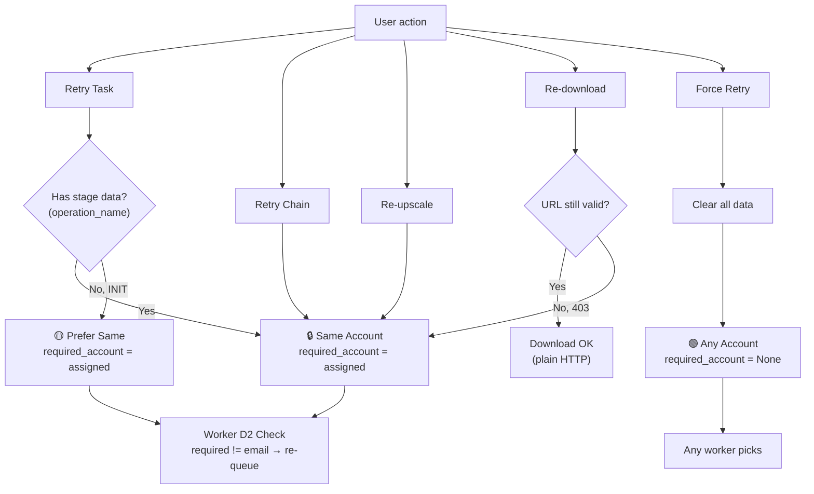

# Account Affinity Rules — Task Retry & Reprocess

> Tài liệu phân tích chi tiết quy tắc gắn kết tài khoản (account affinity) cho từng loại thao tác retry/reprocess trên prompt/video.

## 1. Dữ liệu Account-Bound

| Data | Bound? | Giải thích |
|------|:------:|---|
| `project_id` | ✅ | Project tạo bởi account A → chỉ A truy cập |
| `access_token` | ✅ | Token xác thực per-session per-account |
| `media_id` | ✅ | Upscale API cần token + media_id cùng account |
| `operation_name` | ✅ | Polling cần token của account đã submit |
| `scene_id` | ✅ | Dùng trong upscale, bound với account |
| `continuation_frame_uri` | ✅ | Image URI upload bởi account A → chỉ A dùng được |
| `output_uris` (FIFE URL) | ⚠️ | Download không cần auth, nhưng **URL hết hạn** → re-poll cần cùng account |
| `file_720p` / `file_upscaled` | ❌ | File local, không phụ thuộc account |
| `prompt` / settings | ❌ | Text, không bind account |

---

## 2. Quy tắc Affinity theo Operation

```
┌────────────────────────────┬──────────────────────┬──────────────────────────────────────┐
│     Operation              │  Account Rule        │  Lý do                               │
├────────────────────────────┼──────────────────────┼──────────────────────────────────────┤
│ Retry (has stage data)     │ 🔒 required_account  │ operation_name cần cùng token         │
│ Retry chain (continuation) │ 🔒 required_account  │ frame_uri + project_id account-bound  │
│ Re-upscale (all/single)    │ 🔒 assigned_account  │ media_id + token cùng account          │
│ Re-download (URL expired)  │ 🔒 assigned_account  │ URL hết hạn → re-poll cần cùng account │
│ Retry (INIT, no data)      │ 🟡 prefer same       │ Có project_id sẵn, tránh tạo lại      │
│ Force retry (full reset)   │ 🟢 any account       │ Xóa hết data bound → generate mới      │
└────────────────────────────┴──────────────────────┴──────────────────────────────────────┘
```

### 🔒 MUST Same Account (Bắt buộc)

#### Re-upscale (all / single video)
- **API call**: `upscale_video(access_token, media_id, ...)`
- `media_id` thuộc về account gốc → account khác sẽ bị 403
- **Code**: `_get_account_for_reupscale()` → Priority 1: `task.assigned_account`

#### Continuation Chain
- Parent tạo `continuation_frame_uri` bằng cách upload image → URI bound với parent's account
- Children kế thừa `project_id` của parent
- **Code**: `_resolve_dependencies()` → `task.required_account = parent_account`

#### Retry từ stage SUBMITTED+
- Task đã có `operation_name` → polling cần `access_token` cùng account
- **Code**: `retry_task()` → `task.required_account = task.assigned_account`

#### Re-download
- FIFE URL (`https://lh3.google.com/...`) download bằng plain HTTP GET (không auth header)
- **Tuy nhiên** URL **có thời hạn** — HTTP 403 = expired
- Khi expired, phải re-poll `operation_name` bằng cùng account để lấy URL mới

### 🟡 SHOULD Same Account (Nên giữ)

#### Retry từ INIT stage
- Task chưa submit → chưa có data account-bound
- Nhưng nếu giữ cùng account → dùng `project_id` sẵn có, tránh tạo project mới
- Account khác cũng hoạt động (sẽ tạo project riêng)

### 🟢 CAN Switch Account (Có thể đổi)

#### Force Retry (Full Reset)
- Xóa toàn bộ: `output_uris`, `media_ids`, `operation_names`, `video_outputs`
- **Không còn data account-bound** → generate hoàn toàn mới
- **Code**: `force_retry_task()` → `assigned_account = None`, `required_account = None`

---

## 3. Cơ chế hoạt động trong Code

### Worker Loop — D2 Account Affinity Check
```
engine.py → _account_worker_loop() → L505-511

if task.required_account and task.required_account != account.email:
    # Re-queue task → chỉ worker đúng account mới pick được
    self._dispatcher.submit_task(task)
    account.release_slot()
    continue
```

### Retry Flow
```
dispatcher.py → retry_task()

task.state = READY
task.required_account = task.assigned_account  # Pin to same account
_enqueue_task(task, priority=0)                # High priority
```

### Re-upscale Flow
```
app_controller.py → _get_account_for_reupscale()

Priority 1: task.assigned_account → get_account(email)    ✅ exact match
Priority 2: Any account with valid token                   ⚠️ fallback
Priority 3: First account (will refresh token internally)  ⚠️ last resort
```

### Force Retry Flow
```
dispatcher.py → force_retry_task()

# Clear ALL account-bound data
task.output_uris.clear()
task.operation_names.clear()
task.upscale_media_ids.clear()
task.video_outputs.clear()

# Allow any account
task.assigned_account = None
task.required_account = None
```

---

## 4. Diagram


