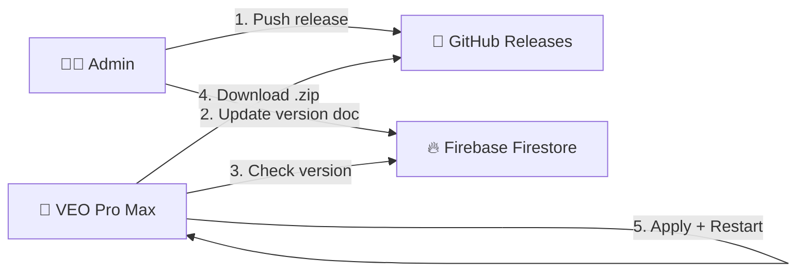
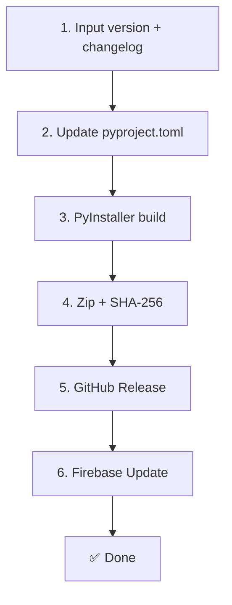
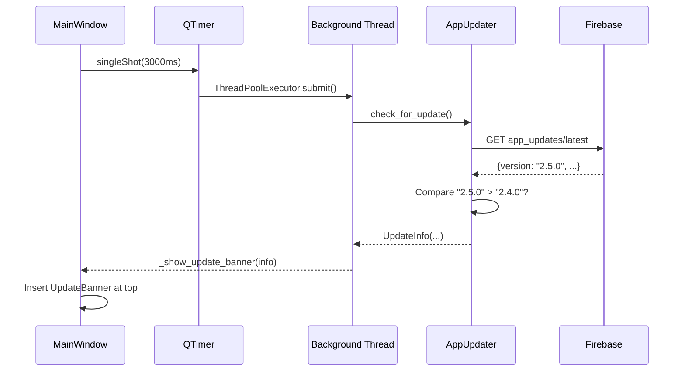
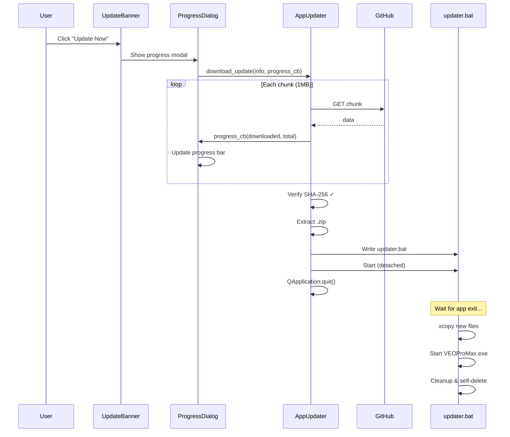
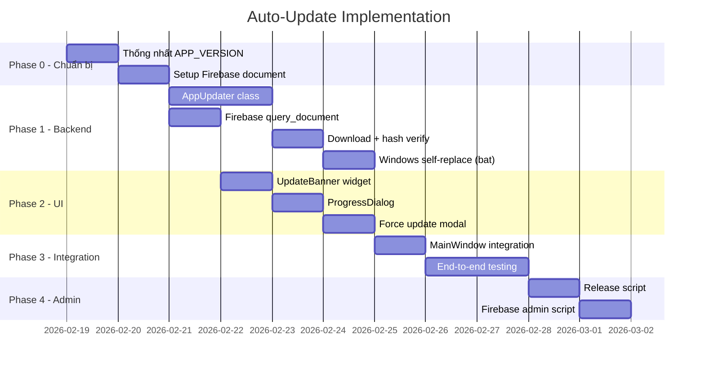

# 🔄 Auto-Update System — Architecture & Implementation Guide

> **Status**: 📋 Planning  
> **Priority**: High  
> **Depends on**: Firebase REST Client, License System  
> **Version**: 1.0 Draft — 2026-02-18

---

## 1. Tổng quan (Overview)

### 1.1 Mục tiêu

Cung cấp khả năng tự cập nhật cho VEO Pro Max khi phân phối dạng `.exe` (PyInstaller):

| Mục tiêu | Mô tả |
|-----------|--------|
| **Phát hiện** | Kiểm tra phiên bản mới khi khởi động app |
| **Thông báo** | Hiển thị banner trong app khi có update |
| **Tải & Cài** | Một nút "Update Now" → tải + cài tự động |
| **Hot-reload** | Tự khởi động lại app sau khi cập nhật |

### 1.2 Kiến trúc tổng thể



### 1.3 Tại sao GitHub + Firebase?

| Phương án | Ưu điểm | Nhược điểm |
|-----------|----------|------------|
| Chỉ GitHub API | Đơn giản | ❌ Private repo cần PAT trong client (lộ key) |
| Chỉ Firebase | An toàn | ❌ Firebase Storage phí cao cho file lớn |
| **GitHub + Firebase** | ✅ An toàn, ✅ Free hosting | Cần 2 bước khi release |

**Kết luận**: Firebase lưu metadata (version, URL, hash) → Client đọc Firebase → Tải file từ GitHub Release.

---

## 2. Các giai đoạn triển khai (Implementation Phases)

### 📌 Phase 0: Chuẩn bị (Prerequisites)

> Thống nhất version và chuẩn bị Firebase.

#### Bước 0.1 — Thống nhất APP_VERSION

**Vấn đề hiện tại**: 3 giá trị version khác nhau:

| File | Giá trị | Vị trí |
|------|---------|--------|
| `config/constants.py` | `1.0.0` | `AppConstants.APP_VERSION` |
| `main.py` | `2.0.0` | `app.setApplicationVersion()` |
| `security/license_client.py` | `2.4.0` | `LicenseClient.APP_VERSION` |
| `pyproject.toml` | `?.?.?` | `project.version` |

**Giải pháp**: Tất cả đọc từ **một nguồn duy nhất** — `pyproject.toml`:

```python
# config/constants.py
import tomllib
from pathlib import Path

def _read_version() -> str:
    try:
        toml = Path(__file__).parent.parent / "pyproject.toml"
        with open(toml, "rb") as f:
            return tomllib.load(f)["project"]["version"]
    except Exception:
        return "0.0.0"

class AppConstants:
    APP_VERSION = _read_version()  # Single source of truth
```

#### Bước 0.2 — Tạo Firebase Document

Tạo document trong Firestore (dùng Firebase Console hoặc REST API):

```
Collection : app_updates
Document   : latest
```

| Field | Type | Giá trị ví dụ | Mô tả |
|-------|------|---------------|--------|
| `version` | string | `"2.5.0"` | Phiên bản mới nhất |
| `download_url` | string | `"https://github.com/.../releases/download/v2.5.0/veo-pro-max.zip"` | URL tải |
| `changelog` | string | `"- Fix 403 errors\n- New UI"` | Ghi chú thay đổi |
| `sha256` | string | `"a1b2c3..."` | Hash SHA-256 của file .zip |
| `force_update` | boolean | `false` | Bắt buộc update (modal không đóng được) |
| `min_version` | string | `"2.0.0"` | Phiên bản tối thiểu được phép chạy |
| `released_at` | timestamp | `"2026-02-18T20:00:00Z"` | Ngày release |
| `file_size` | integer | `52428800` | Kích thước file (bytes) để hiện progress |

#### Bước 0.3 — GitHub Release Setup

Khi release phiên bản mới:

```bash
# 1. Build .exe (PyInstaller)
pyinstaller --onedir --name VEOProMax main.py

# 2. Zip dist folder
cd dist && zip -r veo-pro-max-v2.5.0.zip VEOProMax/

# 3. Tính SHA-256
certutil -hashfile veo-pro-max-v2.5.0.zip SHA256

# 4. Tạo GitHub Release
gh release create v2.5.0 veo-pro-max-v2.5.0.zip \
    --title "VEO Pro Max v2.5.0" \
    --notes "- Fix 403 errors"

# 5. Cập nhật Firebase (admin script hoặc Firebase Console)
# → Cập nhật app_updates/latest với version, URL, hash
```

---

### 📌 Phase 1: Backend — Update Checker (`core/updater.py`)

> Module kiểm tra và tải update.

#### Bước 1.1 — Data Classes

```python
@dataclass
class UpdateInfo:
    """Thông tin phiên bản mới."""
    version: str            # "2.5.0"
    download_url: str       # GitHub Release URL
    changelog: str          # Ghi chú thay đổi
    sha256: str             # Hash để verify
    file_size: int          # Bytes
    force_update: bool      # Bắt buộc?
    min_version: str        # Phiên bản tối thiểu
    released_at: str        # Ngày release

class UpdateStatus(Enum):
    """Trạng thái update."""
    UP_TO_DATE = "up_to_date"
    AVAILABLE = "available"
    DOWNLOADING = "downloading"
    DOWNLOADED = "downloaded"
    APPLYING = "applying"
    FAILED = "failed"
```

#### Bước 1.2 — AppUpdater Class

```python
class AppUpdater:
    """Quản lý toàn bộ lifecycle update."""
    
    COLLECTION = "app_updates"
    DOC_ID = "latest"
    UPDATE_DIR = Path(os.environ.get("TEMP", "/tmp")) / "veo_update"
```

**Các method chính:**

| Method | Input | Output | Mô tả |
|--------|-------|--------|--------|
| `check_for_update()` | — | `Optional[UpdateInfo]` | Check Firebase, so sánh version |
| `download_update(info, progress_cb)` | UpdateInfo, callback | `Path` (zip file) | Tải .zip, verify hash |
| `apply_update(zip_path)` | Path | `bool` | Extract, tạo bat, restart |

#### Bước 1.3 — Version Comparison Logic

```python
from packaging.version import Version

def _is_newer(remote: str, local: str) -> bool:
    """So sánh semantic version."""
    try:
        return Version(remote) > Version(local)
    except Exception:
        return remote != local
```

#### Bước 1.4 — Firebase Query (tái sử dụng FirebaseRESTClient)

```python
def check_for_update(self) -> Optional[UpdateInfo]:
    """Kiểm tra phiên bản mới từ Firebase."""
    client = FirebaseRESTClient()
    
    # Query app_updates/latest (giống query_license nhưng generic)
    doc = client.query_document(
        project_id=config.get_primary_config()["project_id"],
        api_key=config.get_primary_config()["api_key"],
        collection="app_updates",
        doc_id="latest"
    )
    
    if not doc:
        return None
    
    remote_version = doc.get("version", "0.0.0")
    local_version = AppConstants.APP_VERSION
    
    if not self._is_newer(remote_version, local_version):
        return None  # Đã là phiên bản mới nhất
    
    return UpdateInfo(
        version=remote_version,
        download_url=doc["download_url"],
        changelog=doc.get("changelog", ""),
        sha256=doc.get("sha256", ""),
        file_size=doc.get("file_size", 0),
        force_update=doc.get("force_update", False),
        min_version=doc.get("min_version", "0.0.0"),
        released_at=doc.get("released_at", ""),
    )
```

#### Bước 1.5 — Download với Progress

```python
async def download_update(
    self, info: UpdateInfo, 
    progress_cb: Callable[[int, int], None] = None
) -> Path:
    """Tải file update từ GitHub Release.
    
    Args:
        info: UpdateInfo từ check_for_update()
        progress_cb: callback(downloaded_bytes, total_bytes)
    
    Returns:
        Path đến file .zip đã tải
    """
    self.UPDATE_DIR.mkdir(parents=True, exist_ok=True)
    zip_path = self.UPDATE_DIR / f"veo-pro-max-v{info.version}.zip"
    
    async with aiohttp.ClientSession() as session:
        async with session.get(info.download_url) as resp:
            total = info.file_size or int(resp.headers.get("Content-Length", 0))
            downloaded = 0
            
            with open(zip_path, "wb") as f:
                async for chunk in resp.content.iter_chunked(1024 * 1024):
                    f.write(chunk)
                    downloaded += len(chunk)
                    if progress_cb:
                        progress_cb(downloaded, total)
    
    # Verify SHA-256
    if info.sha256:
        actual_hash = hashlib.sha256(zip_path.read_bytes()).hexdigest()
        if actual_hash != info.sha256:
            zip_path.unlink()
            raise ValueError(f"Hash mismatch: expected {info.sha256}, got {actual_hash}")
    
    return zip_path
```

#### Bước 1.6 — Apply Update (Windows Self-Replace)

```python
def apply_update(self, zip_path: Path) -> bool:
    """Giải nén và tạo updater script.
    
    Flow:
    1. Giải nén zip → temp/veo_update/extracted/
    2. Tạo updater.bat
    3. Chạy updater.bat (detached process)
    4. Thoát app hiện tại
    """
    extract_dir = self.UPDATE_DIR / "extracted"
    
    # 1. Giải nén
    with zipfile.ZipFile(zip_path, "r") as zf:
        zf.extractall(extract_dir)
    
    # 2. Xác định đường dẫn
    app_dir = Path(sys.executable).parent  # Thư mục chứa .exe
    exe_name = Path(sys.executable).name   # VEOProMax.exe
    
    # 3. Tạo updater.bat
    bat_path = self._write_updater_script(
        src=extract_dir,
        dst=app_dir,
        exe_name=exe_name
    )
    
    # 4. Chạy bat (detached) → bat sẽ đợi app tắt → copy → restart
    subprocess.Popen(
        f'cmd /c "{bat_path}"',
        shell=True,
        creationflags=subprocess.CREATE_NEW_PROCESS_GROUP | subprocess.DETACHED_PROCESS
    )
    
    # 5. Thoát app
    log.info("[Updater] Update script launched. Exiting for update...")
    QApplication.instance().quit()
    
    return True
```

**Nội dung `updater.bat`:**

```batch
@echo off
title VEO Pro Max Updater
echo ══════════════════════════════════════
echo   VEO Pro Max — Updating to v%VERSION%
echo ══════════════════════════════════════
echo.
echo Waiting for app to close...
timeout /t 3 /nobreak >nul

REM Kiểm tra app đã tắt chưa
:wait_loop
tasklist /FI "IMAGENAME eq %EXE_NAME%" 2>nul | find /I "%EXE_NAME%" >nul
if not errorlevel 1 (
    echo Still running, waiting...
    timeout /t 1 /nobreak >nul
    goto wait_loop
)

echo Copying new files...
xcopy /E /Y /Q "%SRC_DIR%\*" "%DST_DIR%\"
if errorlevel 1 (
    echo ERROR: Copy failed!
    pause
    exit /b 1
)

echo Starting new version...
start "" "%DST_DIR%\%EXE_NAME%"

echo Cleaning up...
rmdir /S /Q "%TEMP_DIR%"

echo Update complete!
timeout /t 2 /nobreak >nul
del "%~f0"
```

---

### 📌 Phase 2: UI — Update Banner & Progress Dialog

> Giao diện thông báo và cài đặt update.

#### Bước 2.1 — UpdateBanner Widget

File: `ui/components/update_banner.py`

```
┌─────────────────────────────────────────────────────────────────────────┐
│ 🔄 Phiên bản mới v2.5.0 — Fix 403 errors, New UI    [Update Now] [×] │
└─────────────────────────────────────────────────────────────────────────┘
```

| Widget | Type | Mô tả |
|--------|------|--------|
| Icon | QLabel | 🔄 hoặc ⚠️ (force update) |
| Message | QLabel | "Phiên bản mới v{x} — {changelog_short}" |
| Update Button | QPushButton | Xanh dương, bắt đầu tải |
| Close Button | QPushButton | × đóng banner (ẩn nếu không force) |
| Progress Bar | QProgressBar | Hiện khi đang tải (0-100%) |

**Styling** (Catppuccin theme):

```python
BANNER_STYLE = f"""
    QFrame {{
        background: qlineargradient(x1:0, y1:0, x2:1, y2:0,
            stop:0 {Theme.BLUE}22, stop:1 {Theme.MAUVE}22);
        border: 1px solid {Theme.BLUE}44;
        border-radius: {Theme.RADIUS_MD}px;
        padding: 8px 16px;
    }}
"""
```

#### Bước 2.2 — UpdateProgressDialog

Khi user bấm "Update Now" → hiện dialog:

```
┌─────────────────────────────────────┐
│     🔄 Đang cập nhật VEO Pro Max   │
│                                     │
│  Tải xuống v2.5.0...                │
│  ████████████████░░░░░░░  72%       │
│  36.2 MB / 50.0 MB                  │
│                                     │
│              [Cancel]               │
└─────────────────────────────────────┘
```

#### Bước 2.3 — Force Update Modal

Khi `force_update = true`:

```
┌─────────────────────────────────────┐
│     ⚠️ Cập nhật bắt buộc           │
│                                     │
│  Phiên bản hiện tại không còn       │
│  được hỗ trợ. Vui lòng cập nhật    │
│  lên v2.5.0 để tiếp tục sử dụng.   │
│                                     │
│         [Update Now]                │
└─────────────────────────────────────┘
```

- Modal dialog: `setWindowModality(Qt.ApplicationModal)`
- Không có nút đóng
- Không cho phép tương tác app cho đến khi update

---

### 📌 Phase 3: Tích hợp (Integration)

> Kết nối các module vào app.

#### Bước 3.1 — Sửa FirebaseRESTClient

Thêm method generic `query_document()`:

```python
# firebase_rest_client.py
def query_document(self, project_id, api_key, collection, doc_id):
    """Query bất kỳ document nào từ Firestore (không giới hạn _lic).
    
    Tái sử dụng cho: license check, update check, remote config.
    """
    base = _ConfigParts._get_api_base()
    url = f"{base}/projects/{project_id}/databases/(default)/documents/{collection}/{doc_id}"
    
    response = self._session.get(url, params={"key": api_key}, timeout=self.TIMEOUT)
    if response.status_code == 200:
        return self._parse_document(response.json())
    return None
```

#### Bước 3.2 — Sửa MainWindow (ui/app.py)

```python
class MainWindow(QMainWindow):
    def __init__(self, ...):
        ...
        self._setup_update_checker()
    
    def _setup_update_checker(self):
        """Kiểm tra update sau 3 giây (không block startup)."""
        QTimer.singleShot(3000, self._check_for_updates)
    
    def _check_for_updates(self):
        """Background check → hiện banner nếu có update."""
        from concurrent.futures import ThreadPoolExecutor
        
        def _check():
            updater = AppUpdater()
            return updater.check_for_update()
        
        def _on_result(future):
            info = future.result()
            if info:
                self._show_update_banner(info)
        
        executor = ThreadPoolExecutor(max_workers=1)
        future = executor.submit(_check)
        future.add_done_callback(_on_result)
    
    def _show_update_banner(self, info: UpdateInfo):
        """Hiển thị banner update phía trên tab bar."""
        banner = UpdateBanner(info, parent=self)
        banner.update_requested.connect(self._start_update)
        
        # Chèn banner vào layout
        central_layout = self.centralWidget().layout()
        central_layout.insertWidget(0, banner)
    
    def _start_update(self, info: UpdateInfo):
        """Bắt đầu tải và cài update."""
        dialog = UpdateProgressDialog(info, parent=self)
        dialog.exec()
```

#### Bước 3.3 — Sửa constants.py

```python
class AppConstants:
    APP_NAME = "VEO Pro Max"
    APP_VERSION = _read_version()  # Từ pyproject.toml
    
    # Update
    UPDATE_CHECK_ENABLED = True
    UPDATE_COLLECTION = "app_updates"
    UPDATE_DOC_ID = "latest"
```

---

### 📌 Phase 4: Admin Tools

> Công cụ để admin publish update dễ dàng.

#### Bước 4.1 — Release Script (`scripts/release.py`)

Script tự động hóa quy trình release:

```python
"""
Usage: python scripts/release.py 2.5.0 "Fix 403 errors, New UI"

Steps:
1. Update pyproject.toml version
2. Build PyInstaller exe
3. Zip dist folder
4. Calculate SHA-256
5. Create GitHub Release + upload
6. Update Firebase app_updates/latest
"""
```

Flow:



#### Bước 4.2 — Firebase Admin Update

```python
# scripts/update_firebase.py
import requests

def update_latest_version(version, download_url, changelog, sha256, file_size):
    """Cập nhật document app_updates/latest trên Firebase.
    
    Sử dụng Firebase REST API với admin API key.
    """
    project_id = "veo-pro-max"
    url = f"https://firestore.googleapis.com/v1/projects/{project_id}/databases/(default)/documents/app_updates/latest"
    
    payload = {
        "fields": {
            "version": {"stringValue": version},
            "download_url": {"stringValue": download_url},
            "changelog": {"stringValue": changelog},
            "sha256": {"stringValue": sha256},
            "file_size": {"integerValue": str(file_size)},
            "force_update": {"booleanValue": False},
            "min_version": {"stringValue": "2.0.0"},
        }
    }
    
    response = requests.patch(url, json=payload, params={"key": ADMIN_API_KEY})
    return response.status_code == 200
```

---

## 3. File Structure

```
02 - CLIENT - VEO PRO MAX/
├── config/
│   └── constants.py          ← [MODIFY] Thống nhất APP_VERSION
├── core/
│   └── updater.py             ← [NEW] AppUpdater class
├── security/
│   └── firebase_rest_client.py ← [MODIFY] Thêm query_document()
├── ui/
│   ├── app.py                 ← [MODIFY] Update banner + startup check
│   └── components/
│       └── update_banner.py   ← [NEW] UpdateBanner + ProgressDialog
├── scripts/
│   ├── release.py             ← [NEW] Admin release script
│   └── update_firebase.py     ← [NEW] Admin Firebase update
└── pyproject.toml             ← [MODIFY] Single source of version
```

---

## 4. Sequence Diagrams

### 4.1 Update Check (Startup)



### 4.2 Download & Apply



---

## 5. Bảo mật (Security)

| Lớp | Biện pháp |
|-----|-----------|
| **Firebase** | Chỉ read-only (Firestore rules: `allow read: if true`) |
| **Download** | SHA-256 hash verification |
| **Transport** | HTTPS cho cả Firebase và GitHub |
| **Execution** | updater.bat chỉ copy files, không download thêm |
| **Rollback** | Giữ backup .exe cũ (tùy chọn Phase 5) |

> [!WARNING]  
> Không nên lưu GitHub PAT (Personal Access Token) trong client code. Luôn sử dụng Firebase làm proxy layer để tránh lộ credentials.

---

## 6. Edge Cases & Error Handling

| Trường hợp | Xử lý |
|-------------|--------|
| Không có internet | `check_for_update()` fail silently → app hoạt động bình thường |
| Firebase timeout | Retry 1 lần, sau đó bỏ qua |
| Download bị gián đoạn | Xóa file tạm, hiện lỗi, user retry |
| Hash không khớp | Reject update, hiện "Download corrupted, try again" |
| updater.bat fail | File cũ vẫn intact → app chạy bình thường lần sau |
| Đang processing queue | Cảnh báo "Stop processing before updating" |
| `force_update = true` | Modal dialog, không cho phép dùng app |
| `min_version` check | Nếu local < min_version → force update |
| Nhiều instance app | updater.bat check tasklist loop |

---

## 7. Lộ trình triển khai (Timeline)



**Ước tính**: ~12 ngày phát triển (có thể chồng chéo một số tasks).

---

## 8. Tham khảo

| Tài liệu | Liên quan |
|-----------|-----------|
| [ENGINE_PIPELINE_ARCHITECTURE.md](./ENGINE_PIPELINE_ARCHITECTURE.md) | Kiến trúc engine |
| [firebase_rest_client.py](file:///d:/NEW%20VEO%20PRO%20MAX/veo-pro-max/02%20-%20CLIENT%20-%20VEO%20PRO%20MAX/security/firebase_rest_client.py) | Firebase REST API |
| [license_client.py](file:///d:/NEW%20VEO%20PRO%20MAX/veo-pro-max/02%20-%20CLIENT%20-%20VEO%20PRO%20MAX/security/license_client.py) | License/version check |
| [constants.py](file:///d:/NEW%20VEO%20PRO%20MAX/veo-pro-max/02%20-%20CLIENT%20-%20VEO%20PRO%20MAX/config/constants.py) | App constants |
| [app.py](file:///d:/NEW%20VEO%20PRO%20MAX/veo-pro-max/02%20-%20CLIENT%20-%20VEO%20PRO%20MAX/ui/app.py) | MainWindow |
