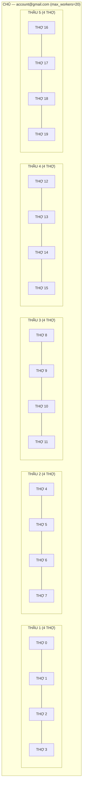
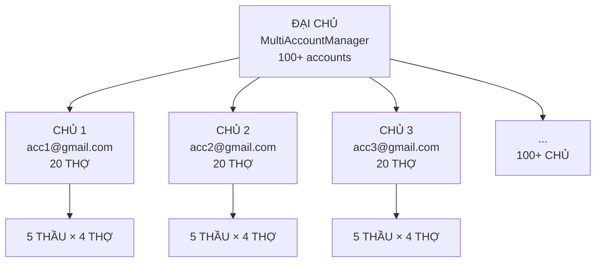

# 🏗️ Concurrency Model: ĐẠI CHỦ / CHỦ / THẦU / THỢ

> **Version**: 1.0 • **Updated**: 2026-02-21  
> **Scope**: Worker hierarchy, video-based concurrency, account isolation, admission control.  
> **Convention**: `[CURRENT]` = đã implement. `[TARGET]` = đề xuất, chưa implement.

---

## 1. Bảng Vai Trò — Đơn Vị Video

| Vai trò | Module | Đơn vị | Số lượng | Trách nhiệm chính |
|---------|--------|--------|----------|-------------------|
| **ĐẠI CHỦ** | `MultiAccountManager` | Pool | 1 | Phân phối task groups ra 100+ CHỦ |
| **CHỦ** | `AccountManager` | Account | N (100+) | Quản lý 20 THỢ, sở hữu tài sản (assets) |
| **THẦU** | Worker coroutine | Nhóm 4 THỢ | 5/account | Nhận prompts, phân công THỢ, gọi API |
| **THỢ** | `VideoOutputInfo` | 1 video | 20/account | Xử lý + tracking trạng thái 1 video |

> [!IMPORTANT]
> **Đơn vị cơ bản = 1 THỢ = 1 video**. Mọi capacity được đo bằng video, không phải prompt.

---

## 2. THỢ — Đơn Vị Cơ Bản (1 Video)

Mỗi THỢ quản lý trạng thái **đầy đủ** của 1 video xuyên suốt vòng đời:

```python
@dataclass
class VideoOutputInfo:      # = 1 THỢ
    index: int               # Vị trí trong nhóm (0-3)
    
    # Server-side identifiers (asset thuộc account)
    operation_name: str      # UUID từ API response → poll tiến độ
    scene_id: str            # UUID gửi khi submit → tracking
    media_id: str            # Protobuf Base64 → dùng cho upscale API
    
    # Local files (output)
    file_720p: str           # Đường dẫn video 720p đã download
    file_upscaled: str       # Đường dẫn video 1080p/4K sau upscale
    thumbnail_path: str      # Thumbnail JPG cho UI
    
    # State machine
    quality: str             # "pending" → "720p" → "1080p"/"4K"
    upscale_status: str      # "" → "submitting" → "polling" → "success"/"failed"
    upscale_error: str       # Chi tiết lỗi nếu upscale thất bại
```

**THỢ lifecycle**:
```
pending → [API submit] → operation_name assigned
        → [poll complete] → media_id + file_720p assigned, quality="720p"
        → [upscale submit] → upscale_status="submitting"
        → [upscale poll] → file_upscaled assigned, quality="1080p"/"4K"
```

> [!IMPORTANT]
> **Mỗi THỢ sở hữu dữ liệu server-side** (`operation_name`, `media_id`) **không thể chuyển sang account khác**. Google không cho phép tài khoản A truy cập `media_id` của tài khoản B. Đây là ràng buộc cứng ở cấp API.

---

## 3. THẦU — Quản Lý Nhóm 4 THỢ

**THẦU = 1 coroutine quản lý nhóm cố định 4 THỢ**. THẦU không gắn cứng với 1 prompt — THẦU phân phối prompts vào THỢ linh hoạt:

### Trường hợp A: 1 prompt × 4 videos (mặc định)
```
THẦU ─┬─ THỢ 0: prompt "A cat" → video 1
       ├─ THỢ 1: prompt "A cat" → video 2
       ├─ THỢ 2: prompt "A cat" → video 3
       └─ THỢ 3: prompt "A cat" → video 4
         1 API call (batch 4 request items)
```

### Trường hợp B: 4 prompts × 1 video mỗi prompt
```
THẦU ─┬─ THỢ 0: prompt "A cat" → video 1
       ├─ THỢ 1: prompt "A dog" → video 2
       ├─ THỢ 2: prompt "A bird" → video 3
       └─ THỢ 3: prompt "A fish" → video 4
         4 API calls (1 request item each)
```

### Trường hợp C: Mix — 1 prompt × 3 videos + 1 prompt × 1 video
```
THẦU ─┬─ THỢ 0: prompt "A cat" → video 1
       ├─ THỢ 1: prompt "A cat" → video 2
       ├─ THỢ 2: prompt "A cat" → video 3
       └─ THỢ 3: prompt "A dog" → video 4
         2 API calls (3 items + 1 item)
```

### Trường hợp D: 2 prompts × 2 videos
```
THẦU ─┬─ THỢ 0: prompt "A cat" → video 1
       ├─ THỢ 1: prompt "A cat" → video 2
       ├─ THỢ 2: prompt "A dog" → video 3
       └─ THỢ 3: prompt "A dog" → video 4
         2 API calls (2 items each)
```

### Dữ liệu THẦU quản lý

| Dữ liệu | Scope | Ví dụ |
|----------|-------|-------|
| `prompt` | Per-prompt | "A cat running" |
| `output_count` | Per-prompt | 4 |
| `workflow_type` | Per-prompt | T2V, I2V, R2V |
| `aspect_ratio`, `model`, `seed` | Per-prompt | "16:9", "veo_3_1" |
| `image_uris`, `image_paths` | Per-prompt (I2V) | Upload URIs |
| `video_outputs: List[VideoOutputInfo]` | **Per-video** | 4 THỢ tracking |
| `assigned_account` | Per-THẦU | "user@gmail.com" |
| `operation_names` | Per-video (list) | API operation UUIDs |

---

## 4. CHỦ — 1 Account = 20 THỢ = 5 THẦU



### Tài sản sở hữu bởi CHỦ (account-specific, KHÔNG share)

| Tài sản | Lý do không share | Dùng ở đâu |
|---------|-------------------|------------|
| `access_token` | OAuth token cá nhân | Mọi API call |
| `recaptcha_token` | Gắn với session browser cá nhân | Submit + Upscale |
| `project_id` | Workspace riêng trên Google | Generate |
| `media_id` | Video asset sở hữu bởi account | Upscale, Re-upscale |
| `operation_name` | Job tracking riêng | Poll tiến độ |
| `x-browser-*` headers | Browser fingerprint riêng | Anti-detect |

> [!CAUTION]
> **Account Isolation Constraint**: Google API **từ chối** khi account A cố `poll` hoặc `upscale` asset có `media_id` thuộc account B. Mọi thao tác trên 1 video (tạo mới, poll, download, upscale, re-upscale, retry) **BẮT BUỘC** phải dùng cùng CHỦ (account) đã tạo ra nó.

### Enforcement hiện tại `[CURRENT]`

| Cơ chế | File | Mô tả |
|--------|------|-------|
| `task.assigned_account` | `dispatcher.py:160` | Account đã xử lý task |
| `task.required_account` | `dispatcher.py:123` | Bắt buộc dùng account này (retry/continuation) |
| D2 Affinity | `dispatcher.py:633-637` | `child.required_account = parent.assigned_account` |
| Re-upscale | `app_controller.py:2541-2566` | `_get_account_for_reupscale()` dùng `assigned_account` |
| Worker D2 check | `engine.py:505-511` | Re-queue nếu `required != email` |

---

## 5. ĐẠI CHỦ — Phân Phối 100+ Accounts



| Trách nhiệm | Logic hiện tại | Đơn vị mới `[TARGET]` |
|-------------|---------------|----------------------|
| Load balancing | Health score (slots, 403, ext) | Health score (workers, 403, ext) |
| Capacity tracking | `N × max_slots` = `N × 5` prompts | `N × max_workers` = `N × 20` videos |
| Account selection | Prefer most `available_slots` | Prefer most `available_workers` |
| Cross-account sharing | `fix_short_client_data()` | Giữ nguyên (headers only, NOT assets) |

**Với 100 accounts**: `100 × 20 = 2000 THỢ` = **2000 videos đồng thời**.

---

## 6. Task Group → Prompt → Video

Trong Queue Tab, user tạo **Task Group** chứa nhiều prompt:

```
Task Group "Nature Videos" (queue tab row)
├── Prompt 1: "A cat running" (output_count=4) → 4 videos
├── Prompt 2: "A dog sleeping" (output_count=4) → 4 videos
├── Prompt 3: "A bird flying" (output_count=2) → 2 videos
└── Prompt 4: "A fish swimming" (output_count=1) → 1 video
                                            Total: 11 videos
```

**ĐẠI CHỦ → CHỦ → THẦU → THỢ**: Phân phối theo video capacity:

```
ĐẠI CHỦ distributes:
├── CHỦ acc1 (20 THỢ available):
│   ├── THẦU 1: Prompt 1 (oc=4) → 4 THỢ busy
│   ├── THẦU 2: Prompt 2 (oc=4) → 4 THỢ busy
│   ├── THẦU 3: Prompt 3 (oc=2) + Prompt 4 (oc=1) → 3 THỢ busy, 1 idle
│   └── THẦU 4-5: idle
│   Total: 11/20 THỢ busy
│
├── CHỦ acc2 (20 THỢ available):
│   └── (nhận task group khác)
```

---

## 7. Account Isolation — Ràng Buộc Thực Tế

### Retry (tạo lại)
```
Prompt 1 trên acc1 → video 3 failed
  → Retry task: required_account = "acc1@gmail.com"
  → THẦU trên acc1 pick up → xin 1 THỢ → tạo lại video 3
  ✅ Đúng account → API accept
  ❌ Nếu acc2 pick up → API reject (media_id invalid)
```

### Upscale
```
Video 2 trên acc1 có media_id = "xyz123"
  → UpscaleQueue: account = acc1 (from assigned_account)
  → Gọi upscale API: access_token=acc1, media_id="xyz123"
  ✅ Đúng account → upscale success
  ❌ Nếu dùng acc2's token → 403 (forbidden)
```

### Continuation chains
```
Prompt A trên acc1 → video 1 done → extract frame
  → Child prompt B: required_account = "acc1" (D2 injection)
  → continuation_frame_uri thuộc acc1's project
  ✅ Đúng account → frame upload valid
```

---

## 8. Two-Phase Admission `[TARGET]`

**Thách thức**: `acquire` TRƯỚC `get_next_task()` — chưa biết `output_count`.

```python
# Phase 1: THẦU xin tạm 1 THỢ (chưa biết cần bao nhiêu)
if not account.acquire_workers(1):
    await asyncio.sleep(0.5)
    continue

# Lấy task từ queue
task = dispatcher.get_next_task()
if not task:
    account.release_workers(1)
    continue

# Phase 2: Biết output_count → xin thêm THỢ
extra = task.output_count - 1
if extra > 0 and not account.acquire_workers(extra):
    account.release_workers(1)
    dispatcher.requeue_task(task)
    continue

task._worker_count = task.output_count  # Track để release đúng
# ... xử lý → release_workers(task._worker_count)
```

---

## 9. So Sánh: Trước (Prompt-Based) vs Sau (Video-Based)

| Khía cạnh | Trước `[CURRENT]` | Sau `[TARGET]` |
|-----------|-------------------|----------------|
| **Đơn vị đếm** | `max_slots=5` (prompts) | `max_workers=20` (videos/THỢ) |
| **5 prompts oc=4** | 5 slots → 20 videos (hidden) | 5 THẦU × 4 THỢ = 20 workers (explicit) |
| **20 prompts oc=1** | ❌ Can't do (max 5 slots) | 20 THỢ, mỗi THỢ 1 video ✅ |
| **Mixed oc** | ❌ Slots don't differentiate | THẦU linh hoạt phân THỢ ✅ |
| **UI label** | "Workers" (misleading) | "Workers" = THỢ = videos (accurate) |
| **Account isolation** | `assigned_account` (partial) | Enforce at acquire level |
| **Scale 100 accounts** | 100 × 5 = 500 capacity | 100 × 20 = 2000 capacity |

---

## 10. Code Impact Summary `[TARGET]`

| File | Thay đổi | Chi tiết |
|------|----------|---------|
| `session.py` | `max_slots→max_workers=20`, `active_slots→active_workers`, `acquire_workers(n)`, `release_workers(n)` | Đơn vị mới |
| `account_manager.py` | Delegate `acquire_workers(n)`, `release_workers(n)`, `set_max_workers(n)` cap 0-20 | Thread-safe wrapper |
| `engine.py` | `MAX_WORKERS_PER_ACCOUNT=20`, two-phase admission, ~15 `release_workers(count)` | Core flow |
| `multi_account.py` | `total_capacity = N × max_workers`, health score dùng `available_workers` | Capacity |
| `task_watchdog.py` | `release_workers(task._worker_count)` | Cleanup |
| `tab_settings.py` | SpinBox 0-20, label "Workers" (= THỢ = videos) | UI |
| `page_dashboard.py` | `active_workers/max_workers` | Display |
| `app_controller.py` | `set_max_workers()`, bỏ advisory (enforce via weighted admission) | Controller |
| `profiles_controller.py` | `max_workers=20`, serialize | Persistence |

---

## 11. Related Documents

| Document | Scope |
|----------|-------|
| [ENGINE_PIPELINE_ARCHITECTURE.md](./ENGINE_PIPELINE_ARCHITECTURE.md) | Pipeline phases, rate limiting, error recovery |
| [ACCOUNT_AFFINITY_RULES.md](./ACCOUNT_AFFINITY_RULES.md) | Chi tiết quy tắc gắn kết account cho retry/reprocess |
| [VEO_System_Flow_Diagrams.md](./VEO_System_Flow_Diagrams.md) | API flow diagrams |
