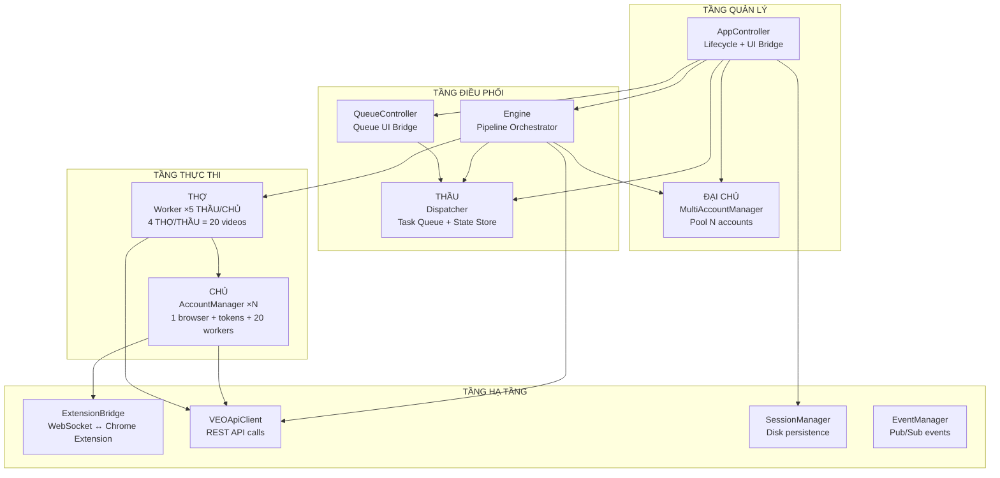
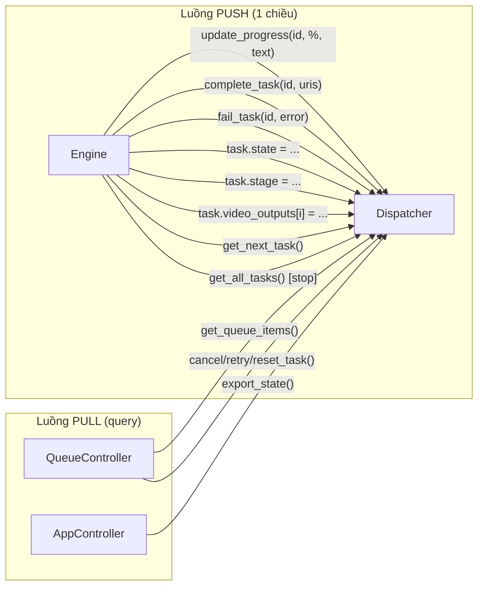
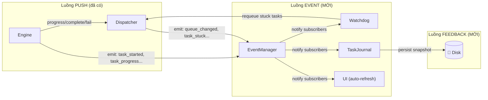
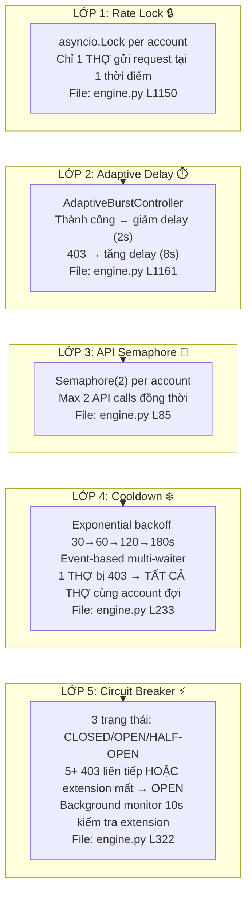
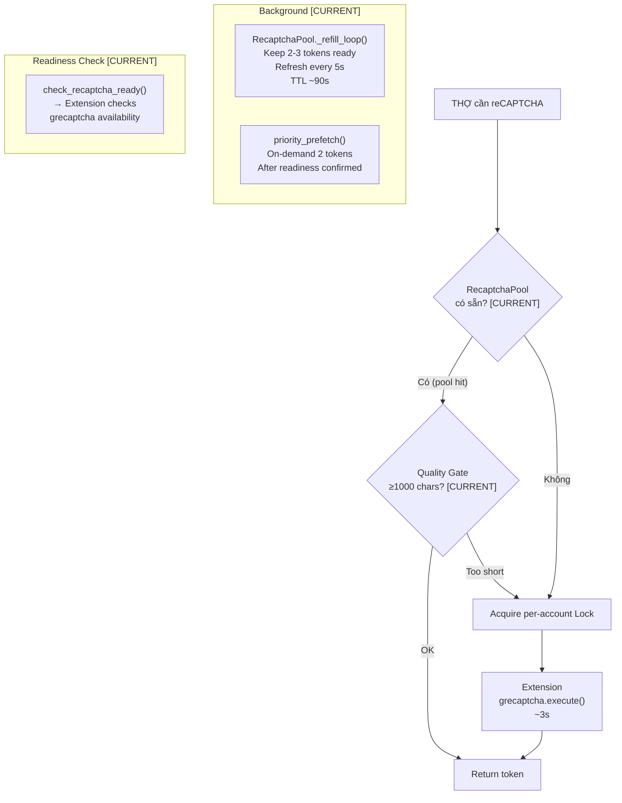
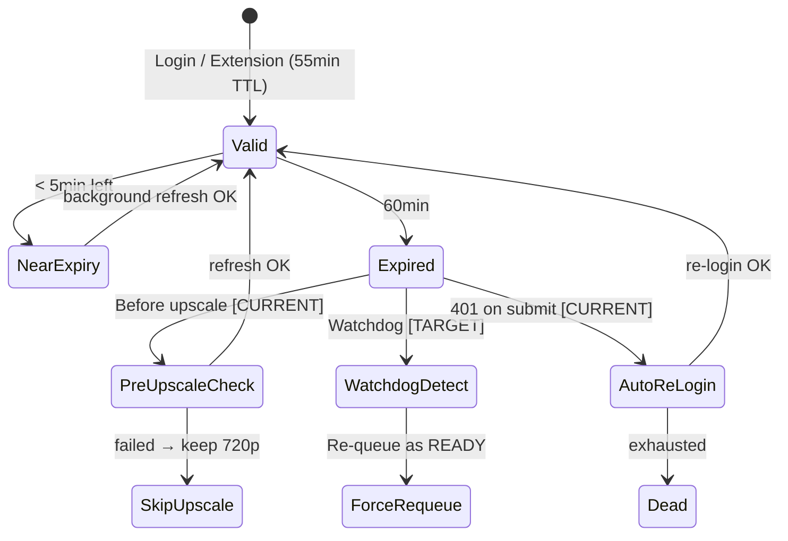
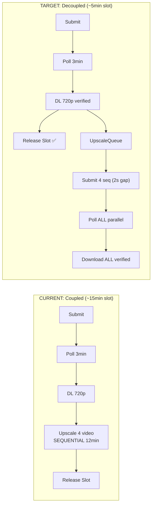
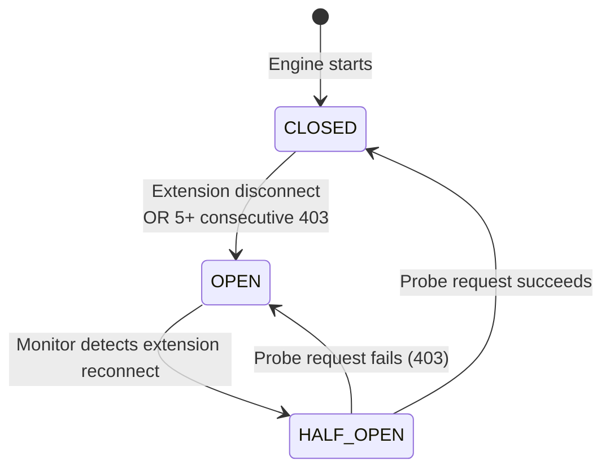
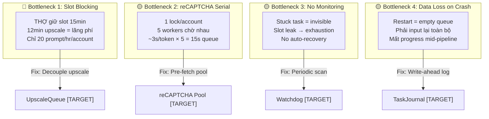

# 🏭 Engine Pipeline Architecture — Mô Hình Nhà Xưởng

> **Version**: 9.1 • **Updated**: 2026-02-25  
> **Scope**: Orchestration Engine — component roles, data flow, pipeline, rate limiting, token, data integrity, fault tolerance.  
> **Convention**: `[CURRENT]` = đã implement. `[TARGET]` = đề xuất, chưa implement.  
> **See also**: [CONCURRENCY_MODEL.md](./CONCURRENCY_MODEL.md) — ĐẠI CHỦ/CHỦ/THẦU/THỢ hierarchy, video-based units, account isolation.  
> **See also**: [TAB_KEEPALIVE_ARCHITECTURE.md](./TAB_KEEPALIVE_ARCHITECTURE.md) — Chrome Tab Freeze prevention, reCAPTCHA protection.

---

## 1. Phân Cấp Vai Trò (Factory Hierarchy)

### 1.1 Sơ đồ tổng quan



### 1.2 Bảng phân công chi tiết

| Vai trò | Class | File | Trách nhiệm CHÍNH | Trách nhiệm PHỤ | Giao tiếp với |
|---------|-------|------|--------------------|------------------|---------------|
| **Tổng quản** | `AppController` | `app_controller.py` | Lifecycle (start/stop), UI↔Core bridge, browser auto-launch | Splash screen, event wiring, session save/load | Tất cả components |
| **ĐẠI CHỦ** | `MultiAccountManager` | `multi_account.py` | Pool N accounts (100+), load balancing (most-available-workers `[T]`), browser lifecycle | x-client-data sharing, capacity tracking (N × 20 videos) | `AccountManager` ×N |
| **CHỦ** | `AccountManager` | `account_manager.py` | 1 account: session, token refresh, worker pool (max 20 `[T]`/max 5 `[C]`), reCAPTCHA cache, **asset ownership** | Project ID, paygate tier, enable/disable | `ExtensionBridge`, `VEOApiClient`, `ProjectManager` |
| **THẦU** | `Dispatcher` + Worker coroutine | `dispatcher.py`, `engine.py` | Task queue, state machine, dependency tracking. Worker coroutine manages 4 THỢ per group | Progress storage, group management, session export/import | `Engine`, `QueueController` |
| **Engine** | `Engine` | `engine.py` | **Pipeline orchestrator**: worker loops (5 THẦU/CHỦ), poll, download, upscale, continuation, retry, 403 recovery | Rate locks, API semaphores, staggered startup, two-phase admission `[T]` | `Dispatcher`, `MultiAccountManager`, `Worker`, `VEOApiClient` |
| **THỢ** | `Worker` + `VideoOutputInfo` | `worker.py`, `dispatcher.py` | API payload construction + submit. Per-video state tracking (1 THỢ = 1 video = 1 `VideoOutputInfo`) | Response parsing, video lifecycle management | `VEOApiClient`, `AccountManager` |
| **Queue UI** | `QueueController` | `queue_controller.py` | Queue display/filter, task actions (cancel/retry/priority), download mgmt | Batch operations, export list, event emission | `Dispatcher`, `DownloadManager`, `UpscaleHandler` |
| **WebSocket** | `ExtensionBridge` | `extension_bridge.py` | Chrome Extension ↔ Python bridge: headers, reCAPTCHA, access token | Connection management, email assignment, tab reload | `AccountManager` |
| **API** | `VEOApiClient` | `api_client.py` | All REST API calls: generate, poll, upscale, upload image, get credits | Browser header management, client context builder | `Engine`, `Worker` |
| **Persistence** | `SessionManager` | `session_manager.py` | Tab state + queue state save/load, cache management | Cache cleanup, old file deletion | `AppController`, `Dispatcher` |
| **Events** | `EventManager` | `event_manager.py` | Pub/Sub event bus (20+ event types), async processing | Event history, global subscribers | `QueueController` (emitter), UI (subscriber) |

### 1.3 Thành phần hỗ trợ

| Class | File | Vai trò |
|-------|------|---------|
| `ChromeManager` | `chrome_manager.py` | Chrome for Testing lifecycle, profile management |
| `ProfilesController` | `profiles_controller.py` | Profile CRUD, login, debug browser |
| `DownloadManager` | `download_manager.py` | File download with progress |
| `UpscaleHandler` | `upscale_handler.py` | Single-video upscale API wrapper |
| `FrameExtractor` | `frame_extractor.py` | FFmpeg frame extraction for continuation |
| `MediaHandler` | `media_handler.py` | Image encode (base64), thumbnail generation |
| `BatchParser` | `batch_parser.py` | Parse batch prompt input |
| `TokenExtractor` | `token_extractor.py` | Extract tokens from browser profile |
| `TRPCClient` | `trpc_client.py` | TRPC API calls |
| `RecaptchaBrowserSession` | `recaptcha_session.py` | Headless browser reCAPTCHA session |
| `RefreshManager` | `refresh_manager.py` | Background token refresh |
| `ErrorHandler` | `error_handler.py` | Error classification and recovery |
| `SessionMonitor` | `session_monitor.py` | Session health monitoring |

---

## 2. Luồng Dữ Liệu & Giao Tiếp

### 2.1 Ai gọi Ai — Communication Map



**Hiện tại `[CURRENT]`:** Luồng dữ liệu **1 chiều** — Engine push → Dispatcher store → UI pull. Không có:
- ❌ **Feedback loop**: Dispatcher không bao giờ chủ động thông báo cho Engine
- ❌ **Active monitoring**: Không ai scan trạng thái định kỳ
- ❌ **Event emission**: Engine không emit events → EventManager không biết gì về pipeline

### 2.2 Đề xuất: Luồng dữ liệu 2 chiều `[TARGET]`



---

## 3. Dây Chuyền Sản Xuất — Full Pipeline

> Diagram bao gồm **tất cả** tính năng: hiện tại + đề xuất.

```mermaid
flowchart TD
    START["THẦU: Task Queue"] --> JOURNAL_SAVE["💾 TaskJournal.save()<br/>[TARGET] persist to disk"]
    JOURNAL_SAVE --> TYPE{"Loại task?"}
    
    TYPE -->|T2V| ACQUIRE_SLOT
    TYPE -->|I2V/R2V/I2I/F2V| IMG_UP["PHASE 0: Upload ảnh<br/>_resolve_image_paths()<br/>Cache + NO reCAPTCHA<br/>[CURRENT]"]
    TYPE -->|Continuation| WAIT_PARENT["Chờ parent complete<br/>+ frame mediaId<br/>[CURRENT]"]
    
    IMG_UP --> ACQUIRE_SLOT
    WAIT_PARENT --> ACQUIRE_SLOT
    
    ACQUIRE_SLOT["Acquire Slot<br/>[CURRENT]"] --> ANTI_DETECT

    subgraph "PHASE 1: SUBMIT [CURRENT]"
        ANTI_DETECT["Anti-Detect 3-8s<br/>[CURRENT] fixed<br/>[TARGET] adaptive"] --> RECAPTCHA
        RECAPTCHA["reCAPTCHA<br/>serialized/CHỦ<br/>[CURRENT] lock<br/>[TARGET] token pool"] --> API_SUBMIT
        API_SUBMIT["API Submit<br/>[TARGET] + idempotency key<br/>→ 4 operation_names"]
    end

    API_SUBMIT --> JOURNAL_UPDATE1["💾 Stage=SUBMITTED<br/>[TARGET] persist"]
    JOURNAL_UPDATE1 --> POLL

    subgraph "PHASE 2: POLL [CURRENT]"
        POLL["Poll every 10s<br/>2-5min wait<br/>⏰ Watchdog monitors [TARGET]"]
    end

    POLL --> DL720

    subgraph "PHASE 3: DOWNLOAD 720p"
        DL720["Download 4 videos parallel<br/>[CURRENT] content-length verify<br/>[CURRENT] min-size check (500KB)<br/>[CURRENT] 8x retry + HTTP 403/5xx retry<br/>[CURRENT] incomplete file deletion"]
    end

    DL720 --> JOURNAL_UPDATE2["💾 Stage=DOWNLOADED_720<br/>[TARGET] persist"]
    JOURNAL_UPDATE2 --> CONT{"Có child task?"}
    
    CONT -->|Có| FRAME["FFmpeg extract frame<br/>→ base64 → upload → mediaId<br/>→ smart cooldown (readiness probe)<br/>→ priority_prefetch tokens<br/>→ release child [CURRENT]"]
    CONT -->|Không| UPSCALE_CHECK
    FRAME --> UPSCALE_CHECK
    
    UPSCALE_CHECK{"Quality > 720p?"}
    UPSCALE_CHECK -->|720p| RELEASE_SLOT["Release Slot ✅"]
    
    UPSCALE_CHECK -->|"1080p/4K [CURRENT]"| UPSCALE_DECOUPLE

    subgraph "PHASE 4a: Upscale COUPLED [CURRENT]"
        UPSCALE_COUPLED["Token pre-check → sequential<br/>V1→V2→V3→V4 (2s gap)<br/>submit→poll→download EACH<br/>THỢ giữ slot ~12min"]
    end
    UPSCALE_COUPLED --> RELEASE_SLOT

    subgraph "PHASE 4b: Upscale DECOUPLED [CURRENT]"
        UPSCALE_DECOUPLE["Release Slot ngay ✅<br/>→ UpscaleQueue (per-account)<br/>→ submit seq → poll parallel<br/>→ AdaptiveBurstController<br/>→ 4→8→12→16→20 polls<br/>→ download verified"]
    end
    UPSCALE_DECOUPLE --> RELEASE_SLOT2["THỢ lấy prompt mới ngay"]

    RELEASE_SLOT --> JOURNAL_DONE["💾 Stage=COMPLETED<br/>[TARGET] persist + cleanup"]
    RELEASE_SLOT2 --> JOURNAL_DONE
```



### 3.1 Giải thích từng Phase

**Phase 0 — Upload ảnh `[CURRENT]`:** Khi task có `image_paths` (I2V, R2V, I2I, F2V), engine gọi `_resolve_image_paths()` để upload ảnh lên server, nhận `mediaGenerationId`. Cache theo `path:email` — cùng ảnh + cùng account = skip upload. Upload **không dùng reCAPTCHA** → không contention.

**Phase 1 — Submit `[CURRENT]`:** THỢ đợi Rate Lock → anti-detect delay 3-8s → reCAPTCHA Lock → `grecaptcha.execute()` ~3s → API submit → 4 `operation_name`. **Serialize vì:** 5 submit cùng lúc = 403 burst detection.

**Phase 2 — Poll `[CURRENT]`:** `GET /operation/{name}` mỗi 10s. Status: `PENDING` → `ACTIVE` → `SUCCEEDED`. Kéo dài 2-5min. **THỢ giữ slot nhưng không lock** → các THỢ khác submit tự do. Burst tự giảm vì tất cả THỢ đang poll.

**Phase 3 — Download 720p `[CURRENT]`:** Khi `SUCCEEDED`, response chứa 4 `fifeUrl` (Google CDN). Download song song với retry logic: kiểm tra content-length, min-size (500KB video / 50KB image), tối đa 8 lần retry cho file nhỏ/incomplete, retry trên HTTP 403/5xx (URL expired hoặc server error) với exponential backoff (3-30s, tổng ~118s). Xoá file < min-size sau khi hết retry.

**Continuation `[CURRENT]`:** FFmpeg cắt frame cuối video[0] → base64 → upload → `mediaId` → gán child task. Child task chỉ worker cùng CHỦ xử lý (`required_account`). **Smart cooldown** thay vì fixed 3-5s: `_wait_for_recaptcha_ready()` poll Extension cho đến khi `grecaptcha` ready → `priority_prefetch()` 2 tokens vào pool → child start ngay.

### 3.2 Upscale Completion Detection `[CURRENT]`

Cùng cơ chế poll như generation. Mỗi video upscale:
1. reCAPTCHA Lock → get token
2. `POST /upscale(mediaId, token)` → `operation_name`
3. Poll `GET /operation/{name}` mỗi 10s
4. Khi `status = "SUCCEEDED"`: response chứa `fifeUrl` (video upscaled)
5. Download `fifeUrl` → save → cập nhật `task.video_outputs[i].file_upscaled`
6. **Chỉ khi download xong** → 2s cooldown → video tiếp theo

### 3.3 Timing Per Phase

| Phase | Duration | Slot held | Integrity Controls |
|-------|----------|-----------|-------------------|
| **Phase 0: Upload ảnh** | 2-5s/ảnh | ✅ | Cache hit skip `[C]` |
| **Phase 1: Submit** | 3-8s + ~2s | ✅ | Rate lock `[C]`, Idempotency key `[T]` |
| **Phase 2: Poll** | 2-5 min | ✅ | Watchdog timeout 15min `[T]` |
| **Phase 3: DL 720p** | 5-15s | ✅ | Verify content-length `[T]` |
| **Continuation** | 2-30s | ✅ | Smart cooldown = readiness probe `[C]` |
| **Phase 4a: Upscale** `[C]` | ~12min | ✅ Blocked | Token pre-check `[C]`, 2s gap `[C]` |
| **Phase 4b: Upscale** `[C]` | ~5min | ❌ Released | AdaptiveBurst(4→20) + parallel poll `[C]` |

**Persistence checkpoints** `[TARGET]`: `TaskJournal.save()` mỗi stage change → crash ở bất kỳ phase nào đều recovery được.

---

## 4. Rate Limiting & Burst Control

### 4.1 All Concurrency Controls

| Lock | Type | Max | What it protects | File | Status |
|------|------|-----|-----------------|------|--------|
| **Rate Lock** | `asyncio.Lock()` | 1/account | Submit + Upload serialize | `engine.py` L553-588 | `[CURRENT]` |
| **reCAPTCHA Lock** | `asyncio.Lock()` | 1/account | `grecaptcha.execute()` | `extension_bridge.py` L214-250 | `[CURRENT]` |
| **API Semaphore** | `Semaphore(2)` | 2/account | All API calls | `engine.py` L126-134 | `[CURRENT]` |
| **Upscale Burst** | `AdaptiveBurstController` | 4→20 global | Upscale poll concurrency | `upscale_queue.py` L30-120 | `[CURRENT]` |

**Rate Lock:** Khi THẦU 0 trong lock (delay + API call), THẦU 1-4 đợi. Lock release sau API → THẦU tiếp theo vào. 5 THẦU submit trong ~25-40s thay vì cùng lúc.

**API Semaphore(2):** Max 2 API call đồng thời per account (1 submit + 1 poll). Tránh burst khi nhiều THẦU poll cùng lúc.

### 4.2 Staggered Startup `[CURRENT]`

5 THẦU per CHỦ start delay `1.5s × worker_index` (0s, 1.5s, 3s, 4.5s, 6s). Tránh 5 reCAPTCHA đồng thời khi engine start. File: `engine.py` L444-455.

### 4.3 Burst tự giảm tự nhiên

Poll phase 2-5min → tất cả THẦU poll, không submit → server rate window reset. THẦU hoàn thành ở thời điểm khác nhau → re-submit rải đều → burst giảm 5 → 1-3. Sau ~10min tất cả rảnh → burst lại 5.

### 4.4 Adaptive Upscale Burst `[CURRENT]`

`AdaptiveBurstController` in `upscale_queue.py` — controls global upscale poll concurrency:

| Parameter | Value |
|-----------|-------|
| Initial concurrent polls | **4** |
| Step size | **+4 / -4** |
| Max | **20** (= 5 THẦU × 4 THỢ/THẦU) |
| Min (floor) | **4** |
| Scale-up trigger | 8 consecutive poll successes → +4 |
| Back-off trigger | Any 403/rate error → -4 (immediate) |

```
Start: 4 polls concurrent
  → 8 success → scale to 8
    → 8 success → scale to 12
      → 8 success → scale to 16
        → 8 success → scale to 20 (MAX)
          → error → back to 16
            → error → back to 12
              ...
```

**Worker model:** Per-account THẦU (coroutine) manages up to 4 THỢ (videos). 5 THẦU per CHỦ = max 20 THỢ `[T]` / max 5 `[C]`. Each THẦU's Phase 2 polls acquire global burst semaphore before polling.

### 4.5 reCAPTCHA Recovery `[CURRENT]`

`AccountManager.refresh_recaptcha()` — progressive retry for extension bridge token:

| Parameter | Value |
|-----------|-------|
| Max attempts | **3** |
| Timeout per attempt | **25s** |
| Inter-attempt delay | **3s, 6s** (progressive: `3 × attempt`) |
| Token min length (Extension side) | **500 chars** |
| Token min length (Python quality gate) | **1000 chars** (Layer 5) |

### 4.7 reCAPTCHA 5-Layer Defense `[CURRENT]`

Được triển khai để giải quyết negative feedback loop khi tab reload phá huỷ `grecaptcha` widget:

| Layer | Component | File | Mô tả |
|-------|-----------|------|-------|
| **L1** | Readiness Probe | `extension_bridge.py` + `background.js` | `check_recaptcha_ready()` → Extension check `grecaptcha.enterprise.execute` availability |
| **L2** | Smart Cooldown | `engine.py` `_wait_for_recaptcha_ready()` | Thay `sleep(3-5s)` bằng polling readiness mỗi 2s (backoff 2→5s, max_wait=30s) |
| **L3** | Priority Prefetch | `recaptcha_pool.py` `priority_prefetch()` | Khi ready → fetch 2 token ngay, bypass interval 5s |
| **L4** | De-escalated Recovery | `engine.py` recovery loop | Fail 1: readiness only. Fail 2: reload+readiness. Fail 3+: hard restart+readiness |
| **L5** | Quality Gate | `extension_bridge.py` `MIN_TOKEN_LENGTH=1000` | Reject token < 1000 chars (garbage từ `grecaptcha` chưa init) |

### 4.6 Auto-Export Logs `[CURRENT]`

`LogExporter` in `core/log_exporter.py` — auto-exports structured session logs khi processing stop:

| Parameter | Value |
|-----------|-------|
| Permission | **TESTER only** (`can_see_dev_console()`) |
| Trigger | `stop_processing()` in `AppController` |
| Output | `logs/reports/session_{timestamp}.json` |
| Capture | WARNING/ERROR/CRITICAL via `logging.Handler` |

**Error categories:** `DOWNLOAD_FAILURE`, `RECAPTCHA_FAILURE`, `UPSCALE_403`, `AUTH_ERROR`, `NETWORK_ERROR`

**Report format:** JSON with `session` (timing), `summary` (stats + task counts), `errors` (categorized, max 20 per category).

### 4.8 5-Layer Anti-Spam Defense `[CURRENT]`

Hệ thống phòng thủ 5 lớp chống 403 retry flood, áp dụng **per-account** (tất cả THỢ cùng CHỦ chịu chung):



**Lưu ý quan trọng:** Tất cả 5 lớp dùng `account.email` làm key → áp dụng cho **toàn bộ nhóm THỢ cùng CHỦ**, không phải từng THỢ riêng lẻ. Khi 1 THỢ gặp 403, tất cả THỢ cùng account cùng bị ảnh hưởng.

**Luồng trong retry loop:**
```
for attempt in range(max_retries + 1):
    if attempt > 0:
        await wait_for_cooldown()     # Lớp 4: đợi cooldown hết
        await _wait_for_circuit()     # Lớp 5: đợi extension về
    
    async with rate_lock:             # Lớp 1: xếp hàng 1 lượt
        await burst_controller.wait() # Lớp 2: adaptive delay
        result = await worker.execute()  # Lớp 3: semaphore bên trong
    
    if result.success:
        record_circuit_success()      # Reset Lớp 5
        clear_account_cooldown()      # Reset Lớp 4
    elif "403":
        burst_controller.record_error()  # Lớp 2 tăng delay
        record_circuit_403()             # Lớp 5 đếm
        set_account_cooldown()           # Lớp 4 bật
```

---

## 5. Token & reCAPTCHA Management

### 5.1 reCAPTCHA Flow



**`[CURRENT]`:** 1 `asyncio.Lock()` per account. Extension chỉ có 1 `grecaptcha` instance per tab — đồng thời = timeout/invalid. Lock serialize → 0 timeout.

**`[CURRENT]` RecaptchaPool:** Background fetch token sẵn, worker lấy từ pool → ~0ms wait. `priority_prefetch()` tạo token ngay sau khi parent task xong (cho continuation). Quality gate rejects token < 1000 chars.

### 5.2 Token Lifecycle



**Pre-upscale check `[CURRENT]`:** Trước upscale, engine kiểm tra token. Nếu expired → `refresh_access_token()`. Nếu refresh fail → giữ 720p, skip upscale (tránh 401). File: `engine.py` L1156-1173.

---

## 6. Image Upload & Continuation `[CURRENT]`

| Tính năng | Method | File | Integrity |
|-----------|--------|------|-----------|
| Upload ảnh | `_resolve_image_paths()` | `engine.py` L1535-1600 | Cache `path:email`, no reCAPTCHA |
| Cắt frame | `_extract_continuation_frame()` | `engine.py` L1399-1488 | FFmpeg → base64 → upload |
| Child affinity | `required_account` field | `dispatcher.py` L115 | Worker cùng CHỦ xử lý |
| Smart Cooldown | `_wait_for_recaptcha_ready()` | `engine.py` L1493-1563 | Readiness probe + priority prefetch |

---

## 7. Upscale Pipeline

### 7.1 Coupled `[CURRENT]` — Chi tiết

THỢ giữ slot suốt. 4 video tuần tự, mỗi video phải hoàn tất trước video tiếp:

```
Token pre-check → refresh nếu cần
├── V1: reCAPTCHA → POST /upscale → poll → SUCCEEDED → extract fifeUrl → download → save
├── 2s cooldown
├── V2: reCAPTCHA → POST /upscale → poll → SUCCEEDED → download → save  
├── 2s cooldown
├── V3: tương tự
├── V4: tương tự
└── ALL DONE → release slot
Total: ~12min
```

### 7.2 Decoupled `[TARGET]` — Chi tiết



THỢ release slot ngay → lấy prompt mới. Upscale chạy nền (submit tuần tự cần reCAPTCHA, poll song song không cần).

### 7.3 Upscale Retry + Recovery

| Lỗi | Retry | Recovery | Status |
|-----|-------|---------|--------|
| reCAPTCHA fail ×1-2 | Retry + soft recovery | — | `[C]` |
| reCAPTCHA fail ×3 | Hard restart Chrome | — | `[C]` |
| HTTP 401 | Skip upscale | Token pre-check prevents | `[C]` |
| Poll FAILED (1080p) | Re-submit 1x (free) | — | `[C]` |
| Poll FAILED (4K) | NO re-submit (credit) | Keep 720p | `[C]` |
| Download truncated | 3x retry + verify | Content-length check | `[T]` |
| Task stuck in upscale | Watchdog re-queue | Force READY after 15min | `[T]` |
| App crash mid-upscale | Journal recovery | Resume from DOWNLOADED_720 | `[T]` |

---

## 8. Scaling: 100 Accounts

> **Full concurrency model**: See [CONCURRENCY_MODEL.md](./CONCURRENCY_MODEL.md) §5 ĐẠI CHỦ.

### 8.1 Throughput

| Metric | `[CURRENT]` (slot-based) | `[TARGET]` (video-based) |
|--------|-------------------------|-------------------------|
| Worker unit / prompt | 1 slot (1-4 videos hidden) | `output_count` THỢ (explicit) |
| Max concurrent / account | 5 prompts (5-20 videos) | 20 THỢ = 20 videos |
| Prompts/hr/THẦU | ~4 | ~12 |
| Videos/hr/account (5 THẦU) | ~80 (oc=4) | ~240 (oc=4) |
| **100 accounts** | **8,000 videos/hr** | **24,000 videos/hr** |

### 8.2 Account Load Balancer `[TARGET]`

Health-based account selection thay thế fixed most-available — dùng đơn vị **workers** (video):
```python
score = (available_workers * 10) - (active_workers * 5) - (consecutive_403s * 20)
```

---

## 9. Error Recovery & Fault Tolerance

### 9.1 Tiered 403 Recovery `[CURRENT]`

```
Non-reCAPTCHA errors:
  Phase 0: Retry + backoff 3-8s + refresh_headers (×3)
  Phase 1: Kill Browser + Restart (×3)
  Phase 2: Copy Variations + Warmup (×3)
  Phase 3: Delete Profile + Re-login (×3)
  ⛔ 12× 403 → Dead
  Success at any phase → reset all counters

reCAPTCHA errors (Layer 4 De-escalation):
  Fail 1: Wait for readiness only (NO tab reload)
  Fail 2: Reload tab + wait for readiness
  Fail 3+: Hard browser restart + wait for readiness
  Success → reset recovery counter
```
File: `engine.py` L664-710.

### 9.2 Watchdog Recovery `[TARGET]`

```
Every 30s: scan RUNNING + WAITING_POLL tasks
  ├── RUNNING > 10min → force re-queue
  ├── WAITING_POLL > 15min → force re-queue
  └── Release orphaned slot
```

### 9.3 Crash Recovery `[TARGET]`

```
App restart → TaskJournal.load_snapshot()
  ├── READY      → re-queue
  ├── RUNNING    → reset → READY
  ├── SUBMITTED  → resume polling (có operation_name)
  ├── DOWNLOADED_720 → upscale only
  ├── UPSCALING  → re-submit upscale (free 1080p)
  └── COMPLETED  → skip
```

### 9.4 Download Integrity `[TARGET]`

```
Download attempt (max 3):
  1. GET url → read bytes
  2. Verify content-length vs actual
  3. Check min-size (> 10KB for video)
  4. Fail → retry with backoff
  5. 3× fail → mark "failed", continue others
```

### 9.5 Circuit Breaker (Cầu Dao) `[CURRENT]`

Per-account circuit breaker ngăn retry flood khi extension mất kết nối:



| Trạng thái | Điều kiện | THỢ |
|---|---|---|
| 🟢 CLOSED | Extension connected, có reCAPTCHA | Chạy bình thường |
| 🟡 HALF-OPEN | Extension vừa reconnect, chưa test | 1 THỢ thử (probe), còn lại đợi |
| 🔴 OPEN | Extension mất HOẶC 5+ 403 liên tiếp | **TẤT CẢ THỢ sleep** |

**Thành phần:**

| Component | Location | Mô tả |
|---|---|---|
| State vars | `engine.py` `__init__` | `_circuit_state`, `_circuit_events`, `_circuit_consecutive_403` |
| Trip/Close | `engine.py` L340-400 | `_trip_circuit_breaker()`, `_close_circuit_breaker()`, `_half_open_circuit_breaker()` |
| Retry gate | `engine.py` L1137-1145 | `_wait_for_circuit()` trước mỗi retry attempt |
| 403 recording | `engine.py` L1243 | `record_circuit_403()` đếm consecutive failures |
| Success reset | `engine.py` L1388 | `record_circuit_success()` close breaker + reset counter |
| Background monitor | `engine.py` TaskGroup | `_circuit_breaker_monitor()` kiểm tra extension mỗi 10s |

---

## 10. 🔍 Gap Analysis — Thiếu Sót Hiện Tại

### 10.1 Kiến trúc điều phối

| # | Vấn đề | Hệ quả | Mức độ | Đề xuất |
|---|--------|--------|--------|---------|
| G1 | **Engine push 1 chiều, không có feedback** | Dispatcher không bao giờ thông báo Engine (task stuck, hết queue, overload) | 🟡 | EventManager-based feedback loop |
| G2 | **EventManager tồn tại nhưng không được dùng** | 20+ event types trong `event_manager.py` nhưng Engine/Dispatcher không emit. Chỉ `queue_controller.py` dùng | 🟡 | Engine emit events vào EventManager ở mỗi phase transition |
| G3 | **Không có Watchdog** | Task stuck RUNNING/WAITING_POLL → slot blocked vĩnh viễn, không ai phát hiện | 🔴 | `TaskWatchdog` scan 30s, subscribe EventManager |
| G4 | **Không có health aggregation** | Không ai tổng hợp: bao nhiêu stuck, bao nhiêu 403, account nào yếu, tốc độ trung bình | 🟡 | `StatusAggregator` tổng hợp metrics realtime |
| G5 | **Engine mutate Task trực tiếp** | Engine ghi thẳng `task.state`, `task.stage`, `task.video_outputs` — bypass Dispatcher methods | 🟡 | Chuẩn hóa: mọi mutation qua Dispatcher methods + emit event |

### 10.2 Data integrity

| # | Vấn đề | Hệ quả | Mức độ | Đề xuất |
|---|--------|--------|--------|---------|
| G6 | **Tasks in-memory only** | App crash/restart → mất toàn bộ queue + progress | 🔴 | `TaskJournal` — atomic JSON snapshot mỗi 30s + mỗi stage change |
| G7 | **Stop re-queues nhưng không persist** | `stop()` re-queues in-memory → crash ngay sau stop = mất | 🔴 | Persist trước khi re-queue |
| G8 | **Download không verify** | File truncated/corrupt → user nhận file lỗi | 🟡 | Content-length + min-size + 3x retry |
| G9 | **Không có idempotency** | Submit timeout → retry → 2x prompt → duplicate credits | 🟡 | Idempotency key per task+attempt |

### 10.3 Hiệu suất

| # | Vấn đề | Hệ quả | Mức độ | Đề xuất |
|---|--------|--------|--------|---------|
| G10 | **Upscale giữ slot ~12min** | 5 workers × 15min = chỉ 20 prompt/hr/account | 🟢 | Independent Upscale Queue + slot release |
| G11 | **Upscale poll tuần tự** | 4×3min sequential = 12min | 🟢 | Submit sequential + poll parallel = ~5min |
| G12 | **Anti-detect fixed 3-8s** | Không thích ứng server response | 🟢 | Adaptive burst controller |
| G13 | **reCAPTCHA đồng bộ** | Worker phải chờ ~3s mỗi lần | 🟢 | Token pool pre-fetch |

### 10.4 Tắc nghẽn (Bottlenecks)



---

## 11. Đề Xuất Thành Phần Mới `[TARGET]`

### 11.1 Bảng tổng quan

| Component | Class | Vai trò | Giao tiếp | Priority |
|-----------|-------|---------|-----------|----------|
| **TaskJournal** | `TaskJournal` | Persist tasks to disk (write-ahead log) | Subscribe `EventManager` → save on stage change | 🔴 Critical |
| **TaskWatchdog** | `TaskWatchdog` | Detect + recover stuck tasks | Subscribe `EventManager` → scan 30s → emit `task_stuck` | 🔴 Critical |
| **StatusAggregator** | `StatusAggregator` | Tổng hợp metrics realtime | Subscribe `EventManager` → expose dashboards | 🟡 Medium |
| **UpscaleQueue** | `UpscaleQueue` | Background upscale (decouple từ worker) | Per-account FIFO, Semaphore(1), shared reCAPTCHA lock | 🟢 Perf |
| **reCAPTCHA Pool** | `RecaptchaPool` | Pre-fetch tokens background | Per-account, TTL 90s, refill loop | 🟢 Perf |
| **AdaptiveBurst** | `AdaptiveBurstController` | Dynamic anti-detect delay | Track 403/success → adjust range | 🟢 Perf |
| **DownloadVerifier** | integrated | Content-length + min-size verify | Wrap existing download logic | 🟡 Medium |

### 11.2 Tích hợp với EventManager (có sẵn nhưng chưa dùng)

EventManager **đã tồn tại** với đầy đủ pub/sub. Chỉ cần:

```python
# engine.py — bổ sung emit vào pipeline
from core.event_manager import emit_event, EventType

# Khi task bắt đầu:
emit_event(EventType.TASK_STARTED, {"task_id": task.id, "account": email})

# Khi progress update:
emit_event(EventType.TASK_PROGRESS, {"task_id": task.id, "progress": 85})

# Khi task xong:
emit_event(EventType.TASK_COMPLETED, {"task_id": task.id, "outputs": uris})
```

```python
# TaskJournal — subscribe to save
event_manager.subscribe(EventType.TASK_PROGRESS, lambda e: self.save_snapshot())
event_manager.subscribe(EventType.TASK_COMPLETED, lambda e: self.save_snapshot())

# TaskWatchdog — subscribe to monitor
event_manager.subscribe(EventType.TASK_STARTED, lambda e: self.track_start(e))
```

### 11.3 StatusAggregator `[TARGET]`

```python
class StatusAggregator:
    """Tổng hợp metrics realtime từ EventManager."""
    
    def get_dashboard(self) -> dict:
        return {
            "active_tasks": len(self._running_tasks),
            "stuck_tasks": len(self._stuck_tasks),
            "throughput_last_hour": self._completed_last_hour,
            "avg_poll_time_sec": self._avg_poll_time,
            "accounts": {
                email: {
                    "available_slots": ...,
                    "consecutive_403": ...,
                    "health_score": ...,
                    "upscale_queue_depth": ...,
                }
                for email in self._accounts
            },
            "bottlenecks": self._detect_bottlenecks(),
        }
    
    def _detect_bottlenecks(self) -> list:
        """Auto-detect: slot exhaustion, reCAPTCHA queue, 403 spike."""
        issues = []
        if self._recaptcha_avg_wait > 5.0:
            issues.append("reCAPTCHA contention high")
        if self._slot_utilization > 0.9:
            issues.append("Near slot exhaustion")
        if self._403_rate > 0.2:
            issues.append("403 rate > 20% — possible rate limit")
        return issues
```

---

## 12. File Reference Map

| Concept | File | Key Location |
|---------|------|-------------|
| Worker pipeline | `engine.py` | `_account_worker_loop()` L420-864 |
| Poll + download + upscale | `engine.py` | `_poll_operation()` L866-1273 |
| Auto upscale | `engine.py` | `_auto_upscale()` L1518-1733 |
| Image upload | `engine.py` | `_resolve_image_paths()` L1435-1500 |
| Continuation frame | `engine.py` | `_extract_continuation_frame()` L1339-1428 |
| Rate lock | `engine.py` | `_account_rate_locks` L553-588 |
| reCAPTCHA lock | `extension_bridge.py` | `_recaptcha_locks` L76, L214-250 |
| reCAPTCHA readiness | `extension_bridge.py` | `check_recaptcha_ready()` |
| reCAPTCHA quality gate | `extension_bridge.py` | `MIN_TOKEN_LENGTH=1000` |
| reCAPTCHA priority prefetch | `recaptcha_pool.py` | `priority_prefetch()` |
| Smart cooldown | `engine.py` | `_wait_for_recaptcha_ready()` L1493-1563 |
| Token pre-check | `engine.py` | Before `_auto_upscale()` L1156-1173 |
| Staggered startup | `engine.py` | L444-455 |
| API semaphore | `engine.py` | `_get_api_semaphore()` L126-134 |
| Tiered 403 recovery | `engine.py` | L664-710 |
| reCAPTCHA readiness (Extension) | `background.js` | `check_recaptcha_ready` case L328-385 |
| Event types | `event_manager.py` | `EventType` enum L19-60 |
| Session persistence | `session_manager.py` | `save_session()` / `load_session()` |
| Task groups/state | `dispatcher.py` | `Dispatcher` class L186-920 |
| Queue UI bridge | `queue_controller.py` | `QueueController` L36-276 |
| App lifecycle | `app_controller.py` | `AppController` L68-2256 |
| Circuit breaker | `engine.py` | `_trip/_close/_half_open_circuit_breaker()` L340-485 |
| Circuit monitor | `engine.py` | `_circuit_breaker_monitor()` in TaskGroup |
| 5-layer retry gate | `engine.py` | L1137-1145 (`wait_cooldown` + `wait_circuit`) |
| **Tab Keepalive loop** | `engine.py` | `_tab_keepalive_loop()` — managed by AppController |
| **Keepalive lifecycle** | `app_controller.py` | `_start/_stop_tab_keepalive()`, yield events in start/stop/pause/resume |
| **Cooldown keepalive** | `engine.py` | `wait_for_cooldown()` — ping tab mỗi 20s |
| **reCAPTCHA Pre-warm** | `engine.py` | `_account_foreman_loop()` — Gate 2 trước task đầu tiên |
| **reCAPTCHA Retry gate** | `engine.py` | Retry loop — requeue nếu reCAPTCHA not ready |

---

## 13. Implementation Status

| Feature | Status | Section | Priority |
|---------|--------|---------|----------|
| reCAPTCHA serialization lock | ✅ `[CURRENT]` | §5.1 | — |
| Staggered worker startup | ✅ `[CURRENT]` | §4.2 | — |
| Pre-upscale token refresh | ✅ `[CURRENT]` | §5.2 | — |
| Upscale 2s cooldown | ✅ `[CURRENT]` | §7.1 | — |
| MAX_WORKERS = 5 (slots) | ✅ `[CURRENT]` | §1.2 | — |
| **Video-based concurrency (20 THỢ/CHỦ)** | 🔲 `[TARGET]` | [CONCURRENCY_MODEL.md](./CONCURRENCY_MODEL.md) | 🔴 Critical |
| Image upload + cache | ✅ `[CURRENT]` | §6 | — |
| Continuation frame extraction | ✅ `[CURRENT]` | §6 | — |
| EventManager (pub/sub infra) | ✅ `[CURRENT]` | §2.2 | — |
| SessionManager (manual save) | ✅ `[CURRENT]` | §1.2 | — |
| **Engine emit events** | 🔲 `[TARGET]` | §11.2 | 🔴 Critical |
| **Task Persistence (Journal)** | 🔲 `[TARGET]` | §9.3, §11.1 | 🔴 Critical |
| **Task Watchdog** | 🔲 `[TARGET]` | §9.2, §11.1 | 🔴 Critical |
| **StatusAggregator** | 🔲 `[TARGET]` | §11.3 | 🟡 Medium |
| **Download Verification** | 🔲 `[TARGET]` | §9.4, §11.1 | 🟡 Medium |
| **Idempotency Key** | 🔲 `[TARGET]` | §10.2 | 🟡 Medium |
| **Independent Upscale Queue** | 🔲 `[TARGET]` | §7.2, §11.1 | 🟢 Perf |
| **Parallel Upscale Poll** | 🔲 `[TARGET]` | §7.2 | 🟢 Perf |
| **Adaptive Burst Controller** | 🔲 `[TARGET]` | §4.4, §11.1 | 🟢 Perf |
| **reCAPTCHA Token Pool** | ✅ `[CURRENT]` | §5.1 | — |
| **reCAPTCHA 5-Layer Defense** | ✅ `[CURRENT]` | §4.7 | — |
| **reCAPTCHA Readiness Probe** | ✅ `[CURRENT]` | §4.7 | — |
| **5-Layer Anti-Spam Defense** | ✅ `[CURRENT]` | §4.8 | — |
| **Circuit Breaker (Cầu Dao)** | ✅ `[CURRENT]` | §9.5 | — |
| **Tab Keepalive Service** | ✅ `[CURRENT]` | [TAB_KEEPALIVE_ARCHITECTURE.md](./TAB_KEEPALIVE_ARCHITECTURE.md) | — |
| **reCAPTCHA Pre-warm Gate** | ✅ `[CURRENT]` | [TAB_KEEPALIVE_ARCHITECTURE.md](./TAB_KEEPALIVE_ARCHITECTURE.md) §5.2 | — |
| **reCAPTCHA Retry Gate** | ✅ `[CURRENT]` | [TAB_KEEPALIVE_ARCHITECTURE.md](./TAB_KEEPALIVE_ARCHITECTURE.md) §5.2 | — |
| **Account Load Balancer** | 🔲 `[TARGET]` | §8.2, §11.1 | 🟢 Perf |
