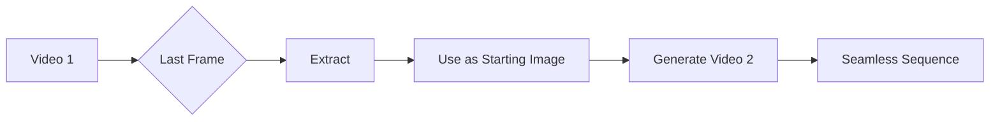

# Frame Continuation Workflow

**Purpose**: Use last frame from previous video as starting image for next video.  
**Result**: Seamless video sequences with visual continuity.

---

## Overview

| Mode | Icon | Description |
|------|------|-------------|
| **Standalone** | 🆕 | Generate fresh video (no dependency) |
| **Continue** | 🔗 | Use last frame from previous video |

> **UI Implementation**: Per-prompt **CTkCheckBox** toggle  
> - ☐ Unchecked = 🆕 Standalone  
> - ☑ Checked = 🔗 Continue

---

## How It Works



### Technical Process

1. **Generate Video 1** (standalone mode)
2. **Extract last frame** from Video 1 as PNG
3. **Use extracted frame** as starting image for Video 2
4. **Generate Video 2** (continue mode - uses I2V internally)
5. **Result**: Videos 1→2 appear as continuous sequence

---

## Continuation Chain Example

```
PROJECT: Bedroom Stories

Prompt 1: "Girl reading book"       → 🆕 Standalone
Prompt 2: "Girl closes book"        → 🔗 Continue (uses frame from #1)
Prompt 3: "Girl stands up"          → 🔗 Continue (uses frame from #2)
Prompt 4: "Grandmother enters"      → 🆕 Standalone (new chain)
Prompt 5: "Grandmother sits down"   → 🔗 Continue (uses frame from #4)

CHAINS:
  Chain A (3 videos): #1 → #2 → #3 
  Chain B (2 videos): #4 → #5
```

---

## API Implementation

### Frame Extraction (VEO Pro Max)

```python
class MediaHandler:
    @staticmethod
    def extract_last_frame(video_path: str) -> str:
        """
        Extract last frame from video for continuation.
        
        Uses JavaScript in browser:
        - Seek to end of video
        - Capture frame to canvas
        - Export as base64 JPEG
        
        Returns:
            Base64 encoded JPEG image
        """
        # Implementation uses browser canvas extraction
        pass
```

### Queue Processing

```python
async def process_task(task: Task):
    if task.chain_mode == 'continue':
        # Get previous task's video
        previous_video = get_previous_completed_video(task)
        
        # Extract last frame
        last_frame = await extract_last_frame(previous_video.url)
        
        # Inject as starting image (I2V mode)
        task.starting_image = last_frame
        task.mode = 'image-to-video'
    
    # Generate video
    result = await api_client.generate_video(task)
    return result
```

---

## UI Schema

### Queue Item

```python
{
    "prompt": "...",
    "chain_mode": "standalone" | "continue",  # Replaces old "durationMode"
    "previous_task_id": null,                 # For continue mode
    "continuation_frame": null                # Extracted frame (auto-filled)
}
```

### Widget Names

| Old Name | New Name |
|----------|----------|
| `concat_` | `continuation_` |
| `durationMode` | `chainMode` |
| `'concat'` | `'continue'` |
| `'8s'` | `'standalone'` |

---

## Validation Rules

1. **First prompt cannot use "continue"** - No previous video exists
2. **Continue requires successful previous video** - Skip if failed
3. **Chain breaks reset to standalone** - New chain starts

```python
def validate_chain_mode(prompt_index: int, mode: str):
    if mode == 'continue' and prompt_index == 0:
        raise ValidationError("First prompt must be standalone")
    return True
```

---

## Related Docs

- [TAB_01_TEXT_TO_VIDEO.md](../01_UI_UX/TAB_01_TEXT_TO_VIDEO.md)
- [TAB_02_IMAGE_TO_VIDEO.md](../01_UI_UX/TAB_02_IMAGE_TO_VIDEO.md)
- [WORKFLOW_BROWSER_SESSION.md](../04_Workflows/WORKFLOW_BROWSER_SESSION.md)

---

**Last Updated**: 2026-02-01
