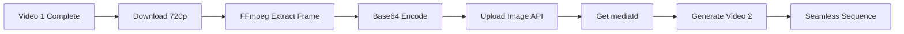

# Frame Continuation Workflow

**Purpose**: Use extracted frame from previous video as image input for next video.  
**Result**: Seamless video sequences with visual continuity.  
**Last Updated**: 2026-02-07

---

## Overview

| Mode | Icon | Description |
|------|------|-------------|
| **Standalone** | 🆕 | Generate fresh video (no dependency) |
| **Continue** | 🔗 | Use extracted frame from previous video |

> **UI Implementation**: Per-prompt **QCheckBox** toggle  
> - ☐ Unchecked = 🆕 Standalone  
> - ☑ Checked = 🔗 Continue

> [!IMPORTANT]
> Continuation áp dụng cho **TẤT CẢ tab video** (T2V, I2V, R2V), không chỉ T2V.

---

## Terminology (Chốt 2026-02-07)

| Thuật ngữ | Ý nghĩa |
|-----------|---------|
| `frame_source` | Setting xác định trích frame từ đâu: `"LAST"` (cuối video) hoặc `"FIRST"` (đầu video) |
| `extract_point_ms` | Offset thời gian trích frame, tính từ cuối video (ms). Default: 750ms |
| **Last Frame** | Frame trích từ **cuối** video tại `duration - extract_point_ms` |
| **First Frame** | Frame trích từ **đầu** video (tester only) |

> [!NOTE]
> "Last/First Frame" = **nguồn trích xuất** (lấy từ đâu trong video cũ), KHÔNG phải vị trí đặt trong video mới.

---

## Processing Pipeline



### Step-by-Step

| # | Step | Type | Details |
|---|------|------|---------|
| 1 | Generate Video 1 | ☁️ API | Standalone mode |
| 2 | Download video | 🏠 LOCAL | Worker tải .mp4 về máy |
| 3 | FFmpeg extract | 🏠 LOCAL | `FrameExtractor.extract_frame(video, extract_point_ms)` |
| 4 | Base64 encode | 🏠 LOCAL | `base64.b64encode(frame_bytes)` |
| 5 | Upload image | ☁️ API | `api_client.upload_image(base64)` → `mediaId` (CAM...) |
| 6 | Generate Video 2 | ☁️ API | Continue mode — `mediaId` → `startImage` hoặc `endImage` |

---

## Frame Source × Frame Mode Matrix

### `frame_source = LAST` (default):

| Frame Mode | CONT OFF | CONT ON |
|------------|----------|---------|
| **Start Only** | Upload → startImage | 🔗 Extracted **thay thế Start** |
| **End Only** | Upload → endImage | ❌ CONT **auto-disable** |
| **Start+End** | Upload cả 2 | 🔗 Extracted **thay thế Start** + giữ End |

### `frame_source = FIRST` (tester only — ngược lại):

| Frame Mode | CONT OFF | CONT ON |
|------------|----------|---------|
| **Start Only** | Upload → startImage | ❌ CONT **auto-disable** |
| **End Only** | Upload → endImage | 🔗 Extracted **thay thế End** |
| **Start+End** | Upload cả 2 | Giữ Start + 🔗 Extracted **thay thế End** |

---

## Continuation Chain Example

```
PROJECT: Bedroom Stories

Prompt 1: "Girl reading book"       → 🆕 Standalone
Prompt 2: "Girl closes book"        → 🔗 Continue (uses frame from #1)
Prompt 3: "Girl stands up"          → 🔗 Continue (uses frame from #2)
Prompt 4: "Grandmother enters"      → 🆕 Standalone (new chain)
Prompt 5: "Grandmother sits down"   → 🔗 Continue (uses frame from #4)

CHAINS:
  Chain A (3 videos): #1 → #2 → #3 
  Chain B (2 videos): #4 → #5
```

---

## Data Model

### AppSettings

```python
# config/settings.py
continuation_enabled: bool = True
extract_point_ms: int = 750      # 500 | 750 | 1000 | custom
frame_source: str = "LAST"       # "LAST" | "FIRST"
```

### Task

```python
# core/dispatcher.py
parent_task_id: Optional[str] = None
continuation_frame_uri: Optional[str] = None  # mediaId after upload
frame_source: str = "LAST"                     # Inherited from AppSettings
```

### Queue Item

```python
{
    "prompt": "...",
    "chain_mode": "standalone" | "continue",
    "previous_task_id": null,
    "continuation_frame": null   # mediaId (auto-filled by pipeline)
}
```

---

## Validation Rules

1. **First prompt cannot use "continue"** — No previous video exists
2. **Continue requires successful previous video** — Skip if failed
3. **Chain breaks reset to standalone** — New chain starts
4. **CONT auto-disable** when Frame Mode conflicts with `frame_source` (see Matrix)

---

## Settings Access

| User Role | `frame_source` toggle | Behavior |
|-----------|----------------------|----------|
| **Normal user** | 🔒 Disabled, shows "Last Frame" | Default `LAST` always |
| **Tester** | ✅ Enabled, can switch | Can choose `FIRST` or `LAST` |

---

## Related Docs

- [TAB_01_TEXT_TO_VIDEO.md](../01_UI_UX/TAB_01_TEXT_TO_VIDEO.md)
- [TAB_02_IMAGE_TO_VIDEO.md](../01_UI_UX/TAB_02_IMAGE_TO_VIDEO.md)
- [TAB_07_SETTINGS.md](../01_UI_UX/TAB_07_SETTINGS.md) — Continuation Settings UI
- [WORKFLOW_TAB_02_IMAGE_TO_VIDEO.md](../04_Workflows/WORKFLOW_TAB_02_IMAGE_TO_VIDEO.md)
- [continuation_terminology.md](file:///C:/Users/Linh/.gemini/antigravity/brain/fbbf3364-d276-41c1-9c71-5d2a3f13cfbd/continuation_terminology.md) — Full Q&A log
