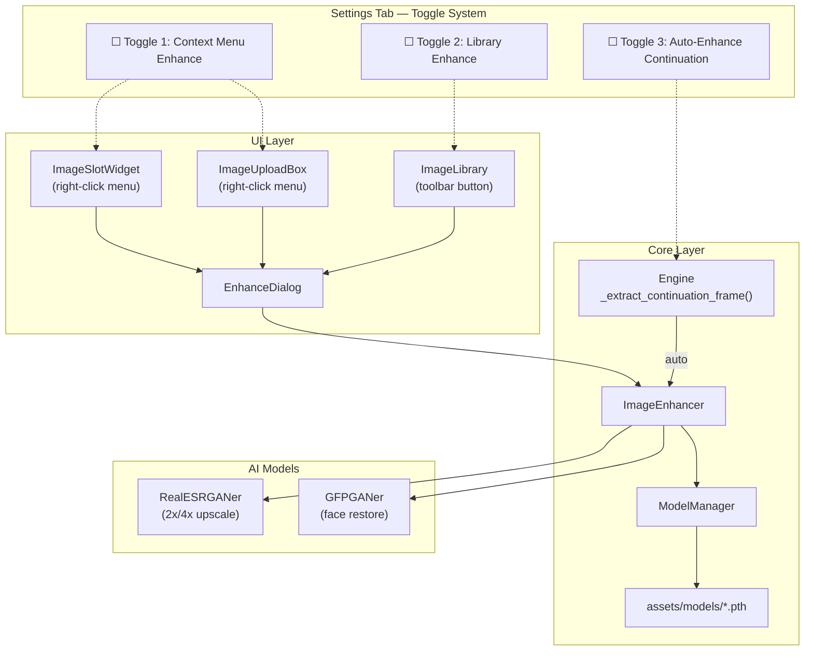
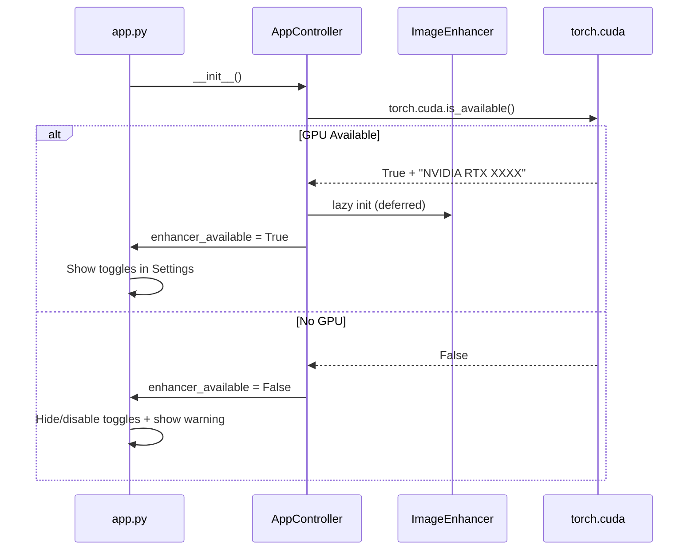
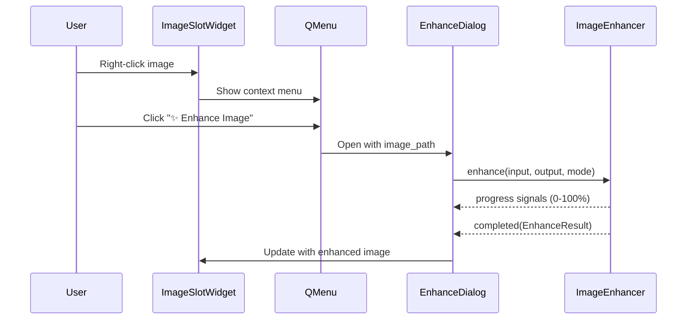
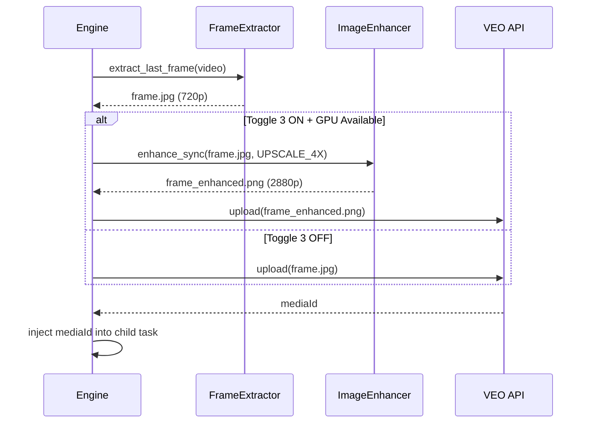

# ✨ Image Enhancer System — Real-ESRGAN + GFPGAN

> **Status**: Planned  
> **Version**: 1.0  
> **Dependencies**: PyTorch, Real-ESRGAN, GFPGAN (100% offline)

---

## 1. Tổng Quan

Hệ thống Image Enhancer tích hợp hai model AI mã nguồn mở để nâng cao chất lượng ảnh:

| Model | Repo | ⭐ Stars | Chức năng |
|-------|------|----------|-----------|
| **Real-ESRGAN** | [xinntao/Real-ESRGAN](https://github.com/xinntao/Real-ESRGAN) | 28k+ | Upscale ảnh 2x/4x, khử noise, khôi phục chi tiết |
| **GFPGAN** | [TencentARC/GFPGAN](https://github.com/TencentARC/GFPGAN) | 36k+ | Khôi phục khuôn mặt từ ảnh mờ/cũ |

### Yêu cầu hệ thống

| Yêu cầu | Chi tiết |
|----------|----------|
| **GPU** | NVIDIA CUDA GPU (bắt buộc) |
| **VRAM** | ≥4GB (tile-based processing cho ảnh lớn) |
| **Offline** | ✅ 100% — models bundled, zero network calls |
| **Disk** | ~130MB models + ~2.5GB PyTorch runtime |

---

## 2. Kiến Trúc

### 2.1 Component Diagram



### 2.2 Startup Flow



---

## 3. Model Weights

### 3.1 Bundled Models

Models được bundle trong `assets/models/` và deploy cùng .exe:

| File | Model | Version | Size | SHA-256 |
|------|-------|---------|------|---------|
| `RealESRGAN_x4plus.pth` | Real-ESRGAN 4x | v0.1.0 | 64MB | `4fa0d38905f75ac06eb49a7951b426670021be3018265fd191d2125df9d682f1` |
| `RealESRGAN_x2plus.pth` | Real-ESRGAN 2x | v0.2.1 | 64MB | verify at build |
| `GFPGANv1.4.pth` | GFPGAN | v1.3.0 | 348MB | verify at build |

### 3.2 Download URLs (build-time only)

```bash
# Real-ESRGAN models
wget https://github.com/xinntao/Real-ESRGAN/releases/download/v0.1.0/RealESRGAN_x4plus.pth
wget https://github.com/xinntao/Real-ESRGAN/releases/download/v0.2.1/RealESRGAN_x2plus.pth

# GFPGAN model
wget https://github.com/TencentARC/GFPGAN/releases/download/v1.3.0/GFPGANv1.4.pth
```

### 3.3 Python Dependencies

```
torch>=2.0.0          # Deep learning framework
torchvision>=0.15.0   # Image transforms
basicsr>=1.4.2        # Image restoration base
realesrgan>=0.3.0     # Real-ESRGAN API
gfpgan>=1.3.8         # GFPGAN API
facexlib>=0.3.0       # Face detection for GFPGAN
```

---

## 4. Enhance Modes

| Mode | Enum | Model(s) | Input → Output | Use Case |
|------|------|----------|----------------|----------|
| **Upscale 2x** | `UPSCALE_2X` | Real-ESRGAN x2 | 512×512 → 1024×1024 | Nhẹ, nhanh |
| **Upscale 4x** | `UPSCALE_4X` | Real-ESRGAN x4 | 512×512 → 2048×2048 | Chất lượng cao |
| **Face Restore** | `FACE_RESTORE` | GFPGAN | Same size | Chỉ enhance khuôn mặt |
| **Full** | `FULL` | ESRGAN + GFPGAN | 4x + face | Tốt nhất |

---

## 5. Ba Điểm Tích Hợp

### 5.1 Toggle 1: Context Menu Enhance



**Áp dụng cho**: Tất cả image slots trong I2V, R2V, I2I tabs.

### 5.2 Toggle 2: Library Manager Enhance

Nút "✨ Enhance" trong toolbar của Image Library dialog. Enhanced image lưu vào category `Enhanced/` trong library.

### 5.3 Toggle 3: Auto-Enhance Continuation Frames



**Hook point**: `engine.py` → `_extract_continuation_frame()` → sau dòng extract, trước base64 encode.

---

## 6. File Structure

```
02 - CLIENT - VEO PRO MAX/
├── assets/
│   └── models/                          # [NEW] Bundled model weights
│       ├── RealESRGAN_x4plus.pth        # 64MB
│       ├── RealESRGAN_x2plus.pth        # 64MB
│       └── GFPGANv1.4.pth              # 348MB
├── core/
│   ├── model_manager.py                 # [NEW] Model loading & verification
│   ├── image_enhancer.py                # [NEW] Enhancement service
│   └── engine.py                        # [MODIFY] Auto-enhance hook
├── ui/
│   ├── components/
│   │   ├── enhance_dialog.py            # [NEW] Enhancement dialog
│   │   ├── image_slot_widget.py         # [MODIFY] Context menu
│   │   └── image_upload_box.py          # [MODIFY] Context menu
│   └── tabs/
│       └── tab_settings.py              # [MODIFY] Toggle section
└── config/
    └── constants.py                     # [MODIFY] EnhanceConfig
```

---

## 7. Tham Khảo

| Tài liệu | Link |
|-----------|------|
| Real-ESRGAN Paper | [arXiv:2107.10833](https://arxiv.org/abs/2107.10833) |
| GFPGAN Paper | [arXiv:2101.04061](https://arxiv.org/abs/2101.04061) |
| Real-ESRGAN GitHub | [xinntao/Real-ESRGAN](https://github.com/xinntao/Real-ESRGAN) |
| GFPGAN GitHub | [TencentARC/GFPGAN](https://github.com/TencentARC/GFPGAN) |
| Engine Pipeline | [ENGINE_PIPELINE_ARCHITECTURE.md](./ENGINE_PIPELINE_ARCHITECTURE.md) |
| Continuation Workflow | [FRAME_CONTINUATION_WORKFLOW.md](./FRAME_CONTINUATION_WORKFLOW.md) |
