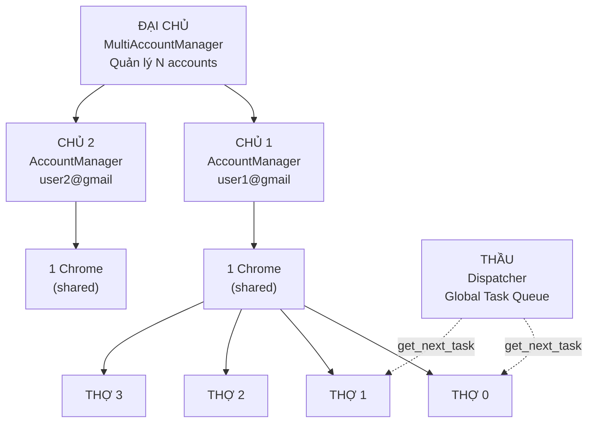
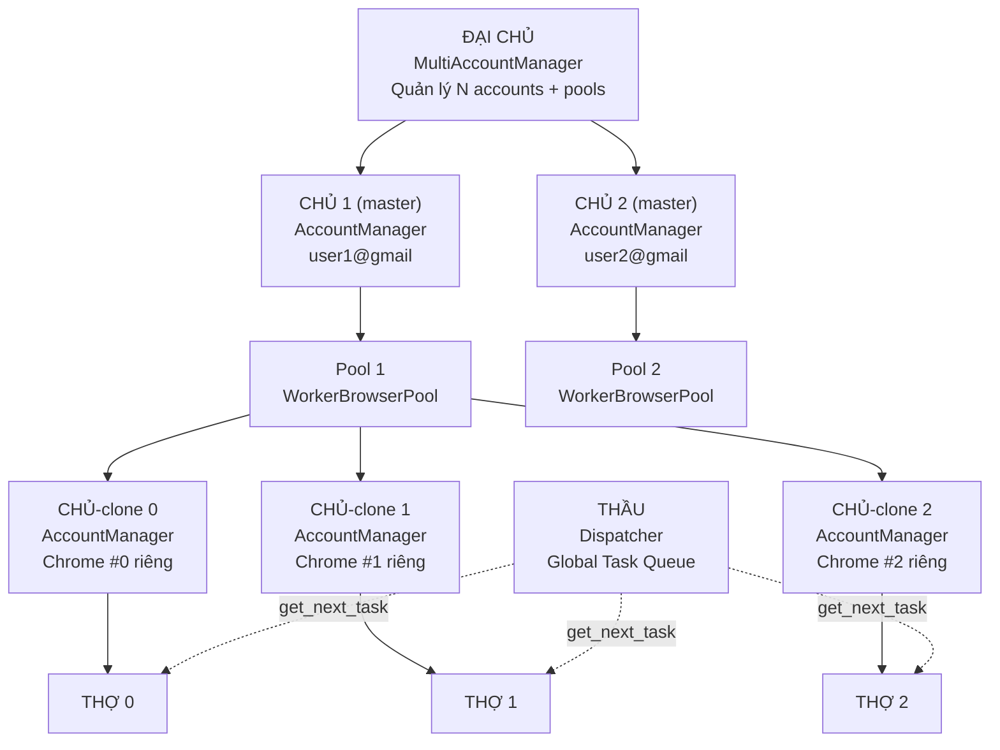
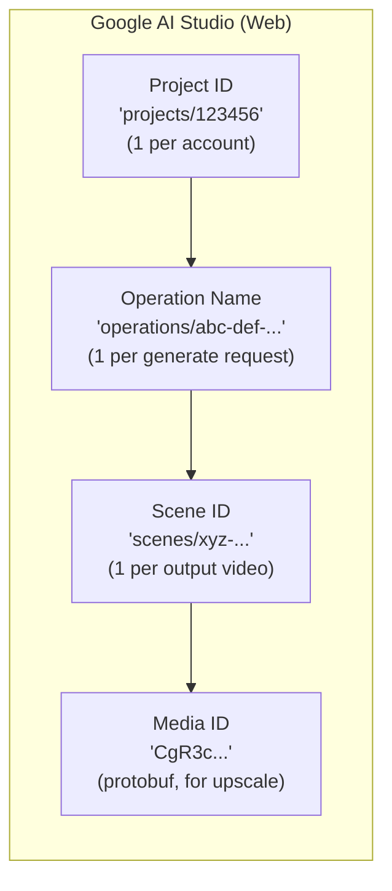
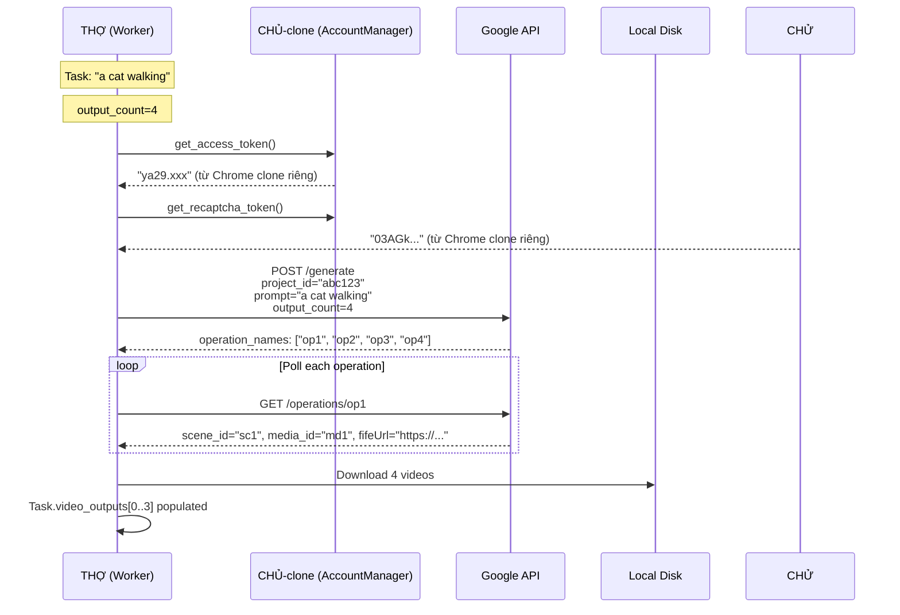
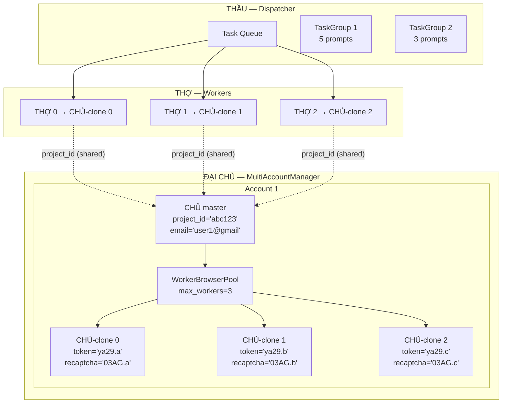
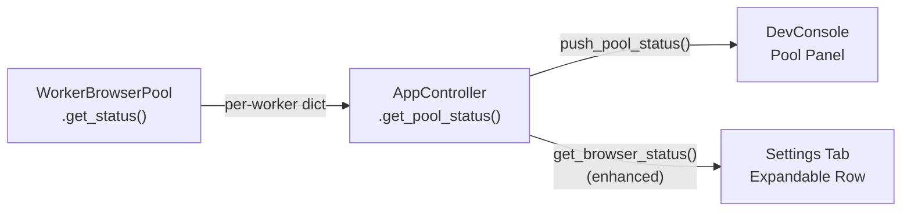

# Per-Worker Browser Isolation — Complete Management Plan

---

## 1. Role Hierarchy: ĐẠI CHỦ → CHỦ → THẦU → THỢ

### 1.1 Hiện tại



### 1.2 Kiến trúc MỚI



### 1.3 Vai trò chi tiết

| Role | Class | Nhiệm vụ | Thay đổi |
|------|-------|-----------|----------|
| **ĐẠI CHỦ** | `MultiAccountManager` | Quản lý N accounts, tổng capacity, load balancing | + Quản lý `WorkerBrowserPool` per account |
| **CHỦ (master)** | `AccountManager` | Giữ master profile, login source, project_id | + `create_worker_clone()` |
| **CHỦ (clone)** | `AccountManager` (clone) | **MỚI**: Mỗi worker có CHỦ riêng, browser riêng | Isolated session + token |
| **THẦU** | `Dispatcher` | Global queue, task routing, dependency chain | Không thay đổi |
| **THỢ** | `Worker` | Execute 1 task, gọi API | Không thay đổi |
| **Pool** | `WorkerBrowserPool` | **MỚI**: Quản lý N Chrome profiles cho 1 account | Clone/launch/kill/restart |

---

## 2. Google Flow IDs — Mapping

### 2.1 ID trên Google (web flow)



### 2.2 Mapping vào App

| Google ID | App field | Scope | Tạo bởi | Liên quan Chrome profile? |
|-----------|----------|-------|---------|--------------------------|
| **Project ID** | `AccountManager._project_id` | Per-account | Worker đầu tiên create/get | ❌ KHÔNG — API level |
| **Operation Name** | `Task.operation_names[]` | Per-task | API response khi submit | ❌ KHÔNG — API level |
| **Scene ID** | `Task.scene_ids[]` | Per-video | API response khi poll | ❌ KHÔNG — API level |
| **Media ID** | `VideoOutputInfo.media_id` | Per-video | API response khi poll | ❌ KHÔNG — API level |

### 2.3 Flow chi tiết: Task → Google IDs → Files



### 2.4 Project ID — Shared vs Isolated

```
Account "user1@gmail.com"
│
├── CHỦ master:   project_id = "abc123"     ← Tạo 1 lần
│
├── CHỦ-clone 0:  project_id = "abc123"     ← Copy reference từ master
│   └── Chrome #0 (profile _w0)             ← Browser riêng
│       └── Token extraction riêng
│
├── CHỦ-clone 1:  project_id = "abc123"     ← Cùng project
│   └── Chrome #1 (profile _w1)
│
└── CHỦ-clone 2:  project_id = "abc123"     ← Cùng project
    └── Chrome #2 (profile _w2)
```

> [!IMPORTANT]
> **Project ID, Operation Name, Scene ID, Media ID = API level.**
> **Chrome profile = Browser level (cookies, tokens, reCAPTCHA).**
> 2 tầng này **ĐỘC LẬP**. Clone Chrome profile không ảnh hưởng Google IDs.

---

## 3. ID Hierarchy: Account → Master → Clone

### 3.1 Naming & tracking

```python
@dataclass
class WorkerProfileInfo:
    """Tracking 1 worker Chrome profile."""
    worker_index: int              # 0, 1, 2, 3
    path: str                      # /profiles/user@gmail_w0/
    status: str = "not_created"    # "not_created"|"active"|"disabled"|"error"
    chrome_pid: Optional[int] = None
    cdp_port: Optional[int] = None
    last_cloned: Optional[str] = None

@dataclass
class ChromeProfile:
    email: str                             # Account ID
    browser_profile_path: str              # Master: /profiles/user@gmail/
    is_enabled: bool = True                # Account-level toggle
    max_slots: int = 4                     # Số workers active
    worker_profiles: Dict[int, WorkerProfileInfo]  # Clones tracking
```

### 3.2 Quan hệ rõ ràng

```
ChromeProfile (master)                     ← Quản lý bởi ProfilesController
├── email = "user@gmail.com"               ← Account ID = key
├── browser_profile_path = ".../user@gmail/"
├── is_enabled = True
├── max_slots = 3
└── worker_profiles                        ← Clones quản lý THEO master
    ├── [0] path=".../user@gmail_w0/"  status="active"   pid=1234
    ├── [1] path=".../user@gmail_w1/"  status="active"   pid=5678
    ├── [2] path=".../user@gmail_w2/"  status="active"   pid=9012
    └── [3] path=".../user@gmail_w3/"  status="disabled" pid=None
```

---

## 4. Enable/Disable Account → Profile Behavior

### 4.1 DISABLE account

| Thao tác | Chi tiết |
|----------|---------|
| `AccountManager._enabled = False` | Workers không nhận task mới |
| Workers đang chạy | **Đợi hoàn thành** task hiện tại |
| Chrome processes | **KILL ALL** sau khi workers idle |
| Clone profiles trên disk | **GIỮ** (dùng lại khi enable) |
| Master profile | **GIỮ** |
| `worker_profiles[*].status` | → `"disabled"` |
| `worker_profiles[*].pid` | → `None` |

### 4.2 ENABLE account (sau disable)

| Thao tác | Chi tiết |
|----------|---------|
| `AccountManager._enabled = True` | Workers có thể nhận task |
| Chrome processes | **CHƯA launch** (lazy — khi có task đầu tiên) |
| Clone profiles trên disk | **Dùng lại** (không re-clone) |
| `worker_profiles[*].status` | → `"active"` |

---

## 5. Tăng/Giảm Workers → Profile Lifecycle

### 5.1 Behavior matrix

| Hành động | Master | Clone disk | Chrome process | Worker coroutine |
|-----------|--------|------------|----------------|-----------------|
| **Tăng slots** (2→4) | Giữ | Clone mới nếu chưa có, reuse nếu có | Lazy-launch | Spawn thêm |
| **Giảm slots** (4→2) | Giữ | **GIỮ** | **KILL** dư | **Stop** dư (sau khi hoàn thành task) |
| **Xóa account** | **XÓA** | **XÓA ALL** (`glob _w*`) | **KILL ALL** | Destroy |
| **Re-login master** | Update session | **RE-CLONE ALL** | Restart all | Restart |
| **App restart** | Giữ | Reuse (trên disk) | `launch_or_reconnect()` | Spawn lại |
| **App crash** | Giữ | Giữ | Orphan → reconnect | Spawn lại |

---

## 6. Tổng quan quản lý — Mọi thứ ở đâu



| Layer | Manages | Scope |
|-------|---------|-------|
| **ĐẠI CHỦ** | N accounts + N pools | Global |
| **CHỦ master** | Login, project_id, paygate_tier | Per-account |
| **Pool** | N Chrome profiles, PIDs, ports | Per-account |
| **CHỦ clone** | Tokens, reCAPTCHA, browser headers | Per-worker |
| **THẦU** | Task queue, dependencies, groups | Global |
| **THỢ** | Execute 1 task → API → download | Per-task |
| **Google IDs** | Project → Operation → Scene → Media | API level (không phụ thuộc Chrome) |

---

## 7. Implementation Order

| Step | File | Chi tiết |
|------|------|----------|
| 1 ✅ | `profiles_controller.py` | `WorkerProfileInfo` dataclass + `worker_profiles` field + `clone_profile_for_worker()` + update `remove_profile()` cascade |
| 2 ✅ | `worker_browser_pool.py` | **[NEW]** `WorkerBrowserPool` — launch/kill/restart/scale per worker |
| 3 ✅ | `account_manager.py` | `create_worker_clone()` — isolated session, shared project_id |
| 4 ✅ | `multi_account.py` | ĐẠI CHỦ giữ `_worker_pools` dict, quản lý pool lifecycle |
| 5 ✅ | `engine.py` | `_spawn_workers_for_account()` dùng pool + per-worker account |
| 6 ✅ | `engine.py` | `_account_worker_loop()` per-worker browser + recovery |
| 7 ✅ | `engine.py` | Recovery keys: `email` → `email:w{idx}` |
| 8 ✅ | `app_controller.py` | Enable/disable → pool.activate/shutdown |

---

## 8. UI — Hiển thị và quản lý Chrome profiles trên giao diện

### 8.1 Hiện tại (THIẾU)

Settings tab chỉ hiển thị **account-level**:

```
┌─────────┬────┬────────────┬─────────┬──────┬─────────┬────────┬─────────┬─────────┐
│ Toggle  │ #  │ Email      │ Browser │ Plan │ Credits │ Status │ Workers │ Actions │
├─────────┼────┼────────────┼─────────┼──────┼─────────┼────────┼─────────┼─────────┤
│ [✓]     │ 1  │ user@gmail │ 🌐 Open │ Ultra│  250    │ 🟢 OK  │ [4 ▲▼] │ 🔑 🔄 ❌ │
└─────────┴────┴────────────┴─────────┴──────┴─────────┴────────┴─────────┴─────────┘
```

**❌ Không có thông tin:**
- Master vs Clone profile paths
- Per-worker Chrome PID / CDP Port
- Clone status (`active` / `disabled` / `error`)
- Disk usage per clone
- Pool health (bao nhiêu worker đang chạy / crashed)

### 8.2 Đề xuất: Expandable Row trong Settings

Khi user click vào row hoặc nút "▶", mở rộng section hiển thị per-worker details:

```
┌─────────┬────┬────────────┬─────────┬──────┬─────────┬────────┬─────────┬─────────┐
│ Toggle  │ #  │ Email      │ Browser │ Plan │ Credits │ Status │ Workers │ Actions │
├─────────┼────┼────────────┼─────────┼──────┼─────────┼────────┼─────────┼─────────┤
│ [✓]     │ 1  │ user@gmail │ 🌐 Open │ Ultra│  250    │ 🟢 OK  │ [3 ▲▼] │ 🔑 🔄 ❌ │
├─────────┴────┴────────────┴─────────┴──────┴─────────┴────────┴─────────┴─────────┤
│  📁 Master: .../profiles/user@gmail/                                              │
│  ┌──────────┬───────────────────────────┬────────────┬──────┬──────┐               │
│  │ Worker # │ Profile Path              │ Status     │ PID  │ Port │               │
│  ├──────────┼───────────────────────────┼────────────┼──────┼──────┤               │
│  │ w0       │ .../user@gmail_w0/        │ 🟢 ready   │ 1234 │ 9222 │               │
│  │ w1       │ .../user@gmail_w1/        │ 🟢 ready   │ 5678 │ 9223 │               │
│  │ w2       │ .../user@gmail_w2/        │ 🟡 busy    │ 9012 │ 9224 │               │
│  │ w3       │ .../user@gmail_w3/        │ ⚫ disabled│ —    │ —    │               │
│  └──────────┴───────────────────────────┴────────────┴──────┴──────┘               │
└───────────────────────────────────────────────────────────────────────────────────────┘
```

### 8.3 DevConsole: Pool Status Panel

Thêm panel mới "🏊 Worker Pools" trong DevConsole (tab_devconsole.py):

```
┌─ 🏊 Worker Pools ──────────────────────────────────┐
│ Account: user@gmail.com (3/4 active)                │
│   w0: 🟢 ready  PID=1234  port=9222  restarts=0    │
│   w1: 🟢 ready  PID=5678  port=9223  restarts=0    │
│   w2: 🟡 busy   PID=9012  port=9224  restarts=1    │
│   w3: ⚫ disabled                                    │
│                                                      │
│ Account: user2@gmail.com (2/2 active)               │
│   w0: 🟢 ready  PID=3456  port=9225  restarts=0    │
│   w1: 🟢 ready  PID=7890  port=9226  restarts=0    │
└──────────────────────────────────────────────────────┘
```

### 8.4 Data Flow: Backend → UI



**Cần thêm:**

| Component | Method mới | Mô tả |
|-----------|-----------|-------|
| `AppController` | `get_pool_status()` | Trả về pool info cho tất cả accounts |
| `AppController` | `_push_pool_status()` | Push pool data → DevConsole (timer 5s) |
| `AppController` | `get_browser_status()` **update** | Bổ sung `worker_details[]` vào mỗi account dict |
| `tab_settings.py` | `_create_worker_details()` | Tạo expandable widget hiển thị per-worker info |
| `tab_devconsole.py` | `_create_pool_panel()` | Panel mới hiển thị pool status |
| `tab_devconsole.py` | `update_pool_status()` | Slot nhận pool data từ AppController |

### 8.5 get_browser_status() — Enhanced Response

```python
# BEFORE (account-level only):
{
    "email": "user@gmail.com",
    "enabled": True,
    "slots": 4,
    "has_browser": True,
    "state": "🟢 Ready",
}

# AFTER (+ per-worker details):
{
    "email": "user@gmail.com",
    "enabled": True,
    "slots": 4,
    "has_browser": True,
    "state": "🟢 Ready",
    "isolation": True,                    # NEW
    "master_profile": "...user@gmail/",   # NEW
    "worker_details": [                   # NEW
        {"index": 0, "status": "ready",   "pid": 1234, "port": 9222, "restarts": 0},
        {"index": 1, "status": "ready",   "pid": 5678, "port": 9223, "restarts": 0},
        {"index": 2, "status": "busy",    "pid": 9012, "port": 9224, "restarts": 1},
        {"index": 3, "status": "disabled","pid": None, "port": None, "restarts": 0},
    ],
}
```

---

## 9. Implementation Order (Updated)

| Step | File | Chi tiết | Status |
|------|------|----------|--------|
| 1 | `profiles_controller.py` | `WorkerProfileInfo` + clone methods + cascade delete | ✅ Done |
| 2 | `worker_browser_pool.py` | **[NEW]** WorkerBrowserPool class | ✅ Done |
| 3 | `account_manager.py` | `create_worker_clone()` factory | ✅ Done |
| 4 | `multi_account.py` | ĐẠI CHỦ pool management | ✅ Done |
| 5-7 | `engine.py` | Per-worker spawning + isolation + recovery keys | ✅ Done |
| 8 | `app_controller.py` | `toggle_account()` + `set_account_max_slots()` | ✅ Done |
| **9** | `app_controller.py` | `get_pool_status()` + enhance `get_browser_status()` | ✅ Done |
| **10** | `tab_settings.py` | Expandable worker details row + `_create_worker_details_widget()` | ✅ Done |
| **11** | `tab_devconsole.py` | Pool Status panel (`🏊 Worker Pools`) | ✅ Done |
| **12** | `app_controller.py` + `app.py` | `_push_pool_status()` timer (5s) | ✅ Done |
| **13** | `profiles_controller.py` | `get_all_profiles()` expose `worker_profiles` + `clone_count` | ✅ Done |
| **14** | `tab_settings.py` | Thêm cột "Profiles" (col 7) hiển thị `1+N 📁` | ✅ Done |
| **15** | `tab_settings.py` | Expandable row fallback to disk data khi pool chưa active | ✅ Done |

---

## 10. Profile Visibility — Bổ sung (Steps 13-15)

### 10.1 Vấn đề

Settings tab thiếu thông tin Chrome profile management:
- `get_all_profiles()` **bỏ qua** field `worker_profiles` → UI không biết có bao nhiêu clone
- Expandable row **chỉ hiện khi pool đang chạy** (runtime) → vừa mở app = không thấy gì
- Không có cột nào hiển thị master/clone count luôn luôn visible

### 10.2 Giải pháp

#### Step 13: `profiles_controller.py` — expose disk data

```python
# get_all_profiles() giờ trả về thêm:
{
    "worker_profiles": {
        0: {"path": ".../_w0/", "status": "active", "chrome_pid": None, ...},
        1: {"path": ".../_w1/", "status": "active", ...},
    },
    "clone_count": 2,  # len(worker_profiles)
}
```

#### Step 14: `tab_settings.py` — cột "Profiles" (10 cột)

```
┌──────┬──┬────────────┬────────┬──────┬────────┬────────┬──────────┬────────┬──────────┐
│ ✓    │# │ Email      │ Type   │ Plan │Credits │ Status │ Profiles │Workers │ Actions  │
├──────┼──┼────────────┼────────┼──────┼────────┼────────┼──────────┼────────┼──────────┤
│ [✓]  │1 │ user@gmail │ 🌐Open │ Ultra│  250   │ 🟢 OK  │ 1+3 📁   │ [3▲▼]  │🔑🔄❌ℹ️│
└──────┴──┴────────────┴────────┴──────┴────────┴────────┴──────────┴────────┴──────────┘
```

- `1+0 📁` = chỉ master, chưa có clone
- `1+3 📁` = 1 master + 3 clones trên disk
- Hover tooltip: "1 master + 3 worker clones on disk"

#### Step 15: Expandable row fallback

```python
# Trước: chỉ hiện khi runtime pool active
if winfo and winfo.get("worker_details"):  # ❌ miss disk data

# Sau: fallback sang ProfilesController disk data
disk_workers = acc.get('worker_profiles', {})
has_runtime = winfo and winfo.get("worker_details")
has_disk = bool(disk_workers)
if has_runtime or has_disk:  # ✅ hiện ngay khi có clone trên disk
```

→ Nút ℹ️ hiện ngay cả khi app vừa mở, dùng path/status từ JSON profiles.
