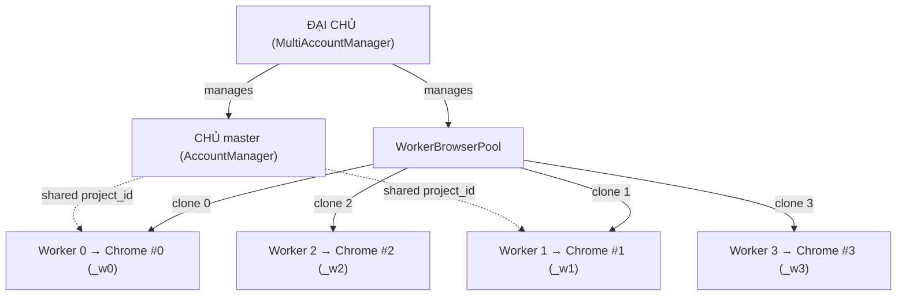

# Per-Worker Browser Isolation — Walkthrough

## Summary

Implemented per-worker browser isolation so each worker gets its own Chrome profile clone and browser instance. A crash in one worker's Chrome no longer affects other workers.

## Architecture

## Changes Made

### 1. [profiles_controller.py](file:///d:/NEW%20VEO%20PRO%20MAX/veo-pro-max/02%20-%20CLIENT%20-%20VEO%20PRO%20MAX/core/profiles_controller.py)

- **`WorkerProfileInfo`** dataclass — tracks clone path, status, Chrome PID, CDP port
- **`worker_profiles`** dict added to `ChromeProfile` — maps worker_index → WorkerProfileInfo
- **`to_dict()`/`from_dict()`** updated for JSON serialization (int keys → string keys)
- **`clone_profile_for_worker()`** — copies cookies/storage from master, skips cache (~100MB vs ~500MB)
- **`setup_worker_profiles()`** — idempotent setup for N workers
- **`reclone_worker()`** — delete + re-clone (after master re-login)
- **`remove_profile()`** — cascade-deletes all `_w*` clone dirs

### 2. [worker_browser_pool.py](file:///d:/NEW%20VEO%20PRO%20MAX/veo-pro-max/02%20-%20CLIENT%20-%20VEO%20PRO%20MAX/core/worker_browser_pool.py) (NEW)

- **`WorkerBrowserState`** — runtime state (PID, port, status)
- **`WorkerBrowserPool`** — manages N Chrome instances per account
  - `setup()` → clone profiles
  - `launch_worker()` / `kill_worker()` / `restart_worker()` → per-worker Chrome lifecycle
  - `scale()` → add/remove workers dynamically
  - `shutdown_all()` / `disable_all()` / `activate_all()` / `reclone_all()`

### 3. [account_manager.py](file:///d:/NEW%20VEO%20PRO%20MAX/veo-pro-max/02%20-%20CLIENT%20-%20VEO%20PRO%20MAX/core/account_manager.py)

- **`create_worker_clone()`** — creates isolated AccountManager per worker with:
  - ✅ Own `AccountSession` (max_slots=1)
  - ✅ Own `_browser_session` (isolated Chrome)
  - ✅ Own `_token_cache`
  - 🔗 Shared `_project_id`, `_project_manager`, `_paygate_tier`

### 4. [multi_account.py](file:///d:/NEW%20VEO%20PRO%20MAX/veo-pro-max/02%20-%20CLIENT%20-%20VEO%20PRO%20MAX/core/multi_account.py)

- `_worker_pools` dict — one `WorkerBrowserPool` per account
- `setup_pool()`, `get_pool()`, `disable_pool()`, `activate_pool()`, `scale_pool()`, `reclone_pool()`
- `remove_account()` and `shutdown_browsers()` now shutdown pools first

### 5. [engine.py](file:///d:/NEW%20VEO%20PRO%20MAX/veo-pro-max/02%20-%20CLIENT%20-%20VEO%20PRO%20MAX/core/engine.py)

- **`_spawn_workers_for_account()`** — creates per-worker cloned AccountManagers via pool
- **`_do_browser_recovery()`** — recovery keys changed from `email` to `email:w{idx}` for isolated recovery

### 6. [app_controller.py](file:///d:/NEW%20VEO%20PRO%20MAX/veo-pro-max/02%20-%20CLIENT%20-%20VEO%20PRO%20MAX/core/app_controller.py)

- **`toggle_account()`** — enables/disables account + activates/disables pool
- **`set_account_max_slots()`** — updates slots + scales pool
- **`get_pool_status()`** — returns per-worker pool data for DevConsole
- **`get_browser_status()`** — enhanced with `isolation`, `master_profile`, `worker_details[]`
- **`_push_pool_status()`** — thread-safe push to DevConsole (QMetaObject pattern)

### 7. [tab_settings.py](file:///d:/NEW%20VEO%20PRO%20MAX/veo-pro-max/02%20-%20CLIENT%20-%20VEO%20PRO%20MAX/ui/tabs/tab_settings.py)

- **`_refresh_profiles_table()`** — now inserts expandable detail rows after each account row
  - Queries `get_browser_status()` for `worker_details[]`
  - Hidden by default, toggled via ℹ️ button in Actions column
- **`_create_worker_details_widget()`** — compact widget showing master path + per-worker PID/port/status

### 8. [tab_devconsole.py](file:///d:/NEW%20VEO%20PRO%20MAX/veo-pro-max/02%20-%20CLIENT%20-%20VEO%20PRO%20MAX/ui/tabs/tab_devconsole.py)

- **`🏊 Worker Pools`** panel in Row 3 (spans both columns)
- **`update_pool_status()`** — renders per-account, per-worker status with icons
- **`update_pool_status_safe()`** — thread-safe slot for background thread calls

### 9. [app.py](file:///d:/NEW%20VEO%20PRO%20MAX/veo-pro-max/02%20-%20CLIENT%20-%20VEO%20PRO%20MAX/ui/app.py)

- **`_toggle_dev_console()`** — now calls `_push_pool_status()` on DevConsole open
- **`_poll_status_bar()`** — pushes pool status every 5 seconds

## Validation

| File | Syntax Check |
|------|-------------|
| `worker_browser_pool.py` | ✅ OK |
| `profiles_controller.py` | ✅ OK |
| `account_manager.py` | ✅ OK |
| `multi_account.py` | ✅ OK |
| `engine.py` | ✅ OK |
| `app_controller.py` | ✅ OK |
| `tab_settings.py` | ✅ OK |
| `tab_devconsole.py` | ✅ OK |
| `app.py` | ✅ OK |

## Key Design Decisions

- **Backward-compatible**: Falls back to shared browser mode if ProfilesController is unavailable
- **Idempotent**: Clone profiles persist on disk and are reused across restarts
- **Selective copy**: Only cookies/storage/login data are cloned (~100MB), not cache (~500MB)
- **Profiles on disk survive disable**: Disabling an account kills Chrome but keeps profiles for quick re-enable
- **Detail rows start hidden**: ℹ️ button toggles expandable per-worker view to avoid UI clutter
- **Pool panel auto-refreshes**: 5-second timer pushes fresh data, no manual refresh needed
