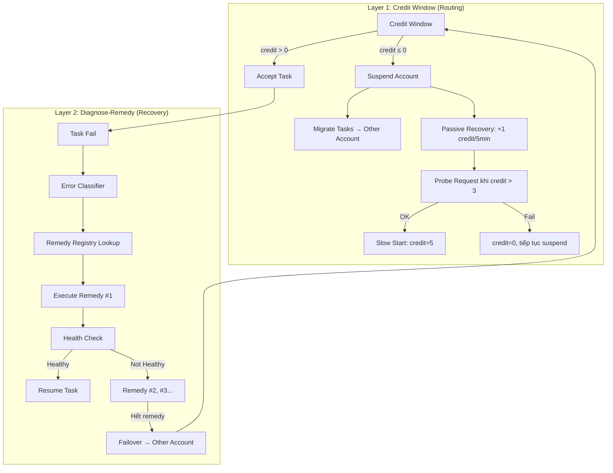
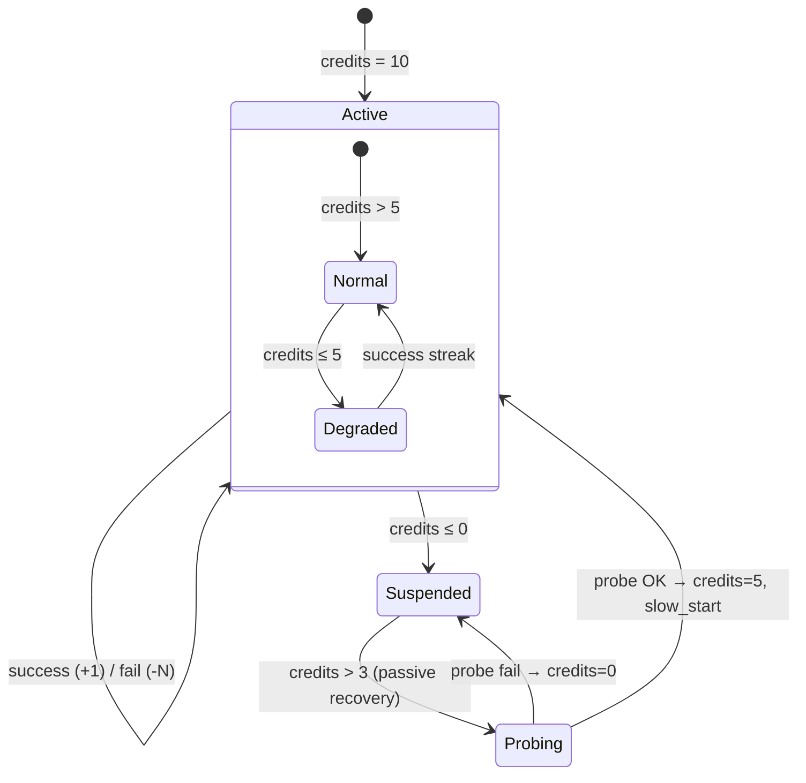
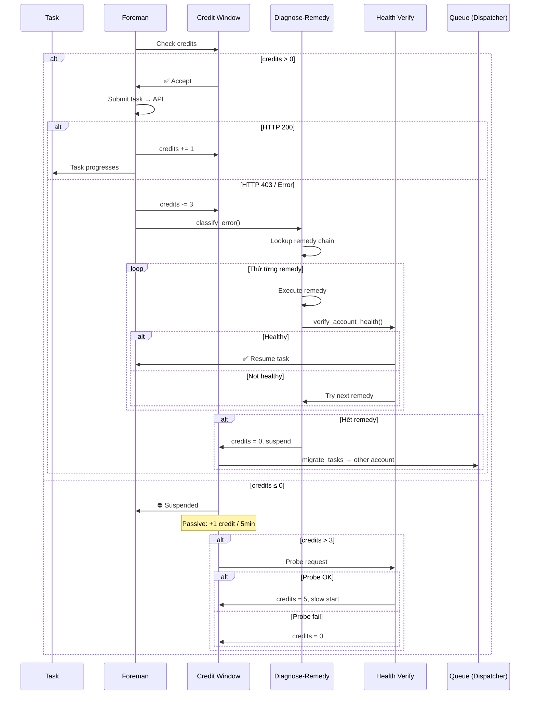

# Smart Recovery Architecture: Credit Window + Diagnose-Remedy

> **Supersedes**: Phase 0-3 Recovery State Machine (engine.py L2568-2720)  
> **Related**: [PREWARM_RECOVERY_ARCHITECTURE.md](../PREWARM_RECOVERY_ARCHITECTURE.md) (pre-warm chỉ xử lý idle, doc này xử lý toàn bộ failure recovery)  
> **Created**: 2026-02-27 — từ phân tích log thực tế cho thấy hệ thống cũ không đủ

---

## 1. Vấn đề với hệ thống hiện tại

### 1.1 Phase 0-3 Recovery chỉ restart browser

```
Hiện tại:  403 → cooldown 30s → retry → 403 → cooldown 60s → retry → 403 
           → restart browser → 403 → ... (loop vô tận)
```

Restart browser **KHÔNG giải quyết** khi Google đã flag account. Cần phương pháp khác.

### 1.2 Không có cross-account failover

Task fail trên account A luôn quay lại account A vì:
- PA3 fair-share gate chặn account B (đang chạy nhiều)
- Foremen account A thức dậy cùng lúc sau cooldown → chiếm queue
- Không có `excluded_accounts` filter

### 1.3 Tất cả lỗi xử lý giống nhau

| Loại lỗi | Nguyên nhân khác nhau | Nhưng hệ thống cũ đều... |
|---|---|---|
| reCAPTCHA 403 | Google flag account | Restart browser |
| Token quá ngắn | Widget chưa load | Restart browser |
| Tab frozen | Memory leak | Restart browser |
| Auth expired | OAuth timeout | Fail vĩnh viễn |
| x-client-data 8 chars | Variations chưa enroll | Warning rồi bỏ qua |

---

## 2. Kiến trúc mới: 2 Layer



---

## 3. Layer 1: Credit Window

### 3.1 Cơ chế (lấy từ TCP Congestion Control)

```python
@dataclass
class AccountHealth:
    credits: int = 10           # Max = 10
    suspended: bool = False
    suspended_at: float = 0
    last_probe: float = 0
    slow_start_cap: int = 1     # Task limit during slow start
    
    MAX_CREDITS = 10
    SUSPEND_THRESHOLD = 0       # credits ≤ 0 → suspend
    PROBE_THRESHOLD = 3         # credits > 3 → try probe
    PASSIVE_RECOVERY_INTERVAL = 300  # +1 credit mỗi 5 phút
    SLOW_START_INITIAL = 5      # credit sau probe OK
```

### 3.2 Credit Rules

| Event | Credit Change | Ghi chú |
|---|---|---|
| Submit HTTP 200 | +1 (cap ở MAX) | Thành công |
| Submit HTTP 403 | -3 | reCAPTCHA fail |
| Submit timeout | -2 | Request timeout |
| Tab frozen | -2 | Browser issue |
| Network error | 0 (requeue only) | Không phải lỗi account |
| Passive recovery | +1 mỗi 5 phút | Khi suspended |

### 3.3 State Transitions



### 3.4 Integration với Dispatcher

```python
# dispatcher.py — get_next_task()
def get_next_task(self, account_email: str = None) -> Optional[Task]:
    # Credit check TRƯỚC PA3 gate
    health = self._account_health.get(account_email)
    if health and health.suspended:
        return None  # Account tạm dừng
    
    # Slow start check
    if health and health.slow_start_cap > 0:
        my_running = self._per_account_running.get(account_email, 0)
        if my_running >= health.slow_start_cap:
            return None  # Đợi task hiện tại xong
    
    # ... existing PA3 gate logic ...
    # ... existing queue pop logic ...
    
    # Excluded accounts check
    if account_email and hasattr(task, 'excluded_accounts'):
        if account_email in task.excluded_accounts:
            # Put back, try next
            self._ready_queue.put_nowait((priority, counter, task))
            continue
```

### 3.5 Task Migration khi suspend

```python
# dispatcher.py — migrate_tasks()
def migrate_tasks(self, from_account: str):
    """Chuyển tất cả READY tasks sang account khác."""
    migrated = 0
    for task in self._all_tasks.values():
        if (task.assigned_account == from_account 
                and task.state == TaskState.READY):
            task.assigned_account = None
            task.excluded_accounts = getattr(task, 'excluded_accounts', set())
            task.excluded_accounts.add(from_account)
            migrated += 1
    
    log.info(f"[CreditWindow] Migrated {migrated} tasks from {from_account}")
    self._task_available.set()  # Wake other foremen
```

---

## 4. Layer 2: Diagnose-Remedy

### 4.1 Error Classifier

```python
class ErrorType(Enum):
    RECAPTCHA_403 = "recaptcha_403"
    RECAPTCHA_TIMEOUT = "recaptcha_timeout"
    TOKEN_TOO_SHORT = "token_too_short"
    TAB_FROZEN = "tab_frozen"
    XCD_STUCK = "xcd_stuck_short"
    AUTH_EXPIRED = "auth_expired"
    NETWORK_ERROR = "network_error"
    UNKNOWN = "unknown"

def classify_error(error_msg: str, context: dict) -> ErrorType:
    """Phân loại lỗi từ error message + context."""
    lower = error_msg.lower()
    
    if "recaptcha" in lower and "403" in error_msg:
        return ErrorType.RECAPTCHA_403
    if "recaptcha" in lower and "timeout" in lower:
        return ErrorType.RECAPTCHA_TIMEOUT
    if "token too short" in lower or context.get("token_len", 9999) < 1000:
        return ErrorType.TOKEN_TOO_SHORT
    if "tab" in lower and ("frozen" in lower or "dead" in lower):
        return ErrorType.TAB_FROZEN
    if "x-client-data" in lower and "8 chars" in lower:
        return ErrorType.XCD_STUCK
    if "access token expired" in lower or "refresh failed" in lower:
        return ErrorType.AUTH_EXPIRED
    if any(k in lower for k in ("network", "connection", "dns", "econnreset")):
        return ErrorType.NETWORK_ERROR
    
    return ErrorType.UNKNOWN
```

### 4.2 Remedy Registry

Mỗi loại lỗi có **chuỗi remedy thử lần lượt** — dừng khi verify OK.

```python
REMEDY_CHAINS: Dict[ErrorType, List[Remedy]] = {
    
    ErrorType.RECAPTCHA_403: [
        Remedy(
            name="borrow_headers",
            action=borrow_xcd_from_healthy_account,
            wait_after=0,
            description="Copy x-client-data từ account đang healthy"
        ),
        Remedy(
            name="full_page_reload",
            action=navigate_to_tools_flow,
            wait_after=10,
            description="Reload VEO page → fresh reCAPTCHA context"
        ),
        Remedy(
            name="suspend_account",
            action=suspend_via_credit_window,
            wait_after=0,
            description="Suspend account, chuyển task sang account khác"
        ),
    ],
    
    ErrorType.RECAPTCHA_TIMEOUT: [
        Remedy(
            name="reload_tab",
            action=reload_active_tab,
            wait_after=5,
            description="Reload tab hiện tại"
        ),
        Remedy(
            name="new_tab",
            action=create_fresh_veo_tab,
            wait_after=10,
            description="Mở tab VEO mới, đóng tab cũ"
        ),
        Remedy(
            name="restart_browser",
            action=hard_restart_browser,
            wait_after=15,
            description="Restart Chrome hoàn toàn"
        ),
    ],
    
    ErrorType.TOKEN_TOO_SHORT: [
        Remedy(
            name="navigate_flow",
            action=navigate_to_tools_flow,
            wait_after=5,
            description="Navigate về /tools/flow (reCAPTCHA widget cần URL đúng)"
        ),
        Remedy(
            name="clear_recap_cache",
            action=clear_recaptcha_and_reload,
            wait_after=5,
            description="Clear reCAPTCHA state + reload"
        ),
        Remedy(
            name="reload_extension",
            action=reload_chrome_extension,
            wait_after=10,
            description="Reload extension để reset WS connection"
        ),
    ],
    
    ErrorType.TAB_FROZEN: [
        Remedy(
            name="kill_tab",
            action=close_and_reopen_tab,
            wait_after=5,
            description="Close frozen tab + open new VEO tab"
        ),
        Remedy(
            name="restart_browser",
            action=hard_restart_browser,
            wait_after=15,
            description="Chrome process kill + relaunch"
        ),
    ],
    
    ErrorType.XCD_STUCK: [
        Remedy(
            name="borrow_xcd",
            action=copy_xcd_from_other_account,
            wait_after=0,
            description="Copy x-client-data từ account khác"
        ),
        Remedy(
            name="force_variations",
            action=navigate_to_trigger_variations,
            wait_after=15,
            description="Navigate nhiều Google pages → trigger Variations enrollment"
        ),
        Remedy(
            name="new_profile",
            action=create_fresh_chrome_profile,
            wait_after=30,
            description="Tạo Chrome profile mới (last resort)"
        ),
    ],
    
    ErrorType.AUTH_EXPIRED: [
        Remedy(
            name="extension_refresh",
            action=extension_refresh_access_token,
            wait_after=5,
            description="Extension bridge refresh OAuth token"
        ),
        Remedy(
            name="cookie_refresh",
            action=reload_page_for_fresh_cookies,
            wait_after=10,
            description="Reload VEO page → fresh cookies → new token"
        ),
        Remedy(
            name="notify_manual",
            action=notify_user_manual_relogin,
            wait_after=0,
            description="Thông báo user cần re-login thủ công"
        ),
    ],
    
    ErrorType.NETWORK_ERROR: [
        # Network errors → không retry, chỉ requeue
        Remedy(
            name="requeue",
            action=requeue_and_pause,
            wait_after=0,
            description="Pause engine, chờ connectivity"
        ),
    ],
}
```

### 4.3 Health Verify (sau mỗi remedy)

```python
async def verify_account_health(account, ext_bridge) -> HealthResult:
    """Multi-check xác nhận account healthy trước khi resume."""
    
    checks = {}
    
    # 1. Extension connected?
    checks["extension"] = ext_bridge.is_connected(account.email)
    
    # 2. x-client-data đủ dài?
    xcd = ext_bridge.get_cached_header(account.email, "x-client-data")
    checks["xcd_valid"] = len(xcd or "") > 100
    
    # 3. reCAPTCHA widget ready?
    try:
        ready = await ext_bridge.check_recaptcha_ready(account.email, timeout=10)
        checks["recaptcha_ready"] = ready
    except Exception:
        checks["recaptcha_ready"] = False
    
    # 4. Probe request (lightweight API call)?
    if all(checks.values()):
        try:
            probe = await ext_bridge.submit_probe(account.email, timeout=15)
            checks["probe_ok"] = probe.get("success", False)
        except Exception:
            checks["probe_ok"] = False
    
    failed = [k for k, v in checks.items() if not v]
    
    return HealthResult(
        healthy=len(failed) == 0,
        checks=checks,
        failed=failed,
    )
```

### 4.4 Recovery Orchestrator (thay thế Phase 0-3)

```python
async def execute_recovery(
    account, error_msg: str, context: dict
) -> RecoveryResult:
    """Diagnose → Remedy → Verify → Resume/Failover."""
    
    # Step 1: Classify
    error_type = classify_error(error_msg, context)
    log.info(f"[Recovery] {account.email}: classified as {error_type.value}")
    
    # Step 2: Lookup remedy chain
    chain = REMEDY_CHAINS.get(error_type, [])
    
    # Step 3: Try remedies one by one
    for i, remedy in enumerate(chain):
        log.info(
            f"[Recovery] {account.email}: trying remedy {i+1}/{len(chain)} "
            f"'{remedy.name}' — {remedy.description}"
        )
        
        # Execute
        try:
            await remedy.action(account)
        except Exception as e:
            log.warning(f"[Recovery] Remedy '{remedy.name}' failed: {e}")
            continue
        
        # Wait
        if remedy.wait_after > 0:
            await asyncio.sleep(remedy.wait_after)
        
        # Verify
        health = await verify_account_health(account, ext_bridge)
        
        if health.healthy:
            log.info(
                f"[Recovery] {account.email}: ✅ remedy '{remedy.name}' "
                f"fixed the issue — resuming tasks"
            )
            # Adjust credits
            account_health.credits = min(
                account_health.credits + 2,
                AccountHealth.MAX_CREDITS
            )
            return RecoveryResult(
                success=True,
                remedy_used=remedy.name,
                attempts=i + 1,
            )
        
        log.warning(
            f"[Recovery] {account.email}: remedy '{remedy.name}' → "
            f"still unhealthy (failed: {health.failed})"
        )
    
    # Step 4: All remedies exhausted → failover
    log.warning(
        f"[Recovery] {account.email}: all {len(chain)} remedies exhausted "
        f"→ suspending account + migrating tasks"
    )
    account_health.credits = 0
    account_health.suspended = True
    dispatcher.migrate_tasks(from_account=account.email)
    
    return RecoveryResult(
        success=False,
        remedy_used=None,
        attempts=len(chain),
        failover=True,
    )
```

---

## 5. Flow tổng hợp



---

## 6. Tác động đến code hiện tại

### 6.1 Files cần thay đổi

| # | File | Thay đổi | Scope |
|---|------|----------|-------|
| 1 | `core/dispatcher.py` | + `AccountHealth`, `excluded_accounts`, `migrate_tasks()`, credit check trong `get_next_task()` | Medium |
| 2 | `core/engine.py` | Thay thế Phase 0-3 bằng `execute_recovery()`, integrate Credit Window | Large |
| 3 | `core/error_classifier.py` | **[NEW]** — `ErrorType`, `classify_error()` | Small |
| 4 | `core/remedy_registry.py` | **[NEW]** — `REMEDY_CHAINS`, `Remedy`, `RecoveryResult` | Medium |
| 5 | `core/health_checker.py` | **[NEW]** — `verify_account_health()`, `HealthResult` | Small |
| 6 | `config/settings.py` | + `credit_max`, `passive_recovery_interval`, `probe_threshold` | Small |
| 7 | `ui/tabs/devconsole/page_dashboard.py` | + Credit display, recovery stats | Small |
| 8 | `ui/tabs/devconsole/page_accounts.py` | + Account health status | Small |

### 6.2 Code bị thay thế (XÓA)

| Location | Code cũ | Thay bằng |
|---|---|---|
| `engine.py` L2568-2720 | Phase 0-3 state machine | `execute_recovery()` |
| `engine.py` L2625-2636 | `consecutive_403` → phase mapping | `AccountHealth.credits` |
| `engine.py` L2640-2720 | Phase-specific recovery actions | `REMEDY_CHAINS[error_type]` |

### 6.3 Code giữ nguyên

| Component | Lý do |
|---|---|
| `set_account_cooldown()` | Vẫn cần multi-worker cooldown |
| `CircuitBreaker` | Vẫn cần extension health check |
| `AdaptiveBurst` | Vẫn cần request pacing |
| `_maybe_prewarm()` | Bổ sung, không conflict |
| `requeue_task()` | Vẫn dùng, + thêm `excluded_accounts` |

---

## 7. Verification Plan

### 7.1 Unit Tests

```
# Test error classifier
python -m pytest tests/test_error_classifier.py -v

# Test credit window state transitions
python -m pytest tests/test_credit_window.py -v

# Test remedy chain execution
python -m pytest tests/test_remedy_registry.py -v
```

### 7.2 Integration Test

1. Start app, thêm 2 accounts
2. Block account A (simulate 403 liên tục):
   - Credits giảm 10 → 7 → 4 → 1 → **suspend**
   - Tasks migrate sang account B
   - DevConsole hiển thị: `abc14: SUSPENDED (credits=0)`
3. Đợi passive recovery (25 phút → credits=5 → probe)
4. Nếu probe OK → account A resume với slow start (1 task → 2 → 4)

### 7.3 Log Verification

Verify log output mới:
```
[Recovery] abc14@z-98.com: classified as recaptcha_403
[Recovery] abc14@z-98.com: trying remedy 1/3 'borrow_headers'
[Recovery] abc14@z-98.com: remedy 'borrow_headers' → still unhealthy (failed: ['probe_ok'])
[Recovery] abc14@z-98.com: trying remedy 2/3 'full_page_reload'  
[Recovery] abc14@z-98.com: remedy 'full_page_reload' → still unhealthy (failed: ['probe_ok'])
[Recovery] abc14@z-98.com: trying remedy 3/3 'suspend_account'
[CreditWindow] abc14@z-98.com: SUSPENDED (credits=0→0, migrated 5 tasks)
[CreditWindow] levanlinh.kma@gmail.com: picked up migrated task group_20260226_182828_task_0
```

---

## 8. So sánh Before/After

### Before (hiện tại)

```
08:01:54  Submit → 403
08:01:54  Cooldown 30s
08:02:24  Submit → 403
08:02:32  Cooldown 60s → Reload tabs
08:03:32  Submit → 403
08:03:40  Cooldown 120s → Phase 0→1
08:05:40  Submit → 403
08:05:40  Cooldown 180s → Soft recovery
08:08:40  Submit → 403
...       LOOP VÔ TẬN (task KHÔNG BAO GIỜ chuyển sang levanlinh.kma)
```

**Wasted**: 7+ phút, 5+ tokens, 0 progress

### After (Smart Recovery)

```
08:01:54  Submit → 403
08:01:54  Classify: recaptcha_403 → credits: 10→7
08:01:54  Remedy #1: borrow_headers → Verify → ❌ 
08:01:55  Remedy #2: full_page_reload → Verify (10s) → ❌
08:02:05  Remedy #3: suspend_account → credits=0 → SUSPENDED
08:02:05  migrate_tasks: 5 tasks → levanlinh.kma@gmail.com
08:02:06  levanlinh.kma picks up task → Submit → 200 ✅
08:07:05  Passive: credits=1... 08:27:05: credits=5 → Probe → OK → Slow start
```

**Wasted**: 11 giây (2 remedy + 1 verify), task chuyển sang account khác ngay lập tức.
