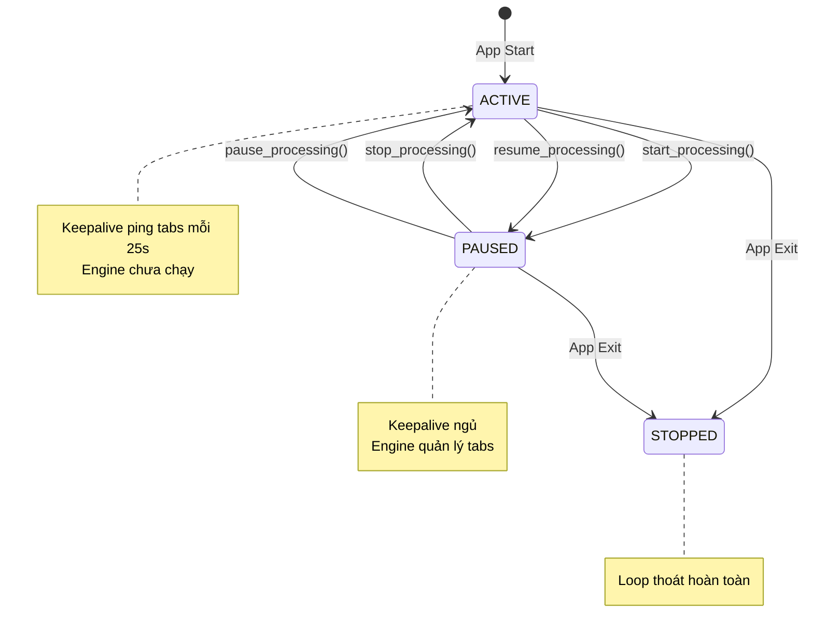
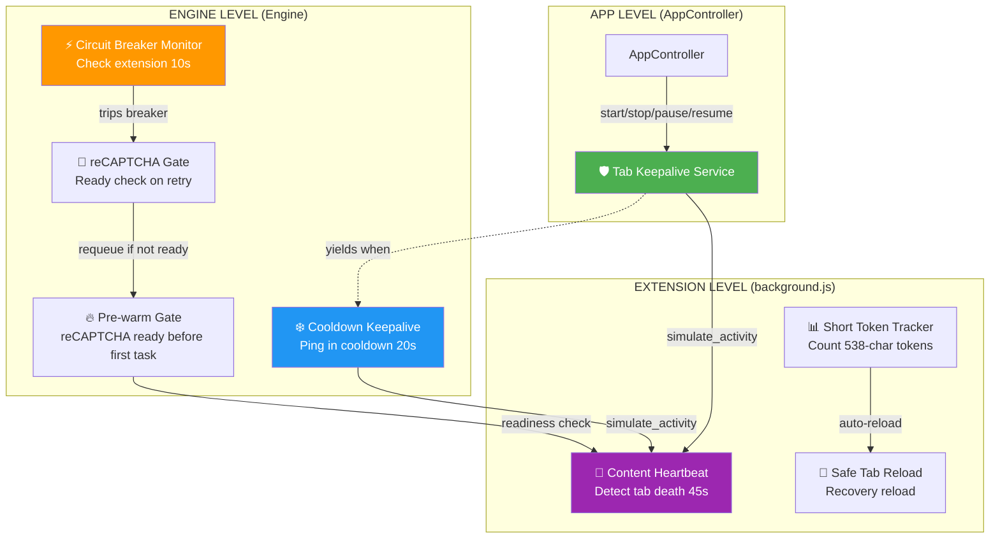

# 🛡️ Tab Keepalive Architecture — Chống Chrome Tab Freeze

> **Version**: 1.0 • **Created**: 2026-02-25  
> **Scope**: Tab Keepalive service — ngăn Chrome đóng băng VEO tabs, bảo vệ reCAPTCHA widget.  
> **Convention**: `[CURRENT]` = đã implement.  
> **Related**: [ENGINE_PIPELINE_ARCHITECTURE.md](./ENGINE_PIPELINE_ARCHITECTURE.md) §4.7-4.8, [PREWARM_RECOVERY_ARCHITECTURE.md](../PREWARM_RECOVERY_ARCHITECTURE.md)

---

## 1. Vấn đề gốc — Chrome Tab Freeze & reCAPTCHA Death Spiral

### 1.1 Chrome Tab Freeze là gì?

Chrome có tính năng **Tab Freeze/Discard** — tự động đóng băng (suspend) các tab không hoạt động sau 30-60 giây idle. Khi tab bị frozen:

- JavaScript ngừng thực thi hoàn toàn
- Các timer (`setTimeout`, `setInterval`) bị dừng
- Service Worker vẫn chạy (background.js), nhưng tab content bị kill
- **`grecaptcha.enterprise` widget chết** — mất khả năng generate token

### 1.2 Hậu quả — Death Spiral

```
Tab Idle (30-60s)
     │
     ▼
Chrome Freeze Tab
     │
     ▼
grecaptcha widget dies
     │
     ▼
Token = 538 chars (garbage)             ← Token quá ngắn
     │                                     (cần >= 1000 chars)
     ▼
API reject: HTTP 403
"reCAPTCHA evaluation failed"
     │
     ▼
Engine set cooldown (60-120s)           ← Account bị lock
     │
     ▼
Tab idle THÊM 60-120s                   ← Frozen nặng hơn!
     │
     ▼
reCAPTCHA càng hỏng  ←──── DEATH SPIRAL
     │
     ▼
Tất cả request 403
```

**Bằng chứng từ logs:**
```
[ExtensionBridge] reCAPTCHA token length: 538 (min: 1000) — REJECTED
[ExtensionBridge] Short token count: 5 consecutive
[Engine] HTTP 403: reCAPTCHA evaluation failed
[Engine] Setting cooldown 60s for account@gmail.com
```

### 1.3 Tại sao token chỉ có 538 chars?

| Trạng thái tab | Token length | Kết quả |
|----------------|-------------|---------|
| ✅ Tab active, grecaptcha initialized | 1200-1500 chars | API accept |
| ❌ Tab frozen, grecaptcha dead | **538 chars** | API reject 403 |
| ⚠️ Tab vừa reload, grecaptcha chưa init | **538 chars** | API reject 403 |

Token 538 chars là **skeleton token** — grecaptcha trả về khi widget chưa/không thể initialize đầy đủ. Nó không chứa đủ thông tin để Google đánh giá reCAPTCHA score.

---

## 2. Giải pháp — Tab Keepalive Service

### 2.1 Nguyên tắc thiết kế

| Nguyên tắc | Giải thích |
|------------|-----------|
| **Độc lập khỏi Engine** | Keepalive chạy ở tầng App, không phụ thuộc vào task processing pipeline |
| **Mutual Exclusion** | Keepalive và Engine KHÔNG BAO GIỜ tương tác cùng 1 tab đồng thời |
| **Luôn chạy** | Từ khi app start đến khi app shutdown — bao phủ mọi trạng thái |
| **Nhường quyền** | Khi Engine processing → Keepalive pause. Engine idle → Keepalive resume |
| **Best-effort** | Ping thất bại không gây crash. Background.js heartbeat là fallback |

### 2.2 Tại sao phải tách biệt khỏi Engine?

**Conflict khi chạy chung:**

```
KEEPALIVE (25s loop)                    ENGINE (task processing)
       │                                       │
       ├─ simulate_activity ──►                │
       │   chrome.scripting.executeScript       │
       │   trên Tab A (MAIN world)              │
       │                                       │
       │                     ┌─────────────────┤
       │                     │ submit_prompt    │
       │                     │   ↳ grecaptcha.execute
       │                     │   ↳ trên Tab A (CÙNG MAIN world)
       │                     │                  │
       ├─ simulate_activity ─┼──► CONFLICT! ◄───┤
       │  Chrome chỉ cho 1   │                  │
       │  executeScript       │                  │
       │  trên 1 tab tại 1   │                  │
       │  thời điểm           └─────────────────┤
       │  → DELAY submit!                       │
```

**3 loại conflict:**

1. **chrome.scripting.executeScript serialize** — Chrome chỉ cho 1 `executeScript` chạy trên cùng 1 tab tại 1 thời điểm → keepalive block submit
2. **WebSocket message queue** — Cả 2 gửi message qua cùng WebSocket connection → keepalive message có thể delay submit message
3. **Resource contention** — Không cần thiết khi Engine đang tự quản lý tabs

**Giải pháp: Mutual Exclusion via yield event** — Chỉ 1 trong 2 (Keepalive hoặc Engine) được tương tác với tab tại bất kỳ thời điểm nào.

---

## 3. Kiến trúc — State Machine

### 3.1 Lifecycle tổng quan



### 3.2 Sơ đồ chi tiết — Toàn bộ lifecycle

```
┌─────────────────────────────────────────────────────────────────────┐
│ APP LIFECYCLE                                                       │
│                                                                     │
│ AppController.start()                                               │
│   ├── Extension Bridge start (WebSocket server)                     │
│   ├── Session Monitor start                                         │
│   ├── ★ Tab Keepalive START                                         │
│   │     _keepalive_yield = Event(SET)  ← ACTIVE                     │
│   │     _keepalive_stop  = Event()     ← chưa stop                  │
│   │     → fire-and-forget coroutine in background loop              │
│   └── Auto-launch browsers                                         │
│                                                                     │
│ ┌─── Phase 1: APP IDLE ──────────────────────────────────────────┐  │
│ │  🛡️ Keepalive: ACTIVE    |   ⚙️ Engine: NOT RUNNING            │  │
│ │  → Ping tabs mỗi 25s    |   → Chưa có task nào                │  │
│ │  → Tabs sống, reCAPTCHA ready                                  │  │
│ └────────────────────────────┬───────────────────────────────────┘  │
│                              │                                      │
│                   User clicks "Start All"                           │
│                   AppController.start_processing()                  │
│                              │                                      │
│                   ★ _keepalive_yield.clear()  ← PAUSED              │
│                              │                                      │
│ ┌─── Phase 2: ENGINE PROCESSING ─────────────────────────────────┐  │
│ │  🛡️ Keepalive: PAUSED     |   ⚙️ Engine: RUNNING               │  │
│ │  → Loop chờ yield event  |   → Foreman loops xử lý tasks      │  │
│ │  → Không ping tabs       |   → Engine tự simulate_activity     │  │
│ │                           |     trong cooldown wait              │  │
│ │  ★ KHÔNG CONFLICT!        |   → Engine tự check reCAPTCHA      │  │
│ └──────────┬────────────────────────┬────────────────────────────┘  │
│            │                        │                               │
│    User "Pause"              User "Stop" / All tasks done          │
│    pause_processing()        stop_processing()                     │
│            │                        │                               │
│    ★ _keepalive_yield.set()  ★ _keepalive_yield.set()              │
│       ← ACTIVE                 ← ACTIVE                           │
│            │                        │                               │
│ ┌── Phase 3: PAUSED ────┐  ┌── Phase 4: STOPPED ───────────────┐  │
│ │  🛡️ KA: ACTIVE         │  │  🛡️ KA: ACTIVE                    │  │
│ │  ⚙️ Engine: PAUSED     │  │  ⚙️ Engine: STOPPED               │  │
│ │  → Workers sleeping    │  │  → Tabs vẫn mở                    │  │
│ │  → Tabs need keepalive │  │  → Keepalive giữ tabs sống        │  │
│ └────────┬──────────────┘  └────────────────────────────────────┘  │
│          │                                                          │
│   User "Resume"                                                     │
│   resume_processing()                                               │
│          │                                                          │
│   ★ _keepalive_yield.clear()  ← PAUSED                             │
│   → Quay về Phase 2                                                │
│                                                                     │
│ App Exit (AppController.stop)                                       │
│   ├── stop_processing() (nếu đang chạy)                            │
│   ├── ★ _keepalive_stop.set() → Loop thoát                         │
│   └── Extension Bridge stop                                        │
└─────────────────────────────────────────────────────────────────────┘
```

### 3.3 Control Events

| Event | Type | Ý nghĩa khi SET | Ý nghĩa khi CLEAR |
|-------|------|------------------|-------------------|
| `_keepalive_yield` | `asyncio.Event` | Keepalive **ACTIVE** (ping tabs) | Keepalive **PAUSED** (yield cho Engine) |
| `_keepalive_stop` | `asyncio.Event` | Shutdown loop hoàn toàn | Loop tiếp tục chạy |

**Ai tạo events?** `AppController._start_tab_keepalive()` tạo cả 2 events trong async loop context, rồi inject vào `Engine._keepalive_yield` và `Engine._keepalive_stop`.

**Ai thay đổi events?**

| Method | Event | Action | Khi nào |
|--------|-------|--------|---------|
| `AppController._start_tab_keepalive()` | `_keepalive_yield` | `.set()` | App start (keepalive active) |
| `AppController.start_processing()` | `_keepalive_yield` | `.clear()` | User Start All |
| `AppController.stop_processing()` | `_keepalive_yield` | `.set()` | User Stop / All done |
| `AppController.pause_processing()` | `_keepalive_yield` | `.set()` | User Pause |
| `AppController.resume_processing()` | `_keepalive_yield` | `.clear()` | User Resume |
| `AppController._stop_tab_keepalive()` | `_keepalive_stop` | `.set()` | App exit |

---

## 4. Cơ chế hoạt động — Keepalive Loop

### 4.1 Pseudocode

```python
async def _tab_keepalive_loop(self):
    INTERVAL = 25  # seconds — dưới ngưỡng Chrome freeze 30-60s
    
    await sleep(5)  # Chờ app khởi tạo
    
    while not _keepalive_stop.is_set():
        
        # ★ YIELD GATE: chờ cho đến khi Engine idle
        if not _keepalive_yield.is_set():
            await wait(_keepalive_yield OR _keepalive_stop)
            if _keepalive_stop: break
        
        # ★ PING ALL TABS
        for account in accounts:
            if stop or not yield: break
            bridge.simulate_activity(account.email)
        
        # ★ SLEEP in 1s chunks (phản ứng nhanh khi yield changes)
        for _ in range(INTERVAL):
            if stop or not yield: break
            await sleep(1.0)
```

### 4.2 simulate_activity — Cơ chế ping

`ExtensionBridge.simulate_activity(email)` gửi message qua WebSocket đến Chrome Extension:

```
Python → WebSocket → background.js → chrome.scripting.executeScript({
    target: { tabId },
    world: "MAIN",
    func: () => {
        // Di chuyển chuột giả
        document.dispatchEvent(new MouseEvent('mousemove', {
            clientX: Math.random() * window.innerWidth,
            clientY: Math.random() * window.innerHeight
        }));
        // Scroll nhẹ
        window.scrollBy(0, Math.random() * 2 - 1);
    }
})
```

**Tại sao hoạt động:** Chrome dùng các tín hiệu user interaction (mouse, scroll, keyboard) để quyết định tab nào "active". Khi nhận được `mousemove` event → Chrome coi tab đang được sử dụng → **không freeze**.

### 4.3 Timing analysis

| Parameter | Giá trị | Lý do |
|-----------|---------|-------|
| Keepalive interval | **25s** | Dưới Chrome freeze threshold (30-60s) |
| Sleep chunk | **1s** | Phản ứng nhanh khi Engine start/stop (max 1s delay) |
| Initial delay | **5s** | Chờ browsers khởi tạo |
| simulate_activity timeout | **3s** | Không block loop quá lâu |

---

## 5. Phối hợp với Engine — Dual Protection

### 5.1 Engine vẫn có keepalive trong cooldown

Khi Engine processing (Keepalive paused), Engine **tự chủ** quản lý tab keepalive trong cooldown wait:

```python
# engine.py — wait_for_cooldown()
async def wait_for_cooldown(self, email):
    KEEPALIVE_INTERVAL = 20  # seconds
    
    while on_cooldown and not stop:
        # Wait 20s (or until cooldown ends)
        await wait(cooldown_event, timeout=20)
        
        # ★ Tab keepalive: prevent Chrome freeze during cooldown
        bridge.simulate_activity(email)
```

**Tại sao cần cả 2?**

| Scenario | Keepalive (App-level) | Engine cooldown keepalive |
|----------|----------------------|--------------------------|
| App idle, no tasks | ✅ Active | ❌ Engine not running |
| Engine processing, no cooldown | ❌ Paused (yield) | ❌ Not in cooldown |
| Engine processing, IN cooldown | ❌ Paused (yield) | ✅ Active |
| Engine paused | ✅ Active | ❌ Engine paused |
| Between Start All clicks | ✅ Active | ❌ Engine stopped |

→ **100% coverage**: Mọi thời điểm đều có ít nhất 1 hệ thống giữ tab sống. KHÔNG BAO GIỜ có khoảng trống.

### 5.2 reCAPTCHA readiness gates

Ngoài keepalive, Engine còn có các gate kiểm tra reCAPTCHA trước khi submit:

```
┌─── FOREMAN STARTUP ──────────────────────────────────────────────┐
│ Gate 1: _wait_for_account_ready(30s)                             │
│   → Chờ x-client-data từ Extension                              │
│                                                                  │
│ Gate 2: _wait_for_recaptcha_ready(30s)  ← PRE-WARM              │
│   → Verify reCAPTCHA widget ready, token >= 1000 chars          │
│   → Nếu fail: log warning, proceed (keepalive sẽ fix)          │
└──────────────────────────────────────────────────────────────────┘

┌─── RETRY LOOP (sau 403) ────────────────────────────────────────┐
│ wait_for_cooldown()         → Lớp 4 (with keepalive inside)     │
│ _wait_for_circuit()         → Lớp 5 Circuit Breaker             │
│ wait_for_cooldown() (lần 2) → Re-check sau circuit              │
│                                                                  │
│ ★ _wait_for_recaptcha_ready(30s)  ← reCAPTCHA GATE              │
│   → Nếu NOT ready: REQUEUE task (không waste attempt)           │
│   → Nếu ready: proceed to submit                                │
└──────────────────────────────────────────────────────────────────┘

┌─── POST-RELOAD RECOVERY ────────────────────────────────────────┐
│ Khi reCAPTCHA readiness check fail nhiều lần:                    │
│   → Full page reload                                             │
│   → Wait 15s (VEO page cần 13s+ để load reCAPTCHA widget)      │
│   → Re-check readiness                                          │
└──────────────────────────────────────────────────────────────────┘
```

---

## 6. So sánh Trước/Sau

### 6.1 Bảng coverage

| Scenario | ❌ Trước (không có keepalive) | ✅ Sau (keepalive + gates) |
|----------|-------------------------------|--------------------------|
| Queue rỗng, idle 2 phút | Tab frozen → 538-char token | Keepalive ping mỗi 25s |
| User pause 5 phút | Tab frozen | Keepalive resume khi pause |
| Cooldown 120s | Tab frozen → death spiral | Engine cooldown keepalive 20s |
| Giữa 2 Start All (5 phút) | Tab frozen | Keepalive active khi engine stopped |
| First submit sau Start All | Hit frozen tab → 403 | Pre-warm gate verify ready |
| Retry sau 403 | Submit bất kể ready | reCAPTCHA gate → requeue nếu not ready |
| Post-reload recovery | Wait 5s (cần 13s) | Wait 15s → reCAPTCHA init đủ thời gian |

### 6.2 Death Spiral Prevention

```
TRƯỚC:                                    SAU:
Tab idle → Frozen → 538-char              Tab idle → Keepalive ping → Tab alive
  → 403 → Cooldown 60s                      → 1200-char token → API accept
  → Tab MORE frozen → 538-char              → Success → No cooldown
  → 403 → Cooldown 120s                     → Continue processing
  → Tab COMPLETELY frozen
  → ALL requests fail
  ← DEATH SPIRAL                           ← NO SPIRAL
```

---

## 7. File Reference Map

### 7.1 Keepalive Service

| Component | File | Location | Mô tả |
|-----------|------|----------|-------|
| Keepalive loop | `engine.py` | `_tab_keepalive_loop()` | Coroutine chính — ping tabs, yield to engine |
| Start service | `app_controller.py` | `_start_tab_keepalive()` | Tạo events, inject vào Engine, launch coroutine |
| Stop service | `app_controller.py` | `_stop_tab_keepalive()` | Signal stop, wait graceful exit |
| Yield on Start All | `app_controller.py` | `start_processing()` | `_keepalive_yield.clear()` |
| Resume on Stop | `app_controller.py` | `stop_processing()` | `_keepalive_yield.set()` |
| Resume on Pause | `app_controller.py` | `pause_processing()` | `_keepalive_yield.set()` |
| Yield on Resume | `app_controller.py` | `resume_processing()` | `_keepalive_yield.clear()` |
| Future tracking | `app_controller.py` | `self._keepalive_future` | Track background coroutine |

### 7.2 Engine-side Protection

| Component | File | Location | Mô tả |
|-----------|------|----------|-------|
| Cooldown keepalive | `engine.py` | `wait_for_cooldown()` | Ping tab mỗi 20s trong cooldown |
| Pre-warm gate | `engine.py` | `_account_foreman_loop()` | Check reCAPTCHA ready trước task đầu tiên |
| Retry reCAPTCHA gate | `engine.py` | Retry loop | Check ready sau cooldown, requeue nếu fail |
| Post-reload wait | `engine.py` | `_wait_for_recaptcha_ready()` | Wait 15s after page reload |
| simulate_activity | `extension_bridge.py` | `simulate_activity()` | WebSocket → Extension → tab ping |

### 7.3 Extension-side Support

| Component | File | Location | Mô tả |
|-----------|------|----------|-------|
| Activity simulation | `background.js` | `simulate_activity` handler | Execute mousemove + scroll in MAIN world |
| Heartbeat monitor | `background.js` | `content_heartbeat` | Detect tab death (45s timeout) |
| Short token tracking | `background.js` | `consecutiveShortTokens` | Count 538-char tokens, auto-reload |
| Tab reload | `background.js` | `safeTabReload()` | Recovery reload with cooldown |

---

## 8. Troubleshooting

### 8.1 Log markers

| Log pattern | Ý nghĩa | Action |
|-------------|---------|--------|
| `[TabKeepalive] App-level service started` | Service khởi động OK | Normal |
| `[TabKeepalive] Engine processing — yielding...` | Keepalive paused cho Engine | Normal |
| `[TabKeepalive] Engine idle — resuming tab keepalive` | Keepalive resume | Normal |
| `[TabKeepalive] Pinged N tab(s)` | Ping thành công | Normal (debug level) |
| `[TabKeepalive] No control events set — exiting` | Events chưa inject | Bug: check `_start_tab_keepalive()` |
| `[TabKeepalive] Paused — engine processing` | start_processing() trigger | Normal |
| `[TabKeepalive] Resumed — engine stopped` | stop_processing() trigger | Normal |

### 8.2 Common issues

| Vấn đề | Nguyên nhân | Giải pháp |
|--------|-------------|----------|
| Token vẫn 538 chars | Keepalive không hoạt động | Check logs cho `[TabKeepalive]`, verify events injected |
| submit bị delay | Keepalive và Engine conflict | Verify `_keepalive_yield` cleared khi processing |
| Tab vẫn frozen khi idle | `simulate_activity` fail | Check ExtensionBridge connection |
| Keepalive không resume sau Stop | `_keepalive_yield` không set | Check `stop_processing()` code |

---

## 9. Design Decisions

### 9.1 Tại sao 25s interval?

- Chrome freeze threshold: **30-60s** idle
- 25s < 30s → ping trước khi Chrome kịp freeze
- Không quá thường xuyên (10s) → giảm overhead
- Không quá thưa (50s) → some tabs might still freeze

### 9.2 Tại sao dùng Event thay vì flag?

`asyncio.Event` cho phép **blocking wait** — Keepalive loop sleep hiệu quả khi paused, không poll liên tục. CPU gần 0% khi yielding.

### 9.3 Tại sao không dùng Chrome flags?

```
--disable-background-timer-throttling
--disable-backgrounding-occluded-windows
--disable-renderer-backgrounding
```

Đã thử → **không đủ**. Chrome vẫn có thể freeze tabs qua cơ chế khác (TabLifecycleState). `simulate_activity` là giải pháp phần mềm robust hơn, hoạt động bất kể Chrome version/flags.

### 9.4 Tại sao keepalive ở Engine mà không phải ExtensionBridge?

`_tab_keepalive_loop` **nằm trong Engine** nhưng **được quản lý bởi AppController**:

- **Engine**: có access trực tiếp đến `_account_manager._accounts` (iterate tất cả accounts)
- **ExtensionBridge**: chỉ biết connections, không biết account context
- **AppController**: biết lifecycle (start/stop/pause/resume) nhưng không nên chạy async loops

→ Engine cung cấp logic, AppController cung cấp lifecycle control. Best of both worlds.

---

## 10. Mối quan hệ với các hệ thống khác



### Phân tầng bảo vệ

| Tầng | Component | Scope | Khi nào hoạt động |
|------|-----------|-------|-------------------|
| **Tầng 1: Phòng ngừa** | Tab Keepalive | Tất cả tabs | App running + Engine idle |
| **Tầng 2: Phòng ngừa (Engine)** | Cooldown Keepalive | 1 tab đang cooldown | Engine running + in cooldown |
| **Tầng 3: Kiểm tra** | Pre-warm Gate | 1 account foreman | Engine startup |
| **Tầng 4: Kiểm tra** | reCAPTCHA Gate | 1 task retry | Sau cooldown, trước submit |
| **Tầng 5: Phát hiện** | Short Token Tracker | Extension | Mỗi lần generate token |
| **Tầng 6: Phục hồi** | Safe Tab Reload | Extension | ≥3 short tokens liên tiếp |
| **Tầng 7: Phát hiện** | Circuit Breaker | Per-account | Extension mất hoặc 5+ 403 |

→ **Defense in depth**: Mỗi tầng bắt những case mà tầng trước bỏ lỡ.
