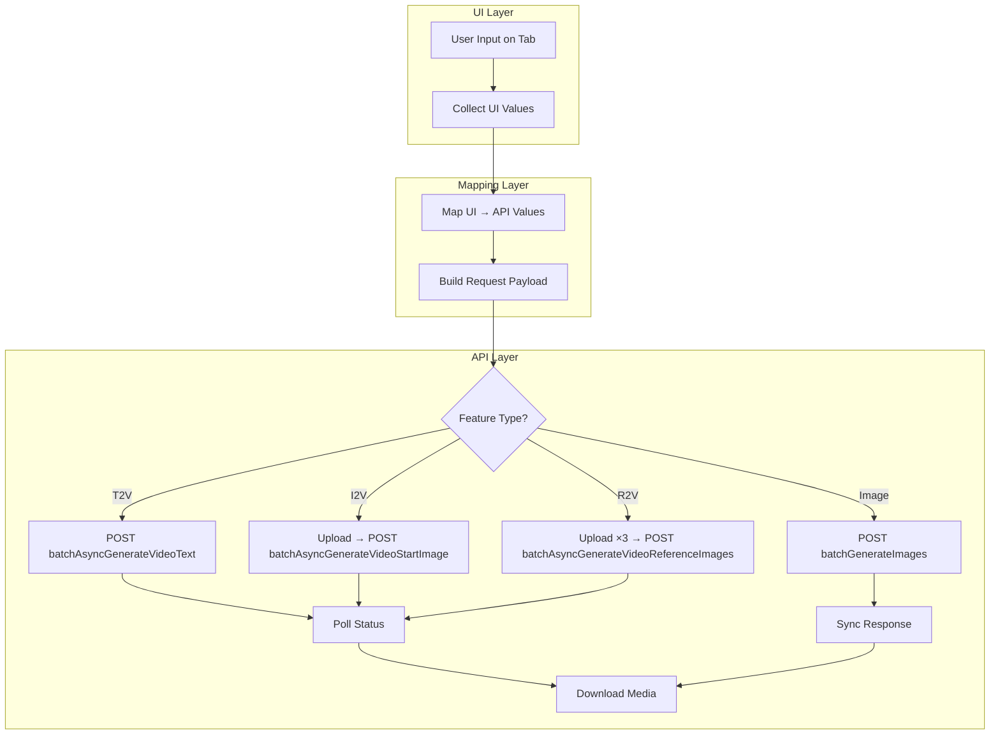
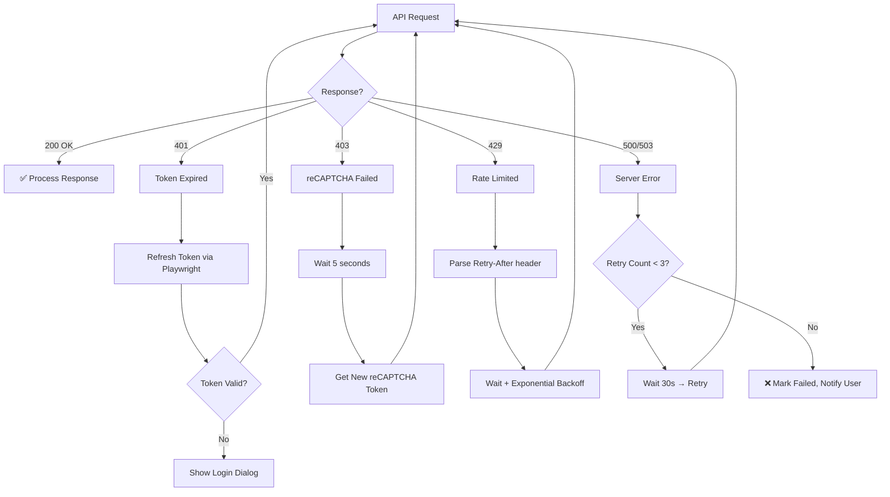
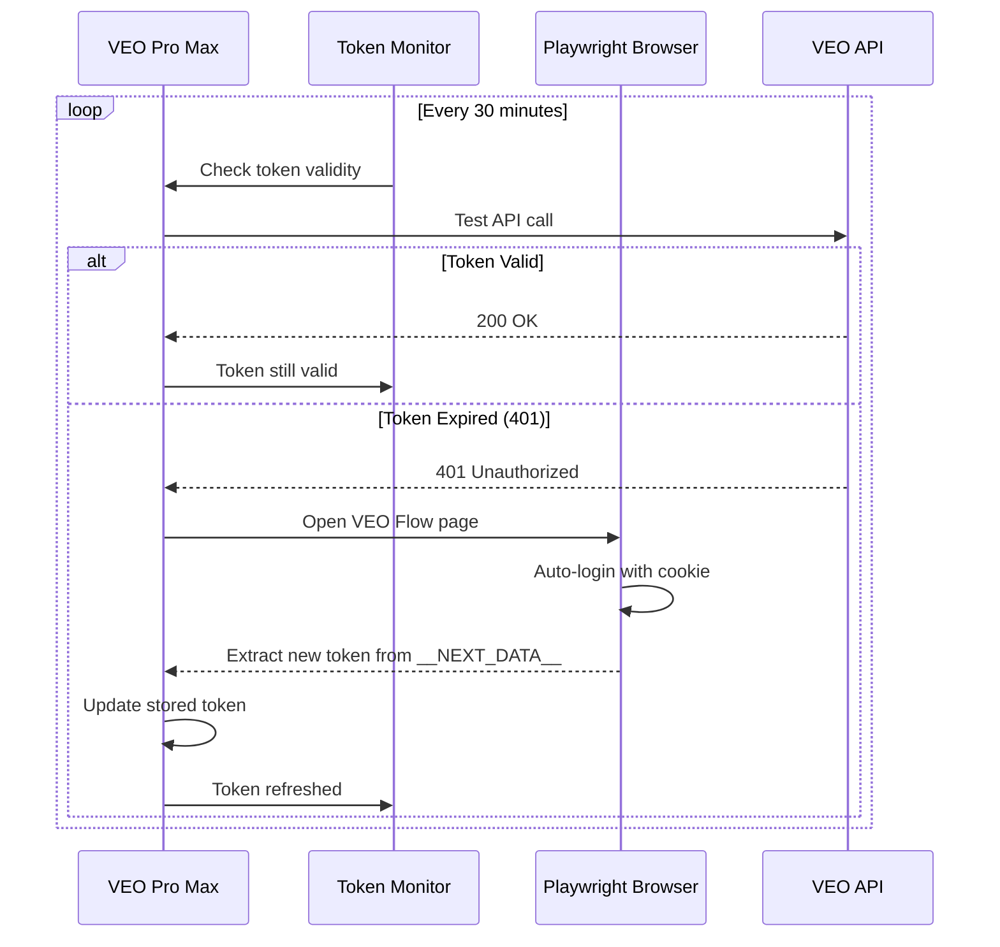
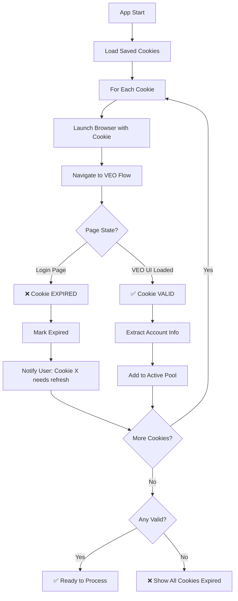
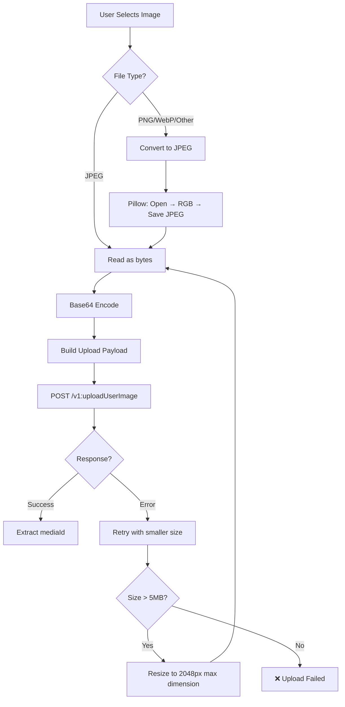
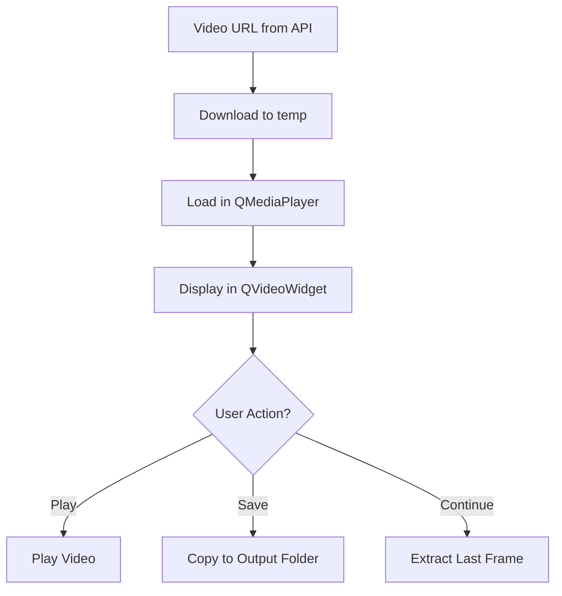
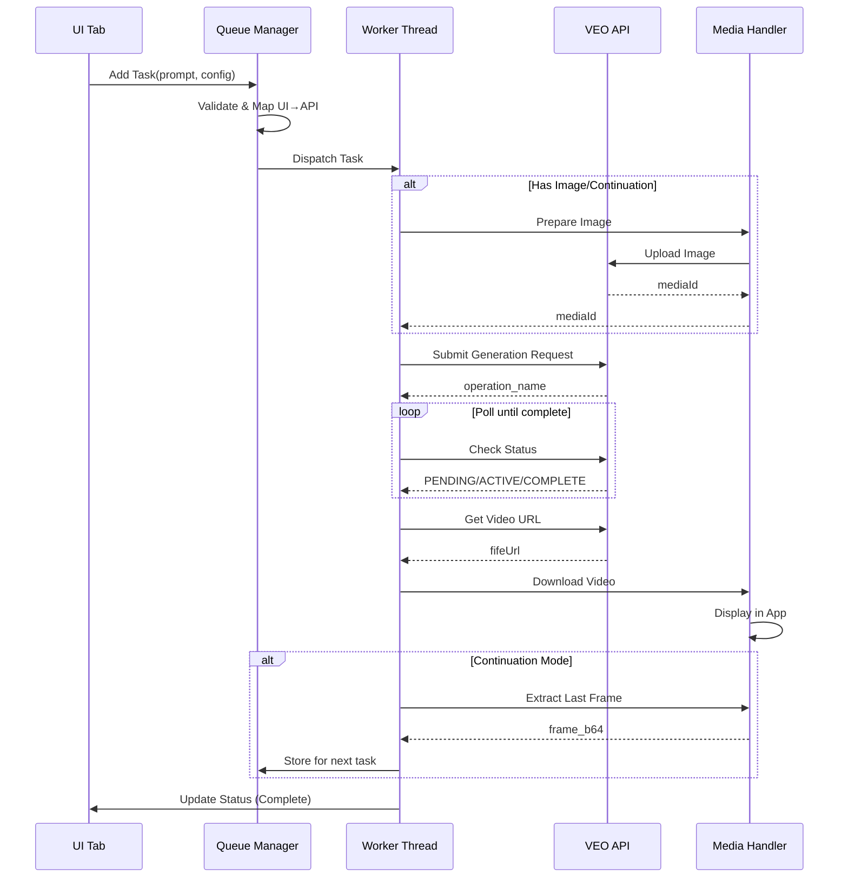

# VEO Pro Max - UI to API Parameter Mapping

**Purpose**: Định nghĩa chi tiết cách mapping từ các UI elements sang API request parameters, bao gồm cấu trúc xử lý và flow từng bước.

---

## 🔄 Processing Flow Overview



---

## 📋 Feature Processing Flows

### Flow 1: Text-to-Video (T2V)

| Step | Action | UI Element | API Call |
|------|--------|------------|----------|
| 1 | Collect prompt | Prompt TextArea | - |
| 2 | Map aspect ratio | Dropdown "16:9" | `VIDEO_ASPECT_RATIO_LANDSCAPE` |
| 3 | Map model | Dropdown "Veo 3.1 Fast" | `veo_3_1_t2v_fast_landscape_ultra` |
| 4 | Generate seeds | Outputs = 4 | `[seed1, seed2, seed3, seed4]` |
| 5 | Build request | - | `clientContext` + `requests[]` |
| 6 | **Submit** | - | `POST /v1/video:batchAsyncGenerateVideoText` |
| 7 | Poll status | - | `POST /v1/video:batchCheckAsyncVideoGenerationStatus` |
| 8 | Download | - | `GET {fifeUrl}` |

```python
# T2V Complete Flow
async def process_t2v(ui_config: dict) -> list[str]:
    # Step 1-5: Build
    payload = build_t2v_request(
        prompt=ui_config["prompt"],
        project_id=ui_config["project_id"],
        aspect=ui_config["aspect_ratio"],    # "16:9" → API value
        model=ui_config["model"],             # UI name → model key
        outputs=ui_config["outputs"]          # 1-4
    )
    
    # Step 6: Submit
    response = await api_client.post(T2V_ENDPOINT, payload)
    operations = response["operations"]
    
    # Step 7: Poll
    video_urls = []
    for op in operations:
        url = await poll_until_complete(op["operation"]["name"], op["sceneId"])
        video_urls.append(url)
    
    # Step 8: Download
    return await download_all(video_urls, output_dir)
```

---

### Flow 2: Image-to-Video (I2V Single Frame)

| Step | Action | UI Element | API Call |
|------|--------|------------|----------|
| 1 | Select image | File Picker | - |
| 2 | **Upload image** | - | `POST /v1:uploadUserImage` |
| 3 | Get mediaId | - | Response: `mediaGenerationId.mediaGenerationId` |
| 4 | Collect prompt | Prompt TextArea | - |
| 5 | Map parameters | Dropdowns | Aspect, Model → API values |
| 6 | Build request | - | Include `startImage.mediaId` |
| 7 | **Submit** | - | `POST /v1/video:batchAsyncGenerateVideoStartImage` |
| 8 | Poll → Download | - | Same as T2V |

```python
# I2V Single Frame Complete Flow
async def process_i2v_single(ui_config: dict) -> list[str]:
    # Step 1-3: Upload
    image_bytes = read_as_jpeg(ui_config["image_path"])
    upload_response = await api_client.upload_image(image_bytes)
    media_id = upload_response["imageOutput"]["mediaGenerationId"]
    
    # Step 4-6: Build
    payload = {
        "clientContext": build_client_context(ui_config["project_id"]),
        "requests": [{
            "aspectRatio": map_aspect_ratio(ui_config["aspect_ratio"]),
            "videoModelKey": "veo_3_1_i2v_s_fast_ultra_relaxed",
            "textInput": {"prompt": ui_config["prompt"]},
            "startImage": {"mediaId": media_id},  # ← Uploaded image
            "seed": random.randint(5000, 24999),
            "metadata": {"sceneId": str(uuid.uuid4())}
        }]
    }
    
    # Step 7-8: Submit → Poll → Download
    return await submit_and_download(I2V_SINGLE_ENDPOINT, payload)
```

---

### Flow 3: Frames-to-Video (F2V - Start+End Frames)

| Step | Action | UI Element | API Call |
|------|--------|------------|----------|
| 1 | Select Start frame | File Picker | - |
| 2 | **Upload Start** | - | `POST /v1:uploadUserImage` |
| 3 | Select End frame | File Picker | - |
| 4 | **Upload End** | - | `POST /v1:uploadUserImage` |
| 5 | Build request | - | Include `startImage` + `endImage` |
| 6 | **Submit** | - | `POST /v1/video:batchAsyncGenerateVideoStartAndEndImage` |
| 7 | Poll → Download | - | Same as T2V |

```python
# F2V (Frames-to-Video) Complete Flow - Start + End Frames
async def process_i2v_dual(ui_config: dict) -> list[str]:
    # Step 1-4: Upload both frames
    start_id = await upload_and_get_id(ui_config["start_frame_path"])
    end_id = await upload_and_get_id(ui_config["end_frame_path"])
    
    # Step 5: Build
    payload = {
        "clientContext": build_client_context(ui_config["project_id"]),
        "requests": [{
            "aspectRatio": map_aspect_ratio(ui_config["aspect_ratio"]),
            "videoModelKey": "veo_3_1_i2v_s_fast_fl_ultra_relaxed",  # Note: _fl_ = First+Last
            "textInput": {"prompt": ui_config["prompt"]},
            "startImage": {"mediaId": start_id},
            "endImage": {"mediaId": end_id},
            "seed": random.randint(5000, 24999),
            "metadata": {"sceneId": str(uuid.uuid4())}
        }]
    }
    
    # Step 6-7: Submit → Poll → Download
    return await submit_and_download(I2V_DUAL_ENDPOINT, payload)
```

---

### Flow 4: Ingredients-to-Video (R2V)

| Step | Action | UI Element | API Call |
|------|--------|------------|----------|
| 1 | Select Character image | Slot 1 | - |
| 2 | **Upload Character** | - | `POST /v1:uploadUserImage` |
| 3 | Select Background image | Slot 2 | - |
| 4 | **Upload Background** | - | `POST /v1:uploadUserImage` |
| 5 | Select Style image (optional) | Slot 3 | - |
| 6 | **Upload Style** | - | `POST /v1:uploadUserImage` |
| 7 | Build request | - | `referenceImages: [{mediaId}, ...]` |
| 8 | **Submit** | - | `POST /v1/video:batchAsyncGenerateVideoReferenceImages` |
| 9 | Poll → Download | - | Same as T2V |

```python
# R2V (Ingredients) Complete Flow
async def process_ingredients(ui_config: dict) -> list[str]:
    # Step 1-6: Upload all ingredients (1-3 images)
    ingredient_ids = []
    for slot in ["character", "background", "style"]:
        if ui_config.get(f"{slot}_path"):
            media_id = await upload_and_get_id(ui_config[f"{slot}_path"])
            ingredient_ids.append({"mediaId": media_id})
    
    # Step 7: Build
    payload = {
        "clientContext": build_client_context(ui_config["project_id"]),
        "requests": [{
            "aspectRatio": map_aspect_ratio(ui_config["aspect_ratio"]),
            "videoModelKey": f"veo_3_1_r2v_fast_{ui_config['aspect_ratio'].replace(':', '_')}_ultra",
            "textInput": {"prompt": ui_config["prompt"]},
            "referenceImages": ingredient_ids,  # ← Array of uploaded images
            "seed": random.randint(5000, 24999),
            "metadata": {"sceneId": str(uuid.uuid4())}
        }]
    }
    
    # Step 8-9: Submit → Poll → Download
    return await submit_and_download(R2V_ENDPOINT, payload)
```

---

### Flow 5: Text-to-Image (Synchronous)

| Step | Action | UI Element | API Call |
|------|--------|------------|----------|
| 1 | Collect prompt | Prompt TextArea | - |
| 2 | Map model | Dropdown "Imagen 3.5" | `IMAGEN_3_5` |
| 3 | Map aspect | Dropdown "16:9" | `IMAGE_ASPECT_RATIO_LANDSCAPE` |
| 4 | Build request | - | `imageModelName`, `imageAspectRatio` |
| 5 | **Submit** | - | `POST /v1/projects/{id}/flowMedia:batchGenerateImages` |
| 6 | **Immediate Response** | - | `media[].image.generatedImage.fifeUrl` |
| 7 | Download | - | `GET {fifeUrl}` |

```python
# Text-to-Image Complete Flow (SYNC - no polling!)
async def process_text_to_image(ui_config: dict) -> list[str]:
    # Step 1-4: Build
    payload = build_image_request(
        prompt=ui_config["prompt"],
        project_id=ui_config["project_id"],
        aspect=ui_config["aspect_ratio"],
        model=ui_config["model"],
        outputs=ui_config["outputs"]
    )
    
    # Step 5: Submit (Synchronous - immediate response)
    response = await api_client.post(
        f"/v1/projects/{ui_config['project_id']}/flowMedia:batchGenerateImages",
        payload
    )
    
    # Step 6: Extract URLs directly from response
    image_urls = [
        item["image"]["generatedImage"]["fifeUrl"]
        for item in response["media"]
    ]
    
    # Step 7: Download
    return await download_all(image_urls, output_dir)
```

---

### Flow 6: Video Upscaling

| Step | Action | UI Element | API Call |
|------|--------|------------|----------|
| 1 | Select video(s) | Video Gallery | - |
| 2 | Choose quality | Dropdown "4K" | `veo_3_1_upsampler_4k` |
| 3 | Build request | - | `videoToUpsample.fifeUrl` |
| 4 | **Submit** | - | `POST /v1/video:batchAsyncGenerateVideoUpsampleVideo` |
| 5 | Poll → Download | - | Same as T2V |

---

### Flow 7: Image Upscaling

| Step | Action | UI Element | API Call |
|------|--------|------------|----------|
| 1 | Select image | Image Gallery | - |
| 2 | Choose resolution | Dropdown "4K" | `UPSAMPLE_IMAGE_RESOLUTION_4K` |
| 3 | Build request | - | `image`, `resolution` |
| 4 | **Submit** | - | `POST /v1/flow/upsampleImage` |
| 5 | Poll → Download | - | Async, requires polling |

---

### Flow 8: Image-to-Image (I2I Editing)

> **📖 Image Library System**: Xem [IMAGE_LIBRARY_SYSTEM.md](../01_UI_UX/IMAGE_LIBRARY_SYSTEM.md) cho chi tiết `[tag]` detection và library structure.

| Step | Action | UI Element | API Call |
|------|--------|------------|----------|
| 1 | Select source image | Image Library | `[tag_name]` reference |
| 2 | **Upload source** | - | `POST /v1:uploadUserImage` |
| 3 | Get mediaId | - | Response: `mediaGenerationId.mediaGenerationId` |
| 4 | Enter modification prompt | Prompt TextArea | - |
| 5 | Map parameters | Dropdowns | Aspect, Model, Quality |
| 6 | Build request | - | Include `imageInputs[].mediaId` |
| 7 | **Submit** | - | `POST /v1/projects/{id}/flowMedia:batchGenerateImages` |
| 8 | Download | - | Sync response, `GET {fifeUrl}` |

```python
# I2I (Image-to-Image) Complete Flow
async def process_i2i(ui_config: dict) -> list[str]:
    # Step 1-3: Upload source image
    source_path = image_library.get_path(ui_config["source_tag"])
    image_bytes = encode_as_jpeg(source_path)
    upload_response = await api_client.upload_image(image_bytes)
    media_id = upload_response["imageOutput"]["mediaGenerationId"]
    
    # Step 4-6: Build with source image reference
    payload = {
        "clientContext": {
            "projectId": ui_config["project_id"],
            "tool": "PINHOLE"
        },
        "requests": [{
            "seed": random.randint(0, 999999),
            "imageModelName": map_image_model(ui_config["model"]),
            "imageAspectRatio": map_image_aspect(ui_config["aspect_ratio"]),
            "prompt": ui_config["modification_prompt"],
            "imageInputs": [{"mediaId": media_id}]  # ← Source image
        } for _ in range(ui_config.get("outputs", 4))]
    }
    
    # Step 7-8: Submit → Download (synchronous)
    response = await api_client.post(IMAGE_GEN_ENDPOINT, payload)
    return [item["image"]["generatedImage"]["fifeUrl"] for item in response["media"]]
```

---

### Flow 9: GIF Preview Generation

| Step | Action | UI Element | API Call |
|------|--------|------------|----------|
| 1 | Select video | Video Gallery | - |
| 2 | Get mediaId | - | From video metadata |
| 3 | **Submit** | - | `POST /v1/video:generatePinholeGif` |
| 4 | **Immediate Response** | - | Base64 encoded GIF |
| 5 | Display | GIF Preview | - |

```python
# GIF Generation Flow (Synchronous)
async def generate_gif_preview(video_media_id: str) -> bytes:
    """Generate GIF preview for a video."""
    
    payload = {
        "mediaGenerationId": video_media_id,
        "clientContext": {"tool": "PINHOLE"}
    }
    
    # Synchronous - immediate response
    response = await api_client.post(GIF_ENDPOINT, payload)
    
    # Response contains base64 GIF
     gif_b64 = response.get("encodedGif", "")
    return base64.b64decode(gif_b64)
```

---

## 📹 Video Generation

### Aspect Ratio

| UI Label | UI Value | API Field | API Value |
|----------|----------|-----------|-----------|
| Aspect Ratio | **16:9** (Landscape) | `aspectRatio` | `VIDEO_ASPECT_RATIO_LANDSCAPE` |
| Aspect Ratio | **9:16** (Portrait) | `aspectRatio` | `VIDEO_ASPECT_RATIO_PORTRAIT` |

**Python Converter**:
```python
ASPECT_RATIO_MAP = {
    "16:9": "VIDEO_ASPECT_RATIO_LANDSCAPE",
    "9:16": "VIDEO_ASPECT_RATIO_PORTRAIT",
}

def map_aspect_ratio(ui_value: str) -> str:
    return ASPECT_RATIO_MAP.get(ui_value, "VIDEO_ASPECT_RATIO_LANDSCAPE")
```

---

### Video Model

| UI Label | UI Value | API Field | API Value | Notes |
|----------|----------|-----------|-----------|-------|
| Model | **Veo 3.1 Fast** | `videoModelKey` | `veo_3_1_t2v_fast_landscape_ultra` | 16:9 only |
| Model | **Veo 3.1 Fast (Portrait)** | `videoModelKey` | `veo_3_1_t2v_fast_portrait` | 9:16 only |
| Model | **Veo 3.1 [Relaxed]** | `videoModelKey` | `veo_3_1_t2v_fast_landscape_ultra_relaxed` | Lower priority |
| Model | **I2V Single** | `videoModelKey` | `veo_3_1_i2v_s_fast_ultra_relaxed` | Start frame only |
| Model | **F2V (Start+End)** | `videoModelKey` | `veo_3_1_i2v_s_fast_fl_ultra_relaxed` | Start + End frames (F2V) |
| Model | **Ingredients** | `videoModelKey` | `veo_3_1_r2v_fast_landscape_ultra_relaxed` | 1-3 reference images |

**Python Converter**:
```python
VIDEO_MODEL_MAP = {
    # T2V Models
    "Veo 3.1 Fast": {
        "16:9": "veo_3_1_t2v_fast_landscape_ultra",
        "9:16": "veo_3_1_t2v_fast_portrait"
    },
    "Veo 3.1 [Relaxed]": {
        "16:9": "veo_3_1_t2v_fast_landscape_ultra_relaxed",
        "9:16": "veo_3_1_t2v_fast_portrait_relaxed"
    },
    # I2V Models
    "I2V Single": {
        "16:9": "veo_3_1_i2v_s_fast_ultra_relaxed",
        "9:16": "veo_3_1_i2v_s_fast_portrait_ultra_relaxed"  # HAR: portrait variant
    },
    "F2V Dual": {
        "16:9": "veo_3_1_i2v_s_fast_fl_ultra_relaxed",
        "9:16": "veo_3_1_i2v_s_fast_portrait_fl_ultra_relaxed"  # HAR verified ✅
    },
    # R2V Models
    "Ingredients": {
        "16:9": "veo_3_1_r2v_fast_landscape_ultra_relaxed",  # Added _relaxed (HAR)
        "9:16": "veo_3_1_r2v_fast_portrait_ultra_relaxed"  # HAR verified ✅
    }
}

def map_video_model(ui_model: str, aspect: str = "16:9") -> str:
    model_config = VIDEO_MODEL_MAP.get(ui_model)
    if isinstance(model_config, dict):
        return model_config.get(aspect, model_config.get("16:9"))
    return model_config
```

---

### Number of Outputs

| UI Label | UI Value | API Behavior |
|----------|----------|-------------|
| Outputs | **1** | 1 item in `requests[]` array |
| Outputs | **2** | 2 items in `requests[]` array |
| Outputs | **3** | 3 items in `requests[]` array |
| Outputs | **4** | 4 items in `requests[]` array (max) |

**Python Converter**:
```python
def build_batch_requests(prompt: str, model_key: str, aspect: str, count: int = 4) -> list:
    """Generate N requests with different seeds."""
    import random
    import uuid
    
    return [{
        "aspectRatio": map_aspect_ratio(aspect),
        "seed": random.randint(5000, 24999),
        "textInput": {"prompt": prompt},
        "videoModelKey": model_key,
        "metadata": {"sceneId": str(uuid.uuid4())}
    } for _ in range(min(count, 4))]
```

---

### Video Quality (Upscaling)

| UI Label | UI Value | API Field | API Value | Endpoint |
|----------|----------|-----------|-----------|----------|
| Quality | **720p** (Default) | N/A | N/A | No upscale needed |
| Quality | **1080p** | `videoModelKey` | `veo_3_1_upsampler_1080p` | `batchAsyncGenerateVideoUpsampleVideo` |
| Quality | **4K** | `videoModelKey` | `veo_3_1_upsampler_4k` | `batchAsyncGenerateVideoUpsampleVideo` |

**Python Converter**:
```python
UPSCALE_MODEL_MAP = {
    "720p": None,  # No upscale
    "1080p": "veo_3_1_upsampler_1080p",
    "4K": "veo_3_1_upsampler_4k"
}

def get_upscale_model(ui_quality: str) -> str | None:
    return UPSCALE_MODEL_MAP.get(ui_quality)
```

---

### Duration

| UI Label | UI Value | API Behavior |
|----------|----------|-------------|
| Duration | **8s** | Default (không cần gửi parameter) |

> **Note**: Hiện tại VEO API chưa hỗ trợ custom duration. Tất cả video đều ~8 giây.

---

## 🎨 Image Generation

### Image Model

| UI Label | UI Value | API Field | API Value |
|----------|----------|-----------|-----------|
| Model | **Imagen 3.5** | `imageModelName` | `IMAGEN_3_5` |
| Model | **Veo Fast** | `imageModelName` | `GEM_PIX` |
| Model | **Veo Fast Pro** | `imageModelName` | `GEM_PIX_2` |

**Python Converter**:
```python
IMAGE_MODEL_MAP = {
    "Imagen 3.5": "IMAGEN_3_5",
    "Veo Fast": "GEM_PIX",
    "Veo Fast Pro": "GEM_PIX_2"
}

def map_image_model(ui_model: str) -> str:
    return IMAGE_MODEL_MAP.get(ui_model, "IMAGEN_3_5")
```

---

### Image Aspect Ratio

| UI Label | UI Value | API Field | API Value |
|----------|----------|-----------|-----------|
| Aspect | **16:9** (Landscape) | `imageAspectRatio` | `IMAGE_ASPECT_RATIO_LANDSCAPE` |
| Aspect | **9:16** (Portrait) | `imageAspectRatio` | `IMAGE_ASPECT_RATIO_PORTRAIT` |
| Aspect | **1:1** (Square) | `imageAspectRatio` | `IMAGE_ASPECT_RATIO_SQUARE` |

**Python Converter**:
```python
IMAGE_ASPECT_MAP = {
    "16:9": "IMAGE_ASPECT_RATIO_LANDSCAPE",
    "9:16": "IMAGE_ASPECT_RATIO_PORTRAIT",
    "1:1": "IMAGE_ASPECT_RATIO_SQUARE"
}

def map_image_aspect(ui_value: str) -> str:
    return IMAGE_ASPECT_MAP.get(ui_value, "IMAGE_ASPECT_RATIO_LANDSCAPE")
```

---

### Image Resolution (Upscaling)

| UI Label | UI Value | API Field | API Value |
|----------|----------|-----------|-----------|
| Resolution | **1K** (Default) | N/A | N/A |
| Resolution | **2K** | `resolution` | `UPSAMPLE_IMAGE_RESOLUTION_2K` |
| Resolution | **4K** | `resolution` | `UPSAMPLE_IMAGE_RESOLUTION_4K` |

**Python Converter**:
```python
IMAGE_RESOLUTION_MAP = {
    "1K": None,  # No upscale
    "2K": "UPSAMPLE_IMAGE_RESOLUTION_2K",
    "4K": "UPSAMPLE_IMAGE_RESOLUTION_4K"
}

def get_image_upscale(ui_resolution: str) -> str | None:
    return IMAGE_RESOLUTION_MAP.get(ui_resolution)
```

---

## 🔐 Client Context

Các field cố định cần có trong mọi request:

| Field | Source | Value |
|-------|--------|-------|
| `clientContext.tool` | Fixed | `"PINHOLE"` |
| `clientContext.projectId` | From token extraction | `"f5db1342-c676-..."` |
| `clientContext.sessionId` | Generated | `f";{int(time.time() * 1000)}"` |
| `clientContext.userPaygateTier` | From account detection | `"PAYGATE_TIER_TWO"` / `"PAYGATE_TIER_NOT_PAID"` |

**Python Builder**:
```python
import time

def build_client_context(
    project_id: str,
    recaptcha_token: str = "",
    paygate_tier: str = "PAYGATE_TIER_NOT_PAID"
) -> dict:
    ctx = {
        "sessionId": f";{int(time.time() * 1000)}",
        "projectId": project_id,
        "tool": "PINHOLE",
        "userPaygateTier": paygate_tier
    }
    if recaptcha_token:  # Required for generation, NOT for polling/upload
        ctx["recaptchaContext"] = {
            "token": recaptcha_token,
            "applicationType": "RECAPTCHA_APPLICATION_TYPE_WEB"
        }
    return ctx
```

---

## 🔄 Complete Request Builder

```python
def build_t2v_request(
    prompt: str,
    project_id: str,
    aspect: str = "16:9",
    model: str = "Veo 3.1 Fast",
    outputs: int = 4,
    paygate_tier: str = "PAYGATE_TIER_NOT_PAID"
) -> dict:
    """Build complete Text-to-Video API request from UI values."""
    
    model_key = map_video_model(model, aspect)
    aspect_value = map_aspect_ratio(aspect)
    
    return {
        "clientContext": build_client_context(project_id, paygate_tier),
        "requests": build_batch_requests(prompt, model_key, aspect, outputs)
    }


def build_image_request(
    prompt: str,
    project_id: str,
    aspect: str = "16:9",
    model: str = "Imagen 3.5",
    outputs: int = 4
) -> dict:
    """Build complete Image Generation API request from UI values."""
    import random
    
    model_key = map_image_model(model)
    aspect_value = map_image_aspect(aspect)
    
    return {
        "clientContext": {
            "projectId": project_id,
            "tool": "PINHOLE",
            "recaptchaContext": {
                "token": "RECAPTCHA_TOKEN",
                "applicationType": "RECAPTCHA_APPLICATION_TYPE_WEB"
            }
        },
        "requests": [
            {
                "seed": random.randint(0, 999999),
                "imageModelName": model_key,
                "imageAspectRatio": aspect_value,
                "prompt": prompt,
                "imageInputs": []
            }
            for _ in range(min(outputs, 4))
        ]
    }
```

---

## 📊 Validation Rules

| Field | Min | Max | Default | Validation |
|-------|-----|-----|---------|------------|
| `seed` | 5000 | 24999 (video) / 999999 (image) | Random | Integer only |
| `outputs` | 1 | 4 | 4 | Integer only |
| `prompt` | 1 char | ~2000 chars | Required | Non-empty string |

---

## ⚠️ Error Handling Flows

### Error Detection & Recovery Matrix

| Error Code | Cause | Detection | Recovery Action |
|------------|-------|-----------|-----------------|
| **401** | Token expired | HTTP response | Refresh token → Retry |
| **403** | reCAPTCHA failed | HTTP response | Wait 5s → Retry với token mới |
| **404** | Media not found | HTTP response | Re-upload image → Retry |
| **429** | Rate limit | HTTP response + `Retry-After` header | Exponential backoff |
| **500** | Server error | HTTP response | Wait 30s → Retry (max 3) |

### Error Handling Flow



### Error Handler Implementation

```python
class VEOErrorHandler:
    """Centralized error handling for all API calls."""
    
    MAX_RETRIES = 3
    
    async def handle_response(self, response: Response, context: RequestContext) -> Any:
        """Process API response with automatic error recovery."""
        
        if response.status == 200:
            return await response.json()
        
        if response.status == 401:
            return await self._handle_auth_error(context)
        
        if response.status == 403:
            return await self._handle_recaptcha_error(context)
        
        if response.status == 429:
            return await self._handle_rate_limit(response, context)
        
        if response.status >= 500:
            return await self._handle_server_error(context)
        
        raise VEOAPIError(response.status, await response.text())
    
    async def _handle_auth_error(self, context: RequestContext):
        """Refresh token and retry."""
        self.ui.show_warning("🔑 Token hết hạn, đang làm mới...")
        
        new_token = await self.token_manager.refresh_token()
        if new_token:
            context.headers["Authorization"] = f"Bearer {new_token}"
            return await self._retry_request(context)
        else:
            raise TokenRefreshError("Không thể làm mới token")
    
    async def _handle_rate_limit(self, response: Response, context: RequestContext):
        """Wait and retry with exponential backoff."""
        retry_after = int(response.headers.get("Retry-After", 60))
        
        self.ui.show_info(f"⏳ Rate limit, chờ {retry_after}s...")
        await asyncio.sleep(retry_after)
        
        return await self._retry_request(context)
```

---

## 🔐 Token & Cookie Auto-Management

### Auto Token Refresh Flow



### Account Status Auto-Detection

```python
class AccountMonitor:
    """Auto-detect and update account status."""
    
    CHECK_INTERVAL = 1800  # 30 minutes
    
    async def start_monitoring(self):
        """Background task to monitor account status."""
        
        while self.running:
            try:
                # Intercept API response for account info
                async with self.api_client.get_with_interceptor() as response:
                    if "sku" in response:
                        new_tier = self._detect_tier(response)
                        
                        if new_tier != self.current_tier:
                            self.current_tier = new_tier
                            self.ui.update_status_bar(tier=new_tier)
                            self.ui.show_info(f"✅ Detected: {new_tier}")
            
            except Exception as e:
                log.warning(f"Account check failed: {e}")
            
            await asyncio.sleep(self.CHECK_INTERVAL)
    
    def _detect_tier(self, response: dict) -> str:
        """Determine account tier from API response."""
        sku = response.get("sku", "WS_FREEMIUM")
        paygate = response.get("userPaygateTier", "PAYGATE_TIER_NOT_PAID")
        
        # Priority: Ultra → Freemium → Pro (fallback)
        if sku == "WS_ULTRA" or paygate == "PAYGATE_TIER_TWO":
            return "ULTRA"
        elif sku == "WS_FREEMIUM" or paygate == "PAYGATE_TIER_NOT_PAID":
            return "FREEMIUM"
        else:
            return "PRO"
```

### Cookie Validation Flow



---

## 🖼️ Image Encoding & Processing

### Image Upload Flow



### Image Encoding Implementation

```python
import base64
from PIL import Image
from io import BytesIO

class ImageEncoder:
    """Prepare images for VEO API upload."""
    
    MAX_DIMENSION = 2048
    JPEG_QUALITY = 95
    
    def encode_for_upload(self, image_path: str) -> dict:
        """Convert any image to VEO-compatible format."""
        
        with Image.open(image_path) as img:
            # Convert to RGB (remove alpha channel)
            if img.mode in ("RGBA", "P"):
                img = img.convert("RGB")
            
            # Resize if too large
            if max(img.size) > self.MAX_DIMENSION:
                img.thumbnail((self.MAX_DIMENSION, self.MAX_DIMENSION), Image.LANCZOS)
            
            # Determine aspect ratio
            aspect = self._detect_aspect(img.size)
            
            # Convert to JPEG bytes
            buffer = BytesIO()
            img.save(buffer, format="JPEG", quality=self.JPEG_QUALITY)
            jpeg_bytes = buffer.getvalue()
        
        # Base64 encode
        b64_string = base64.b64encode(jpeg_bytes).decode("utf-8")
        
        return {
            "rawImageBytes": b64_string,
            "mimeType": "image/jpeg",
            "isUserUploaded": True,
            "aspectRatio": aspect
        }
    
    def _detect_aspect(self, size: tuple) -> str:
        """Detect aspect ratio from dimensions."""
        w, h = size
        if w > h:
            return "IMAGE_ASPECT_RATIO_LANDSCAPE"
        elif h > w:
            return "IMAGE_ASPECT_RATIO_PORTRAIT"
        else:
            return "IMAGE_ASPECT_RATIO_SQUARE"
```

---

## 📺 Video Display & Frame Extraction

### Video Display in App



### Frame Extraction for Continuation

> [!NOTE]
> Frame extraction uses **FFmpeg local pipeline** (not browser canvas).
> See [FRAME_CONTINUATION_WORKFLOW.md](../02_Architecture/FRAME_CONTINUATION_WORKFLOW.md) for full spec.

```python
class FrameExtractor:
    """Extract frames from generated videos for continuation.
    
    Uses FFmpeg subprocess — no browser dependency.
    Supports both LAST and FIRST frame extraction via frame_source setting.
    """
    
    DEFAULT_OFFSET_MS = 750  # Extract 750ms before video end
    FRAME_FORMAT = "jpg"
    FRAME_QUALITY = 2  # FFmpeg quality (2=near-lossless, 31=low)
    
    def extract_frame(
        self,
        video_path: str,
        offset_ms: int = 750,
        from_end: bool = True  # True for LAST, False for FIRST
    ) -> Optional[str]:
        """Extract a single frame from video via FFmpeg.
        
        Returns: Path to extracted JPEG frame, or None on error.
        """
        if from_end:
            duration = self.get_video_duration(video_path)
            timestamp_sec = max(0, duration - (offset_ms / 1000.0))
        else:
            timestamp_sec = offset_ms / 1000.0
        
        # FFmpeg: extract single frame at timestamp
        subprocess.run([
            self._ffmpeg_path,
            "-y", "-ss", str(timestamp_sec),
            "-i", video_path,
            "-frames:v", "1",
            "-q:v", str(self.FRAME_QUALITY),
            output_path
        ])
        return output_path if Path(output_path).exists() else None
```

### Continuation Chain Processing

```python
class ContinuationProcessor:
    """Process video continuation chains using FFmpeg pipeline."""
    
    def __init__(self, frame_extractor: FrameExtractor, api_client: 'VEOApiClient'):
        self.frame_extractor = frame_extractor
        self.api_client = api_client
    
    async def process_chain(
        self, chain: list[Task], settings: 'AppSettings'
    ) -> list[str]:
        """
        Process a chain of prompts with frame continuation.
        Uses FFmpeg pipeline: download → extract → base64 → upload → mediaId.
        """
        
        results = []
        continuation_media_id = None
        
        for i, task in enumerate(chain):
            if task.chain_mode == "continue" and continuation_media_id:
                # Use I2V endpoint with uploaded continuation frame
                task.mode = "image-to-video"
                task.start_image_id = continuation_media_id
                # frame_position derived from frame_source:
                # LAST → START, FIRST → END
                task.frame_position = (
                    "START" if settings.frame_source == "LAST" else "END"
                )
            
            # Generate video
            video_url = await self._generate_video(task)
            results.append(video_url)
            
            # Extract frame for next prompt via FFmpeg pipeline
            if i < len(chain) - 1 and chain[i+1].chain_mode == "continue":
                video_path = await self._download_video(video_url)
                from_end = (settings.frame_source == "LAST")
                frame_path = self.frame_extractor.extract_frame(
                    video_path, settings.extract_point_ms, from_end
                )
                if frame_path:
                    import base64
                    with open(frame_path, "rb") as f:
                        frame_b64 = base64.b64encode(f.read()).decode()
                    resp = await self.api_client.upload_image(
                        access_token=self._token,
                        recaptcha_token=self._recaptcha,
                        image_base64=frame_b64
                    )
                    continuation_media_id = resp.data.get("mediaId")
        
        return results
```

---

## 🔗 UI-to-Workflow Integration

### Complete Processing Pipeline



---

## Related Documentation

- [API Mapping](./API_MAPPING.md)
- [CHEATSHEET](../CHEATSHEET.md) - Model Keys Reference
- [Frame Continuation Workflow](../02_Architecture/FRAME_CONTINUATION_WORKFLOW.md)
- [Text-to-Video Workflow](../04_Workflows/WORKFLOW_TAB_01_TEXT_TO_VIDEO.md)
- [Image Generation Workflow](../04_Workflows/WORKFLOW_TAB_04_TEXT_TO_IMAGE.md)
- [Error Handling](../03_Backend/ERROR_HANDLING_STRATEGY.md)
- [Cookie Validation Workflow](../04_Workflows/WORKFLOW_COOKIE_VALIDATION.md)
- [Video Scan & Download Workflow](../04_Workflows/WORKFLOW_VIDEO_SCAN_DOWNLOAD.md)

---

**Last Updated**: 2026-02-04

