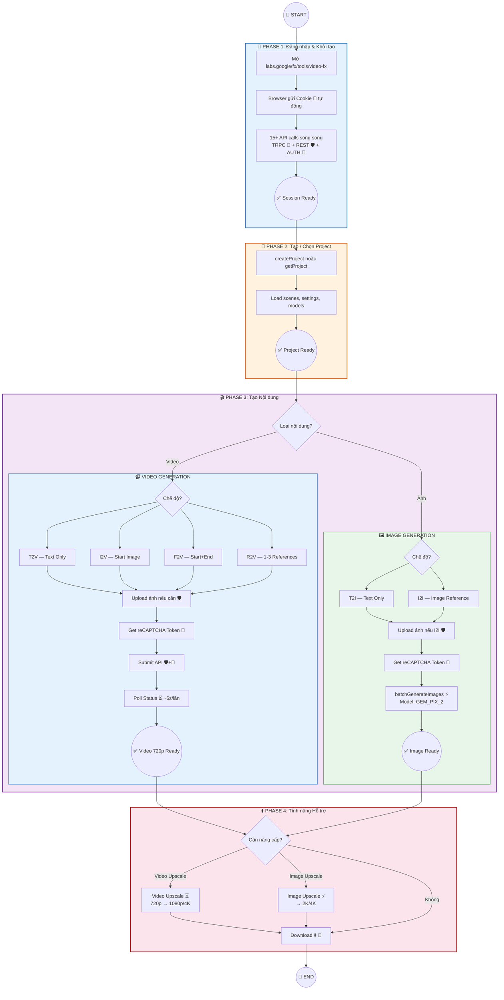
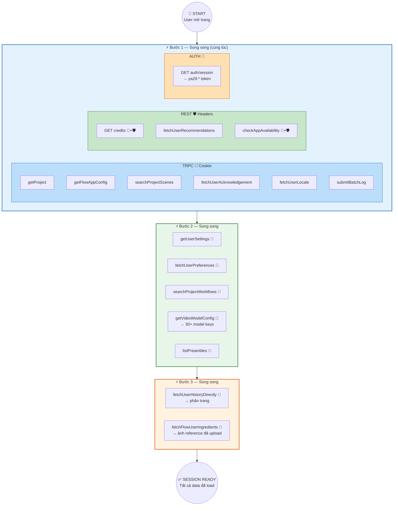
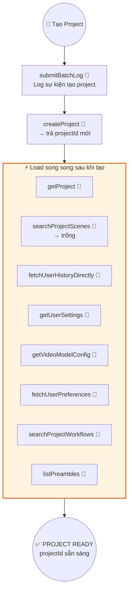
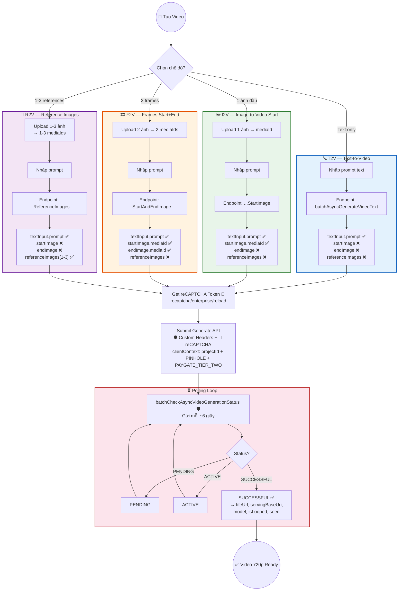
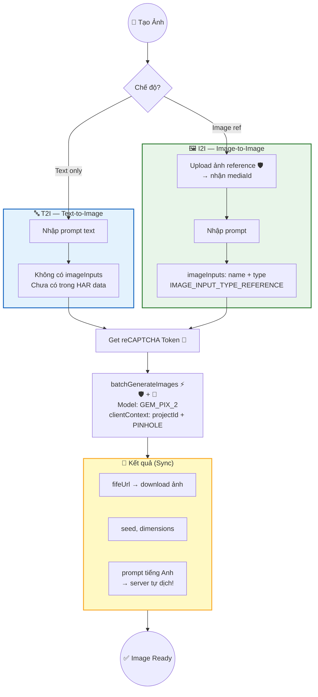
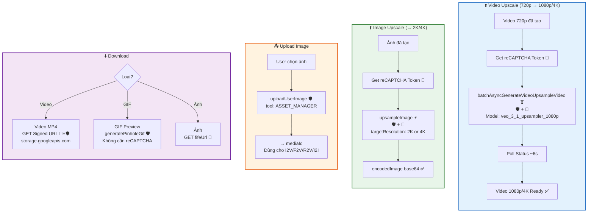

# VEO Web Client — Sơ đồ Hệ thống Quy trình

> **Nguồn dữ liệu**: [VEO_Web_Client_Protocol_Analysis.md](file:///D:/Music/Ruby/Produce%20for%20Customer/%23%23Tools/VEO%20Tool/%23NEW%20VEO%20API/00%20-%20Documentation/VEO_Web_Client_Protocol_Analysis.md) — phân tích từ 53 HAR files thực tế.
> **Phong cách tham khảo**: [veo_master_execution_flow.png](file:///D:/Music/Ruby/Produce%20for%20Customer/%23%23Tools/VEO%20Tool/%23NEW%20VEO%20API/00%20-%20Documentation/02_Architecture/diagrams/veo_master_execution_flow.png)

---

## Ký hiệu chung

| Ký hiệu | Ý nghĩa |
|:---:|---|
| 🍪 | **Cookie** — same-origin, browser tự gửi |
| 🔑 | **API Key** — query `?key=` hoặc header |
| 🛡️ | **Custom Headers** — 5 header `x-browser-*` + `x-client-data` |
| 🤖 | **reCAPTCHA Token** — trong payload `clientContext` |
| 🔗 | **Signed URL** — URL có chữ ký, tự xác thực |
| ⚡ | **Sync** — response trả kết quả ngay |
| ⏳ | **Async** — cần polling cho đến khi SUCCESSFUL |

---

## 1. TỔNG QUAN — Master Flow



---

## 2. ĐĂNG NHẬP & KHỞI TẠO SESSION

> **Trigger**: User mở/reload `labs.google/fx/tools/video-fx`
> **Auth**: Tất cả same-origin → Cookie tự động. Cross-site → Custom Headers.
> **Dữ liệu**: 3 HAR files



> [!IMPORTANT]
> **15+ API calls** gửi **song song** trong 3 đợt. Tất cả TRPC dùng Cookie (same-origin), REST dùng Custom Headers (cross-site). `getVideoModelConfig` trả về **30+ model keys** quan trọng cho bước generate.

---

## 3. TẠO PROJECT

> **Trigger**: User nhấn "New Project"
> **Auth**: Toàn bộ TRPC → Cookie only
> **Dữ liệu**: 1 HAR file



> [!NOTE]
> **projectId** (UUID format: `a89ea3a4-168c-4133-8fb0-7a852f11b33b`) được trả về từ `createProject` và dùng xuyên suốt cho mọi API call sau đó — đặc biệt trong `clientContext.projectId` của các request generate.

---

## 4. TẠO VIDEO — 4 Chế độ Chi tiết

> **4 chế độ**: T2V, I2V, F2V, R2V — khác endpoint, model key, và payload fields
> **Auth**: Upload 🛡️ → reCAPTCHA 🤖 → Generate 🛡️+🤖 → Poll 🛡️
> **Dữ liệu**: 17 HAR files (2 T2V + 1 I2V + 8 F2V + 5 R2V + 1 mixed)



### Bảng phân biệt 4 chế độ Video

| | T2V | I2V | F2V | R2V |
|---|:---:|:---:|:---:|:---:|
| **Endpoint** | `...VideoText` | `...StartImage` | `...StartAndEndImage` | `...ReferenceImages` |
| **Model key** | `t2v_*` | `i2v_s_*` (no `_fl_`) | `i2v_s_*_fl_*` | `r2v_*` |
| **textInput.prompt** | ✅ | ✅ | ✅ | ✅ |
| **startImage** | ❌ | ✅ | ✅ | ❌ |
| **endImage** | ❌ | ❌ | ✅ | ❌ |
| **referenceImages** | ❌ | ❌ | ❌ | ✅ (1-3) |
| **Upload cần?** | ❌ | 1 ảnh | 2 ảnh | 1-3 ảnh |
| **Response type** | ⏳ Async | ⏳ Async | ⏳ Async | ⏳ Async |
| **HAR calls** | 2 | 1 | 8 | 5 |

> [!TIP]
> **Cách phân biệt I2V vs F2V bằng model key**: Cùng prefix `i2v_s_` nhưng F2V có thêm `_fl_` (First+Last). Ví dụ:
> - I2V: `veo_3_1_i2v_s_fast_ultra_relaxed`
> - F2V: `veo_3_1_i2v_s_fast_portrait_fl_ultra_relaxed`

### clientContext — Cấu trúc payload chung cho Video

```json
{
  "clientContext": {
    "recaptchaContext": {
      "token": "0cAFcWeA5...",
      "applicationType": "RECAPTCHA_APPLICATION_TYPE_WEB"
    },
    "sessionId": ";1770534060719",
    "projectId": "a89ea3a4-168c-4133-8fb0-7a852f11b33b",
    "tool": "PINHOLE",
    "userPaygateTier": "PAYGATE_TIER_TWO"
  },
  "requests": [{
    "aspectRatio": "VIDEO_ASPECT_RATIO_PORTRAIT",
    "seed": 12546,
    "textInput": { "prompt": "..." },
    "videoModelKey": "veo_3_1_t2v_fast_portrait_ultra_relaxed",
    "startImage": { "mediaId": "..." },
    "endImage": { "mediaId": "..." },
    "referenceImages": [{ "imageUsageType": "IMAGE_USAGE_TYPE_ASSET", "mediaId": "..." }],
    "metadata": { "sceneId": "..." }
  }]
}
```

> Mỗi chế độ chỉ gửi các trường tương ứng — xem bảng phân biệt ở trên.

---

## 5. TẠO ẢNH — T2I & I2I

> **2 chế độ**: T2I (text only), I2I (text + image reference)
> **Model**: `GEM_PIX_2` (Google Imagen) — **KHÔNG phải VEO**
> **Response**: ⚡ **Sync** — trả kết quả ngay, không cần polling
> **Dữ liệu**: 5 HAR files (8 I2I calls, 0 T2I calls)



### Khác biệt so với Video Generation

| Đặc điểm | Video (VEO) | Ảnh (Imagen) |
|---|---|---|
| **Model** | `veo_3_1_*` | `GEM_PIX_2` |
| **Engine** | VEO | Google Imagen |
| **Response** | ⏳ Async (polling) | ⚡ Sync (ngay lập tức) |
| **userPaygateTier** | ✅ Gửi | ❌ Không gửi |
| **Download URL** | `fifeUrl` → video MP4 | `fifeUrl` → ảnh |
| **Prompt translation** | Chưa xác nhận | ✅ Server tự dịch sang EN |

### I2I Request payload

```json
{
  "clientContext": {
    "recaptchaContext": { "token": "...", "applicationType": "RECAPTCHA_APPLICATION_TYPE_WEB" },
    "sessionId": ";...",
    "projectId": "daba1978-...",
    "tool": "PINHOLE"
  },
  "requests": [{
    "seed": 651946,
    "imageModelName": "GEM_PIX_2",
    "imageAspectRatio": "IMAGE_ASPECT_RATIO_LANDSCAPE",
    "prompt": "thế giới hiện đại",
    "imageInputs": [{
      "name": "CAMaJDcxZDVl...",
      "imageInputType": "IMAGE_INPUT_TYPE_REFERENCE"
    }]
  }]
}
```

> [!WARNING]
> **Không có `userPaygateTier`** trong clientContext ảnh — khác với video! Upload ảnh dùng `tool: "ASSET_MANAGER"`, còn generate dùng `tool: "PINHOLE"`.

---

## 6. TÍNH NĂNG HỖ TRỢ

> **Không phải chế độ tạo nội dung** — là các utility hỗ trợ sau khi tạo xong.



### Bảng clientContext theo tính năng

> clientContext khác nhau tùy tính năng — cần gửi đúng fields!

| Trường | Video Gen | Image Gen | Video Upscale | Image Upscale | Upload |
|---|:---:|:---:|:---:|:---:|:---:|
| `projectId` | ✅ | ✅ | ❌ | ✅ | ❌ |
| `tool` | `PINHOLE` | `PINHOLE` | ❌ | `PINHOLE` | `ASSET_MANAGER` |
| `userPaygateTier` | ✅ `TIER_TWO` | ❌ | ❌ | ❌ | ❌ |
| `recaptchaContext` | ✅ | ✅ | ✅ | ✅ | ❌ |
| `sessionId` | ✅ | ✅ | ✅ | ✅ | ✅ |

> [!CAUTION]
> **Video Upscale** có `clientContext` **thu gọn nhất** — chỉ `sessionId` + reCAPTCHA. Không có `projectId`, `tool`, hay `userPaygateTier`. Gửi sai sẽ bị reject.

---

## Tổng hợp Endpoints

| Quy trình | Endpoint | Protocol | Auth | Response |
|---|---|---|---|---|
| **Session Init** | TRPC calls, REST calls | TRPC + REST | 🍪 + 🛡️ | ⚡ Sync |
| **Create Project** | `createProject` | TRPC | 🍪 | ⚡ Sync |
| **T2V** | `batchAsyncGenerateVideoText` | REST | 🛡️+🤖 | ⏳ Async |
| **I2V** | `batchAsyncGenerateVideoStartImage` | REST | 🛡️+🤖 | ⏳ Async |
| **F2V** | `batchAsyncGenerateVideoStartAndEndImage` | REST | 🛡️+🤖 | ⏳ Async |
| **R2V** | `batchAsyncGenerateVideoReferenceImages` | REST | 🛡️+🤖 | ⏳ Async |
| **T2I / I2I** | `batchGenerateImages` | REST | 🛡️+🤖 | ⚡ Sync |
| **Video Upscale** | `batchAsyncGenerateVideoUpsampleVideo` | REST | 🛡️+🤖 | ⏳ Async |
| **Image Upscale** | `upsampleImage` | REST | 🛡️+🤖 | ⚡ Sync |
| **Upload** | `uploadUserImage` | REST | 🛡️ | ⚡ Sync |
| **Poll Status** | `batchCheckAsyncVideoGenerationStatus` | REST | 🛡️ | ⚡ Sync |
| **Download Video** | `GET storage.googleapis.com/...` | STORAGE | 🛡️+🔗 | ⚡ Sync |
| **GIF Preview** | `generatePinholeGif` | REST | 🛡️ | ⚡ Sync |

---

> **Cập nhật**: 2026-02-08 | **Nguồn**: 53 HAR files (51 ban đầu + 2 T2V mới)
