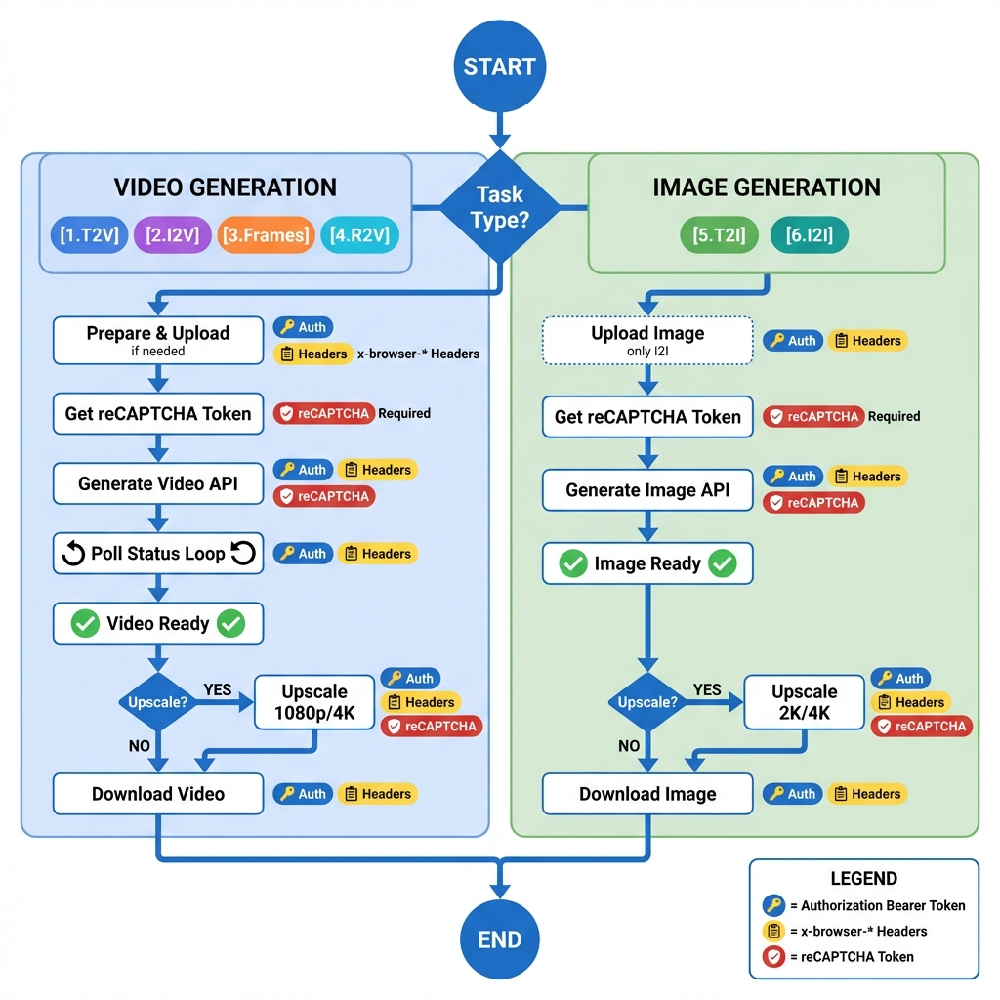

# 🗺️ VEO API Execution Flow

**Version**: 2.1  
**Updated**: 2026-02-02  
**Source**: `Research/reference/API_ENDPOINTS.md` & `F12 Dev` analysis  
**Purpose**: Visualizes the API-based execution path for all VEO workflows.

---

## 📊 Visual Overview



> **Chú thích Security Badges:**
> - 🔑 = Authorization Bearer Token
> - 📋 = x-browser-* Headers (x-browser-validation, x-browser-channel, x-browser-year, x-browser-copyright)
> - 🛡️ = reCAPTCHA Token (trong payload `clientContext.recaptchaContext.token`)

---

## 🔁 Master Execution Flow (Mermaid)

```mermaid
graph TD
    A[Start] --> B{Task Type?}
    
    subgraph "Video Workflows"
        %% 1. Text-to-Video (T2V)
        B -->|1. Text-to-Video| T2V1[Prepare Headers<br/>x-browser-*]
        T2V1 --> T2V2[Get reCAPTCHA Token]
        T2V2 --> T2V3[CMD_GENERATE_VIDEO<br/>model: veo_3_1_t2v_*<br/>+ Auth + reCAPTCHA + Headers]
        T2V3 --> POLL
        
        %% 2. Image-to-Video Single Frame (I2V)
        B -->|2. Image-to-Video<br/>Single Frame| I2V1[CMD_UPLOAD_IMAGE<br/>+ Headers Only]
        I2V1 --> I2V2[Get reCAPTCHA Token]
        I2V2 --> I2V3[CMD_GENERATE_VIDEO<br/>model: veo_3_1_i2v_s_*<br/>+ imageInputMediaId]
        I2V3 --> POLL
        
        %% 3. Frames-to-Video (Start + End Image)
        B -->|3. Frames-to-Video<br/>Start + End| F2V1[CMD_UPLOAD_IMAGE x2<br/>+ Headers Only]
        F2V1 --> F2V2[Get reCAPTCHA Token]
        F2V2 --> F2V3[CMD_GENERATE_VIDEO_START_END<br/>model: veo_3_1_i2v_s_fast_fl_*<br/>+ startImageId + endImageId]
        F2V3 --> POLL
        
        %% 4. Ingredients-to-Video (R2V)
        B -->|4. Ingredients<br/>1-3 Reference Images| R2V1[CMD_UPLOAD_IMAGE x1-3<br/>+ Headers Only]
        R2V1 --> R2V2[Get reCAPTCHA Token]
        R2V2 --> R2V3[CMD_GENERATE_VIDEO<br/>model: veo_3_1_r2v_*<br/>+ referenceImageIds array]
        R2V3 --> POLL
    end
    
    subgraph "Image Workflows"
        %% 5. Text-to-Image (T2I)
        B -->|5. Text-to-Image| T2I1[Prepare Headers]
        T2I1 --> T2I2[Get reCAPTCHA Token]
        T2I2 --> T2I3[CMD_GENERATE_IMAGE<br/>batchGenerateImages<br/>+ prompt]
        T2I3 --> IMG_READY[Base Image Ready]
        
        %% 6. Image-to-Image (I2I)
        B -->|6. Image-to-Image<br/>(Style/Variation)| I2I1[CMD_UPLOAD_IMAGE<br/>Source Image]
        I2I1 --> I2I2[Get reCAPTCHA Token]
        I2I2 --> I2I3[CMD_GENERATE_IMAGE<br/>batchGenerateImages<br/>+ prompt + imageInputs]
        I2I3 --> IMG_READY
    end

    subgraph "Video Post-Processing"
        POLL[Poll Status<br/>CMD_CHECK_STATUS<br/>+ Headers Only, NO reCAPTCHA]
        POLL --> DONE{Success?}
        DONE -->|No| POLL
        DONE -->|Yes| VIDEO_READY[Base Video Ready]
        
        VIDEO_READY --> VID_UPSCALE{Want<br/>Upscale?}
        VID_UPSCALE -->|Yes 1080p/4K| VUP1[Get reCAPTCHA Token]
        VUP1 --> VUP2[CMD_UPSCALE_VIDEO<br/>+ resolution enum<br/>+ reCAPTCHA + Headers]
        VUP2 --> VUP_POLL[Poll Upscale Status]
        VUP_POLL --> VUP_CHECK{Success?}
        VUP_CHECK -->|No| VUP_POLL
        VUP_CHECK -->|Yes| VIDEO_UPSCALED[Upscaled Video]
        VID_UPSCALE -->|No| VID_DL
    end

    subgraph "Image Post-Processing"
        IMG_READY --> IMG_UPSCALE{Want<br/>Upscale?}
        IMG_UPSCALE -->|Yes 2K/4K| IUP1[Get reCAPTCHA Token]
        IUP1 --> IUP2[CMD_UPSCALE_IMAGE<br/>upsampleImage<br/>+ resolution enum]
        IUP2 --> IUP_POLL[Poll Upscale Status]
        IUP_POLL --> IUP_CHECK{Success?}
        IUP_CHECK -->|No| IUP_POLL
        IUP_CHECK -->|Yes| IMG_UPSCALED[Upscaled Image]
        IMG_UPSCALE -->|No| IMG_DL
    end

    subgraph "Download"
        VIDEO_UPSCALED --> VID_DL[CMD_DOWNLOAD_VIDEO]
        VID_DL --> END[End]
        
        IMG_UPSCALED --> IMG_DL[CMD_DOWNLOAD_IMAGE]
        IMG_DL --> END
    end
```

---

## 🔐 Security Requirements Matrix

Bảng chi tiết yêu cầu bảo mật cho từng bước API call:

| Workflow Step | Endpoint | Authorization | x-browser Headers | reCAPTCHA | Notes |
|:-------------|:---------|:-------------:|:-----------------:|:---------:|:------|
| **Upload Image** | `/v1:uploadUserImage` | ✅ Required | ✅ Required | ❌ No | Chỉ cần Auth + Headers |
| **Get reCAPTCHA Token** | *Client-side* | - | - | 🛡️ Generates | Tạo token từ Google reCAPTCHA v3 |
| **Generate Video (All)** | `...:batchAsyncGenerateVideo*` | ✅ Required | ✅ Required | ✅ Required | Full security stack |
| **Generate Image (T2I/I2I)** | `...:batchGenerateImages` | ✅ Required | ✅ Required | ✅ Required | Full security stack |
| **Poll Video Status** | `...:batchCheckAsync*` | ✅ Required | ✅ Required | ❌ No | Không cần reCAPTCHA cho polling |
| **Upscale Video** | `...:...UpsampleVideo` | ✅ Required | ✅ Required | ✅ Required | Full security stack |
| **Upscale Image** | `/v1/flow/upsampleImage` | ✅ Required | ✅ Required | ✅ Required | Full security stack |
| **Poll Upscale Status** | *(Polling endpoint)* | ✅ Required | ✅ Required | ❌ No | Không cần reCAPTCHA cho polling |
| **Download Media** | `/v1/media/{id}` | ✅ Required | ✅ Required | ❌ No | Chỉ cần Auth + Headers |

### 📌 Key Insights

**❌ KHÔNG cần reCAPTCHA:**
- Upload Image (`uploadUserImage`)
- Poll Status (tất cả các polling operations)
- Download Media

**✅ CẦN reCAPTCHA (Full Security Stack):**
- Generate Video/Image (tất cả variants)
- Upscale Video/Image

**Lý do:**
- **Generation & Upscale**: Tốn tài nguyên compute → cần reCAPTCHA để chống abuse
- **Upload & Download**: I/O operations đơn giản → không cần reCAPTCHA
- **Polling**: Frequent operations → không cần reCAPTCHA để tránh overhead

### 🔧 Implementation Details

> For implementation details on the security mechanisms referenced above, see:
> - **x-browser Headers & reCAPTCHA**: [RECAPTCHA_BROWSER_MANAGEMENT.md](../03_Backend/RECAPTCHA_BROWSER_MANAGEMENT.md)
> - **Authorization / Token**: [TOKEN_SECURITY.md](../03_Backend/TOKEN_SECURITY.md)
