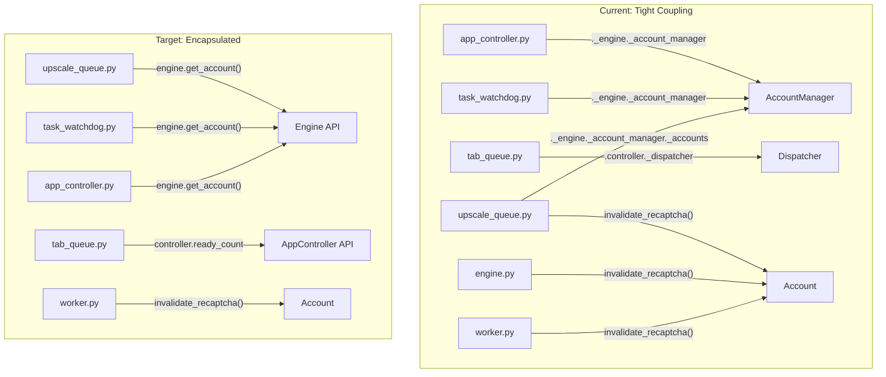
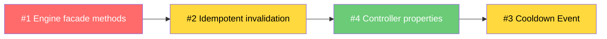

# 🔍 Fragmentation Analysis Report

> **Date**: 2026-02-21 · **Scope**: `core/` + `ui/tabs/` · **Status**: Analysis complete, pending remediation

---

## Tổng Quan

Codebase hiện tại có 4 pattern phân tán chính — nơi cùng một concern (quản lý account, reCAPTCHA, cooldown) bị **scatter** ra nhiều file mà không có encapsulation rõ ràng. Đây là nguyên nhân gốc của BUG 3 (`_account_manager` missing) đã fix ở session trước.



---

## Issue #1: Law of Demeter — Chuỗi `_engine._account_manager._accounts`

### Severity: 🔴 HIGH

### Vấn đề

External code truy cập private internals xuyên 2-3 layer object:

| File | Line | Access Chain | Purpose |
|------|------|-------------|---------|
| [upscale_queue.py](file:///D:/NEW%20VEO%20PRO%20MAX/veo-pro-max/02%20-%20CLIENT%20-%20VEO%20PRO%20MAX/core/upscale_queue.py#L325) | 325 | `self._engine._account_manager.get_account()` | Get account for upscale |
| [upscale_queue.py](file:///D:/NEW%20VEO%20PRO%20MAX/veo-pro-max/02%20-%20CLIENT%20-%20VEO%20PRO%20MAX/core/upscale_queue.py#L338) | 338 | `self._engine._account_manager._accounts` | Iterate sibling accounts |
| [upscale_queue.py](file:///D:/NEW%20VEO%20PRO%20MAX/veo-pro-max/02%20-%20CLIENT%20-%20VEO%20PRO%20MAX/core/upscale_queue.py#L516) | 516 | `self._engine._account_manager.fix_short_client_data()` | Fix headers after restart |
| [upscale_queue.py](file:///D:/NEW%20VEO%20PRO%20MAX/veo-pro-max/02%20-%20CLIENT%20-%20VEO%20PRO%20MAX/core/upscale_queue.py#L536) | 536 | `self._engine._account_manager.fix_short_client_data()` | Fix headers after restart |
| [upscale_queue.py](file:///D:/NEW%20VEO%20PRO%20MAX/veo-pro-max/02%20-%20CLIENT%20-%20VEO%20PRO%20MAX/core/upscale_queue.py#L544) | 544 | `self._engine._account_manager.fix_short_client_data()` | Fix headers after restart |
| [task_watchdog.py](file:///D:/NEW%20VEO%20PRO%20MAX/veo-pro-max/02%20-%20CLIENT%20-%20VEO%20PRO%20MAX/core/task_watchdog.py#L146) | 146 | `self._engine._account_manager.get_account()` | Check stuck task account |
| [app_controller.py](file:///D:/NEW%20VEO%20PRO%20MAX/veo-pro-max/02%20-%20CLIENT%20-%20VEO%20PRO%20MAX/core/app_controller.py#L353) | 353 | `self._engine._account_manager.get_account()` | Cache readiness token |

### Impact

- Khi rename `_account_manager` → tất cả 7 chỗ vỡ
- BUG 3 (`_account_manager` missing trên AppController) chính xác từ pattern này
- `._accounts` (L338) truy cập luôn cả **private list** — coupling cực mạnh

### Kế hoạch khắc phục

**Thêm 3 public methods vào Engine** để wrap access:

#### [MODIFY] [engine.py](file:///D:/NEW%20VEO%20PRO%20MAX/veo-pro-max/02%20-%20CLIENT%20-%20VEO%20PRO%20MAX/core/engine.py)

```python
# Add after clear_account_cooldown() (~L230)

def get_account(self, email: str):
    """Public facade — get account by email."""
    return self._account_manager.get_account(email)

def get_all_accounts(self):
    """Public facade — iterate all accounts."""
    return list(self._account_manager._accounts)

def fix_client_data(self):
    """Public facade — fix short x-client-data headers."""
    self._account_manager.fix_short_client_data()
```

#### [MODIFY] upscale_queue.py — Replace 7 references

```diff
- account = self._engine._account_manager.get_account(job.account_email)
+ account = self._engine.get_account(job.account_email)

- for acc in self._engine._account_manager._accounts:
+ for acc in self._engine.get_all_accounts():

- self._engine._account_manager.fix_short_client_data()
+ self._engine.fix_client_data()
```

#### [MODIFY] task_watchdog.py — Replace 1 reference

```diff
- account = self._engine._account_manager.get_account(assigned_account)
+ account = self._engine.get_account(assigned_account)
```

#### [MODIFY] app_controller.py — Replace 1 reference

```diff
- account = self._engine._account_manager.get_account(email)
+ account = self._engine.get_account(email)
```

**Total**: 4 files, ~10 line changes. Zero behavior change.

---

## Issue #2: reCAPTCHA Invalidation — 10 Call Sites / 4 Files

### Severity: 🟡 MEDIUM

### Vấn đề

`account.invalidate_recaptcha()` được gọi từ quá nhiều nơi, gây:
1. **Double-log**: Mỗi API call log `"reCAPTCHA token invalidated"` 2 lần
2. **Maintenance burden**: Thêm workflow mới → phải nhớ gọi invalidate đúng chỗ

| File | Line | Context |
|------|------|---------|
| [worker.py](file:///D:/NEW%20VEO%20PRO%20MAX/veo-pro-max/02%20-%20CLIENT%20-%20VEO%20PRO%20MAX/core/worker.py#L148) | 148 | Before API call (pre-invalidate) |
| [worker.py](file:///D:/NEW%20VEO%20PRO%20MAX/veo-pro-max/02%20-%20CLIENT%20-%20VEO%20PRO%20MAX/core/worker.py#L183) | 183 | After API call |
| [engine.py](file:///D:/NEW%20VEO%20PRO%20MAX/veo-pro-max/02%20-%20CLIENT%20-%20VEO%20PRO%20MAX/core/engine.py#L840-L841) | 840-841 | Defense-in-depth after worker |
| [engine.py](file:///D:/NEW%20VEO%20PRO%20MAX/veo-pro-max/02%20-%20CLIENT%20-%20VEO%20PRO%20MAX/core/engine.py#L2313) | 2313 | After upscale submit |
| [engine.py](file:///D:/NEW%20VEO%20PRO%20MAX/veo-pro-max/02%20-%20CLIENT%20-%20VEO%20PRO%20MAX/core/engine.py#L2421) | 2421 | After poll completion |
| [upscale_queue.py](file:///D:/NEW%20VEO%20PRO%20MAX/veo-pro-max/02%20-%20CLIENT%20-%20VEO%20PRO%20MAX/core/upscale_queue.py#L452) | 452 | Before garbage token check |
| [upscale_queue.py](file:///D:/NEW%20VEO%20PRO%20MAX/veo-pro-max/02%20-%20CLIENT%20-%20VEO%20PRO%20MAX/core/upscale_queue.py#L474) | 474 | After upscale API call |
| [upscale_queue.py](file:///D:/NEW%20VEO%20PRO%20MAX/veo-pro-max/02%20-%20CLIENT%20-%20VEO%20PRO%20MAX/core/upscale_queue.py#L741) | 741 | Re-upscale flow |

### Impact

```
# Runtime log — người dùng thấy 2 dòng giống hệt nhau:
[DEBUG] [user@email.com] reCAPTCHA token invalidated (single-use consumed)
[DEBUG] [user@email.com] reCAPTCHA token invalidated (single-use consumed)
```

### Kế hoạch khắc phục

**Nguyên tắc**: Invalidation chỉ nên xảy ra **1 lần, tại 1 nơi** — ngay sau khi token được sử dụng trong API call.

#### Step 1: Make `invalidate_recaptcha()` idempotent + silent on double-call

```python
# account_manager.py — modify invalidate_recaptcha()
def invalidate_recaptcha(self):
    """Invalidate current reCAPTCHA token (single-use)."""
    if not self._recaptcha_token:
        return  # Already invalidated — skip log
    self._recaptcha_token = None
    log.debug(f"[{self.email}] reCAPTCHA token invalidated (single-use consumed)")
```

#### Step 2: Remove redundant calls from engine.py

```diff
  # engine.py L840-841 — REMOVE defense-in-depth call
- # invalidate_recaptcha() is idempotent — safe to double-call.
- account.invalidate_recaptcha()
```

> [!NOTE]
> Step 1 alone đã fix double-log. Step 2 cleanup code cho sạch hơn nhưng optional vì idempotent.

**Total**: 1-2 files, ~5 line changes.

---

## Issue #3: Cooldown Dict — No Lock, No Event

### Severity: 🟡 MEDIUM

### Vấn đề

`self._account_cooldowns` (engine.py L144) là plain dict, accessed concurrently:

```python
# engine.py L144
self._account_cooldowns: Dict[str, datetime] = {}
```

| Operation | Method | Callers |
|-----------|--------|---------|
| Read | `is_account_on_cooldown()` | engine workers, upscale_queue, task_watchdog |
| Write | `set_account_cooldown()` | engine 403 handler, upscale_queue 403 handler |
| Delete | `clear_account_cooldown()` | engine on success, upscale_queue on success |
| Block | `wait_for_cooldown()` | engine workers, upscale_queue |

**Race condition scenario**:
```
Worker A calls wait_for_cooldown() → sleeps 30s
Worker B calls wait_for_cooldown() → sleeps 30s (redundant!)
Worker C calls set_account_cooldown() → extends to 60s
Worker A wakes up → submits → 403 (cooldown was extended!)
```

### Kế hoạch khắc phục

**Replace sleep with `asyncio.Event`** — all waiters wake together when cooldown clears:

#### [MODIFY] [engine.py](file:///D:/NEW%20VEO%20PRO%20MAX/veo-pro-max/02%20-%20CLIENT%20-%20VEO%20PRO%20MAX/core/engine.py)

```python
# Replace in __init__
self._account_cooldowns: Dict[str, datetime] = {}
self._cooldown_events: Dict[str, asyncio.Event] = {}  # NEW

def set_account_cooldown(self, email: str, reason: str = ""):
    count = self._account_cooldown_backoff.get(email, 0) + 1
    self._account_cooldown_backoff[email] = count
    delay = min(30 * (2 ** (count - 1)), 180)
    self._account_cooldowns[email] = datetime.now() + timedelta(seconds=delay)
    
    # Clear event so waiters block
    if email in self._cooldown_events:
        self._cooldown_events[email].clear()
    
    log.warning(f"[Cooldown] {email}: {reason} → cooldown {delay}s (#{count})")
    
    # Schedule auto-clear
    asyncio.get_event_loop().call_later(delay, self._auto_clear_cooldown, email)

def _auto_clear_cooldown(self, email: str):
    """Auto-clear cooldown + wake all waiters."""
    self._account_cooldowns.pop(email, None)
    event = self._cooldown_events.get(email)
    if event:
        event.set()  # Wake all waiters simultaneously

async def wait_for_cooldown(self, email: str):
    if not self.is_account_on_cooldown(email):
        return
    if email not in self._cooldown_events:
        self._cooldown_events[email] = asyncio.Event()
    self._cooldown_events[email].clear()
    
    remaining = (self._account_cooldowns[email] - datetime.now()).total_seconds()
    log.info(f"[Cooldown] {email}: waiting {remaining:.0f}s...")
    
    await self._cooldown_events[email].wait()  # Efficient — no redundant sleeps
```

**Benefit**: 5 concurrent waiters → 1 sleep task + 1 Event, not 5 separate `asyncio.sleep()` calls.

**Total**: 1 file, ~20 line changes.

---

## Issue #4: UI → Core Coupling (`controller._dispatcher`)

### Severity: 🟢 LOW

### Vấn đề

UI tabs truy cập trực tiếp private `_dispatcher` trên controller:

| File | Line | Access |
|------|------|--------|
| [tab_queue.py](file:///D:/NEW%20VEO%20PRO%20MAX/veo-pro-max/02%20-%20CLIENT%20-%20VEO%20PRO%20MAX/ui/tabs/tab_queue.py#L2505) | 2505 | `self.controller._dispatcher.ready_count` |
| [tab_queue.py](file:///D:/NEW%20VEO%20PRO%20MAX/veo-pro-max/02%20-%20CLIENT%20-%20VEO%20PRO%20MAX/ui/tabs/tab_queue.py#L2913) | 2913 | `disp = self.controller._dispatcher` |
| [tab_queue.py](file:///D:/NEW%20VEO%20PRO%20MAX/veo-pro-max/02%20-%20CLIENT%20-%20VEO%20PRO%20MAX/ui/tabs/tab_queue.py#L3347) | 3347 | `dispatcher = self.controller._dispatcher` |
| [tab_queue.py](file:///D:/NEW%20VEO%20PRO%20MAX/veo-pro-max/02%20-%20CLIENT%20-%20VEO%20PRO%20MAX/ui/tabs/tab_queue.py#L3397) | 3397 | `dispatcher = self.controller._dispatcher` |

### Kế hoạch khắc phục

**Thêm property vào AppController**:

```python
# app_controller.py
@property
def ready_count(self) -> int:
    """Number of tasks ready to process."""
    return self._dispatcher.ready_count if self._dispatcher else 0

@property
def dispatcher(self):
    """Public accessor for dispatcher (read-only operations)."""
    return self._dispatcher
```

```diff
  # tab_queue.py L2505
- if self.controller._dispatcher.ready_count == 0:
+ if self.controller.ready_count == 0:
```

**Total**: 2 files, ~8 line changes. Zero behavior change.

---

## Roadmap Tổng Hợp

| Priority | Issue | Files | Lines | Risk |
|----------|-------|-------|-------|------|
| 🔴 P0 | #1 Law of Demeter | 4 | ~10 | Zero — facade methods |
| 🟡 P1 | #2 reCAPTCHA invalidation | 1-2 | ~5 | Zero — idempotent guard |
| 🟡 P1 | #3 Cooldown Event | 1 | ~20 | Low — behavior change |
| 🟢 P2 | #4 UI coupling | 2 | ~8 | Zero — property wrapper |

> [!IMPORTANT]
> Issues #1, #2, #4 are **zero-risk refactors** — only adding facade/wrapper, no behavior change.
> Issue #3 changes blocking behavior (Event vs sleep) — needs testing.

### Execution Order



