# 🛡️ API 403 Risk Analysis — Toàn bộ trường hợp & Hướng xử lý

**Location**: `03_Backend/API_403_RISK_ANALYSIS.md`  
**Status**: ACTIVE  
**Last Updated**: 2026-02-22

---

## Tổng quan

Khi gửi request tới VEO API, ngay cả khi reCAPTCHA token "hợp lệ" (format đúng, `grecaptcha.execute()` thành công), request vẫn có thể bị **403 Forbidden**. Document này liệt kê **toàn bộ 16 trường hợp**, phân nhóm, mô tả flow, và đưa ra hướng xử lý triệt để.

---

## Phân nhóm rủi ro

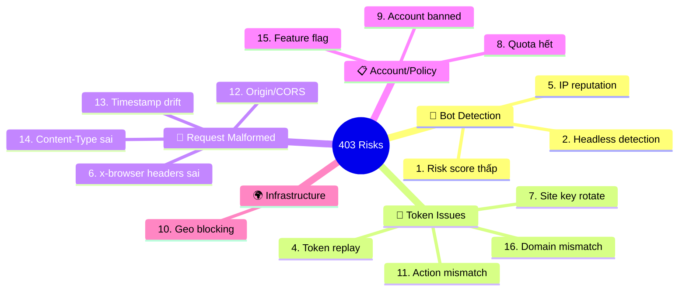
```mermaid
mindmap
  root((403 Risks))
    🤖 Bot Detection
      1. Risk score thấp
      2. Headless detection
      5. IP reputation
    🔑 Token Issues
      4. Token replay
      7. Site key rotate
      11. Action mismatch
      16. Domain mismatch
    🔧 Request Malformed
      6. x-browser headers sai
      12. Origin/CORS
      13. Timestamp drift
      14. Content-Type sai
    📋 Account/Policy
      8. Quota hết
      9. Account banned
      15. Feature flag
    🌍 Infrastructure
      10. Geo blocking
```

---

## Nhóm A: 🤖 Bot Detection (Score-based)

### #1 — Risk Score Thấp

reCAPTCHA v3 Enterprise chấm điểm 0.0→1.0. Server set threshold (VD ≥0.7). Score thấp → 403.

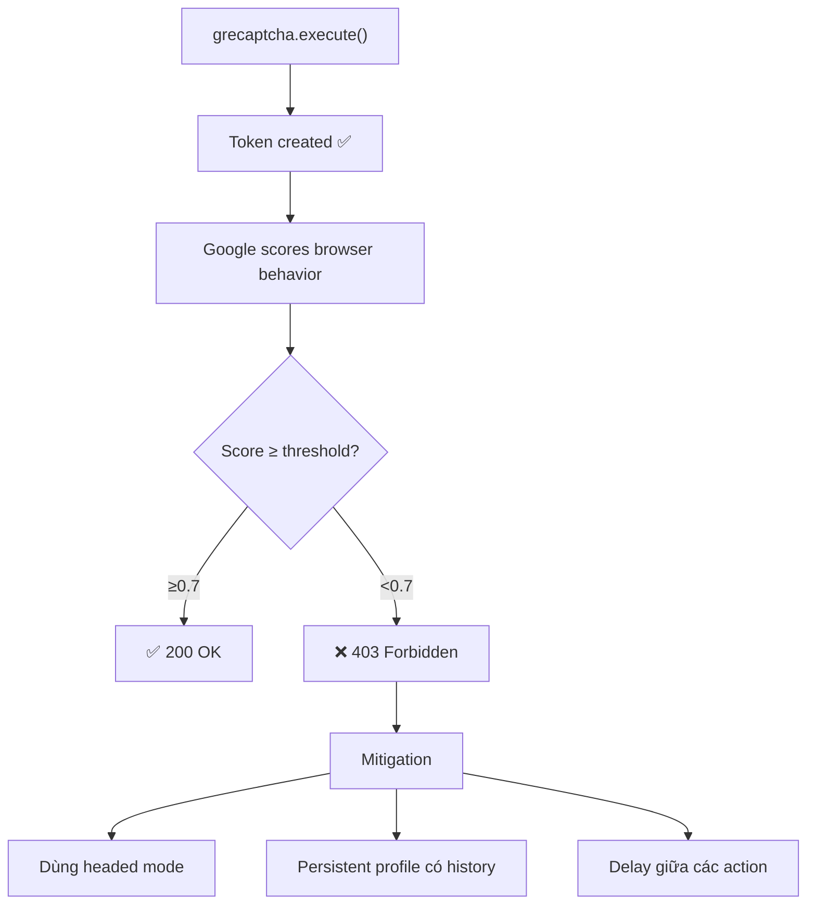
```mermaid
flowchart TD
    A["grecaptcha.execute()"] --> B["Token created ✅"]
    B --> C["Google scores browser behavior"]
    C --> D{Score ≥ threshold?}
    D -->|"≥0.7"| E["✅ 200 OK"]
    D -->|"<0.7"| F["❌ 403 Forbidden"]
    
    F --> G["Mitigation"]
    G --> G1["Dùng headed mode"]
    G --> G2["Persistent profile có history"]
    G --> G3["Delay giữa các action"]
```

**Dấu hiệu:** 403 ngay lập tức, không có error message cụ thể.

**Xử lý triệt để:**

| Biện pháp | Hiệu quả | Implement |
|-----------|----------|-----------|
| Headed browser (không headless) | ⭐⭐⭐⭐⭐ | `headless=False` |
| Persistent Chrome profile (có history, cookies) | ⭐⭐⭐⭐ | `launch_persistent_context(user_data_dir=...)` |
| Random delays 2-5s giữa actions | ⭐⭐⭐ | `asyncio.sleep(random.uniform(2, 5))` |
| Mouse movement trước execute | ⭐⭐ | `page.mouse.move(x, y)` |
| Scroll page trước execute | ⭐⭐ | `page.evaluate("window.scrollTo(0, 300)")` |

---

### #2 — Headless Browser Detection

Google detect Playwright/Puppeteer headless → chấm score cực thấp.

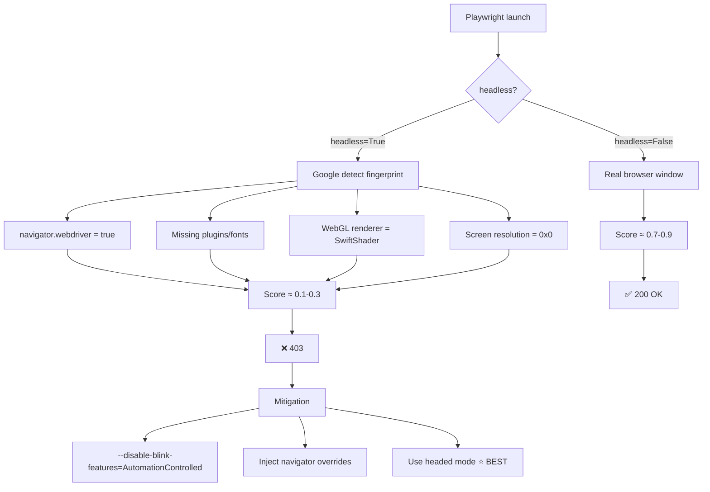
```mermaid
flowchart TD
    A["Playwright launch"] --> B{headless?}
    B -->|"headless=True"| C["Google detect fingerprint"]
    C --> C1["navigator.webdriver = true"]
    C --> C2["Missing plugins/fonts"]
    C --> C3["WebGL renderer = SwiftShader"]
    C --> C4["Screen resolution = 0x0"]
    C1 & C2 & C3 & C4 --> D["Score ≈ 0.1-0.3"]
    D --> E["❌ 403"]
    
    B -->|"headless=False"| F["Real browser window"]
    F --> G["Score ≈ 0.7-0.9"]
    G --> H["✅ 200 OK"]
    
    E --> I["Mitigation"]
    I --> I1["--disable-blink-features=AutomationControlled"]
    I --> I2["Inject navigator overrides"]
    I --> I3["Use headed mode ⭐ BEST"]
```

**Xử lý triệt để:**

```python
# LEVEL 1: Cơ bản (đã có)
args=['--disable-blink-features=AutomationControlled']

# LEVEL 2: Nâng cao
args=[
    '--disable-blink-features=AutomationControlled',
    '--disable-features=IsolateOrigins,site-per-process',
    '--disable-dev-shm-usage',
    '--window-size=1920,1080',
]
# + inject script trước khi load page:
await page.add_init_script("""
    Object.defineProperty(navigator, 'webdriver', {get: () => false});
    Object.defineProperty(navigator, 'plugins', {get: () => [1,2,3]});
    Object.defineProperty(navigator, 'languages', {get: () => ['en-US','en']});
""")

# LEVEL 3: Triệt để nhất
headless=False  # Chạy browser thật
```

---

### #5 — IP Reputation

IP bị flag (VPN, datacenter, quá nhiều request từ cùng IP).

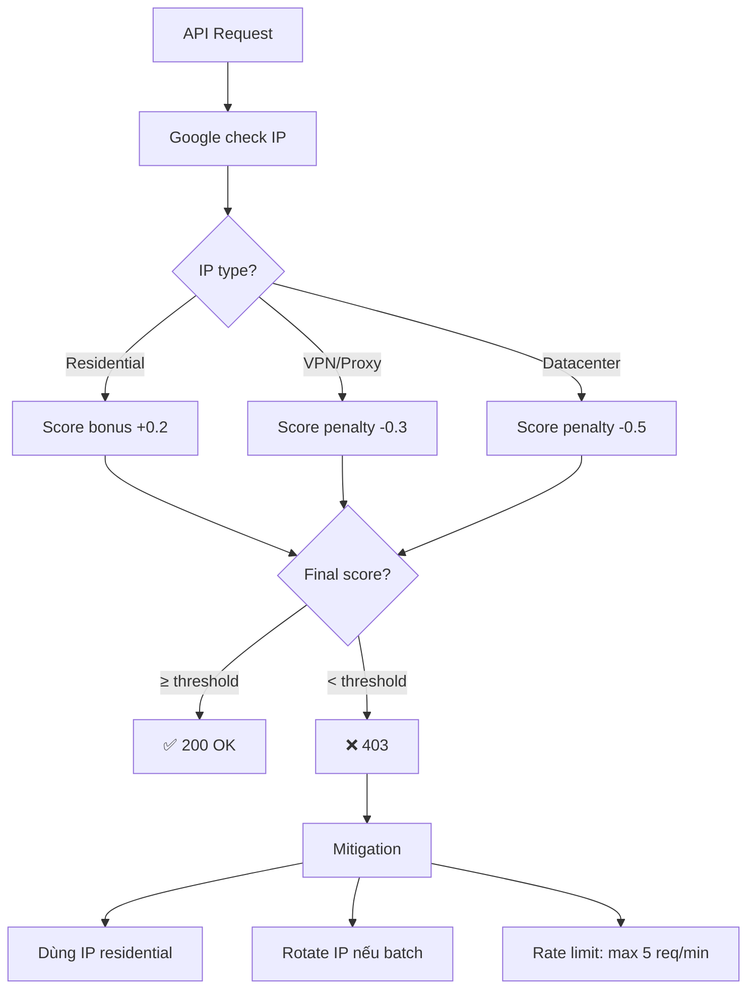
```mermaid
flowchart TD
    A["API Request"] --> B["Google check IP"]
    B --> C{IP type?}
    C -->|"Residential"| D["Score bonus +0.2"]
    C -->|"VPN/Proxy"| E["Score penalty -0.3"]
    C -->|"Datacenter"| F["Score penalty -0.5"]
    
    D --> G{Final score?}
    E --> G
    F --> G
    G -->|"≥ threshold"| H["✅ 200 OK"]
    G -->|"< threshold"| I["❌ 403"]
    
    I --> J["Mitigation"]
    J --> J1["Dùng IP residential"]
    J --> J2["Rotate IP nếu batch"]
    J --> J3["Rate limit: max 5 req/min"]
```

**Xử lý triệt để:**
- Dùng IP residential (không VPN/proxy)
- Rate limit: tối đa 5 request/phút/IP
- Nếu batch generation: đợi 10-30s giữa các batch

---

## Nhóm B: 🔑 Token Issues

### #4 — Token Replay (Dùng lại token)

Mỗi reCAPTCHA token chỉ dùng **MỘT LẦN**. Dùng lại → 403.

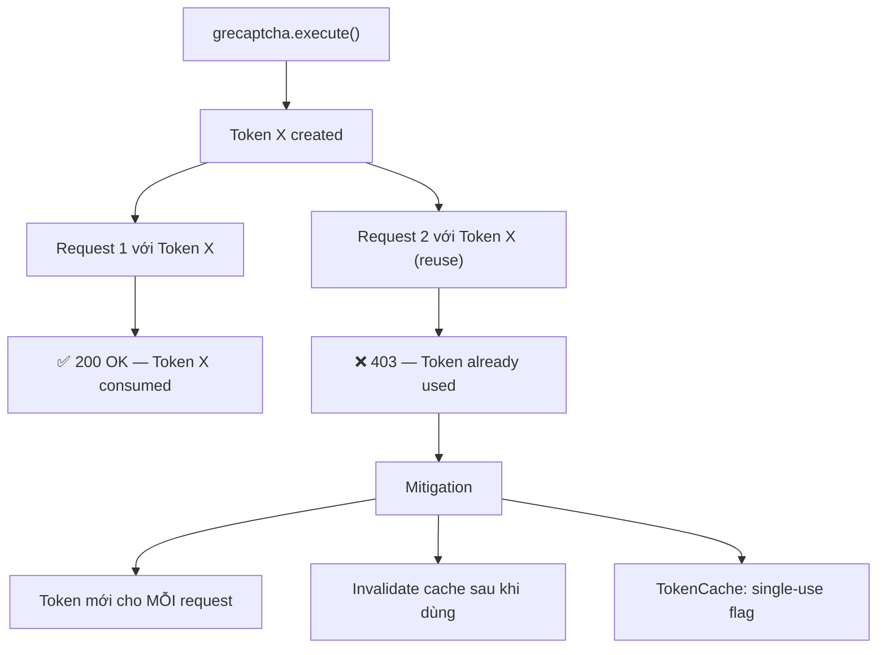
```mermaid
flowchart TD
    A["grecaptcha.execute()"] --> B["Token X created"]
    B --> C["Request 1 với Token X"]
    C --> D["✅ 200 OK — Token X consumed"]
    
    B --> E["Request 2 với Token X (reuse)"]
    E --> F["❌ 403 — Token already used"]
    
    F --> G["Mitigation"]
    G --> G1["Token mới cho MỖI request"]
    G --> G2["Invalidate cache sau khi dùng"]
    G --> G3["TokenCache: single-use flag"]
```

**Xử lý triệt để:**

```python
class TokenCache:
    TOKEN_LIFETIME = 90
    
    def get_and_consume(self) -> str | None:
        """Get token and immediately invalidate (single-use)."""
        if self.is_valid:
            token = self._token
            self._token = None       # ← INVALIDATE ngay
            self._timestamp = 0
            return token
        return None
```

> ⚠️ **Code hiện tại** dùng `TokenCache.get()` — token có thể bị reuse nếu 2 workflow chạy song song!

---

### #7 — Site Key Thay Đổi

Google rotate reCAPTCHA site key → hardcoded key thành invalid.

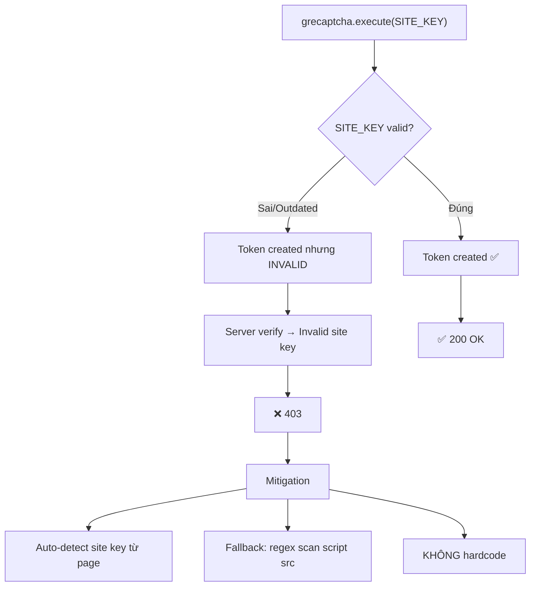
```mermaid
flowchart TD
    A["grecaptcha.execute(SITE_KEY)"] --> B{SITE_KEY valid?}
    B -->|"Đúng"| C["Token created ✅"]
    B -->|"Sai/Outdated"| D["Token created nhưng INVALID"]
    D --> E["Server verify → Invalid site key"]
    E --> F["❌ 403"]
    
    C --> G["✅ 200 OK"]
    
    F --> H["Mitigation"]
    H --> H1["Auto-detect site key từ page"]
    H --> H2["Fallback: regex scan script src"]
    H --> H3["KHÔNG hardcode"]
```

**Xử lý triệt để:**

```python
# Code hiện tại đã có 3 methods tìm site key (tốt),
# nhưng vẫn có hardcoded fallback (rủi ro):
# Method 3 (Bad): siteKey = '6LfV2HQqAAAAAFY1I8F0WVK3i3Qlu9G4e_a7wPzR'

# FIX: Bỏ hardcoded fallback, raise error nếu không tìm được
if not siteKey:
    raise Error("Cannot find reCAPTCHA site key — Google may have changed page structure")
```

---

### #11 — Action Mismatch

Token tạo với `{action: 'generate'}` nhưng endpoint expect action khác.

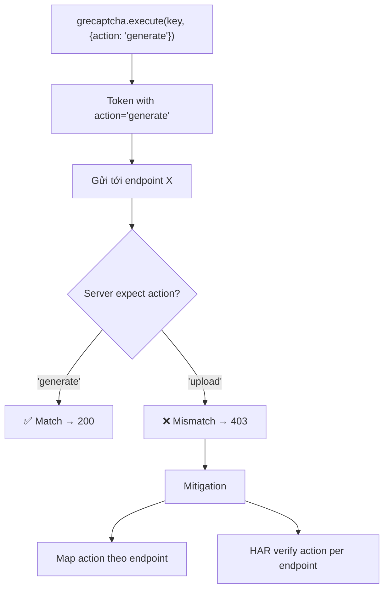
```mermaid
flowchart TD
    A["grecaptcha.execute(key, {action: 'generate'})"] --> B["Token with action='generate'"]
    B --> C["Gửi tới endpoint X"]
    C --> D{Server expect action?}
    D -->|"'generate'"| E["✅ Match → 200"]
    D -->|"'upload'"| F["❌ Mismatch → 403"]
    
    F --> G["Mitigation"]
    G --> G1["Map action theo endpoint"]
    G --> G2["HAR verify action per endpoint"]
```

**Xử lý triệt để:**

```python
ENDPOINT_ACTIONS = {
    "batchGenerateImages": "generate",
    "batchAsyncGenerateVideo": "generate",
    "uploadUserImage": "upload",        # Có thể khác!
    "upsampleImage": "generate",
    "generatePinholeGif": "generate",
}

async def get_recaptcha_token(self, action: str = "generate"):
    return await grecaptcha.execute(site_key, {"action": action})
```

> ⚠️ Upload endpoint hiện tại **không gửi reCAPTCHA** (HAR verified), nhưng nếu Google đổi policy thì action cần mapping đúng.

---

### #16 — Domain Mismatch

Token tạo trên domain A, nhưng request gửi từ domain/origin khác.

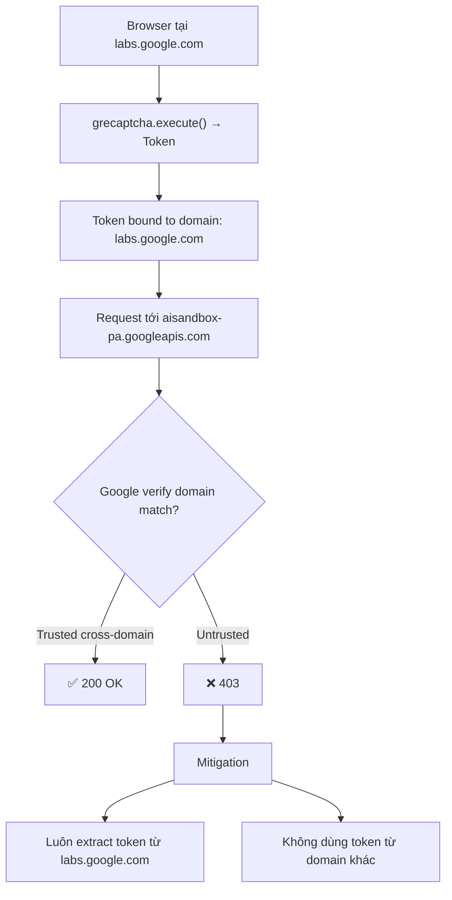
```mermaid
flowchart TD
    A["Browser tại labs.google.com"] --> B["grecaptcha.execute() → Token"]
    B --> C["Token bound to domain: labs.google.com"]
    
    C --> D["Request tới aisandbox-pa.googleapis.com"]
    D --> E{Google verify domain match?}
    E -->|"Trusted cross-domain"| F["✅ 200 OK"]
    E -->|"Untrusted"| G["❌ 403"]
    
    G --> H["Mitigation"]
    H --> H1["Luôn extract token từ labs.google.com"]
    H --> H2["Không dùng token từ domain khác"]
```

**Xử lý:** Rủi ro thấp vì Google đã config `labs.google.com` → `aisandbox-pa.googleapis.com` là trusted pair. Chỉ cần đảm bảo luôn navigate đúng VEO page trước khi execute.

---

## Nhóm C: 🔧 Request Malformed

### #6 — x-browser-* Headers Sai/Thiếu

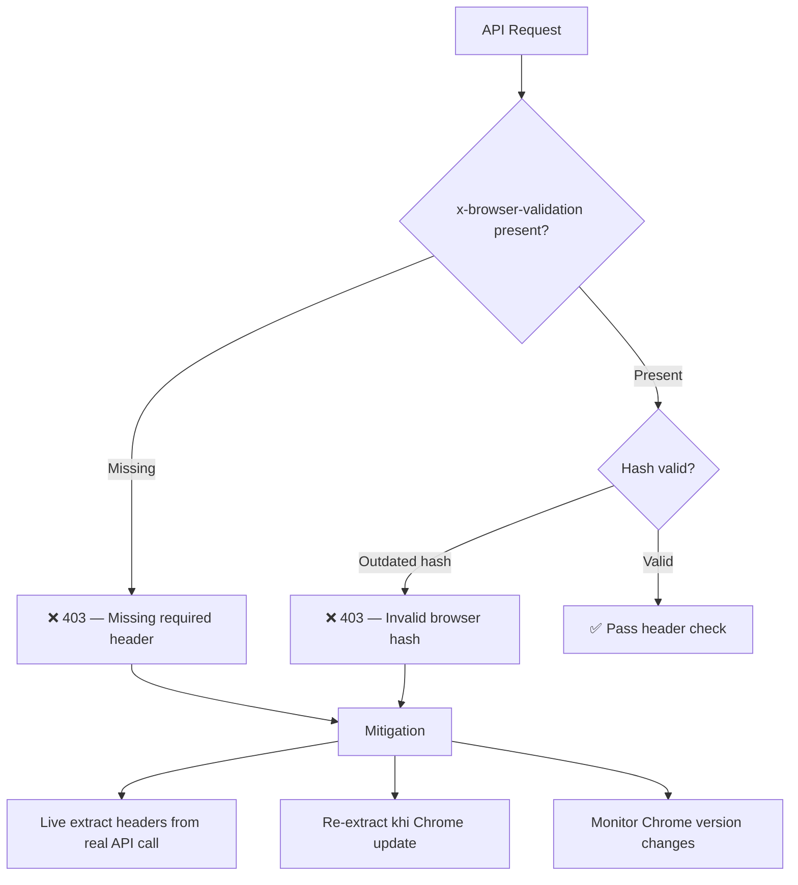
```mermaid
flowchart TD
    A["API Request"] --> B{"x-browser-validation present?"}
    B -->|"Missing"| C["❌ 403 — Missing required header"]
    B -->|"Present"| D{"Hash valid?"}
    D -->|"Outdated hash"| E["❌ 403 — Invalid browser hash"]
    D -->|"Valid"| F["✅ Pass header check"]
    
    C --> G["Mitigation"]
    E --> G
    G --> G1["Live extract headers from real API call"]
    G --> G2["Re-extract khi Chrome update"]
    G --> G3["Monitor Chrome version changes"]
```

**Xử lý triệt để:**

```python
# Code hiện tại: intercept headers từ 1 API call thật (TỐT)
# Nhưng headers được cache và có thể outdated

# FIX: Re-extract headers mỗi session
async def _setup_header_interception(self, page):
    """Intercept MỖI session, không cache across sessions."""
    self._headers_captured = False  # Reset mỗi lần
    
    async def intercept_request(route, request):
        if "aisandbox-pa" in request.url and not self._headers_captured:
            self._browser_headers = {
                k: v for k, v in request.headers.items()
                if k.startswith("x-browser") or k.startswith("x-client")
            }
            self._headers_captured = True
        await route.continue_()
    
    await page.route("**/*", intercept_request)
```

---

### #12 — Origin/CORS Mismatch

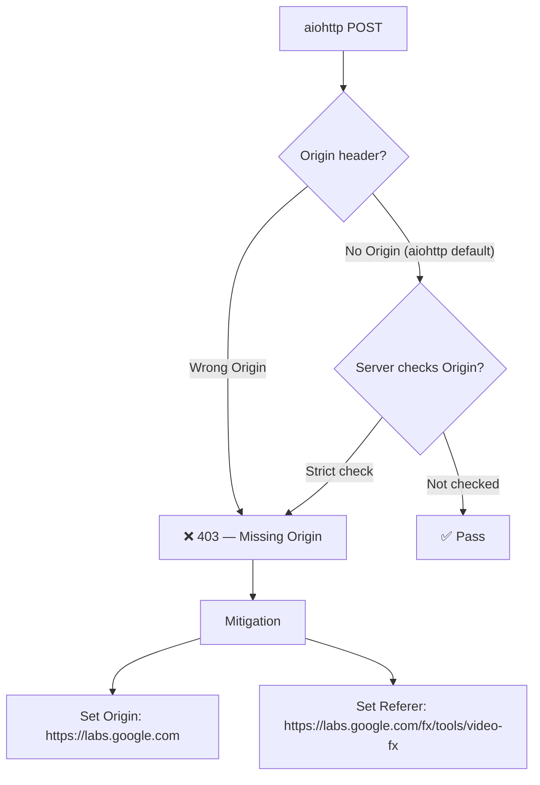
```mermaid
flowchart TD
    A["aiohttp POST"] --> B{"Origin header?"}
    B -->|"No Origin (aiohttp default)"| C{"Server checks Origin?"}
    C -->|"Strict check"| D["❌ 403 — Missing Origin"]
    C -->|"Not checked"| E["✅ Pass"]
    
    B -->|"Wrong Origin"| D
    
    D --> F["Mitigation"]
    F --> F1["Set Origin: https://labs.google.com"]
    F --> F2["Set Referer: https://labs.google.com/fx/tools/video-fx"]
```

**Xử lý triệt để:**

```python
def _build_headers(self, access_token, recaptcha_token):
    headers = {
        "Authorization": f"Bearer {access_token}",
        "Content-Type": "text/plain;charset=UTF-8",
        "x-goog-recaptcha-token": recaptcha_token,
        # ADD: Origin/Referer để tránh CORS reject
        "Origin": "https://labs.google.com",
        "Referer": "https://labs.google.com/fx/tools/video-fx",
    }
    headers.update(self._browser_headers.get_all_headers())
    return headers
```

> ⚠️ **Code hiện tại KHÔNG gửi Origin/Referer.** HAR data cho thấy browser thật luôn gửi — nên thêm.

---

### #13 — Timestamp Drift

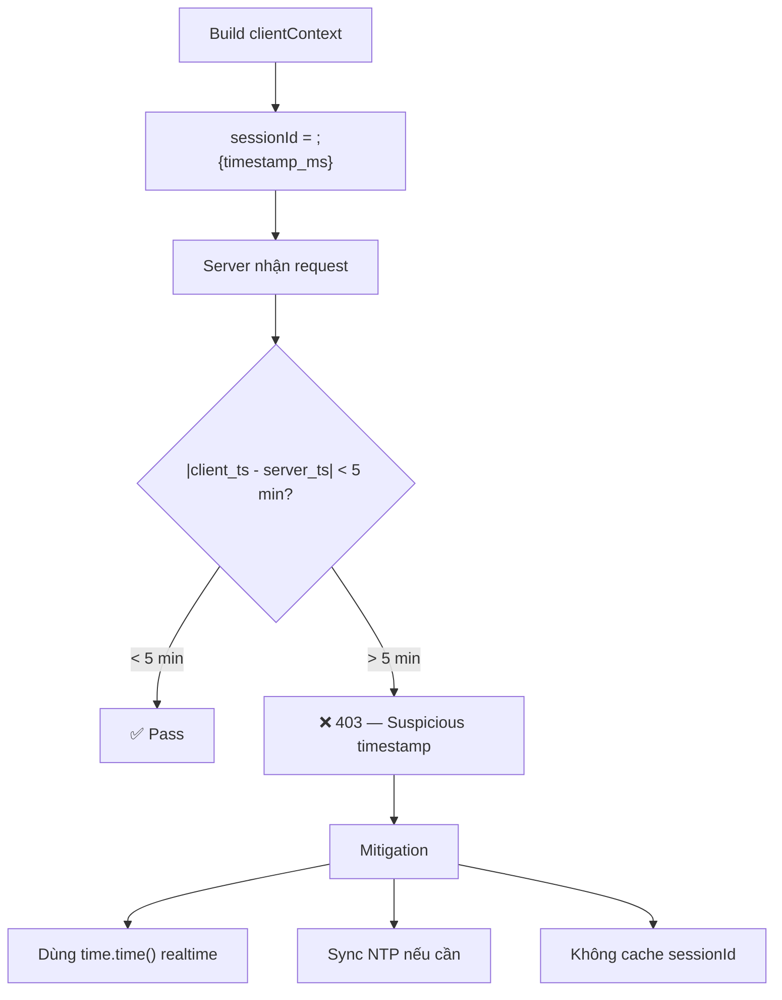
```mermaid
flowchart TD
    A["Build clientContext"] --> B["sessionId = ;{timestamp_ms}"]
    B --> C["Server nhận request"]
    C --> D{"|client_ts - server_ts| < 5 min?"}
    D -->|"< 5 min"| E["✅ Pass"]
    D -->|"> 5 min"| F["❌ 403 — Suspicious timestamp"]
    
    F --> G["Mitigation"]
    G --> G1["Dùng time.time() realtime"]
    G --> G2["Sync NTP nếu cần"]
    G --> G3["Không cache sessionId"]
```

**Xử lý:** Rủi ro thấp — code hiện tại đã dùng `int(time.time() * 1000)` realtime. Chỉ fail nếu system clock lệch nặng.

---

### #14 — Content-Type Sai

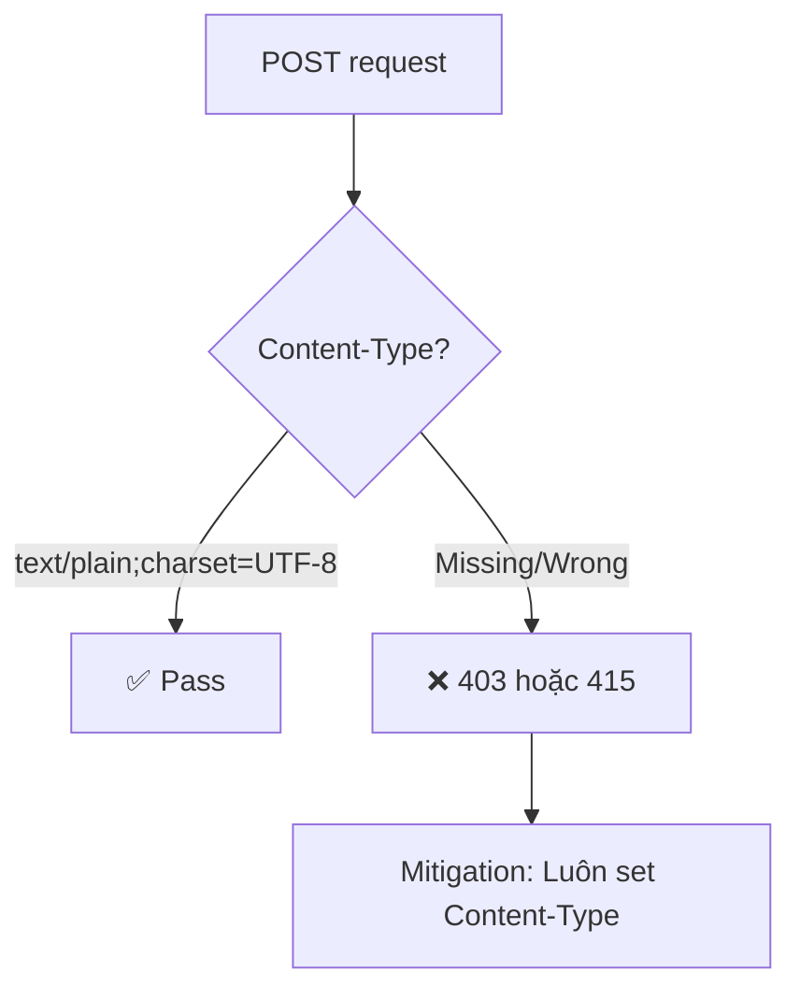
```mermaid
flowchart TD
    A["POST request"] --> B{"Content-Type?"}
    B -->|"text/plain;charset=UTF-8"| C["✅ Pass"]
    B -->|"Missing/Wrong"| D["❌ 403 hoặc 415"]
    
    D --> E["Mitigation: Luôn set Content-Type"]
```

**Xử lý:** Code hiện tại đã set `"Content-Type": "text/plain;charset=UTF-8"` (cập nhật từ HAR/cURL analysis). Rủi ro thấp.

---

## Nhóm D: 📋 Account/Policy

### #8 — Quota Hết

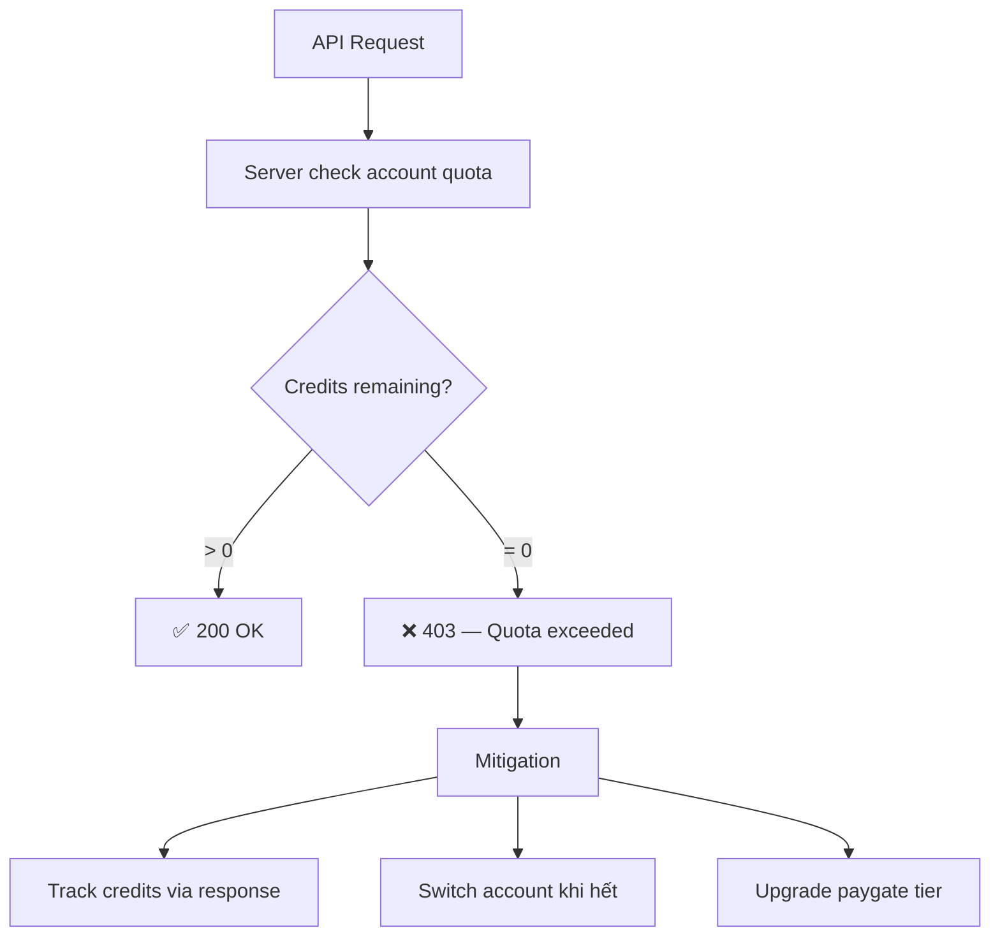
```mermaid
flowchart TD
    A["API Request"] --> B["Server check account quota"]
    B --> C{Credits remaining?}
    C -->|"> 0"| D["✅ 200 OK"]
    C -->|"= 0"| E["❌ 403 — Quota exceeded"]
    
    E --> F["Mitigation"]
    F --> F1["Track credits via response"]
    F --> F2["Switch account khi hết"]
    F --> F3["Upgrade paygate tier"]
```

**Dấu hiệu:** Response body chứa `"quotaExceeded"` hoặc `"PAYGATE_TIER"` error.

**Xử lý triệt để:**

```python
# Track credits từ check_status response
# HAR shows: "remaining_credits" in poll response
async def _handle_quota_error(self, response, account):
    if "quota" in response.error.lower():
        account.mark_quota_exhausted()
        next_account = self.dispatcher.get_next_available()
        if next_account:
            return await self._retry_with_account(next_account)
        raise QuotaExhaustedError("All accounts exhausted")
```

---

### #9 — Account Banned/Restricted

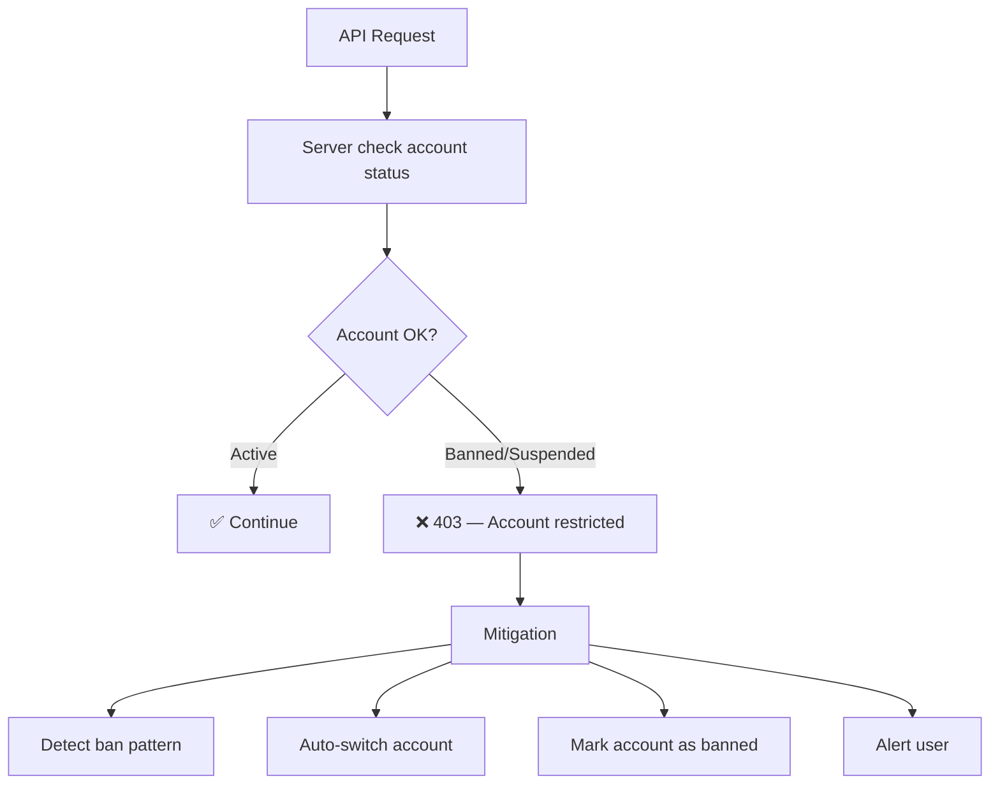
```mermaid
flowchart TD
    A["API Request"] --> B["Server check account status"]
    B --> C{Account OK?}
    C -->|"Active"| D["✅ Continue"]
    C -->|"Banned/Suspended"| E["❌ 403 — Account restricted"]
    
    E --> F["Mitigation"]
    F --> F1["Detect ban pattern"]
    F --> F2["Auto-switch account"]
    F --> F3["Mark account as banned"]
    F --> F4["Alert user"]
```

**Dấu hiệu:** 403 on mọi endpoint, kể cả status polling.

**Xử lý:** Detect pattern (403 liên tục >3 lần) → mark account → switch → alert user.

---

### #15 — Feature Flag/A-B Test

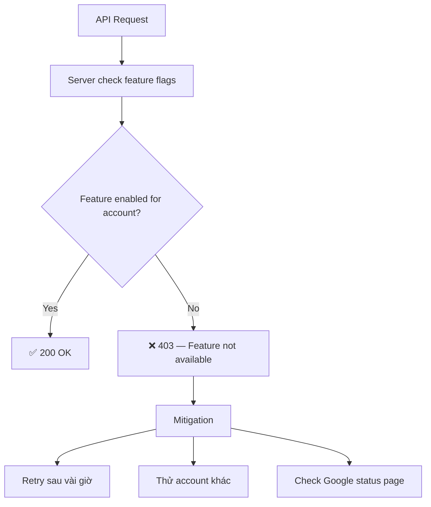
```mermaid
flowchart TD
    A["API Request"] --> B["Server check feature flags"]
    B --> C{Feature enabled for account?}
    C -->|"Yes"| D["✅ 200 OK"]
    C -->|"No"| E["❌ 403 — Feature not available"]
    
    E --> F["Mitigation"]
    F --> F1["Retry sau vài giờ"]
    F --> F2["Thử account khác"]
    F --> F3["Check Google status page"]
```

**Xử lý:** Ít kiểm soát được — chỉ retry hoặc switch account.

---

## Nhóm E: 🌍 Infrastructure

### #10 — Geo Blocking

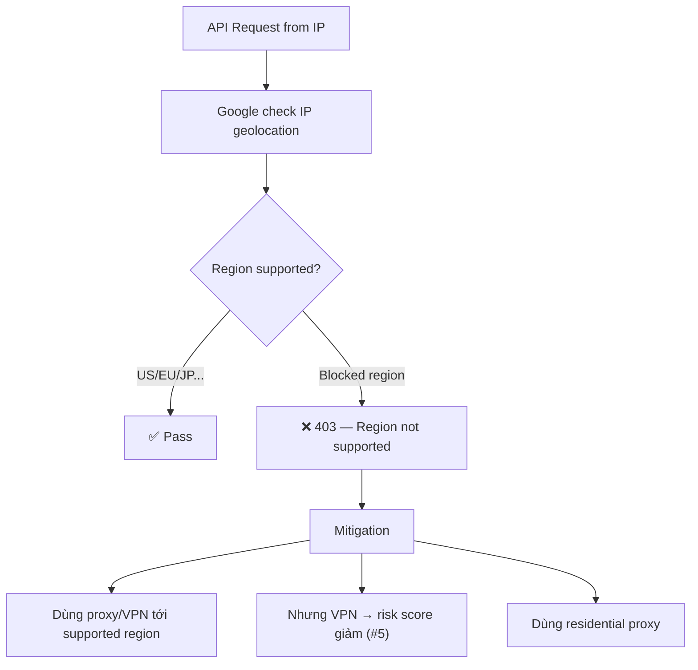
```mermaid
flowchart TD
    A["API Request from IP"] --> B["Google check IP geolocation"]
    B --> C{Region supported?}
    C -->|"US/EU/JP..."| D["✅ Pass"]
    C -->|"Blocked region"| E["❌ 403 — Region not supported"]
    
    E --> F["Mitigation"]
    F --> F1["Dùng proxy/VPN tới supported region"]
    F --> F2["Nhưng VPN → risk score giảm (#5)"]
    F --> F3["Dùng residential proxy"]
```

**Xử lý:** Residential proxy tới US/EU. Conflict với #5 (VPN giảm score) → cần residential proxy, không datacenter.

---

## Request Lifecycle — Full Decision Tree

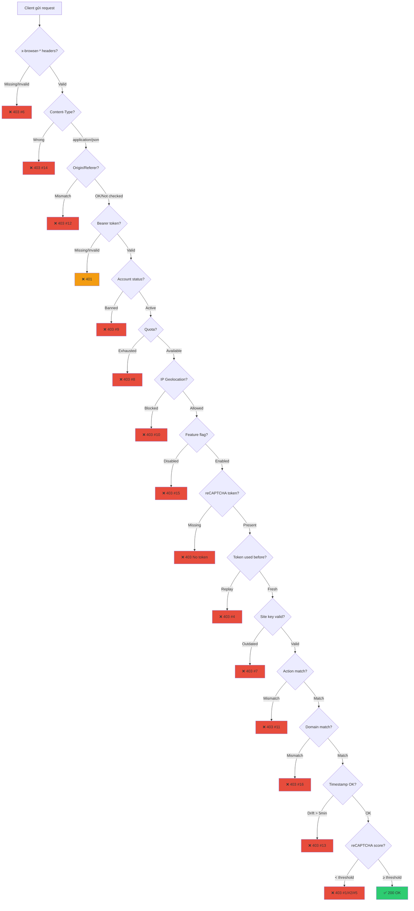
```mermaid
flowchart TD
    START["Client gửi request"] --> H1{"x-browser-* headers?"}
    H1 -->|"Missing/Invalid"| FAIL6["❌ 403 #6"]
    H1 -->|"Valid"| H2{"Content-Type?"}
    
    H2 -->|"Wrong"| FAIL14["❌ 403 #14"]
    H2 -->|"application/json"| H3{"Origin/Referer?"}
    
    H3 -->|"Mismatch"| FAIL12["❌ 403 #12"]
    H3 -->|"OK/Not checked"| A1{"Bearer token?"}
    
    A1 -->|"Missing/Invalid"| FAIL401["❌ 401"]
    A1 -->|"Valid"| A2{"Account status?"}
    
    A2 -->|"Banned"| FAIL9["❌ 403 #9"]
    A2 -->|"Active"| A3{"Quota?"}
    
    A3 -->|"Exhausted"| FAIL8["❌ 403 #8"]
    A3 -->|"Available"| GEO{"IP Geolocation?"}
    
    GEO -->|"Blocked"| FAIL10["❌ 403 #10"]
    GEO -->|"Allowed"| FF{"Feature flag?"}
    
    FF -->|"Disabled"| FAIL15["❌ 403 #15"]
    FF -->|"Enabled"| R1{"reCAPTCHA token?"}
    
    R1 -->|"Missing"| FAIL_NO["❌ 403 No token"]
    R1 -->|"Present"| R2{"Token used before?"}
    
    R2 -->|"Replay"| FAIL4["❌ 403 #4"]
    R2 -->|"Fresh"| R3{"Site key valid?"}
    
    R3 -->|"Outdated"| FAIL7["❌ 403 #7"]
    R3 -->|"Valid"| R4{"Action match?"}
    
    R4 -->|"Mismatch"| FAIL11["❌ 403 #11"]
    R4 -->|"Match"| R5{"Domain match?"}
    
    R5 -->|"Mismatch"| FAIL16["❌ 403 #16"]
    R5 -->|"Match"| R6{"Timestamp OK?"}
    
    R6 -->|"Drift > 5min"| FAIL13["❌ 403 #13"]
    R6 -->|"OK"| SCORE{"reCAPTCHA score?"}
    
    SCORE -->|"< threshold"| FAIL1["❌ 403 #1/#2/#5"]
    SCORE -->|"≥ threshold"| SUCCESS["✅ 200 OK"]
    
    style SUCCESS fill:#2ecc71
    style FAIL1 fill:#e74c3c
    style FAIL4 fill:#e74c3c
    style FAIL6 fill:#e74c3c
    style FAIL7 fill:#e74c3c
    style FAIL8 fill:#e74c3c
    style FAIL9 fill:#e74c3c
    style FAIL10 fill:#e74c3c
    style FAIL11 fill:#e74c3c
    style FAIL12 fill:#e74c3c
    style FAIL13 fill:#e74c3c
    style FAIL14 fill:#e74c3c
    style FAIL15 fill:#e74c3c
    style FAIL16 fill:#e74c3c
    style FAIL401 fill:#f39c12
    style FAIL_NO fill:#e74c3c
```

---

## Error Handling Strategy — Code Implementation

```python
class APIErrorHandler:
    """Centralized 403 handler with auto-diagnosis."""
    
    RETRY_CASES = {4, 7, 11, 13, 15}    # Can retry with fix
    SWITCH_CASES = {8, 9}                # Need different account
    FATAL_CASES = {10}                   # Infrastructure issue
    REFRESH_CASES = {1, 2, 5, 6, 16}    # Need new token/headers
    
    async def handle_403(self, response, context):
        """Diagnose and handle 403 error."""
        
        error_body = response.get("error", "")
        
        # 1. Quota check
        if "quota" in error_body.lower():
            return ErrorAction.SWITCH_ACCOUNT  # #8
        
        # 2. Account ban check
        if context.consecutive_403_count >= 3:
            return ErrorAction.MARK_BANNED     # #9
        
        # 3. Token freshness
        if context.token_age > 90:
            return ErrorAction.REFRESH_TOKEN   # #4 (expired)
        
        # 4. Token reuse
        if context.token_used_count > 0:
            return ErrorAction.NEW_TOKEN       # #4 (replay)
        
        # 5. Default: score too low
        return ErrorAction.RETRY_WITH_HEADED   # #1/#2/#5
```

---

## Tổng hợp — Ma trận rủi ro & Hành động

| # | Rủi ro | Xác suất | Impact | Phát hiện | Hành động |
|---|--------|----------|--------|-----------|-----------|
| 1 | Score thấp | 🔴 Cao | Cao | 403 + no detail | Headed mode + profile |
| 2 | Headless detect | 🔴 Cao | Cao | 403 + no detail | Headed mode |
| 3 | — | — | — | — | — |
| 4 | Token replay | 🟡 Trung bình | Cao | 403 sau request thứ 2 | Single-use token |
| 5 | IP reputation | 🟡 Trung bình | Cao | 403 + tất cả request fail | Residential IP |
| 6 | x-browser sai | 🟡 Trung bình | Cao | 403 + mọi endpoint | Re-extract headers |
| 7 | Site key rotate | 🟢 Thấp | Cao | grecaptcha.execute() fail | Auto-detect key |
| 8 | Quota hết | 🟡 Trung bình | Trung bình | 403 + quota msg | Switch account |
| 9 | Account ban | 🟢 Thấp | Cao | 403 mọi request liên tục | Switch + alert |
| 10 | Geo block | 🟢 Thấp | Cao | 403 mọi request | Residential proxy |
| 11 | Action mismatch | 🟢 Thấp | Trung bình | 403 trên endpoint cụ thể | Map action per endpoint |
| 12 | Origin mismatch | 🟡 Trung bình | Trung bình | 403 intermittent | Add Origin header |
| 13 | Timestamp drift | 🟢 Rất thấp | Thấp | 403 + clock issue | Sync NTP |
| 14 | Content-Type | 🟢 Rất thấp | Thấp | 403/415 | Already handled |
| 15 | Feature flag | 🟢 Thấp | Trung bình | 403 sporadically | Retry later |
| 16 | Domain mismatch | 🟢 Rất thấp | Thấp | 403 always | Navigate đúng page |

---

## TOP 5 Hành Động Ưu Tiên

1. **Headed mode as default** → Giải quyết #1, #2 (60% cases)
2. **Single-use token** → Giải quyết #4 (token replay)
3. **Add Origin/Referer headers** → Giải quyết #12
4. **Auto-detect site key (bỏ hardcode)** → Giải quyết #7
5. **Re-extract x-browser headers mỗi session** → Giải quyết #6

---

## Runtime Defense: 5-Layer Anti-Spam + Circuit Breaker `[CURRENT]`

Ngoài việc ngăn 403 từ gốc (16 rủi ro trên), hệ thống có **5 lớp bảo vệ runtime** chống retry flood khi 403 xảy ra:

| Lớp | Name | Mechanism | Scope |
|---|---|---|---|
| 1 | **Rate Lock** | `asyncio.Lock` — 1 THỢ gửi tại 1 thời điểm | Per-account |
| 2 | **Adaptive Delay** | `AdaptiveBurstController` — 2-8s giữa mỗi request | Per-account |
| 3 | **API Semaphore** | `Semaphore(2)` — max 2 concurrent API calls | Per-account |
| 4 | **Cooldown** | Exponential backoff 30→180s, Event-based multi-waiter | Per-account |
| 5 | **Circuit Breaker** | 3-state (CLOSED/OPEN/HALF-OPEN), background monitor 10s | Per-account |

**Circuit Breaker cầu dao:**
- 🟢 CLOSED: Bình thường
- 🔴 OPEN: Extension mất HOẶC 5+ 403 liên tiếp → tất cả THỢ ngủ
- 🟡 HALF-OPEN: Extension về → 1 THỢ probe → thành công → CLOSED

Tất cả 5 lớp dùng `account.email` làm key → áp dụng cho **nhóm THỢ cùng CHỦ**, không phải từng THỢ riêng lẻ.

> Chi tiết: Xem [ENGINE_PIPELINE_ARCHITECTURE.md](../02_Architecture/ENGINE_PIPELINE_ARCHITECTURE.md) §4.8 và §9.5.

---

## Cross-References

- [RECAPTCHA_BROWSER_MANAGEMENT.md](RECAPTCHA_BROWSER_MANAGEMENT.md) — reCAPTCHA flow & browser architecture
- [TOKEN_SECURITY.md](TOKEN_SECURITY.md) — Token lifecycle & security
- [ACCOUNT_SESSION_MANAGEMENT.md](ACCOUNT_SESSION_MANAGEMENT.md) — Multi-account management
- [ENGINE_PIPELINE_ARCHITECTURE.md](../02_Architecture/ENGINE_PIPELINE_ARCHITECTURE.md) — 5-Layer Defense & Circuit Breaker (§4.8, §9.5)
- [API_ENDPOINTS.md](../../Research/reference/API_ENDPOINTS.md) — Endpoint auth requirements
