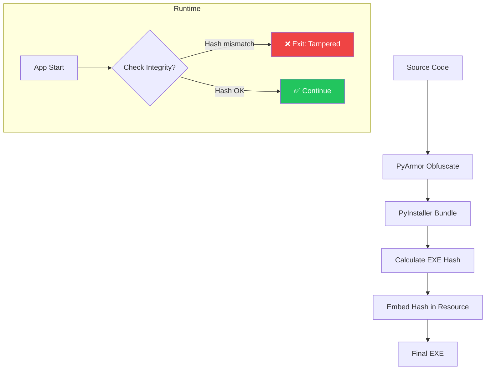

# 🔐 Build Pipeline: Binary Integrity + Obfuscation

> **Version**: 1.0  
> **Created**: 2026-02-02  
> **Purpose**: PyInstaller build với integrity check và PyArmor obfuscation

---

## 📋 Problem Statement

### Current Vulnerabilities:

| Vulnerability | Severity | Impact |
|---------------|----------|--------|
| SECRET_KEY hardcoded | 🔴 Critical | Attacker có thể extract và forge keys |
| No binary integrity | 🔴 Critical | Attacker có thể patch EXE |
| No obfuscation | 🟡 Medium | Easy to reverse engineer |

---

## ✅ Solution Architecture



---

## 📁 Build Scripts

### 1. `build.py` - Master Build Script

```python
#!/usr/bin/env python3
"""
VEO Pro Max Build Script
Handles: Obfuscation → Bundle → Integrity Hash
"""

import subprocess
import hashlib
import shutil
import os
import struct
from pathlib import Path

# Configuration
APP_NAME = "VEOProMax"
VERSION = "1.0.0"
MAIN_SCRIPT = "main.py"
OUTPUT_DIR = Path("dist")
BUILD_DIR = Path("build")

# Secret Management - USE ENVIRONMENT VARIABLE!
def get_secret_key() -> bytes:
    """Get secret key from environment, never hardcode!"""
    key = os.environ.get("VEO_LICENSE_SECRET")
    if not key:
        raise RuntimeError(
            "VEO_LICENSE_SECRET environment variable not set!\n"
            "Run: set VEO_LICENSE_SECRET=<your-64-char-hex>"
        )
    return bytes.fromhex(key)

def step1_obfuscate():
    """Step 1: Obfuscate with PyArmor"""
    print("=" * 60)
    print("Step 1: PyArmor Obfuscation")
    print("=" * 60)
    
    # Clean previous build
    if BUILD_DIR.exists():
        shutil.rmtree(BUILD_DIR)
    
    # Obfuscate with PyArmor
    cmd = [
        "pyarmor", "gen",
        "--output", str(BUILD_DIR / "obfuscated"),
        "--platform", "windows.x86_64",
        "--pack", "onefile",
        MAIN_SCRIPT
    ]
    
    subprocess.run(cmd, check=True)
    print("✅ Obfuscation complete")

def step2_bundle():
    """Step 2: Bundle with PyInstaller"""
    print("=" * 60)
    print("Step 2: PyInstaller Bundle")
    print("=" * 60)
    
    # PyInstaller spec
    cmd = [
        "pyinstaller",
        "--onefile",
        "--windowed",
        "--name", APP_NAME,
        "--icon", "assets/icon.ico",
        "--add-data", "assets;assets",
        "--hidden-import", "PySide6",
        str(BUILD_DIR / "obfuscated" / MAIN_SCRIPT)
    ]
    
    subprocess.run(cmd, check=True)
    print("✅ Bundle complete")

def step3_calculate_hash():
    """Step 3: Calculate EXE hash"""
    print("=" * 60)
    print("Step 3: Calculate Integrity Hash")
    print("=" * 60)
    
    exe_path = OUTPUT_DIR / f"{APP_NAME}.exe"
    
    with open(exe_path, "rb") as f:
        exe_content = f.read()
    
    # SHA256 of EXE
    exe_hash = hashlib.sha256(exe_content).hexdigest()
    
    print(f"EXE Size: {len(exe_content):,} bytes")
    print(f"EXE Hash: {exe_hash}")
    
    return exe_hash, exe_path

def step4_embed_hash(exe_hash: str, exe_path: Path):
    """Step 4: Embed hash into EXE resource or external file"""
    print("=" * 60)
    print("Step 4: Embed Integrity Hash")
    print("=" * 60)
    
    # Option 1: External encrypted file
    hash_file = OUTPUT_DIR / ".integrity"
    
    # Encrypt hash with build-time secret
    secret = get_secret_key()[:16]
    encrypted = bytes(h ^ secret[i % len(secret)] for i, h in enumerate(exe_hash.encode()))
    
    with open(hash_file, "wb") as f:
        f.write(encrypted)
    
    # Make hidden on Windows
    if os.name == 'nt':
        subprocess.run(["attrib", "+h", str(hash_file)], check=True)
    
    print(f"✅ Hash embedded: {hash_file}")
    
    # Option 2: Also write to registry during install (more secure)
    return hash_file

def build():
    """Run full build pipeline"""
    print("\n" + "=" * 60)
    print(f"VEO Pro Max Build v{VERSION}")
    print("=" * 60 + "\n")
    
    # Verify environment
    try:
        get_secret_key()
    except RuntimeError as e:
        print(f"❌ {e}")
        return
    
    step1_obfuscate()
    step2_bundle()
    exe_hash, exe_path = step3_calculate_hash()
    step4_embed_hash(exe_hash, exe_path)
    
    print("\n" + "=" * 60)
    print("✅ BUILD COMPLETE")
    print(f"Output: {exe_path}")
    print("=" * 60)

if __name__ == "__main__":
    build()
```

---

### 2. `integrity_check.py` - Runtime Verification

```python
"""
Runtime Integrity Check
Must be called at app startup BEFORE any license logic
"""

import hashlib
import sys
import os
from pathlib import Path

class IntegrityChecker:
    """Verify EXE has not been tampered with."""
    
    def __init__(self):
        self.exe_path = Path(sys.executable)
        self.integrity_file = self.exe_path.parent / ".integrity"
    
    def _get_secret(self) -> bytes:
        """Get decryption key (should match build.py)"""
        # SECURITY: Always require environment variable - no fallback!
        key = os.environ.get("VEO_LICENSE_SECRET", "")
        if not key:
            raise RuntimeError(
                "SECURITY ERROR: VEO_LICENSE_SECRET environment variable not set!\n"
                "This is required for integrity verification."
            )
        return bytes.fromhex(key)[:16]
    
    def _calculate_current_hash(self) -> str:
        """Calculate hash of current EXE"""
        # Skip if running as script (dev mode)
        if not self.exe_path.suffix.lower() == ".exe":
            return "DEV_MODE"
        
        with open(self.exe_path, "rb") as f:
            return hashlib.sha256(f.read()).hexdigest()
    
    def _load_expected_hash(self) -> str:
        """Load encrypted hash from integrity file"""
        if not self.integrity_file.exists():
            return ""
        
        with open(self.integrity_file, "rb") as f:
            encrypted = f.read()
        
        # Decrypt
        secret = self._get_secret()
        decrypted = bytes(e ^ secret[i % len(secret)] for i, e in enumerate(encrypted))
        
        return decrypted.decode('utf-8', errors='ignore')
    
    def verify(self) -> tuple[bool, str]:
        """
        Verify binary integrity.
        
        Returns:
            (is_valid: bool, message: str)
        """
        current = self._calculate_current_hash()
        
        # Dev mode skip
        if current == "DEV_MODE":
            return True, "Dev mode - integrity check skipped"
        
        expected = self._load_expected_hash()
        
        if not expected:
            # No integrity file - could be first run or tampered
            # In production: should FAIL here
            return False, "Integrity file missing"
        
        if current != expected:
            return False, "Binary has been modified!"
        
        return True, "Integrity verified"
    
    def verify_or_exit(self):
        """Verify and exit if tampered."""
        is_valid, message = self.verify()
        
        if not is_valid:
            # Log security event (optional: to Firebase)
            self._log_tampering_attempt()
            
            # Show error and exit
            print(f"❌ SECURITY ERROR: {message}")
            sys.exit(1)
    
    def _log_tampering_attempt(self):
        """Log tampering attempt to Firebase (optional)"""
        try:
            from firebase_admin import firestore
            db = firestore.client()
            db.collection("_security_log").add({
                "type": "TAMPERING_DETECTED",
                "exe_hash": self._calculate_current_hash()[:16] + "...",
                "timestamp": firestore.SERVER_TIMESTAMP
            })
        except Exception:
            pass  # Fail silently if no Firebase


# Usage in main.py:
# from integrity_check import IntegrityChecker
# IntegrityChecker().verify_or_exit()
```

---

### 3. `pyarmor.toml` - PyArmor Configuration

```toml
# PyArmor 8.x configuration

[pyarmor]
# License type
license = "trial"  # Change to "basic" or "pro" for production

[obfuscate]
# Obfuscation level
restrict_module = 1
bcc_mode = 1
rft_mode = 1

# Anti-debug
assert_armored = true
assert_call = true

# Platforms
platforms = ["windows.x86_64"]

[pack]
# PyInstaller integration
enable = true

[runtime]
# Prevent extraction
no_runtime_source = true

# Expiry (optional: for time-limited builds)
# expired_time = "2027-01-01"
```

---

### 4. `veo.spec` - PyInstaller Spec File

```python
# -*- mode: python ; coding: utf-8 -*-

block_cipher = None

a = Analysis(
    ['main.py'],
    pathex=[],
    binaries=[],
    datas=[
        ('assets', 'assets'),
        ('config', 'config'),
    ],
    hiddenimports=[
        'PySide6.QtCore',
        'PySide6.QtGui',
        'PySide6.QtWidgets',
        'playwright',
        'firebase_admin',
    ],
    hookspath=[],
    hooksconfig={},
    runtime_hooks=['integrity_check.py'],  # Run integrity check first!
    excludes=[],
    win_no_prefer_redirects=False,
    win_private_assemblies=False,
    cipher=block_cipher,
    noarchive=False,
)

pyz = PYZ(a.pure, a.zipped_data, cipher=block_cipher)

exe = EXE(
    pyz,
    a.scripts,
    a.binaries,
    a.zipfiles,
    a.datas,
    [],
    name='VEOProMax',
    debug=False,
    bootloader_ignore_signals=False,
    strip=False,
    upx=True,
    upx_exclude=[],
    runtime_tmpdir=None,
    console=False,
    disable_windowed_traceback=False,
    argv_emulation=False,
    target_arch=None,
    codesign_identity=None,
    entitlements_file=None,
    icon='assets/icon.ico',
    version='version_info.txt',
)
```

---

## 🔐 Secret Key Migration

### Current Problem:
```python
# license_keygen.py line 68
SECRET_KEY = b"veo_secret_2026!"  # ❌ HARDCODED - VULNERABLE!
```

### Solution: Environment Variable

**1. Generate secure key (once):**
```bash
python -c "import secrets; print(secrets.token_hex(32))"
# Output: 7f3d8a2b1c9e4f6a0d5b2c8e7f1a3d9b4c6e8f0a2b4d6c8e0f2a4b6d8c0e2f4a
```

**2. Set environment variable:**
```batch
:: Windows (permanent)
setx VEO_LICENSE_SECRET "7f3d8a2b1c9e4f6a0d5b2c8e7f1a3d9b4c6e8f0a2b4d6c8e0f2a4b6d8c0e2f4a"

:: Windows (session only)
set VEO_LICENSE_SECRET=7f3d8a2b1c9e4f6a0d5b2c8e7f1a3d9b4c6e8f0a2b4d6c8e0f2a4b6d8c0e2f4a
```

**3. Update license_keygen.py:**
```python
import os

def get_secret_key() -> bytes:
    """Get secret key from environment."""
    key = os.environ.get("VEO_LICENSE_SECRET")
    if not key:
        # Fallback for dev (will be obfuscated in production)
        return b"veo_secret_2026!"  # Still vulnerable in dev
    return bytes.fromhex(key)

# In ObfuscatedKeyGenerator class:
SECRET_KEY = get_secret_key()
```

---

## 📊 Key Predictability Analysis

### Current Algorithm Security:

| Attack Vector | Difficulty | Mitigation |
|---------------|------------|------------|
| **Brute force tier** | Easy (4 values) | ✅ Rate limiting in Firebase |
| **Brute force expiry** | Medium (~365 days) | ✅ Checksum requires SECRET_KEY |
| **Extract SECRET_KEY** | **Hard after obfuscation** | ✅ PyArmor + env var |
| **Forge checksum** | Impossible without key | ✅ HMAC/SHA256 |
| **Replay key** | N/A | ✅ Firebase one-time validation |

### Post-obfuscation Security:

```
Decompile difficulty:
  Without PyArmor: ⚠️ Easy (pycdc, uncompyle6)
  With PyArmor:    ✅ Very Hard (encrypted bytecode)

SECRET_KEY extraction:
  Without PyArmor: ⚠️ Search strings in EXE
  With PyArmor:    ✅ Key obfuscated in runtime
  With env var:    ✅ Key not in binary at all
```

---

## 📋 Implementation Checklist

- [ ] Generate 64-char hex secret key
- [ ] Set `VEO_LICENSE_SECRET` environment variable
- [ ] Update `license_keygen.py` to use env var
- [ ] Install PyArmor: `pip install pyarmor`
- [ ] Create `build.py`
- [ ] Create `integrity_check.py`
- [ ] Create `veo.spec`
- [ ] Run: `python build.py`
- [ ] Test tampered detection
- [ ] Deploy to users

---

## 🔗 Related Files

| File | Purpose |
|------|---------|
| `build.py` | Master build script |
| `integrity_check.py` | Runtime verification |
| `veo.spec` | PyInstaller configuration |
| `pyarmor.toml` | PyArmor configuration |
