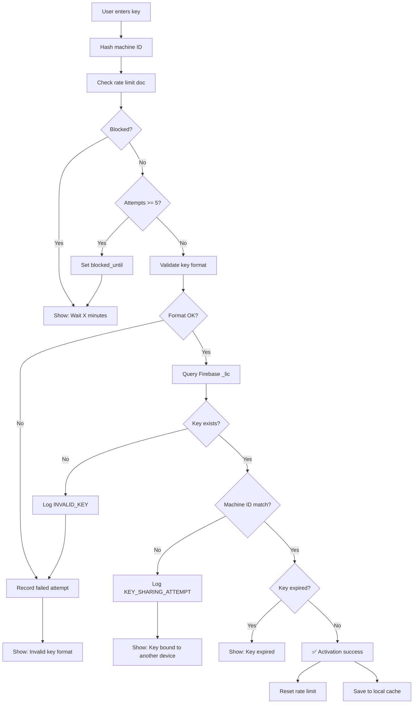

# 🔥 Firebase Security Rules - VEO Pro Max License System

> **Version**: 1.0  
> **Created**: 2026-02-02  
> **Purpose**: Anti-bruteforce, rate limiting, và secure license validation

---

## 📋 Collection Structure

```
/VEO_Licenses/
├── _lic/                    # License keys
│   └── {KEY_ID}/
│       ├── _t: "PROF"       # Tier
│       ├── _st: "a"         # Status: a=active, r=revoked, e=expired
│       ├── _exp: "2027-01-21"
│       ├── _mid: "hash..."  # Machine ID (full SHA256)
│       ├── _cr: timestamp
│       └── _em: "email"
│
├── _rate_limit/             # Rate limiting tracking
│   └── {IP_HASH}/
│       ├── attempts: 0
│       ├── last_attempt: timestamp
│       └── blocked_until: null
│
├── _security_log/           # Security events
│   └── {auto_id}/
│       ├── type: "KEY_SHARING_ATTEMPT"
│       ├── key: "F208-72DF-9B1D-..."
│       ├── ip_hash: "..."
│       └── timestamp: ...
│
└── _devices/                # Device tracking per key
    └── {KEY_ID}/
        └── devices: [
            { mid: "hash...", first_seen: timestamp, last_seen: timestamp }
        ]
```

---

## 🔐 Firestore Security Rules

```javascript
rules_version = '2';
service cloud.firestore {
  match /databases/{database}/documents {
    
    // ============================================
    // HELPER FUNCTIONS
    // ============================================
    
    // Check if request is from valid app (can add app check token later)
    function isValidApp() {
      return request.auth != null || true; // Allow anonymous for now
    }
    
    // Rate limit check: max 5 attempts per IP per 15 minutes
    function isNotRateLimited(ipHash) {
      let rateDoc = get(/databases/$(database)/documents/_rate_limit/$(ipHash));
      let now = request.time;
      
      // No rate limit doc = first attempt, allow
      return !exists(/databases/$(database)/documents/_rate_limit/$(ipHash)) ||
             rateDoc.data.blocked_until == null ||
             now > rateDoc.data.blocked_until ||
             rateDoc.data.attempts < 5;
    }
    
    // Validate key format: XXXX-XXXX-XXXX-XXXX-XXXX-XXXX-XXXX-XXXX (8 segments of 4 hex chars)
    function isValidKeyFormat(key) {
      return key.matches('^[A-F0-9]{4}(-[A-F0-9]{4}){7}$');
    }
    
    // ============================================
    // LICENSE COLLECTION (_lic)
    // ============================================
    match /_lic/{keyId} {
      // READ: Only allow if key format is valid (prevents enumeration)
      allow read: if isValidApp() 
                  && isValidKeyFormat(keyId);
      
      // WRITE: Only from Firebase Admin SDK (server-side)
      allow write: if false; // Admin SDK bypasses rules
      
      // No delete allowed
      allow delete: if false;
    }
    
    // ============================================
    // RATE LIMIT COLLECTION (_rate_limit)
    // ============================================
    match /_rate_limit/{ipHash} {
      // App can read its own rate limit status
      allow read: if isValidApp();
      
      // App can update attempt count (incrementally)
      allow update: if isValidApp()
                    && request.resource.data.attempts <= resource.data.attempts + 1
                    && request.resource.data.attempts <= 10; // Hard cap
      
      // Create new rate limit doc
      allow create: if isValidApp()
                    && request.resource.data.attempts == 1;
      
      // No delete - only Admin cleanup
      allow delete: if false;
    }
    
    // ============================================
    // SECURITY LOG COLLECTION (_security_log)
    // ============================================
    match /_security_log/{logId} {
      // Write-only from app (no read to prevent info leak)
      allow read: if false;
      
      // App can create security logs
      allow create: if isValidApp()
                    && request.resource.data.keys().hasAll(['type', 'timestamp'])
                    && request.resource.data.type in [
                        'KEY_SHARING_ATTEMPT',
                        'INVALID_KEY',
                        'BRUTEFORCE_BLOCKED',
                        'ACTIVATION_SUCCESS',
                        'ACTIVATION_FAILED'
                    ];
      
      // No update/delete
      allow update, delete: if false;
    }
    
    // ============================================
    // DEVICE TRACKING (_devices)
    // ============================================
    match /_devices/{keyId} {
      // Read own device list
      allow read: if isValidApp();
      
      // Update device list (add new device, update last_seen)
      allow update: if isValidApp()
                    && request.resource.data.devices.size() <= 3; // Max 3 devices
      
      // Create new device doc
      allow create: if isValidApp()
                    && request.resource.data.devices.size() == 1;
      
      // No delete
      allow delete: if false;
    }
    
    // ============================================
    // BLOCK ALL OTHER COLLECTIONS
    // ============================================
    match /{document=**} {
      allow read, write: if false;
    }
  }
}
```

---

## ⚡ Rate Limiting Implementation

### Client-Side (Python)

```python
import hashlib
from firebase_admin import firestore
from datetime import datetime, timedelta

class RateLimiter:
    """Firebase-based rate limiting for license validation."""
    
    MAX_ATTEMPTS = 5
    BLOCK_DURATION_MINUTES = 15
    
    def __init__(self, db: firestore.Client):
        self.db = db
        self.rate_limit_ref = db.collection("_rate_limit")
    
    def _get_ip_hash(self) -> str:
        """Get hashed identifier (IP or machine ID)."""
        # Use machine ID as identifier since we don't have IP
        machine_id = self._get_machine_id()
        return hashlib.sha256(machine_id.encode()).hexdigest()[:16]
    
    def check_rate_limit(self) -> tuple[bool, int]:
        """
        Check if current device is rate limited.
        
        Returns:
            (is_allowed: bool, wait_seconds: int)
        """
        ip_hash = self._get_ip_hash()
        doc_ref = self.rate_limit_ref.document(ip_hash)
        doc = doc_ref.get()
        
        if not doc.exists:
            return True, 0
        
        data = doc.to_dict()
        now = datetime.now()
        
        # Check if blocked
        blocked_until = data.get("blocked_until")
        if blocked_until:
            blocked_dt = blocked_until  # Firestore timestamp
            if now < blocked_dt:
                wait_seconds = int((blocked_dt - now).total_seconds())
                return False, wait_seconds
        
        # Check attempt count
        if data.get("attempts", 0) >= self.MAX_ATTEMPTS:
            # Block user
            block_until = now + timedelta(minutes=self.BLOCK_DURATION_MINUTES)
            doc_ref.update({
                "blocked_until": block_until,
                "attempts": 0  # Reset after block
            })
            return False, self.BLOCK_DURATION_MINUTES * 60
        
        return True, 0
    
    def record_attempt(self, success: bool):
        """Record a validation attempt."""
        ip_hash = self._get_ip_hash()
        doc_ref = self.rate_limit_ref.document(ip_hash)
        
        if success:
            # Reset on success
            doc_ref.set({
                "attempts": 0,
                "last_attempt": firestore.SERVER_TIMESTAMP,
                "blocked_until": None
            })
        else:
            # Increment failed attempts
            doc_ref.set({
                "attempts": firestore.Increment(1),
                "last_attempt": firestore.SERVER_TIMESTAMP
            }, merge=True)
```

---

## 🛡️ Anti-Bruteforce Flow



---

## 📊 Security Log Types

| Type | Trigger | Severity | Action |
|------|---------|----------|--------|
| `ACTIVATION_SUCCESS` | Key validated OK | Info | None |
| `ACTIVATION_FAILED` | Key invalid/expired | Warning | Log |
| `INVALID_KEY` | Key format wrong | Warning | Increment attempts |
| `KEY_SHARING_ATTEMPT` | MID mismatch | Critical | Log + Block key? |
| `BRUTEFORCE_BLOCKED` | 5+ failed attempts | Critical | Auto-block 15min |

---

## 🔧 Admin SDK Operations (Server-side only)

```python
# These operations bypass security rules (Admin SDK)

# Create new license
def create_license(key: str, machine_id: str, tier: str, days: int, email: str):
    db.collection("_lic").document(key).set({
        "_t": tier,
        "_st": "a",
        "_exp": (datetime.now() + timedelta(days=days)).strftime("%Y-%m-%d"),
        "_mid": hashlib.sha256(machine_id.encode()).hexdigest(),
        "_cr": firestore.SERVER_TIMESTAMP,
        "_em": email
    })

# Revoke license
def revoke_license(key: str, reason: str):
    db.collection("_lic").document(key).update({
        "_st": "r",
        "_revoked_at": firestore.SERVER_TIMESTAMP,
        "_revoked_reason": reason
    })

# Extend license
def extend_license(key: str, additional_days: int):
    doc = db.collection("_lic").document(key).get()
    current_exp = datetime.strptime(doc.to_dict()["_exp"], "%Y-%m-%d")
    new_exp = current_exp + timedelta(days=additional_days)
    
    db.collection("_lic").document(key).update({
        "_exp": new_exp.strftime("%Y-%m-%d")
    })
```

---

## ⚙️ Deployment Steps

1. **Go to Firebase Console** → Firestore → Rules
2. **Replace existing rules** với rules ở trên
3. **Publish** rules
4. **Create collections** (sẽ tự tạo khi có document đầu tiên):
   - `_lic`
   - `_rate_limit`
   - `_security_log`
   - `_devices`

> [!IMPORTANT]
> **Làm cho CẢ HAI projects:**
> - [ ] `veo-pro-max`
> - [ ] `veoauto-f54b5`

---

## 🔗 Related Files

| File | Purpose |
|------|---------|
| `license_admin.py` | Admin CLI (uses Admin SDK) |
| `license_client.py` | Client validation (uses rules) |
| `license_keygen.py` | Key generation logic |
