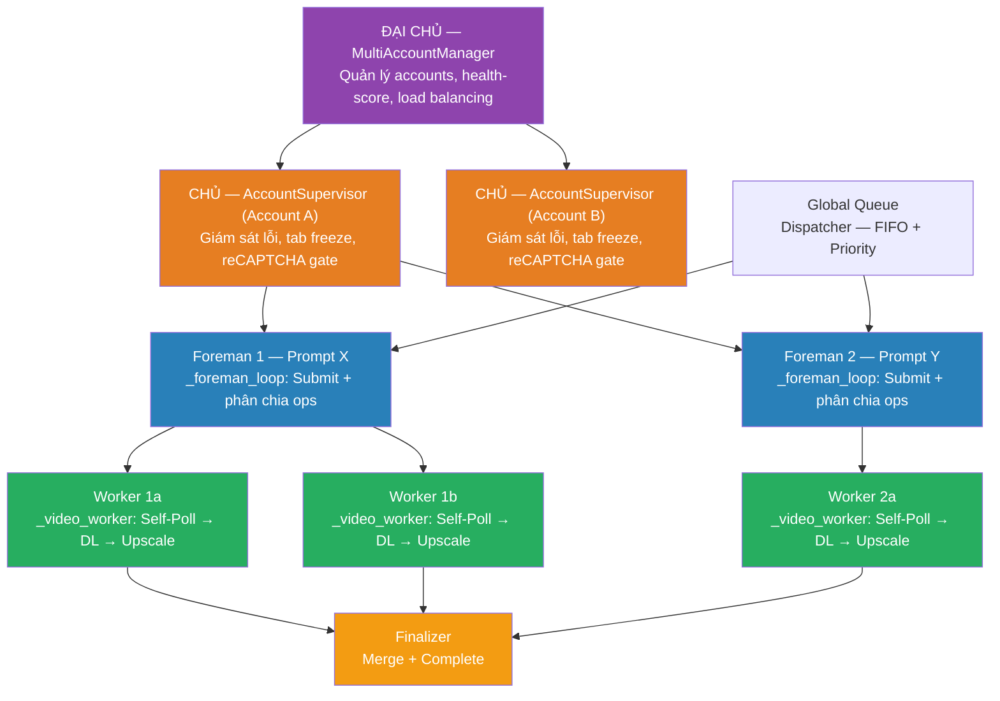
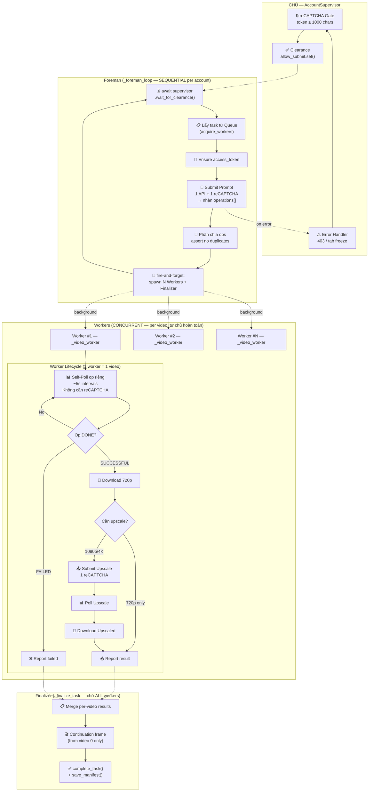

# Pipeline Architecture — HAR-Based API Flow Reference

> **Source:** HAR analysis of `F12 Dev/New/Test.har` (video T2V→poll→upscale) + `F12 Dev/New/image flow.har` (T2I/I2I→upscale)  
> **Date:** 2026-02-25 (revised — 4-layer architecture)  
> **Code reference:** `engine.py` (`_spawn_account_supervisor`, `_foreman_loop`, `_foreman_dispatch_workers`, `_video_worker`, `_finalize_task`)

---

## 1. Tổng Quan Kiến Trúc: 4 Tầng ĐẠI CHỦ → CHỦ → FOREMAN → WORKER

> **Nguyên tắc:** 4 tầng phân cấp rõ ràng. Foreman submit tuần tự per account (anti-detect). Sau submit, Foreman phân chia ops cho N Workers — **mỗi Worker tự poll op riêng** → download → upscale → report. CHỦ giám sát lỗi, tab freeze, reCAPTCHA gate. ĐẠI CHỦ quản lý pool accounts.



### Phân Cấp Vai Trò Trong Code

| Tầng | Role | Module / Function | Trách nhiệm |
|------|------|-------------------|-------------|
| **ĐẠI CHỦ** | `MultiAccountManager` | `Engine.start()` → `_spawn_account_supervisor()` | Quản lý pool accounts, health-score, hot-add/remove |
| **CHỦ** | `AccountSupervisor` | `_supervisor_run()` | Giám sát lỗi, tab freeze, **reCAPTCHA gate** (token≥1000), circuit breaker, cooldown |
| **FOREMAN** | Foreman coroutine | `_foreman_loop()` → `_foreman_dispatch_workers()` | Submit prompt tuần tự → nhận ops → phân chia cho Workers |
| **WORKER** | Video worker coroutine | `_video_worker()` | **1 Worker = 1 video: tự poll op riêng** → download 720p → upscale → report |
| **FINALIZER** | Task finalizer | `_finalize_task()` | Chờ tất cả workers → merge results → continuation frame → complete task |
| **UpscaleQueue** | Background upscale | `UpscaleQueue` | Background upscale khi `prompts_first` mode |

> ⚠️ **Foreman submit tuần tự** per account → chống spam (anti-detect). Workers chạy concurrent per-video. Capacity gated bởi `acquire_workers()` (max 20/account).

> ⚠️ **Worker tự chủ hoàn toàn.** Mỗi worker sở hữu toàn bộ lifecycle của 1 video: **tự poll op riêng** (per-worker poll, không dùng coordinator) → download 720p → upscale → download upscaled → report result. Khi TẤT CẢ workers xong → Finalizer merge + complete.

---

## 2. Bảng Công Việc Chi Tiết — Từng Giai Đoạn (VIDEO)

> **Foreman** submit prompt → giao ops → **Workers** (per video): tự poll → Download → Upscale → Report → **Finalizer** merge + complete

| # | Giai đoạn | Ai làm? | API Endpoint | reCAPTCHA? | Auth? | Mô tả |
|---|-----------|---------|-------------|:---:|:---:|---|
| **1** | **Submit Prompt** | **Foreman** | `/v1/video:batchAsyncGenerateVideoText` | ✅ 1 token | ✅ | Tuần tự per account |
| **2** | **Poll Status** | **Worker** (per video) | `/v1/video:batchCheckAsyncVideoGenerationStatus` | ❌ | ✅ | Mỗi worker tự poll op riêng, ~5s/lần |
| **3** | **Download 720p** | **Worker** (per video) | `storage.googleapis.com/{signed-url}` | ❌ | ❌ | Worker tự download video mình |
| **4a** | **Submit Upscale** | **Worker/UpscaleQueue** | `/v1/video:batchAsyncGenerateVideoUpsampleVideo` | ✅ 1 token/video | ✅ | Worker tự submit upscale cho video mình |
| **4b** | **Poll Upscale** | **Worker/UpscaleQueue** | `/v1/video:batchCheckAsyncVideoGenerationStatus` | ❌ | ✅ | Worker poll upscale op riêng |
| **4c** | **Download Upscaled** | **Worker/UpscaleQueue** | `storage.googleapis.com/{signed-url}` | ❌ | ❌ | Video 1080p/4K |
| **5** | **Finalize** | **Finalizer** | — | ❌ | ❌ | Merge results + continuation frame + complete |

### Bảng Công Việc — IMAGE

| # | Giai đoạn | API Endpoint | Method | reCAPTCHA? | Sync? | Mô tả |
|---|-----------|-------------|--------|:---:|:---:|---|
| I1 | **Upload Image** | `/v1:uploadUserImage` | POST | ❌ | ✅ | rawImageBytes (base64) → mediaId |
| I2 | **Generate Image** | `/v1/projects/{id}/flowMedia:batchGenerateImages` | POST | ✅ | ✅ | Sync — response trả về ảnh ngay |
| I3 | **Upscale Image** | `/v1/flow/upsampleImage` | POST | ✅ | ✅ | Sync — response trả về ảnh upscaled |

---

## 3. API Specification Chi Tiết

### 3.1 Submit Video (T2V)

**Endpoint:** `POST https://aisandbox-pa.googleapis.com/v1/video:batchAsyncGenerateVideoText`
**Content-Type:** `text/plain;charset=UTF-8`

**Request:**
```json
{
  "clientContext": {
    "recaptchaContext": {
      "token": "<~2300 chars>",
      "applicationType": "RECAPTCHA_APPLICATION_TYPE_WEB"
    },
    "sessionId": ";1771707811568",
    "tool": "PINHOLE",
    "userPaygateTier": "PAYGATE_TIER_TWO"
  },
  "requests": [
    {
      "aspectRatio": "VIDEO_ASPECT_RATIO_PORTRAIT",
      "seed": 23713,
      "textInput": { "prompt": "..." },
      "videoModelKey": "veo_3_1_t2v_fast_portrait_ultra_relaxed",
      "metadata": { "sceneId": "4ff13983-0f53-4d26-..." }
    }
  ]
}
```

**Response (200):**
```json
{
  "operations": [
    {
      "operation": { "name": "0b39552cc49d..." },
      "sceneId": "4ff13983-...",
      "status": "MEDIA_GENERATION_STATUS_PENDING"
    }
  ],
  "remainingCredits": 24910,
  "media": [
    { "name": "59f23780-8e8e-...", "sceneId": "..." }
  ]
}
```

> **4 request items → 4 operations + 4 media entries.** Mỗi item cần có `sceneId` riêng.

---

### 3.2 Poll Status (Batch)

**Endpoint:** `POST https://aisandbox-pa.googleapis.com/v1/video:batchCheckAsyncVideoGenerationStatus`
**Content-Type:** `text/plain;charset=UTF-8`

**⚠️ Không cần `clientContext` hay `recaptchaContext`.**

**Request:**
```json
{
  "operations": [
    {
      "operation": { "name": "0b39552cc49d..." },
      "sceneId": "4ff13983-...",
      "status": "MEDIA_GENERATION_STATUS_ACTIVE"
    }
  ]
}
```

**Response khi SUCCESSFUL:**
```json
{
  "operations": [{
    "operation": {
      "name": "0b39552cc49d...",
      "metadata": {
        "video": {
          "seed": 0,
          "mediaGenerationId": "<175 chars>",
          "fifeUrl": "https://storage.googleapis.com/ai-sandbox-videofx/video/...",
          "model": "veo_3_1_t2v_fast_portrait_ultra_relaxed",
          "aspectRatio": "VIDEO_ASPECT_RATIO_PORTRAIT"
        }
      }
    },
    "sceneId": "4ff13983-...",
    "mediaGenerationId": "<175 chars>",
    "status": "MEDIA_GENERATION_STATUS_SUCCESSFUL"
  }],
  "remainingCredits": 24910
}
```

**HAR Timeline (Test.har — 4 videos):**

| Time | Elapsed | Ops in batch | Kết quả |
|------|---------|:---:|---|
| 21:03:31 | 0s | — | **SUBMIT: 4 ops PENDING** |
| 21:03:48 | 17s | 4 | All ACTIVE |
| 21:04:34 | **63s** | 4→3 | **Op 1 SUCCESSFUL** ✅ |
| 21:04:57 | **86s** | 3→2 | **Op 2 SUCCESSFUL** ✅ |
| 21:05:38 | **127s** | 2→0 | **Op 3+4 SUCCESSFUL** ✅ |

> Website **loại bỏ ops SUCCESSFUL khỏi batch poll** tiếp theo. Poll interval: **~5s** (4-9s thực tế).

---

### 3.3 Download 720p

```
GET https://storage.googleapis.com/ai-sandbox-videofx/video/{uuid}
    ?GoogleAccessId=labs-ai-sandbox@...
    &Expires=...
    &Signature=...
```

- Signed URL từ `fifeUrl` trong poll response
- **Không cần Authorization header**
- Response: binary video data (~8-10MB)

---

### 3.4 Submit Upscale (Per Video)

**Endpoint:** `POST https://aisandbox-pa.googleapis.com/v1/video:batchAsyncGenerateVideoUpsampleVideo`

> **clientContext KHÁC submit — KHÔNG CÓ `tool`, `projectId`, `userPaygateTier`**

```json
{
  "requests": [{
    "aspectRatio": "VIDEO_ASPECT_RATIO_PORTRAIT",
    "resolution": "VIDEO_RESOLUTION_1080P",
    "seed": 9717,
    "videoInput": { "mediaId": "<162 chars>" },
    "videoModelKey": "veo_3_1_upsampler_1080p",
    "metadata": { "sceneId": "e7449a2f-..." }
  }],
  "clientContext": {
    "recaptchaContext": {
      "token": "<~2400 chars>",
      "applicationType": "RECAPTCHA_APPLICATION_TYPE_WEB"
    },
    "sessionId": ";1771707811568"
  }
}
```

**Response → PENDING, sau đó poll tương tự generate.**

**HAR upscale timeline:**

| Time | Status | Ghi chú |
|------|:---:|---|
| 21:06:30 | ❌ 403 | reCAPTCHA evaluation failed |
| 21:07:12 | ❌ 403 | Failed again (42s gap) |
| 21:07:45 | ✅ 200 | PENDING (33s gap) |
| 21:08:29 | ✅ | SUCCESSFUL (44s processing) |

---

### 3.5 Image Upload

**Endpoint:** `POST https://aisandbox-pa.googleapis.com/v1:uploadUserImage`

```json
{
  "imageInput": {
    "rawImageBytes": "<base64>",
    "mimeType": "image/jpeg",
    "isUserUploaded": true,
    "aspectRatio": "IMAGE_ASPECT_RATIO_LANDSCAPE"
  },
  "clientContext": {
    "sessionId": ";1771505961152",
    "tool": "ASSET_MANAGER"
  }
}
```

**Response:** `{ "mediaGenerationId": { "mediaGenerationId": "<111 chars>" }, "width": 910, "height": 511 }`

> **Không cần reCAPTCHA, không cần projectId.**

---

### 3.6 Image Upscale (Sync)

**Endpoint:** `POST https://aisandbox-pa.googleapis.com/v1/flow/upsampleImage`

```json
{
  "mediaId": "<162 chars>",
  "targetResolution": "UPSAMPLE_IMAGE_RESOLUTION_2K",
  "clientContext": {
    "recaptchaContext": { "token": "...", "applicationType": "..." },
    "sessionId": "...",
    "projectId": "...",
    "tool": "PINHOLE"
  }
}
```

> Image upscale **SYNC** — response trả về ảnh ngay (3.6MB/2K, 11.3MB/4K).

---

## 4. Sơ Đồ Quy Trình: CHỦ → Foreman → Workers (Per-Video Poll) → Finalizer



---

## 5. Token Cost — reCAPTCHA Per Stage

| Stage | reCAPTCHA tokens | Ghi chú |
|-------|:---:|---|
| **Submit prompt** (1-4 videos) | **1** | 1 call bất kể output_count |
| **Poll status** | **0** | Không cần reCAPTCHA |
| **Download 720p** | **0** | Signed URL, no auth |
| **Upscale submit** | **N** (1/video) | ⚠️ Tốn nhất! |
| **Poll upscale** | **0** | Không cần reCAPTCHA |
| **Download upscaled** | **0** | Signed URL |

**Example: 1 prompt × output_count=4 × 1080p upscale = 5 tokens total**

---

## 6. So sánh `prompts_first` vs `upscale_first` (Worker lifecycle)

> Worker owns toàn bộ lifecycle. Chế độ này quyết định Worker xử lý upscale **inline** hay **delegate** cho UpscaleQueue.

| Tiêu chí | prompts_first ✅ | upscale_first |
|----------|:---:|:---:|
| Worker lifecycle | Download 720p → delegate upscale → **report done** | Download 720p → **inline upscale** → report |
| Foreman throughput | ✅ Cao (worker slots freed sớm) | ❌ Thấp (worker giữ slots 3-5min) |
| Thời gian có 720p | ✅ Nhanh | ❌ Phải đợi upscale |
| reCAPTCHA pressure | ✅ Phân tán | ❌ Burst |
| Upscale delay | ❌ Chờ UpscaleQueue | ✅ Ngay lập tức |

---

## 7. clientContext So Sánh Theo Endpoint

> **QUAN TRỌNG:** Mỗi endpoint yêu cầu `clientContext` **KHÁC NHAU**.

| Endpoint | recaptchaContext | sessionId | tool | projectId | userPaygateTier |
|----------|:---:|:---:|:---:|:---:|:---:|
| `batchAsyncGenerateVideoText` | ✅ | ✅ | ✅ `PINHOLE` | ✅ | ✅ `PAYGATE_TIER_TWO` |
| `batchCheckAsyncVideoGenerationStatus` | ❌ | ❌ | ❌ | ❌ | ❌ |
| `batchAsyncGenerateVideoUpsampleVideo` | ✅ | ✅ | ❌ | ❌ | ❌ |
| `uploadUserImage` | ❌ | ✅ | ✅ `ASSET_MANAGER` | ❌ | ❌ |
| `batchGenerateImages` | ✅ | ✅ | ✅ `PINHOLE` | ✅ | ❌ |
| `upsampleImage` | ✅ | ✅ | ✅ `PINHOLE` | ✅ | ❌ |

---

## 8. Seed Ranges (HAR Observed)

| Type | Seeds từ HAR | Range |
|------|---|---|
| **Video** | 23713, 14781, 23516, 16504, 20795, 9717 | **5K–25K** |
| **Image** | 212712, 906787, 997886, 470318, 145183, 566930, 719476, 359188 | **100K–1M** |

---

## 9. Polling Behavior

- **Per-worker poll:** Mỗi worker tự poll op riêng (1 op per API call)
- **Poll interval:** ~5s + jitter (website uses 4-9s observed)
- **No reCAPTCHA needed** for poll — không tốn token/credits
- **API semaphore:** Max 2 concurrent API calls per account → workers tự serialize
- **Status flow:** PENDING → ACTIVE → SUCCESSFUL
- **Video generation time:** ~60-130s per video (720p)
- **Video upscale time:** ~40-50s per video (1080p)

> ⚠️ **Trade-off:** Per-worker poll = N API calls/cycle thay vì 1 batch call. Chấp nhận vì poll KHÔNG tốn reCAPTCHA/credits, và workers tự chủ → lỗi cách ly (1 fail ≠ ảnh hưởng N-1).

---

## 10. Checkpoint Resume Strategy

| Checkpoint Stage | Ai resume? | Hành vì |
|-----------------|-----------|--------|
| `SUBMITTED` | Foreman re-dispatch | Spawn workers với `task.operation_names` đã lưu |
| `GENERATED` | Workers (skip poll) | Worker nhận fifeUrl từ saved data → download trực tiếp |
| `DOWNLOADED_720` | Workers (skip poll+DL) | Worker chỉ upscale → report |
| `UPSCALING` | UpscaleQueue | Re-enqueue to background UpscaleQueue |
| `COMPLETED` | Skip | Không cần resume |
