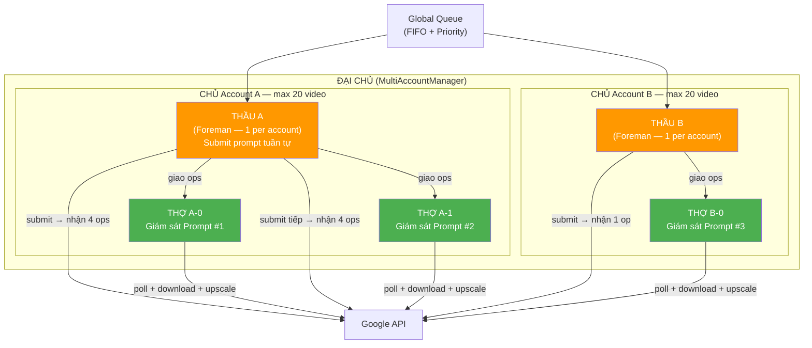
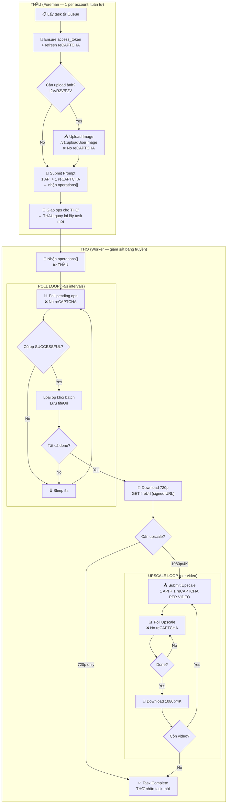

# Pipeline & Worker Architecture — HAR-Based API Flow Reference

> **Source:** HAR analysis of `F12 Dev/New/Test.har` (video T2V→poll→upscale) + `F12 Dev/New/image flow.har` (T2I/I2I→upscale)  
> **Date:** 2026-02-23 (revised)  
> **Phân tích code:** `engine.py`, `worker.py`, `dispatcher.py`, `api_client.py`

---

## 1. Tổng Quan Kiến Trúc: THẦU Submit → THỢ Giám Sát Băng Truyền

> **Nguyên tắc:** THẦU (Foreman) submit tuần tự per account → THỢ giám sát dây chuyền sản xuất của prompt đó (poll → download → upscale → download upscaled)



### Vai trò trong mô hình công ty

| Vai trò | Module | Trách nhiệm |
|---------|--------|-------------|
| **ĐẠI CHỦ** | `MultiAccountManager` | Quản lý tất cả account |
| **CHỦ** | `AccountManager` | Quản lý 1 account (token, browser, extension) |
| **THẦU** | Foreman coroutine (Engine) | **Submit prompt tuần tự** → giao operations cho THỢ |
| **THỢ** | `Worker` | **Giám sát băng truyền:** poll → download 720p → upscale → download upscaled |

> ⚠️ **THẦU submit tuần tự** → chống spam (max 20 video/account). THỢ **KHÔNG submit prompt** — chỉ monitor + harvest.

---

## 2. Bảng Công Việc Chi Tiết — Từng Giai Đoạn (VIDEO)

> **THẦU** submit prompt → **THỢ** giám sát toàn bộ harvest: Poll → Download → Upscale → Download Upscaled

| # | Giai đoạn | Ai làm? | API Endpoint | reCAPTCHA? | Auth? | Mô tả |
|---|-----------|---------|-------------|:---:|:---:|---|
| **1** | **Submit Prompt** | **THẦU** | `/v1/video:batchAsyncGenerateVideoText` | ✅ 1 token | ✅ | Tuần tự per account |
| **2** | **Poll Status** | **THỢ** | `/v1/video:batchCheckAsyncVideoGenerationStatus` | ❌ | ✅ | Batch pending ops, ~5s/lần |
| **3** | **Download 720p** | **THỢ** | `storage.googleapis.com/{signed-url}` | ❌ | ❌ | Signed URL từ `fifeUrl` |
| **4a** | **Submit Upscale** | **THỢ** | `/v1/video:batchAsyncGenerateVideoUpsampleVideo` | ✅ 1 token/video | ✅ | PER VIDEO — 1 API call riêng |
| **4b** | **Poll Upscale** | **THỢ** | `/v1/video:batchCheckAsyncVideoGenerationStatus` | ❌ | ✅ | Giống poll generate |
| **4c** | **Download Upscaled** | **THỢ** | `storage.googleapis.com/{signed-url}` | ❌ | ❌ | Video 1080p/4K |

### Bảng Công Việc — IMAGE

| # | Giai đoạn | API Endpoint | Method | reCAPTCHA? | Sync? | Mô tả |
|---|-----------|-------------|--------|:---:|:---:|---|
| I1 | **Upload Image** | `/v1:uploadUserImage` | POST | ❌ | ✅ | rawImageBytes (base64) → mediaId |
| I2 | **Generate Image** | `/v1/projects/{id}/flowMedia:batchGenerateImages` | POST | ✅ | ✅ | Sync — response trả về ảnh ngay |
| I3 | **Upscale Image** | `/v1/flow/upsampleImage` | POST | ✅ | ✅ | Sync — response trả về ảnh upscaled |

---

## 3. API Specification Chi Tiết

### 3.1 Submit Video (T2V)

**Endpoint:** `POST https://aisandbox-pa.googleapis.com/v1/video:batchAsyncGenerateVideoText`
**Content-Type:** `text/plain;charset=UTF-8`

**Request:**
```json
{
  "clientContext": {
    "recaptchaContext": {
      "token": "<~2300 chars>",
      "applicationType": "RECAPTCHA_APPLICATION_TYPE_WEB"
    },
    "sessionId": ";1771707811568",
    "tool": "PINHOLE",
    "userPaygateTier": "PAYGATE_TIER_TWO"
  },
  "requests": [
    {
      "aspectRatio": "VIDEO_ASPECT_RATIO_PORTRAIT",
      "seed": 23713,
      "textInput": { "prompt": "..." },
      "videoModelKey": "veo_3_1_t2v_fast_portrait_ultra_relaxed",
      "metadata": { "sceneId": "4ff13983-0f53-4d26-..." }
    }
  ]
}
```

**Response (200):**
```json
{
  "operations": [
    {
      "operation": { "name": "0b39552cc49d..." },
      "sceneId": "4ff13983-...",
      "status": "MEDIA_GENERATION_STATUS_PENDING"
    }
  ],
  "remainingCredits": 24910,
  "media": [
    { "name": "59f23780-8e8e-...", "sceneId": "..." }
  ]
}
```

> **4 request items → 4 operations + 4 media entries.** Mỗi item cần có `sceneId` riêng.

---

### 3.2 Poll Status (Batch)

**Endpoint:** `POST https://aisandbox-pa.googleapis.com/v1/video:batchCheckAsyncVideoGenerationStatus`
**Content-Type:** `text/plain;charset=UTF-8`

**⚠️ Không cần `clientContext` hay `recaptchaContext`.**

**Request:**
```json
{
  "operations": [
    {
      "operation": { "name": "0b39552cc49d..." },
      "sceneId": "4ff13983-...",
      "status": "MEDIA_GENERATION_STATUS_ACTIVE"
    }
  ]
}
```

**Response khi SUCCESSFUL:**
```json
{
  "operations": [{
    "operation": {
      "name": "0b39552cc49d...",
      "metadata": {
        "video": {
          "seed": 0,
          "mediaGenerationId": "<175 chars>",
          "fifeUrl": "https://storage.googleapis.com/ai-sandbox-videofx/video/...",
          "model": "veo_3_1_t2v_fast_portrait_ultra_relaxed",
          "aspectRatio": "VIDEO_ASPECT_RATIO_PORTRAIT"
        }
      }
    },
    "sceneId": "4ff13983-...",
    "mediaGenerationId": "<175 chars>",
    "status": "MEDIA_GENERATION_STATUS_SUCCESSFUL"
  }],
  "remainingCredits": 24910
}
```

**HAR Timeline (Test.har — 4 videos):**

| Time | Elapsed | Ops in batch | Kết quả |
|------|---------|:---:|---|
| 21:03:31 | 0s | — | **SUBMIT: 4 ops PENDING** |
| 21:03:48 | 17s | 4 | All ACTIVE |
| 21:04:34 | **63s** | 4→3 | **Op 1 SUCCESSFUL** ✅ |
| 21:04:57 | **86s** | 3→2 | **Op 2 SUCCESSFUL** ✅ |
| 21:05:38 | **127s** | 2→0 | **Op 3+4 SUCCESSFUL** ✅ |

> Website **loại bỏ ops SUCCESSFUL khỏi batch poll** tiếp theo. Poll interval: **~5s** (4-9s thực tế).

---

### 3.3 Download 720p

```
GET https://storage.googleapis.com/ai-sandbox-videofx/video/{uuid}
    ?GoogleAccessId=labs-ai-sandbox@...
    &Expires=...
    &Signature=...
```

- Signed URL từ `fifeUrl` trong poll response
- **Không cần Authorization header**
- Response: binary video data (~8-10MB)

---

### 3.4 Submit Upscale (Per Video)

**Endpoint:** `POST https://aisandbox-pa.googleapis.com/v1/video:batchAsyncGenerateVideoUpsampleVideo`

> **clientContext KHÁC submit — KHÔNG CÓ `tool`, `projectId`, `userPaygateTier`**

```json
{
  "requests": [{
    "aspectRatio": "VIDEO_ASPECT_RATIO_PORTRAIT",
    "resolution": "VIDEO_RESOLUTION_1080P",
    "seed": 9717,
    "videoInput": { "mediaId": "<162 chars>" },
    "videoModelKey": "veo_3_1_upsampler_1080p",
    "metadata": { "sceneId": "e7449a2f-..." }
  }],
  "clientContext": {
    "recaptchaContext": {
      "token": "<~2400 chars>",
      "applicationType": "RECAPTCHA_APPLICATION_TYPE_WEB"
    },
    "sessionId": ";1771707811568"
  }
}
```

**Response → PENDING, sau đó poll tương tự generate.**

**HAR upscale timeline:**

| Time | Status | Ghi chú |
|------|:---:|---|
| 21:06:30 | ❌ 403 | reCAPTCHA evaluation failed |
| 21:07:12 | ❌ 403 | Failed again (42s gap) |
| 21:07:45 | ✅ 200 | PENDING (33s gap) |
| 21:08:29 | ✅ | SUCCESSFUL (44s processing) |

---

### 3.5 Image Upload

**Endpoint:** `POST https://aisandbox-pa.googleapis.com/v1:uploadUserImage`

```json
{
  "imageInput": {
    "rawImageBytes": "<base64>",
    "mimeType": "image/jpeg",
    "isUserUploaded": true,
    "aspectRatio": "IMAGE_ASPECT_RATIO_LANDSCAPE"
  },
  "clientContext": {
    "sessionId": ";1771505961152",
    "tool": "ASSET_MANAGER"
  }
}
```

**Response:** `{ "mediaGenerationId": { "mediaGenerationId": "<111 chars>" }, "width": 910, "height": 511 }`

> **Không cần reCAPTCHA, không cần projectId.**

---

### 3.6 Image Upscale (Sync)

**Endpoint:** `POST https://aisandbox-pa.googleapis.com/v1/flow/upsampleImage`

```json
{
  "mediaId": "<162 chars>",
  "targetResolution": "UPSAMPLE_IMAGE_RESOLUTION_2K",
  "clientContext": {
    "recaptchaContext": { "token": "...", "applicationType": "..." },
    "sessionId": "...",
    "projectId": "...",
    "tool": "PINHOLE"
  }
}
```

> Image upscale **SYNC** — response trả về ảnh ngay (3.6MB/2K, 11.3MB/4K).

---

## 4. Sơ Đồ Quy Trình: THẦU Submit → THỢ Giám Sát



---

## 5. Token Cost — reCAPTCHA Per Stage

| Stage | reCAPTCHA tokens | Ghi chú |
|-------|:---:|---|
| **Submit prompt** (1-4 videos) | **1** | 1 call bất kể output_count |
| **Poll status** | **0** | Không cần reCAPTCHA |
| **Download 720p** | **0** | Signed URL, no auth |
| **Upscale submit** | **N** (1/video) | ⚠️ Tốn nhất! |
| **Poll upscale** | **0** | Không cần reCAPTCHA |
| **Download upscaled** | **0** | Signed URL |

**Example: 1 prompt × output_count=4 × 1080p upscale = 5 tokens total**

---

## 6. So sánh `prompts_first` vs `upscale_first` (THỢ lifecycle)

> THỢ luôn giám sát toàn bộ lifecycle. Chế độ này quyết định THỢ xử lý upscale **inline** hay **delegate** cho background queue.

| Tiêu chí | prompts_first ✅ | upscale_first |
|----------|:---:|:---:|
| THỢ lifecycle | Download 720p → delegate upscale → **nhận task mới** | Download 720p → **inline upscale** → complete |
| THẦU throughput | ✅ Cao (THỢ libre sớm) | ❌ Thấp (THỢ bận 3-5min/task) |
| Thời gian có 720p | ✅ Nhanh | ❌ Phải đợi upscale |
| reCAPTCHA pressure | ✅ Phân tán | ❌ Burst (THỢ liên tục xin token) |
| Upscale delay | ❌ Chờ queue trống | ✅ Ngay lập tức |

---

## 7. clientContext So Sánh Theo Endpoint

> **QUAN TRỌNG:** Mỗi endpoint yêu cầu `clientContext` **KHÁC NHAU**.

| Endpoint | recaptchaContext | sessionId | tool | projectId | userPaygateTier |
|----------|:---:|:---:|:---:|:---:|:---:|
| `batchAsyncGenerateVideoText` | ✅ | ✅ | ✅ `PINHOLE` | ✅ | ✅ `PAYGATE_TIER_TWO` |
| `batchCheckAsyncVideoGenerationStatus` | ❌ | ❌ | ❌ | ❌ | ❌ |
| `batchAsyncGenerateVideoUpsampleVideo` | ✅ | ✅ | ❌ | ❌ | ❌ |
| `uploadUserImage` | ❌ | ✅ | ✅ `ASSET_MANAGER` | ❌ | ❌ |
| `batchGenerateImages` | ✅ | ✅ | ✅ `PINHOLE` | ✅ | ❌ |
| `upsampleImage` | ✅ | ✅ | ✅ `PINHOLE` | ✅ | ❌ |

---

## 8. Seed Ranges (HAR Observed)

| Type | Seeds từ HAR | Range |
|------|---|---|
| **Video** | 23713, 14781, 23516, 16504, 20795, 9717 | **5K–25K** |
| **Image** | 212712, 906787, 997886, 470318, 145183, 566930, 719476, 359188 | **100K–1M** |

---

## 9. Polling Behavior

- **Poll interval:** ~5s (website uses 4-9s observed)
- **Batch poll:** ALL pending operations in ONE request
- **Progressive removal:** Ops with `SUCCESSFUL` status are **removed** from next poll batch
- **No reCAPTCHA needed** for poll
- **Status flow:** PENDING → ACTIVE → SUCCESSFUL
- **Video generation time:** ~60-130s per video (720p)
- **Video upscale time:** ~40-50s per video (1080p)
