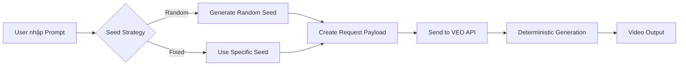

# VEO Seed Management & Documentation Sync Guide

## PHẦN 1: TỔNG HỢP VỀ SEED PARAMETER

### 📊 Cấu Trúc Dữ Liệu Seed

#### 1. Định Nghĩa Biến

```typescript
// TypeScript Interface
interface VideoGenerationRequest {
  aspectRatio: string;
  seed: number;              // ← SEED PARAMETER
  textInput: {
    prompt: string;
  };
  videoModelKey: string;
  metadata: {
    sceneId: string;
  };
  // ... other fields
}
```

#### 2. Đặc Tính Kỹ Thuật

| Thuộc tính | Giá trị | Ghi chú |
|------------|---------|---------|
| **Data Type** | `integer` (số nguyên) | Không phải string hay float |
| **Range** | `5000 - 24999` | HAR verified (observed: 23713, 14781, 23516, 16504) |
| **Required** | ✅ Yes | Mỗi request phải có seed |
| **Unique** | ❌ No | Có thể trùng lặp, nhưng không nên |
| **Generated** | Client-side | JavaScript tạo trước khi gửi |

#### 3. Ví Dụ Thực Tế Từ HAR Files

```json
// Request 1
{
  "seed": 25325,
  "textInput": {"prompt": "Kết hợp khung cảnh u buồn"},
  "videoModelKey": "veo_3_1_r2v_fast_landscape_ultra_relaxed"
}

// Request 2 (cùng prompt, seed khác)
{
  "seed": 7374,
  "textInput": {"prompt": "Kết hợp khung cảnh u buồn"},
  "videoModelKey": "veo_3_1_r2v_fast_landscape_ultra_relaxed"
}

// Kết quả: 2 videos khác nhau từ cùng prompt
```

---

### ⚙️ Cơ Chế Hoạt Động Của Seed

#### A. Vai Trò Của Seed

**Seed = Deterministic Randomness Controller**

```
Same Prompt + Same Seed = Same Output
Same Prompt + Different Seed = Different Variations
```

**Use Cases:**
1. **Variation Generation**: Tạo nhiều phiên bản khác nhau
2. **Reproducibility**: Tái tạo lại video cũ
3. **A/B Testing**: So sánh các variations
4. **User Preference**: Cho phép user "reroll" nếu không thích

#### B. Flow Diagram



---

### 🎮 QUẢN LÝ VÀ GỬI SEED TỪ CLIENT

#### CÂU TRẢ LỜI: ✅ CÓ, HOÀN TOÀN ĐƯỢC!

Seed được gửi trực tiếp từ client trong request payload. Bạn có thể:

1. ✅ **Tự generate random seed**
2. ✅ **Cho phép user nhập seed cố định**
3. ✅ **Lưu seeds đã dùng để replay**
4. ✅ **Batch generate với nhiều seeds khác nhau**

#### Implementation Examples

##### Option 1: Random Seed (Default)

```javascript
// Simple Random
function generateRandomSeed() {
  return Math.floor(Math.random() * 20000) + 5000; // 5000-24999
}

// Crypto Random (Better quality)
function generateCryptoSeed() {
  const array = new Uint16Array(1);
  crypto.getRandomValues(array);
  return array[0];
}

// Usage
const seed = generateCryptoSeed();
const payload = {
  seed: seed,
  textInput: { prompt: userPrompt },
  videoModelKey: selectedModel
};
```

##### Option 2: User-Controlled Seed

```javascript
// UI Component
<input 
  type="number" 
  min="5000" 
  max="24999"
  placeholder="Random seed (leave empty for auto)"
  value={userSeed}
  onChange={(e) => setUserSeed(e.target.value)}
/>

// Logic
const seed = userSeed 
  ? parseInt(userSeed) 
  : generateCryptoSeed();
```

##### Option 3: Batch Variation Generator

```javascript
// Generate 4 variations (VEO default)
function generateBatchSeeds(count = 4) {
  const seeds = new Set();
  while (seeds.size < count) {
    seeds.add(generateCryptoSeed());
  }
  return Array.from(seeds);
}

// Usage
const seeds = generateBatchSeeds(4);
const requests = seeds.map(seed => ({
  aspectRatio: "VIDEO_ASPECT_RATIO_LANDSCAPE",
  seed: seed,
  textInput: { prompt: userPrompt },
  videoModelKey: "veo_3_1_t2v_fast_landscape_ultra",
  metadata: { sceneId: generateUUID() }
}));

// Send batch request
const response = await fetch(API_ENDPOINT, {
  method: 'POST',
  body: JSON.stringify({
    clientContext: { /* ... */ },
    requests: requests
  })
});
```

##### Option 4: Seed History & Replay

```javascript
// Save successful generations
class SeedManager {
  constructor() {
    this.history = JSON.parse(
      localStorage.getItem('veo_seed_history') || '[]'
    );
  }

  saveGeneration(seed, prompt, videoUrl, likedByUser) {
    this.history.push({
      seed,
      prompt,
      videoUrl,
      liked: likedByUser,
      timestamp: Date.now()
    });
    localStorage.setItem('veo_seed_history', 
      JSON.stringify(this.history));
  }

  replayWithSeed(seed, prompt) {
    // Re-generate using exact same seed
    return {
      seed: seed,
      textInput: { prompt: prompt },
      // ... other params
    };
  }

  getFavoriteSeeds() {
    return this.history
      .filter(h => h.liked)
      .map(h => ({ seed: h.seed, prompt: h.prompt }));
  }
}
```

---

### 📐 Seed Range & Constraints

#### Valid Ranges

```javascript
// ✅ VALID SEEDS
const validSeeds = [
  5000,     // Minimum (HAR verified)
  15000,
  23713,    // Observed in HAR
  24999     // Maximum (HAR verified)
];

// ❌ INVALID SEEDS
const invalidSeeds = [
  4999,     // Below minimum
  25000,    // Above maximum
  1.5,      // Float
  "123",    // String
  null,     // Null
  undefined // Undefined
];
```

#### Validation Function

```javascript
function validateSeed(seed) {
  if (typeof seed !== 'number') {
    throw new Error('Seed must be a number');
  }
  if (!Number.isInteger(seed)) {
    throw new Error('Seed must be an integer');
  }
  if (seed < 5000 || seed > 24999) {
    throw new Error('Seed must be between 5000 and 24999');
  }
  return true;
}
```

---

### 🎯 Best Practices

#### 1. UI/UX Recommendations

**Option A: Hidden (Auto Random)**
```
[ Generate Video ] ← Always random
```

**Option B: Advanced Toggle**
```
[ Generate Video ]
☐ Advanced: Use custom seed
    Seed: [____] (5000-24999)
```

**Option C: Variation Selector**
```
Generate [4▼] variations
Seeds: Auto ● Custom: [___,___,___,___]
```

#### 2. Seed Display After Generation

```
✅ Video Generated!
Seed: 15423
[📋 Copy Seed] [🔄 Regenerate with This Seed]
```

#### 3. Error Handling

```javascript
try {
  validateSeed(userSeed);
  const response = await generateVideo(userSeed, prompt);
} catch (error) {
  if (error.message.includes('Seed')) {
    alert('Invalid seed. Please use a number between 5000 and 24999.');
  } else {
    // Handle API errors
  }
}
```

---

## PHẦN 2: DOCUMENTATION SYNC CHECKLIST

### 📂 Files Cần Sync Từ Brain → Documentation

**Tổng Cộng: 5 FILES PRIORITY**

#### PRIORITY 1: Critical Updates (NGAY LẬP TỨC)

##### 1. VEO_API_COMMANDS_REFERENCE.md
- **Status**: ⚠️ Outdated in Documentation
- **Brain Version**: 15.8 KB (updated với project creation fix)
- **Doc Version**: 6.1 KB (old)
- **Action**: **OVERWRITE** Documentation với Brain version
- **Changes**:
  - ✅ Project creation API fix (server-side)
  - ✅ Complete model keys (6 models)
  - ✅ Updated implementation notes

##### 2. INGREDIENTS_WORKFLOW_ANALYSIS.md
- **Status**: ✨ NEW - Không tồn tại trong Documentation
- **Size**: ~9 KB
- **Action**: **COPY** to Documentation
- **Content**:
  - R2V (Reference-to-Video) workflow
  - Multi-image prompting (up to 3 images)
  - Batch processing logic
  - Complete request/response structures

#### PRIORITY 2: New Reference Docs (QUAN TRỌNG)

##### 3. SEED_MODEL_INTEGRATION_ANALYSIS.md
- **Status**: ✨ NEW
- **Size**: ~8 KB
- **Action**: **COPY** to Documentation
- **Content**:
  - Seed generation mechanism
  - 6 model keys catalog
  - Verification status
  - Integration roadmap

##### 4. DOCUMENTATION_ACCURACY_AUDIT.md
- **Status**: ✨ NEW (Internal Report)
- **Size**: ~12 KB
- **Action**: **OPTIONAL** - Copy nếu muốn track accuracy
- **Content**:
  - 98% API accuracy report
  - Endpoint verification
  - Gap analysis

#### PRIORITY 3: Comprehensive Guides (BỔ SUNG)

##### 5. VEO_COMPLETE_SEED_GUIDE.md
- **Status**: ✨ TO BE CREATED (File này)
- **Action**: **COPY THIS FILE** to Documentation
- **Content**:
  - Complete seed documentation
  - Client implementation examples
  - Best practices

---

### 🔄 Sync Action Plan

#### Step 1: Backup Current Documentation

```bash
cd "D:\Music\Ruby\Produce for Customer\##Tools\VEO Tool"
mkdir Documentation_Backup_2026-02-01
xcopy Documentation Documentation_Backup_2026-02-01 /E /I
```

#### Step 2: Priority 1 Files (Critical)

```bash
# Overwrite outdated API reference
copy /Y "C:\Users\Linh\.gemini\antigravity\brain\6cd63aa5-8a11-4269-839f-2ab155dcf9ca\VEO_API_COMMANDS_REFERENCE.md" "D:\Music\Ruby\Produce for Customer\##Tools\VEO Tool\Documentation\"

# Add new Ingredients workflow doc
copy "C:\Users\Linh\.gemini\antigravity\brain\6cd63aa5-8a11-4269-839f-2ab155dcf9ca\INGREDIENTS_WORKFLOW_ANALYSIS.md" "D:\Music\Ruby\Produce for Customer\##Tools\VEO Tool\Documentation\"
```

#### Step 3: Priority 2 Files (New References)

```bash
copy "C:\Users\Linh\.gemini\antigravity\brain\6cd63aa5-8a11-4269-839f-2ab155dcf9ca\SEED_MODEL_INTEGRATION_ANALYSIS.md" "D:\Music\Ruby\Produce for Customer\##Tools\VEO Tool\Documentation\"

# Optional: Accuracy audit
copy "C:\Users\Linh\.gemini\antigravity\brain\6cd63aa5-8a11-4269-839f-2ab155dcf9ca\DOCUMENTATION_ACCURACY_AUDIT.md" "D:\Music\Ruby\Produce for Customer\##Tools\VEO Tool\Documentation\"
```

#### Step 4: This File (Seed Guide)

```bash
copy "C:\Users\Linh\.gemini\antigravity\brain\6cd63aa5-8a11-4269-839f-2ab155dcf9ca\VEO_COMPLETE_SEED_GUIDE.md" "D:\Music\Ruby\Produce for Customer\##Tools\VEO Tool\Documentation\"
```

#### Step 5: Update README.md

```bash
# Manually update Documentation/README.md to reference new files
```

---

### 📊 Before/After Comparison

| File | Before Sync | After Sync | Improvement |
|------|-------------|------------|-------------|
| VEO_API_COMMANDS_REFERENCE.md | 6.1 KB (outdated) | 15.8 KB (current) | +160% content |
| INGREDIENTS_WORKFLOW_ANALYSIS.md | ❌ Missing | ✅ 9 KB | NEW workflow |
| SEED_MODEL_INTEGRATION_ANALYSIS.md | ❌ Missing | ✅ 8 KB | NEW reference |
| VEO_COMPLETE_SEED_GUIDE.md | ❌ Missing | ✅ This file | NEW guide |
| **Total New Content** | - | **~33 KB** | **4 new/updated files** |

---

### ✅ Verification Checklist

After sync, verify:

- [ ] VEO_API_COMMANDS_REFERENCE.md contains 6 model keys
- [ ] VEO_API_COMMANDS_REFERENCE.md has project creation fix
- [ ] INGREDIENTS_WORKFLOW_ANALYSIS.md exists
- [ ] SEED_MODEL_INTEGRATION_ANALYSIS.md exists
- [ ] VEO_COMPLETE_SEED_GUIDE.md exists
- [ ] README.md updated with new file references
- [ ] All files are readable and properly formatted
- [ ] Backup folder created successfully

---

## TÓM TẮT

### Câu Hỏi 1: Seeds có thể tổng hợp được không?

✅ **CÓ**. Seed là một số nguyên đơn giản (5000-24999):
- Data type: `integer`
- Variable name: `seed`
- Client có thể tạo random hoặc cho user control

### Câu Hỏi 2: Có thể quản lý và gửi từ client?

✅ **CÓ, HOÀN TOÀN**. Seed được gửi trong request payload:
- Client-side generation (JavaScript)
- User input support
- Seed history/replay
- Batch variations

### Câu Hỏi 3: Dữ liệu cần sync?

✅ **5 FILES**:
1. VEO_API_COMMANDS_REFERENCE.md (overwrite)
2. INGREDIENTS_WORKFLOW_ANALYSIS.md (new)
3. SEED_MODEL_INTEGRATION_ANALYSIS.md (new)
4. DOCUMENTATION_ACCURACY_AUDIT.md (optional)
5. VEO_COMPLETE_SEED_GUIDE.md (this file)

---

**Ngày tạo**: 2026-02-01  
**Mục đích**: Complete seed management guide + Documentation sync plan  
**Status**: Ready for implementation
