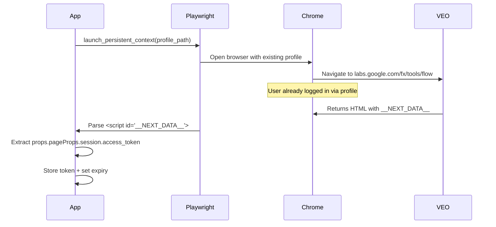
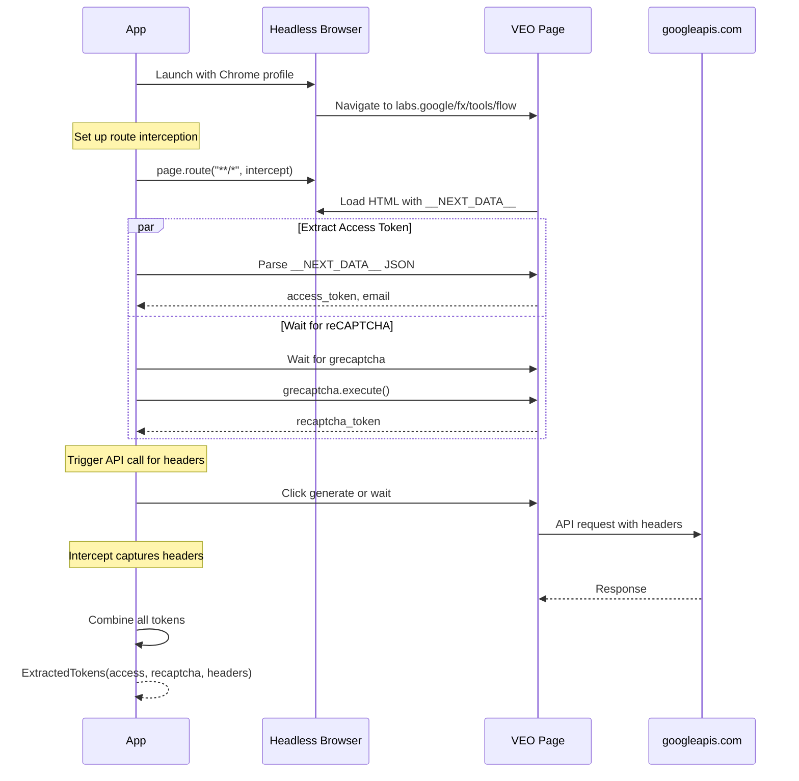
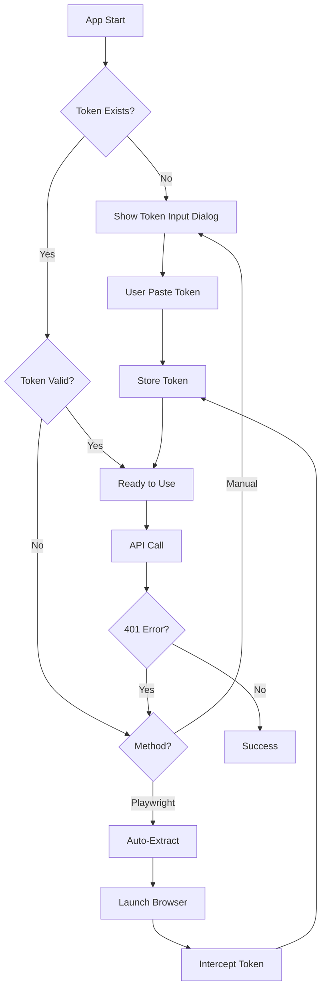

# VEO Pro Max - Token Security

**Scope**: Dual-method token management (Manual + Playwright auto-extraction)

---

## Overview

VEO Pro Max supports two authentication methods:

| Method | Approach | Security Level | Convenience |
|--------|----------|----------------|-------------|
| **A) Manual** | User pastes Bearer token from DevTools | 🔒 High (no browser auto-launch) | ⭐⭐ |
| **B) Playwright** | Auto-extract from browser session | 🔒 Medium (needs browser launch) | ⭐⭐⭐⭐⭐ |

---

## Method A: Manual Token Input

### How to Get Token

1. Open Chrome DevTools (F12) on `labs.google.com/flow`
2. Go to Network tab
3. Filter by `fetch/XHR`
4. Find any API request to `aisandbox-pa.googleapis.com`
5. Copy `Authorization: Bearer ya29.xxx...` header value

### Storage

```python
# Token stored in session file (Updated 2026-02-07)
~/.veoauto/sessions/{email}.json

{
    "email": "user@gmail.com",
    "access_token": "ya29.a0AW...",
    "token_expires": "2026-02-07T12:00:00",
    "recaptcha_token": "...",
    "sku": "WS_ULTRA"
}
```

### Security Considerations

- ✅ Token stored locally, not transmitted
- ✅ No browser automation dependency
- ❌ User must manually refresh when expired (~1 hour)
- ❌ Requires technical knowledge (DevTools)

---

## Method B: Playwright Auto-Extraction

### How It Works



### Persistent Profile

Uses existing Chrome profile to avoid re-login:

```python
browser = await playwright.chromium.launch_persistent_context(
    user_data_dir="C:/Users/{user}/AppData/Local/Google/Chrome/User Data",
    channel="chrome",  # Use real Chrome instead of Chromium (Updated 2026-02-07)
    headless=False     # For login; True for refresh (Updated 2026-02-07)
)
```

### Extraction Implementation

Unlike manual intercept, we extract the token directly from the page's initial state (`__NEXT_DATA__`), which is more reliable than waiting for a specific XHR request.

```python
async def extract_token_from_page(page):
    # Navigate to VEO tool
    await page.goto("https://labs.google/fx/tools/flow", wait_until="domcontentloaded")
    
    # Get HTML content
    content = await page.content()
    
    # Parse __NEXT_DATA__ JSON
    # Alternative: Use BeautifulSoup if regex is fragile
    import re
    import json
    
    match = re.search(r'<script id="__NEXT_DATA__" type="application/json">(.*?)</script>', content)
    if match:
        json_str = match.group(1)
        data = json.loads(json_str)
        
        # Navigate to Token
        try:
            session = data['props']['pageProps']['session']
            token = session['access_token']
            user = session['user']
            
            return {
                "token": token,
                "user_name": user.get("name"),
                "user_email": user.get("email"),
                "expires": session.get("expires")
            }
        except KeyError:
            print("Session data not found in __NEXT_DATA__")
            return None
    return None
```

### Security Considerations

- ✅ Automatic token refresh
- ✅ No manual DevTools steps
- ❌ Requires browser launch (visible window briefly)
- ❌ Profile path contains sensitive data
- ❌ Additional dependency

---

## Method C: reCAPTCHA Token Extraction

### What is reCAPTCHA v3 Invisible?

VEO uses reCAPTCHA v3 invisible to protect against automation. Unlike v2 (checkbox), v3 runs silently in background and returns a **score-based token**.

### Token Lifecycle

| Property | Value |
|----------|-------|
| Lifetime | ~90 seconds |
| Refresh at | 80 seconds |
| Action | `generate` or `upload` |

### Extraction Method

```python
async def extract_recaptcha_token(page) -> Optional[str]:
    """Extract reCAPTCHA v3 token from page."""
    
    # Wait for grecaptcha to load
    await page.wait_for_function("typeof grecaptcha !== 'undefined'", timeout=10000)
    
    # Find site key from page scripts
    site_key = await page.evaluate('''
        () => {
            const scripts = document.getElementsByTagName('script');
            for (const script of scripts) {
                const match = (script.src || '').match(/render=([^&]+)/);
                if (match) return match[1];
            }
            return null;
        }
    ''')
    
    # Execute and get token
    token = await page.evaluate(f'''
        async () => await grecaptcha.execute('{site_key}', {{action: 'generate'}})
    ''')
    
    return token
```

### Auto-Refresh Implementation

```python
class RecaptchaRefresher:
    """Auto-refresh reCAPTCHA token before expiry."""
    
    REFRESH_INTERVAL = 80  # seconds
    
    async def start(self, page, on_token: Callable[[str], None]):
        while True:
            token = await extract_recaptcha_token(page)
            on_token(token)
            await asyncio.sleep(self.REFRESH_INTERVAL)
```

---

## Method D: x-browser Headers Extraction

### Required Headers

| Header | Source | Critical |
|--------|--------|----------|
| `x-browser-validation` | Chrome extension/built-in | ⚠️ YES |
| `x-client-data` | Chrome client data | Optional |
| `x-browser-channel` | `stable` | Static |
| `x-browser-year` | `2026` | Static |

### Extraction via Request Interception

```python
async def setup_header_interception(page) -> dict:
    """Intercept API requests to capture x-browser headers."""
    
    captured = {}
    
    async def intercept(route, request):
        url = request.url
        
        if "googleapis.com" in url or "aisandbox" in url:
            headers = request.headers
            if "x-browser-validation" in headers:
                captured["x-browser-validation"] = headers["x-browser-validation"]
            if "x-client-data" in headers:
                captured["x-client-data"] = headers["x-client-data"]
        
        await route.continue_()
    
    await page.route("**/*", intercept)
    return captured
```

### Fallback: Extract from HAR

If live extraction fails, use pre-captured HAR file:

```python
def extract_from_har(har_path: str) -> dict:
    """Extract headers from HAR file."""
    with open(har_path) as f:
        data = json.load(f)
    
    for entry in data['log']['entries']:
        if 'googleapis.com' in entry['request']['url']:
            for h in entry['request']['headers']:
                if h['name'] == 'x-browser-validation':
                    return {'x-browser-validation': h['value']}
    return {}
```

---

## Unified Token Extraction Flow

### Complete Flow Diagram



### TokenExtractor Usage

```python
from core.token_extractor import extract_tokens

# Single call extracts all tokens
tokens = await extract_tokens(
    profile_path="C:/Users/xxx/Chrome/User Data/Default",
    headless=True
)

# Use tokens for API calls
client = VEOApiClient()
client.set_browser_headers(tokens.browser_validation, tokens.client_data)

result = await client.generate_video_t2v(
    access_token=tokens.access_token,
    recaptcha_token=tokens.recaptcha_token,
    prompt="Beautiful sunset"
)
```

---

## Token Lifecycle



---

## Implementation Details

### Token Validation

```python
def is_valid_token(token: str) -> bool:
    """
    Basic token format validation.
    
    VEO Bearer tokens:
    - Start with "ya29." (Google OAuth2)
    - Length typically 150-200 chars
    """
    if not token:
        return False
    if not token.startswith("ya29."):
        return False
    if len(token) < 100:
        return False
    return True
```

### Expiry Handling

```python
# Google OAuth2 tokens expire in ~1 hour
DEFAULT_EXPIRY_SECONDS = 3600

# Check with 60-second buffer (Updated 2026-02-07 to match code)
def is_expired(expires_at: float) -> bool:
    return time.time() > (expires_at - 60)  # 60s buffer, not 300s
```

### Secure Storage

```python
from cryptography.fernet import Fernet
import keyring

class SecureTokenStore:
    """
    Encrypt token before saving to file.
    Store encryption key in OS keyring.
    """
    
    def __init__(self):
        # Get or create encryption key from OS keyring
        key = keyring.get_password("veo_pro_max", "encryption_key")
        if not key:
            key = Fernet.generate_key().decode()
            keyring.set_password("veo_pro_max", "encryption_key", key)
        self.cipher = Fernet(key.encode())
    
    def encrypt_and_save(self, token_data: dict):
        encrypted = self.cipher.encrypt(json.dumps(token_data).encode())
        Path("~/.veo_pro_max/token.enc").write_bytes(encrypted)
    
    def load_and_decrypt(self) -> dict:
        encrypted = Path("~/.veo_pro_max/token.enc").read_bytes()
        decrypted = self.cipher.decrypt(encrypted)
        return json.loads(decrypted)
```

---

## UI Integration

### Settings Tab Controls

| Control | Method A | Method B |
|---------|----------|----------|
| Token Input | TextBox (paste token) | Hidden |
| Project ID Input | TextBox | Auto-detected |
| "Extract Token" Button | N/A | Click to launch browser |
| Token Status | Shows expiry time | Shows expiry time |
| Auto-Refresh Toggle | ❌ Off | ✅ Available |

---

## Best Practices

1. **Never log tokens** - Even in debug mode
2. **Clear token on logout** - Remove from storage completely
3. **Validate before use** - Check format and expiry
4. **Handle 401 gracefully** - Prompt for re-auth, don't crash
5. **Minimize token exposure** - Only pass to API client, never to UI

---

## Account Tier Detection

> **Moved**: This section has been relocated to [ACCOUNT_SESSION_MANAGEMENT.md](./ACCOUNT_SESSION_MANAGEMENT.md#2-⚠️-critical-subscription-detection-verified) which contains the canonical, verified implementation with HAR file evidence.


---

## Related Documentation
- [Account Session Management](./ACCOUNT_SESSION_MANAGEMENT.md)
- [Pro Max Auth Manager](./CORE_MODULES_SPEC.md#2-auth_managerpy)
- [License Protection System](../05_Security/docs/LICENSE_PROTECTION_SYSTEM.md)

---

**Last Updated**: 2026-02-07

