# 📊 Phân Tích Chi Tiết: Concurrency, Delay & Retry Logic

## Tổng Quan Kiến Trúc

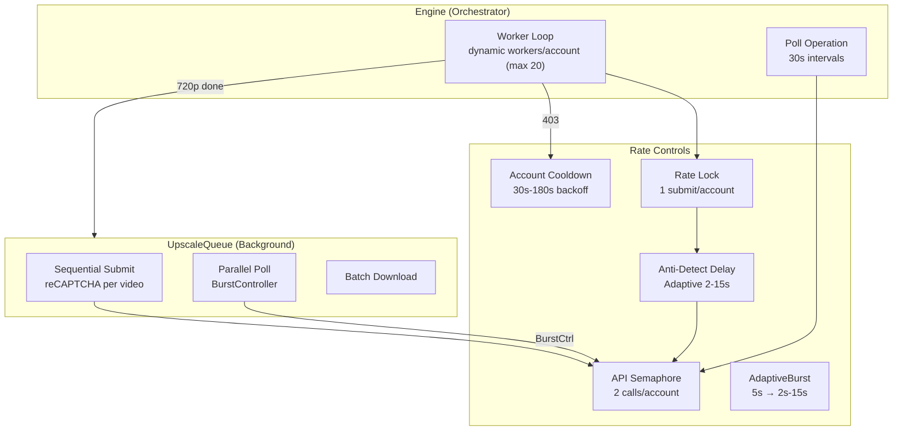

---

## 1. Prompt Submit — Số Lượng Đồng Thời

### 1.1 Worker Architecture

| Tham số | Giá trị | Nguồn |
|---------|---------|-------|
| Max coroutines/account | **dynamic** (= max_workers, default 20) | [engine.py L364](file:///D:/NEW%20VEO%20PRO%20MAX/veo-pro-max/02%20-%20CLIENT%20-%20VEO%20PRO%20MAX/core/engine.py#L364) |
| Max workers/account | **0-20** (configurable) | [session.py:86](file:///D:/NEW%20VEO%20PRO%20MAX/veo-pro-max/02%20-%20CLIENT%20-%20VEO%20PRO%20MAX/core/session.py#L86) |
| API semaphore/account | **2** concurrent calls (main), **3** (upscale) | [engine.py:168](file:///D:/NEW%20VEO%20PRO%20MAX/veo-pro-max/02%20-%20CLIENT%20-%20VEO%20PRO%20MAX/core/engine.py#L168) |
| Rate lock/account | **1** (mutex) | [engine.py:680](file:///D:/NEW%20VEO%20PRO%20MAX/veo-pro-max/02%20-%20CLIENT%20-%20VEO%20PRO%20MAX/core/engine.py#L680) |
| Max parallel accounts | **10** | [constants.py:283](file:///D:/NEW%20VEO%20PRO%20MAX/veo-pro-max/02%20-%20CLIENT%20-%20VEO%20PRO%20MAX/config/constants.py#L283) |

### 1.2 Cơ Chế Tăng/Giảm Workers

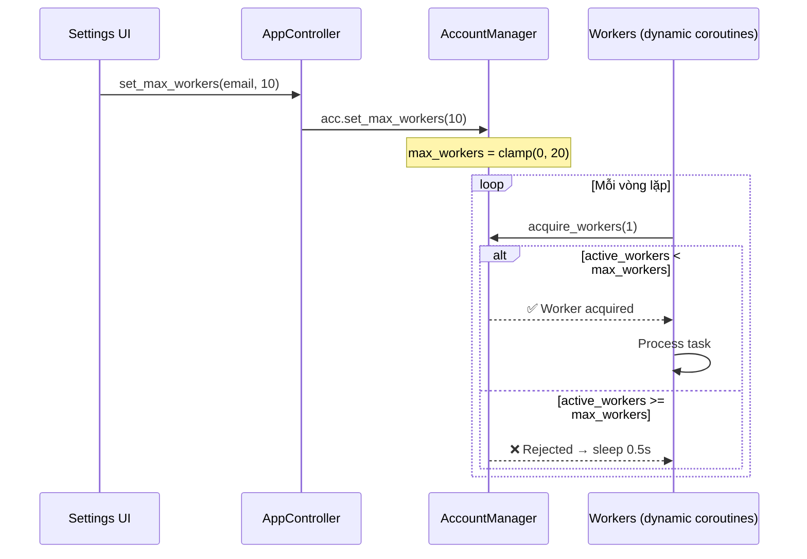

> [!IMPORTANT]
> `max_workers` được kiểm tra **mỗi lần** `acquire_workers()` gọi — thay đổi giữa lúc chạy **có hiệu lực ngay lập tức**:
> - **Tăng workers**: Coroutine đang idle sẽ bắt đầu lấy worker → xử lý task
> - **Giảm workers**: Coroutine thừa bị reject tại `acquire_workers()` → idle an toàn

### 1.3 Actual Concurrent Submits

Mặc dù có 5 workers, **submit thực tế bị serialize** bởi `_account_rate_locks`:

```
Worker 1: [====anti-detect 5.5s====][API call] → release lock
Worker 2:                                        [====anti-detect====][API call]
Worker 3:                                                                       [====anti-detect====][API]
```

**Kết quả thực tế**: ~1 submit mỗi 5.5-11s trên mỗi account (anti-detect + API call time).

---

## 2. Anti-Detect Delay

### 2.1 Adaptive Delay (Prompt Submit) — via AdaptiveBurstController

| Tham số | Default | Range | Nguồn |
|---------|---------|-------|-------|
| `burst_controller.wait()` | **5.0s** (initial) | 2.0s – 15.0s | [adaptive_burst.py](file:///D:/NEW%20VEO%20PRO%20MAX/veo-pro-max/02%20-%20CLIENT%20-%20VEO%20PRO%20MAX/core/adaptive_burst.py) |
| Tightening | 10 success liên tục → `×0.8` | min **2.0s** | `record_success()` |
| Backoff (403) | Instant → `×1.5` | max **15.0s** | `record_error()` |
| Jitter | ±30% | tự động | Trong `wait()` |

**Thời gian trung bình**: **2.0-15.0s** (tự chỉnh), giảm sau nhiều lần thành công liên tiếp.

### 2.2 Adaptive Burst Controller (Per-Account API Delay)

Thay thế fixed delay bằng delay thông minh tự điều chỉnh theo phản hồi server:

| Trạng thái | Hành động | Delay | Giới hạn |
|------------|-----------|-------|----------|
| Ban đầu | — | **5.0s** | — |
| 10 success liên tục | Giảm 20% | `delay × 0.8` | min **2.0s** |
| HTTP 403 | Tăng 50% | `delay × 1.5` | max **15.0s** |
| HTTP 429 (rate limit) | Tăng 100% | `delay × 2.0` | max **30.0s** |
| HTTP 500+ | Tăng 25% | `delay × 1.25` | max **15.0s** |
| Jitter | ±30% | `delay ± 30%` | min `1.0s` |

**Ví dụ trajectory**: `5.0 → 5.0 → ... (10 success) → 4.0 → ... (10 success) → 3.2 → ... (403!) → 4.8 → ...`

> [!TIP]
> **Đã wire vào engine worker loop** (M1 fix): `burst_controller.wait()` thay thế `random.uniform(3,8)`. Engine gọi `record_success()` sau API call thành công và `record_error()` sau 403/reCAPTCHA failures.

### 2.3 Staggered Startup Delay

Khi engine khởi động, workers không bắt đầu đồng thời:

| Worker | Delay | Công thức |
|--------|-------|-----------|
| Worker-0 | 0.0s | — |
| Worker-1 | 1.5s | `index × 1.5` |
| Worker-2 | 3.0s | `index × 1.5` |
| Worker-3 | 4.5s | `index × 1.5` |
| Worker-4 | 6.0s | `index × 1.5` |

---

## 3. Prompt Submit — Retry Logic

### 3.1 Retry Counts

| Loại task | Max retries | Default | Nguồn |
|-----------|-------------|---------|-------|
| Normal task | `max(account.retry_count, 10)` | **10** | [engine.py:748](file:///D:/NEW%20VEO%20PRO%20MAX/veo-pro-max/02%20-%20CLIENT%20-%20VEO%20PRO%20MAX/core/engine.py#L748) |
| Chain task (có children/parent) | `max(account.retry_count, 15)` | **15** | [engine.py:746](file:///D:/NEW%20VEO%20PRO%20MAX/veo-pro-max/02%20-%20CLIENT%20-%20VEO%20PRO%20MAX/core/engine.py#L746) |
| Chain auto-retry (root failed) | — | **3** lần | [engine.py:1057](file:///D:/NEW%20VEO%20PRO%20MAX/veo-pro-max/02%20-%20CLIENT%20-%20VEO%20PRO%20MAX/core/engine.py#L1057) |

### 3.2 Retry Backoff

| Kịch bản | Backoff | Công thức | Cap |
|----------|---------|-----------|-----|
| **Non-auth error (default)** | Exponential | `5 × 2^attempt` | **60s** |
| **Chain auto-retry** | Random | `uniform(30, 60)` | **60s** |

**Backoff sequence (default)**: `5s → 10s → 20s → 40s → 60s → 60s → ...`

### 3.3 Recovery State Machine (403/reCAPTCHA)

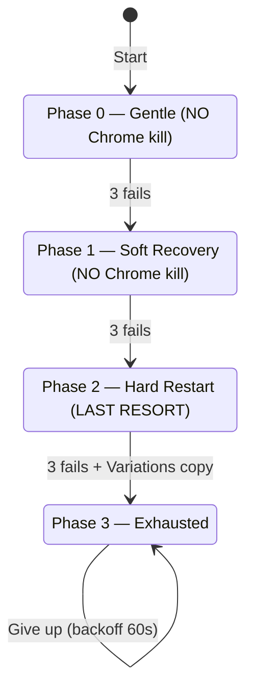

| Phase | Fail # | Action | Backoff |
|-------|--------|--------|---------|
| **Phase 0** | 1 | Wait for reCAPTCHA ready (15s) | **3s** |
| **Phase 0** | 2 | Reload tabs + refresh headers + wait (20s) | **5s** |
| **Phase 0** | 3 | → Escalate to Phase 1 | **8s** |
| **Phase 1** | 1-2 | Soft browser recovery + wait (20s) | **10s** |
| **Phase 1** | 3 | → Escalate to Phase 2 | **10s** |
| **Phase 2** | 1-2 | Hard browser restart + wait (30s) | **15s** |
| **Phase 2** | 3+ | Copy Variations + restart + warmup | **15s** |
| **Phase 3** | any | Give up — no more recovery | **60s** |

> [!TIP]
> **Success resets ALL phases**: Sau 1 success, toàn bộ recovery state reset về Phase 0 count=0.

### 3.4 Special Error Handling

| Loại lỗi | Hành động |
|-----------|-----------|
| **Network error** | Instant pause, re-queue task (không retry) |
| **Auth error** | Fail task (cần re-login thủ công) |
| **Timeout** | Count as retry, backoff exponential |

---

## 4. Account Cooldown (Shared 403)

Dùng chung giữa engine workers và upscale queue:

| Tham số | Giá trị | Công thức |
|---------|---------|-----------|
| Cooldown lần 1 | **30s** | `30 × 2^0` |
| Cooldown lần 2 | **60s** | `30 × 2^1` |
| Cooldown lần 3 | **120s** | `30 × 2^2` |
| Cooldown max | **180s** | `min(30 × 2^n, 180)` |
| Clear | Sau 1 API success | Reset counter |

---

## 5. Poll Operation — Prompt Status Check

### 5.1 Poll Intervals

| Tham số | Giá trị | Nguồn |
|---------|---------|-------|
| Base interval | **30s** | [constants.py:291](file:///D:/NEW%20VEO%20PRO%20MAX/veo-pro-max/02%20-%20CLIENT%20-%20VEO%20PRO%20MAX/config/constants.py#L291) |
| Jitter | +0% to +30% | `uniform(0, interval × 0.3)` |
| Actual range | **30s – 39s** | `30 + uniform(0, 9)` |
| Max poll time | **600s** (10 min) | [constants.py:292](file:///D:/NEW%20VEO%20PRO%20MAX/veo-pro-max/02%20-%20CLIENT%20-%20VEO%20PRO%20MAX/config/constants.py#L292) |
| Max polls | ~15-20 | `600 / ~35` |

### 5.2 Poll Progress Mapping

| Status | Progress | Emoji |
|--------|----------|-------|
| PENDING (1st) | 25% | ⏳ |
| PENDING (2nd+) | 30% | ⏳ |
| ACTIVE (1st) | 40% | 🔄 |
| ACTIVE (ramping) | 45-80% | 🔄 |
| SUCCESSFUL | 85% | ✅ |
| Downloading | 86-90% | ⬇️ |
| Post-processing | 95% | 🎬 |
| Done | 100% | ✅ |

---

## 6. Upscale — Số Lượng Đồng Thời

### 6.1 Architecture

| Layer | Concurrency | Cơ chế |
|-------|-------------|--------|
| Jobs per account | **5** concurrent | `MAX_CONCURRENT_JOBS` [upscale_queue.py:222](file:///D:/NEW%20VEO%20PRO%20MAX/veo-pro-max/02%20-%20CLIENT%20-%20VEO%20PRO%20MAX/core/upscale_queue.py#L222) |
| Submit per job | **Sequential** (1 tại 1 thời điểm) | Cần reCAPTCHA per video |
| Poll per job | **Parallel** (all videos cùng lúc) | `asyncio.gather` |
| Global poll limit | **4 → 20** adaptive | BurstController |

### 6.2 Upscale BurstController (Poll Concurrency)

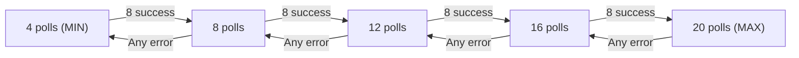

| Tham số | Giá trị | Nguồn |
|---------|---------|-------|
| Initial | **4** polls | [upscale_queue.py:41](file:///D:/NEW%20VEO%20PRO%20MAX/veo-pro-max/02%20-%20CLIENT%20-%20VEO%20PRO%20MAX/core/upscale_queue.py#L41) |
| Step | **+4** per scale-up | [upscale_queue.py:42](file:///D:/NEW%20VEO%20PRO%20MAX/veo-pro-max/02%20-%20CLIENT%20-%20VEO%20PRO%20MAX/core/upscale_queue.py#L42) |
| Max | **20** polls | [upscale_queue.py:43](file:///D:/NEW%20VEO%20PRO%20MAX/veo-pro-max/02%20-%20CLIENT%20-%20VEO%20PRO%20MAX/core/upscale_queue.py#L43) |
| Min | **4** polls | [upscale_queue.py:44](file:///D:/NEW%20VEO%20PRO%20MAX/veo-pro-max/02%20-%20CLIENT%20-%20VEO%20PRO%20MAX/core/upscale_queue.py#L44) |
| Scale up threshold | **8** consecutive successes | [upscale_queue.py:45](file:///D:/NEW%20VEO%20PRO%20MAX/veo-pro-max/02%20-%20CLIENT%20-%20VEO%20PRO%20MAX/core/upscale_queue.py#L45) |
| Back off trigger | **Any** error | Immediate -4 |

### 6.3 Upscale Poll Intervals

| Tham số | Giá trị | Nguồn |
|---------|---------|-------|
| Base interval | **30s** | [engine.py:2400](file:///D:/NEW%20VEO%20PRO%20MAX/veo-pro-max/02%20-%20CLIENT%20-%20VEO%20PRO%20MAX/core/engine.py#L2400) |
| Jitter | +0 to +2s | `uniform(0, 2)` |
| Actual range | **30-32s** | `30 + jitter` |
| Max polls | **60** | [engine.py:2395](file:///D:/NEW%20VEO%20PRO%20MAX/veo-pro-max/02%20-%20CLIENT%20-%20VEO%20PRO%20MAX/core/engine.py#L2395) |
| Max time | **~30 min** | `60 × ~30s` |

### 6.4 Upscale Submit Retry

| Tham số | Giá trị | Công thức |
|---------|---------|-----------|
| Max submit retries | **5** per video | [upscale_queue.py:392](file:///D:/NEW%20VEO%20PRO%20MAX/veo-pro-max/02%20-%20CLIENT%20-%20VEO%20PRO%20MAX/core/upscale_queue.py#L392) |
| Cooldown giữa videos | **2.0s** | [upscale_queue.py:407](file:///D:/NEW%20VEO%20PRO%20MAX/veo-pro-max/02%20-%20CLIENT%20-%20VEO%20PRO%20MAX/core/upscale_queue.py#L407) |
| Backoff giữa retries | `min(5×(attempt+1), 15)` | **5s → 10s → 15s** cap |
| reCAPTCHA garbage threshold | **< 500 chars** | Token validation |
| 1080p poll fail | **Re-submit 1 lần** (free) | [upscale_queue.py:660](file:///D:/NEW%20VEO%20PRO%20MAX/veo-pro-max/02%20-%20CLIENT%20-%20VEO%20PRO%20MAX/core/upscale_queue.py#L660) |

### 6.5 Upscale Job-Level Retry

| Tham số | Giá trị | Công thức |
|---------|---------|-----------|
| Max job retries | **3** | [upscale_queue.py:133](file:///D:/NEW%20VEO%20PRO%20MAX/veo-pro-max/02%20-%20CLIENT%20-%20VEO%20PRO%20MAX/core/upscale_queue.py#L133) |
| Retry delay | `30 × 2^count` | **30s → 60s → 120s** |
| Partial retry | Chỉ retry video failed | `retry_indices` |

### 6.6 Upscale Browser Recovery

Chỉ khi **chưa có video nào submitted OK**:

| Attempt | Action | Wait |
|---------|--------|------|
| 1 | — | 5s backoff |
| 2 | `soft_recover_browser()` | 8s + reCAPTCHA wait 20s |
| 3 | `restart_browser()` + fix client data | 10s + reCAPTCHA wait 30s |
| 4-5 | Backoff only | 15s cap |

---

## 7. Workload Priority (Prompt vs Upscale)

| Mode | Prompt Workers | Upscale Queue | Nguồn |
|------|---------------|---------------|-------|
| `balanced` | ✅ Run | ✅ Run | Default |
| `prompts_first` | ✅ Run | ⏸️ Pause khi prompt đang chạy | [engine.py:221-233](file:///D:/NEW%20VEO%20PRO%20MAX/veo-pro-max/02%20-%20CLIENT%20-%20VEO%20PRO%20MAX/core/engine.py#L221-L233) |
| `upscale_first` | ⏸️ Pause khi upscale pending | ✅ Run | [engine.py:235-244](file:///D:/NEW%20VEO%20PRO%20MAX/veo-pro-max/02%20-%20CLIENT%20-%20VEO%20PRO%20MAX/core/engine.py#L235-L244) |

---

## 8. Tóm Tắt Timing

### Prompt Submit Pipeline

```
[Startup 0-6s] → [acquire_workers] → [adaptive delay 2-15s] → [API submit ~1-3s]
     → [Poll 30-39s intervals × 15-20 lần] → [Download 720p] → [Release workers]
     → [Enqueue Upscale (background)]
```

**Total thời gian 1 task**: ~5-10 phút (generate) + ~3-5 phút (upscale background)

### Upscale Pipeline

```
[Sequential Submit: 2s/video + reCAPTCHA] → [Parallel Poll: 30s intervals × 60 max]
     → [Batch Download] → [Task Complete]
```

**Total upscale**: ~3-5 phút (parallel poll tiết kiệm ~7 phút so với sequential)

---

## 9. Per-Video Tracking — VideoOutputInfo

### 9.1 Data Model

Mỗi video trong một task được theo dõi **riêng lẻ** qua `VideoOutputInfo` ([dispatcher.py:60-97](file:///D:/NEW%20VEO%20PRO%20MAX/veo-pro-max/02%20-%20CLIENT%20-%20VEO%20PRO%20MAX/core/dispatcher.py#L60-L97)):

| Field | Type | Mô tả | Ghi vào stage |
|-------|------|-------|---------------|
| `index` | `int` | Thứ tự submit (0-based) | GENERATED |
| `operation_name` | `str` | UUID của generation operation | GENERATED |
| `scene_id` | `str` | UUID của scene | GENERATED |
| `media_id` | `str` | Protobuf Base64 — dùng cho upscale API | GENERATED |
| `file_720p` | `str` | Path file 720p local | DOWNLOADED_720 |
| `file_upscaled` | `str` | Path file upscale (1080p/4K) | UPSCALED |
| `thumbnail_path` | `str` | Path thumbnail JPG | DOWNLOADED_720 |
| `quality` | `str` | `"pending"` → `"720p"` → `"1080p"`/`"4K"` / `"failed"` | Mỗi stage |
| `upscale_status` | `str` | `""` → `"submitting"` → `"polling"` → `"success"`/`"failed"`/`"skipped"` | UPSCALING |
| `upscale_error` | `str` | Lỗi nếu upscale fail | UPSCALING |

### 9.2 Task-Level (Aggregated Lists)

`Task` object ([dispatcher.py:101-218](file:///D:/NEW%20VEO%20PRO%20MAX/veo-pro-max/02%20-%20CLIENT%20-%20VEO%20PRO%20MAX/core/dispatcher.py#L101-L218)) cũng lưu **parallel lists** theo index:

| Field | Type | Đồng bộ với `video_outputs[i]` |
|-------|------|-------------------------------|
| `operation_names: List[str]` | Danh sách op UUID | `video_outputs[i].operation_name` |
| `scene_ids: List[str]` | Danh sách scene UUID | `video_outputs[i].scene_id` |
| `output_uris: List[str]` | fifeUrls → local paths | `video_outputs[i].file_720p`/`file_upscaled` |
| `thumbnail_paths: List[str]` | Thumbnail JPG paths | `video_outputs[i].thumbnail_path` |
| `upscale_media_ids: List[str]` | Media IDs cho re-upscale | `video_outputs[i].media_id` |
| `video_outputs: List[VideoOutputInfo]` | **← SOURCE OF TRUTH** | — |

> [!IMPORTANT]
> Task-level `upscale_status` và `upscale_error` là **derived properties** — tính từ per-video data, không set trực tiếp:
> - `all("success")` → `"success"` | `any("failed")` → `"failed"` | `any("submitting"/"polling")` → `"submitting"`

---

## 10. Per-Video State Machine qua Pipeline

### 10.1 Full Lifecycle (1 prompt → 4 videos)

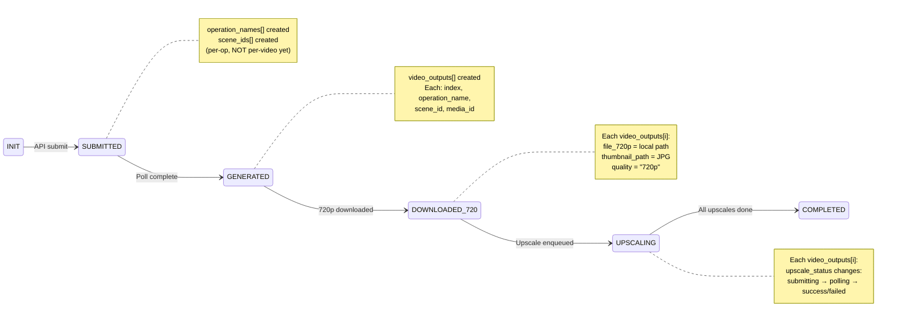

### 10.2 Chi Tiết Mỗi Stage

#### Stage 1: SUBMITTED — Operation IDs Created

Khi API trả về response, engine lưu **danh sách operation_names theo submit order**:

```python
# engine.py — after API submit
task.operation_names = [op1_uuid, op2_uuid, op3_uuid, op4_uuid]
task.scene_ids = [scene1, scene2, scene3, scene4]
task.stage = TaskStage.SUBMITTED
```

> **Lúc này chưa có `video_outputs[]`** — chỉ có parallel lists.

#### Stage 2: GENERATED — VideoOutputInfo Created

Khi poll hoàn tất, engine tạo `VideoOutputInfo` cho **MỌI video** (H1 fix):

```python
# engine.py — after poll complete (H1 fix)
task.video_outputs = []
for i, op_name in enumerate(task.operation_names):
    if op_name in completed_results:
        detail = completed_results[op_name]
        vo = VideoOutputInfo(
            index=i, operation_name=op_name,
            scene_id=task.scene_ids[i],
            media_id=detail["mediaId"],
            quality="pending",
        )
    else:
        vo = VideoOutputInfo(
            index=i, operation_name=op_name,
            scene_id=task.scene_ids[i] if i < len(task.scene_ids) else "",
            media_id="",
            quality="failed",  # ← H1: Mark failed, preserve index
        )
    task.video_outputs.append(vo)
```

> [!TIP]
> **H1 fix đã giải quyết**: `video_outputs[i]` luôn map đến `operation_names[i]`, kể cả khi operation failed. Video failed có `quality="failed"` thay vì bị bỏ qua.

#### Stage 3: DOWNLOADED_720 — Per-Video Files

Download lưu **per-video** với index alignment guaranteed:

```python
# engine.py:3130-3157 — download loop
for i, uri in enumerate(output_uris):
    # Download file...
    if downloaded_ok:
        local_paths.append(str(filepath))
        task.video_outputs[i].file_720p = str(filepath)    # ← PER-VIDEO
        task.video_outputs[i].quality = "720p"              # ← PER-VIDEO
        task.video_outputs[i].thumbnail_path = str(thumb)   # ← PER-VIDEO
    else:
        local_paths.append("")  # ★ Empty string preserves index alignment
```

Index alignment guarantee:
- `local_paths[i]` luôn map đến `video_outputs[i]`
- Download fail → `local_paths[i] = ""` (không bỏ qua index)
- Exceptions → cũng thêm `""` vào `local_paths`

#### Stage 4: UPSCALING — Per-Video Status Tracking

Upscale queue xử lý **từng video riêng lẻ** qua `media_id`:

```python
# upscale_queue.py — Phase 1: Sequential Submit
for local_idx, media_id in enumerate(job.media_ids):
    orig_idx = job.retry_indices[local_idx] if job.retry_indices else local_idx
    # Submit upscale for THIS video
    task.video_outputs[orig_idx].upscale_status = "submitting"  # ← PER-VIDEO
    # ... API call using media_id ...
    task.video_outputs[orig_idx].upscale_status = "polling"     # ← PER-VIDEO
    pending_ops.append((orig_idx, op_name, scene_id, media_id))
```

```python
# upscale_queue.py — Phase 2: Parallel Poll
async def _poll_one(idx, op_name, scene_id, media_id):
    result = await self._engine._poll_upscale(...)
    if result:
        task.video_outputs[idx].upscale_status = "success"  # ← PER-VIDEO
    else:
        task.video_outputs[idx].upscale_status = "failed"   # ← PER-VIDEO
        task.video_outputs[idx].upscale_error = "Poll failed"
```

#### Stage 5: COMPLETED — Per-Video Quality Merge

```python
# upscale_queue.py:745-748 — Phase 3: Merge results
for i in range(len(task.video_outputs)):
    if upscale_paths[i]:
        task.video_outputs[i].file_upscaled = upscale_paths[i]  # ← PER-VIDEO
        task.video_outputs[i].quality = "4K"                     # ← PER-VIDEO
```

### 10.3 Per-Video Upscale Status Transitions

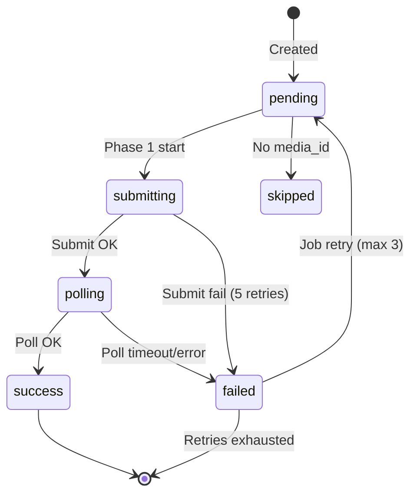

### 10.4 UI Border Colors (Per-Video Visual Feedback)

| `quality` / `upscale_status` | Border Color | Ý nghĩa |
|------------------------------|-------------|---------|
| `quality == "failed"` | 🔴 Red | Download/generation failed |
| `upscale_status == "failed"` | 🔴 Red | Upscale failed |
| `upscale_status in ("submitting", "polling")` | 🟣 Purple | Upscale in progress |
| `quality == "retrying"` | 🟣 Purple | Per-video retry ongoing |
| `quality in ("1080p", "4K")` | 🔵 Blue | Upscale complete |
| `quality == "720p"` | 🟡 Yellow | Base quality only |
| Default | ⚪ Gray | Pending |

---

## 11. Partial Retry — Per-Video Granularity

### 11.1 Prompt Generation Partial Failure

Khi poll phát hiện 1+ ops FAILED trong khi các ops khác SUCCESSFUL:

| Hành động | Chi tiết |
|-----------|---------|
| Log warning | `⚠️ Task X: PARTIAL FAILURE — 3/4 succeeded, 1 failed` |
| Auto-retry | `_auto_retry_partial_failure()` — queue lại các variants failed |
| Continue | Videos succeeded vẫn download + upscale bình thường |

### 11.2 Upscale Partial Retry

Khi một số videos submit upscale OK nhưng một số fail:

```python
# upscale_queue.py:594-621 — Partial retry
if failed_indices and job.retry_count < job.max_retries:
    retry_job = UpscaleJob(
        media_ids=[job.media_ids[i] for i in failed_indices],
        retry_indices=failed_indices,  # ← CHỈ retry video failed
        retry_count=job.retry_count + 1,
    )
    # Reset failed statuses → pending
    for i in failed_indices:
        task.video_outputs[i].upscale_status = "pending"
    # Schedule delayed retry
    asyncio.create_task(_delayed_retry())  # 30×2^n delay
```

> [!TIP]
> **Videos OK vẫn tiếp tục**: Partial retry chạy **song song** với Phase 2 poll của videos đã submit OK. Không cần đợi retry xong mới poll.

### 11.3 Per-Video Replace (Re-generate Single Video)

`Task.replace_target` field cho phép tạo task mới chỉ để **thay thế 1 video** trong task gốc:

```python
# dispatcher.py:154
replace_target: Optional[tuple] = None  # (original_task_id, video_index)
```

---

## 12. Tổng Kết — Trả Lời Câu Hỏi

### ✅ Prompt submit có xử lý từng video đơn lẻ không?

**CÓ, nhưng ở tầng khác nhau:**

| Tầng | Granularity | Giải thích |
|------|-------------|-----------|
| **Submit API** | Per-task (1 API call → 4 videos) | 1 prompt submit tạo 4 ops cùng lúc |
| **Poll** | Per-operation (track từng op riêng) | `pending_ops` dict track từng `operation_name` |
| **Partial failure** | Per-video | Detect + auto-retry individual failed variants |
| **Download** | Per-video | `local_paths[i]` → `video_outputs[i].file_720p` |

### ✅ Upscale có xử lý từng video đơn lẻ không?

**CÓ, hoàn toàn per-video:**

| Phase | Granularity | Giải thích |
|-------|-------------|-----------|
| **Phase 1 Submit** | Per-video | Loop qua `media_ids`, submit 1 tại 1 thời điểm |
| **Phase 1 Status** | Per-video | `upscale_status = "submitting"` / `"polling"` |
| **Phase 2 Poll** | Per-video parallel | Mỗi video poll riêng qua `_poll_one()` |
| **Phase 3 Download** | Per-video | Map `upscale_paths[i]` → `video_outputs[i].file_upscaled` |
| **Partial retry** | Per-video | `retry_indices` chỉ retry videos failed |

### ✅ Các trạng thái có được theo dõi bằng ID cụ thể không?

**CÓ**, mỗi video được identify bằng 3 IDs xuyên suốt pipeline:

| ID | Tạo ở | Dùng ở | Mục đích |
|----|-------|--------|---------|
| `operation_name` | Submit response | Poll, partial retry | Track generation status |
| `scene_id` | Submit response | Poll API request | Scene identification |
| `media_id` | Poll response | Upscale API, re-upscale | Video content reference |

**Lộ trình hoàn thành** được track qua `TaskStage` enum (7 checkpoints) + per-video `quality` + `upscale_status`, cho phép:
1. **Resume from checkpoint** — retry skip giai đoạn đã hoàn thành
2. **Partial retry** — chỉ retry video/operation failed
3. **Per-video UI feedback** — border colors phản ánh trạng thái từng video

> [!TIP]
> **Đã fix (H1)**: Tại stage GENERATED, `video_outputs[]` luôn chứa entries cho **tất cả** operations (bao gồm failed). Video failed có `quality="failed"` và `media_id=""`. Index luôn aligned: `video_outputs[i]` = `operation_names[i]`.

---

## 13. So Sánh Cấu Trúc Gửi: Upscale vs Generate (Prompt Submit)

### 13.1 Thông Tin Bắt Buộc — Generate (Prompt Submit)

Khi gọi `generate_video_t2v()` ([api_client.py:328-381](file:///D:/NEW%20VEO%20PRO%20MAX/veo-pro-max/02%20-%20CLIENT%20-%20VEO%20PRO%20MAX/core/api_client.py#L328-L381)):

```json
{
  "clientContext": {
    "sessionId": ";1740000000000",
    "tool": "PINHOLE",
    "projectId": "uuid-v4",
    "userPaygateTier": "PAYGATE_TIER_TWO",
    "recaptchaContext": {
      "token": "<reCAPTCHA token>",
      "applicationType": "RECAPTCHA_APPLICATION_TYPE_WEB"
    }
  },
  "requests": [
    {
      "aspectRatio": "VIDEO_ASPECT_RATIO_LANDSCAPE",
      "seed": 1234,
      "textInput": {"prompt": "..."},
      "videoModelKey": "veo_3_1_t2v_fast_ultra",
      "metadata": {"sceneId": "uuid-v4"}
    }
  ]
}
```

**Headers** (qua `_build_headers`):

```
Authorization: Bearer {access_token}
Content-Type: text/plain;charset=UTF-8
Origin: https://labs.google
Referer: https://labs.google/
x-browser-channel: stable
x-browser-copyright: Copyright 2026 Google LLC...
x-browser-year: 2026
x-browser-validation: {dynamic}      ← per-account
x-client-data: {dynamic}             ← per-account
                                         ← (x-goog-request-params REMOVED — website does NOT send this header)
```

### 13.2 Thông Tin Bắt Buộc — Upscale

Khi gọi `upscale_video()` ([api_client.py:651-714](file:///D:/NEW%20VEO%20PRO%20MAX/veo-pro-max/02%20-%20CLIENT%20-%20VEO%20PRO%20MAX/core/api_client.py#L651-L714)):

```json
{
  "clientContext": {
    "sessionId": ";1740000000000",
    "recaptchaContext": {
      "token": "<reCAPTCHA token>",
      "applicationType": "RECAPTCHA_APPLICATION_TYPE_WEB"
    }
  },
  "requests": [{
    "aspectRatio": "VIDEO_ASPECT_RATIO_LANDSCAPE",
    "resolution": "VIDEO_RESOLUTION_1080P",
    "seed": 5678,
    "videoInput": {"mediaId": "<protobuf_base64>"},
    "videoModelKey": "veo_3_1_upsampler_1080p",
    "metadata": {"sceneId": "uuid-v4"}
  }]
}
```

**Headers**: Giống generate (cùng `_build_headers`). `x-goog-request-params` đã bị loại bỏ khỏi cả generate và upscale.

### 13.3 Bảng So Sánh Chi Tiết

| Thành phần | **Generate** | **Upscale** | Khác biệt |
|-----------|-------------|------------|-----------|
| **Endpoint** | `/v1/video:batchAsyncGenerateVideoText` | `/v1/video:batchAsyncGenerateVideoUpsampleVideo` | Khác endpoint |
| **clientContext.tool** | ✅ `"PINHOLE"` | ❌ Không có | Upscale không cần |
| **clientContext.projectId** | ✅ UUID (required) | ❌ Không có | Upscale không cần |
| **clientContext.userPaygateTier** | ✅ `"PAYGATE_TIER_TWO"` | ❌ Không có | Upscale không cần |
| **clientContext.recaptchaContext** | ✅ Required | ✅ Required | **Giống** |
| **clientContext.sessionId** | ✅ `;{timestamp_ms}` | ✅ `;{timestamp_ms}` | **Giống** |
| **requests[].textInput** | ✅ `{prompt: "..."}` | ❌ Không có | |
| **requests[].videoInput** | ❌ Không có | ✅ `{mediaId: "..."}` | Upscale cần media_id |
| **requests[].resolution** | ❌ Không có | ✅ `"VIDEO_RESOLUTION_1080P"` | |
| **requests[].videoModelKey** | `"veo_3_1_t2v_fast_ultra"` | `"veo_3_1_upsampler_1080p"` | Model khác |
| **requests count** | **1-4** (multi-request batch) | **1** (single request/video) | Generate batch, upscale single |
| **seed** | Per-request (auto-increment) | Per-request (random) | |
| **sceneId** | Per-request (unique UUID) | Per-request (unique UUID) | **Giống** |
| **aspectRatio** | From task | From task | **Giống** |
| **Authorization** | Bearer {access_token} | Bearer {access_token} | **Giống** |
| **x-browser-*** | Per-account (từ Extension) | Per-account (từ Extension) | **Giống** |
| **Idempotency** | ❌ `x-goog-request-params` đã xóa (website ko dùng) | ❌ Không có | |

> [!WARNING]
> **Khác biệt quan trọng nhất**: Generate dùng **full `clientContext`** (5 fields), Upscale dùng **minimal `clientContext`** (2 fields). Nếu upscale gửi `projectId` hoặc `tool`, server có thể reject hoặc ignore.

### 13.4 Thông Tin Dành Riêng Cho Từng Workflow

| Workflow | Extra fields trong `requests[]` | Nguồn |
|----------|--------------------------------|-------|
| **T2V** | `textInput.prompt` | User input |
| **I2V (single)** | `textInput.prompt` + `startImage.mediaId` | Upload → media_id |
| **I2V (dual)** | `textInput.prompt` + `startImage.mediaId` + `endImage.mediaId` | Upload × 2 |
| **F2V** | Giống I2V single (continuation frame là `startImage`) | Parent video → extract → upload |
| **R2V** | `textInput.prompt` + `referenceImages[{mediaId, imageUsageType}]` | Upload × 1-3 |
| **T2I** | `prompt` + `imageModelName` + `imageAspectRatio` + `imageInputs` | Khác cấu trúc hoàn toàn |
| **Upscale** | `videoInput.mediaId` + `resolution` | Poll response → media_id |

---

## 14. Lưu Trữ & Làm Mới Thông Tin

### 14.1 Nơi Lưu Trữ (Centralized Storage)

Tất cả credentials được lưu trong `AccountManager` → `AccountSession`:

| Credential | Lưu tại | Lifetime | Nguồn ban đầu |
|-----------|---------|----------|---------------|
| `access_token` | `AccountSession.access_token` | **~55 phút** | Login / Extension bridge |
| `token_expires` | `AccountSession.token_expires` | — | Set khi refresh |
| `recaptcha_token` | `AccountSession.recaptcha_token` + `TokenCache` | **~90 giây** | Extension bridge |
| `project_id` | `AccountManager._project_id` | **Session lifetime** | Cached after first fetch |
| `paygate_tier` | `AccountManager._paygate_tier` | **Session lifetime** | Fetched from `/v1/credits` |
| `x-browser-validation` | Per-account dict in Extension bridge | **Session lifetime** | Extension bridge |
| `x-client-data` | Per-account dict in Extension bridge | **Session lifetime** | Extension bridge |
| `media_id` (upscale) | `VideoOutputInfo.media_id` in `Task` | **Permanent** (sau poll) | Poll response |

### 14.2 Thông Tin Cần Làm Mới (Refresh Required)

| Credential | Hết hạn | Cần làm mới khi | Auto-refresh? |
|-----------|---------|-----------------|---------------|
| **access_token** | ~55 phút | `is_token_expired == True` hoặc 5 phút trước hết hạn | ✅ Auto (Extension bridge) |
| **recaptcha_token** | ~90 giây | `needs_recaptcha_refresh == True` hoặc **sau MỖI API call** | ✅ Auto (Extension bridge) |
| **x-browser-validation** | Không hết hạn | Sau browser restart | ✅ Auto (Extension reload tabs) |
| **x-client-data** | Không hết hạn | Sau browser restart | ✅ Auto (Extension reload tabs) |
| **project_id** | Không hết hạn | Không cần refresh | ❌ (cached forever) |
| **paygate_tier** | Không hết hạn | Không cần refresh | ❌ (cached forever) |
| **media_id** | **Không hết hạn** | Không cần refresh | ❌ |
| **image_uri (mediaId)** | **CÓ hết hạn** | Trước mỗi retry submit | ✅ Re-upload from local file |

> [!IMPORTANT]
> **reCAPTCHA là single-use**: Google server tiêu thụ token ở **MỖI request** (thành công hay thất bại). Phải invalidate + refresh trước mỗi API call.

### 14.3 So Sánh Refresh Flow: Generate vs Upscale

#### Generate (Prompt Submit) — Refresh trong `Worker.execute()`

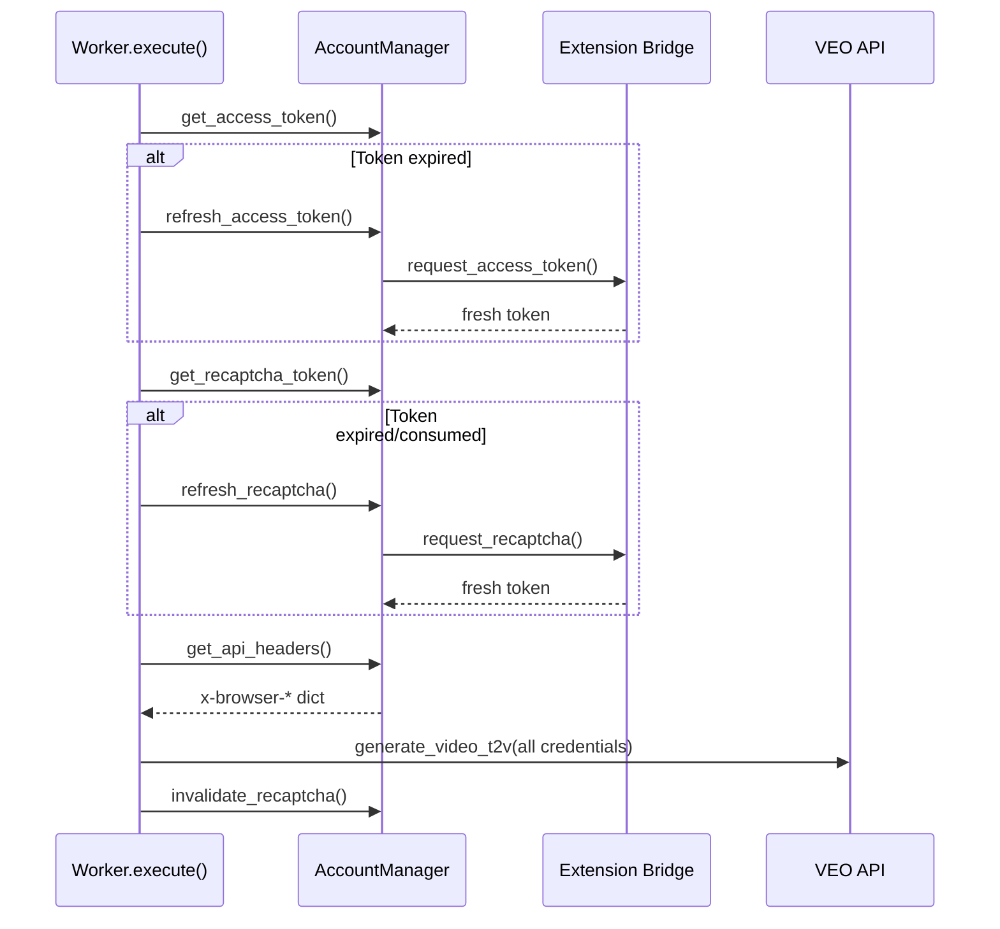

**Gọi bởi**: [worker.py:88-172](file:///D:/NEW%20VEO%20PRO%20MAX/veo-pro-max/02%20-%20CLIENT%20-%20VEO%20PRO%20MAX/core/worker.py#L88-L172)

#### Upscale — Refresh trong `UpscaleQueue._process_single_job()`

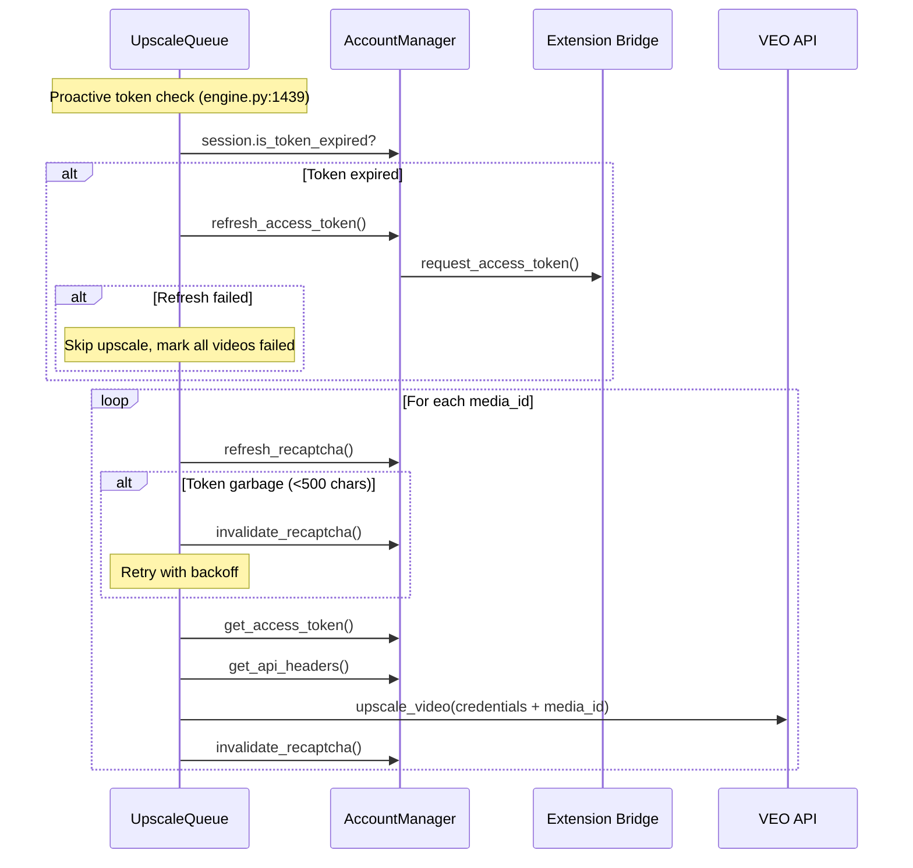

**Gọi bởi**: [upscale_queue.py:394-442](file:///D:/NEW%20VEO%20PRO%20MAX/veo-pro-max/02%20-%20CLIENT%20-%20VEO%20PRO%20MAX/core/upscale_queue.py#L394-L442) và [engine.py:1437-1452](file:///D:/NEW%20VEO%20PRO%20MAX/veo-pro-max/02%20-%20CLIENT%20-%20VEO%20PRO%20MAX/core/engine.py#L1437-L1452)

---

## 15. Module Quy Định & Đánh Giá Tập Trung

### 15.1 Module Nào Quy Định Refresh?

| Credential | **Generate Refresh** | **Upscale Refresh** | **Storage** |
|-----------|---------------------|--------------------|-----------| 
| `access_token` | `Worker.execute()` ([worker.py:110-117](file:///D:/NEW%20VEO%20PRO%20MAX/veo-pro-max/02%20-%20CLIENT%20-%20VEO%20PRO%20MAX/core/worker.py#L110-L117)) | `Engine._poll_operation()` ([engine.py:1439-1452](file:///D:/NEW%20VEO%20PRO%20MAX/veo-pro-max/02%20-%20CLIENT%20-%20VEO%20PRO%20MAX/core/engine.py#L1439-L1452)) | `AccountManager` |
| `recaptcha_token` | `Worker.execute()` ([worker.py:128-140](file:///D:/NEW%20VEO%20PRO%20MAX/veo-pro-max/02%20-%20CLIENT%20-%20VEO%20PRO%20MAX/core/worker.py#L128-L140)) | `UpscaleQueue._process_single_job()` ([upscale_queue.py:414-429](file:///D:/NEW%20VEO%20PRO%20MAX/veo-pro-max/02%20-%20CLIENT%20-%20VEO%20PRO%20MAX/core/upscale_queue.py#L414-L429)) | `AccountManager` |
| `account_headers` | `Worker.execute()` ([worker.py:148](file:///D:/NEW%20VEO%20PRO%20MAX/veo-pro-max/02%20-%20CLIENT%20-%20VEO%20PRO%20MAX/core/worker.py#L148)) | `UpscaleQueue._process_single_job()` ([upscale_queue.py:440](file:///D:/NEW%20VEO%20PRO%20MAX/veo-pro-max/02%20-%20CLIENT%20-%20VEO%20PRO%20MAX/core/upscale_queue.py#L440)) | `AccountManager` |
| `image_uri` re-upload | Engine worker loop ([engine.py:692-738](file:///D:/NEW%20VEO%20PRO%20MAX/veo-pro-max/02%20-%20CLIENT%20-%20VEO%20PRO%20MAX/core/engine.py#L692-L738)) | N/A (upscale dùng media_id) | `Task.image_uris` |
| reCAPTCHA invalidate | Engine worker loop ([engine.py:791](file:///D:/NEW%20VEO%20PRO%20MAX/veo-pro-max/02%20-%20CLIENT%20-%20VEO%20PRO%20MAX/core/engine.py#L791)) | UpscaleQueue ([upscale_queue.py:442](file:///D:/NEW%20VEO%20PRO%20MAX/veo-pro-max/02%20-%20CLIENT%20-%20VEO%20PRO%20MAX/core/upscale_queue.py#L442)) | `AccountManager` |

### 15.2 Đánh Giá: Tập Trung Hay Rời Rạc?

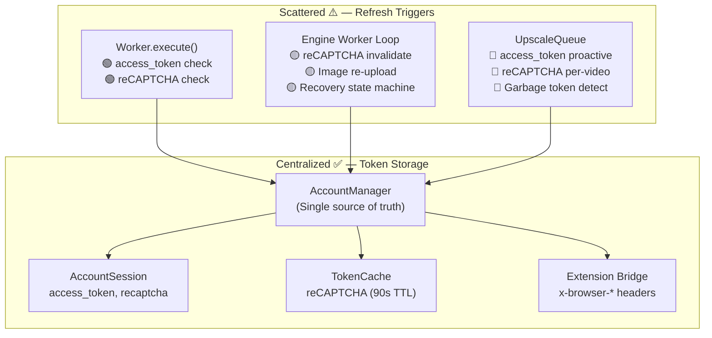

| Khía cạnh | Tập trung? | Chi tiết |
|-----------|-----------|---------|
| **Token storage** | ✅ **Tập trung** | `AccountManager` → `AccountSession` là single source of truth |
| **Refresh API** (how) | ✅ **Tập trung** | `AM.refresh_access_token()`, `AM.refresh_recaptcha()` — logic trong 1 class |
| **Refresh triggers** (when) | ❌ **Rời rạc** | 3 module khác nhau quyết định KHI NÀO gọi refresh |
| **Post-call cleanup** | ❌ **Rời rạc** | `invalidate_recaptcha()` gọi từ 2 nơi (engine + upscale_queue) |
| **Token validation** | ❌ **Rời rạc** | Upscale kiểm tra garbage token (>500 chars), Generate **KHÔNG** kiểm tra |
| **Error recovery** | ❌ **Rời rạc** | Engine có Recovery State Machine 4 phase, Upscale chỉ có browser restart đơn giản |
| **Image re-upload** | ✅ **Tập trung** | Chỉ Engine worker loop xử lý (upscale dùng media_id, không cần re-upload) |

### 15.3 Gaps Đáng Chú Ý

| # | Gap | Ảnh hưởng | Đề xuất |
|---|-----|-----------|---------|
| 1 | **Generate không validate reCAPTCHA quality** | Có thể gửi garbage token (330 chars) → 403 lãng phí | Thêm check `len(token) < 500` vào `Worker.execute()` |
| 2 | **Refresh trigger duplicated** | `access_token` checked ở 2 nơi (worker.execute + engine.py:1439) với logic khác nhau | Merge vào `AccountManager.ensure_valid_token()` |
| 3 | **Invalidate reCAPTCHA scattered** | Gọi từ engine.py:791 và upscale_queue.py:442 | Chuyển vào `_request()` callback sau mỗi API call |
| 4 | **Recovery state machine chỉ cho Generate** | Upscale chỉ có browser restart đơn giản, không escalation | Shared recovery module cho cả 2 pipeline |
| 5 | ~~**Upscale không có idempotency key**~~ | Đã xác nhận website KHÔNG gửi `x-goog-request-params` cho cả generate lẫn upscale. Không cần thêm. | N/A — Not applicable |

---

## 16. Concurrency Model: ĐẠI CHỦ / CHỦ / THẦU / THỢ — Phân Tích Đơn Vị Mới

### 16.1 Bảng Vai Trò Chi Tiết

| Vai trò | Module | Đơn vị | Số lượng | Trách nhiệm chính |
|---------|--------|--------|----------|-------------------|
| **ĐẠI CHỦ** | `MultiAccountManager` | Pool | 1 | Phân phối task groups ra 100+ CHỦ |
| **CHỦ** | `AccountManager` | Account | N (100+) | Quản lý 20 THỢ, sở hữu tài sản (assets) |
| **THẦU** | Worker coroutine | Nhóm 4 THỢ | 5/account | Nhận prompts, phân công THỢ, gọi API |
| **THỢ** | `VideoOutputInfo` | 1 video | 20/account | Xử lý + tracking trạng thái 1 video |

### 16.2 THỢ — Đơn Vị Cơ Bản (1 Video)

Mỗi THỢ quản lý trạng thái **đầy đủ** của 1 video xuyên suốt vòng đời:

```python
@dataclass
class VideoOutputInfo:      # = 1 THỢ
    index: int               # Vị trí trong nhóm (0-3)
    
    # Server-side identifiers (asset thuộc account)
    operation_name: str      # UUID từ API response → poll tiến độ
    scene_id: str            # UUID gửi khi submit → tracking
    media_id: str            # Protobuf Base64 → dùng cho upscale API
    
    # Local files (output)
    file_720p: str           # Đường dẫn video 720p đã download
    file_upscaled: str       # Đường dẫn video 1080p/4K sau upscale
    thumbnail_path: str      # Thumbnail JPG cho UI
    
    # State machine
    quality: str             # "pending" → "720p" → "1080p"/"4K"
    upscale_status: str      # "" → "submitting" → "polling" → "success"/"failed"
    upscale_error: str       # Chi tiết lỗi nếu upscale thất bại
```

**THỢ lifecycle**:
```
pending → [API submit] → operation_name assigned
        → [poll complete] → media_id + file_720p assigned, quality="720p"
        → [upscale submit] → upscale_status="submitting"
        → [upscale poll] → file_upscaled assigned, quality="1080p"/"4K"
```

> [!IMPORTANT]
> **Mỗi THỢ sở hữu dữ liệu server-side** (`operation_name`, `media_id`) **không thể chuyển sang account khác**. Google không cho phép tài khoản A truy cập `media_id` của tài khoản B. Đây là ràng buộc cứng ở cấp API.

### 16.3 THẦU — Quản Lý Nhóm 4 THỢ

**THẦU = 1 coroutine quản lý nhóm cố định 4 THỢ**. THẦU không gắn cứng với 1 prompt — THẦU phân phối prompts vào THỢ linh hoạt:

#### Trường hợp A: 1 prompt × 4 videos (mặc định)
```
THẦU ─┬─ THỢ 0: prompt "A cat" → video 1
       ├─ THỢ 1: prompt "A cat" → video 2
       ├─ THỢ 2: prompt "A cat" → video 3
       └─ THỢ 3: prompt "A cat" → video 4
         1 API call (batch 4 request items)
```

#### Trường hợp B: 4 prompts × 1 video mỗi prompt
```
THẦU ─┬─ THỢ 0: prompt "A cat" → video 1
       ├─ THỢ 1: prompt "A dog" → video 2
       ├─ THỢ 2: prompt "A bird" → video 3
       └─ THỢ 3: prompt "A fish" → video 4
         4 API calls (1 request item each)
```

#### Trường hợp C: Mix — 1 prompt × 3 videos + 1 prompt × 1 video
```
THẦU ─┬─ THỢ 0: prompt "A cat" → video 1
       ├─ THỢ 1: prompt "A cat" → video 2
       ├─ THỢ 2: prompt "A cat" → video 3
       └─ THỢ 3: prompt "A dog" → video 4
         2 API calls (3 items + 1 item)
```

#### Trường hợp D: Prompt 2-video
```
THẦU ─┬─ THỢ 0: prompt "A cat" → video 1
       ├─ THỢ 1: prompt "A cat" → video 2
       ├─ THỢ 2: prompt "A dog" → video 3
       └─ THỢ 3: prompt "A dog" → video 4
         2 API calls (2 items each)
```

**Dữ liệu THẦU quản lý** (hiện tại nằm trên `Task` object):

| Dữ liệu | Scope | Ví dụ |
|----------|-------|-------|
| `prompt` | Per-prompt | "A cat running" |
| `output_count` | Per-prompt | 4 |
| `workflow_type` | Per-prompt | T2V, I2V, R2V |
| `aspect_ratio`, `model`, `seed` | Per-prompt | "16:9", "veo_3_1" |
| `image_uris`, `image_paths` | Per-prompt (I2V) | Upload URIs cho continuation |
| `video_outputs: List[VideoOutputInfo]` | **Per-video** | 4 THỢ tracking |
| `assigned_account` | Per-THẦU | "user@gmail.com" |
| `operation_names` | Per-video (list) | API operation UUIDs |

### 16.4 CHỦ — 1 Account = max 20 THỢ = dynamic THẦU (C1 fix)

CHỦ (`AccountManager`) sở hữu **tài sản** (assets) của 1 Google account.
Số THẦU (coroutines) **tự động scale** theo `account.max_workers` (C1 fix):

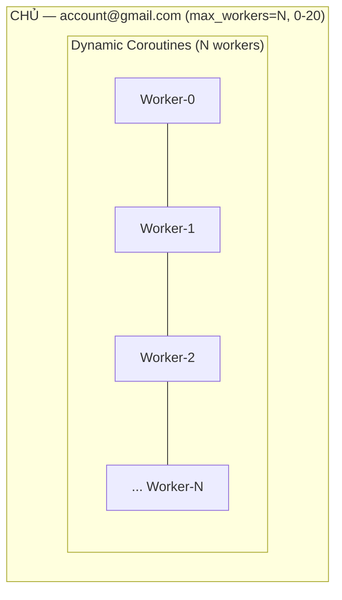

**Tài sản sở hữu bởi CHỦ** (account-specific, KHÔNG thể share):

| Tài sản | Lý do không share | Dùng ở đâu |
|---------|-------------------|------------|
| `access_token` | OAuth token cá nhân | Mọi API call |
| `recaptcha_token` | Gắn với session browser cá nhân | Submit + Upscale |
| `project_id` | Workspace riêng trên Google | Generate |
| `media_id` | Video asset sở hữu bởi account | Upscale, Re-upscale |
| `operation_name` | Job tracking riêng | Poll tiến độ |
| `x-browser-*` headers | Browser fingerprint riêng | Anti-detect |

> [!CAUTION]
> **Account Isolation Constraint**: Google API **từ chối** khi account A cố `poll` hoặc `upscale` asset có `media_id` thuộc account B. Mọi thao tác trên 1 video (tạo mới, poll, download, upscale, re-upscale, retry) **BẮT BUỘC** phải dùng cùng CHỦ (account) đã tạo ra nó.

**Hiện tại đã enforce (một phần)** qua:
- `task.assigned_account` = account đã xử lý task
- `task.required_account` = bắt buộc dùng account này (cho retry/continuation)
- Dispatcher D2: `child.required_account = parent.assigned_account`
- Re-upscale: `_get_account_for_reupscale()` dùng `assigned_account`

### 16.5 ĐẠI CHỦ — Phân Phối 100+ Accounts

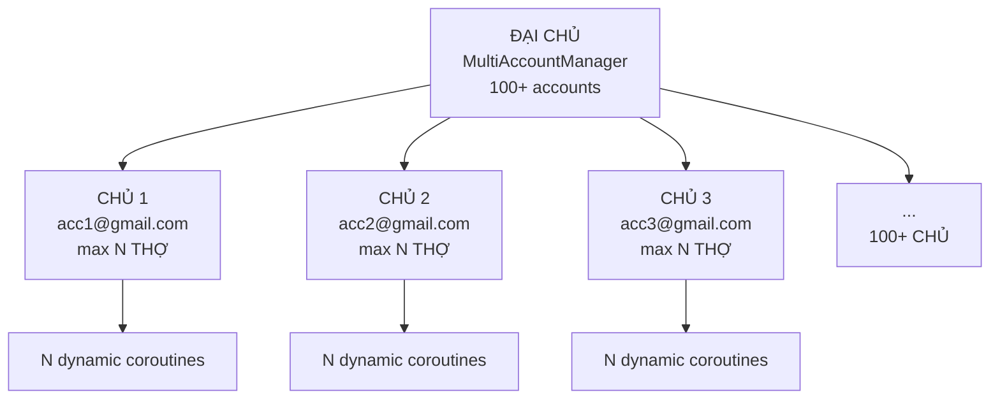

**ĐẠI CHỦ trách nhiệm**:

| Trách nhiệm | Logic hiện tại | Đơn vị mới |
|-------------|---------------|------------|
| Load balancing | Health score (slots, 403, ext) | Health score (workers, 403, ext) |
| Capacity tracking | `N × max_slots` = `N × 5` prompts | `N × max_workers` = `N × 20` videos |
| Account selection | Prefer most `available_slots` | Prefer most `available_workers` |
| Cross-account sharing | `fix_short_client_data()` | Giữ nguyên (headers only, NOT assets) |

**Với 100 accounts**: `100 × 20 = 2000 THỢ` = **2000 videos đồng thời** tiềm năng.

### 16.6 Hệ Thống Phân Cấp: Task Group → Prompt → Video

Trong Queue Tab, user tạo **Task Group** chứa nhiều prompt:

```
Task Group "Nature Videos" (queue tab row)
├── Prompt 1: "A cat running" (output_count=4) → 4 videos
├── Prompt 2: "A dog sleeping" (output_count=4) → 4 videos
├── Prompt 3: "A bird flying" (output_count=2) → 2 videos
└── Prompt 4: "A fish swimming" (output_count=1) → 1 video
                                            Total: 11 videos
```

**ĐẠI CHỦ phân phối prompts cho CHỦ** → **CHỦ phân công THẦU** → **THẦU phân công THỢ**:

```
ĐẠI CHỦ distributes:
├── CHỦ acc1 (20 THỢ available):
│   ├── THẦU 1: Prompt 1 (oc=4) → 4 THỢ busy
│   ├── THẦU 2: Prompt 2 (oc=4) → 4 THỢ busy
│   ├── THẦU 3: Prompt 3 (oc=2) + Prompt 4 (oc=1) → 3 THỢ busy, 1 THỢ idle
│   └── THẦU 4-5: idle (0 THỢ busy)
│   Total: 11/20 THỢ busy
│
├── CHỦ acc2 (20 THỢ available):
│   └── (nhận task group khác)
```

### 16.7 Ràng Buộc Account Isolation Trong Thực Tế

#### Retry (tạo lại)
```
Prompt 1 trên acc1 → video 3 failed
  → Retry task: required_account = "acc1@gmail.com"
  → THẦU trên acc1 pick up → xin 1 THỢ → tạo lại video 3
  ✅ Đúng account → API accept
  ❌ Nếu acc2 pick up → API reject (media_id invalid)
```

#### Upscale
```
Video 2 trên acc1 có media_id = "xyz123"
  → UpscaleQueue: account = acc1 (from assigned_account)
  → Gọi upscale API: access_token=acc1, media_id="xyz123"
  ✅ Đúng account → upscale success
  ❌ Nếu dùng acc2's token → 403 (forbidden)
```

#### Continuation chains
```
Prompt A trên acc1 → video 1 done → extract frame
  → Child prompt B: required_account = "acc1" (D2 injection)
  → continuation_frame_uri thuộc acc1's project
  ✅ Đúng account → frame upload valid
```

### 16.8 So Sánh: Trước vs Sau

| Khía cạnh | Trước (Prompt-Based) | Sau (Video-Based / THỢ) |
|-----------|---------------------|------------------------|
| **Đơn vị đếm** | `max_slots=5` (prompts) | `max_workers=20` (videos/THỢ) |
| **5 prompts oc=4** | 5 slots → 20 videos (hidden) | 5 THẦU × 4 THỢ = 20 workers (explicit) |
| **20 prompts oc=1** | ❌ Can't do (max 5 slots) | 20 THỢ, mỗi THỢ 1 video ✅ |
| **Mixed oc** | ❌ Slots don't differentiate | THẦU linh hoạt phân THỢ ✅ |
| **UI label** | "Workers" (misleading) | "Workers" = THỢ = videos (accurate) |
| **Account isolation** | `assigned_account` (partial) | Enforce at acquire level |
| **Scale 100 accounts** | 100 × 5 = 500 capacity | 100 × 20 = 2000 capacity |

### 16.9 Two-Phase Admission (Giải Quyết Slot-Before-Task)

**Thách thức**: `acquire` TRƯỚC `get_next_task()` — chưa biết `output_count`.

```python
# Phase 1: THẦU xin tạm 1 THỢ
if not account.acquire_workers(1):
    await asyncio.sleep(0.5)
    continue

task = dispatcher.get_next_task()
if not task:
    account.release_workers(1)
    continue

# Phase 2: Biết output_count → xin thêm THỢ
extra = task.output_count - 1
if extra > 0 and not account.acquire_workers(extra):
    account.release_workers(1)
    dispatcher.requeue_task(task)
    continue

task._worker_count = task.output_count  # Track để release đúng
# ... xử lý → release_workers(task._worker_count)
```

### 16.10 Code Impact Summary

| File | Thay đổi | Chi tiết |
|------|----------|---------| 
| [session.py](file:///D:/NEW%20VEO%20PRO%20MAX/veo-pro-max/02%20-%20CLIENT%20-%20VEO%20PRO%20MAX/core/session.py) | `max_slots→max_workers=20`, `active_slots→active_workers`, `acquire_workers(n)`, `release_workers(n)` | Đơn vị mới |
| [account_manager.py](file:///D:/NEW%20VEO%20PRO%20MAX/veo-pro-max/02%20-%20CLIENT%20-%20VEO%20PRO%20MAX/core/account_manager.py) | Delegate `acquire_workers(n)`, `release_workers(n)`, `set_max_workers(n)` cap 0-20 | Thread-safe wrapper |
| [engine.py](file:///D:/NEW%20VEO%20PRO%20MAX/veo-pro-max/02%20-%20CLIENT%20-%20VEO%20PRO%20MAX/core/engine.py) | `MAX_WORKERS_PER_ACCOUNT=20`, two-phase admission, ~15 `release_workers(count)` | Core flow |
| [multi_account.py](file:///D:/NEW%20VEO%20PRO%20MAX/veo-pro-max/02%20-%20CLIENT%20-%20VEO%20PRO%20MAX/core/multi_account.py) | `total_capacity = N × max_workers`, health score dùng `available_workers` | Capacity |
| [task_watchdog.py](file:///D:/NEW%20VEO%20PRO%20MAX/veo-pro-max/02%20-%20CLIENT%20-%20VEO%20PRO%20MAX/core/task_watchdog.py) | `release_workers(task._worker_count)` | Cleanup |
| [tab_settings.py](file:///D:/NEW%20VEO%20PRO%20MAX/veo-pro-max/02%20-%20CLIENT%20-%20VEO%20PRO%20MAX/ui/tabs/tab_settings.py) | SpinBox 0-20, label "Workers" (= THỢ = videos) | UI |
| [page_dashboard.py](file:///D:/NEW%20VEO%20PRO%20MAX/veo-pro-max/02%20-%20CLIENT%20-%20VEO%20PRO%20MAX/ui/tabs/devconsole/page_dashboard.py) | `active_workers/max_workers` | Display |
| [app_controller.py](file:///D:/NEW%20VEO%20PRO%20MAX/veo-pro-max/02%20-%20CLIENT%20-%20VEO%20PRO%20MAX/core/app_controller.py) | `set_max_workers()`, bỏ advisory (enforce via weighted admission) | Controller |
| [profiles_controller.py](file:///D:/NEW%20VEO%20PRO%20MAX/veo-pro-max/02%20-%20CLIENT%20-%20VEO%20PRO%20MAX/core/profiles_controller.py) | `max_workers=20`, serialize | Persistence |

---

## 17. Workflow Pipeline Analysis

All workflows are routed in [Worker._execute_workflow](file:///D:/NEW%20VEO%20PRO%20MAX/veo-pro-max/02%20-%20CLIENT%20-%20VEO%20PRO%20MAX/core/worker.py#L197-L363).

### 17.1 Pipeline Overview

| Workflow | API Method | Response Type | Key Input | Concurrency Note |
|----------|-----------|--------------|-----------|-----------------|
| **T2V** | `generate_video_t2v` | Async (poll) | prompt | Standard pipeline |
| **I2V single** | `generate_video_i2v_single` | Async (poll) | 1 `image_media_id` | Pre-upload required |
| **I2V dual** | `generate_video_i2v_dual` | Async (poll) | start + end `image_media_id` | 2 uploads required |
| **R2V** | `generate_video_r2v` | Async (poll) | Up to 3 `reference_image_media_ids` | Multiple uploads |
| **T2I** | `generate_image` | **Sync** (direct) | `project_id` required | No polling — returns `fifeUrl` directly |
| **I2I** | `generate_image` + `image_inputs` | **Sync** (direct) | `project_id` + reference images | Same as T2I with image inputs |
| **F2V** | `generate_video_i2v_single` | Async (poll) | Extracted frame as `image_media_id` | Account-affinity REQUIRED |

### 17.2 Async vs Sync Response Handling

`Worker._process_response()` handles two response shapes:

- **Async (video)**: Response contains `operations[]` → extract `operation_name` + `scene_id` → poll loop in engine
- **Sync (image)**: Response contains `media[]` or `generatedImages[]` → extract `fifeUrl` directly → no polling

### 17.3 F2V Continuation Pipeline (Most Complex)

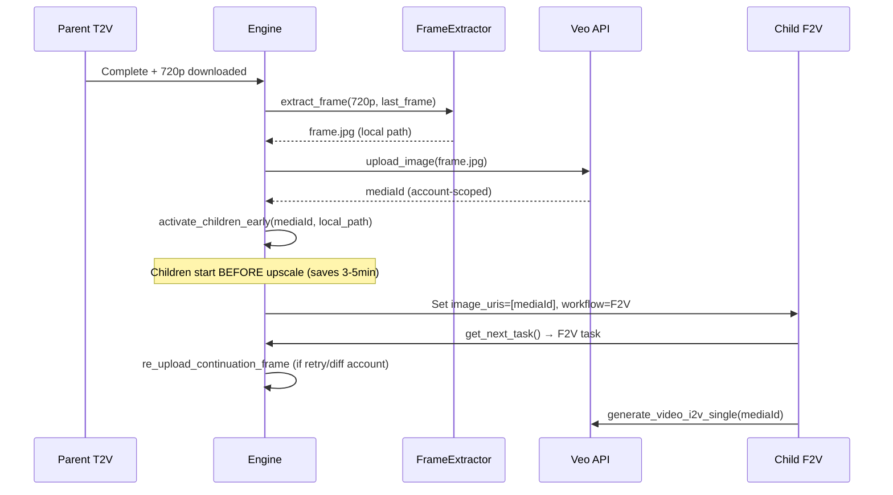

**Concurrency constraints**:
1. **Account affinity**: `task.required_account` forces child to same account (mediaId is account-scoped)
2. **Frame re-upload**: On retry or account switch, `_re_upload_continuation_frame()` re-extracts and re-uploads
3. **Early activation**: Children activated after parent 720p download, NOT after upscale
4. **reCAPTCHA wait**: `_wait_for_recaptcha_ready()` before activating children
5. **Cooldown**: 3-5s random delay between parent completion and child activation

### 17.4 Image Upload Pipeline (I2V, R2V, I2I, F2V)

All image-based workflows require local images to be uploaded to get `mediaId`:

```
Local image → api_client.upload_image() → mediaId (account-scoped)
→ Used in API call body as image_media_id / reference_image_media_ids
```

> [!IMPORTANT]
> `mediaId` values are **account-scoped** — they cannot be reused across different Google accounts.
> On retry with a different account, images must be re-uploaded.

---

## 18. Upscale Queue — Concurrency Issues (Fixed 2026-02-21)

### 18.1 403 Cascade Problem

**Before fix**: UpscaleQueue `_process_job()` submitted immediately without checking `is_account_on_cooldown()`. When multiple upscale jobs ran concurrently:

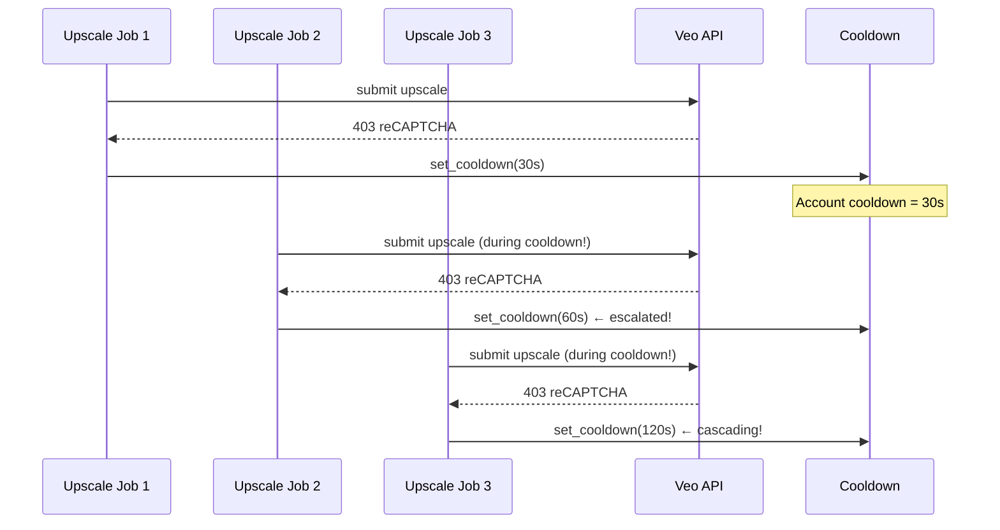

**After fix**: Each upscale job calls `wait_for_cooldown()` BEFORE submitting and BEFORE each retry attempt:

```python
# Before Phase 1 submit
if self._engine.is_account_on_cooldown(job.account_email):
    await self._engine.wait_for_cooldown(job.account_email)

# Inside retry loop
for attempt in range(max_submit_retries):
    if attempt > 0 and self._engine.is_account_on_cooldown(job.account_email):
        await self._engine.wait_for_cooldown(job.account_email)
```

### 18.2 Related Fixes

| Bug | File | Root Cause | Fix |
|-----|------|-----------|-----|
| Cooldown log spam | [engine.py](file:///D:/NEW%20VEO%20PRO%20MAX/veo-pro-max/02%20-%20CLIENT%20-%20VEO%20PRO%20MAX/core/engine.py) | `is_account_on_cooldown()` logged on every call — 14+ concurrent callers | Removed debug log from query method |
| `_account_manager` missing | [app_controller.py](file:///D:/NEW%20VEO%20PRO%20MAX/veo-pro-max/02%20-%20CLIENT%20-%20VEO%20PRO%20MAX/core/app_controller.py) | `_on_readiness_token()` used `self._account_manager` (never assigned on AppController) | Changed to `self._engine._account_manager` |


