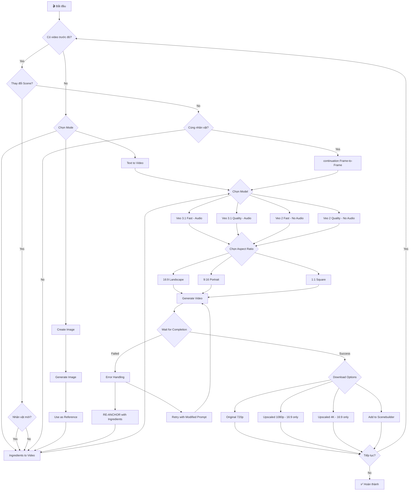

# VEO 3.1 - Production Workflows Guide (COMPLETE)

> [!NOTE]
> Tài liệu này mô tả quy trình **TRÌNH DUYỆT** (Playwright selectors) — dùng làm **tham khảo**.
> Quy trình API chính thức cho từng tab: xem các file `WORKFLOW_TAB_*.md` cùng thư mục.
> Khi implement, **ưu tiên theo `WORKFLOW_TAB_*.md`** (API-first).

> **Version**: 2.2.0 (Added Frames to Video)  
> **Updated**: 2026-01-08 05:00  
> **Purpose**: Step-by-step workflows HOÀN CHỈNH cho mọi tình huống tạo video *(Browser reference)*  
> **Selectors**: See [VEO_SELECTORS.md](./VEO_SELECTORS.md)  
> **Note**: Các tính năng có 🧪 là **BETA** - đang develop/test

---

## 📊 MỤC LỤC TÌNH HUỐNG

| # | Tình huống | Mục đích |
|---|-----------|----------|
| 1 | [TEXT TO VIDEO](#1️⃣-text-to-video-workflow-complete) | Tạo video từ prompt văn bản |
| 2 | [INGREDIENTS MODE](#2️⃣-ingredients-mode-8s---complete-workflow) | Tạo scene mới với reference images |
| 2.5 | [FRAMES TO VIDEO](#2️⃣5️⃣-frames-to-video---complete-workflow) | Tạo video từ ảnh + text prompt |
| 3 | [continuation MODE](#3️⃣-continuation-mode-frame-to-frame---complete-workflow) | Nối tiếp video liền mạch |
| 4 | [CREATE IMAGE → VIDEO](#4️⃣-create-image--video-pipeline) | Tạo ảnh rồi dùng làm ref cho video |
| 5 | [ASPECT RATIO HANDLING](#5️⃣-aspect-ratio-handling) | 16:9, 9:16, 1:1 strategies |
| 6 | [MODEL SELECTION](#6️⃣-model-selection-strategy) | Veo 3.1 vs Veo 2, Audio vs No Audio |
| 7 | [DOWNLOAD/EXPORT](#7️⃣-downloadexport-strategy) | 720p, 1080p, 4K upscaling |
| 8 | [MULTIPLE CHARACTERS](#8️⃣-multiple-characters-in-scene) | 2+ nhân vật trong cùng scene |
| 9 | [NESTED continuation](#9️⃣-nested-continuation-chains) | Extend nhiều lần liên tiếp |
| 10 | [AUDIO SYNC](#🔟-audio-sync-veo-31-beta) | Beta Audio với Veo 3.1 |
| 11 | [CREDIT MANAGEMENT](#1️⃣1️⃣-credit-management) | Tối ưu chi phí credits |

---

## 📊 WORKFLOW OVERVIEW


---

# 1️⃣ TEXT TO VIDEO WORKFLOW (COMPLETE)

## 🎯 Mục đích
Tạo video hoàn toàn từ prompt văn bản, không cần reference images.

## 📋 SELECTOR SEQUENCE - TỪNG BƯỚC

### Phase A: Khởi tạo Project

| Step | Hành động | Selector | Alternative | Wait | Verify |
|------|-----------|----------|-------------|------|--------|
| A1 | Mở trang Flow | Navigate to `https://labs.google/fx/tools/flow` | - | 5000ms | Page loaded |
| A2 | Chờ page load hoàn tất | `waitForLoadState('networkidle')` | - | 10000ms | No spinner |
| A3 | Click "New project" | `button:has-text("New project")` | `button:has(i:contains("add_2"))` | 2000ms | Project page opens |
| A4 | Chờ editor load | `#PINHOLE_TEXT_AREA_ELEMENT_ID` visible | - | 3000ms | Textarea exists |

### Phase B: Chọn Mode & Settings

| Step | Hành động | Selector | Alternative | Wait | Verify |
|------|-----------|----------|-------------|------|--------|
| B1 | Click Mode dropdown | `button[role="combobox"][aria-autocomplete="none"]:first` | `button[role="combobox"]` | 1000ms | Dropdown opens |
| B2 | Chờ dropdown mở | `[role="listbox"]` visible | - | 1000ms | Options visible |
| B3 | Chọn "Text to Video" | `[role="option"]:has-text("Text to Video")` | `[role="option"]:first` | 1000ms | Mode selected |
| B4 | Verify mode đã chọn | `button[role="combobox"]:has-text("Text to Video")` | - | 500ms | Text matches |
| B5 | Click Settings button | `button:has(i:text("tune"))` | `button:has(i:contains("tune"))` | 1000ms | Panel opens |
| B6 | Chờ Settings panel | `div.sc-92c9e477-1` visible | - | 1000ms | Settings visible |

### Phase C: Chọn Model

| Step | Hành động | Selector | Wait | Verify |
|------|-----------|----------|------|--------|
| C1 | Click Model dropdown | `button.sc-4d92f943-4` hoặc `button:has(i:text("volume_up"))` | 1000ms | Dropdown opens |
| C2 | Chờ model list | `[role="listbox"]` visible | 1000ms | Models visible |
| C3a | **Option A**: Veo 3.1 Fast | `[role="option"]:has-text("Veo 3.1 - Fast"):not(:has-text("Lower"))` | 1000ms | Has Beta Audio |
| C3b | **Option B**: Veo 3.1 Quality | `[role="option"]:has-text("Veo 3.1 - Quality")` | 1000ms | Higher quality |
| C3c | **Option C**: Veo 2 Fast | `[role="option"]:has-text("Veo 2 - Fast")` | 1000ms | No Audio |
| C4 | Verify model badge | `div.sc-4d92f943-7.eEuxTt` | 500ms | Model name shown |

### Phase D: Chọn Aspect Ratio

| Step | Hành động | Selector | Wait | Verify |
|------|-----------|----------|------|--------|
| D1 | Tìm Aspect Ratio dropdown | `button[role="combobox"]:has(span:text("Aspect Ratio"))` | 500ms | Button found |
| D2 | Click dropdown | Click selector above | 1000ms | Options appear |
| D3a | **16:9 Landscape** | `[role="option"]:has-text("Landscape (16:9)")` | 500ms | For horizontal |
| D3b | **9:16 Portrait** | `[role="option"]:has-text("Portrait (9:16)")` | 500ms | For vertical |
| D3c | **1:1 Square** | `[role="option"]:has-text("Square")` | 500ms | For square |
| D4 | Verify icon | `i.google-symbols:text("crop_16_9")` hoặc `crop_9_16` | 500ms | Icon matches |

### Phase E: Chọn Outputs Per Prompt

| Step | Hành động | Selector | Wait | Verify |
|------|-----------|----------|------|--------|
| E1 | Tìm Outputs dropdown | `button[role="combobox"]:has(span:text("Outputs per prompt"))` | 500ms | Button found |
| E2 | Click dropdown | Click selector above | 1000ms | Options appear |
| E3a | **1 output** | `[role="option"]:text("1")` | 500ms | Single video |
| E3b | **2 outputs** | `[role="option"]:text("2")` | 500ms | 2 variations |
| E3c | **3 outputs** | `[role="option"]:text("3")` | 500ms | 3 variations |
| E3d | **4 outputs** | `[role="option"]:text("4")` | 500ms | Max variations |
| E4 | Close Settings | Click outside hoặc `Escape` | 500ms | Panel closes |

### Phase F: Nhập Prompt

| Step | Hành động | Selector | Wait | Verify |
|------|-----------|----------|------|--------|
| F1 | Focus vào textarea | `#PINHOLE_TEXT_AREA_ELEMENT_ID` | 500ms | Cursor in field |
| F2 | Clear existing text | `Ctrl+A` → `Delete` | 200ms | Field empty |
| F3 | Type prompt | `.type(promptText)` | depends | Text appears |
| F4 | **Optional**: Expand | `button:has(i:text("pen_spark"))` | 2000ms | Prompt enhanced |
| F5 | Verify prompt | Check textarea value | 500ms | Text correct |

### Phase G: Generate Video

| Step | Hành động | Selector | Alternative | Wait | Verify |
|------|-----------|----------|-------------|------|--------|
| G1 | Click Create button | `button:has(i:text("arrow_forward"))` | `button:has(i:contains("arrow_forward")):first` | 1000ms | Generation starts |
| G2 | Chờ progress indicator | Text match: `/^(\d+)%$/` | `div.sc-f4cc5495-3` (legacy) | poll 2s | Shows percentage |
| G3 | Poll progress | Check percentage trong DOM text | Loop until 100% hoặc timeout | max 180s | Until 100% |
| G4 | Verify completion | `video` element visible | `video[src]` | 2000ms | Video ready |

### Phase H: Download Video

| Step | Hành động | Selector | Wait | Verify |
|------|-----------|----------|------|--------|
| H1 | Hover video card | `div.sc-20145656-0` | 500ms | Buttons appear |
| H2 | Click Download button | `button[aria-haspopup="menu"]:has(i:text("download"))` | 1000ms | Menu opens |
| H3 | Chờ download menu | `[role="menu"]` visible | 500ms | Options visible |
| H4a | **Original 720p** | `[role="menuitem"]:has-text("Original size")` | 1000ms | Download starts |
| H4b | **Upscaled 1080p** | `[role="menuitem"]:has-text("Upscaled (1080p)")` | 1000ms | Only 16:9 |
| H4c | **Upscaled 4K** | `[role="menuitem"]:has-text("Upscaled (4K")` | 1000ms | Only 16:9 |
| H5 | Wait download complete | Browser download event | 10000ms | File saved |

---

# 2️⃣ INGREDIENTS MODE (8s) - COMPLETE WORKFLOW

## 🎯 Mục đích
- Tạo scene hoàn toàn mới
- Giới thiệu nhân vật mới
- RE-ANCHOR (neo lại phong cách)
- Thay đổi bối cảnh/setting

## 📋 SELECTOR SEQUENCE - TỪNG BƯỚC

### Phase A: Chọn Mode Ingredients

| Step | Hành động | Selector | Wait | Verify |
|------|-----------|----------|------|--------|
| A1 | Click Mode dropdown | `button[role="combobox"]` | 1000ms | Dropdown opens |
| A2 | Chờ dropdown | `[role="listbox"]` visible | 1000ms | Options visible |
| A3 | Chọn Ingredients | `[role="option"]:has-text("Ingredients to Video")` | 1000ms | Mode selected |
| A4 | Verify mode | `button[role="combobox"]:has-text("Ingredients to Video")` | 500ms | Text matches |

### Phase B: Upload Reference Image 1 (CHARACTER)

| Step | Hành động | Selector | Wait | Verify |
|------|-----------|----------|------|--------|
| B1 | Tìm Add button đầu tiên | `button.sc-d02e9a37-1.hvUQuN:has(i:text("add"))` | 500ms | Button found |
| B2 | Click Add button | Click selector above | 500ms | File dialog waiting |
| B3 | Upload file | `input[type="file"]` → setInputFiles() | 2000ms | File selected |
| B4 | Chờ upload hoàn thành | `img[src*="blob:"]` hoặc `img.sc-59d42f9d-3` | 3000ms | Image visible |
| B5 | Verify Image 1 | Image element exists | 500ms | Upload success |

### Phase C: Upload Reference Image 2 (SETTING)

| Step | Hành động | Selector | Wait | Verify |
|------|-----------|----------|------|--------|
| C1 | Click Add button tiếp theo | `button.sc-d02e9a37-1.hvUQuN:has(i:text("add"))` (2nd) | 500ms | Button found |
| C2 | Upload file | `input[type="file"]` → setInputFiles() | 2000ms | File selected |
| C3 | Chờ upload | `img[src*="blob:"]` count = 2 | 3000ms | 2 images visible |
| C4 | Verify Image 2 | Second image element exists | 500ms | Upload success |

### Phase D: Upload Reference Image 3 (STYLE)

| Step | Hành động | Selector | Wait | Verify |
|------|-----------|----------|------|--------|
| D1 | Click Add button thứ 3 | `button.sc-d02e9a37-1.hvUQuN:has(i:text("add"))` (3rd) | 500ms | Button found |
| D2 | Upload file | `input[type="file"]` → setInputFiles() | 2000ms | File selected |
| D3 | Chờ upload | `img[src*="blob:"]` count = 3 | 3000ms | 3 images visible |
| D4 | Verify Image 3 | Third image element exists | 500ms | Upload complete |

### Phase E: Count & Verify All Ingredients

| Step | Hành động | Selector | Wait | Verify |
|------|-----------|----------|------|--------|
| E1 | Count uploaded images | `document.querySelectorAll('img.sc-59d42f9d-3').length` | 500ms | Returns 3 |
| E2 | Verify all visible | All 3 images have src attribute | 500ms | All loaded |

### Phase F: Configure Settings (Same as Text to Video Phase C-E)

| Step | Hành động | Selector | Wait | Verify |
|------|-----------|----------|------|--------|
| F1 | Click Settings | `button:has(i:text("tune"))` | 1000ms | Panel opens |
| F2 | Select Model | Veo 3.1 Fast preferred | 1000ms | Model set |
| F3 | Select Aspect Ratio | Based on reference images | 1000ms | Ratio set |
| F4 | Select Outputs | 1-4 based on need | 500ms | Outputs set |
| F5 | Close Settings | Click outside | 500ms | Panel closes |

### Phase G: Enter Prompt

| Step | Hành động | Selector | Wait | Verify |
|------|-----------|----------|------|--------|
| G1 | Focus textarea | `#PINHOLE_TEXT_AREA_ELEMENT_ID` | 500ms | Cursor active |
| G2 | Type prompt | `.type(ingredientPrompt)` | depends | Text appears |
| G3 | Verify prompt | Check textarea value | 500ms | Prompt entered |

### Phase H: Generate & Wait

| Step | Hành động | Selector | Wait | Verify |
|------|-----------|----------|------|--------|
| H1 | Click Create | `button:has(i:text("arrow_forward"))` | 1000ms | Generation starts |
| H2 | Wait progress | `div.sc-f4cc5495-3` | 5000ms | Percentage shows |
| H3 | Poll until complete | Loop every 5000ms | max 180000ms | 100% or video |
| H4 | Verify video | `video` element visible | 2000ms | Generation done |

### Phase I: Add to Scene or Download

| Step | Hành động | Selector | Wait | Verify |
|------|-----------|----------|------|--------|
| I1a | **Add to Scene** | `button:has(i:text("transition_push"))` | 1000ms | Added to timeline |
| I1b | **Download** | `button[aria-haspopup="menu"]:has(i:text("download"))` | 1000ms | Download menu |
| I2 | Complete action | Finish add/download | 2000ms | Action done |

---

# 2️⃣5️⃣ FRAMES TO VIDEO - COMPLETE WORKFLOW

## 🎯 Mục đích
- Tạo video từ 1-nhiều ảnh reference + text prompt
- Khác với Ingredients: tập trung vào frame-by-frame sequence
- Thích hợp cho animation từ storyboard
- Hỗ trợ swap frames để thay đổi thứ tự

## 📋 SELECTOR SEQUENCE - TỪNG BƯỚC

### Phase A: Chọn Frames to Video Mode

| Step | Hành động | Selector | Wait | Verify |
|------|-----------|----------|------|--------|
| A1 | Click Mode dropdown | `button[role="combobox"][aria-autocomplete="none"]:first` | 1000ms | Dropdown opens |
| A2 | Chờ dropdown | `[role="listbox"]` visible | 1000ms | Options visible |
| A3 | Chọn Frames to Video | `[role="option"]:has-text("Frames to Video")` | 1000ms | Mode selected |
| A4 | Verify mode | `button[role="combobox"]:has-text("Frames to Video")` | 500ms | Text matches |

### Phase B: Upload Frame Images

| Step | Hành động | Selector | Wait | Verify |
|------|-----------|----------|------|--------|
| B1 | Click Add Frame | `button:has(i:text("add"))` | 500ms | File dialog |
| B2 | Upload first frame | `input[type="file"]` → setInputFiles() | 2000ms | Frame 1 visible |
| B3 | Wait processing | Spinner disappears | 5000ms | Image processed |
| B4 | Repeat for more frames | Same as B1-B3 | - | Multiple frames |

### Phase C: (Optional) Swap Frames

| Step | Hành động | Selector | Wait | Verify |
|------|-----------|----------|------|--------|
| C1 | Click Swap button | `button:has(i:text("swap_horiz"))` | 500ms | Swap mode |
| C2 | Reorder frames | Drag/drop or click | 1000ms | Order changed |

### Phase D: Configure Settings

| Step | Hành động | Selector | Wait | Verify |
|------|-----------|----------|------|--------|
| D1 | Click Settings | `button:has(i:text("tune"))` | 500ms | Panel opens |
| D2 | Select Aspect Ratio | Standard aspect ratio flow | 500ms | Ratio set |
| D3 | Select Model | `[role="option"]:has-text("Veo 3.1 - Fast")` | 500ms | Model set |
| D4 | Close Settings | Click outside | 500ms | Panel closes |

### Phase E: Enter Prompt

| Step | Hành động | Selector | Wait | Verify |
|------|-----------|----------|------|--------|
| E1 | Focus textarea | `#PINHOLE_TEXT_AREA_ELEMENT_ID` | 500ms | Cursor active |
| E2 | Type prompt | `.type(framePrompt)` | depends | Text appears |
| E3 | Verify placeholder | `placeholder="Generate a video with text and frames…"` | - | Frame mode |

### Phase F: Generate & Wait

| Step | Hành động | Selector | Wait | Verify |
|------|-----------|----------|------|--------|
| F1 | Click Create | `button:has(i:text("arrow_forward"))` | 1000ms | Generation starts |
| F2 | Wait progress | Text-based `^(\d+)%$` regex | 5000ms | Percentage shows |
| F3 | Poll until complete | Loop every 2000ms | max 180000ms | 100% or video |
| F4 | Verify video | `video` element visible | 2000ms | Generation done |

### Phase G: Download

| Step | Hành động | Selector | Wait | Verify |
|------|-----------|----------|------|--------|
| G1 | Click Download | `button[aria-haspopup="menu"]:has(i:text("download"))` | 1000ms | Menu opens |
| G2 | Select quality | Standard download flow | 1000ms | Download starts |

---

# 3️⃣ continuation MODE (Frame-to-Frame) - COMPLETE WORKFLOW

## 🎯 Mục đích
- Giữ nguyên cùng scene background
- Tiếp tục action liền mạch
- Tạo smooth transition
- Duy trì cùng nhân vật

## 📋 SELECTOR SEQUENCE - TỪNG BƯỚC

### Phase A: Chuyển sang Scenebuilder

| Step | Hành động | Selector | Wait | Verify |
|------|-----------|----------|------|--------|
| A1 | Kiểm tra có video | `video` element exists | 500ms | Video available |
| A2 | Click Scenebuilder tab | `button:text("Scenebuilder")` | 2000ms | Tab switches |
| A3 | Chờ timeline load | `.sc-7b0386d1-0` visible | 2000ms | Timeline visible |
| A4 | Verify clip in timeline | `.sc-962285be-5` count >= 1 | 500ms | At least 1 clip |

### Phase B: Move Playhead to End

| Step | Hành động | Selector | Wait | Verify |
|------|-----------|----------|------|--------|
| B1 | Tìm playhead slider | `span[role="slider"].sc-605710a8-2` | 500ms | Slider found |
| B2 | Get current position | `.getAttribute('aria-valuenow')` | 200ms | Current value |
| B3 | Drag to end (100%) | Click at end position | 500ms | Playhead moves |
| B4 | Verify at end | `aria-valuenow === '100'` hoặc near end | 500ms | At end position |
| B5 | Alternative: Click last frame | Click on last clip | 500ms | Position at end |

### Phase C: Click Extend (+) Button

| Step | Hành động | Selector | Wait | Verify |
|------|-----------|----------|------|--------|
| C1 | Tìm Extend button | `button.sc-605710a8-5.sc-605710a8-6:has(i:text("add"))` hoặc `button[id^='radix-']:has-text("add")` | 500ms | Button found |
| C2 | Click Extend | Click selector above | 1500ms | Extend mode opens |
| C3 | Chờ frame capture UI | Frame input area visible | 1000ms | UI ready |

### Phase D: Last Frame Auto-Captured

| Step | Hành động | Selector | Wait | Verify |
|------|-----------|----------|------|--------|
| D1 | Chờ frame preview | `img.sc-59d42f9d-3` visible | 2000ms | Frame captured |
| D2 | Verify frame image | Image has valid src | 500ms | Frame loaded |
| D3 | Optional: Click "Last Frame" | `button.sc-d02e9a37-1.hvUQuN` (last-of-type) | 1000ms | For manual capture |

### Phase E: Mode Already Frames to Video

| Step | Hành động | Selector | Wait | Verify |
|------|-----------|----------|------|--------|
| E1 | Check mode auto-set | `button[role="combobox"]` contains "Frames" | 500ms | Mode correct |
| E2 | If not, click dropdown | `button[role="combobox"]` | 1000ms | Dropdown opens |
| E3 | Select Frames to Video | `[role="option"]:has-text("Frames to Video")` | 1000ms | Mode set |

### Phase F: Enter Continuation Prompt

| Step | Hành động | Selector | Wait | Verify |
|------|-----------|----------|------|--------|
| F1 | Focus textarea | `#PINHOLE_TEXT_AREA_ELEMENT_ID` | 500ms | Cursor active |
| F2 | Clear if needed | `Ctrl+A` → `Delete` | 200ms | Field clear |
| F3 | Type continuation prompt | `.type(continuationPrompt)` | depends | Text appears |
| F4 | Use template: | "Continue the scene: [action]. Camera [movement]." | - | Best practice |

### Phase G: Verify Create Button Enabled

| Step | Hành động | Selector | Wait | Verify |
|------|-----------|----------|------|--------|
| G1 | Check Create enabled | `button.sc-408537d4-2:not([disabled])` | 500ms | Not disabled |
| G2 | If disabled, check: | Frame captured + Prompt entered | 500ms | All requirements |
| G3 | Wait if still disabled | Retry check every 500ms | 3000ms | Until enabled |

### Phase H: Generate Extended Clip

| Step | Hành động | Selector | Wait | Verify |
|------|-----------|----------|------|--------|
| H1 | Click Create | `button.sc-408537d4-2:not([disabled])` | 1000ms | Generation starts |
| H2 | Wait progress | `div.sc-f4cc5495-3` or similar | 5000ms | Percentage shows |
| H3 | Poll until complete | Loop every 5000ms | max 180000ms | 100% complete |
| H4 | Verify new clip | `.sc-962285be-5` count increased | 2000ms | New clip in timeline |

### Phase I: Verify Timeline Updated

| Step | Hành động | Selector | Wait | Verify |
|------|-----------|----------|------|--------|
| I1 | Check total duration | `div.sc-5a42c7b0-0:has-text("/")` | 500ms | Duration increased |
| I2 | Count clips | `.sc-962285be-5` count | 500ms | More clips now |
| I3 | Play preview | `button:has(i:text("play_arrow"))` | 500ms | Plays smoothly |

---

# 4️⃣ CREATE IMAGE → VIDEO PIPELINE

## 🎯 Mục đích
Sử dụng Nano Banana Pro để tạo ảnh chất lượng cao, sau đó dùng ảnh làm reference cho video generation.

## 📋 PHASE 1: TẠO ẢNH VỚI NANO BANANA PRO

### Step A: Chọn Create Image Mode

| Step | Hành động | Selector | Wait | Verify |
|------|-----------|----------|------|--------|
| A1 | Click Mode dropdown | `button[role="combobox"]` | 1000ms | Dropdown opens |
| A2 | Select Create Image | `[role="option"]:has-text("Create Image")` | 1000ms | Mode changed |
| A3 | Verify mode | `button[role="combobox"]:has-text("Create Image")` | 500ms | Mode correct |

### Step B: Configure Image Settings

| Step | Hành động | Selector | Wait | Verify |
|------|-----------|----------|------|--------|
| B1 | Click Settings | `button:has(i:text("tune"))` | 1000ms | Panel opens |
| B2 | Click Model dropdown | Model button in settings | 1000ms | Options show |
| B3a | Select Imagen 4 | `[role="option"]:has-text("Imagen 4")` | 500ms | Best quality |
| B3b | Select Nano Banana Pro | `[role="option"]:has-text("Nano Banana Pro")` | 500ms | Pro features |
| B4 | Set Aspect Ratio | Same as target video ratio | 1000ms | Ratio matched |
| B5 | Set Outputs | `[role="option"]:text("4")` recommended | 500ms | 4 variations |
| B6 | Close Settings | Click outside | 500ms | Panel closes |

### Step C: Enter Image Prompt

| Step | Hành động | Selector | Wait | Verify |
|------|-----------|----------|------|--------|
| C1 | Focus textarea | `#PINHOLE_TEXT_AREA_ELEMENT_ID` | 500ms | Cursor in |
| C2 | Type image prompt | `.type(imagePrompt)` | depends | Text appears |
| C3 | Include: character, setting, style, lighting | Detailed description | - | Best practice |

### Step D: Generate Images

| Step | Hành động | Selector | Wait | Verify |
|------|-----------|----------|------|--------|
| D1 | Click Create | `button:has(i:text("arrow_forward"))` | 1000ms | Generation starts |
| D2 | Wait for images | Poll progress | 30000ms | Images appear |
| D3 | Verify image cards | `div.sc-6349d8ef-0` count >= 1 | 2000ms | Images generated |

### Step E: Switch to Images Tab

| Step | Hành động | Selector | Wait | Verify |
|------|-----------|----------|------|--------|
| E1 | Find Images tab | `button:has-text("Images")` | 500ms | Tab found |
| E2 | Click Images tab | Click selector above | 1000ms | Tab switches |
| E3 | Verify active | `button[data-state="on"]:has-text("Images")` | 500ms | Tab active |

### Step F: Download Best Image

| Step | Hành động | Selector | Wait | Verify |
|------|-----------|----------|------|--------|
| F1 | Hover on best image | `div.sc-6349d8ef-0` first/best | 500ms | Buttons appear |
| F2 | Click Download | `button[aria-haspopup="menu"]:has(i:text("download"))` | 1000ms | Menu opens |
| F3 | Select resolution | `[role="menuitem"]:has-text("Download 4K")` | 1000ms | Highest quality |
| F4 | Wait download | Browser download event | 5000ms | File saved |
| F5 | Save file path | Record downloaded file location | - | For next phase |

## 📋 PHASE 2: SỬ DỤNG ẢNH LÀM REFERENCE CHO VIDEO

### Step G: Switch to Ingredients Mode

| Step | Hành động | Selector | Wait | Verify |
|------|-----------|----------|------|--------|
| G1 | Click Mode dropdown | `button[role="combobox"]` | 1000ms | Dropdown opens |
| G2 | Select Ingredients | `[role="option"]:has-text("Ingredients to Video")` | 1000ms | Mode changed |
| G3 | Verify mode | Mode button shows "Ingredients" | 500ms | Mode correct |

### Step H: Upload Generated Image as Reference

| Step | Hành động | Selector | Wait | Verify |
|------|-----------|----------|------|--------|
| H1 | Click Add ingredient | `button.sc-d02e9a37-1.hvUQuN:has(i:text("add"))` | 500ms | Upload ready |
| H2 | Upload downloaded image | `input[type="file"]` → saved file path | 2000ms | Image uploaded |
| H3 | Verify upload | `img[src*="blob:"]` visible | 2000ms | Image shows |

### Step I: Complete Video Generation

| Step | Hành động | Selector | Wait | Verify |
|------|-----------|----------|------|--------|
| I1 | Add more refs if needed | Repeat upload for character/style | 2000ms | All refs ready |
| I2 | Enter video prompt | `#PINHOLE_TEXT_AREA_ELEMENT_ID` | 1000ms | Prompt ready |
| I3 | Click Create | `button:has(i:text("arrow_forward"))` | 1000ms | Generation starts |
| I4 | Wait completion | Poll progress | 180000ms | Video done |

---

# 5️⃣ ASPECT RATIO HANDLING

## 🎯 Các tình huống Aspect Ratio khác nhau

### 📐 16:9 LANDSCAPE WORKFLOW

| Step | Hành động | Selector | Wait | Verify |
|------|-----------|----------|------|--------|
| 1 | Open Settings | `button:has(i:text("tune"))` | 1000ms | Panel opens |
| 2 | Find Aspect dropdown | `button[role="combobox"]:has(span:text("Aspect Ratio"))` | 500ms | Button found |
| 3 | Click dropdown | Click above | 1000ms | Options show |
| 4 | Select Landscape | `[role="option"]:has-text("Landscape (16:9)")` | 500ms | Selected |
| 5 | Verify icon | `i.google-symbols:text("crop_16_9")` | 500ms | Icon shows |
| 6 | Close Settings | Click outside | 500ms | Closed |
| 7 | **BONUS**: Upscale available | 1080p và 4K upscale | - | 16:9 only! |

### 📐 9:16 PORTRAIT WORKFLOW

| Step | Hành động | Selector | Wait | Verify |
|------|-----------|----------|------|--------|
| 1 | Open Settings | `button:has(i:text("tune"))` | 1000ms | Panel opens |
| 2 | Find Aspect dropdown | `button[role="combobox"]:has(span:text("Aspect Ratio"))` | 500ms | Button found |
| 3 | Click dropdown | Click above | 1000ms | Options show |
| 4 | Select Portrait | `[role="option"]:has-text("Portrait (9:16)")` | 500ms | Selected |
| 5 | Verify icon | `i.google-symbols:text("crop_9_16")` | 500ms | Icon shows |
| 6 | Close Settings | Click outside | 500ms | Closed |
| 7 | **NOTE**: No Upscale | Chỉ có Original 720p | - | Limitation! |

### 📐 1:1 SQUARE WORKFLOW

| Step | Hành động | Selector | Wait | Verify |
|------|-----------|----------|------|--------|
| 1 | Open Settings | `button:has(i:text("tune"))` | 1000ms | Panel opens |
| 2 | Find Aspect dropdown | `button[role="combobox"]:has(span:text("Aspect Ratio"))` | 500ms | Button found |
| 3 | Click dropdown | Click above | 1000ms | Options show |
| 4 | Select Square | `[role="option"]:has-text("Square")` | 500ms | Selected |
| 5 | Verify icon | `i.google-symbols:text("crop_square")` | 500ms | Icon shows |
| 6 | Close Settings | Click outside | 500ms | Closed |

### ⚠️ ASPECT RATIO COMPATIBILITY MATRIX

| Feature | 16:9 | 9:16 | 1:1 |
|---------|:----:|:----:|:---:|
| Original 720p | ✅ | ✅ | ✅ |
| Animated GIF | ✅ | ✅ | ✅ |
| Upscaled 1080p | ✅ | ❌ | ❌ |
| Upscaled 4K | ✅ | ❌ | ❌ |
| Scenebuilder | ✅ | ❌ | ❌ |

---

# 6️⃣ MODEL SELECTION STRATEGY

## 🎯 Chọn Model phù hợp cho từng mục đích

### MODEL: VEO 3.1 - FAST

| Step | Hành động | Selector | Wait | Verify |
|------|-----------|----------|------|--------|
| 1 | Open Settings | `button:has(i:text("tune"))` | 1000ms | Panel opens |
| 2 | Click Model button | `button.sc-4d92f943-4` hoặc `button:has(i:text("volume_up"))` | 1000ms | Dropdown opens |
| 3 | Find Veo 3.1 Fast | `[role="option"]:has-text("Veo 3.1 - Fast")` | 500ms | Option found |
| 4 | Check NOT Lower Priority | `:not(:has-text("Lower"))` | 200ms | Higher priority |
| 5 | Click to select | Click selector step 3 | 500ms | Selected |
| 6 | Verify Beta Audio badge | `[role="option"]:has-text("Beta Audio")` | 500ms | Has audio |
| 7 | Verify model badge | `div.sc-4d92f943-7.eEuxTt:has-text("Veo 3.1")` | 500ms | Shows correctly |

**Use when**: Nhanh, có audio, chất lượng tốt

### MODEL: VEO 3.1 - QUALITY

| Step | Hành động | Selector | Wait | Verify |
|------|-----------|----------|------|--------|
| 1 | Open Settings | `button:has(i:text("tune"))` | 1000ms | Panel opens |
| 2 | Click Model button | `button.sc-4d92f943-4` | 1000ms | Dropdown opens |
| 3 | Select Veo 3.1 Quality | `[role="option"]:has-text("Veo 3.1 - Quality")` | 500ms | Selected |
| 4 | Verify Beta Audio | Has "Beta Audio" badge | 500ms | Audio enabled |
| 5 | Close Settings | Click outside | 500ms | Closed |

**Use when**: Cần chất lượng cao nhất, thời gian không gấp

### MODEL: VEO 2 - FAST (NO AUDIO)

| Step | Hành động | Selector | Wait | Verify |
|------|-----------|----------|------|--------|
| 1 | Open Settings | `button:has(i:text("tune"))` | 1000ms | Panel opens |
| 2 | Click Model button | `button.sc-4d92f943-4` | 1000ms | Dropdown opens |
| 3 | Select Veo 2 Fast | `[role="option"]:has-text("Veo 2 - Fast")` | 500ms | Selected |
| 4 | Verify No Audio badge | `[role="option"]:has-text("No Audio")` | 500ms | No audio |
| 5 | Close Settings | Click outside | 500ms | Closed |

**Use when**: Không cần audio, tốc độ nhanh

### MODEL: VEO 2 - QUALITY (NO AUDIO)

| Step | Hành động | Selector | Wait | Verify |
|------|-----------|----------|------|--------|
| 1 | Open Settings | `button:has(i:text("tune"))` | 1000ms | Panel opens |
| 2 | Click Model button | `button.sc-4d92f943-4` | 1000ms | Dropdown opens |
| 3 | Select Veo 2 Quality | `[role="option"]:has-text("Veo 2 - Quality")` | 500ms | Selected |
| 4 | Verify No Audio | Has "No Audio" badge | 500ms | No audio |
| 5 | Close Settings | Click outside | 500ms | Closed |

**Use when**: Chất lượng cao, sẽ thêm audio sau

### 📊 MODEL COMPARISON

| Model | Speed | Quality | Audio | Credits | Best For |
|-------|-------|---------|-------|---------|----------|
| Veo 3.1 Fast | ⚡⚡⚡ | ⭐⭐⭐ | ✅ Beta | 10 | General use |
| Veo 3.1 Quality | ⚡ | ⭐⭐⭐⭐⭐ | ✅ Beta | 15 | Final production |
| Veo 2 Fast | ⚡⚡⚡⚡ | ⭐⭐ | ❌ | 8 | Draft/testing |
| Veo 2 Quality | ⚡⚡ | ⭐⭐⭐⭐ | ❌ | 12 | Add audio later |

---

# 7️⃣ DOWNLOAD/EXPORT STRATEGY

## 🎯 Các tùy chọn download và export

### DOWNLOAD SINGLE VIDEO

| Step | Hành động | Selector | Wait | Verify |
|------|-----------|----------|------|--------|
| 1 | Hover trên video card | `div.sc-20145656-0.ekxBaW` | 500ms | Buttons appear |
| 2 | Click Download button | `button[aria-haspopup="menu"]:has(i:text("download"))` | 1000ms | Menu opens |
| 3 | Wait menu | `[role="menu"]` visible | 500ms | Options show |

### DOWNLOAD OPTIONS

| Option | Selector | Resolution | Size | 16:9 | 9:16 |
|--------|----------|------------|------|:----:|:----:|
| Animated GIF | `[role="menuitem"]:has-text("Animated GIF")` | 270p | ~5MB | ✅ | ✅ |
| Original | `[role="menuitem"]:has-text("Original size")` | 720p | ~15MB | ✅ | ✅ |
| Upscaled 1080p | `[role="menuitem"]:has-text("Upscaled (1080p)")` | 1080p | ~40MB | ✅ | ❌ |
| Upscaled 4K | `[role="menuitem"]:has-text("Upscaled (4K")` | 4K | ~100MB | ✅ | ❌ |

### DOWNLOAD 1080p UPSCALED (16:9 ONLY)

| Step | Hành động | Selector | Wait | Verify |
|------|-----------|----------|------|--------|
| 1 | Open download menu | `button[aria-haspopup="menu"]:has(i:text("download"))` | 1000ms | Menu opens |
| 2 | Click Upscaled 1080p | `[role="menuitem"]:has-text("Upscaled (1080p)")` | 1000ms | Processing |
| 3 | Wait upscale process | May take 10-30s | 30000ms | Download starts |
| 4 | Wait download complete | Browser download event | 60000ms | File saved |

### DOWNLOAD 4K UPSCALED (16:9 ONLY)

| Step | Hành động | Selector | Wait | Verify |
|------|-----------|----------|------|--------|
| 1 | Open download menu | `button[aria-haspopup="menu"]:has(i:text("download"))` | 1000ms | Menu opens |
| 2 | Check 4K option | `[role="menuitem"]:has-text("Upscaled (4K")` visible | 500ms | Available |
| 3 | Note credit cost | Shows "XX credits" | - | Cost info |
| 4 | Click 4K option | `[role="menuitem"]:has-text("Upscaled (4K")` | 1000ms | Processing |
| 5 | Wait upscale | May take 30-60s | 60000ms | Download starts |
| 6 | Wait download | Large file ~100MB | 120000ms | Complete |

### EXPORT FROM SCENEBUILDER (FULL TIMELINE)

| Step | Hành động | Selector | Wait | Verify |
|------|-----------|----------|------|--------|
| 1 | Go to Scenebuilder | `button:text("Scenebuilder")` | 2000ms | Timeline view |
| 2 | Check all clips ready | All `.sc-962285be-5` have videos | 1000ms | All loaded |
| 3 | Find Download button | `button:has-text("Download")` in timeline area | 500ms | Button found |
| 4 | Click Download | Click above | 1000ms | Export starts |
| 5 | Wait compilation | May take 1-5 minutes | 300000ms | Processing |
| 6 | Download merged video | Browser download event | 60000ms | Single file |

---

# 8️⃣ MULTIPLE CHARACTERS IN SCENE

## 🎯 Xử lý scene có 2+ nhân vật

### STRATEGY 1: Separate Reference Images

| Step | Hành động | Selector | Wait | Verify |
|------|-----------|----------|------|--------|
| 1 | Switch to Ingredients mode | `[role="option"]:has-text("Ingredients to Video")` | 1000ms | Mode set |
| 2 | Upload Char 1 image | First add button → Character A | 2000ms | Image 1 |
| 3 | Upload Char 2 image | Second add button → Character B | 2000ms | Image 2 |
| 4 | Upload Scene/Style | Third add button → Background/Style | 2000ms | Image 3 |
| 5 | Verify 3 images | `img[src*="blob:"]` count = 3 | 500ms | All uploaded |

### PROMPT TEMPLATE FOR MULTIPLE CHARACTERS

```
Two characters in the scene:
- [Character A description] on the [left/right]
- [Character B description] on the [left/right]
They are [interaction/action].
Camera: [shot type], [movement]
Style: [visual style], [lighting]
```

### Step-by-Step Multiple Characters

| Step | Hành động | Selector | Wait | Notes |
|------|-----------|----------|------|-------|
| 1 | Upload Char A ref | Add button 1 | 2000ms | Main character |
| 2 | Upload Char B ref | Add button 2 | 2000ms | Secondary char |
| 3 | Upload Scene ref | Add button 3 | 2000ms | Background |
| 4 | Write multi-char prompt | `#PINHOLE_TEXT_AREA_ELEMENT_ID` | 1000ms | Include both chars |
| 5 | Describe positions | "on the left", "on the right" | - | Spatial clarity |
| 6 | Describe interaction | "talking to", "looking at" | - | Relationship |
| 7 | Generate | Click Create | 5000ms | Start |
| 8 | Review consistency | Check both characters match refs | - | Quality check |
| 9 | Regenerate if needed | Adjust prompt/refs | - | Iterate |

### MAINTAINING CONSISTENCY ACROSS CLIPS

| Step | Hành động | Selector | Wait | Notes |
|------|-----------|----------|------|-------|
| 1 | Save working refs | Download best frame | - | For future use |
| 2 | Use same refs | Consistent uploads | - | Same 3 images |
| 3 | Similar prompts | Use template | - | Copy structure |
| 4 | continuation for same scene | Frame-to-frame | - | Best continuity |
| 5 | RE-ANCHOR periodically | INGREDIENTS mode | - | Reset style |

---

# 9️⃣ NESTED continuation CHAINS

## 🎯 Extend video nhiều lần liên tiếp

### continuation CHAIN: Video 1 → 2 → 3 → 4...

| Step | Hành động | Selector | Wait | Verify |
|------|-----------|----------|------|--------|
| 1 | **Generate Video 1** | Text to Video hoặc Ingredients | 120000ms | First clip |
| 2 | Go to Scenebuilder | `button:text("Scenebuilder")` | 2000ms | Timeline |
| 3 | Move playhead to end | `span[role="slider"]` to 100% | 500ms | At end |
| 4 | Click Extend | `button.sc-605710a8-5:has(i:text("add"))` | 1500ms | Extend UI |
| 5 | Frame auto-captured | `img.sc-59d42f9d-3` | 2000ms | Frame 1 last |
| 6 | Enter prompt 2 | `#PINHOLE_TEXT_AREA_ELEMENT_ID` | 1000ms | Continue |
| 7 | Generate Video 2 | `button.sc-408537d4-2` | 120000ms | Second clip |
| 8 | Verify 2 clips | `.sc-962285be-5` count = 2 | 2000ms | Both in timeline |
| 9 | Move to end of Video 2 | Playhead slider | 500ms | At new end |
| 10 | Click Extend again | `button.sc-605710a8-5:has(i:text("add"))` | 1500ms | Extend UI |
| 11 | Frame from Video 2 | `img.sc-59d42f9d-3` | 2000ms | Frame 2 last |
| 12 | Enter prompt 3 | `#PINHOLE_TEXT_AREA_ELEMENT_ID` | 1000ms | Continue |
| 13 | Generate Video 3 | `button.sc-408537d4-2` | 120000ms | Third clip |
| 14 | **REPEAT** for 4, 5, 6... | Same pattern | - | Chain continues |

### RE-ANCHOR FREQUENCY GUIDE

| Chain Length | RE-ANCHOR Strategy |
|--------------|-------------------|
| 1-3 clips | No re-anchor needed |
| 4-5 clips | Consider RE-ANCHOR if style drifts |
| 6+ clips | RE-ANCHOR every 5 clips recommended |

### RE-ANCHOR MID-CHAIN

| Step | Hành động | Selector | Wait | Notes |
|------|-----------|----------|------|-------|
| 1 | Detect style drift | Visual comparison | - | Compare to clip 1 |
| 2 | Extract current frame | Download frame from menu | 2000ms | Reference |
| 3 | Switch to Ingredients | `[role="option"]:has-text("Ingredients")` | 1000ms | Mode change |
| 4 | Upload original refs | Same as clip 1 | 6000ms | 3 images |
| 5 | Add extracted frame | As 4th reference | 2000ms | Current state |
| 6 | Prompt: "maintain exact style" | Explicit instruction | 1000ms | Anchor |
| 7 | Generate anchored clip | Create | 120000ms | Style reset |
| 8 | Continue continuation from here | Resume chaining | - | Fresh anchor |

---

# 🔟 AUDIO SYNC (VEO 3.1 BETA)

## 🎯 Làm việc với Beta Audio của Veo 3.1

### ENABLE AUDIO GENERATION

| Step | Hành động | Selector | Wait | Verify |
|------|-----------|----------|------|--------|
| 1 | Open Settings | `button:has(i:text("tune"))` | 1000ms | Panel opens |
| 2 | Click Model dropdown | `button.sc-4d92f943-4` | 1000ms | Dropdown opens |
| 3 | Find Veo 3.1 options | Models with "Beta Audio" badge | 500ms | Audio models |
| 4 | Select Veo 3.1 Fast | `[role="option"]:has-text("Veo 3.1 - Fast")` | 500ms | Has audio |
| 5 | Verify Beta Audio badge | Badge visible next to model | 500ms | Audio enabled |
| 6 | Close Settings | Click outside | 500ms | Closed |

### AUDIO-OPTIMIZED PROMPTS

| Prompt Element | Example | Purpose |
|---------------|---------|---------|
| Sound describing | "with splashing water sounds" | Explicit audio |
| Environment | "in a busy street with city sounds" | Ambient audio |
| Action sounds | "footsteps on gravel" | Sync audio |
| Dialog hint | "speaking to someone" | Voice potential |
| Music style | "upbeat background music" | Background |

### VERIFY AUDIO IN OUTPUT

| Step | Hành động | Selector | Wait | Verify |
|------|-----------|----------|------|--------|
| 1 | Wait generation complete | Video appears | - | Done |
| 2 | Find video element | `video` | 500ms | Found |
| 3 | Play video | `button:has(i:text("play_arrow"))` | 500ms | Playing |
| 4 | Check volume button | `button[aria-label='Adjust volume']` | 500ms | Audio control |
| 5 | Unmute if needed | Click volume button | 500ms | Audio plays |
| 6 | Verify audio waveform | Sound from video | - | Audio works |

### NO AUDIO FALLBACK

| Step | Hành động | Selector | Wait | Notes |
|------|-----------|----------|------|-------|
| 1 | If no audio needed | Select Veo 2 | 1000ms | Faster |
| 2 | Download video | Original or upscaled | - | Video only |
| 3 | Add audio in post | External editor | - | More control |
| 4 | Or use text-to-speech | For vocals | - | Sync later |

---

# 1️⃣1️⃣ CREDIT MANAGEMENT

## 🎯 Tối ưu chi phí credits

### CHECK CURRENT CREDITS

| Step | Hành động | Selector | Wait | Verify |
|------|-----------|----------|------|--------|
| 1 | Click ULTRA badge | `button:text("ULTRA")` | 1000ms | Panel opens |
| 2 | Find Credits display | `div:has-text("Credits")` | 500ms | Shows balance |
| 3 | Read credit count | Next element after "Credits" | 200ms | Number visible |

### CREDIT COST BY MODEL

| Model | Cost per Generation | Notes |
|-------|-------------------|-------|
| Veo 3.1 - Fast | 10 credits | Best value with audio |
| Veo 3.1 - Quality | 15 credits | Highest quality |
| Veo 2 - Fast | 8 credits | Cheapest video |
| Veo 2 - Quality | 12 credits | Good balance |
| 4K Upscale | Extra credits | Check tooltip |

### CREDIT INFO IN SETTINGS

| Step | Hành động | Selector | Wait | Verify |
|------|-----------|----------|------|--------|
| 1 | Open Settings | `button:has(i:text("tune"))` | 1000ms | Panel opens |
| 2 | Find credit text | `span.sc-92c9e477-4.kBVKmx` | 500ms | Shows cost |
| 3 | Read cost info | "Each generation uses X credits" | 200ms | Cost visible |
| 4 | Click info link | `a.sc-92c9e477-3.jjyNqd` | 1000ms | More info |

### CREDIT OPTIMIZATION STRATEGIES

| Strategy | Action | Savings |
|----------|--------|---------|
| Draft với Veo 2 Fast | Test prompts first | 2 credits/gen |
| 1 output for testing | Set outputs to 1 | 3x savings |
| Final với Veo 3.1 | Only for approved | Quality when needed |
| Batch similar scenes | continuation instead of new | Same credits, more content |
| Skip failed generations | Don't retry bad prompts | 100% savings |

### LOW CREDIT WARNING WORKFLOW

| Step | Hành động | Selector | Wait | Notes |
|------|-----------|----------|------|-------|
| 1 | Check credits before batch | ULTRA panel | 1000ms | Know balance |
| 2 | Calculate needed credits | Jobs × cost per model | - | Plan ahead |
| 3 | Prioritize important jobs | High priority first | - | Get best content |
| 4 | Use cheaper models for drafts | Veo 2 Fast | - | Save credits |
| 5 | Top up if needed | Visit subscription page | - | Add credits |

---

# 📊 DECISION FLOWCHART (COMPLETE)



---

# 📋 QUICK REFERENCE TABLES

## Selector Quick Reference

| Action | Selector |
|--------|----------|
| New Project | `button:has-text("New project")` |
| Mode Dropdown | `button[role="combobox"]` |
| Text to Video | `[role="option"]:has-text("Text to Video")` |
| Ingredients | `[role="option"]:has-text("Ingredients to Video")` |
| Frames to Video | `[role="option"]:has-text("Frames to Video")` |
| Create Image | `[role="option"]:has-text("Create Image")` |
| Settings | `button:has(i:text("tune"))` |
| Add Ingredient | `button.sc-d02e9a37-1.hvUQuN:has(i:text("add"))` |
| Prompt Input | `#PINHOLE_TEXT_AREA_ELEMENT_ID` |
| Create Button | `button:has(i:text("arrow_forward"))` |
| Progress | `div.sc-f4cc5495-3` |
| Download | `button[aria-haspopup="menu"]:has(i:text("download"))` |
| Scenebuilder | `button:text("Scenebuilder")` |
| Extend | `button.sc-605710a8-5:has(i:text("add"))` |
| Playhead | `span[role="slider"].sc-605710a8-2` |
| Add to Scene | `button:has(i:text("transition_push"))` |

## Timing Quick Reference

| Action | Wait Time |
|--------|-----------|
| Page Load | 10,000ms |
| Mode Change | 1,500ms |
| Settings Panel | 1,000ms |
| Dropdown Open | 1,000ms |
| Image Upload | 3,000ms |
| Generation Start | 5,000ms |
| Generation Poll | every 5,000ms |
| Generation Max | 180,000ms |
| Download Start | 2,000ms |
| Upscale Process | 30-60,000ms |

---

*Production Workflow Guide v2.1.0 (Verified & Fixed) - Complete Coverage*  
*Based on VEO 3.1 Workflow Diagram + All Selectors from VEO_SELECTORS.md*

---

# 🧪 BETA FEATURES (from Chrome Extension Analysis)

> **Những tính năng dưới đây đang được phát triển/test dựa trên phân tích Chrome Extension.**
> Xem chi tiết tại: `06_Review/WORKFLOW_LOGIC_ANALYSIS.md`

---

## 🧪 12. RETRY MECHANISM (BETA)

### Mô tả
Thay vì fail ngay khi có lỗi, hệ thống sẽ tự động retry với số lần có thể config.

### Parameters
| Param | Type | Default | Mô tả |
|:---|:---|:---|:---|
| `maxRetries` | number | 5 | Số lần retry tối đa cho mỗi prompt |
| `retryDelay` | number | 2000ms | Thời gian chờ giữa các lần retry |

### Logic Flow
```
IF error AND retryCount < maxRetries:
    retryCount++
    re-queue prompt to pending list
    wait retryDelay
    retry from beginning
ELSE:
    mark as failed
    continue to next prompt
```

### Selector để check cần Retry
- Error indicator: `[class*="error"]` hoặc text "error"
- Failed state: Không có progress trong 30s
- Network error: `navigator.onLine === false`

---

## 🧪 13. CONCURRENT PROCESSING (BETA)

### Mô tả
Xử lý nhiều prompts song song thay vì tuần tự để tăng tốc độ.

### Parameters
| Param | Type | Default | Mô tả |
|:---|:---|:---|:---|
| `concurrentPrompts` | number | 2 | Số prompts xử lý song song |
| `promptDelaySeconds` | number | 0 | Delay giữa các prompts khởi tạo |

### Worker Pattern
```javascript
// Tạo N workers song song
const workers = [];
for (let i = 0; i < concurrentPrompts; i++) {
    workers.push(processPromptWorker());
}
await Promise.all(workers);
```

### Lock Mechanism
- Dùng `isLock` flag để tránh race condition khi lấy prompt từ queue
- Mỗi worker chỉ lấy 1 prompt tại 1 thời điểm

---

## 🧪 14. CANCEL/PAUSE WORKFLOW (BETA)

### Mô tả
Cho phép dừng workflow giữa chừng mà không mất dữ liệu đã xử lý.

### Cancel Checkpoints
Các vị trí an toàn để cancel (không gây corrupt data):

| Phase | Checkpoint | An toàn Cancel? |
|:---|:---|:---|
| Phase A | Sau khi tạo project | ✅ YES |
| Phase B-E | Sau khi upload mỗi ảnh | ✅ YES |
| Phase F | Sau khi nhập prompt | ✅ YES |
| Phase G | **Trong khi generating** | ⚠️ WARNING - Đợi xong |
| Phase H | Sau khi download | ✅ YES |

### Implementation
```javascript
// Check này xuất hiện tại mọi checkpoint
if (isCancelling) {
    return { success: false, cancelled: true };
}
```

### State Preservation
- `results[]`: Lưu kết quả của các prompts đã xử lý
- `processedCount`: Đếm số prompts đã hoàn thành
- `pendingIndexes`: Danh sách prompts còn chờ

---

## 🧪 15. IMAGE CROP WORKFLOW (BETA)

### Mô tả
Workflow mới để crop/resize ảnh sau khi upload, đảm bảo aspect ratio đúng.

### Áp dụng cho
- Scenario 2: Ingredients Mode  
- Scenario 4: Image to Video

### Selector Sequence

| Step | Hành động | Selector | Wait |
|:---|:---|:---|:---|
| 1 | Click Crop ratio button | `button:has(i:contains("crop_"))` | 500ms |
| 2 | Chờ ratio options | `div[data-radix-select-viewport] > div[role="option"]` | 500ms |
| 3a | Chọn 16:9 | `:last` trong options list | 500ms |
| 3b | Chọn 9:16 | `:first` trong options list | 500ms |
| 4 | Click Crop confirm | `button:has(i:contains("crop")):last` | 500ms |
| 5 | Chờ processing | Poll until `i:contains("progress_activity")` hidden | max 60s |

---

## 🧪 16. FLEXIBLE TIMING (BETA)

### Mô tả
Thay vì hardcode timing, dùng polling với dynamic timeout.

### Old (Hardcode):
```
Wait 5000ms
```

### New (Dynamic):
```
Poll every 2s until:
  - Element appears, OR
  - Max timeout reached, OR
  - Cancelled
```

### Recommended Polling Pattern
| Action | Poll Interval | Max Timeout |
|:---|:---|:---|
| Wait for dropdown | 100ms | 5s |
| Wait for upload | 500ms | 30s |
| Wait for generation | 2000ms | 180s |
| Wait for download | 1000ms | 60s |

---

## CHANGELOG v2.1.0

| Change | Section | Description |
|:---|:---|:---|
| ✅ Fixed | Phase A | Added alternative selector for "New Project" button |
| ✅ Fixed | Phase B | Added `aria-autocomplete="none"` to mode dropdown |
| ✅ Fixed | Phase G | Changed progress detection từ CSS class sang text regex |
| ➕ Added | All tables | Added "Alternative" column for fallback selectors |
| 🧪 Beta | Section 12 | Retry Mechanism |
| 🧪 Beta | Section 13 | Concurrent Processing |
| 🧪 Beta | Section 14 | Cancel/Pause Workflow |
| 🧪 Beta | Section 15 | Image Crop Workflow |
| 🧪 Beta | Section 16 | Flexible Timing |
| ➕ Added | Section 2.5 | **Frames to Video** workflow (v2.2.0) |

