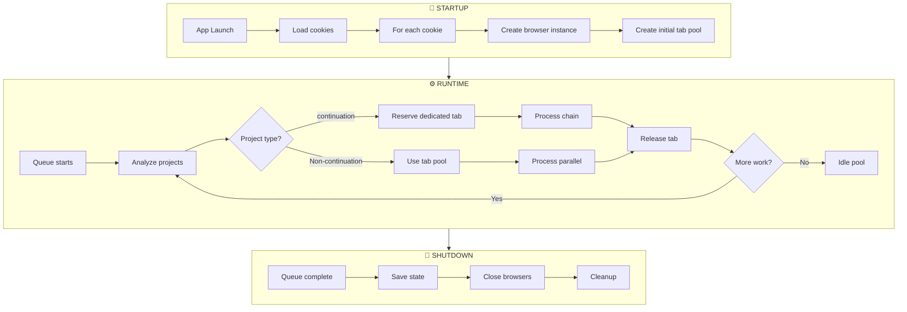
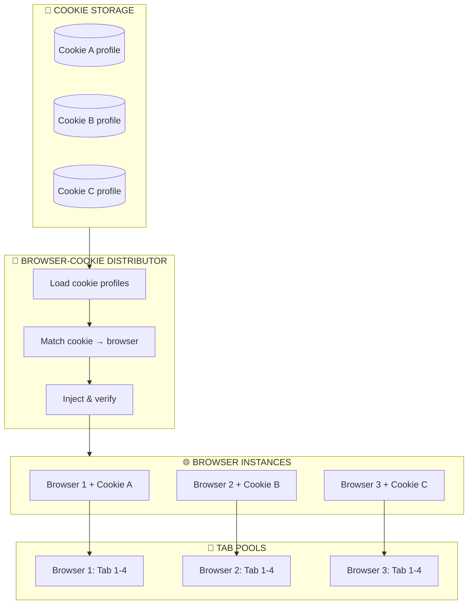
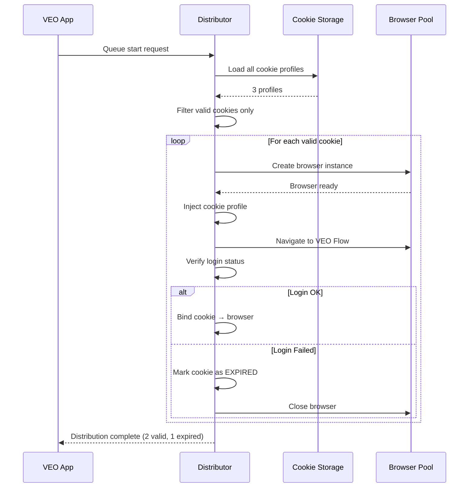
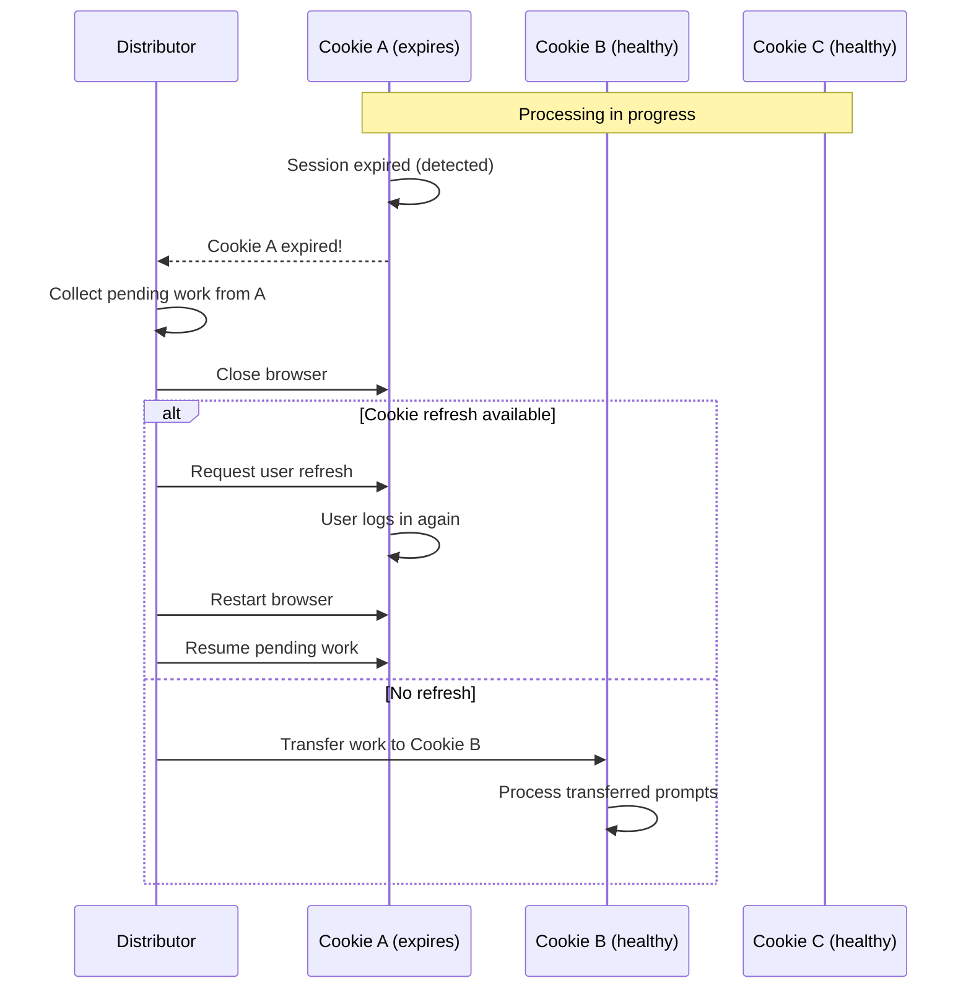
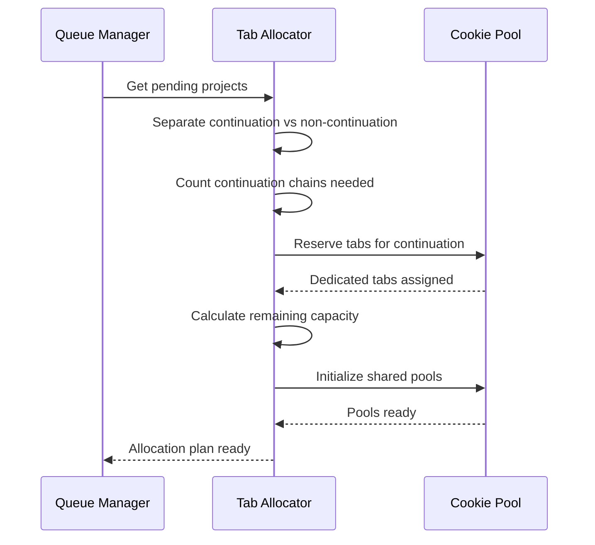
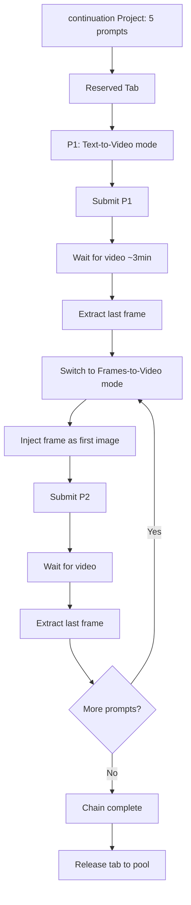
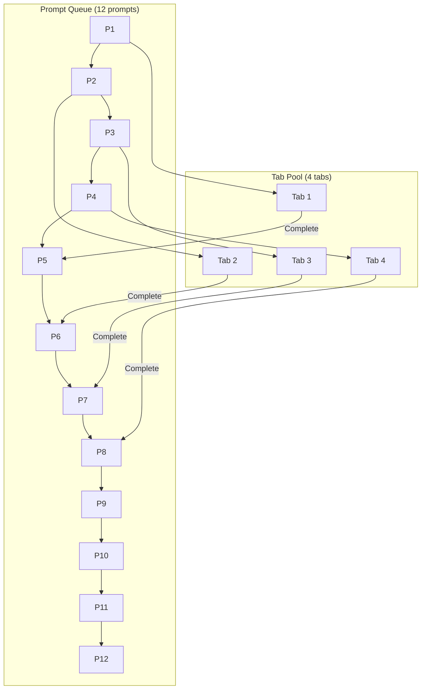
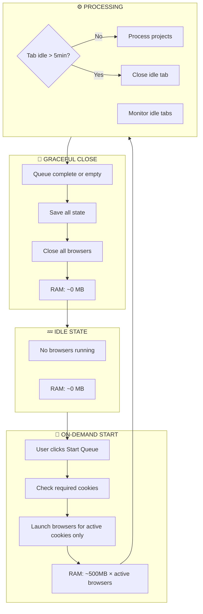
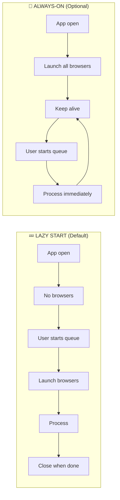

# 🌐 WORKFLOW: Browser Session Management

## Tổng quan

Workflow vận hành quản lý browser tabs dựa trên project type, tối ưu hóa cho cả continuation (sequential) và Non-continuation (parallel) workloads.

> **Note (2026-02-07)**: VEO Pro Max hỗ trợ **Dual Login System**:
> - **🔑 OAuth Login**: Quick, token-based, Plan/Credits hiện sau video đầu tiên
> - **🌐 Browser Login**: Full session, Plan/Credits hiện ngay
> - **Chrome thật** (không phải Chromium) để session ổn định hơn
> - **Headless mode** cho refresh session (không mở browser)
> 
> Chi tiết xem: [ACCOUNT_SESSION_MANAGEMENT.md](../03_Backend/ACCOUNT_SESSION_MANAGEMENT.md#12-dual-login-system-new---2026-02-06)

---

## 🎯 Session Lifecycle



---

## 🍪 Browser-Cookie Distribution

> **Phân phối browsers và inject cookies tương ứng cho các scenario sản xuất đa luồng.**

### Distribution Architecture



### Cookie Profile Structure

```python
@dataclass
class CookieProfile:
    """Cookie profile for browser injection."""
    
    id: str                           # Unique ID
    name: str                         # Display name (e.g., "Account 1")
    profile_path: Path                # Chrome user data path
    cookies: list[dict]               # Exported cookie data
    created_at: datetime
    last_used: datetime
    status: CookieStatus              # VALID, EXPIRED, UNKNOWN
    
    # Browser binding
    browser_instance: Optional[Browser] = None
    is_bound: bool = False

class CookieStatus(Enum):
    VALID = "valid"
    EXPIRED = "expired"
    UNKNOWN = "unknown"
    REFRESHING = "refreshing"
```

### Distribution Flow



### Implementation

```python
class BrowserCookieDistributor:
    """Distribute browsers and inject cookies for multi-threaded processing."""
    
    def __init__(self, cookie_storage: CookieStorage):
        self.storage = cookie_storage
        self.bindings: dict[str, BrowserBinding] = {}  # cookie_id → binding
    
    async def distribute(self, needed_count: int) -> DistributionResult:
        """Distribute browsers with cookies for processing."""
        
        result = DistributionResult()
        
        # Step 1: Load available cookies
        all_cookies = self.storage.load_all()
        valid_cookies = [c for c in all_cookies if c.status == CookieStatus.VALID]
        
        log.info(f"Distribution: {len(valid_cookies)} valid cookies available")
        
        if len(valid_cookies) < needed_count:
            log.warning(f"Only {len(valid_cookies)} cookies, need {needed_count}")
        
        # Step 2: Create and inject browsers
        for i, cookie in enumerate(valid_cookies[:needed_count]):
            try:
                binding = await self._create_binding(cookie)
                self.bindings[cookie.id] = binding
                result.success.append(binding)
                
            except CookieExpiredError:
                cookie.status = CookieStatus.EXPIRED
                result.expired.append(cookie)
                
            except Exception as e:
                log.error(f"Failed to bind {cookie.name}: {e}")
                result.failed.append((cookie, str(e)))
        
        result.total_capacity = len(result.success) * 4  # 4 tabs each
        return result
    
    async def _create_binding(self, cookie: CookieProfile) -> BrowserBinding:
        """Create browser and inject cookie."""
        
        # Create browser with profile
        options = webdriver.ChromeOptions()
        options.add_argument(f"--user-data-dir={cookie.profile_path}")
        options.add_argument("--profile-directory=Default")
        
        browser = webdriver.Chrome(options=options)
        
        # Navigate to VEO Flow
        browser.get("https://labs.google/fx/tools/flow")
        
        # Inject additional cookies if needed
        for c in cookie.cookies:
            try:
                browser.add_cookie(c)
            except:
                pass
        
        # Verify login
        if not await self._verify_login(browser):
            browser.quit()
            raise CookieExpiredError(f"Cookie {cookie.name} expired")
        
        # Create binding
        binding = BrowserBinding(
            cookie=cookie,
            browser=browser,
            tabs=[browser.current_window_handle],
            created_at=datetime.now()
        )
        
        cookie.browser_instance = browser
        cookie.is_bound = True
        
        return binding
    
    async def _verify_login(self, browser: Browser) -> bool:
        """Verify browser is logged into VEO Flow."""
        
        await asyncio.sleep(2)  # Wait for page load
        
        # Check for login elements (indicates NOT logged in)
        login_indicators = [
            "//input[@type='email']",
            "//div[contains(text(), 'Sign in')]",
        ]
        
        for xpath in login_indicators:
            try:
                elem = browser.find_element(By.XPATH, xpath)
                if elem.is_displayed():
                    return False  # Login page shown = not logged in
            except NoSuchElementException:
                pass
        
        # Check for VEO Flow elements (indicates logged in)
        veo_indicators = [
            "//textarea[contains(@placeholder, 'prompt')]",
            "//button[contains(., 'Generate')]",
        ]
        
        for xpath in veo_indicators:
            try:
                elem = browser.find_element(By.XPATH, xpath)
                if elem.is_displayed():
                    return True  # VEO interface visible = logged in
            except NoSuchElementException:
                pass
        
        return False  # Unknown state
    
    async def release_binding(self, cookie_id: str):
        """Release browser binding."""
        
        binding = self.bindings.get(cookie_id)
        if not binding:
            return
        
        try:
            binding.browser.quit()
        except:
            pass
        
        binding.cookie.browser_instance = None
        binding.cookie.is_bound = False
        del self.bindings[cookie_id]
    
    async def release_all(self):
        """Release all bindings."""
        
        for cookie_id in list(self.bindings.keys()):
            await self.release_binding(cookie_id)
```

### Multi-Threaded Production Scenarios

#### Scenario 1: Đủ cookies cho workload

```
Workload: 3 continuation chains + 20 parallel prompts
Cookies Available: 5 (A, B, C, D, E)

Distribution:
┌────────────────────────────────────────────────────────────────┐
│ Cookie A → Browser 1 → 🔒 continuation Chain 1 (dedicated)          │
│ Cookie B → Browser 2 → 🔒 continuation Chain 2 (dedicated)          │
│ Cookie C → Browser 3 → 🔒 continuation Chain 3 (dedicated)          │
│ Cookie D → Browser 4 → [Pool] 4 parallel tabs                 │
│ Cookie E → Browser 5 → [Pool] 4 parallel tabs                 │
├────────────────────────────────────────────────────────────────┤
│ Parallel capacity: 8 tabs (D + E)                              │
│ Parallel waves: 20 ÷ 8 = 3 waves                               │
│ Total time: ~20 min (limited by longest continuation)                │
└────────────────────────────────────────────────────────────────┘
```

#### Scenario 2: Không đủ cookies

```
Workload: 5 continuation chains + 30 parallel prompts
Cookies Available: 3 (A, B, C)

Distribution (Phase 1):
┌────────────────────────────────────────────────────────────────┐
│ Cookie A → Browser 1 → 🔒 continuation Chain 1                       │
│ Cookie B → Browser 2 → 🔒 continuation Chain 2                       │
│ Cookie C → Browser 3 → 🔒 continuation Chain 3                       │
├────────────────────────────────────────────────────────────────┤
│ ⏳ continuation Chain 4, 5: QUEUED (waiting for cookie)              │
│ ⏳ 30 parallel prompts: QUEUED (no capacity)                   │
└────────────────────────────────────────────────────────────────┘

Distribution (Phase 2 - after continuation 1 completes):
┌────────────────────────────────────────────────────────────────┐
│ Cookie A → Browser 1 → 🔒 continuation Chain 4 (reassigned)          │
│ Cookie B → Browser 2 → (still processing continuation 2)             │
│ Cookie C → Browser 3 → (still processing continuation 3)             │
└────────────────────────────────────────────────────────────────┘

Distribution (Phase 3 - all continuation done):
┌────────────────────────────────────────────────────────────────┐
│ Cookie A → Browser 1 → [Pool] 4 parallel tabs                  │
│ Cookie B → Browser 2 → [Pool] 4 parallel tabs                  │
│ Cookie C → Browser 3 → [Pool] 4 parallel tabs                  │
├────────────────────────────────────────────────────────────────┤
│ Parallel capacity: 12 tabs                                     │
│ Parallel waves: 30 ÷ 12 = 3 waves                              │
└────────────────────────────────────────────────────────────────┘
```

#### Scenario 3: Cookie expires mid-processing



### Distribution Configuration

```python
@dataclass
class DistributionConfig:
    """Browser-cookie distribution settings."""
    
    # Cookie selection
    max_cookies: int = 10                    # Max cookies to use
    prefer_recent: bool = True               # Prefer recently used cookies
    
    # Browser creation
    headless: bool = False                   # Run headless?
    browser_args: list[str] = field(default_factory=list)
    
    # Injection
    inject_saved_cookies: bool = True        # Inject from storage
    verify_after_inject: bool = True         # Verify login after inject
    verify_timeout_seconds: int = 10         # Max wait for verify
    
    # Error handling
    retry_on_inject_fail: int = 2            # Retry inject failures
    skip_expired_cookies: bool = True        # Skip expired, don't fail
    
    # Lifecycle
    close_on_all_complete: bool = True       # Close browsers when done
    keep_alive_for_next: bool = False        # Keep browsers for next queue
```

---

## 🔄 Tab Allocation Workflow

### Pre-Processing Phase



### Implementation

```python
class TabAllocator:
    """Allocate browser tabs based on workload."""
    
    def __init__(self, cookies: list[Cookie]):
        self.cookies = cookies
        self.allocations: dict[str, TabAllocation] = {}
    
    async def prepare_allocation(self, projects: list[Project]) -> AllocationPlan:
        """Prepare tab allocation before processing."""
        
        plan = AllocationPlan()
        
        # Step 1: Identify continuation projects
        CONTINUATION_projects = [p for p in projects if p.has_CONTINUATION]
        parallel_projects = [p for p in projects if not p.has_CONTINUATION]
        
        log.info(f"Projects: {len(CONTINUATION_projects)} continuation, {len(parallel_projects)} parallel")
        
        # Step 2: Reserve dedicated tabs for continuation
        for project in CONTINUATION_projects:
            allocation = await self._reserve_dedicated(project)
            plan.dedicated[project.id] = allocation
            
            log.info(f"Reserved Tab {allocation.tab.id} for continuation chain: {project.name}")
        
        # Step 3: Setup shared pools for parallel
        remaining = self._get_remaining_capacity(plan)
        
        for cookie_id, capacity in remaining.items():
            if capacity > 0:
                pool = await self._create_shared_pool(cookie_id, capacity)
                plan.pools[cookie_id] = pool
        
        # Step 4: Assign parallel prompts to pools
        all_prompts = []
        for project in parallel_projects:
            all_prompts.extend([(project, p) for p in project.prompts])
        
        plan.parallel_queue = all_prompts
        
        return plan
    
    async def _reserve_dedicated(self, project: Project) -> TabAllocation:
        """Reserve one tab for continuation chain."""
        
        # Find cookie with most available tabs
        best_cookie = max(self.cookies, key=lambda c: c.available_tabs)
        
        # Create dedicated tab
        tab = await best_cookie.browser.new_tab()
        await tab.navigate("https://labs.google/fx/tools/flow")
        
        best_cookie.available_tabs -= 1
        
        return TabAllocation(
            type="dedicated",
            cookie=best_cookie,
            tab=tab,
            project=project
        )
```

---

## 📊 continuation Chain Processing

### Flow



### Code

```python
class CONTINUATIONChainProcessor:
    """Process continuation chain on dedicated tab."""
    
    def __init__(self, frame_extractor: 'FrameExtractor', api_client: 'VEOApiClient'):
        self.frame_extractor = frame_extractor  # FFmpeg-based
        self.api_client = api_client
    
    async def process(self, project: Project, tab: Tab, settings: 'AppSettings'):
        """Process entire continuation chain."""
        
        continuation_frame_id: Optional[str] = None  # mediaId from uploaded frame
        
        for i, prompt in enumerate(project.prompts):
            log.info(f"Processing continuation {project.name}: {i+1}/{len(project.prompts)}")
            
            if i == 0:
                # First prompt: normal text-to-video
                await self._set_mode(tab, "text-to-video")
                await self._submit_prompt(tab, prompt)
            else:
                # Subsequent: frames-to-video with uploaded frame
                await self._set_mode(tab, "frames-to-video")
                await self._inject_frame_by_id(tab, continuation_frame_id, settings.frame_source)
                await self._submit_prompt(tab, prompt)
            
            # Wait for video generation
            video_url = await self._wait_for_video(tab, timeout=300)
            
            if not video_url:
                log.error(f"Video generation failed for prompt {i+1}")
                prompt.status = "failed"
                continue
            
            prompt.status = "complete"
            prompt.video_url = video_url
            
            # Extract frame for next prompt using FFmpeg pipeline
            if i < len(project.prompts) - 1:
                continuation_frame_id = await self._extract_and_upload(
                    video_url, settings
                )
                log.info(f"Uploaded continuation frame: {continuation_frame_id}")
        
        # Release tab
        await self._release_tab(tab)
    
    async def _extract_and_upload(
        self, video_url: str, settings: 'AppSettings'
    ) -> Optional[str]:
        """FFmpeg pipeline: download → extract → base64 → upload → mediaId."""
        # 1. Download video locally
        video_path = await self._download_video(video_url)
        # 2. Extract frame via FFmpeg
        from_end = (settings.frame_source == "LAST")
        frame_path = self.frame_extractor.extract_frame(
            video_path, settings.extract_point_ms, from_end
        )
        if not frame_path:
            return None
        # 3. Base64 encode
        import base64
        with open(frame_path, "rb") as f:
            frame_b64 = base64.b64encode(f.read()).decode()
        # 4. Upload and get mediaId
        resp = await self.api_client.upload_image(
            access_token=self._token, recaptcha_token=self._recaptcha,
            image_base64=frame_b64
        )
        return resp.data.get("mediaId") if resp.success else None
```

---

## 📊 Parallel Processing

### Flow



### Code

```python
class ParallelProcessor:
    """Process non-continuation prompts in parallel."""
    
    async def process(self, prompts: list[tuple[Project, Prompt]], pool: TabPool):
        """Process prompts using tab pool."""
        
        semaphore = asyncio.Semaphore(pool.size)
        
        async def process_one(project: Project, prompt: Prompt):
            async with semaphore:
                tab = await pool.acquire()
                
                try:
                    log.info(f"Processing {project.name}/{prompt.id} on Tab {tab.id}")
                    
                    # Set mode based on project type
                    mode = self._get_mode(project)
                    await self._set_mode(tab, mode)
                    
                    # Upload images if I2V/Ingredients
                    if project.mode in ["image-to-video", "ingredients"]:
                        await self._upload_images(tab, prompt.images)
                    
                    # Submit prompt
                    await self._submit_prompt(tab, prompt)
                    
                    prompt.status = "submitted"
                    
                finally:
                    await pool.release(tab)
        
        # Process all in parallel (limited by semaphore)
        tasks = [process_one(proj, prompt) for proj, prompt in prompts]
        await asyncio.gather(*tasks, return_exceptions=True)
```

---

## 🔀 Mixed Mode Execution

### Timeline Example

```
TIME        COOKIE A                      COOKIE B                      COOKIE C
────────────────────────────────────────────────────────────────────────────────────────
00:00       [Tab1: 🔒 continuation Start]       [Tab1: 🔒 continuation Start]       [Tab1-4: Parallel P1-P4]
00:01       [Tab2-4: Parallel P5-P7]      [Tab2-4: Parallel P8-P10]     [Generating...]
00:03       [continuation P1 wait...]           [continuation P1 wait...]           [Complete → P11-P14]
00:05       [continuation P1 done → P2]         [continuation P1 done → P2]         [Complete → P15-P18]
00:08       [Tab2 free → P19]             [Tab3 free → P20]             [All parallel done]
00:10       [continuation P2 wait...]           [continuation P2 wait...]           [Idle - standby]
00:15       [continuation chain done]           [continuation chain continue]       [Help with remaining]
00:20       [Tab1 released → pool]        [continuation done → pool]          [All complete]
```

### Implementation

```python
class MixedModeOrchestrator:
    """Orchestrate mixed continuation and parallel workloads."""
    
    async def execute(self, projects: list[Project]):
        """Execute mixed workload."""
        
        # Phase 1: Allocate
        allocator = TabAllocator(self.cookies)
        plan = await allocator.prepare_allocation(projects)
        
        # Phase 2: Start continuation chains (background tasks)
        CONTINUATION_tasks = []
        for project_id, allocation in plan.dedicated.items():
            project = next(p for p in projects if p.id == project_id)
            task = asyncio.create_task(
                self._process_CONTINUATION(project, allocation)
            )
            CONTINUATION_tasks.append(task)
        
        # Phase 3: Process parallel in pools
        parallel_tasks = []
        for cookie_id, pool in plan.pools.items():
            prompts = self._get_prompts_for_pool(plan.parallel_queue, cookie_id)
            task = asyncio.create_task(
                self._process_parallel(prompts, pool)
            )
            parallel_tasks.append(task)
        
        # Phase 4: Wait for all
        all_tasks = CONTINUATION_tasks + parallel_tasks
        results = await asyncio.gather(*all_tasks, return_exceptions=True)
        
        # Phase 5: Handle completion
        await self._handle_completion(results, plan)
        
        return results
    
    async def _handle_completion(self, results, plan):
        """Handle when continuation chains complete - release tabs."""
        
        for project_id, allocation in plan.dedicated.items():
            if allocation.tab.metadata.get("locked"):
                # continuation chain finished - release to pool
                allocation.tab.metadata["locked"] = False
                allocation.tab.metadata["type"] = "pooled"
                
                # Add to shared pool
                cookie = allocation.cookie
                if cookie.id in plan.pools:
                    await plan.pools[cookie.id].add(allocation.tab)
                    log.info(f"Released Tab {allocation.tab.id} to pool")
```

---

## 📊 Capacity Planning

### Calculator

```python
def calculate_execution_time(
    projects: list[Project],
    cookies: int = 3,
    tabs_per_cookie: int = 4
) -> ExecutionEstimate:
    """Estimate execution time for mixed workload."""
    
    # Separate by type
    CONTINUATION_projects = [p for p in projects if p.has_CONTINUATION]
    parallel_projects = [p for p in projects if not p.has_CONTINUATION]
    
    # Calculate continuation time (sequential)
    CONTINUATION_prompts = sum(len(p.prompts) for p in CONTINUATION_projects)
    CONTINUATION_time = CONTINUATION_prompts * 5  # ~5 min per prompt
    
    # Calculate parallel time
    parallel_prompts = sum(len(p.prompts) for p in parallel_projects)
    
    # Available parallel capacity
    reserved_tabs = min(len(CONTINUATION_projects), cookies * tabs_per_cookie)
    parallel_tabs = (cookies * tabs_per_cookie) - reserved_tabs
    
    if parallel_tabs > 0:
        waves = math.ceil(parallel_prompts / parallel_tabs)
        parallel_time = waves * 5  # ~5 min per wave
    else:
        # No parallel capacity - must wait for continuation
        parallel_time = parallel_prompts * 5
    
    # Total = max(continuation, parallel) since they run simultaneously
    total_time = max(CONTINUATION_time, parallel_time)
    
    return ExecutionEstimate(
        CONTINUATION_prompts=CONTINUATION_prompts,
        parallel_prompts=parallel_prompts,
        CONTINUATION_time_minutes=CONTINUATION_time,
        parallel_time_minutes=parallel_time,
        estimated_total_minutes=total_time,
        reserved_tabs=reserved_tabs,
        parallel_tabs=parallel_tabs
    )
```

### Example Output

```
┌────────────────────────────────────────────────────────────────┐
│ 📊 EXECUTION ESTIMATE                                           │
├────────────────────────────────────────────────────────────────┤
│ Workload:                                                       │
│   continuation projects: 2 (8 prompts total)                          │
│   Parallel projects: 3 (25 prompts total)                       │
│                                                                 │
│ Resources:                                                      │
│   Cookies: 3                                                    │
│   Total tabs: 12                                                │
│   Reserved for continuation: 2                                        │
│   Available for parallel: 10                                    │
│                                                                 │
│ Time Estimates:                                                 │
│   continuation time: 8 × 5min = 40 min (longest chain)               │
│   Parallel time: 25 ÷ 10 = 3 waves × 5min = 15 min             │
│                                                                 │
│ Total Estimated: ~40 min (bottleneck: continuation chain)            │
└────────────────────────────────────────────────────────────────┘
```

---

## ⚠️ Edge Cases

### Case 1: More continuation Than Cookies

```python
if len(CONTINUATION_projects) > len(cookies) * tabs_per_cookie:
    # Must queue continuation chains
    queued_CONTINUATION = CONTINUATION_projects[total_tabs:]
    
    # Process first batch, queue rest
    for project in queued_CONTINUATION:
        project.status = "queued_waiting_tab"
```

### Case 2: Tab Crash During continuation

```python
async def on_tab_crash(self, tab: Tab, project: Project, settings: 'AppSettings'):
    """Handle tab crash during continuation chain."""
    
    current_index = project.current_prompt_index
    
    # Create new tab
    new_tab = await self._create_replacement_tab(tab.cookie)
    
    # Restore chain state via FFmpeg pipeline
    continuation_frame_id = None
    if current_index > 0:
        # Re-extract frame from last completed video
        last_video = project.prompts[current_index - 1].video_url
        continuation_frame_id = await self._extract_and_upload(
            last_video, settings
        )
    
    # Resume chain
    await self._resume_CONTINUATION_chain(
        project, new_tab, current_index, continuation_frame_id
    )
```

---

## � Browser Lifecycle & RAM Management

### Chiến lược tiết kiệm RAM

| Mode | Behavior | RAM Usage |
|------|----------|-----------|
| **Lazy Start** | Chỉ mở browser khi cần | ~0 MB khi idle |
| **On-Demand** | Mở browser khi project bắt đầu | ~500 MB/browser |
| **Idle Shutdown** | Đóng browser sau 5 phút không hoạt động | Auto-release |
| **Graceful Close** | Đóng tất cả khi queue hoàn thành | Full cleanup |

### Lifecycle Flow



### Implementation

```python
class BrowserLifecycleManager:
    """Manage browser lifecycle for RAM optimization."""
    
    BROWSER_MEMORY_MB = 500  # Estimated per browser
    IDLE_TIMEOUT_SECONDS = 300  # 5 minutes
    
    def __init__(self):
        self.browsers: dict[str, BrowserInstance] = {}  # cookie_id → browser
        self.last_activity: dict[str, datetime] = {}
        self._idle_monitor_task: Optional[asyncio.Task] = None
    
    async def start_for_queue(self, projects: list[Project]) -> list[BrowserInstance]:
        """Start browsers on-demand when queue begins."""
        
        # Calculate which cookies are needed
        needed_cookies = self._calculate_needed_cookies(projects)
        
        log.info(f"Starting {len(needed_cookies)} browsers for queue processing")
        
        started = []
        for cookie in needed_cookies:
            if cookie.id not in self.browsers:
                browser = await self._start_browser(cookie)
                self.browsers[cookie.id] = browser
                self.last_activity[cookie.id] = datetime.now()
                started.append(browser)
        
        # Start idle monitor
        if not self._idle_monitor_task:
            self._idle_monitor_task = asyncio.create_task(self._monitor_idle())
        
        return started
    
    async def _start_browser(self, cookie: Cookie) -> BrowserInstance:
        """Start a single browser instance."""
        
        log.info(f"Starting browser for cookie: {cookie.name}")
        
        # Create browser with cookie profile
        options = webdriver.ChromeOptions()
        options.add_argument(f"--user-data-dir={cookie.profile_path}")
        
        browser = webdriver.Chrome(options=options)
        browser.get("https://labs.google/fx/tools/flow")
        
        return BrowserInstance(
            cookie=cookie,
            driver=browser,
            started_at=datetime.now()
        )
    
    async def _monitor_idle(self):
        """Monitor and close idle browsers."""
        
        while True:
            await asyncio.sleep(60)  # Check every minute
            
            now = datetime.now()
            to_close = []
            
            for cookie_id, last_active in self.last_activity.items():
                idle_seconds = (now - last_active).total_seconds()
                
                if idle_seconds > self.IDLE_TIMEOUT_SECONDS:
                    # Check if browser has pending work
                    browser = self.browsers.get(cookie_id)
                    if browser and not browser.has_pending_work():
                        to_close.append(cookie_id)
            
            for cookie_id in to_close:
                await self._close_browser(cookie_id, reason="idle_timeout")
    
    async def _close_browser(self, cookie_id: str, reason: str):
        """Close a browser and release resources."""
        
        browser = self.browsers.get(cookie_id)
        if not browser:
            return
        
        log.info(f"Closing browser {cookie_id}: {reason}")
        
        try:
            # Save any pending state
            await browser.save_state()
            
            # Close browser
            browser.driver.quit()
            
        except Exception as e:
            log.error(f"Error closing browser: {e}")
        finally:
            del self.browsers[cookie_id]
            del self.last_activity[cookie_id]
    
    def record_activity(self, cookie_id: str):
        """Record activity to prevent idle timeout."""
        self.last_activity[cookie_id] = datetime.now()
    
    async def shutdown_all(self, save_state: bool = True):
        """Gracefully close all browsers."""
        
        log.info("Shutting down all browsers...")
        
        for cookie_id in list(self.browsers.keys()):
            await self._close_browser(cookie_id, reason="shutdown")
        
        if self._idle_monitor_task:
            self._idle_monitor_task.cancel()
            self._idle_monitor_task = None
        
        log.info("All browsers closed. RAM released.")
```

---

### Lazy Start vs Always-On



### Configuration

```python
@dataclass
class BrowserLifecycleConfig:
    """Browser lifecycle settings."""
    
    # Startup mode
    lazy_start: bool = True  # Default: only start when needed
    
    # Idle management
    idle_timeout_seconds: int = 300  # Close after 5 min idle
    monitor_interval_seconds: int = 60  # Check every 1 min
    
    # Shutdown
    close_on_queue_complete: bool = True
    save_state_on_close: bool = True
    
    # RAM limits
    max_concurrent_browsers: int = 3
    warn_ram_usage_mb: int = 2000  # Warn if > 2GB
```

---

### RAM Usage Monitoring

```python
class RAMMonitor:
    """Monitor system RAM usage."""
    
    def get_usage(self) -> RAMUsage:
        """Get current RAM usage."""
        
        import psutil
        
        process = psutil.Process()
        
        # Total app usage
        app_memory_mb = process.memory_info().rss / (1024 * 1024)
        
        # Browser processes (child processes)
        browser_memory = 0
        for child in process.children(recursive=True):
            try:
                browser_memory += child.memory_info().rss
            except:
                pass
        
        browser_memory_mb = browser_memory / (1024 * 1024)
        
        # System total
        system = psutil.virtual_memory()
        
        return RAMUsage(
            app_mb=app_memory_mb,
            browsers_mb=browser_memory_mb,
            total_mb=app_memory_mb + browser_memory_mb,
            system_available_mb=system.available / (1024 * 1024),
            system_percent=system.percent
        )
    
    async def check_and_warn(self):
        """Check RAM and warn if high."""
        
        usage = self.get_usage()
        
        if usage.total_mb > self.config.warn_ram_usage_mb:
            log.warning(f"High RAM usage: {usage.total_mb:.0f} MB")
            self.ui.show_warning(
                f"⚠️ RAM cao: {usage.total_mb:.0f} MB. " +
                "Cân nhắc đóng bớt browser."
            )
```

---

### UI Indicators

```
┌────────────────────────────────────────────────────────────────┐
│ 🌐 BROWSER STATUS                                               │
├────────────────────────────────────────────────────────────────┤
│ Cookie A │ 🟢 Running │ RAM: 512 MB │ Tabs: 4 │ Active: 2min   │
│ Cookie B │ 🟢 Running │ RAM: 498 MB │ Tabs: 3 │ Active: now    │
│ Cookie C │ ⚫ Stopped │ RAM: 0 MB   │ -       │ Idle           │
├────────────────────────────────────────────────────────────────┤
│ Total RAM: 1,010 MB                                             │
│                                                                 │
│ [🔄 Restart All] [⏹️ Close Idle] [💾 Save & Close All]         │
└────────────────────────────────────────────────────────────────┘
```

---

## 🔗 Related Files

| File | Purpose |
|------|---------|
| [WORKFLOW_MULTI_COOKIE_PARALLEL.md](./WORKFLOW_MULTI_COOKIE_PARALLEL.md) | Cookie-level management |
| [FRAME_CONTINUATION_WORKFLOW.md](../02_Architecture/FRAME_CONTINUATION_WORKFLOW.md) | Frame extraction & chaining |
