# 🔀 WORKFLOW: Multi-Cookie Parallel Processing

## Tổng quan

Multi-Cookie Parallel Processing là workflow quản lý đa luồng sử dụng nhiều tài khoản Google (cookies) để tối ưu hóa throughput khi chạy hàng loạt prompts trên VEO Flow.

---

## 🎯 Constraints & Limits

### VEO Flow Limits (Per Cookie)

| Model | Max Concurrent Prompts | Queue Full Threshold | Videos per Prompt |
|-------|------------------------|---------------------|-------------------|
| Veo 3.1 - Fast | 4 | 5 → QUEUE_FULL popup | 1-4 |
| Veo 3.1 - Fast [Lower Priority] | 4 | 5 → QUEUE_FULL popup | 1-4 |
| Veo 3.1 - Quality | 2-3 | Lower threshold | 1-4 |
| Veo 2 - Fast | 4 | 5 → QUEUE_FULL popup | 1-4 |

### Cookie Capacity Calculation

```
Per Cookie Capacity = Max Concurrent Prompts × Videos per Prompt
                    = 4 × 4 = 16 videos simultaneously

Total System Capacity = Cookies Count × Per Cookie Capacity
                      = N cookies × 16 videos
                      = 3 cookies → 48 videos
                      = 5 cookies → 80 videos
```

---

## 🏗️ System Architecture

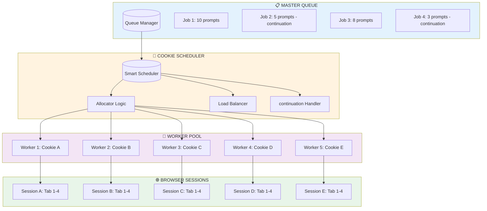

---

## 📊 Processing Modes

### Mode 1: Regular Parallel (No continuation)

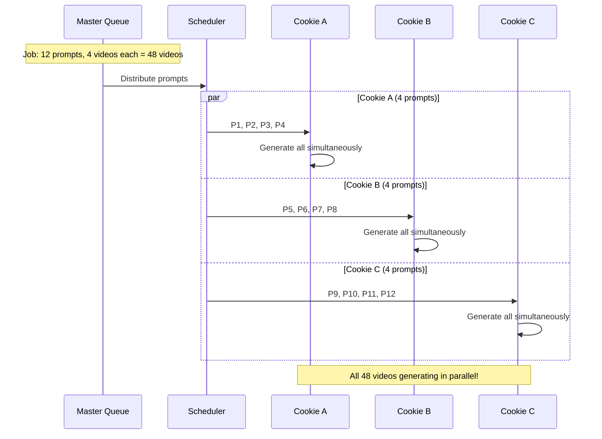

**Timing:**
| Phase | Duration |
|-------|----------|
| Submit all prompts | ~2-3 min |
| Generate videos | ~3-5 min (parallel) |
| Scan & Download | ~5-10 min |
| **Total** | **~10-18 min** for 48 videos |

---

### Mode 2: continuation Sequential (Chain Dependency)

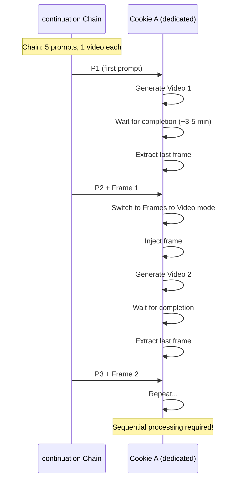

**Timing:**
| Phase | Duration |
|-------|----------|
| Per prompt cycle | ~4-6 min |
| 5 prompts × 1 video | ~20-30 min |
| Scan & Download | ~2-3 min |
| **Total** | **~22-33 min** for 5 chained videos |

---

### Mode 3: Hybrid (Mixed Non-continuation + continuation)

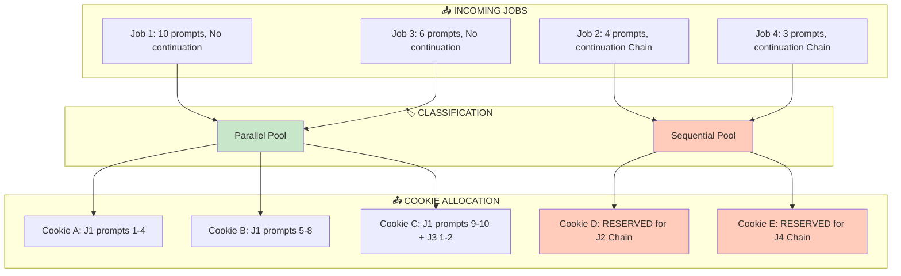

---

## 🧠 Smart Scheduler Logic

### Cookie State Machine

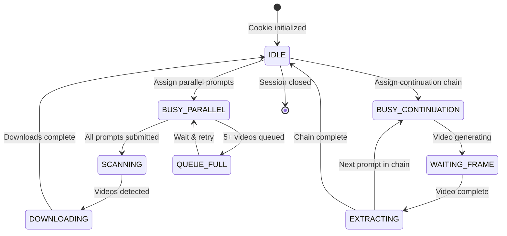

### Cookie Selection Algorithm

```python
class CookieScheduler:
    """Smart cookie allocation based on job type and availability."""
    
    def __init__(self, cookies: list[Cookie]):
        self.cookies = cookies
        self.parallel_pool: list[Cookie] = []
        self.CONTINUATION_reserved: dict[str, Cookie] = {}  # job_id → cookie
    
    def allocate(self, job: Job) -> Cookie:
        """Allocate optimal cookie for job."""
        
        if job.has_CONTINUATION:
            # continuation JOBS: Reserve entire cookie for chain
            return self._allocate_for_CONTINUATION(job)
        else:
            # PARALLEL JOBS: Use available capacity
            return self._allocate_for_parallel(job)
    
    def _allocate_for_CONTINUATION(self, job: Job) -> Cookie:
        """
        continuation chains need EXCLUSIVE cookie access.
        Rules:
        1. Find completely IDLE cookie
        2. Reserve it for entire chain duration
        3. Do NOT share with other jobs
        """
        for cookie in self.cookies:
            if cookie.state == CookieState.IDLE:
                cookie.state = CookieState.BUSY_CONTINUATION
                self.CONTINUATION_reserved[job.id] = cookie
                return cookie
        
        # No idle cookie - must wait
        raise NoAvailableCookieError("No idle cookie for continuation chain")
    
    def _allocate_for_parallel(self, job: Job) -> Cookie:
        """
        Parallel jobs can share cookies based on capacity.
        Rules:
        1. Find cookie with most available slots
        2. Fill up to 4 prompts per cookie
        3. Distribute across multiple cookies if needed
        """
        available = [c for c in self.cookies 
                     if c.state in [CookieState.IDLE, CookieState.BUSY_PARALLEL]
                     and c.available_slots > 0]
        
        if not available:
            raise NoAvailableCookieError("All cookies at capacity")
        
        # Sort by available slots (descending)
        available.sort(key=lambda c: c.available_slots, reverse=True)
        return available[0]
```

---

## 📋 Allocation Scenarios

### Scenario 1: 5 Cookies, 3 Parallel Jobs

```
Cookies: [A, B, C, D, E] (5 total)
Jobs: 
  - Job 1: 12 prompts × 4 videos = 48 videos (No continuation)
  - Job 2: 8 prompts × 4 videos = 32 videos (No continuation)
  - Job 3: 6 prompts × 4 videos = 24 videos (No continuation)

Allocation:
┌────────┬───────────────────────────────────────────────────────┐
│ Cookie │ Assigned Prompts                                      │
├────────┼───────────────────────────────────────────────────────┤
│ A      │ J1-P1, J1-P2, J1-P3, J1-P4  (4 slots filled)          │
│ B      │ J1-P5, J1-P6, J1-P7, J1-P8  (4 slots filled)          │
│ C      │ J1-P9, J1-P10, J1-P11, J1-P12 (4 slots filled)        │
│ D      │ J2-P1, J2-P2, J2-P3, J2-P4  (4 slots filled)          │
│ E      │ J2-P5, J2-P6, J2-P7, J2-P8  (4 slots filled)          │
└────────┴───────────────────────────────────────────────────────┘

Wave 2 (after first batch completes):
│ A      │ J3-P1, J3-P2, J3-P3, J3-P4  │
│ B      │ J3-P5, J3-P6                 │
│ C, D, E │ (idle or scanning)          │

Throughput: 20 prompts/wave × 4 videos = 80 videos/wave
```

---

### Scenario 2: 5 Cookies, Mixed Jobs (continuation + Parallel)

```
Cookies: [A, B, C, D, E] (5 total)
Jobs:
  - Job 1: 8 prompts × 4 videos (No continuation) ← Parallel
  - Job 2: 5 prompts × 1 video (continuation ON) ← Sequential
  - Job 3: 4 prompts × 4 videos (No continuation) ← Parallel
  - Job 4: 3 prompts × 1 video (continuation ON) ← Sequential

Allocation:
┌────────┬──────────────────────────────────────────────────────────┐
│ Cookie │ Assignment                                               │
├────────┼──────────────────────────────────────────────────────────┤
│ A      │ 🔒 RESERVED: J2 continuation Chain (5 prompts sequential)      │
│ B      │ 🔒 RESERVED: J4 continuation Chain (3 prompts sequential)      │
│ C      │ J1-P1, J1-P2, J1-P3, J1-P4 (parallel)                    │
│ D      │ J1-P5, J1-P6, J1-P7, J1-P8 (parallel)                    │
│ E      │ J3-P1, J3-P2, J3-P3, J3-P4 (parallel)                    │
└────────┴──────────────────────────────────────────────────────────┘

Timeline:
TIME →  0    5    10   15   20   25   30   35 min
Cookie A: [J2-P1][wait][J2-P2][wait][J2-P3][wait][J2-P4][wait][J2-P5]
Cookie B: [J4-P1][wait][J4-P2][wait][J4-P3][DONE→idle]
Cookie C: [J1 P1-4 parallel][scan][download][DONE→idle]
Cookie D: [J1 P5-8 parallel][scan][download][DONE→idle]
Cookie E: [J3 P1-4 parallel][scan][download][DONE→idle]
```

---

### Scenario 3: Limited Cookies (2 cookies, heavy load)

```
Cookies: [A, B] (only 2)
Jobs:
  - Job 1: 10 prompts × 4 videos (No continuation)
  - Job 2: 5 prompts × 1 video (continuation ON)
  - Job 3: 6 prompts × 4 videos (No continuation)

Strategy: Prioritize continuation jobs (less throughput-efficient)

Wave 1:
│ A      │ 🔒 J2 continuation Chain (exclusive)        │
│ B      │ J1-P1, J1-P2, J1-P3, J1-P4            │

Wave 2 (Cookie B cycles):
│ A      │ 🔒 Still processing J2 (sequential)   │
│ B      │ J1-P5, J1-P6, J1-P7, J1-P8            │

Wave 3:
│ A      │ J2 complete → J3-P1, J3-P2, J3-P3, J3-P4 │
│ B      │ J1-P9, J1-P10, J3-P5, J3-P6           │

Total time: ~45-60 min (bottleneck: single continuation cookie)
```

---

## ⚙️ Configuration Options

### Queue Manager Settings

```python
class QueueManagerConfig:
    """Configuration for multi-cookie queue management."""
    
    # Cookie capacity
    max_prompts_per_cookie: int = 4      # VEO limit
    max_videos_per_prompt: int = 4       # VEO setting
    
    # Allocation strategy
    CONTINUATION_reservation: bool = True       # Reserve full cookie for continuation
    prefer_fill_cookie: bool = True       # Fill one cookie before moving to next
    balance_load: bool = False            # Evenly distribute across cookies
    
    # Timing
    cookie_cooldown_seconds: int = 60     # Wait after quota exceeded
    queue_full_retry_max: int = 30        # Max retries on QUEUE_FULL
    
    # continuation specific
    CONTINUATION_videos_per_prompt: int = 1     # Always 1 for continuation chains
    CONTINUATION_wait_timeout: int = 300        # 5 min max wait for video
```

---

## 📊 Capacity Calculator

```python
def calculate_capacity(cookies: list[Cookie], jobs: list[Job]) -> CapacityReport:
    """Calculate system capacity and estimated completion time."""
    
    # Count resources
    total_cookies = len(cookies)
    CONTINUATION_jobs = [j for j in jobs if j.has_CONTINUATION]
    parallel_jobs = [j for j in jobs if not j.has_CONTINUATION]
    
    # Reserve cookies for continuation
    cookies_for_CONTINUATION = min(len(CONTINUATION_jobs), total_cookies)
    cookies_for_parallel = total_cookies - cookies_for_CONTINUATION
    
    # Calculate parallel capacity
    parallel_capacity_per_wave = cookies_for_parallel * 4  # 4 prompts/cookie
    
    # Calculate continuation time
    CONTINUATION_prompts = sum(j.prompt_count for j in CONTINUATION_jobs)
    CONTINUATION_time = CONTINUATION_prompts * 5  # ~5 min per prompt (sequential)
    
    # Calculate parallel time
    parallel_prompts = sum(j.prompt_count for j in parallel_jobs)
    parallel_waves = math.ceil(parallel_prompts / parallel_capacity_per_wave)
    parallel_time = parallel_waves * 10  # ~10 min per wave
    
    # Total time = max of continuation and parallel (they run simultaneously)
    total_time = max(CONTINUATION_time, parallel_time)
    
    return CapacityReport(
        total_cookies=total_cookies,
        cookies_for_CONTINUATION=cookies_for_CONTINUATION,
        cookies_for_parallel=cookies_for_parallel,
        parallel_capacity_per_wave=parallel_capacity_per_wave,
        estimated_minutes=total_time
    )
```

---

## 🎛️ UI Display

### Cookie Status Panel

```
┌────────────────────────────────────────────────────────────────────────┐
│ 🍪 COOKIE STATUS                                                        │
├────────────────────────────────────────────────────────────────────────┤
│ Cookie A │ 🟢 IDLE      │ Slots: [○][○][○][○] │ Ready for assignment  │
│ Cookie B │ 🟡 BUSY      │ Slots: [●][●][●][○] │ 3/4 prompts active    │
│ Cookie C │ 🔴 continuation    │ Slots: [🔒 CHAIN]   │ J2: 3/5 prompts done  │
│ Cookie D │ 🟢 SCANNING  │ Slots: [✓][✓][✓][✓] │ Waiting for videos    │
│ Cookie E │ 🟠 QUEUE_FULL│ Slots: [●][●][●][●] │ Retry in 45s          │
├────────────────────────────────────────────────────────────────────────┤
│ System Capacity: 5 cookies × 4 slots = 20 prompts (80 videos)         │
│ Active: 12 prompts │ Pending: 34 prompts │ ETA: ~15 minutes           │
└────────────────────────────────────────────────────────────────────────┘
```

---

## 🌐 Browser Lifecycle Integration

> **Quản lý mở/đóng browser, inject cookies, và vòng lặp xử lý theo từng scenario.**

### Master Lifecycle Flow

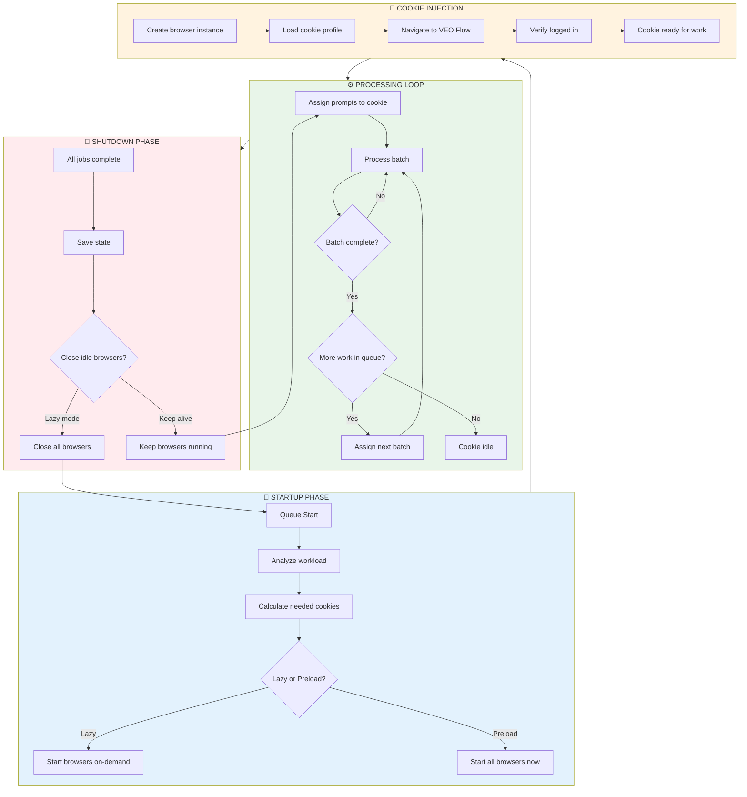

### Cookie Session Lifecycle

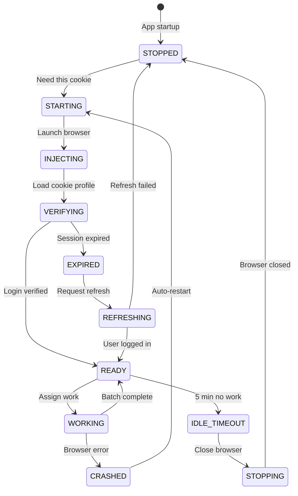

### Implementation

```python
class CookieSessionManager:
    """Manage browser lifecycle per cookie aligned with multi-cookie scheduling."""
    
    IDLE_TIMEOUT = 300  # 5 minutes
    
    def __init__(self, scheduler: CookieScheduler):
        self.scheduler = scheduler
        self.sessions: dict[str, BrowserSession] = {}
        self.session_states: dict[str, SessionState] = {}
    
    async def on_queue_start(self, jobs: list[Job]):
        """Called when queue processing starts."""
        
        # Step 1: Calculate which cookies are needed
        needed_cookies = self._calculate_needed_cookies(jobs)
        
        log.info(f"Queue starting: {len(needed_cookies)} cookies needed")
        
        # Step 2: Start browsers for needed cookies only
        for cookie in needed_cookies:
            if cookie.id not in self.sessions:
                await self._start_session(cookie)
    
    async def _start_session(self, cookie: Cookie):
        """Start browser session with cookie injection."""
        
        self.session_states[cookie.id] = SessionState.STARTING
        
        try:
            # Create browser with user profile
            session = await self._create_browser(cookie)
            
            # Inject cookie/profile
            self.session_states[cookie.id] = SessionState.INJECTING
            await self._inject_cookie_profile(session, cookie)
            
            # Navigate and verify
            self.session_states[cookie.id] = SessionState.VERIFYING
            await session.driver.get("https://labs.google/fx/tools/flow")
            
            if not await self._verify_logged_in(session):
                self.session_states[cookie.id] = SessionState.EXPIRED
                raise SessionExpiredError(f"Cookie {cookie.name} expired")
            
            # Ready for work
            self.sessions[cookie.id] = session
            self.session_states[cookie.id] = SessionState.READY
            
            log.info(f"Cookie {cookie.name} session ready")
            
        except Exception as e:
            log.error(f"Failed to start session for {cookie.name}: {e}")
            self.session_states[cookie.id] = SessionState.STOPPED
            raise
    
    async def _inject_cookie_profile(self, session: BrowserSession, cookie: Cookie):
        """Inject saved cookie data into browser."""
        
        # Load cookies from encrypted storage
        cookie_data = self._load_cookie_data(cookie.id)
        
        if cookie_data:
            for c in cookie_data:
                session.driver.add_cookie(c)
            
            # Refresh to apply cookies
            session.driver.refresh()
    
    async def on_job_assigned(self, cookie_id: str, job: Job):
        """Called when job is assigned to a cookie."""
        
        session = self.sessions.get(cookie_id)
        
        if not session:
            # Lazy start - create session now
            cookie = self.scheduler.get_cookie(cookie_id)
            await self._start_session(cookie)
            session = self.sessions[cookie_id]
        
        self.session_states[cookie_id] = SessionState.WORKING
        session.last_activity = datetime.now()
    
    async def on_job_complete(self, cookie_id: str, job: Job):
        """Called when cookie finishes a job."""
        
        session = self.sessions.get(cookie_id)
        if not session:
            return
        
        session.last_activity = datetime.now()
        
        # Check if more work pending
        next_job = self.scheduler.get_next_job_for_cookie(cookie_id)
        
        if next_job:
            self.session_states[cookie_id] = SessionState.READY
            # Scheduler will auto-assign next job
        else:
            # No more work - enter idle state
            self.session_states[cookie_id] = SessionState.READY
            asyncio.create_task(self._start_idle_timer(cookie_id))
    
    async def _start_idle_timer(self, cookie_id: str):
        """Start idle timeout for browser shutdown."""
        
        await asyncio.sleep(self.IDLE_TIMEOUT)
        
        # Check if still idle
        session = self.sessions.get(cookie_id)
        if session and self.session_states.get(cookie_id) == SessionState.READY:
            idle_time = (datetime.now() - session.last_activity).total_seconds()
            
            if idle_time >= self.IDLE_TIMEOUT:
                log.info(f"Cookie {cookie_id} idle timeout - closing browser")
                await self._stop_session(cookie_id)
    
    async def _stop_session(self, cookie_id: str):
        """Close browser session."""
        
        session = self.sessions.get(cookie_id)
        if not session:
            return
        
        self.session_states[cookie_id] = SessionState.STOPPING
        
        try:
            # Save current state if needed
            await session.save_state()
            
            # Close browser
            session.driver.quit()
            
        finally:
            del self.sessions[cookie_id]
            self.session_states[cookie_id] = SessionState.STOPPED
            log.info(f"Cookie {cookie_id} browser closed")
    
    async def on_queue_complete(self):
        """Called when all queue processing is done."""
        
        log.info("Queue complete - shutting down browsers")
        
        for cookie_id in list(self.sessions.keys()):
            await self._stop_session(cookie_id)
```

### Vòng lặp xử lý theo Scenario

#### Scenario A: Non-continuation Parallel Loop

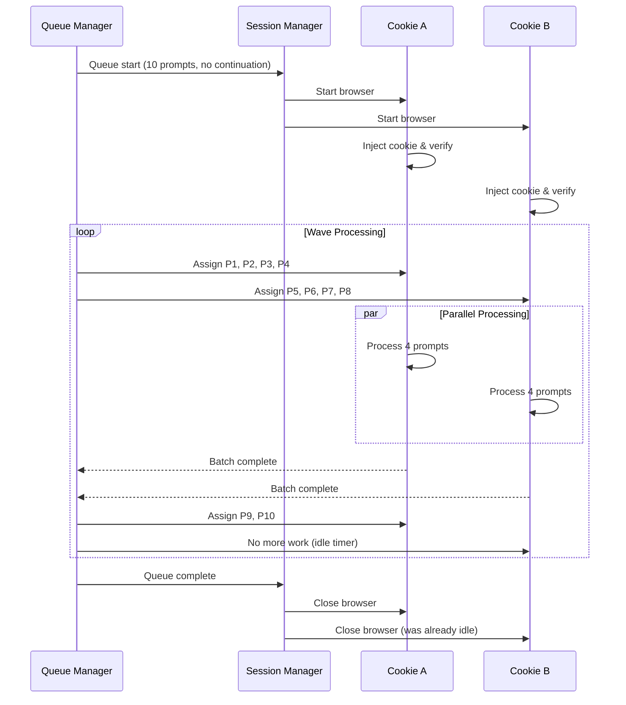

#### Scenario B: continuation Chain with Dedicated Session

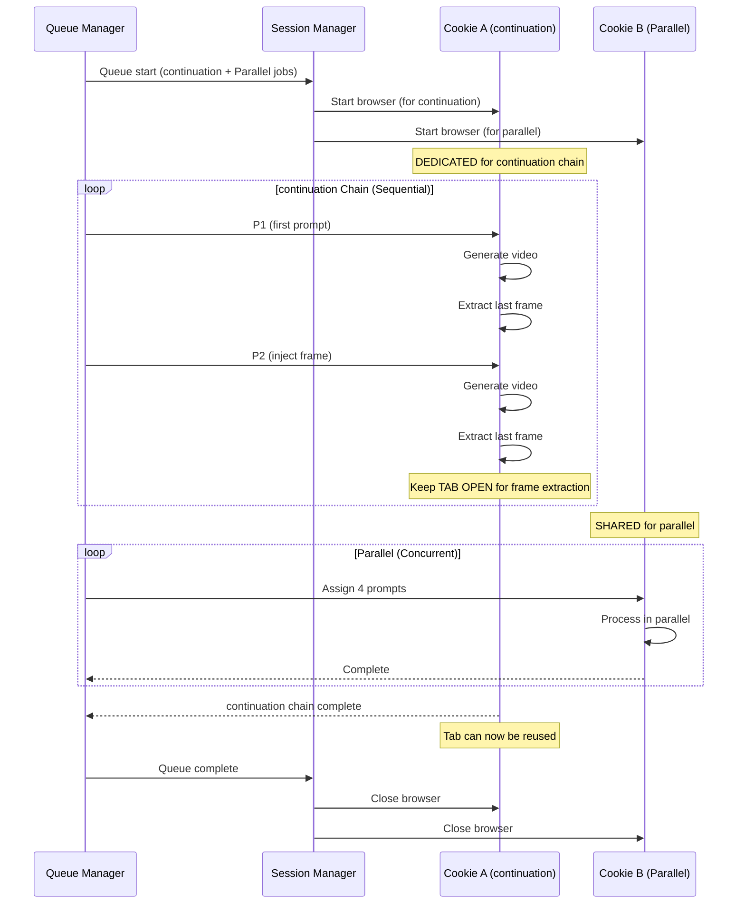

#### Scenario C: Dynamic Cookie Start/Stop

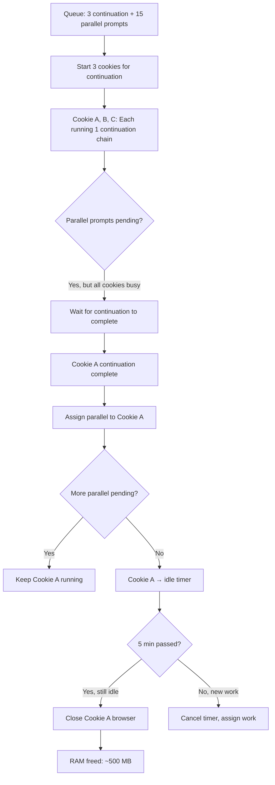

### Configuration

```python
@dataclass
class BrowserLifecycleConfig:
    """Browser lifecycle settings integrated with multi-cookie scheduler."""
    
    # Startup strategy
    lazy_start: bool = True              # Only start browsers when needed
    preload_for_CONTINUATION: bool = True      # Always preload for continuation chains
    
    # Session management
    inject_cookie_on_start: bool = True  # Load saved cookies on browser start
    verify_login_on_start: bool = True   # Check if session valid before work
    
    # Idle management
    idle_timeout_seconds: int = 300      # Close browser after 5 min idle
    idle_check_interval: int = 60        # Check every 1 min
    
    # Shutdown
    close_on_queue_complete: bool = True # Close all browsers when queue done
    save_state_on_close: bool = True     # Persist state before closing
    
    # Recovery
    auto_restart_on_crash: bool = True   # Restart crashed browsers
    max_restart_attempts: int = 3        # Max restarts before giving up
```

---

## 🔄 Dynamic Reallocation (Auto-Distribution)

### Event-Driven Job Distribution

Khi cookie hoàn thành công việc và trở về IDLE, hệ thống **TỰ ĐỘNG** phân phối job tiếp theo:

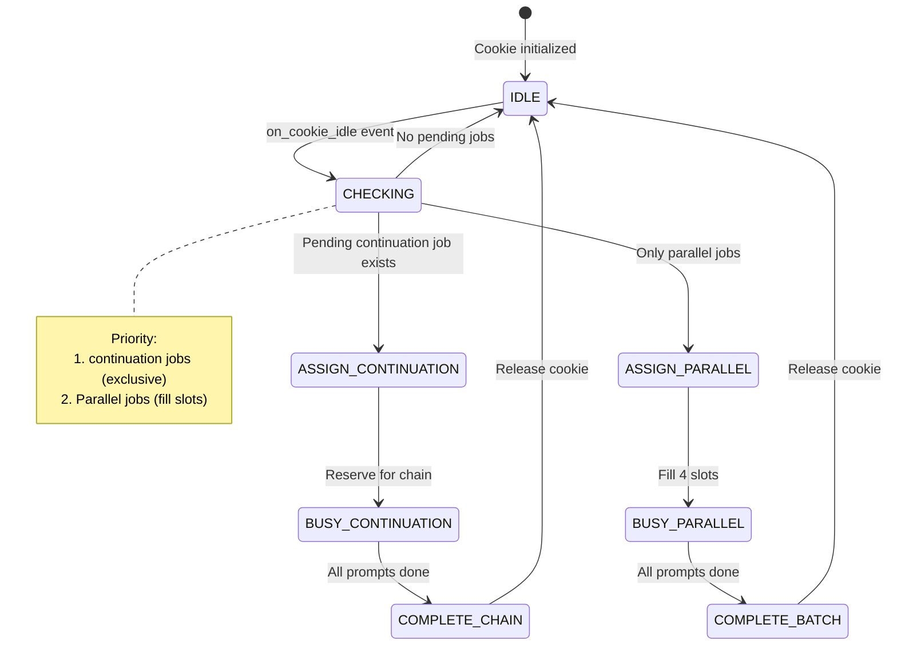

### Auto-Distribution Algorithm

```python
class DynamicScheduler:
    """Real-time job distribution based on cookie availability."""
    
    def __init__(self, cookies: list[Cookie], queue: JobQueue):
        self.cookies = cookies
        self.queue = queue
        
        # Subscribe to cookie state changes
        for cookie in cookies:
            cookie.on_state_change += self._on_cookie_state_change
    
    def _on_cookie_state_change(self, cookie: Cookie, old_state: str, new_state: str):
        """Triggered when any cookie changes state."""
        
        if new_state == CookieState.IDLE:
            # Cookie just became available!
            self._try_assign_next_job(cookie)
    
    def _try_assign_next_job(self, cookie: Cookie):
        """Attempt to assign next pending job to idle cookie."""
        
        # Priority 1: Check for pending continuation jobs (need exclusive cookie)
        CONTINUATION_job = self.queue.get_next_pending(job_type="continuation")
        if CONTINUATION_job:
            self._assign_CONTINUATION_chain(cookie, CONTINUATION_job)
            return
        
        # Priority 2: Check for pending PARALLEL prompts (can batch)
        parallel_prompts = self.queue.get_next_parallel_batch(max_count=4)
        if parallel_prompts:
            self._assign_parallel_batch(cookie, parallel_prompts)
            return
        
        # No pending work - cookie stays IDLE
        log.info(f"Cookie {cookie.id} is IDLE - no pending jobs")
    
    def _assign_CONTINUATION_chain(self, cookie: Cookie, job: Job):
        """Reserve entire cookie for continuation chain."""
        cookie.state = CookieState.BUSY_CONTINUATION
        cookie.current_job = job
        
        log.info(f"Cookie {cookie.id} reserved for continuation chain: {job.id}")
        
        # Start chain processing
        self._start_CONTINUATION_worker(cookie, job)
    
    def _assign_parallel_batch(self, cookie: Cookie, prompts: list[Prompt]):
        """Fill cookie with parallel prompts (up to 4)."""
        cookie.state = CookieState.BUSY_PARALLEL
        cookie.active_prompts = prompts
        
        log.info(f"Cookie {cookie.id} assigned {len(prompts)} parallel prompts")
        
        # Submit all prompts simultaneously
        for prompt in prompts:
            self._submit_prompt(cookie, prompt)
```

### Real-time Load Balancing

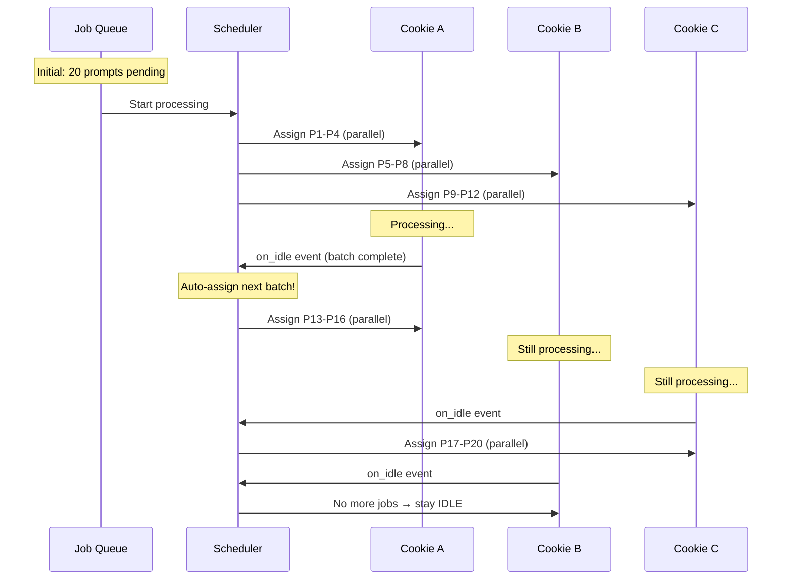

### Completion Callback Flow

```python
class CookieWorker:
    """Worker for a single cookie session."""
    
    async def process_prompt(self, prompt: Prompt):
        """Process a single prompt and trigger callback on completion."""
        
        try:
            # Submit prompt to VEO
            await self._submit_to_veo(prompt)
            
            # Wait for video/scan
            await self._wait_for_completion()
            
            # Download results
            await self._download_videos()
            
            prompt.status = "complete"
            
        except Exception as e:
            prompt.status = "failed"
            prompt.error = str(e)
        
        finally:
            # Check if all prompts for this cookie are done
            self._check_batch_complete()
    
    def _check_batch_complete(self):
        """Check if all assigned prompts are complete."""
        
        all_done = all(p.status in ["complete", "failed"] 
                       for p in self.cookie.active_prompts)
        
        if all_done:
            # Reset cookie state and trigger reallocation
            self.cookie.active_prompts = []
            self.cookie.state = CookieState.IDLE
            
            # 🔔 This triggers DynamicScheduler._on_cookie_state_change()
            self.cookie.emit("state_change", old="BUSY", new="IDLE")
```

### Configuration

```python
class DynamicSchedulerConfig:
    """Settings for automatic job distribution."""
    
    # Enable/disable auto-distribution
    auto_redistribute: bool = True
    
    # Delay before checking next job (avoid race conditions)
    reallocation_delay_ms: int = 500
    
    # Priority settings
    prioritize_CONTINUATION_jobs: bool = True  # Always assign continuation first
    prioritize_older_jobs: bool = True   # FIFO within same type
    
    # Load balancing
    prefer_least_busy_cookie: bool = True  # Distribute evenly
    max_prompts_per_cookie: int = 4        # VEO limit
```

---

## ⚠️ Edge Cases & Error Recovery

### Scenario Matrix

| # | Tình huống | Nguyên nhân | Xử lý | Recovery |
|---|------------|-------------|-------|----------|
| 1 | Cookie Crash | Browser session die | Detect timeout | Reassign to new cookie |
| 2 | Network Interruption | Connection lost | Retry mechanism | Resume từ checkpoint |
| 3 | continuation Chain Break | Video N fail | Cannot extract frame | Skip chain hoặc restart |
| 4 | Cookie Expired | Token timeout | 401/403 error | Refresh cookie |
| 5 | QUEUE_FULL all cookies | All 5 accounts full | Global backpressure | Wait & retry toàn bộ |
| 6 | Partial Job Cancel | User cancel mid-job | Clean up | Keep completed videos |
| 7 | Pause/Resume | User pause queue | Persist state | Resume exact position |
| 8 | Mixed Video Counts | 1 job×4 vid + 1 job×1 vid | Capacity conflict | Smart slot allocation |
| 9 | Memory Overflow | Too many sessions | Browser crash | Limit parallel sessions |
| 10 | Duplicate Detection | Same prompt twice | Waste resources | Hash-based dedup |

---

### Edge Case 1: Cookie/Browser Crash

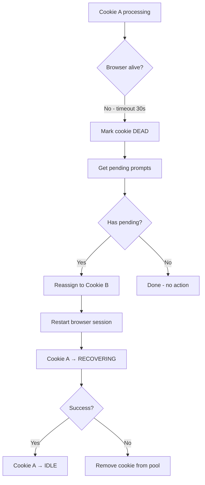

```python
class CookieHealthMonitor:
    """Monitor cookie health and handle failures."""
    
    TIMEOUT_SECONDS = 30
    MAX_RECOVERY_ATTEMPTS = 3
    
    async def health_check(self, cookie: Cookie):
        """Periodic health check for cookie."""
        try:
            # Ping browser session
            await asyncio.wait_for(
                cookie.browser.execute_script("return 1"),
                timeout=self.TIMEOUT_SECONDS
            )
        except asyncio.TimeoutError:
            await self._handle_cookie_failure(cookie)
    
    async def _handle_cookie_failure(self, cookie: Cookie):
        """Handle dead cookie."""
        
        # 1. Mark as dead
        cookie.state = CookieState.DEAD
        
        # 2. Rescue pending prompts
        pending = cookie.active_prompts.copy()
        cookie.active_prompts = []
        
        # 3. Reassign to healthy cookies
        for prompt in pending:
            healthy = self._get_healthy_cookie()
            if healthy:
                healthy.active_prompts.append(prompt)
                await self.scheduler.submit_prompt(healthy, prompt)
        
        # 4. Attempt recovery
        await self._recover_cookie(cookie)
```

---

### Edge Case 2: continuation Chain Interruption

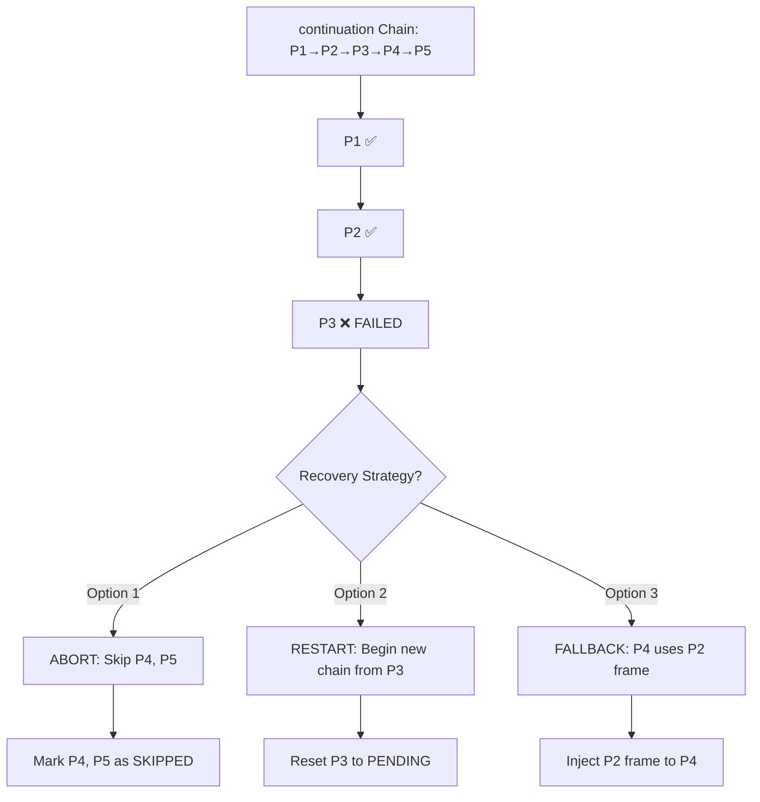

```python
class CONTINUATIONChainRecovery:
    """Handle continuation chain failures."""
    
    async def on_prompt_failed(self, chain: CONTINUATIONChain, failed_index: int):
        """Handle failed prompt in continuation chain."""
        
        strategy = self.config.CONTINUATION_failure_strategy
        
        if strategy == "ABORT":
            # Skip remaining prompts
            for i in range(failed_index + 1, len(chain.prompts)):
                chain.prompts[i].status = "skipped"
                chain.prompts[i].skip_reason = f"Dependency P{failed_index} failed"
            
        elif strategy == "RESTART":
            # Retry failed prompt (max 3 times)
            if chain.retry_count < 3:
                chain.prompts[failed_index].status = "pending"
                chain.retry_count += 1
                await self.process_prompt(chain, failed_index)
            else:
                await self.on_prompt_failed(chain, failed_index)  # Fallback to ABORT
                
        elif strategy == "FALLBACK_PREVIOUS":
            # Use frame from prompt BEFORE the failed one
            if failed_index >= 2:
                fallback_frame = chain.frames[failed_index - 2]
                chain.prompts[failed_index + 1].inject_frame = fallback_frame
                await self.process_prompt(chain, failed_index + 1)
```

---

### Edge Case 3: Global QUEUE_FULL (All Cookies)

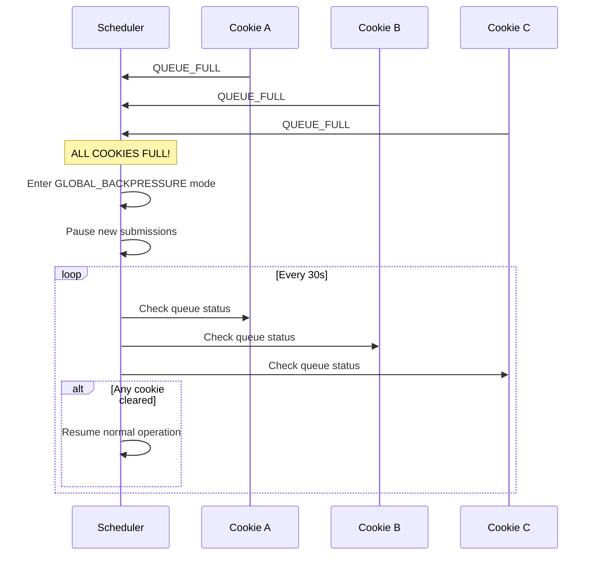

```python
class GlobalBackpressureHandler:
    """Handle when ALL cookies hit QUEUE_FULL."""
    
    async def check_global_capacity(self):
        """Check if any cookie has capacity."""
        
        available = [c for c in self.cookies if c.state != CookieState.QUEUE_FULL]
        
        if not available:
            # GLOBAL BACKPRESSURE
            self.state = SchedulerState.BACKPRESSURE
            self.ui.show_warning("⚠️ Tất cả cookie đều full. Đang chờ...")
            
            # Wait and retry loop
            while self.state == SchedulerState.BACKPRESSURE:
                await asyncio.sleep(30)
                
                # Check each cookie
                for cookie in self.cookies:
                    has_capacity = await self._check_cookie_capacity(cookie)
                    if has_capacity:
                        cookie.state = CookieState.IDLE
                        self.state = SchedulerState.RUNNING
                        break
```

---

### Edge Case 4: Pause/Resume State Persistence

```python
@dataclass
class QueueCheckpoint:
    """Checkpoint for pause/resume."""
    
    timestamp: datetime
    
    # Job states
    jobs: list[dict]  # All jobs with current status
    
    # Cookie states
    cookies: list[dict]  # Cookie ID, state, active prompts
    
    # continuation chain states
    CONTINUATION_chains: dict[str, dict]  # chain_id → {current_index, frames}
    
    # Download queue
    pending_downloads: list[str]  # Video URLs not yet downloaded

class PauseResumeManager:
    """Handle pause/resume with state persistence."""
    
    async def pause(self):
        """Pause queue and save checkpoint."""
        
        self.state = QueueState.PAUSED
        
        # Create checkpoint
        checkpoint = QueueCheckpoint(
            timestamp=datetime.now(),
            jobs=[j.to_dict() for j in self.jobs],
            cookies=[c.to_dict() for c in self.cookies],
            CONTINUATION_chains=self._serialize_chains(),
            pending_downloads=list(self.download_queue)
        )
        
        # Save to disk (survive app restart)
        await self._save_checkpoint(checkpoint)
        
        self.ui.show_status("⏸️ Queue paused at checkpoint")
    
    async def resume(self):
        """Resume from last checkpoint."""
        
        checkpoint = await self._load_checkpoint()
        
        if not checkpoint:
            raise NoCheckpointError("No saved checkpoint")
        
        # Restore states
        await self._restore_jobs(checkpoint.jobs)
        await self._restore_cookies(checkpoint.cookies)
        await self._restore_chains(checkpoint.CONTINUATION_chains)
        
        self.state = QueueState.RUNNING
        self.ui.show_status("▶️ Queue resumed")
```

---

### Edge Case 5: Mixed Video Counts Optimization

```
Problem:
Job A: 10 prompts × 4 videos = 40 videos (parallel)
Job B: 5 prompts × 1 video = 5 videos (continuation chain)
Job C: 3 prompts × 4 videos = 12 videos (parallel)

Cookie Capacity: 4 prompts × 4 videos = 16 videos

Optimal Allocation:
┌────────┬────────────────────────────────────────────────────────┐
│ Cookie │ Assignment                                             │
├────────┼────────────────────────────────────────────────────────┤
│ A      │ 🔒 Job B: 5 prompts × 1 video (continuation, exclusive)      │
│ B      │ Job A: P1-P4 × 4 videos = 16 videos                    │
│ C      │ Job A: P5-P8 × 4 videos = 16 videos                    │
│ D      │ Job A: P9-P10 × 4 vid + Job C: P1-P2 × 4 vid = 16 vid │
│ E      │ Job C: P3 × 4 videos = 4 videos (underutilized)        │
└────────┴────────────────────────────────────────────────────────┘
```

```python
def optimize_allocation(cookies: list, jobs: list) -> AllocationPlan:
    """Optimize cookie allocation for mixed video counts."""
    
    # Step 1: Separate continuation vs parallel
    CONTINUATION_jobs = [j for j in jobs if j.has_CONTINUATION]
    parallel_jobs = [j for j in jobs if not j.has_CONTINUATION]
    
    # Step 2: Reserve cookies for continuation (1 cookie per chain)
    CONTINUATION_allocations = []
    for i, job in enumerate(CONTINUATION_jobs):
        if i < len(cookies):
            CONTINUATION_allocations.append((cookies[i], job))
    
    # Step 3: Remaining cookies for parallel
    parallel_cookies = cookies[len(CONTINUATION_jobs):]
    
    # Step 4: Bin-packing for parallel prompts
    bins = [[] for _ in parallel_cookies]  # Each bin = 4 slots
    
    all_parallel_prompts = []
    for job in parallel_jobs:
        for prompt in job.prompts:
            all_parallel_prompts.append(prompt)
    
    # Greedy bin-packing
    for prompt in all_parallel_prompts:
        # Find bin with least prompts
        min_bin = min(bins, key=len)
        if len(min_bin) < 4:
            min_bin.append(prompt)
        else:
            # All bins full - need new wave
            break
    
    return AllocationPlan(continuation=CONTINUATION_allocations, parallel=bins)
```

---

### Edge Case 6: Memory Management (Many Sessions)

```python
class MemoryManager:
    """Prevent memory overflow with many parallel sessions."""
    
    MAX_CONCURRENT_BROWSERS = 3  # Limit based on system RAM
    BROWSER_MEMORY_MB = 500      # Estimated per browser
    
    def __init__(self, available_ram_mb: int = 8000):
        self.max_browsers = min(
            self.MAX_CONCURRENT_BROWSERS,
            available_ram_mb // self.BROWSER_MEMORY_MB
        )
    
    async def request_browser(self, cookie: Cookie) -> Optional[Browser]:
        """Request browser session, may wait if limit reached."""
        
        active_browsers = len([c for c in self.cookies if c.browser])
        
        if active_browsers >= self.max_browsers:
            # Wait for a browser to close
            await self.browser_available_event.wait()
        
        return await self._create_browser(cookie)
    
    def release_browser(self, cookie: Cookie):
        """Release browser when done."""
        if cookie.browser:
            cookie.browser.quit()
            cookie.browser = None
            self.browser_available_event.set()
```

---

### Edge Case 7: Cookie Token Expiry & Auto-Transfer

> **Khi cookie hết hạn giữa chừng, tự động chuyển công việc sang cookie khác.**

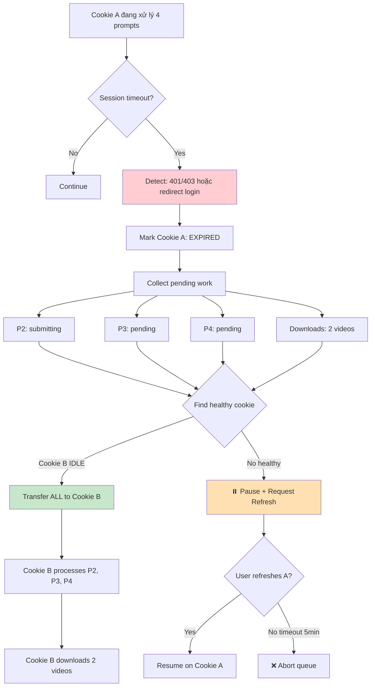

### Detection Patterns

```python
class CookieExpiryDetector:
    """Detect cookie/session expiry during processing."""
    
    EXPIRY_SIGNALS = [
        # URL changes
        "accounts.google.com",
        "signin",
        "ServiceLogin",
        
        # XPath elements appearing
        "//input[@type='email']",
        "//div[contains(text(), 'Sign in')]",
        
        # Error toasts
        "//li[@data-sonner-toast and contains(., 'authentication')]",
        "//li[@data-sonner-toast and contains(., 'session')]",
    ]
    
    async def check_expiry(self, browser: Browser) -> bool:
        """Check if session has expired."""
        
        # Check URL redirect
        if any(sig in browser.current_url for sig in self.EXPIRY_SIGNALS[:3]):
            return True
        
        # Check for login elements
        for xpath in self.EXPIRY_SIGNALS[3:6]:
            try:
                elem = browser.find_element(By.XPATH, xpath)
                if elem.is_displayed():
                    return True
            except NoSuchElementException:
                pass
        
        return False
```

### Auto-Transfer Handler

```python
class AutoTransferHandler:
    """Auto-transfer work when cookie expires mid-processing."""
    
    async def on_cookie_expired(self, expired: Cookie):
        """Handle expired cookie with auto-transfer."""
        
        self.ui.show_warning(f"⚠️ Cookie {expired.name} hết hạn!")
        
        # Step 1: Freeze cookie
        expired.state = CookieState.EXPIRED
        
        # Step 2: Collect pending work
        pending = PendingWork(
            prompts=[p for p in expired.active_prompts 
                     if p.status in ["pending", "submitting"]],
            CONTINUATION_chain=expired.current_CONTINUATION_chain,
            downloads=list(expired.download_queue)
        )
        
        # Reset expired cookie
        expired.active_prompts = []
        expired.current_CONTINUATION_chain = None
        expired.download_queue = []
        
        # Step 3: Find target cookie
        target = self._find_best_target(exclude=expired)
        
        if target:
            await self._execute_transfer(pending, target, expired)
        else:
            await self._handle_no_target(pending, expired)
    
    def _find_best_target(self, exclude: Cookie) -> Optional[Cookie]:
        """Find best cookie to receive work."""
        
        candidates = []
        
        for c in self.cookies:
            if c == exclude:
                continue
            if c.state == CookieState.EXPIRED:
                continue
            if c.state == CookieState.IDLE:
                candidates.append((c, 100))  # Highest priority
            elif c.state == CookieState.BUSY_PARALLEL and c.available_slots > 0:
                candidates.append((c, c.available_slots))
        
        if not candidates:
            return None
        
        candidates.sort(key=lambda x: x[1], reverse=True)
        return candidates[0][0]
    
    async def _execute_transfer(self, pending: PendingWork, target: Cookie, source: Cookie):
        """Execute work transfer to target cookie."""
        
        log.info(f"Transferring {len(pending.prompts)} prompts from {source.id} to {target.id}")
        
        # Transfer prompts
        for prompt in pending.prompts:
            prompt.status = "pending"
            prompt.retry_count += 1  # Track transfer
            target.active_prompts.append(prompt)
        
        # Transfer continuation chain (needs exclusive access)
        if pending.CONTINUATION_chain:
            if target.state == CookieState.IDLE:
                target.current_CONTINUATION_chain = pending.CONTINUATION_chain
                target.state = CookieState.BUSY_CONTINUATION
                self.ui.show_info(f"📦 continuation chain chuyển sang {target.name}")
            else:
                # Queue for later
                self.pending_chains.append(pending.CONTINUATION_chain)
                self.ui.show_warning(f"⏳ continuation chain chờ cookie rảnh")
        
        # Transfer downloads
        target.download_queue.extend(pending.downloads)
        
        # Resume target
        await self.scheduler.resume_cookie(target)
        
        # Request refresh for expired cookie (background)
        asyncio.create_task(self.refresh_manager.request_refresh(source))
    
    async def _handle_no_target(self, pending: PendingWork, expired: Cookie):
        """Handle when no healthy cookie available."""
        
        self.ui.show_error(
            "🚨 Tất cả cookies đều không khả dụng!",
            "Vui lòng làm mới ít nhất 1 cookie để tiếp tục."
        )
        
        # Save to disk
        await self._persist_pending_work(pending)
        
        # Request immediate refresh
        result = await self.refresh_manager.request_refresh(
            expired, 
            timeout_minutes=5,
            blocking=True
        )
        
        if result == RefreshResult.SUCCESS:
            await self._execute_transfer(pending, expired, expired)
        else:
            self.queue_state = QueueState.ABORTED
            self.ui.show_error("❌ Queue dừng lại. Không có cookie hợp lệ.")
```

### Integration with Multi-Cookie Scheduler

```python
class MultiCookieScheduler:
    """Extended scheduler with expiry handling."""
    
    def __init__(self):
        self.transfer_handler = AutoTransferHandler(self)
        
        # Subscribe to expiry events
        for cookie in self.cookies:
            cookie.on_expiry += self.transfer_handler.on_cookie_expired
    
    async def process_with_expiry_check(self, cookie: Cookie, prompt: Prompt):
        """Process prompt with session expiry checking."""
        
        try:
            result = await self._submit_prompt(cookie, prompt)
            return result
            
        except SessionExpiredError:
            # Trigger auto-transfer
            await self.transfer_handler.on_cookie_expired(cookie)
            raise  # Bubble up for retry logic
            
        except Exception as e:
            # Check if expiry after other errors
            if await self.expiry_detector.check_expiry(cookie.browser):
                await self.transfer_handler.on_cookie_expired(cookie)
            raise
```

---

## 📊 Scenario Coverage Checklist

| Category | Scenario | Covered | Section |
|----------|----------|---------|---------|
| **Normal** | Parallel processing | ✅ | Mode 1 |
| **Normal** | continuation sequential | ✅ | Mode 2 |
| **Normal** | Mixed jobs | ✅ | Mode 3 |
| **Normal** | Auto-distribution | ✅ | Dynamic Reallocation |
| **Error** | Cookie crash | ✅ | Edge Case 1 |
| **Error** | continuation chain break | ✅ | Edge Case 2 |
| **Error** | Global queue full | ✅ | Edge Case 3 |
| **Error** | Pause/Resume | ✅ | Edge Case 4 |
| **Optimization** | Mixed video counts | ✅ | Edge Case 5 |
| **Resource** | Memory management | ✅ | Edge Case 6 |
| **Auth** | Cookie token expiry | ✅ | Edge Case 7 |
| **Auth** | Auto-transfer on expiry | ✅ | Edge Case 7 |
| **Auth** | Cookie refresh flow | ✅ | WORKFLOW_COOKIE_VALIDATION.md |
| **Auth** | Pre-flight validation | ✅ | WORKFLOW_COOKIE_VALIDATION.md |

---

## 🔗 Related Files

| File | Description |
|------|-------------|
| [WORKFLOW_COOKIE_VALIDATION.md](./WORKFLOW_COOKIE_VALIDATION.md) | Cookie pre-flight & refresh flow |
| [FRAME_CONTINUATION_WORKFLOW.md](../02_Architecture/FRAME_CONTINUATION_WORKFLOW.md) | Frame extraction & injection |
| [MULTITHREADING_ARCHITECTURE.md](../03_Backend/MULTITHREADING_ARCHITECTURE.md) | Queue state machine |
| [TAB_06_QUEUE_MANAGER.md](../01_UI_UX/TAB_06_QUEUE_MANAGER.md) | Queue Manager UI |
