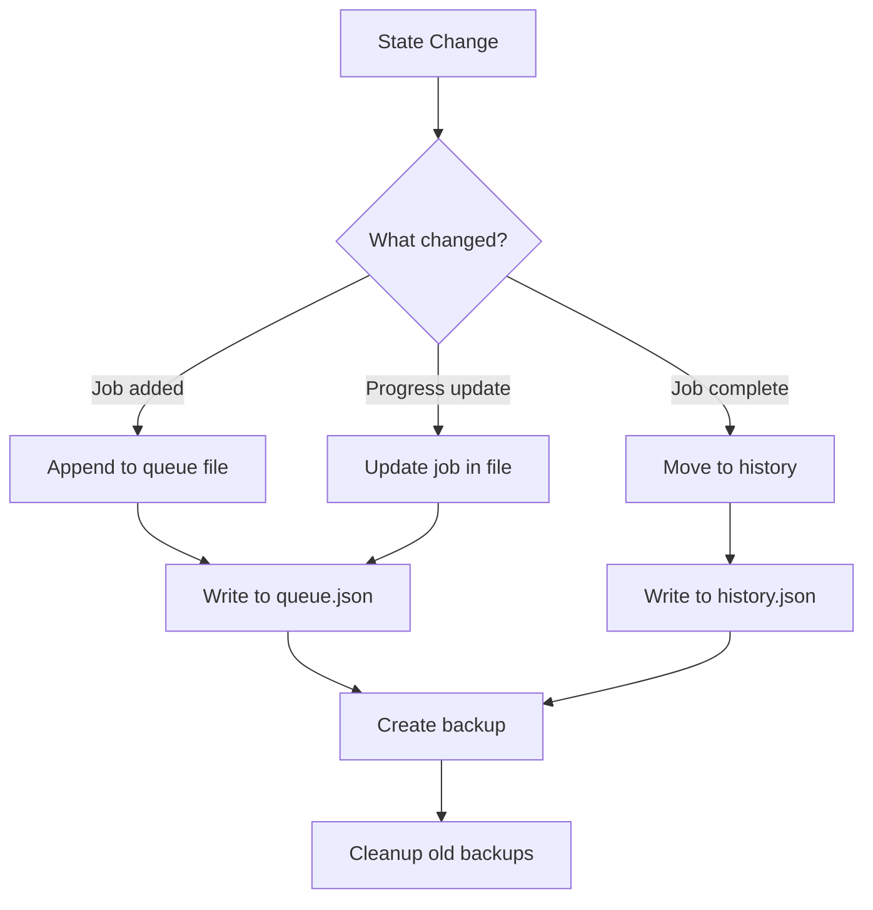
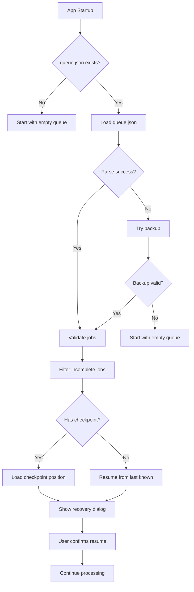

# 💾 WORKFLOW: Queue Persistence (Lưu trạng thái Queue)

## Tổng quan

Workflow quản lý việc lưu/load trạng thái queue để survive app restart, crash recovery, và chuyển device.

---

## 🎯 Persistence Points

| Event | Action | Data Saved |
|-------|--------|------------|
| Add to queue | Auto-save | New job |
| Prompt complete | Auto-save | Progress update |
| App close | Full save | All state |
| Crash | Recovery | Last checkpoint |
| Pause | Checkpoint | Current position |

---

## 💾 Save Flow



### Implementation

```python
import json
from pathlib import Path
from datetime import datetime
from dataclasses import asdict

class QueuePersistence:
    """Persist queue state to disk."""
    
    def __init__(self, data_dir: Path = None):
        self.data_dir = data_dir or Path.home() / ".veoauto" / "queue"
        self.data_dir.mkdir(parents=True, exist_ok=True)
        
        self.queue_file = self.data_dir / "queue.json"
        self.history_file = self.data_dir / "history.json"
        self.checkpoint_file = self.data_dir / "checkpoint.json"
    
    def save_queue(self, jobs: list[Job]):
        """Save current queue state."""
        
        data = {
            "version": "1.0",
            "saved_at": datetime.now().isoformat(),
            "jobs": [self._job_to_dict(job) for job in jobs]
        }
        
        # Write to temp first, then rename (atomic)
        temp_file = self.queue_file.with_suffix(".tmp")
        with open(temp_file, "w", encoding="utf-8") as f:
            json.dump(data, f, indent=2, ensure_ascii=False)
        
        temp_file.rename(self.queue_file)
        
        # Create backup
        self._create_backup()
    
    def load_queue(self) -> list[Job]:
        """Load queue from disk."""
        
        if not self.queue_file.exists():
            return []
        
        try:
            with open(self.queue_file, "r", encoding="utf-8") as f:
                data = json.load(f)
            
            return [self._dict_to_job(j) for j in data.get("jobs", [])]
            
        except json.JSONDecodeError:
            # Corrupted file - try backup
            return self._load_backup()
    
    def _job_to_dict(self, job: Job) -> dict:
        """Convert Job to serializable dict."""
        return {
            "id": job.id,
            "name": job.name,
            "mode": job.mode,
            "status": job.status,
            "prompts": [
                {
                    "text": p.text,
                    "status": p.status,
                    "image_paths": p.image_paths,
                    "continuation": p.continuation
                }
                for p in job.prompts
            ],
            "settings": asdict(job.settings),
            "progress": {
                "current_index": job.current_index,
                "completed": job.completed_count,
                "failed": job.failed_count,
                "total": len(job.prompts)
            },
            "created_at": job.created_at.isoformat(),
            "download_folder": job.download_folder
        }
    
    def _dict_to_job(self, data: dict) -> Job:
        """Reconstruct Job from dict."""
        
        prompts = [
            Prompt(
                text=p["text"],
                status=p["status"],
                image_paths=p.get("image_paths", []),
                continuation=p.get("continuation", False)
            )
            for p in data["prompts"]
        ]
        
        return Job(
            id=data["id"],
            name=data["name"],
            mode=data["mode"],
            status=data["status"],
            prompts=prompts,
            settings=JobSettings(**data["settings"]),
            current_index=data["progress"]["current_index"],
            created_at=datetime.fromisoformat(data["created_at"]),
            download_folder=data["download_folder"]
        )
```

---

## 🔄 Load Flow (Startup)



### Recovery Dialog

```
┌────────────────────────────────────────────────────────────────┐
│ 🔄 QUEUE RECOVERY                                               │
├────────────────────────────────────────────────────────────────┤
│                                                                │
│ Phát hiện queue chưa hoàn thành từ phiên trước:                │
│                                                                │
│ ┌──────────────────────────────────────────────────────────┐   │
│ │ Job 1: Project_T2V                                       │   │
│ │ Progress: 7/10 prompts (70%)                             │   │
│ │ Status: INTERRUPTED                                      │   │
│ ├──────────────────────────────────────────────────────────┤   │
│ │ Job 2: Project_I2V                                       │   │
│ │ Progress: 0/5 prompts                                    │   │
│ │ Status: PENDING                                          │   │
│ └──────────────────────────────────────────────────────────┘   │
│                                                                │
│ [▶️ Resume] [🗑️ Clear Queue] [📋 View Details]                │
└────────────────────────────────────────────────────────────────┘
```

---

## 🔀 Checkpoint System

### Checkpoint Trigger Points

```python
class CheckpointManager:
    """Manage checkpoint saves for crash recovery."""
    
    # When to create checkpoint
    CHECKPOINT_TRIGGERS = [
        "prompt_submitted",      # After each prompt submitted
        "video_downloaded",      # After each video downloaded
        "job_complete",         # After job finishes
        "queue_paused",         # User pauses
        "cookie_switch",        # Cookie changed
    ]
    
    def save_checkpoint(self, trigger: str, state: QueueState):
        """Save checkpoint with trigger info."""
        
        checkpoint = {
            "trigger": trigger,
            "timestamp": datetime.now().isoformat(),
            "current_job_id": state.current_job.id if state.current_job else None,
            "current_prompt_index": state.current_prompt_index,
            "cookie_id": state.current_cookie.id if state.current_cookie else None,
            "pending_downloads": list(state.download_queue),
            "CONTINUATION_frames": self._serialize_frames(state.CONTINUATION_frames)
        }
        
        with open(self.checkpoint_file, "w") as f:
            json.dump(checkpoint, f, indent=2)
    
    def load_checkpoint(self) -> Optional[Checkpoint]:
        """Load last checkpoint if exists."""
        
        if not self.checkpoint_file.exists():
            return None
        
        try:
            with open(self.checkpoint_file, "r") as f:
                data = json.load(f)
            return Checkpoint(**data)
        except:
            return None
```

---

## 📁 File Structure

```
~/.veoauto/queue/
├── queue.json           # Current queue state
├── history.json         # Completed jobs (last 100)
├── checkpoint.json      # Last checkpoint for crash recovery
└── backups/
    ├── queue_20260121_220000.json
    ├── queue_20260121_215500.json
    └── queue_20260121_215000.json  # Keep last 5 backups
```

### queue.json Example

```json
{
  "version": "1.0",
  "saved_at": "2026-01-21T22:10:00",
  "jobs": [
    {
      "id": "job_1705858200000",
      "name": "Project_T2V",
      "mode": "text-to-video",
      "status": "processing",
      "prompts": [
        {"text": "A sunset...", "status": "complete", "continuation": false},
        {"text": "The sky...", "status": "complete", "continuation": true},
        {"text": "Clouds...", "status": "processing", "continuation": true}
      ],
      "settings": {
        "model": "veo3_fast",
        "aspect_ratio": "landscape",
        "videos_per_prompt": 4
      },
      "progress": {
        "current_index": 2,
        "completed": 2,
        "failed": 0,
        "total": 3
      },
      "created_at": "2026-01-21T22:00:00",
      "download_folder": "Project_T2V"
    }
  ]
}
```

---

## ⚙️ Configuration

```python
@dataclass
class PersistenceConfig:
    """Queue persistence settings."""
    
    # Auto-save
    auto_save_enabled: bool = True
    auto_save_interval_seconds: int = 30
    
    # Backups
    backup_enabled: bool = True
    max_backups: int = 5
    
    # History
    history_enabled: bool = True
    max_history_jobs: int = 100
    
    # Checkpoint
    checkpoint_enabled: bool = True
    checkpoint_on_each_prompt: bool = True
```

---

## 🔗 Related Files

| File | Purpose |
|------|---------|
| `WORKFLOW_MULTI_COOKIE_PARALLEL.md` | Queue processing |
| `WORKFLOW_VIDEO_SCAN_DOWNLOAD.md` | Download tracking |
