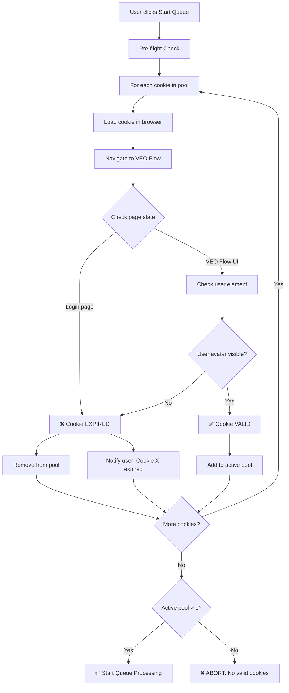
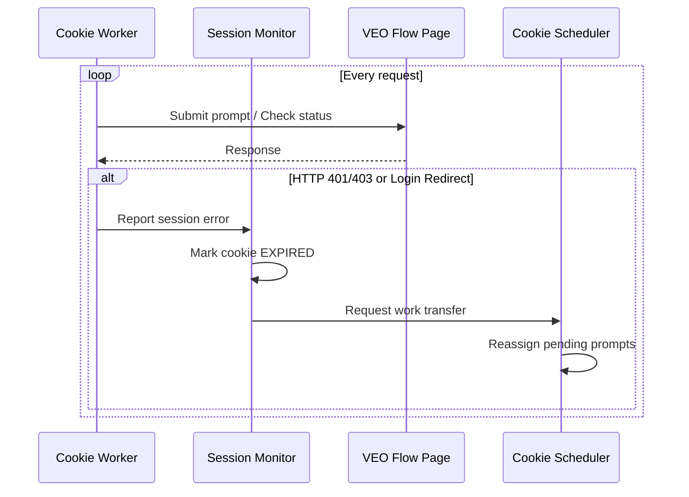
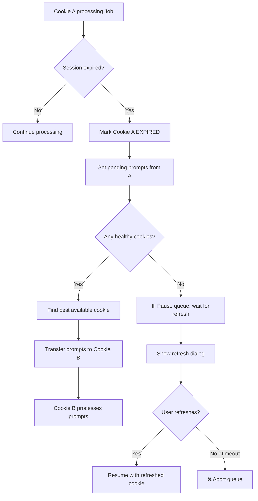
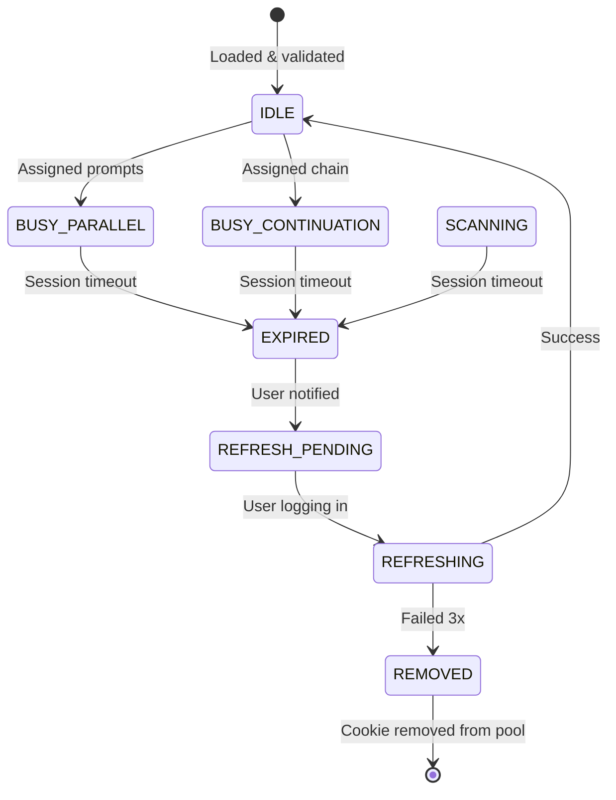

# 🔐 WORKFLOW: Cookie Validation & Refresh

## Tổng quan

Cookie Validation workflow đảm bảo tất cả cookies (Google sessions) còn valid trước và trong quá trình xử lý queue. Bao gồm pre-flight check, runtime monitoring, và auto-refresh mechanism.

---

## 🎯 Validation Types

| Type | Timing | Purpose | Action on Fail |
|------|--------|---------|----------------|
| **Pre-flight** | Trước khi start queue | Loại cookies hết hạn | Remove from pool |
| **Runtime** | Trong lúc processing | Detect session timeout | Pause + refresh |
| **Proactive** | Mỗi 30 phút | Prevent expiration | Silent refresh |

---

## 📋 Pre-flight Validation Flow

### Main Diagram



### Detection Logic

```python
class CookieValidator:
    """Validate Google session cookies for VEO Flow."""
    
    # XPath selectors for login detection
    LOGIN_PAGE_INDICATORS = [
        "//input[@type='email']",                    # Google login email field
        "//div[contains(text(), 'Sign in')]",        # Sign in text
        "//button[contains(text(), 'Next')]",        # Login next button
    ]
    
    VEO_FLOW_INDICATORS = [
        "//button[@aria-label='Account']",           # User avatar
        "//div[contains(@class, 'flow-canvas')]",    # Flow canvas
        "//button[contains(text(), 'New project')]", # New project button
    ]
    
    async def validate_cookie(self, cookie: Cookie) -> ValidationResult:
        """Check if cookie is still valid for VEO Flow."""
        
        browser = await self._create_browser(cookie)
        
        try:
            # Navigate to VEO Flow
            await browser.get("https://labs.google/fx/tools/flow")
            await asyncio.sleep(3)  # Wait for redirects
            
            # Check for login page indicators
            for xpath in self.LOGIN_PAGE_INDICATORS:
                elements = browser.find_elements(By.XPATH, xpath)
                if elements:
                    return ValidationResult(
                        valid=False,
                        reason="REDIRECT_TO_LOGIN",
                        cookie=cookie
                    )
            
            # Check for VEO Flow indicators
            for xpath in self.VEO_FLOW_INDICATORS:
                elements = browser.find_elements(By.XPATH, xpath)
                if elements:
                    return ValidationResult(
                        valid=True,
                        reason="VEO_FLOW_LOADED",
                        cookie=cookie
                    )
            
            # Neither login nor VEO - unknown state
            return ValidationResult(
                valid=False,
                reason="UNKNOWN_STATE",
                cookie=cookie
            )
            
        finally:
            browser.quit()
    
    async def validate_all(self, cookies: list[Cookie]) -> PoolStatus:
        """Validate all cookies in pool."""
        
        results = await asyncio.gather(*[
            self.validate_cookie(c) for c in cookies
        ])
        
        valid = [r.cookie for r in results if r.valid]
        invalid = [r for r in results if not r.valid]
        
        return PoolStatus(
            valid_cookies=valid,
            invalid_cookies=invalid,
            ready=len(valid) > 0
        )
```

---

## 🔄 Runtime Monitoring

### Session Expiry Detection



### Error Detection Patterns

```python
class SessionMonitor:
    """Monitor for session expiry during processing."""
    
    # Patterns indicating session expired
    EXPIRY_PATTERNS = [
        # HTTP status codes
        {"type": "status", "values": [401, 403]},
        
        # URL redirects
        {"type": "url", "contains": ["accounts.google.com", "signin"]},
        
        # Page content
        {"type": "xpath", "selector": "//input[@type='email']"},
        {"type": "xpath", "selector": "//div[text()='Session expired']"},
        
        # Error toasts
        {"type": "xpath", "selector": "//li[@data-sonner-toast and contains(., 'authentication')]"},
    ]
    
    async def check_session(self, browser: Browser) -> SessionStatus:
        """Check if current session is still valid."""
        
        current_url = browser.current_url
        
        # Check URL redirect
        if any(pattern in current_url for pattern in ["accounts.google", "signin"]):
            return SessionStatus.EXPIRED
        
        # Check for login elements
        try:
            email_input = browser.find_element(By.XPATH, "//input[@type='email']")
            if email_input.is_displayed():
                return SessionStatus.EXPIRED
        except NoSuchElementException:
            pass
        
        # Check for error toasts
        try:
            auth_error = browser.find_element(
                By.XPATH, 
                "//li[@data-sonner-toast and contains(., 'auth')]"
            )
            if auth_error:
                return SessionStatus.EXPIRED
        except NoSuchElementException:
            pass
        
        return SessionStatus.VALID
    
    async def on_session_expired(self, cookie: Cookie):
        """Handle expired session."""
        
        # 1. Mark cookie as expired
        cookie.state = CookieState.EXPIRED
        
        # 2. Get pending work
        pending_prompts = cookie.active_prompts.copy()
        cookie.active_prompts = []
        
        # 3. Notify scheduler for reassignment
        await self.scheduler.reassign_prompts(pending_prompts, exclude_cookie=cookie)
        
        # 4. Notify user
        self.ui.show_warning(f"⚠️ Cookie {cookie.name} hết hạn. Đang chuyển công việc...")
        
        # 5. Request refresh
        await self.request_cookie_refresh(cookie)
```

---

## 🔁 Cookie Refresh Flow

### User-Assisted Refresh

```mermaid
flowchart TD
    A[Cookie EXPIRED detected] --> B[Pause cookie's work]
    B --> C[Show refresh dialog]
    C --> D[Open browser window]
    D --> E[User logs in manually]
    E --> F[User clicks "Done"]
    F --> G[Re-validate cookie]
    
    G --> H{Valid?}
    H -->|Yes| I[✅ Cookie restored to pool]
    H -->|No| J[❌ Show error, retry]
    
    I --> K[Resume processing]
    J --> D
```

### Refresh Manager

```python
class CookieRefreshManager:
    """Manage cookie refresh process."""
    
    async def request_refresh(self, cookie: Cookie) -> RefreshResult:
        """Request user to refresh expired cookie."""
        
        # 1. Pause any work on this cookie
        cookie.state = CookieState.REFRESH_PENDING
        
        # 2. Show refresh dialog
        dialog = RefreshDialog(
            title=f"Cookie {cookie.name} cần đăng nhập lại",
            message="Phiên đăng nhập đã hết hạn. Vui lòng đăng nhập lại.",
            cookie=cookie
        )
        
        # 3. Open browser for manual login
        browser = await self._create_browser(cookie)
        await browser.get("https://accounts.google.com")
        
        # 4. Wait for user confirmation
        user_confirmed = await dialog.wait_for_confirmation()
        
        if user_confirmed:
            # 5. Re-validate
            result = await self.validator.validate_cookie(cookie)
            
            if result.valid:
                cookie.state = CookieState.IDLE
                await self._save_updated_cookie(cookie, browser)
                return RefreshResult.SUCCESS
            else:
                return RefreshResult.FAILED
        else:
            return RefreshResult.CANCELLED
    
    async def auto_refresh_check(self):
        """Proactive refresh check every 30 minutes."""
        
        while self.running:
            await asyncio.sleep(30 * 60)  # 30 minutes
            
            for cookie in self.cookies:
                if cookie.state == CookieState.IDLE:
                    # Quick validation
                    result = await self.validator.validate_cookie(cookie)
                    
                    if not result.valid:
                        await self.request_refresh(cookie)
```

---

## 🔀 Auto-Transfer on Expiry

### Transfer Flow (Integrated with Multi-Cookie Parallel)



### Transfer Logic

```python
class ExpiredCookieTransferHandler:
    """Handle automatic transfer when cookie expires mid-processing."""
    
    async def on_cookie_expired(self, expired_cookie: Cookie):
        """Transfer work from expired cookie to healthy one."""
        
        # 1. Collect pending work
        pending = self._collect_pending_work(expired_cookie)
        
        if not pending:
            log.info(f"Cookie {expired_cookie.id} expired but no pending work")
            return
        
        # 2. Find healthy cookie
        healthy_cookie = self._find_healthy_cookie(exclude=expired_cookie)
        
        if healthy_cookie:
            await self._transfer_work(pending, healthy_cookie)
        else:
            await self._handle_no_healthy_cookies(pending, expired_cookie)
    
    def _collect_pending_work(self, cookie: Cookie) -> PendingWork:
        """Collect all unfinished work from expired cookie."""
        
        pending = PendingWork()
        
        # Active prompts not yet submitted
        pending.prompts = [p for p in cookie.active_prompts 
                          if p.status in ["pending", "submitting"]]
        
        # For continuation chains: need special handling
        if cookie.current_CONTINUATION_chain:
            chain = cookie.current_CONTINUATION_chain
            remaining = chain.prompts[chain.current_index:]
            pending.CONTINUATION_chain = CONTINUATIONChain(
                prompts=remaining,
                last_frame=chain.last_frame,  # Preserve extracted frame
                job_id=chain.job_id
            )
        
        # Pending downloads (videos generated but not downloaded)
        pending.downloads = list(cookie.download_queue)
        
        return pending
    
    def _find_healthy_cookie(self, exclude: Cookie) -> Optional[Cookie]:
        """Find a healthy cookie to receive transferred work."""
        
        candidates = [c for c in self.cookies 
                      if c != exclude 
                      and c.state in [CookieState.IDLE, CookieState.BUSY_PARALLEL]
                      and c.available_slots > 0]
        
        if not candidates:
            return None
        
        # Prefer IDLE cookies
        idle = [c for c in candidates if c.state == CookieState.IDLE]
        if idle:
            return idle[0]
        
        # Otherwise, one with most slots
        return max(candidates, key=lambda c: c.available_slots)
    
    async def _transfer_work(self, pending: PendingWork, target: Cookie):
        """Transfer pending work to target cookie."""
        
        log.info(f"Transferring {len(pending.prompts)} prompts to {target.id}")
        
        # Transfer regular prompts
        for prompt in pending.prompts:
            prompt.status = "pending"  # Reset status
            target.active_prompts.append(prompt)
        
        # Transfer continuation chain (special handling)
        if pending.CONTINUATION_chain:
            # continuation chains need exclusive cookie
            if target.state == CookieState.IDLE:
                target.current_CONTINUATION_chain = pending.CONTINUATION_chain
                target.state = CookieState.BUSY_CONTINUATION
            else:
                # Cannot transfer continuation to busy cookie
                # Queue it for later
                self.pending_CONTINUATION_chains.append(pending.CONTINUATION_chain)
        
        # Resume processing on target
        await self.scheduler.resume_cookie(target)
    
    async def _handle_no_healthy_cookies(self, pending: PendingWork, expired: Cookie):
        """Handle case when no healthy cookies available."""
        
        self.ui.show_error(
            "⚠️ Không có cookie khả dụng!",
            f"Cookie {expired.name} đã hết hạn. Vui lòng làm mới ít nhất 1 cookie để tiếp tục."
        )
        
        # Save pending work to disk (survive app restart)
        await self._save_pending_work(pending)
        
        # Request refresh
        result = await self.refresh_manager.request_refresh(expired)
        
        if result == RefreshResult.SUCCESS:
            # Reload pending work
            await self._transfer_work(pending, expired)
        else:
            # User cancelled or failed
            self.ui.show_error("Queue tạm dừng. Không thể tiếp tục mà không có cookie hợp lệ.")
```

---

## 📊 Cookie State Extensions



---

## ⚙️ Configuration

```python
@dataclass
class CookieValidationConfig:
    """Configuration for cookie validation."""
    
    # Pre-flight
    preflight_enabled: bool = True
    preflight_timeout_seconds: int = 30
    
    # Runtime monitoring
    check_interval_seconds: int = 60
    max_consecutive_failures: int = 3
    
    # Proactive refresh
    proactive_refresh_enabled: bool = True
    proactive_refresh_interval_minutes: int = 30
    
    # Auto-transfer
    auto_transfer_on_expiry: bool = True
    transfer_timeout_seconds: int = 10
    
    # Refresh
    max_refresh_attempts: int = 3
    refresh_timeout_minutes: int = 5
```

---

## 🔗 Related Files

| File | Description |
|------|-------------|
| [WORKFLOW_MULTI_COOKIE_PARALLEL.md](./WORKFLOW_MULTI_COOKIE_PARALLEL.md) | Multi-cookie orchestration |
| [TAB_08_LICENSE.md](../01_UI_UX/TAB_08_LICENSE.md) | Cookie management UI |
