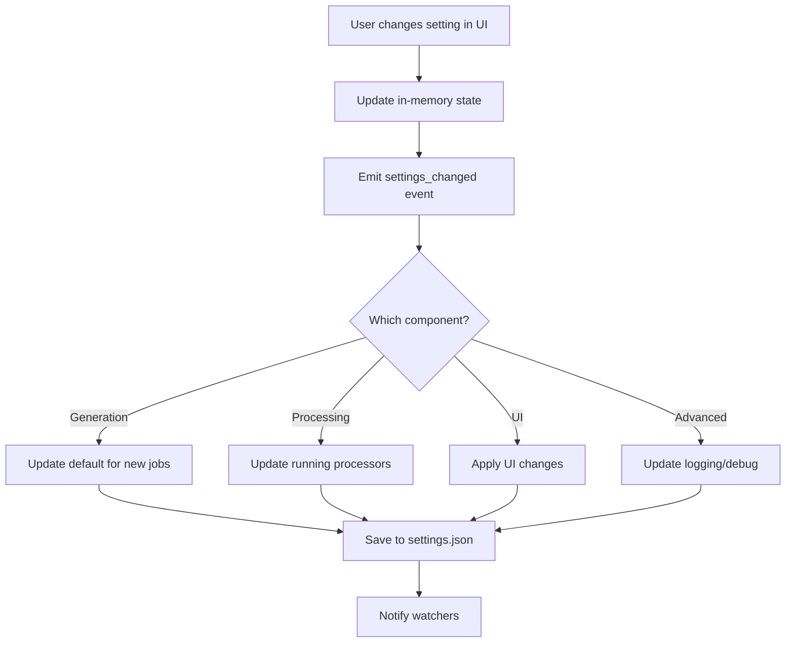
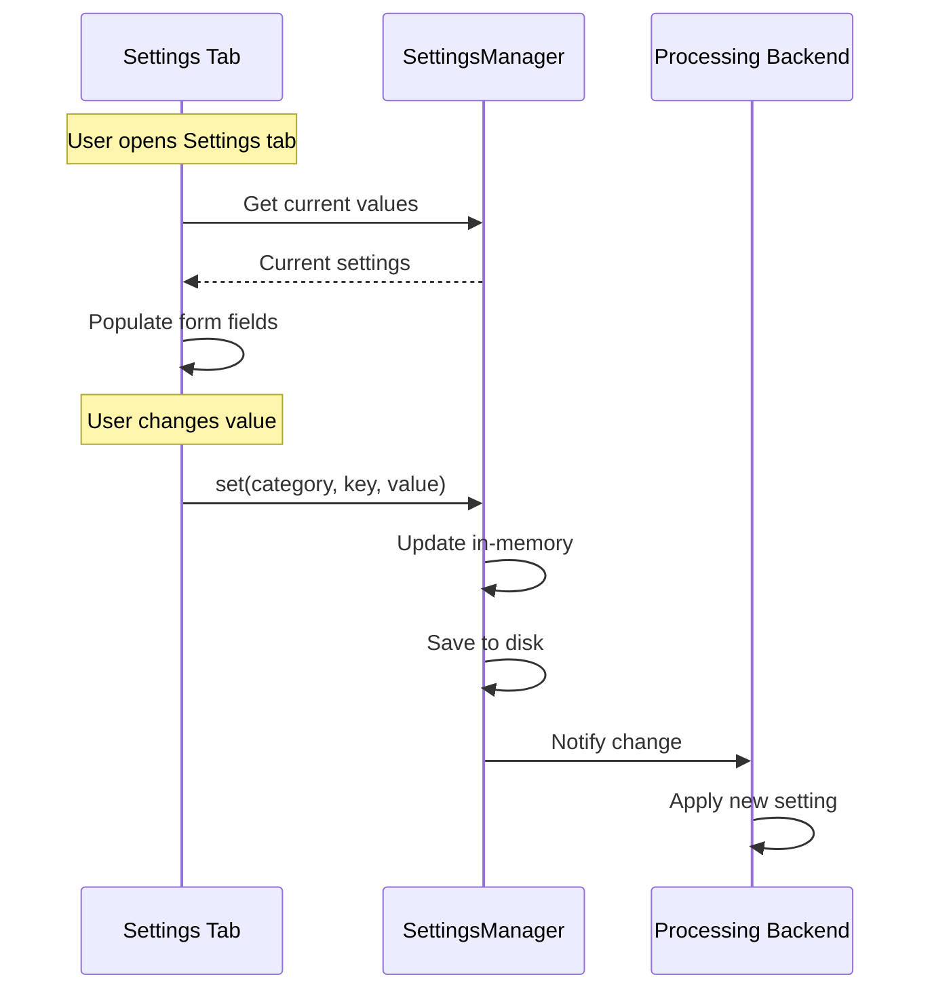

# ⚙️ WORKFLOW: Settings Sync (Đồng bộ Settings)

## Tổng quan

Workflow quản lý việc lưu/load/sync settings giữa UI, backend, và persistent storage.

---

## 🎯 Settings Categories

| Category | Scope | Storage | Sync |
|----------|-------|---------|------|
| **Generation** | Per-job | Memory + Queue | Job-level |
| **Application** | Global | Local file | App startup |
| **Cookie/Auth** | Global | Encrypted file | On change |
| **License** | Global | Encrypted file | License check |
| **UI Preferences** | Global | Local file | On change |

---

## 💾 Settings Storage

### File Structure

```
~/.veoauto/
├── settings.json        # App settings (non-sensitive)
├── cookies.enc          # Encrypted cookie data
├── license.enc          # Encrypted license data
├── ui_prefs.json        # UI preferences
└── queue/
    └── queue.json       # Queue state
```

### settings.json Structure

```json
{
  "version": "1.0",
  "updated_at": "2026-01-21T22:15:00",
  
  "generation": {
    "default_model": "veo3_fast",
    "default_aspect_ratio": "landscape",
    "default_videos_per_prompt": 4,
    "default_download_folder": "VEO_Output"
  },
  
  "processing": {
    "max_parallel_cookies": 3,
    "queue_full_retry_interval": 10,
    "queue_full_max_retries": 30,
    "scan_interval_seconds": 5,
    "download_chunk_size_mb": 1
  },
  
  "ui": {
    "theme": "dark",
    "language": "vi",
    "show_dev_console": false,
    "confirm_before_start": true
  },
  
  "advanced": {
    "debug_mode": false,
    "log_level": "INFO",
    "browser_headless": false,
    "auto_update_check": true
  }
}
```

---

## 🔄 Sync Flow

### Settings Change Flow



### Implementation

```python
from dataclasses import dataclass, field, asdict
from typing import Callable
import json

@dataclass
class GenerationSettings:
    default_model: str = "veo3_fast"
    default_aspect_ratio: str = "landscape"
    default_videos_per_prompt: int = 4
    default_download_folder: str = "VEO_Output"

@dataclass
class ProcessingSettings:
    max_parallel_cookies: int = 3
    queue_full_retry_interval: int = 10
    queue_full_max_retries: int = 30
    scan_interval_seconds: int = 5
    download_chunk_size_mb: int = 1

@dataclass
class AppSettings:
    generation: GenerationSettings = field(default_factory=GenerationSettings)
    processing: ProcessingSettings = field(default_factory=ProcessingSettings)
    # ... other categories


class SettingsManager:
    """Central settings management with sync."""
    
    def __init__(self, settings_file: Path):
        self.settings_file = settings_file
        self.settings = self._load_or_default()
        self._watchers: list[Callable] = []
    
    def get(self, category: str, key: str, default=None):
        """Get setting value."""
        cat = getattr(self.settings, category, None)
        if cat:
            return getattr(cat, key, default)
        return default
    
    def set(self, category: str, key: str, value):
        """Set setting and trigger sync."""
        cat = getattr(self.settings, category, None)
        if cat and hasattr(cat, key):
            setattr(cat, key, value)
            self._on_change(category, key, value)
    
    def _on_change(self, category: str, key: str, value):
        """Handle setting change."""
        
        # Save to disk
        self._save()
        
        # Notify watchers
        for watcher in self._watchers:
            try:
                watcher(category, key, value)
            except Exception as e:
                log.error(f"Watcher error: {e}")
    
    def watch(self, callback: Callable):
        """Register change watcher."""
        self._watchers.append(callback)
    
    def _save(self):
        """Save to disk."""
        data = {
            "version": "1.0",
            "updated_at": datetime.now().isoformat(),
            **{k: asdict(v) for k, v in asdict(self.settings).items()}
        }
        
        with open(self.settings_file, "w", encoding="utf-8") as f:
            json.dump(data, f, indent=2, ensure_ascii=False)
    
    def _load_or_default(self) -> AppSettings:
        """Load from disk or return defaults."""
        if not self.settings_file.exists():
            return AppSettings()
        
        try:
            with open(self.settings_file, "r", encoding="utf-8") as f:
                data = json.load(f)
            return self._dict_to_settings(data)
        except:
            return AppSettings()
```

---

## 🔗 UI ↔ Backend Sync

### Settings Tab Binding



### Example: Changing Max Parallel Cookies

```python
class SettingsTab:
    """Settings UI tab."""
    
    def __init__(self, settings_manager: SettingsManager):
        self.settings = settings_manager
        self._build_ui()
        self._bind_events()
    
    def _build_ui(self):
        """Create settings UI."""
        
        # Parallel cookies slider
        self.parallel_slider = ctk.CTkSlider(
            master=self.frame,
            from_=1, to=5,
            number_of_steps=4,
            command=self._on_parallel_change
        )
        self.parallel_slider.set(
            self.settings.get("processing", "max_parallel_cookies")
        )
    
    def _on_parallel_change(self, value: float):
        """Handle slider change."""
        value = int(value)
        
        # Update setting
        self.settings.set("processing", "max_parallel_cookies", value)
        
        # UI feedback
        self.parallel_label.configure(text=f"Max Cookies: {value}")
```

---

## 🔐 Secure Settings (Cookies/License)

### Encryption

```python
import base64
from cryptography.fernet import Fernet
from cryptography.hazmat.primitives import hashes
from cryptography.hazmat.primitives.kdf.pbkdf2 import PBKDF2HMAC

class SecureStorage:
    """Encrypted storage for sensitive data."""
    
    def __init__(self, key_source: str):
        # Derive key from machine ID
        machine_id = HardwareFingerprint.get_machine_id()
        key = self._derive_key(machine_id + key_source)
        self.cipher = Fernet(key)
    
    def _derive_key(self, password: str) -> bytes:
        """Derive encryption key from password."""
        kdf = PBKDF2HMAC(
            algorithm=hashes.SHA256(),
            length=32,
            salt=b"veoauto_salt_v1",
            iterations=100000
        )
        return base64.urlsafe_b64encode(kdf.derive(password.encode()))
    
    def save(self, filepath: Path, data: dict):
        """Encrypt and save data."""
        json_bytes = json.dumps(data).encode("utf-8")
        encrypted = self.cipher.encrypt(json_bytes)
        
        with open(filepath, "wb") as f:
            f.write(encrypted)
    
    def load(self, filepath: Path) -> dict:
        """Load and decrypt data."""
        with open(filepath, "rb") as f:
            encrypted = f.read()
        
        decrypted = self.cipher.decrypt(encrypted)
        return json.loads(decrypted.decode("utf-8"))
```

---

## 📊 Settings Validation

```python
class SettingsValidator:
    """Validate settings values."""
    
    RULES = {
        "processing.max_parallel_cookies": {"min": 1, "max": 10, "type": int},
        "processing.scan_interval_seconds": {"min": 1, "max": 60, "type": int},
        "generation.default_videos_per_prompt": {"min": 1, "max": 4, "type": int},
        "generation.default_model": {"choices": ["veo2_fast", "veo3_fast", "veo3_quality"]},
        "generation.default_aspect_ratio": {"choices": ["landscape", "portrait", "square"]},
    }
    
    def validate(self, category: str, key: str, value) -> ValidationResult:
        """Validate setting value."""
        
        full_key = f"{category}.{key}"
        rule = self.RULES.get(full_key)
        
        if not rule:
            return ValidationResult(valid=True)
        
        # Type check
        if "type" in rule and not isinstance(value, rule["type"]):
            return ValidationResult(
                valid=False,
                error=f"Expected {rule['type'].__name__}, got {type(value).__name__}"
            )
        
        # Range check
        if "min" in rule and value < rule["min"]:
            return ValidationResult(valid=False, error=f"Minimum is {rule['min']}")
        
        if "max" in rule and value > rule["max"]:
            return ValidationResult(valid=False, error=f"Maximum is {rule['max']}")
        
        # Choices check
        if "choices" in rule and value not in rule["choices"]:
            return ValidationResult(
                valid=False, 
                error=f"Must be one of: {rule['choices']}"
            )
        
        return ValidationResult(valid=True)
```

---

## 🔗 Related Files

| File | Purpose |
|------|---------|
| `TAB_07_SETTINGS.md` | Settings UI layout |
| `WORKFLOW_QUEUE_PERSISTENCE.md` | Queue state persistence |
