# 📹 TAB_01: Text-to-Video Workflow

## Tổng quan

Text-to-Video (T2V) là workflow cơ bản nhất, chuyển đổi prompt văn bản thành video sử dụng VEO AI.

---

## 🎯 Main Workflow Diagram

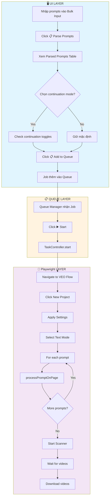

---

## 📋 Chi tiết từng nút bấm

### 1. Nút "📥 Import TXT"

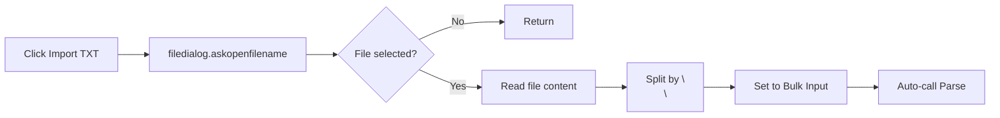

| Bước | Action | Wait Time |
|------|--------|-----------|
| 1 | Hiện file dialog | User action |
| 2 | Đọc nội dung file | 0ms |
| 3 | Split bằng `\n\n` | 0ms |
| 4 | Gán vào bulk_input | 0ms |
| 5 | Tự động gọi Parse | 0ms |

---

### 2. Nút "📋 Parse Prompts"

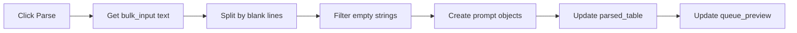

**Code logic:**
```python
def on_parse_click():
    raw = bulk_input.get("1.0", "end").strip()
    prompts = [p.strip() for p in raw.split("\n\n") if p.strip()]
    
    for i, prompt in enumerate(prompts):
        parsed_table.add_row({
            "index": i + 1,
            "text": prompt[:50] + "...",
            "continuation": i > 0  # Default: continuation ON for 2nd+
        })
    
    queue_preview.update(
        jobs=1,
        tasks=len(prompts),
        total=len(prompts) * outputs_per_prompt
    )
```

---

### 3. Nút "📋 Add to Queue"

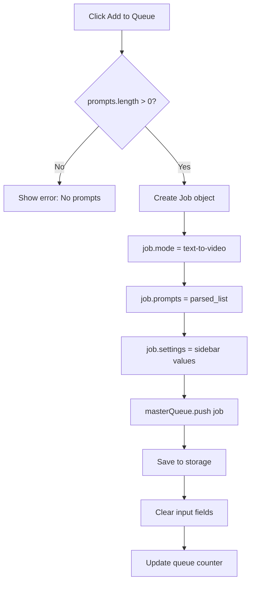

**Job Object Structure:**
```python
job = {
    "id": "1737445615123",
    "mode": "text-to-video",
    "prompts": [
        "A sunset scene over mountains...",
        "Camera pans across the valley..."
    ],
    "images": [],  # Empty for T2V
    "downloadFolder": "T2V-Project-01",
    "repeatCount": "4",
    "model": "default",  # veo3_fast
    "aspectRatio": "landscape",
    "startFrom": 1,
    "status": "pending",
    "progress": {"completed": 0, "total": 2},
    "currentIndex": 0
}
```

---

## 🔌 Playwright Execution Flow

### Phase 1: Project Initialization

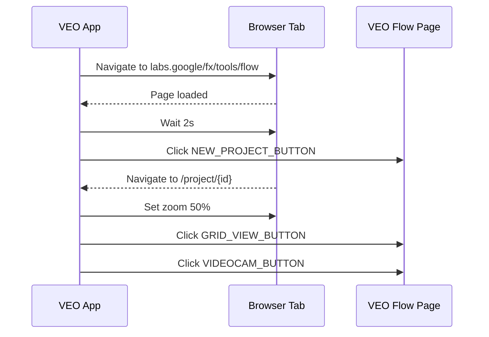

| Bước | XPath Selector | Wait After |
|------|---------------|------------|
| 1 | Navigate URL | Tab load (60s max) |
| 2 | `NEW_PROJECT_BUTTON_XPATH` | Tab load (60s max) |
| 3 | `setZoom(0.5)` | 2s |
| 4 | `GRID_VIEW_BUTTON_XPATH` | 500ms |
| 5 | `VIDEOCAM_BUTTON_XPATH` | 500ms |

---

### Phase 2: Settings Configuration

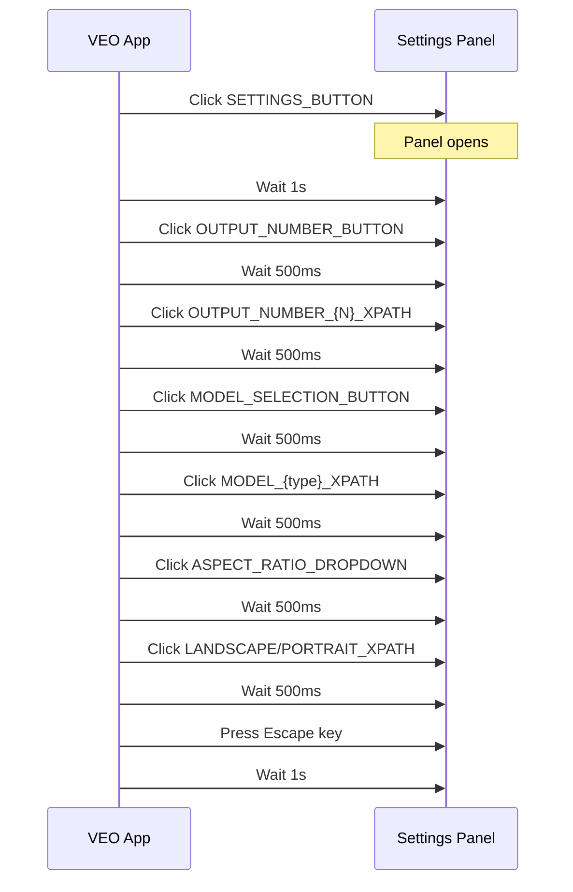

**Selectors Used:**
| Setting | Button Selector | Option Selector |
|---------|----------------|-----------------|
| Output Count | `OUTPUT_NUMBER_BUTTON_XPATH` | `OUTPUT_NUMBER_{1,2,3,4}_XPATH` |
| Model | `MODEL_SELECTION_BUTTON_XPATH` | `MODEL_VEO_{2,3}_{FAST,QUALITY}_XPATH` |
| Aspect | `ASPECT_RATIO_DROPDOWN_XPATH` | `LANDSCAPE/PORTRAIT_ASPECT_RATIO_XPATH` |

---

### Phase 3: Mode Selection

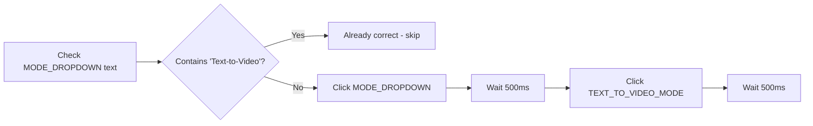

---

### Phase 4: Prompt Processing (processPromptOnPage)

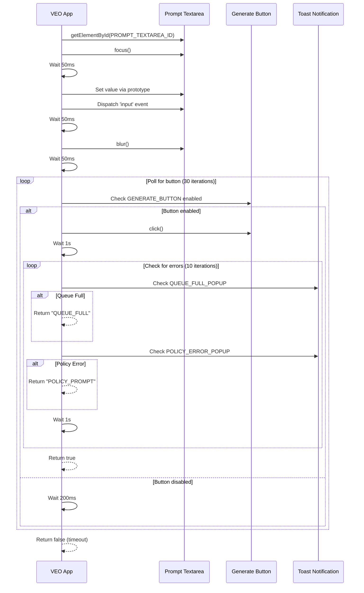

**Timing Constants:**
| Constant | Value | Purpose |
|----------|-------|---------|
| `FOCUS_DELAY` | 50ms | After focus/blur/input |
| `BUTTON_POLL_INTERVAL` | 200ms | Between button checks |
| `BUTTON_POLL_MAX` | 30 | Max button poll iterations |
| `POST_CLICK_DELAY` | 1000ms | After clicking Generate |
| `ERROR_CHECK_ITERATIONS` | 10 | Times to check for popups |

---

### Phase 5: Queue Full Handling

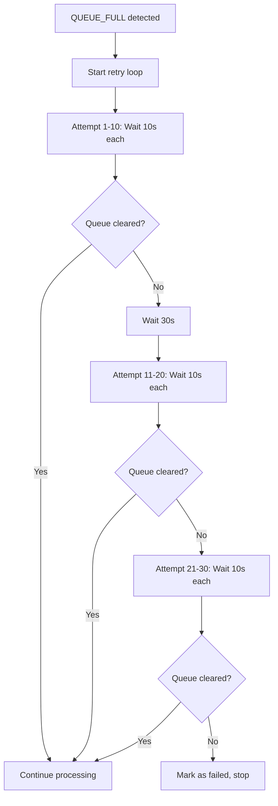

**Retry Configuration:**
| Phase | Attempts | Interval | Total Wait |
|-------|----------|----------|------------|
| Phase 1 | 10 | 10s | 100s |
| Wait | - | 30s | 30s |
| Phase 2 | 10 | 10s | 100s |
| Phase 3 | 10 | 10s | 100s |
| **Total** | **30** | - | **~5.5 min** |

---

### Phase 6: Video Scanning & Download

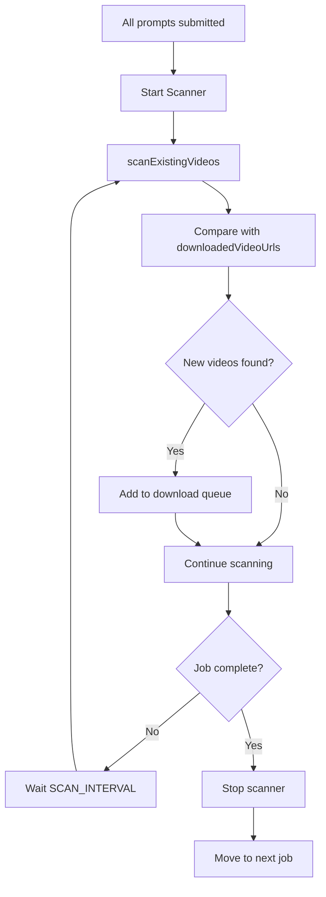

**Scanner Configuration:**
| Setting | Value |
|---------|-------|
| `SCAN_INTERVAL` | 5000ms (5s) |
| `FINAL_SCAN_TIMEOUT` | 180000ms (3 min) |
| `FINAL_SCAN_CHECK_INTERVAL` | 5000ms (5s) |

---

## ❌ Error Handling

| Error Type | Detection | Action |
|------------|-----------|--------|
| QUEUE_FULL | XPath: `...contains(., '5')` | Retry loop (30 attempts) |
| POLICY_PROMPT | XPath: `...@data-sonner-toast...error` | Mark failed, skip |
| TIMEOUT | Button not enabled in 6s | Reload page, retry (max 3) |
| NETWORK | Tab closed/navigation error | Stop queue |

## 🔄 Continuation Mode (Frame Chaining)

Khi continuation mode được bật (per-prompt toggle), worker tự chuyển sang F2V workflow:

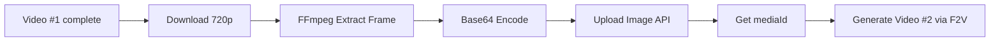

### T2V + Continuation Logic

| Prompt | CONT | Workflow thực tế | Image Source |
|--------|------|-----------------|-------------|
| #1 | OFF | T2V | — |
| #2 | ON | **F2V** | Extracted frame từ #1 |
| #3 | ON | **F2V** | Extracted frame từ #2 |
| #4 | OFF | T2V | — (new chain) |

> [!NOTE]
> T2V + CONT ON = Worker tự động chuyển workflow thành F2V, dùng extracted frame làm `startImage` (hoặc `endImage` nếu `frame_source=FIRST`).

Xem chi tiết matrix: [FRAME_CONTINUATION_WORKFLOW.md](../02_Architecture/FRAME_CONTINUATION_WORKFLOW.md)

---

## 🔗 Related Files

| File | Description |
|------|-------------|
| [TAB_01_TEXT_TO_VIDEO.md](../01_UI_UX/TAB_01_TEXT_TO_VIDEO.md) | UI Layout & Widgets |
| [FRAME_CONTINUATION_WORKFLOW.md](../02_Architecture/FRAME_CONTINUATION_WORKFLOW.md) | Full continuation workflow & terminology |
