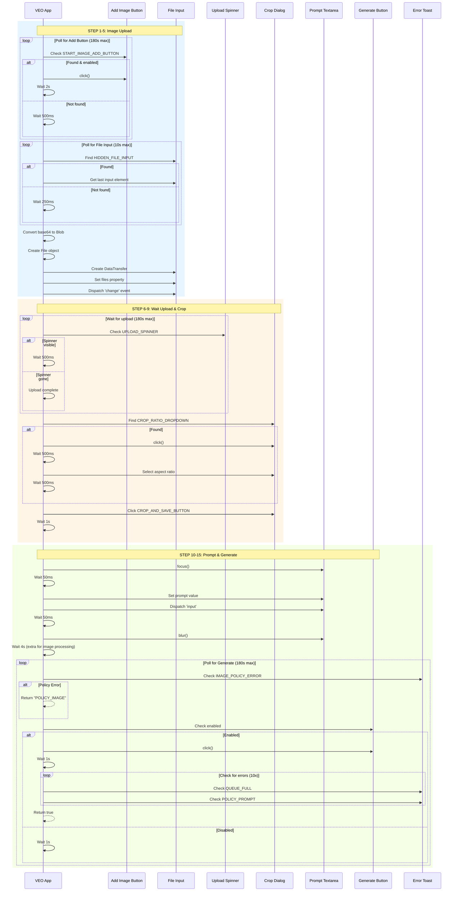
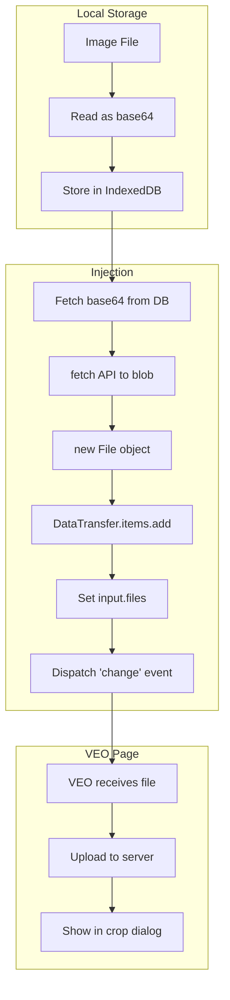
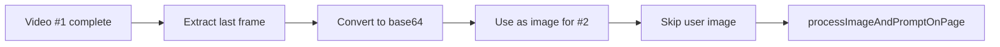

# 🎬 TAB_02: Image-to-Video Workflow

## Tổng quan

Image-to-Video (I2V) workflow tải lên hình ảnh và kết hợp với prompt để tạo video. Khác biệt chính với T2V là bước upload ảnh.

---

## 🎯 Main Workflow Diagram

```mermaid
flowchart TD
    subgraph UI["🖥️ UI LAYER"]
        A[📂 Import images to Library] --> B[Set [tag] format names]
        B --> C[Nhập prompts với [tag] references]
        C --> D[Click 📋 Parse Prompts]
        D --> E[Match [tag] với images]
        E --> F{All tags matched?}
        F -->|No| G[⚠️ Show missing warning]
        F -->|Yes| H[Ready to queue]
        G --> H
        H --> I[Click 📋 Add to Queue]
    end

    subgraph QUEUE["📋 QUEUE LAYER"]
        I --> J[Save images to IndexedDB]
        J --> K[Create Job with image refs]
        K --> L[Queue Manager receives Job]
    end

    subgraph Playwright["🔌 Playwright LAYER"]
        L --> M[Navigate to VEO Flow]
        M --> N[Apply Settings]
        N --> O[Select Image Mode]
        O --> P[For each image+prompt pair]
        P --> Q[processImageAndPromptOnPage]
        Q --> R{More pairs?}
        R -->|Yes| P
        R -->|No| S[Start Scanner]
        S --> T[Download videos]
    end

    style UI fill:#e8f5e9
    style QUEUE fill:#fff3e0
    style Playwright fill:#f3e5f5
```

---

## 📂 Image Library Management

### Import Flow

```mermaid
flowchart LR
    A[Click 📂 Import] --> B{File or Folder?}
    B -->|File| C[Select images]
    B -->|Folder| D[Scan folder recursively]
    C --> E[Copy to Library folder]
    D --> E
    E --> F[Check filename format]
    F --> G{Has [brackets]?}
    G -->|No| H[Auto-add brackets]
    G -->|Yes| I[Keep original]
    H --> J[Refresh grid]
    I --> J
```

### Tag Matching Logic

```mermaid
flowchart TD
    A[Parse prompt text] --> B[Extract [tag] patterns]
    B --> C[For each tag]
    C --> D{tag.lower() in library?}
    D -->|Yes| E[Add to matched list]
    D -->|No| F[Add to missing list]
    E --> G{More tags?}
    F --> G
    G -->|Yes| C
    G -->|No| H[Return ParsedPrompt]
```

**Code:**
```python
TAG_PATTERN = re.compile(r'\[([^\]]+)\]')

def parse_i2v_prompt(prompt: str, library: dict) -> ParsedPrompt:
    tags = TAG_PATTERN.findall(prompt)  # ['hero', 'castle']
    clean = TAG_PATTERN.sub('', prompt).strip()
    
    matched = []
    missing = []
    for tag in tags[:1]:  # Max 1 image for I2V
        key = tag.lower()
        if key in library:
            matched.append(library[key])
        else:
            missing.append(f"[{tag}]")
    
    return ParsedPrompt(
        raw=prompt,
        clean=clean,
        images=matched,
        missing=missing
    )
```

---

## 🔌 Playwright Execution Flow

### Phase 1: Mode Selection (Image Mode)

```mermaid
sequenceDiagram
    participant App as VEO App
    participant Dropdown as Mode Dropdown
    participant Option as Mode Option
    
    App->>Dropdown: Check current text
    alt Contains "Image-to-Video"
        App->>App: Already correct, skip
    else Contains other
        App->>Dropdown: click()
        App->>App: Wait 500ms
        App->>Option: Click IMAGE_TO_VIDEO_MODE
        App->>App: Wait 500ms
    end
```

**Selectors:**
```python
MODE_DROPDOWN_XPATH = "//button[@role='combobox' and .//i[normalize-space()='arrow_drop_down'] and .//div[@data-type='button-overlay']]"
IMAGE_TO_VIDEO_MODE_XPATH = "//div[@role='option' and .//i[normalize-space(text())='photo_spark']]"
```

---

### Phase 2: processImageAndPromptOnPage (15 Steps)



---

### Step-by-Step Timing Table

| Step | Action | Max Wait | Interval | Error Type |
|------|--------|----------|----------|------------|
| 1 | Poll for Add Button | 180s | 500ms | Timeout |
| 2 | Click Add Button | 2s | - | - |
| 3 | Poll for File Input | 10s | 250ms | Timeout |
| 4 | Create File from base64 | - | - | FILE_READ_ERROR |
| 5 | Inject via DataTransfer | - | - | - |
| 6 | Wait for spinner gone | 180s | 500ms | Timeout |
| 7 | Select crop ratio | 500ms | - | Skip if not found |
| 8 | Click Crop & Save | 1s | - | - |
| 9 | Focus textarea | 50ms | - | - |
| 10 | Set prompt | 50ms | - | - |
| 11 | Blur textarea | 4s | - | - |
| 12 | Check image policy | - | - | POLICY_IMAGE |
| 13 | Poll Generate button | 180s | 1s | Timeout |
| 14 | Click Generate | 1s | - | - |
| 15 | Check for errors | 10s | 1s | QUEUE_FULL, POLICY_PROMPT |

---

## 📦 Image Data Flow



**Injection Code:**
```javascript
async function injectImage(base64, filename, mimeType, selectors) {
    // Fetch base64 as blob
    const response = await fetch(base64);
    const blob = await response.blob();
    
    // Create File object
    const file = new File([blob], filename, { type: mimeType });
    
    // Create DataTransfer and add file
    const dataTransfer = new DataTransfer();
    dataTransfer.items.add(file);
    
    // Find hidden input and inject
    const input = document.querySelector(selectors.HIDDEN_FILE_INPUT);
    input.files = dataTransfer.files;
    input.dispatchEvent(new Event('change', { bubbles: true }));
}
```

---

## ❌ Error Handling

| Error Type | Detection | XPath | Action |
|------------|-----------|-------|--------|
| POLICY_IMAGE | Before generate | `IMAGE_POLICY_ERROR_POPUP_XPATH` | Mark failed, skip |
| POLICY_PROMPT | After generate | `PROMPT_POLICY_ERROR_POPUP_XPATH` | Mark failed, skip |
| QUEUE_FULL | After generate | `QUEUE_FULL_POPUP_XPATH` | Retry loop (30x) |
| FILE_READ_ERROR | During blob conversion | - | Mark failed, skip |
| TIMEOUT | Button not found | - | Reload, retry (max 3) |

**Error XPaths:**
```python
IMAGE_POLICY_ERROR_POPUP_XPATH = "//li[@data-sonner-toast and .//i[normalize-space(text())='error'] and not(.//*[contains(., '5')])]"
QUEUE_FULL_POPUP_XPATH = "//li[@data-sonner-toast and .//i[normalize-space(text())='error'] and .//*[contains(., '5')]]"
```

---

## 🔄 continuation Mode (Frame Chaining)

Khi continuation mode được bật, ảnh nguồn được thay thế bằng frame cuối từ video trước:



---

## 🔗 Related Files

| File | Description |
|------|-------------|
| [TAB_02_IMAGE_TO_VIDEO.md](../01_UI_UX/TAB_02_IMAGE_TO_VIDEO.md) | UI Layout & Widgets |
| [FRAME_CONTINUATION_WORKFLOW.md](../02_Architecture/FRAME_CONTINUATION_WORKFLOW.md) | Frame extraction & chaining |
