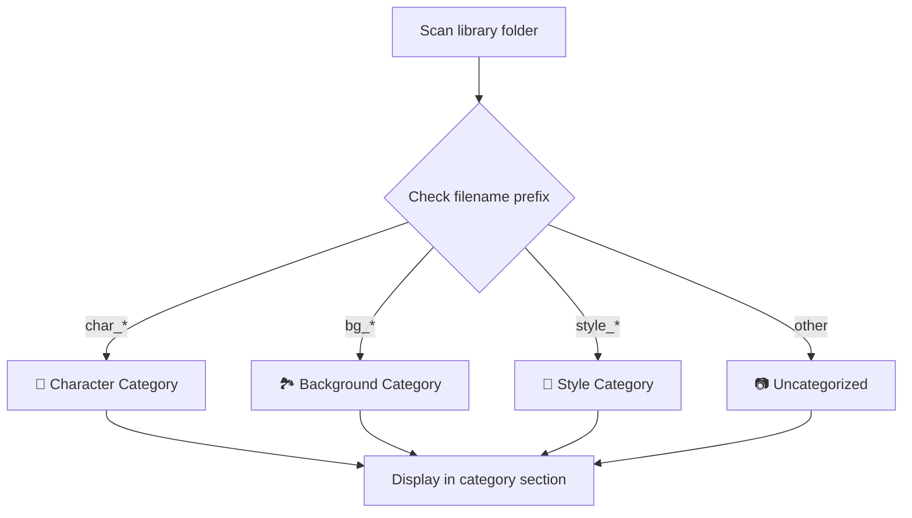
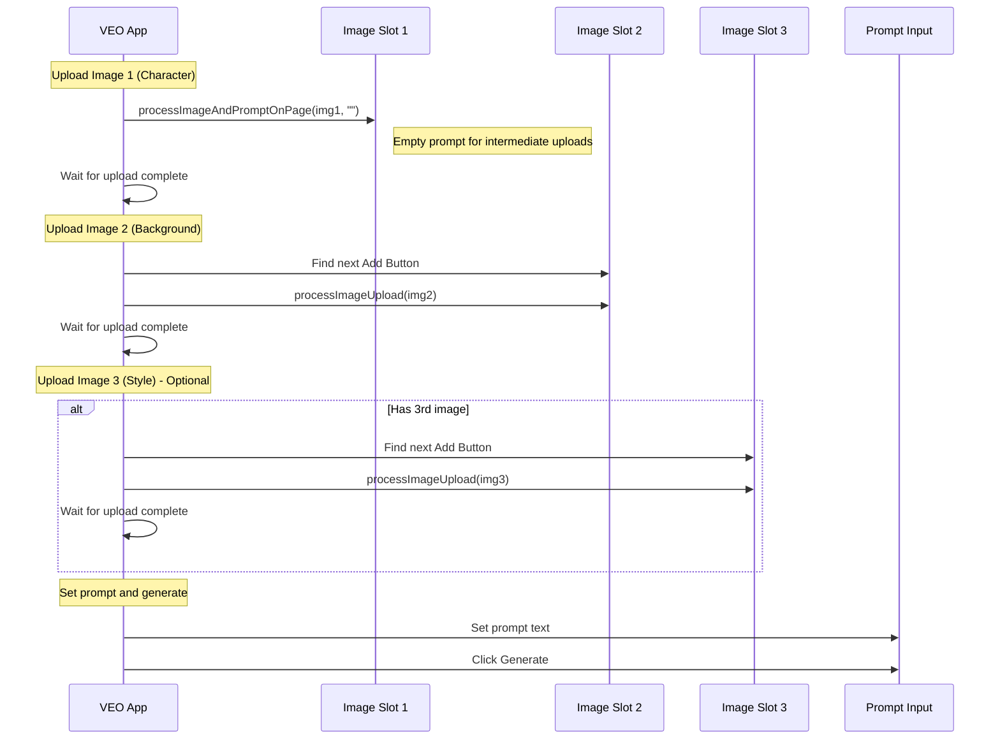
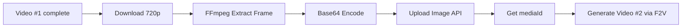

# ✏️ TAB_03: Ingredients-to-Video Workflow

## Tổng quan

Ingredients workflow cho phép kết hợp tối đa **3 hình ảnh** (character, background, style) với prompt để tạo video. Đây là chế độ nâng cao của I2V.

---

## 🎯 Main Workflow Diagram

```mermaid
flowchart TD
    subgraph UI["🖥️ UI LAYER"]
        A[📂 Import images với prefix] --> B[Auto-categorize by prefix]
        B --> C1[👤 char_* → Character]
        B --> C2[🏞️ bg_* → Background]
        B --> C3[🎨 style_* → Style]
        C1 --> D[Nhập prompts với multiple [tags]]
        C2 --> D
        C3 --> D
        D --> E[Click 📋 Parse]
        E --> F[Match up to 3 images/prompt]
        F --> G[Click 📋 Add to Queue]
    end

    subgraph Playwright["🔌 Playwright LAYER"]
        G --> H[For each prompt]
        H --> I[Upload image 1]
        I --> J[Upload image 2]
        J --> K[Upload image 3 - optional]
        K --> L[Set prompt]
        L --> M[Click Generate]
        M --> N{More prompts?}
        N -->|Yes| H
        N -->|No| O[Scan & Download]
    end

    style UI fill:#fff8e1
    style Playwright fill:#f3e5f5
```

---

## 📂 Auto-Categorization Rules



| Prefix | Category | Icon | Example |
|--------|----------|------|---------|
| `char_` | Character | 👤 | `[char_hero].png` |
| `bg_` | Background | 🏞️ | `[bg_castle].jpg` |
| `style_` | Style | 🎨 | `[style_anime].webp` |
| (other) | Uncategorized | 📷 | `[random].png` |

---

## 📝 Multi-Tag Parsing

### Parse Logic

```mermaid
flowchart LR
    A["[char_hero] [bg_forest] [style_anime] Text..."] --> B[Extract all [tags]]
    B --> C[Take first 3 only]
    C --> D[Match each with library]
    D --> E[Create image list]
    E --> F[Store in ParsedPrompt]
```

**Code:**
```python
def parse_ingredients_prompt(prompt: str, library: dict) -> ParsedPrompt:
    tags = TAG_PATTERN.findall(prompt)
    clean = TAG_PATTERN.sub('', prompt).strip()
    
    matched = []
    missing = []
    
    # Max 3 images for Ingredients mode
    for tag in tags[:3]:
        key = tag.lower()
        if key in library:
            matched.append({
                "tag": tag,
                "path": library[key],
                "category": get_category(tag)  # char/bg/style/other
            })
        else:
            missing.append(f"[{tag}]")
    
    if len(tags) > 3:
        warnings = [f"[{t}]" for t in tags[3:]]
        # Log: "Extra tags ignored: {warnings}"
    
    return ParsedPrompt(
        raw=prompt,
        clean=clean,
        images=matched,
        missing=missing
    )
```

---

## 🔌 Playwright Multi-Image Upload

### Sequential Upload Flow



---

### Each Image Upload (Same as TAB_02)

| Step | Action | Wait Time |
|------|--------|-----------|
| 1 | Poll for Add Button | 500ms × 360 = 180s max |
| 2 | Click Add Button | 2s |
| 3 | Poll for file input | 250ms × 40 = 10s max |
| 4 | Create File from base64 | - |
| 5 | Inject via DataTransfer | - |
| 6 | Wait spinner gone | 500ms × 360 = 180s max |
| 7 | Select crop ratio | 500ms |
| 8 | Click Crop & Save | 1s |

---

## 📊 Timing Estimation

| Scenario | Images | Est. Time per Prompt |
|----------|--------|---------------------|
| Character only | 1 | ~15-20s |
| Char + Background | 2 | ~25-35s |
| Char + BG + Style | 3 | ~35-50s |

**Total for 10 prompts × 3 images:**
- Upload time: ~350-500s (~6-8 min)
- Generation time: ~2-5 min per prompt
- Total: ~30-60 min

---

## ⚠️ VEO Ingredients Mode Specifics

VEO Flow có chế độ Ingredients riêng với 3 slot:

```
┌─────────────────────────────────────────────┐
│ VEO INGREDIENTS MODE                        │
├─────────────────────────────────────────────┤
│ [SUBJECT] + [SCENE] + [STYLE]               │
│ ┌───────┐   ┌───────┐   ┌───────┐           │
│ │  👤   │ + │  🏞️   │ + │  🎨   │ → 🎬     │
│ │ hero  │   │ forest│   │ anime │           │
│ └───────┘   └───────┘   └───────┘           │
│                                             │
│ [Prompt: The hero walks through forest...] │
└─────────────────────────────────────────────┘
```

**Mode Detection:**
```python
# Check if VEO is in Ingredients mode
INGREDIENTS_MODE_XPATH = "//div[contains(@class, 'ingredients') or .//*[contains(text(), 'Subject')]]"

# Slot identifiers
SLOT_SUBJECT_XPATH = "//div[contains(@class, 'subject-slot')]"
SLOT_SCENE_XPATH = "//div[contains(@class, 'scene-slot')]"
SLOT_STYLE_XPATH = "//div[contains(@class, 'style-slot')]"
```

---

## 🔄 Continuation Mode (Frame Chaining)

R2V + CONT ON: Worker tự chuyển sang F2V, extracted frame thay thế slot 1.



### R2V + Continuation Logic

| CONT | Slot 1 | Slot 2 | Slot 3 |
|------|--------|--------|--------|
| OFF | Library char | Library bg | Library style |
| ON | 🔗 **Extracted frame** | Library bg | Library style |

> [!NOTE]
> Khi CONT ON, extracted frame thay thế Slot 1 (Subject). Còn lại 2 slot giữ nguyên library images.
> Tổng: max 3 images = 1 cont frame + 2 library images.

Xem chi tiết matrix: [FRAME_CONTINUATION_WORKFLOW.md](../02_Architecture/FRAME_CONTINUATION_WORKFLOW.md)

---

## ❌ Error Handling

| Error | Scope | Action |
|-------|-------|--------|
| POLICY_IMAGE (slot 1) | First image | Mark failed, skip entire prompt |
| POLICY_IMAGE (slot 2/3) | Subsequent | Log warning, continue without that image |
| QUEUE_FULL | After generate | Retry loop (30x) |
| TAG_NOT_FOUND | Parse time | Show warning, allow queue with partial |

---

## 🔗 Related Files

| File | Description |
|------|-------------|
| [TAB_03_INGREDIENTS.md](../01_UI_UX/TAB_03_INGREDIENTS.md) | UI Layout & Widgets |
| [WORKFLOW_TAB_02_IMAGE_TO_VIDEO.md](./WORKFLOW_TAB_02_IMAGE_TO_VIDEO.md) | Single image upload flow |
| [FRAME_CONTINUATION_WORKFLOW.md](../02_Architecture/FRAME_CONTINUATION_WORKFLOW.md) | Full continuation workflow & terminology |
