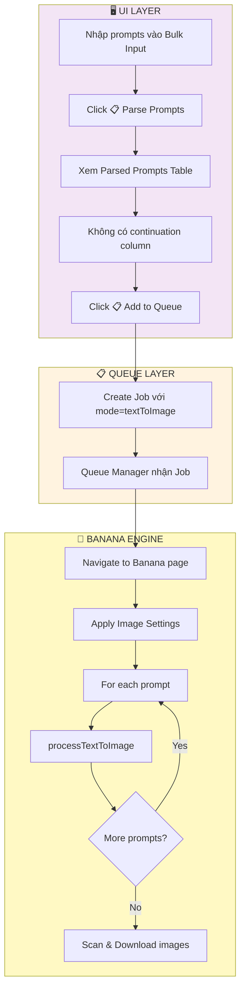
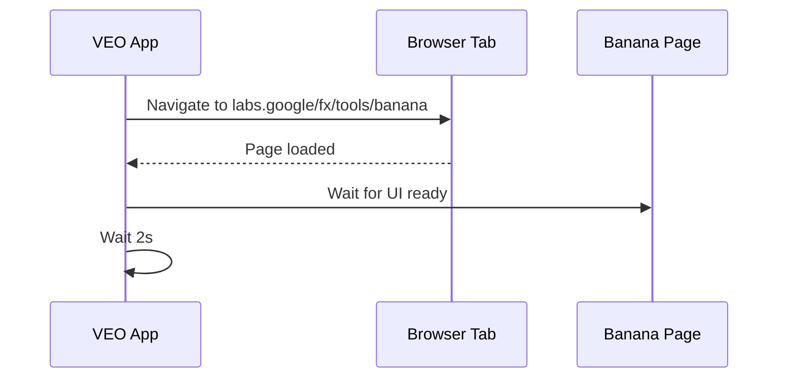
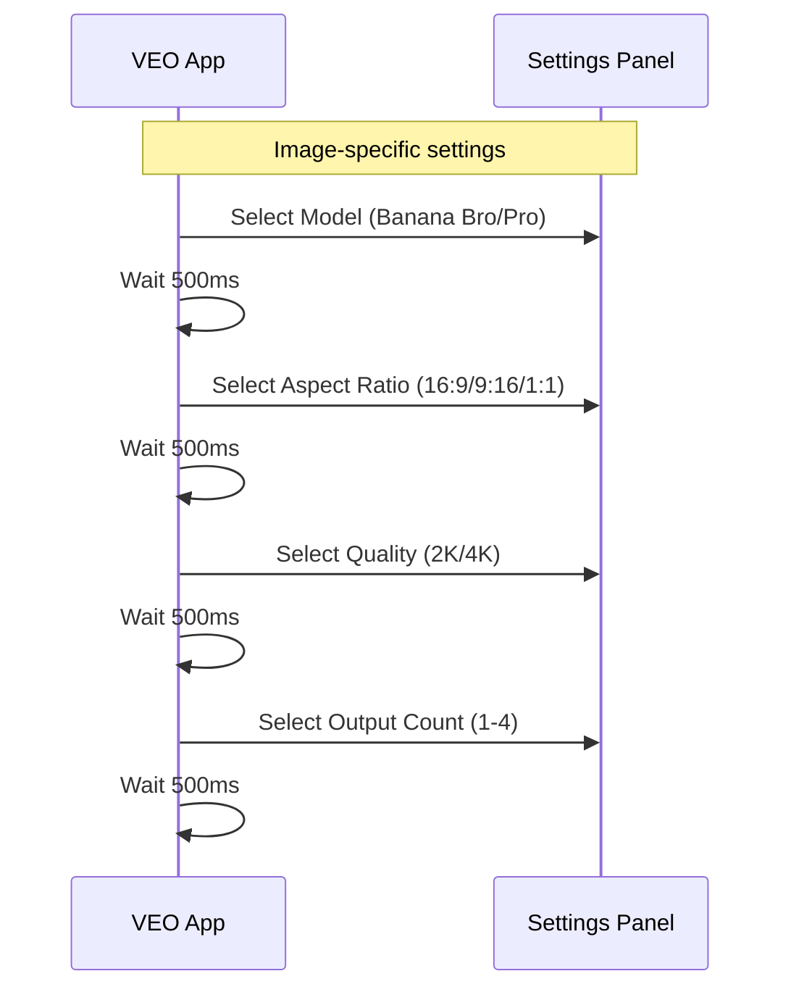
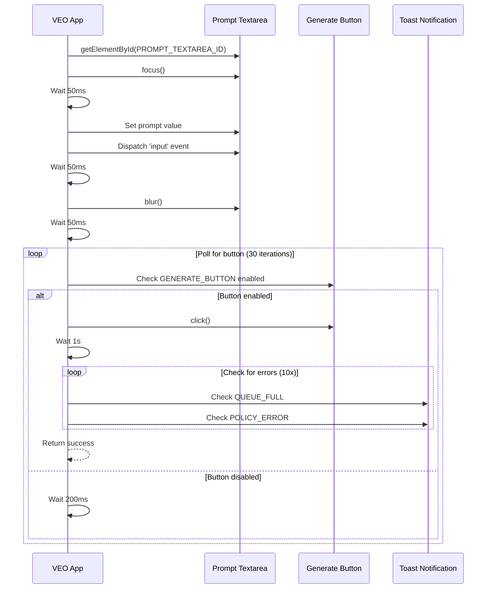
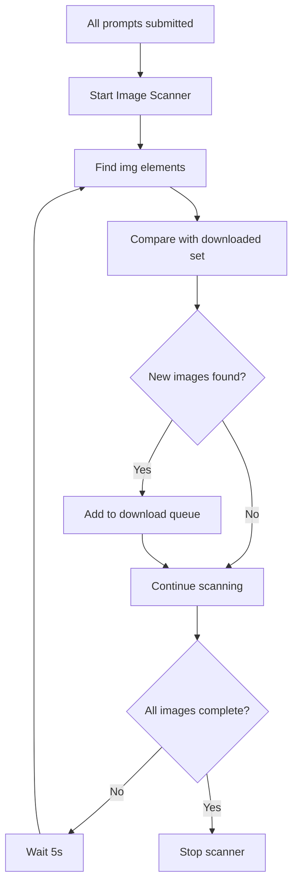

# 🎯 TAB_04: Text-to-Image Workflow

## Tổng quan

Text-to-Image (T2I) sử dụng **Banana Model** (không phải VEO) để tạo ảnh từ prompt văn bản. Workflow khác biệt với TAB_01-03.

---

## 🎯 Main Workflow Diagram



---

## ⚠️ Key Differences from Video Workflows

| Aspect | Video (TAB_01-03) | Image (TAB_04) |
|--------|-------------------|----------------|
| Engine | VEO Flow | Banana Model |
| Page URL | `/tools/flow` | `/tools/banana` (TBD) |
| Output | .mp4 videos | .png/.jpg images |
| continuation | ✅ Supported | ❌ Not applicable |
| Quality | 720p/1080p/4K | 2K/4K |
| Aspect | 16:9 / 9:16 | 16:9 / 9:16 / 1:1 |

---

## 🔌 Playwright Execution Flow

### Phase 1: Navigate to Banana Page



> ⚠️ **Note**: Cần verify URL chính xác từ extension 2.2.0.0_0

---

### Phase 2: Settings Configuration



**Model Options:**
| Model | Description |
|-------|-------------|
| `banana_bro` | Standard quality, faster |
| `banana_pro` | Higher quality, slower |

**Quality Options:**
| Quality | Resolution |
|---------|------------|
| `2K` | 2048px |
| `4K` | 4096px |

---

### Phase 3: processTextToImage Flow



---

### Phase 4: Image Scanning & Download



**Image Detection:**
```javascript
// Scan for generated images
function scanGeneratedImages(selectors) {
    const images = [];
    const containers = document.querySelectorAll('[data-generated-image]');
    
    containers.forEach(container => {
        const img = container.querySelector('img[src^="http"]');
        if (img) {
            const src = img.getAttribute('src').split('?')[0];
            images.push(src);
        }
    });
    
    return images;
}
```

---

## ⏱️ Timing Constants

| Constant | Value | Purpose |
|----------|-------|---------|
| `FOCUS_DELAY` | 50ms | After focus/blur |
| `INPUT_DELAY` | 50ms | After setting value |
| `BUTTON_POLL_INTERVAL` | 200ms | Between checks |
| `BUTTON_POLL_MAX` | 30 | Max iterations |
| `POST_CLICK_DELAY` | 1000ms | After Generate click |
| `ERROR_CHECK_ITERATIONS` | 10 | Error popup checks |
| `SCAN_INTERVAL` | 5000ms | Image scan interval |
| `GENERATION_TIMEOUT` | 180s | Max wait per image |

---

## 📊 Estimated Times

| Output Count | Est. Time per Prompt |
|--------------|---------------------|
| 1 image | ~30-60s |
| 2 images | ~45-90s |
| 3 images | ~60-120s |
| 4 images | ~75-150s |

---

## ❌ Error Handling

| Error Type | Detection | Action |
|------------|-----------|--------|
| POLICY_PROMPT | Toast with error icon | Mark failed, skip |
| QUEUE_FULL | Toast with "5" | Retry loop (30x) |
| TIMEOUT | No result in 180s | Reload, retry (max 3) |
| NETWORK | Connection lost | Stop queue |

---

## 🔗 Related Files

| File | Description |
|------|-------------|
| [TAB_04_TEXT_TO_IMAGE.md](../01_UI_UX/TAB_04_TEXT_TO_IMAGE.md) | UI Layout & Widgets |
| [WORKFLOW_TAB_01_TEXT_TO_VIDEO.md](./WORKFLOW_TAB_01_TEXT_TO_VIDEO.md) | Similar prompt flow |
