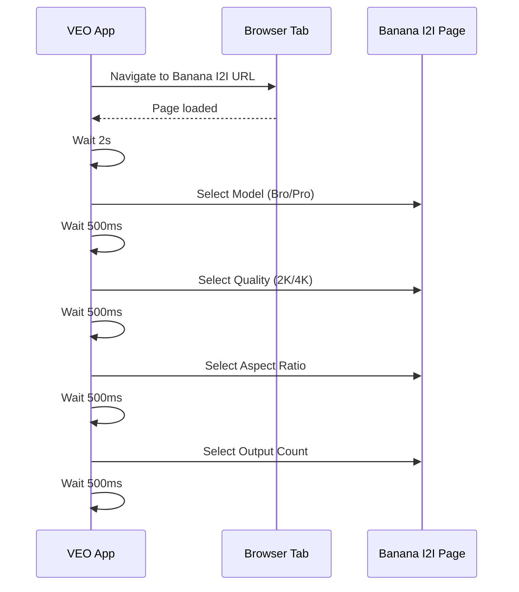
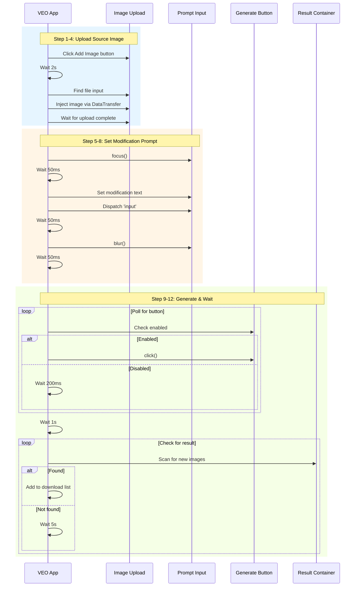
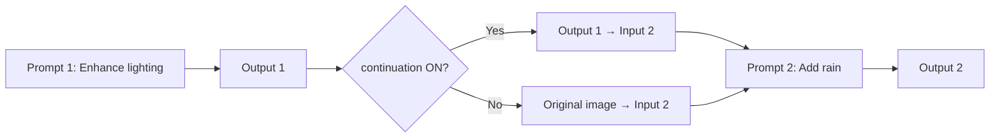

# ✨ TAB_05: Image-to-Image Workflow

## Tổng quan

Image-to-Image (I2I) sử dụng **Banana Model** để biến đổi hình ảnh nguồn dựa trên prompt mô tả thay đổi mong muốn.

---

## 🎯 Main Workflow Diagram

```mermaid
flowchart TD
    subgraph UI["🖥️ UI LAYER"]
        A[📂 Import source images to Library] --> B[Set [tag] format names]
        B --> C[Nhập modification prompts với [tag]]
        C --> D[Click 📋 Parse]
        D --> E[Match [tag] với images]
        E --> F[Click 📋 Add to Queue]
    end

    subgraph QUEUE["📋 QUEUE LAYER"]
        F --> G[Save images to IndexedDB]
        G --> H[Create Job với mode=imageToImage]
        H --> I[Queue Manager receives Job]
    end

    subgraph BANANA["🍌 BANANA ENGINE"]
        I --> J[Navigate to Banana I2I page]
        J --> K[Apply Image Settings]
        K --> L[For each image+prompt pair]
        L --> M[Upload source image]
        M --> N[Set modification prompt]
        N --> O[Click Generate]
        O --> P{More pairs?}
        P -->|Yes| L
        P -->|No| Q[Scan & Download results]
    end

    style UI fill:#e8f5e9
    style QUEUE fill:#fff3e0
    style BANANA fill:#fff9c4
```

---

## 🔄 I2I vs I2V Comparison

| Aspect | I2V (TAB_02) | I2I (TAB_05) |
|--------|--------------|--------------|
| Engine | VEO Flow | Banana Model |
| Input | Source image | Source image |
| Output | Video | Modified image |
| Prompt | Scene description | Modification instruction |
| Quality | 720p/1080p/4K | 2K/4K |

---

## 📝 Prompt Style Difference

**I2V Prompt (Scene Description):**
```
[hero] The hero walks toward the camera slowly with dynamic lighting
```

**I2I Prompt (Modification Instruction):**
```
[portrait] Make it more dramatic with moody lighting and add rain
```

---

## 🔌 Playwright Execution Flow

### Phase 1: Navigate & Settings



---

### Phase 2: processImageToImage Flow



---

### Detailed Step Timing

| Step | Action | Wait Time | Max Wait |
|------|--------|-----------|----------|
| 1 | Click Add Image | 2s | - |
| 2 | Find file input | 250ms × 40 | 10s |
| 3 | Inject image | - | - |
| 4 | Wait upload | 500ms × 360 | 180s |
| 5 | Focus textarea | 50ms | - |
| 6 | Set prompt | - | - |
| 7 | Dispatch input | 50ms | - |
| 8 | Blur textarea | 50ms | - |
| 9 | Poll Generate button | 200ms × 30 | 6s |
| 10 | Click Generate | 1s | - |
| 11 | Check errors | 1s × 10 | 10s |
| 12 | Scan for result | 5s × 36 | 180s |

---

## 🖼️ Image Transformation Examples

| Source | Modification | Result |
|--------|--------------|--------|
| Portrait photo | "Make more dramatic with moody lighting" | Enhanced contrast |
| Landscape | "Add rain and storm clouds" | Weather effects |
| Sketch | "Convert to anime style" | Style transfer |
| Photo | "Age 20 years" | Face modification |

---

## ⏱️ Timing Constants

| Constant | Value | Purpose |
|----------|-------|---------|
| `IMAGE_UPLOAD_TIMEOUT` | 180s | Max upload wait |
| `FOCUS_DELAY` | 50ms | After focus/blur |
| `BUTTON_POLL_INTERVAL` | 200ms | Between checks |
| `POST_CLICK_DELAY` | 1000ms | After Generate |
| `RESULT_SCAN_INTERVAL` | 5000ms | Result check |
| `GENERATION_TIMEOUT` | 180s | Max generation wait |

---

## 🔄 continuation Mode (Previous Output as Input)

Khi continuation được bật, output trước đó trở thành input cho prompt tiếp theo:



**Use Case Example:**
1. Original portrait
2. → "Enhance lighting" → Dramatic portrait
3. → "Add vintage filter" (continuation) → Vintage dramatic portrait
4. → "Convert to sketch" (continuation) → Vintage sketch

---

## ❌ Error Handling

| Error Type | Detection | Action |
|------------|-----------|--------|
| POLICY_IMAGE | Toast during upload | Mark failed, skip |
| POLICY_PROMPT | Toast after prompt | Mark failed, skip |
| QUEUE_FULL | Toast with "5" | Retry loop (30x) |
| FILE_READ_ERROR | Blob conversion | Mark failed, skip |
| TIMEOUT | No result in 180s | Reload, retry (max 3) |

---

## 📊 Estimated Processing Times

| Quality | Estimated Time |
|---------|----------------|
| 2K | ~30-60s |
| 4K | ~60-120s |

**For batch of 10 prompts:**
- Upload: ~10-20s each = ~100-200s
- Generation: ~30-60s each = ~300-600s
- Total: ~7-13 minutes

---

## 🔗 Related Files

| File | Description |
|------|-------------|
| [TAB_05_IMAGE_TO_IMAGE.md](../01_UI_UX/TAB_05_IMAGE_TO_IMAGE.md) | UI Layout & Widgets |
| [WORKFLOW_TAB_02_IMAGE_TO_VIDEO.md](./WORKFLOW_TAB_02_IMAGE_TO_VIDEO.md) | Image upload flow |
| [WORKFLOW_TAB_04_TEXT_TO_IMAGE.md](./WORKFLOW_TAB_04_TEXT_TO_IMAGE.md) | Banana model basics |
