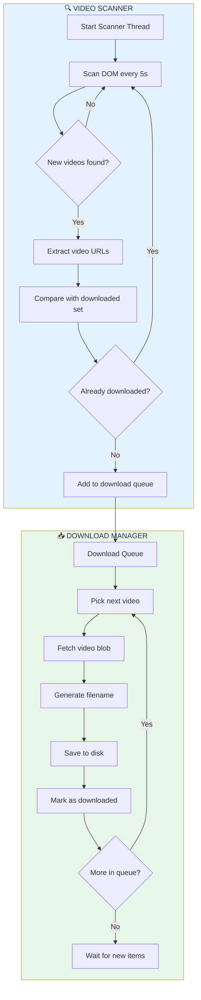
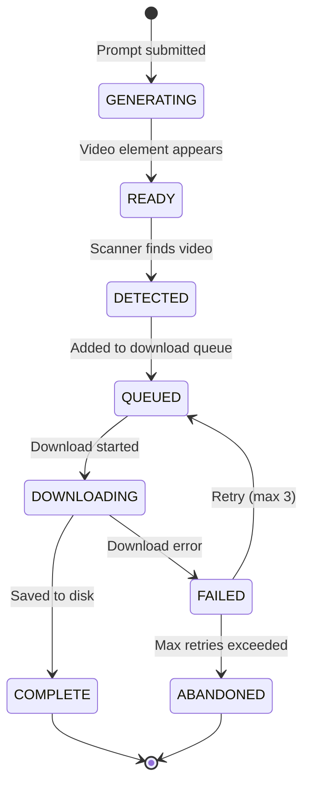
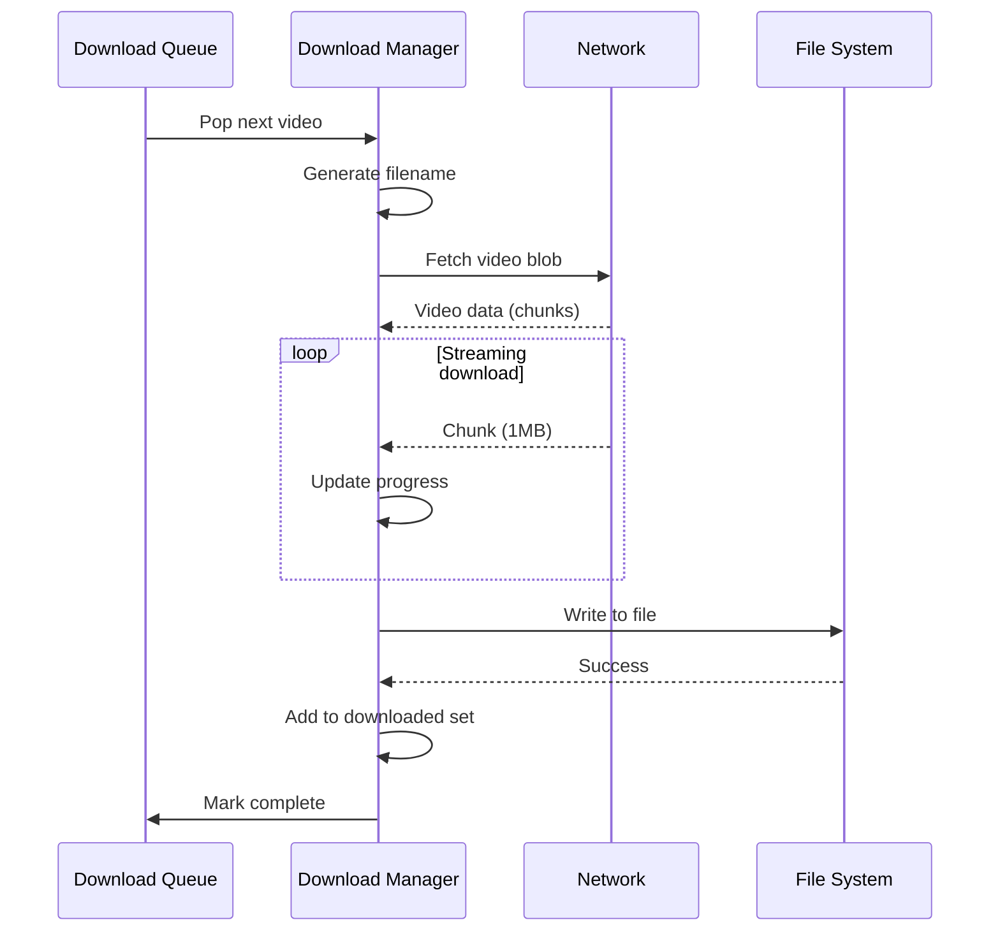

# 📥 WORKFLOW: Video Scan & Download

## Tổng quan

Workflow quản lý việc phát hiện video đã generate xong và download về local. Chạy liên tục trong background.

---

## 🎯 Main Flow



---

## 🔍 Video Detection

### DOM Scanning

```python
class VideoScanner:
    """Scan VEO Flow page for completed videos."""
    
    SCAN_INTERVAL = 5  # seconds
    
    # XPath selectors for video elements
    VIDEO_SELECTORS = [
        "//video[contains(@src, 'googleusercontent')]",
        "//video[@data-generated='true']",
        "//div[contains(@class, 'video-container')]//video",
    ]
    
    def __init__(self, browser: Browser):
        self.browser = browser
        self.downloaded_urls: set[str] = set()
        self.download_queue: asyncio.Queue = asyncio.Queue()
        self.running = False
    
    async def start(self):
        """Start continuous scanning loop."""
        self.running = True
        
        while self.running:
            try:
                new_videos = await self._scan_for_videos()
                
                for video in new_videos:
                    if video.url not in self.downloaded_urls:
                        await self.download_queue.put(video)
                
            except Exception as e:
                log.error(f"Scan error: {e}")
            
            await asyncio.sleep(self.SCAN_INTERVAL)
    
    async def _scan_for_videos(self) -> list[VideoInfo]:
        """Scan DOM for video elements."""
        
        videos = []
        
        for selector in self.VIDEO_SELECTORS:
            elements = self.browser.find_elements(By.XPATH, selector)
            
            for elem in elements:
                try:
                    url = elem.get_attribute("src")
                    if url and "googleusercontent" in url:
                        videos.append(VideoInfo(
                            url=url.split("?")[0],  # Remove query params
                            element=elem,
                            timestamp=datetime.now()
                        ))
                except:
                    pass
        
        return videos
```

### Video Detection States



---

## 📥 Download Manager

### Download Flow



### Implementation

```python
class DownloadManager:
    """Manage video downloads with retry and naming."""
    
    CHUNK_SIZE = 1024 * 1024  # 1 MB
    MAX_RETRIES = 3
    
    def __init__(self, download_folder: Path):
        self.download_folder = download_folder
        self.current_downloads: dict[str, DownloadProgress] = {}
    
    async def download_video(self, video: VideoInfo, job: Job) -> DownloadResult:
        """Download a single video with progress tracking."""
        
        # Generate filename
        filename = self._generate_filename(video, job)
        filepath = self.download_folder / job.download_folder / filename
        
        # Ensure directory exists
        filepath.parent.mkdir(parents=True, exist_ok=True)
        
        # Track progress
        progress = DownloadProgress(
            url=video.url,
            filepath=filepath,
            status="downloading"
        )
        self.current_downloads[video.url] = progress
        
        for attempt in range(self.MAX_RETRIES):
            try:
                async with aiohttp.ClientSession() as session:
                    async with session.get(video.url) as response:
                        
                        if response.status != 200:
                            raise DownloadError(f"HTTP {response.status}")
                        
                        total_size = int(response.headers.get("Content-Length", 0))
                        progress.total_bytes = total_size
                        
                        with open(filepath, "wb") as f:
                            async for chunk in response.content.iter_chunked(self.CHUNK_SIZE):
                                f.write(chunk)
                                progress.downloaded_bytes += len(chunk)
                                progress.percent = (progress.downloaded_bytes / total_size * 100) if total_size else 0
                
                progress.status = "complete"
                return DownloadResult(success=True, filepath=filepath)
                
            except Exception as e:
                log.warning(f"Download attempt {attempt + 1} failed: {e}")
                if attempt < self.MAX_RETRIES - 1:
                    await asyncio.sleep(2 ** attempt)  # Exponential backoff
        
        progress.status = "failed"
        return DownloadResult(success=False, error="Max retries exceeded")
    
    def _generate_filename(self, video: VideoInfo, job: Job) -> str:
        """Generate organized filename."""
        
        # Format: {job_name}_{prompt_index}_{video_index}_{timestamp}.mp4
        timestamp = datetime.now().strftime("%Y%m%d_%H%M%S")
        
        return f"{job.name}_{job.current_prompt_index:02d}_{timestamp}.mp4"
```

---

## 📁 File Organization

### Folder Structure

```
Downloads/
└── VEO_Output/
    ├── Project_001_T2V/
    │   ├── Project_001_T2V_01_20260121_221500.mp4
    │   ├── Project_001_T2V_02_20260121_221530.mp4
    │   └── Project_001_T2V_03_20260121_221600.mp4
    │
    ├── Project_002_I2V/
    │   └── Project_002_I2V_01_20260121_222000.mp4
    │
    └── _failed/
        └── failed_download_log.json
```

### Naming Convention

```python
def generate_filename(job: Job, prompt_index: int, video_index: int) -> str:
    """
    Format: {job_name}_{prompt_index:02d}_{video_index:02d}_{timestamp}.mp4
    
    Examples:
    - MyProject_01_01_20260121_221500.mp4  (Prompt 1, Video 1)
    - MyProject_01_02_20260121_221500.mp4  (Prompt 1, Video 2)
    - MyProject_02_01_20260121_221530.mp4  (Prompt 2, Video 1)
    """
    
    timestamp = datetime.now().strftime("%Y%m%d_%H%M%S")
    safe_name = re.sub(r'[^\w\-]', '_', job.name)[:30]
    
    return f"{safe_name}_{prompt_index:02d}_{video_index:02d}_{timestamp}.mp4"
```

---

## ⏱️ Timing Configuration

| Setting | Value | Purpose |
|---------|-------|---------|
| `SCAN_INTERVAL` | 5s | DOM scan frequency |
| `DOWNLOAD_TIMEOUT` | 300s | Max time per download |
| `RETRY_DELAY_BASE` | 2s | Exponential backoff base |
| `MAX_CONCURRENT_DOWNLOADS` | 3 | Parallel downloads |
| `CHUNK_SIZE` | 1MB | Streaming chunk size |

---

## 🔄 Final Scan (Job Completion)

Khi tất cả prompts đã submit, chạy final scan để đảm bảo không bỏ sót video:

```python
async def final_scan(self, job: Job, timeout: int = 180):
    """Extended scan after all prompts submitted."""
    
    expected_videos = job.total_prompts * job.videos_per_prompt
    start_time = time.time()
    
    while (time.time() - start_time) < timeout:
        current_videos = len([v for v in self.downloaded_urls 
                             if v.startswith(job.id)])
        
        if current_videos >= expected_videos:
            log.info(f"Job {job.id} complete: {current_videos} videos")
            return True
        
        await asyncio.sleep(5)
    
    # Timeout - log missing videos
    missing = expected_videos - current_videos
    log.warning(f"Job {job.id} timeout: {missing} videos missing")
    return False
```

---

## 🔗 Related Files

| File | Purpose |
|------|---------|
| `WORKFLOW_TAB_01-05` | Tab-specific processing |
| `WORKFLOW_MULTI_COOKIE_PARALLEL.md` | Queue management |
