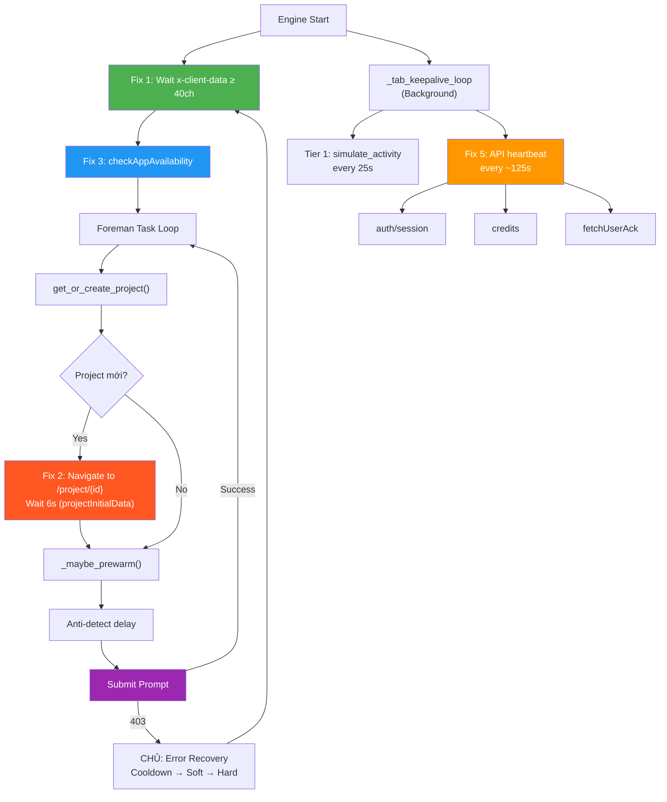

# Workflow: Khắc Phục reCAPTCHA 403 — API Trust Pattern

## Tổng Quan

reCAPTCHA 403 xảy ra khi browser context không khớp pattern người dùng thật. Workflow này mô tả cách hệ thống khắc phục bằng cách **mô phỏng đúng flow của browser thực**.

---

## Nguyên Nhân Gốc (Root Causes)

| RC | Vấn đề | Bằng chứng HAR | Fix |
|:---|:-------|:---------------|:----|
| RC1 | `x-client-data` chỉ 8-20 chars khi submit | HAR: luôn 48 chars trên mọi `aisandbox-pa` call | Fix 1 |
| RC2 | Browser ở `/tools/flow` home, không navigate vào project | HAR: navigate `/tools/flow/project/{id}` → triggers `projectInitialData` 4.2s | Fix 2 |
| RC3 | Thiếu startup signal `checkAppAvailability` | HAR: POST ngay khi vào labs.google | Fix 3 |
| RC4 | Không có API heartbeat giữa các submit | HAR 05: `auth/session` + `credits` mỗi ~2 phút khi idle | Fix 5 |

---

## Workflow Xử Lý

### Giai đoạn 1: Startup (mỗi account)

```
Engine Start
  │
  ├─ Foreman Loop bắt đầu cho mỗi account
  │     │
  │     ├─ Fix 1: _wait_for_account_ready()
  │     │     └─ Block cho đến khi x-client-data ≥ 40 chars
  │     │     └─ Timeout 60s → warning log
  │     │
  │     └─ Fix 3: _check_app_availability()  [1 lần duy nhất]
  │           └─ page.evaluate(fetch POST checkAppAvailability)
  │           └─ Body: {"clientContext": {"tool": "PINHOLE"}}
  │           └─ Expect: {"availabilityState": "AVAILABLE"}
  │
  └─ AppController khởi động _tab_keepalive_loop (background)
```

### Giai đoạn 2: Mỗi Task Submit

```
Foreman nhận task từ queue
  │
  ├─ get_or_create_project()
  │     └─ TRPC createProject (page.evaluate fetch)
  │     └─ Trả về projectId (cached cho lần sau)
  │
  ├─ Fix 2: _navigate_to_project_page()  [chỉ khi project mới tạo]
  │     └─ window.location.href = /tools/flow/project/{projectId}
  │     └─ Tự động trigger:
  │           ├─ flow.projectInitialData (4.2s heavy load)
  │           ├─ auth/session recheck
  │           ├─ credits recheck
  │           └─ fetchUserAcknowledgement(FLOW_IMAGE_UPLOAD_TOS)
  │     └─ Wait 6s cho page load xong
  │
  ├─ _maybe_prewarm() (nếu idle lâu)
  │
  ├─ Anti-detect delay (randomized)
  │
  └─ Submit prompt → SUCCESS ✅
```

### Giai đoạn 3: Background Keepalive (luôn chạy)

```
_tab_keepalive_loop (AppController quản lý)
  │
  ├─ Tier 1: Mỗi 25s
  │     └─ simulate_activity (JS mouse/scroll)
  │     └─ Ngăn Chrome freeze tab
  │
  └─ Tier 2: Mỗi ~125s (5 cycles × 25s)  [Fix 5: MỚI]
        └─ _api_heartbeat() qua page.evaluate:
              ├─ GET /fx/api/auth/session
              ├─ GET /fx/api/trpc/general.fetchUserAcknowledgement
              └─ GET aisandbox-pa/v1/credits
        └─ Tác dụng:
              ├─ Refresh OAuth token trước khi hết hạn
              ├─ Tạo API traffic liên tục (anti-bot)
              ├─ Validate x-client-data vẫn hoạt động
              └─ Giữ server-side session alive
```

---

## Sơ Đồ Tổng Hợp



---

## Verification Checklist

- [ ] Startup log: `✅ Account ready (x-client-data: 48 chars)`
- [ ] Startup log: `✅ checkAppAvailability: AVAILABLE`
- [ ] First task log: `Navigating to project: .../project/{id}`
- [ ] First task log: `✅ Project page loaded` (sau 6s)
- [ ] Background log: `API heartbeat OK (auth+ack+credits)` mỗi ~2 phút
- [ ] Submit: Không 403 trong 3 attempt đầu tiên
