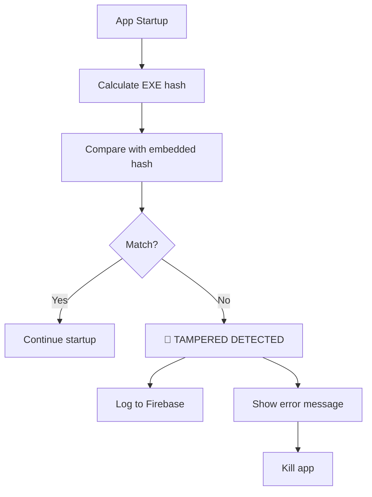
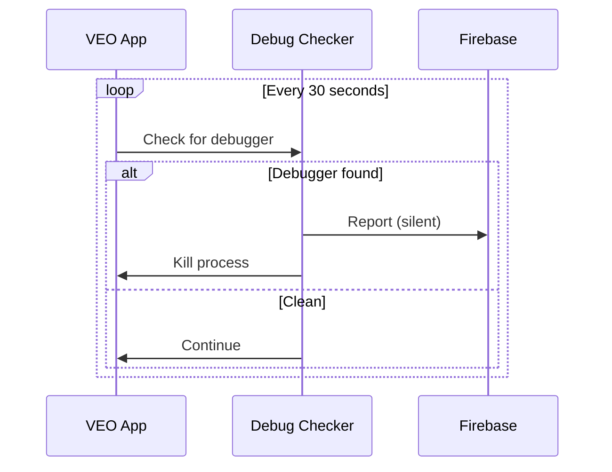
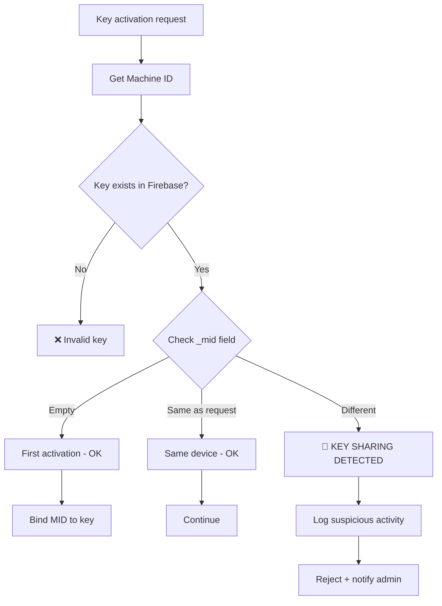
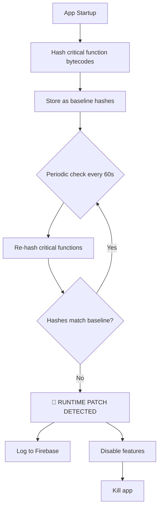
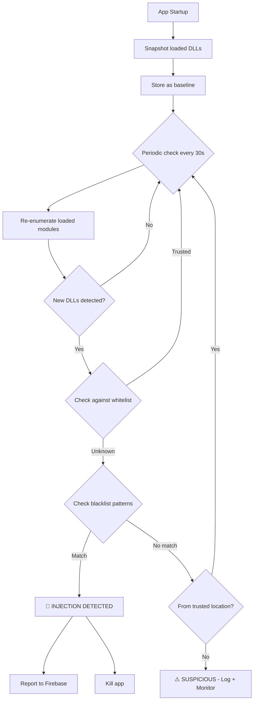
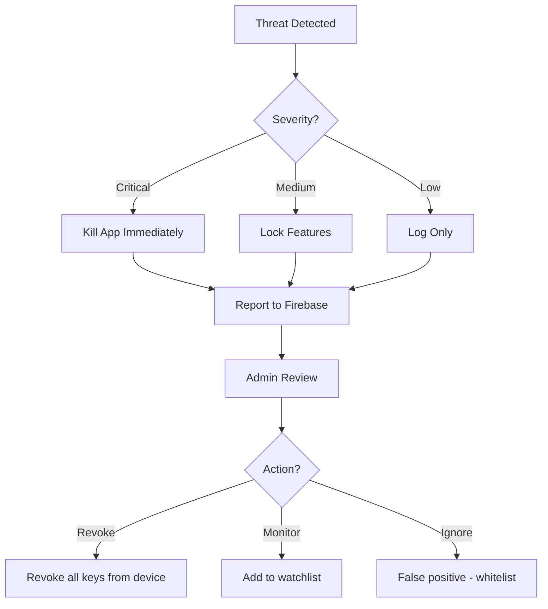

# 🛡️ WORKFLOW: Anti-Crack Protection (Chống crack/patch/keygen)

## Tổng quan

Runtime protection workflow để chủ động phát hiện và ngăn chặn các mối đe dọa: crack, patch, keygen, debugger, memory editor.

---

## 🎯 Threat Matrix

| # | Threat | Detection | Severity | Action |
|---|--------|-----------|----------|--------|
| 1 | Binary Patching | Integrity check | 🔴 Critical | Kill app + report |
| 2 | Memory Editing | Anti-debug | 🔴 Critical | Kill app |
| 3 | Key Bruteforce | Rate limiting | 🟡 Medium | Block IP |
| 4 | Key Sharing | Multi-device detect | 🟡 Medium | Revoke key |
| 5 | VM/Sandbox | Environment detect | 🟠 Low | Warn/Log |
| 6 | Clock Manipulation | Time tampering | 🟡 Medium | Lock trial |
| 7 | Debugger Attach | Anti-debug | 🔴 Critical | Kill app |
| 8 | Network Intercept | SSL pinning | 🔴 Critical | Fail silently |
| 9 | **Runtime Patching** | **Memory protection** | 🔴 **Critical** | **Kill app + report** |
| 10 | **DLL Injection** | **Module enumeration** | 🔴 **Critical** | **Kill app + report** |
| 11 | **API Hooking** | **Hook signature scan** | 🔴 **Critical** | **Kill app + report** |
| 12 | **Docker/Wine/WSL** | **Environment detect** | 🟡 **Medium** | **Log + warn** |
| 13 | **Sandbox Analysis** | **Process/env scan** | 🟡 **Medium** | **Log + warn** |
| 14 | **License Revocation** | **HeartbeatService** | 🔴 **Critical** | **Downgrade to trial** |

---

## 🔐 Protection Layer 1: Integrity Check (Anti-Patch)

### Self-Check Flow



### Implementation

```python
import hashlib
from pathlib import Path

class IntegrityChecker:
    """Verify binary hasn't been patched/modified."""
    
    # Embedded at build time (obfuscated)
    EXPECTED_HASH = "a3b2c1d0..."  # SHA-256 of original EXE
    
    def check(self) -> bool:
        """Verify app integrity."""
        
        exe_path = Path(sys.executable)
        
        # Hash current executable
        sha256 = hashlib.sha256()
        with open(exe_path, "rb") as f:
            while chunk := f.read(8192):
                sha256.update(chunk)
        
        current_hash = sha256.hexdigest()
        
        if current_hash != self.EXPECTED_HASH:
            self._on_tamper_detected()
            return False
        
        return True
    
    def _on_tamper_detected(self):
        """Handle tampered binary."""
        
        # Log to server (silent)
        try:
            self._report_tamper()
        except:
            pass
        
        # Show generic error (don't reveal detection)
        messagebox.showerror(
            "Error",
            "An unexpected error occurred. Please reinstall the application."
        )
        
        # Kill app
        sys.exit(1)
```

---

## 🔐 Protection Layer 2: Anti-Debug

### Detection Methods

```python
import ctypes
import os

class AntiDebug:
    """Detect and prevent debugger attachment."""
    
    @staticmethod
    def check_debugger() -> bool:
        """Check if debugger is attached."""
        
        # Method 1: Windows API
        if ctypes.windll.kernel32.IsDebuggerPresent():
            return True
        
        # Method 2: Check debug port
        try:
            from ctypes import wintypes
            process = ctypes.windll.kernel32.GetCurrentProcess()
            is_debugged = ctypes.c_bool()
            ctypes.windll.kernel32.CheckRemoteDebuggerPresent(
                process, ctypes.byref(is_debugged)
            )
            if is_debugged.value:
                return True
        except:
            pass
        
        # Method 3: Timing check (debuggers slow execution)
        import time
        start = time.perf_counter()
        for _ in range(1000000):
            pass
        elapsed = time.perf_counter() - start
        if elapsed > 0.5:  # Should be < 0.1s normally
            return True
        
        return False
    
    @staticmethod
    def prevent_attach():
        """Make debugger attachment harder."""
        
        # Method 1: Self-debugging (occupy debug slot)
        try:
            ctypes.windll.kernel32.DebugActiveProcess(os.getpid())
        except:
            pass
```

### Runtime Check Loop



---

## 🔐 Protection Layer 3: Anti-Keygen (Server Validation)

### Key Format v2.3 (Obfuscation)

> [!IMPORTANT]
> **v2.3**: All metadata is now hidden in pure hex format.

```
XXXX-XXXX-XXXX-XXXX-XXXX-XXXX-XXXX-XXXX
 │    │    │    │    │    │    │    │
 └────┴────┴────┴────┴────┴────┴────┴── All XOR obfuscated hex
                                         (MID, tier, timestamp all hidden)
```

**Security:**
- Pure hex format
- Requires HMAC secret to validate
- Machine ID hidden (SHA256 hash)

### Server-Side Validation

```python
class KeyValidator:
    """Server-side key validation rules."""
    
    def validate(self, key: str, machine_id: str) -> ValidationResult:
        """Multi-layer key validation."""
        
        # Layer 1: Format check
        if not self._check_format(key):
            return ValidationResult(valid=False, reason="INVALID_FORMAT")
        
        # Layer 2: Checksum verification
        if not self._verify_checksum(key):
            self._log_bruteforce_attempt(key)
            return ValidationResult(valid=False, reason="INVALID_CHECKSUM")
        
        # Layer 3: Firebase lookup
        doc = self._firebase_lookup(key)
        if not doc:
            self._log_fake_key(key)
            return ValidationResult(valid=False, reason="KEY_NOT_FOUND")
        
        # Layer 4: Machine ID binding
        if doc["_mid"] != machine_id:
            self._log_key_sharing(key, machine_id)
            return ValidationResult(valid=False, reason="MACHINE_MISMATCH")
        
        # Layer 5: Status check
        if doc["_st"] == "r":
            return ValidationResult(valid=False, reason="REVOKED")
        
        # Layer 6: Expiry check
        if self._is_expired(doc["_exp"]):
            return ValidationResult(valid=False, reason="EXPIRED")
        
        return ValidationResult(valid=True, tier=doc["_t"])
```

---

## 🔐 Protection Layer 4: Multi-Device Detection

### Flow



### Firebase Log

```javascript
// Collection: _security_log
{
    "type": "KEY_SHARING_ATTEMPT",
    "key": "F208-72DF-9B1D-4BF6-...",
    "original_mid": "3946c15b...",
    "attempt_mid": "7a8b9c0d...",
    "timestamp": "2026-01-21T22:00:00",
    "ip": "xxx.xxx.xxx.xxx",
    "action_taken": "REJECTED",
    "key_version": "2.3"
}
```

---

## 🔐 Protection Layer 5: Time Tampering Detection

### Detection

```python
class TimeTamperDetector:
    """Detect system clock manipulation."""
    
    def __init__(self):
        self.last_check = self._get_network_time()
        self.local_offset = time.time() - self.last_check
    
    def check(self) -> bool:
        """Check for time tampering."""
        
        current_local = time.time()
        expected = self.last_check + (current_local - self.local_offset)
        
        # If system time drifted > 1 hour from expected
        if abs(current_local - expected) > 3600:
            return True  # Tampered
        
        return False
    
    def _get_network_time(self) -> float:
        """Get trusted time from NTP server."""
        
        import ntplib
        try:
            client = ntplib.NTPClient()
            response = client.request("pool.ntp.org", version=3)
            return response.tx_time
        except:
            # Fallback to Firebase timestamp
            return self._get_firebase_time()
```

### Trial Anti-Reset

```python
class TrialProtection:
    """Prevent trial period manipulation."""
    
    MARKERS = [
        Path.home() / ".veoauto" / ".trial",
        Path(os.environ.get("APPDATA", "")) / ".veo_trial_marker",
        # Registry entry (Windows)
    ]
    
    def check_trial_reset(self) -> bool:
        """Detect if user tried to reset trial."""
        
        # Check if ANY marker exists
        markers_found = sum(1 for m in self.MARKERS if m.exists())
        
        if markers_found == 0:
            # All markers deleted - suspicious!
            return True
        
        # Cross-check timestamps
        timestamps = []
        for marker in self.MARKERS:
            if marker.exists():
                timestamps.append(self._read_timestamp(marker))
        
        if len(set(timestamps)) > 1:
            # Timestamps don't match - tampered!
            return True
        
        return False
```

---

## 🔐 Protection Layer 6: Network Security

### SSL Pinning

```python
import ssl
import certifi

class SecureConnection:
    """Secure connection with certificate pinning."""
    
    # Expected Firebase certificate fingerprint
    EXPECTED_FINGERPRINT = "sha256/xxxxx..."
    
    def create_context(self) -> ssl.SSLContext:
        """Create SSL context with pinning."""
        
        context = ssl.create_default_context(cafile=certifi.where())
        context.verify_mode = ssl.CERT_REQUIRED
        context.check_hostname = True
        
        # Custom verification
        context.verify_flags |= ssl.VERIFY_CRL_CHECK_LEAF
        
        return context
    
    def verify_server(self, hostname: str, cert: dict) -> bool:
        """Verify server certificate fingerprint."""
        
        import hashlib
        
        # Get certificate DER
        der = ssl.DER_cert_to_PEM_cert(cert)
        fingerprint = hashlib.sha256(der.encode()).hexdigest()
        
        return fingerprint == self.EXPECTED_FINGERPRINT
```

---

## 🔐 Protection Layer 7: VM/Sandbox Detection

```python
class EnvironmentChecker:
    """Detect virtual machine or sandbox environment."""
    
    VM_INDICATORS = {
        "bios": ["vmware", "virtualbox", "vbox", "qemu", "xen", "parallels"],
        "model": ["vmware", "virtual machine", "kvm"],
        "mac_prefix": ["00:0c:29", "00:50:56", "08:00:27"],  # VMware, VirtualBox
    }
    
    SANDBOX_INDICATORS = [
        "sandbox", "malware", "virus", "analysis",
        "cuckoo", "joe", "any.run"
    ]
    
    def is_virtual(self) -> bool:
        """Check if running in VM."""
        
        # Check BIOS
        try:
            bios = subprocess.check_output(
                "wmic bios get manufacturer,version",
                shell=True
            ).decode().lower()
            
            for indicator in self.VM_INDICATORS["bios"]:
                if indicator in bios:
                    return True
        except:
            pass
        
        return False
    
    def is_sandbox(self) -> bool:
        """Check if running in analysis sandbox."""
        
        username = os.environ.get("USERNAME", "").lower()
        computername = os.environ.get("COMPUTERNAME", "").lower()
        
        for indicator in self.SANDBOX_INDICATORS:
            if indicator in username or indicator in computername:
                return True
        
        return False
```

### 🆕 Extended Environment Detection (Docker, Wine, WSL, Sandbox)

> [!IMPORTANT]
> Extends Layer 7 to cover additional virtualization environments commonly used to circumvent hardware fingerprinting.

```python
import subprocess
import os
import platform

class EnvironmentDetector:
    """
    Detect Docker, Wine, WSL, and other virtualization environments.
    Extends existing VM detection.
    """
    
    @staticmethod
    def detect_docker() -> bool:
        """Detect if running inside Docker container"""
        indicators = [
            os.path.exists("/.dockerenv"),
            os.path.exists("/run/.containerenv"),
        ]
        
        # Check cgroup
        try:
            with open("/proc/1/cgroup", "r") as f:
                if "docker" in f.read().lower():
                    return True
        except:
            pass
        
        # Check environment
        if os.environ.get("container") or os.environ.get("DOCKER_CONTAINER"):
            return True
        
        return any(indicators)
    
    @staticmethod
    def detect_wine() -> bool:
        """Detect if running under Wine/Proton on Linux"""
        if platform.system() != "Windows":
            return False
        
        try:
            import winreg
            key = winreg.OpenKey(winreg.HKEY_LOCAL_MACHINE, r"Software\Wine")
            winreg.CloseKey(key)
            return True
        except:
            pass
        
        # Check for Wine DLLs
        wine_dlls = ["ntdll.dll", "kernel32.dll"]
        for dll in wine_dlls:
            try:
                import ctypes
                lib = ctypes.CDLL(dll)
                if hasattr(lib, "wine_get_version"):
                    return True
            except:
                pass
        
        return False
    
    @staticmethod
    def detect_wsl() -> bool:
        """Detect Windows Subsystem for Linux"""
        if platform.system() != "Linux":
            return False
        
        try:
            with open("/proc/version", "r") as f:
                version = f.read().lower()
                return "microsoft" in version or "wsl" in version
        except:
            pass
        
        return os.path.exists("/mnt/c/Windows")
    
    @staticmethod
    def detect_sandbox() -> bool:
        """Detect common sandbox environments used by crackers"""
        sandbox_indicators = [
            os.path.exists(r"C:\Sandbox"),
            os.environ.get("SANDBOXIE"),
            "sandbox" in os.environ.get("COMPUTERNAME", "").lower(),
            "malware" in os.environ.get("COMPUTERNAME", "").lower(),
            "analysis" in os.environ.get("COMPUTERNAME", "").lower(),
        ]
        
        # Check for analysis tools
        analysis_processes = [
            "procmon", "procexp", "wireshark", "fiddler",
            "ida", "x64dbg", "ollydbg", "immunity"
        ]
        
        try:
            output = subprocess.check_output(
                'tasklist /FI "STATUS eq running"',
                shell=True
            ).decode().lower()
            
            for proc in analysis_processes:
                if proc in output:
                    return True
        except:
            pass
        
        return any(sandbox_indicators)
    
    @staticmethod
    def get_environment_report() -> dict:
        """Full environment check"""
        return {
            "is_vm": EnvironmentChecker().is_virtual(),
            "is_docker": EnvironmentDetector.detect_docker(),
            "is_wine": EnvironmentDetector.detect_wine(),
            "is_wsl": EnvironmentDetector.detect_wsl(),
            "is_sandbox": EnvironmentDetector.detect_sandbox(),
            "is_suspicious": any([
                EnvironmentChecker().is_virtual(),
                EnvironmentDetector.detect_docker(),
                EnvironmentDetector.detect_wine(),
                EnvironmentDetector.detect_sandbox()
            ])
        }
```

---

## 🔐 Protection Layer 8: Memory Protection (Anti-Runtime-Patch)

> [!CAUTION]
> **Anti-unpatcher layer**: Detects if critical functions have been patched IN MEMORY after app startup.
> This stops attackers who modify function bytecode at runtime to bypass license checks.

### Attack Vector

```
Unpatcher workflow:
1. App starts → license validation runs normally
2. Unpatcher locates validate() function in memory
3. Overwrites bytecode to always return True
4. All license checks pass → full access without valid key
```

### Detection Flow



### Implementation

```python
import hashlib
import dis
import io
import sys
import threading
import time
from typing import Dict, List, Tuple, Callable

class MemoryProtection:
    """Protect critical functions from runtime patching."""
    
    def __init__(self):
        self._baselines: Dict[str, str] = {}
        self._functions: List[Callable] = []
    
    @staticmethod
    def compute_function_hash(func: Callable) -> str:
        """Hash function bytecode using disassembly."""
        output = io.StringIO()
        dis.dis(func, file=output)
        bytecode = output.getvalue()
        return hashlib.sha256(bytecode.encode()).hexdigest()
    
    def baseline(self, functions: List[Callable]):
        """
        Store original function hashes at startup.
        MUST be called BEFORE any potential patching.
        """
        self._functions = functions
        for func in functions:
            name = f"{func.__module__}.{func.__qualname__}"
            self._baselines[name] = self.compute_function_hash(func)
    
    def verify(self) -> List[str]:
        """Check all baselined functions for modifications."""
        patched = []
        
        for func in self._functions:
            name = f"{func.__module__}.{func.__qualname__}"
            current_hash = self.compute_function_hash(func)
            
            if name in self._baselines:
                if current_hash != self._baselines[name]:
                    patched.append(name)
        
        return patched
    
    def start_monitor(self, interval: int = 60):
        """Start background thread to check function integrity."""
        def _loop():
            while True:
                patched = self.verify()
                if patched:
                    self._on_patch_detected(patched)
                time.sleep(interval)
        
        thread = threading.Thread(target=_loop, daemon=True)
        thread.start()
    
    def _on_patch_detected(self, patched_functions: List[str]):
        """Handle detected runtime patching."""
        # Silent report to Firebase
        try:
            self._report_to_firebase({
                "type": "RUNTIME_PATCH",
                "patched_functions": patched_functions,
                "timestamp": time.time()
            })
        except:
            pass
        
        # Generic error — don't reveal detection method
        sys.exit(1)
```

### Protected Functions

| Module | Function | Why protect? |
|--------|----------|-------------|
| `license_client` | `validate()` | Core license check |
| `license_client` | `_verify_hmac()` | Signature validation |
| `permissions` | `check_permission()` | Feature gating |
| `trial_protection` | `check_trial()` | Trial expiry logic |
| `firebase_rest_client` | `verify_license()` | Server validation |

### Usage

```python
# At app startup — BEFORE any user interaction
from security.license_client import LicenseClient
from security.permissions import PermissionManager
from security.trial_protection import TrialMarkerManager

mem_protect = MemoryProtection()
mem_protect.baseline([
    LicenseClient.validate,
    LicenseClient._verify_hmac,
    PermissionManager.check_permission,
    TrialMarkerManager.check_trial,
])
mem_protect.start_monitor(interval=60)  # Check every 60 seconds
```

---

## 🔐 Protection Layer 9: DLL Injection Detection

> [!CAUTION]
> **Anti-injection layer**: Detects if malicious DLLs have been loaded into our process.
> Attackers inject DLLs to hook functions, intercept data, or modify behavior.

### Attack Vector

```
DLL Injection workflow:
1. Attacker creates malicious DLL (e.g., crack.dll)
2. Uses CreateRemoteThread or similar to inject into VEO process
3. DLL hooks license_client.validate() → always returns True
4. Or: DLL intercepts Firebase responses → fakes valid license data
```

### Detection Flow



### Implementation

```python
import ctypes
import ctypes.wintypes as wintypes
import os
import sys
import threading
import time
from typing import List, Set

class DLLInjectionDetector:
    """Detect and prevent DLL injection attacks."""
    
    # Known legitimate Windows DLLs (whitelist)
    TRUSTED_DLLS = {
        "ntdll.dll", "kernel32.dll", "kernelbase.dll",
        "user32.dll", "gdi32.dll", "advapi32.dll",
        "shell32.dll", "ole32.dll", "oleaut32.dll",
        "msvcrt.dll", "ucrtbase.dll", "vcruntime140.dll",
        # Python runtime
        "python3.dll", "python311.dll", "python312.dll",
        "python313.dll", "_ssl.pyd", "_hashlib.pyd",
        # CustomTkinter / Tkinter
        "tcl86t.dll", "tk86t.dll", "_tkinter.pyd",
    }
    
    # Known cracking/injection tool DLLs (blacklist)
    SUSPICIOUS_PATTERNS = {
        "frida", "detours", "minhook", "easyhook",
        "injector", "bypass", "crack", "patch",
        "cheat", "hack", "trainer", "loader",
        "x64dbg", "ollydbg", "ida", "ghidra",
    }
    
    def __init__(self):
        self._baseline_dlls: Set[str] = self._enumerate_modules()
    
    def _enumerate_modules(self) -> Set[str]:
        """Get all currently loaded DLLs using Windows API."""
        dlls = set()
        
        try:
            h_process = ctypes.windll.kernel32.GetCurrentProcess()
            h_modules = (ctypes.c_void_p * 1024)()
            cb_needed = wintypes.DWORD()
            
            if ctypes.windll.psapi.EnumProcessModules(
                h_process,
                ctypes.byref(h_modules),
                ctypes.sizeof(h_modules),
                ctypes.byref(cb_needed)
            ):
                count = cb_needed.value // ctypes.sizeof(ctypes.c_void_p)
                for i in range(count):
                    buf = ctypes.create_unicode_buffer(260)
                    ctypes.windll.psapi.GetModuleFileNameExW(
                        h_process, h_modules[i], buf, 260
                    )
                    dlls.add(buf.value.lower())
        except Exception:
            pass
        
        return dlls
    
    def detect_new_modules(self) -> List[str]:
        """Find DLLs loaded after startup."""
        current = self._enumerate_modules()
        return list(current - self._baseline_dlls)
    
    def check_suspicious(self) -> List[str]:
        """Check all loaded DLLs against blacklist patterns."""
        suspicious = []
        
        for dll_path in self._enumerate_modules():
            dll_name = os.path.basename(dll_path).lower()
            
            # Check blacklist
            for pattern in self.SUSPICIOUS_PATTERNS:
                if pattern in dll_name:
                    suspicious.append(dll_path)
                    break
            
            # Check untrusted location + unknown DLL
            if dll_name not in self.TRUSTED_DLLS:
                if not self._is_trusted_location(dll_path):
                    suspicious.append(dll_path)
        
        return list(set(suspicious))  # Deduplicate
    
    def _is_trusted_location(self, dll_path: str) -> bool:
        """Check if DLL is from a trusted system directory."""
        trusted = [
            os.environ.get('WINDIR', r'C:\Windows').lower(),
            os.environ.get('PROGRAMFILES', r'C:\Program Files').lower(),
            os.environ.get('PROGRAMFILES(X86)', r'C:\Program Files (x86)').lower(),
            sys.prefix.lower(),
            os.path.dirname(sys.executable).lower(),
        ]
        return any(dll_path.lower().startswith(t) for t in trusted)
    
    def run_check(self) -> dict:
        """Full DLL injection check."""
        new_dlls = self.detect_new_modules()
        suspicious = self.check_suspicious()
        
        return {
            "new_dlls": new_dlls[:10],
            "suspicious": suspicious,
            "is_compromised": len(suspicious) > 0
        }
```

### Whitelist / Blacklist

| Category | Examples | Action |
|----------|----------|--------|
| **Trusted** (whitelist) | `kernel32.dll`, `python312.dll`, `tcl86t.dll` | ✅ Allow |
| **Suspicious** (blacklist) | `frida-agent.dll`, `minhook.dll`, `crack.dll` | 🔴 Kill + report |
| **Unknown** from trusted path | `C:\Windows\newupdate.dll` | 🟡 Log only |
| **Unknown** from untrusted path | `C:\Users\Downloads\inject.dll` | 🔴 Kill + report |

---

## 🔐 Protection Layer 10: API Hook Detection

> [!CAUTION]
> **Anti-hook layer**: Detects if Windows API functions have been hooked by tools like Detours, MinHook, or EasyHook.
> Hooks redirect function calls to attacker-controlled code.

### Attack Vector

```
API Hooking workflow:
1. Attacker hooks LoadLibraryA / GetProcAddress → redirect to crack DLL
2. Or hooks send/recv → intercept Firebase traffic
3. Or hooks NtCreateFile / NtReadFile → fake license file reads
4. Result: All system calls return attacker-controlled data
```

### How Hooks Work

```
Normal function memory:
  ┌─────────────────────────────────────┐
  │ mov edi, edi       ; 8B FF          │ ← Normal prologue
  │ push ebp           ; 55             │
  │ mov ebp, esp       ; 8B EC          │
  │ ... (function body)                 │
  └─────────────────────────────────────┘

Hooked function memory:
  ┌─────────────────────────────────────┐
  │ jmp 0xDEADBEEF     ; E9 XX XX XX XX │ ← HOOK: Jump to crack code
  │ (original bytes overwritten)        │
  │ ... (never reached)                 │
  └─────────────────────────────────────┘
```

### Implementation

```python
import ctypes
import sys
from typing import List, Tuple

class HookDetector:
    """Detect API hooking (Detours, MinHook, EasyHook, etc.)"""
    
    # Common hook instruction signatures (first bytes)
    HOOK_SIGNATURES = [
        b'\xE9',        # JMP rel32 — most common (Detours, MinHook)
        b'\xFF\x25',    # JMP [absolute] — x64 far jump
        b'\x68',        # PUSH addr + RET — push-ret hook
        b'\xEB',        # JMP short — short relative jump
        b'\xE8',        # CALL rel32 — call-based hook
    ]
    
    # Critical Windows APIs to monitor
    CRITICAL_APIS = [
        # Process/DLL manipulation
        ("kernel32", "LoadLibraryA"),
        ("kernel32", "LoadLibraryW"),
        ("kernel32", "GetProcAddress"),
        ("kernel32", "CreateProcessW"),
        
        # File system (license file access)
        ("ntdll", "NtCreateFile"),
        ("ntdll", "NtReadFile"),
        ("ntdll", "NtWriteFile"),
        
        # Network (Firebase communication)
        ("ws2_32", "send"),
        ("ws2_32", "recv"),
        ("ws2_32", "connect"),
        
        # Registry (trial markers)
        ("advapi32", "RegOpenKeyExW"),
        ("advapi32", "RegQueryValueExW"),
        
        # Memory (self-protection)
        ("kernel32", "VirtualProtect"),
        ("kernel32", "WriteProcessMemory"),
    ]
    
    @staticmethod
    def check_api_hook(dll_name: str, func_name: str) -> bool:
        """
        Check if a specific Windows API function is hooked.
        Reads first 5 bytes of the function and checks for JMP signatures.
        """
        try:
            dll = ctypes.WinDLL(dll_name)
            func = getattr(dll, func_name)
            func_addr = ctypes.cast(func, ctypes.c_void_p).value
            
            # Read first 5 bytes of function
            first_bytes = ctypes.string_at(func_addr, 5)
            
            # Check against hook signatures
            for sig in HookDetector.HOOK_SIGNATURES:
                if first_bytes.startswith(sig):
                    return True  # HOOKED!
            
            return False
        except Exception:
            return False
    
    @classmethod
    def scan_all(cls) -> dict:
        """Scan all critical APIs for hooks."""
        hooked = []
        
        for dll, func in cls.CRITICAL_APIS:
            try:
                if cls.check_api_hook(dll, func):
                    hooked.append(f"{dll}!{func}")
            except:
                pass
        
        return {
            "hooked_apis": hooked,
            "is_compromised": len(hooked) > 0,
            "checked_count": len(cls.CRITICAL_APIS)
        }
```

### Monitored APIs

| Category | APIs | Why monitor? |
|----------|------|-------------|
| **DLL Loading** | `LoadLibraryA/W`, `GetProcAddress` | Prevent loading crack DLLs |
| **File System** | `NtCreateFile`, `NtReadFile/Write` | Protect license file reads |
| **Network** | `send`, `recv`, `connect` | Protect Firebase communication |
| **Registry** | `RegOpenKeyExW`, `RegQueryValueExW` | Protect trial markers |
| **Memory** | `VirtualProtect`, `WriteProcessMemory` | Detect memory patching |

---

## 🔗 Unified Anti-Unpatcher Orchestrator

> [!IMPORTANT]
> Layers 8, 9, 10 are combined into a single orchestrator that runs as a background thread.

```python
class AntiUnpatcher:
    """Unified orchestrator for all anti-unpatcher layers."""
    
    def __init__(self):
        self.memory = MemoryProtection()
        self.dll_detector = DLLInjectionDetector()
        self.hook_detector = HookDetector()
    
    def initialize(self, critical_functions: list):
        """Call once at app startup, BEFORE any user interaction."""
        # Layer 8: Baseline function bytecodes
        self.memory.baseline(critical_functions)
        
        # Layer 9: DLL baseline is auto-captured in __init__
        # Layer 10: No initialization needed (reads live)
    
    def run_check(self) -> dict:
        """Run all 3 layers. Returns combined result."""
        results = {
            "memory": {"patched": self.memory.verify()},
            "dll": self.dll_detector.run_check(),
            "hooks": self.hook_detector.scan_all(),
        }
        
        results["is_safe"] = (
            len(results["memory"]["patched"]) == 0
            and not results["dll"]["is_compromised"]
            and not results["hooks"]["is_compromised"]
        )
        
        return results
    
    def start_background_monitor(self, interval: int = 30):
        """Run periodic checks in background thread."""
        import threading
        
        def _loop():
            while True:
                result = self.run_check()
                if not result["is_safe"]:
                    self._handle_compromise(result)
                time.sleep(interval)
        
        thread = threading.Thread(target=_loop, daemon=True)
        thread.start()
    
    def _handle_compromise(self, result: dict):
        """On any detection: report → generic error → kill."""
        try:
            self._report_to_firebase(result)
        except:
            pass
        sys.exit(1)
```

### Startup Integration

```python
# In app_controller.py — initialize_security()

from security.anti_unpatcher import AntiUnpatcher
from security.license_client import LicenseClient
from security.permissions import PermissionManager
from security.trial_protection import TrialMarkerManager

def initialize_security():
    """Call once at app startup."""
    unpatcher_guard = AntiUnpatcher()
    
    # Baseline critical functions FIRST
    unpatcher_guard.initialize([
        LicenseClient.validate,
        LicenseClient._verify_hmac,
        PermissionManager.check_permission,
        TrialMarkerManager.check_trial,
    ])
    
    # Start background monitoring (every 30s)
    unpatcher_guard.start_background_monitor(interval=30)
    
    return unpatcher_guard
```

---

## 🔐 Protection Layer 11: HeartbeatService (Periodic Online Validation)

> [!IMPORTANT]
> Periodic background check ensures license hasn't been revoked server-side.
> If server reports license revoked → downgrade to trial immediately.

```python
import threading
import time

class HeartbeatService:
    """Periodic online license revalidation."""
    
    def __init__(self, license_manager):
        self.license_manager = license_manager
        self.interval = 3600  # 1 hour
    
    def start(self):
        def heartbeat_loop():
            while True:
                try:
                    result = self.license_manager.validate_online()
                    if not result['valid']:
                        self._handle_revoked()
                except Exception:
                    pass  # Offline mode allowed
                time.sleep(self.interval)
        
        thread = threading.Thread(target=heartbeat_loop, daemon=True)
        thread.start()
    
    def _handle_revoked(self):
        """License was revoked server-side"""
        # Show warning → Disable Pro features → Downgrade to Trial
        pass
```

### Check Behavior

| Condition | Action |
|-----------|--------|
| Server returns `valid: true` | Continue normally |
| Server returns `valid: false` | Downgrade to trial |
| Server unreachable (offline) | Allow — grace period |
| Network timeout | Allow — retry next interval |

---

## 📊 Runtime Protection Schedule

```mermaid
gantt
    title Protection Checks Timeline
    dateFormat  HH:mm
    
    section Startup
    Integrity Check       :a1, 00:00, 1s
    Anti-Debug Check      :a2, 00:01, 1s
    Memory Baseline       :a3, 00:02, 1s
    DLL Baseline          :a4, 00:03, 1s
    License Validation    :a5, 00:04, 2s
    
    section Runtime Loop
    Debug Check (30s)     :b1, 00:30, 1s
    Anti-Unpatcher (30s)  :b2, 00:30, 1s
    Integrity Check (5m)  :b3, 05:00, 2s
    Time Check (1h)       :b4, 60:00, 1s
    License Revalidate    :b5, 168:00, 2s
```

### Check Intervals

| Check | Interval | On Failure |
|-------|----------|------------|
| Debugger detection | 30 seconds | Kill immediately |
| **Memory protection** | **30 seconds** | **Kill + report** |
| **DLL injection scan** | **30 seconds** | **Kill + report** |
| **API hook scan** | **30 seconds** | **Kill + report** |
| Integrity check | 5 minutes | Kill + report |
| Time tampering | 1 hour | Lock trial |
| **HeartbeatService** | **1 hour** | **Downgrade to trial** |
| License revalidation | 7 days | Prompt re-auth |
| VM detection | Startup only | Log + warn |
| **Environment detection** | **Startup only** | **Log + warn** |

---

## 🚨 Incident Response Flow



---

## 📋 Admin Dashboard Alerts

```
┌────────────────────────────────────────────────────────────────┐
│ 🚨 SECURITY ALERTS                                              │
├────────────────────────────────────────────────────────────────┤
│ [CRITICAL] Binary tamper detected                               │
│ Key: F208-72DF-9B1D-4BF6-****-****                              │
│ Time: 2026-01-21 22:15:00                                      │
│ Device: ****C15B                                               │
│ [🔒 Revoke] [👁️ View Details]                                  │
├────────────────────────────────────────────────────────────────┤
│ [MEDIUM] Key sharing attempt                                    │
│ Key: A7B2-C8D3-E9F4-1234-****-****                              │
│ Original: ****9Z0A | Attempt: ****3C4D                         │
│ [🔒 Revoke] [⚠️ Warn User]                                     │
├────────────────────────────────────────────────────────────────┤
│ [LOW] VM detected                                               │
│ Key: 1234-5678-90AB-CDEF-****-****                              │
│ Environment: VMware Workstation                                │
│ [✓ Allow] [🚫 Block VMs]                                       │
└────────────────────────────────────────────────────────────────┘
```

---

## 🔒 Code Obfuscation Recommendations

| Technique | Purpose | Tool |
|-----------|---------|------|
| PyInstaller + UPX | Pack + compress EXE | `pyinstaller --upx-dir` |
| PyArmor | Python source encryption | `pyarmor pack` |
| Nuitka | Compile to native C | `nuitka --standalone` |
| String encryption | Hide sensitive strings | Custom wrapper |
| Control flow | Anti-decompile | PyArmor advanced |

---

## 🔗 Related Files

| File | Purpose |
|------|---------|
| `license_client.py` | Client validation |
| `LICENSE_PROTECTION_SYSTEM.md` | Full protection docs |
| `license_backend.py` | Firebase connection |
