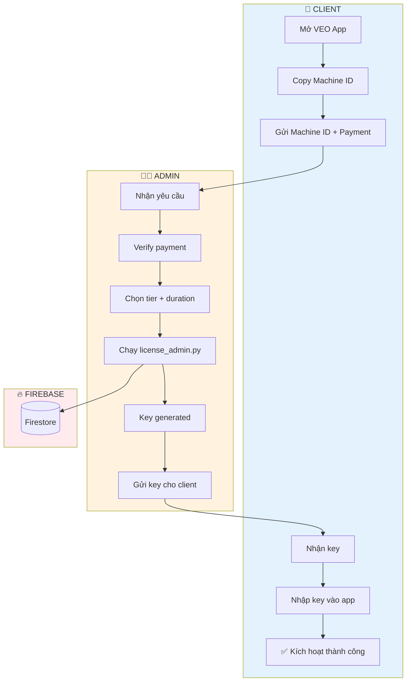
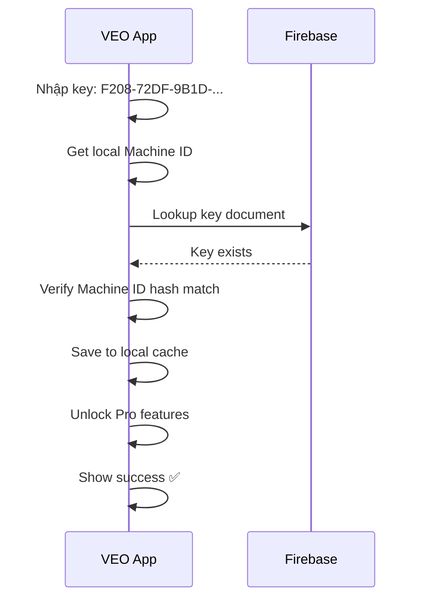

# 🔐 WORKFLOW: License Issuance (Cấp phép)

> **Version**: 2.3 (Updated Key Format)  
> **Last Updated**: 2026-02-04

## Tổng quan

Quy trình cấp license key cho client mới, từ khi nhận yêu cầu đến khi client kích hoạt thành công.

> [!IMPORTANT]
> **License Key Format v2.3**: Pure obfuscated hex, không còn VEO- prefix.  
> Format: `XXXX-XXXX-XXXX-XXXX-XXXX-XXXX-XXXX-XXXX`

---

## 🎯 Main Flow



---

## 📋 Step-by-Step Process

### Step 1: Client gửi Machine ID

```
┌────────────────────────────────────────────────────────────────┐
│ VEO APP - License Tab                                          │
├────────────────────────────────────────────────────────────────┤
│                                                                │
│ 📋 Machine ID: 3946C15B                    [📋 Copy]           │
│                                                                │
│ ─────────────────────────────────────────────────────────────  │
│                                                                │
│ 💳 Liên hệ Admin để mua license                                │
│                                                                │
│ Gửi Machine ID khi thanh toán để nhận key ngay!                │
└────────────────────────────────────────────────────────────────┘
```

**Client gửi:**
```
Yêu cầu: Mua VEO Pro 1 năm
Machine ID: 3946C15B
Email: customer@example.com
Payment: [Screenshot chuyển khoản]
```

---

### Step 2: Admin xử lý yêu cầu

```bash
# Verify payment trước

# Tạo key với machine ID từ client
python license_admin.py create \\
    --machine-id 3946C15B \\
    --duration 90 \\
    --email customer@example.com

# Output (v2.3 format - pure hex):
# ✅ Key: F208-72DF-9B1D-4BF6-661F-10F4-A3C2-8E7B
# ✅ Uploaded to Firebase
# ✅ Bound to machine: 3946C15B (SHA256 hash stored)
```

**Admin GUI Alternative:**
```
┌────────────────────────────────────────────────────────────────┐
│ VEO License Manager (v2.3)                                      │
├────────────────────────────────────────────────────────────────┤
│                                                                │
│ Machine ID: [3946C15B              ]                           │
│ Tier:       [▼ PRO                 ]                           │
│ Duration:   [▼ 365 days            ]                           │
│ Email:      [customer@example.com  ]                           │
│                                                                │
│ [🔐 Generate Key]                                              │
│                                                                │
│ ─────────────────────────────────────────────────────────────  │
│ Generated: F208-72DF-9B1D-4BF6-661F-10F4-A3C2-8E7B             │
│ Status: ✅ Uploaded to Firebase                                │
│                                                                │
│ [📋 Copy Key] [📧 Send Email]                                  │
└────────────────────────────────────────────────────────────────┘
```

---

### Step 3: Gửi key cho client

**Email Template:**
```
Subject: 🔐 VEO Automation Pro - License Key

──────────────────────────────────────────────────
Cảm ơn bạn đã mua VEO Automation Pro!

Mã License: F208-72DF-9B1D-4BF6-661F-10F4-A3C2-8E7B
Thời hạn:   20/01/2027 (1 năm)
Gói:        Pro

Hướng dẫn kích hoạt:
1. Mở VEO Automation
2. Vào tab "License" (biểu tượng 🔑)
3. Nhập mã license ở trên
4. Nhấn "Kích hoạt"

⚠️ Lưu ý: Key đã được gán cho máy tính của bạn.
Nếu đổi máy, liên hệ Admin để được hỗ trợ.

──────────────────────────────────────────────────
```

---

### Step 4: Client kích hoạt



---

## ⚙️ Key Generation Logic (v2.3 - Secure)

```python
import hashlib
import hmac
import secrets
from datetime import datetime

class LicenseKeyGenerator:
    """
    v2.3 License Key Generator
    
    Security features:
    - HMAC-SHA256 signature (requires server secret)
    - Full machine ID hash (not prefix)
    - Random salt (same input = different keys)
    - Pure hex output (no visible tier/timestamp)
    """
    
    # ⚠️ CRITICAL: Store in environment variable!
    SECRET_KEY = os.environ.get("LICENSE_SECRET_KEY")
    
    def generate_key(self, machine_id: str, tier: str, days: int) -> str:
        """Generate hardware-bound license key."""
        
        # Hash full machine ID
        mid_hash = hashlib.sha256(machine_id.encode()).hexdigest()[:8]
        
        # Random salt (makes each key unique)
        salt = secrets.token_hex(8)
        
        # Create HMAC signature
        payload = f"{mid_hash}:{tier}:{days}:{salt}"
        signature = hmac.new(
            bytes.fromhex(self.SECRET_KEY),
            payload.encode(),
            hashlib.sha256
        ).hexdigest()
        
        # Format as pure hex key (no VEO- prefix)
        raw = f"{mid_hash}{salt}{signature[:16]}"
        return "-".join([raw[i:i+4].upper() for i in range(0, 32, 4)])
        
        # Output: F208-72DF-9B1D-4BF6-661F-10F4-A3C2-8E7B
```

---

## 📊 Firebase Document Structure

```javascript
// Collection: _lic
// Document ID: F208-72DF-9B1D-4BF6-661F-10F4-A3C2-8E7B
{
    "_t": "PROF",                           // Tier (obfuscated in key)
    "_st": "a",                             // Status: a=active, r=revoked, e=expired
    "_exp": "2027-01-21",                   // Expiry date
    "_mid": "3946c15b35baaf59...",          // Full machine ID hash (SHA256)
    "_cr": "2026-01-21T21:55:00",           // Created timestamp
    "_em": "customer@example.com",          // Email
    "_salt": "a1b2c3d4e5f67890",            // Salt for validation
    "_v": 2,                                // Key format version
    "_note": ""                             // Admin notes
}
```

---

---

## 🔗 Related Files

| File | Purpose |
|------|---------|
| `license_admin.py` | CLI for key generation |
| `license_manager_gui.py` | GUI for key management |
| `license_keygen.py` | v2.3 key format & HMAC |
| `LICENSE_KEY_ALGORITHM.md` | Full algorithm documentation |
