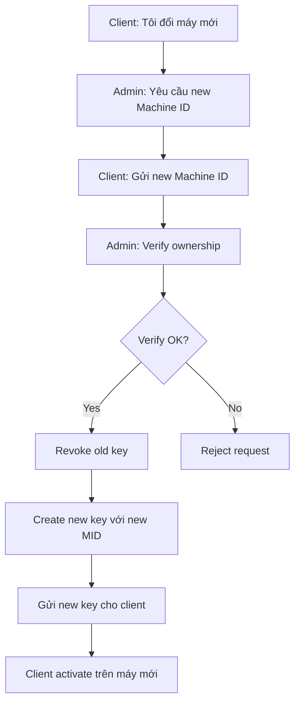
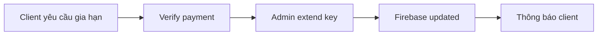
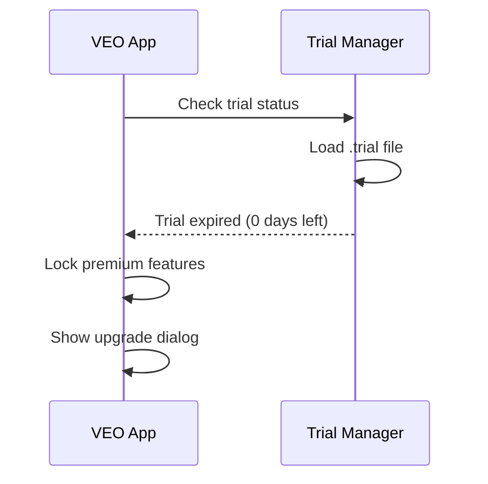

# 🛠️ WORKFLOW: License Support (Hỗ trợ License)

> **Version**: 2.3 (Updated Key Format)  
> **Last Updated**: 2026-02-04

## Tổng quan

Các quy trình xử lý support liên quan đến license: reset device, gia hạn, thu hồi, xử lý trial expired.

> [!IMPORTANT]
> **License Key Format v2.3**: Pure obfuscated hex, không còn VEO- prefix.  
> Format: `XXXX-XXXX-XXXX-XXXX-XXXX-XXXX-XXXX-XXXX`  
> Example: `F208-72DF-9B1D-4BF6-661F-10F4-A3C2-8E7B`

---

## 📋 Support Case Matrix

| Case | Trigger | Action | Admin Command |
|------|---------|--------|---------------|
| **Reset Device** | Client đổi máy | Tạo key mới với MID mới | `create --machine-id NEW_MID` |
| **Extend** | Client muốn gia hạn | Cập nhật expiry date | `extend KEY --days 365` |
| **Revoke** | Refund, abuse | Thu hồi key | `revoke KEY --reason "refund"` |
| **Trial Expired** | Hết 7 ngày trial | Remind mua license | N/A |
| **Key Lost** | Client mất key | Lookup by email | `search --email xxx` |

---

## 🔄 Case 1: Reset Device (Đổi máy)

### Flow



### Admin Commands

```bash
# 1. Tìm key cũ của client
python license_admin.py search --email customer@example.com
# Result: F208-72DF-9B1D-4BF6-661F-10F4-A3C2-8E7B

# 2. Revoke key cũ
python license_admin.py revoke F208-72DF-9B1D-4BF6-661F-10F4-A3C2-8E7B \
    --reason "Device change - user request"

# 3. Tạo key mới với Machine ID mới
python license_admin.py create \\
    --machine-id NEW_MID_HERE \\
    --duration 80 \\
    --email customer@example.com \\
    --note "Device change from 3946C15B"

# Output (v2.3 format):
# ✅ Key: A7B2-C8D3-E9F4-1234-5678-90AB-CDEF-1234
# ✅ Uploaded to Firebase
# ✅ Bound to machine: NEW_MID_HERE
```

### Policy

| Condition | Allowed |
|-----------|---------|
| First device change | ✅ Free |
| Within 6 months | ✅ Free |
| 2nd+ device change | ⚠️ May require verification |
| Suspected abuse | ❌ Reject |

---

## 📅 Case 2: License Extension (Gia hạn)

### Flow



### Admin Command

```bash
# Gia hạn thêm 365 ngày
python license_admin.py extend F208-72DF-9B1D-4BF6-661F-10F4-A3C2-8E7B \
    --days 365 \
    --note "Renewed 2027-01-21"

# Output:
# ✅ Extended: F208-72DF-9B1D-4BF6-661F-10F4-A3C2-8E7B
# Old expiry: 2027-01-21
# New expiry: 2028-01-21
```

---

## 🚫 Case 3: License Revocation (Thu hồi)

### Reasons

| Reason | Code | Action |
|--------|------|--------|
| Refund | `refund` | Full revoke |
| Chargeback | `chargeback` | Full revoke + blacklist |
| Abuse | `abuse` | Full revoke + blacklist |
| Upgrade | `upgrade` | Revoke + issue new tier |

### Admin Command

```bash
python license_admin.py revoke F208-72DF-9B1D-4BF6-661F-10F4-A3C2-8E7B \
    --reason "refund" \
    --note "Refund processed 2026-01-25"

# Firebase update:
# _st: "a" → "r" (revoked)
# _revoked_at: "2026-01-25T10:00:00"
# _revoked_reason: "refund"
```

### Client Experience

```
┌────────────────────────────────────────────────────────────────┐
│ ⚠️ LICENSE REVOKED                                             │
├────────────────────────────────────────────────────────────────┤
│                                                                │
│ Mã license của bạn đã bị thu hồi.                              │
│                                                                │
│ Lý do: Refund requested                                        │
│                                                                │
│ Nếu đây là nhầm lẫn, vui lòng liên hệ Admin để hỗ trợ.         │
│                                                                │
│ [📧 Contact Support] [🔐 Enter New Key]                        │
└────────────────────────────────────────────────────────────────┘
```

---

## ⏱️ Case 4: Trial Expired

### Detection Flow



### Upgrade Dialog

```
┌────────────────────────────────────────────────────────────────┐
│ ⏰ TRIAL HẾT HẠN                                               │
├────────────────────────────────────────────────────────────────┤
│                                                                │
│ Bản dùng thử 7 ngày của bạn đã hết.                            │
│                                                                │
│ Nâng cấp để tiếp tục sử dụng:                                  │
│                                                                │
│ ┌────────────┐ ┌────────────┐ ┌────────────┐ ┌────────────┐    │
│ │  1 Tháng   │ │  3 Tháng   │ │  6 Tháng   │ │   1 Năm    │    │
│ │  300,000đ  │ │  500,000đ  │ │  800,000đ  │ │ 1,200,000đ │    │
│ └────────────┘ └────────────┘ └────────────┘ └────────────────┘│
│                                                                │
│ ┌──────────────────────────────────────────────────────────┐   │
│ │ ♾️ Vĩnh viễn: 3,000,000đ (Tiết kiệm 92%*)               │   │
│ └──────────────────────────────────────────────────────────┘   │
│                                                                │
│ Machine ID: 3946C15B (Copy và gửi khi thanh toán)              │
│                                                                │
│ [📋 Copy Machine ID]        [💳 Liên hệ mua license]           │
└────────────────────────────────────────────────────────────────┘
```

---

## 🔍 Case 5: Key Lookup (Tìm key)

### Admin Commands

```bash
# Tìm theo email
python license_admin.py search --email customer@example.com

# Tìm theo machine ID
python license_admin.py search --machine-id 3946C15B

# Liệt kê tất cả keys
python license_admin.py list --status active

# Xem chi tiết key
python license_admin.py check F208-72DF-9B1D-4BF6-661F-10F4-A3C2-8E7B
```

### Output Example

```
┌────────────────────────────────────────────────────────────────┐
│ KEY DETAILS                                                     │
├────────────────────────────────────────────────────────────────┤
│ Key:        F208-72DF-9B1D-4BF6-661F-10F4-A3C2-8E7B            │
│ Format:     v2.3 (Pure Hex)                                    │
│ Status:     ✅ Active                                          │
│ Tier:       PRO                                                │
│ Created:    2026-01-21 21:55:00                                │
│ Expires:    2027-01-21                                         │
│ Days left:  365 days                                           │
│ Machine ID: ****C15B (hash: 3946c15b35baaf59...)               │
│ Email:      customer@example.com                               │
│ Notes:      -                                                  │
└────────────────────────────────────────────────────────────────┘
```

---

## 📊 Response Time SLA

| Case | Target | Max |
|------|--------|-----|
| New license | 1 hour | 24 hours |
| Device reset | 2 hours | 48 hours |
| Extension | 1 hour | 24 hours |
| Revoke/Refund | Immediate | 1 hour |

---

## 🆕 Case 6: Concurrent Session Control

> [!IMPORTANT]
> Prevents the same license key from being used on more than 2 devices simultaneously.

```python
import uuid
from datetime import datetime, timedelta

class SessionController:
    """
    Prevent same license key from being used on multiple machines simultaneously.
    Server tracks active sessions.
    """
    
    MAX_DEVICES_PER_LICENSE = 2  # Allow 2 devices (desktop + laptop)
    SESSION_TIMEOUT = timedelta(hours=4)  # Session expires after 4 hours inactivity
    
    def __init__(self, api_client, machine_id: str):
        self.api = api_client
        self.machine_id = machine_id
        self.session_id = str(uuid.uuid4())
        self.heartbeat_interval = 300  # 5 minutes
    
    def start_session(self, license_key: str) -> dict:
        """Request to start a new session."""
        response = self.api.post("/session/start", {
            "license_key": license_key,
            "machine_id": self.machine_id,
            "session_id": self.session_id,
            "timestamp": datetime.now().isoformat()
        })
        
        data = response.json()
        
        if not data.get("allowed"):
            return {
                "success": False,
                "error": data.get("error", "Session limit reached"),
                "active_devices": data.get("active_devices", []),
                "max_devices": self.MAX_DEVICES_PER_LICENSE
            }
        
        return {"success": True, "session_token": data["session_token"]}
    
    def send_heartbeat(self, session_token: str) -> bool:
        """Periodically confirm session is still active."""
        try:
            response = self.api.post("/session/heartbeat", {
                "session_token": session_token,
                "machine_id": self.machine_id,
                "timestamp": datetime.now().isoformat()
            })
            return response.json().get("alive", False)
        except:
            return False
    
    def end_session(self, session_token: str):
        """Explicitly end session (on app close)"""
        try:
            self.api.post("/session/end", {"session_token": session_token})
        except:
            pass
    
    def force_logout_device(self, license_key: str, device_machine_id: str) -> bool:
        """Allow user to remotely logout another device."""
        response = self.api.post("/session/force-logout", {
            "license_key": license_key,
            "target_machine_id": device_machine_id,
            "requester_machine_id": self.machine_id
        })
        return response.json().get("success", False)
```

### Server-Side Logic (Firebase)

```
sessions = {
    license_key: {
        machine_id_1: { session_id, last_heartbeat, started_at },
        machine_id_2: { session_id, last_heartbeat, started_at }
    }
}

On /session/start:
    - Count active devices for this license
    - If count >= MAX_DEVICES → reject
    - Else → add session, return token

On /session/heartbeat:
    - Update last_heartbeat timestamp

Cleanup job (every 5 min):
    - Remove sessions where now - last_heartbeat > SESSION_TIMEOUT
```

---

## 🆕 Case 7: Usage Analytics & Anomaly Detection (Server-Side)

> [!WARNING]
> Detects key sharing, bot usage, and suspicious geographic patterns. Runs server-side on Firebase.

```python
from dataclasses import dataclass
from datetime import datetime, timedelta
from typing import List, Optional
from collections import defaultdict

@dataclass
class UsageEvent:
    timestamp: datetime
    action: str       # "generate", "download", "login", etc.
    ip_address: str
    geo_location: str  # Country code
    machine_id: str

class AnomalyDetector:
    """
    Server-side anomaly detection for license abuse.
    Detects: key sharing, bot usage, suspicious patterns.
    """
    
    MAX_COUNTRIES_24H = 2      # Max 2 countries in 24 hours
    MAX_IPS_1H = 5             # Max 5 different IPs per hour
    MIN_ACTION_INTERVAL = 1    # Minimum 1 second between actions
    MAX_ACTIONS_PER_HOUR = 500 # Human limit
    
    def __init__(self, events: List[UsageEvent]):
        self.events = events
    
    def detect_geo_anomaly(self) -> Optional[str]:
        """Detect impossible travel (e.g., USA → China in 1 hour)."""
        recent = [e for e in self.events 
                  if e.timestamp > datetime.now() - timedelta(hours=24)]
        countries = set(e.geo_location for e in recent)
        
        if len(countries) > self.MAX_COUNTRIES_24H:
            return f"License used from {len(countries)} countries in 24h"
        
        # Check for impossible travel
        sorted_events = sorted(recent, key=lambda e: e.timestamp)
        for i in range(1, len(sorted_events)):
            prev, curr = sorted_events[i-1], sorted_events[i]
            time_diff = (curr.timestamp - prev.timestamp).total_seconds() / 3600
            if prev.geo_location != curr.geo_location and time_diff < 2:
                return f"Impossible travel: {prev.geo_location} → {curr.geo_location} in {time_diff:.1f}h"
        return None
    
    def detect_bot_behavior(self) -> Optional[str]:
        """Detect automated/bot usage patterns."""
        recent = [e for e in self.events 
                  if e.timestamp > datetime.now() - timedelta(hours=1)]
        
        if len(recent) > self.MAX_ACTIONS_PER_HOUR:
            return f"Excessive usage: {len(recent)} actions/hour"
        
        sorted_events = sorted(recent, key=lambda e: e.timestamp)
        fast_actions = sum(
            1 for i in range(1, len(sorted_events))
            if (sorted_events[i].timestamp - sorted_events[i-1].timestamp).total_seconds() < self.MIN_ACTION_INTERVAL
        )
        
        if fast_actions > 10:
            return f"Bot-like: {fast_actions} actions < {self.MIN_ACTION_INTERVAL}s apart"
        return None
    
    def detect_key_sharing(self) -> Optional[str]:
        """Detect multiple machines using same key simultaneously."""
        recent = [e for e in self.events 
                  if e.timestamp > datetime.now() - timedelta(hours=1)]
        
        windows = defaultdict(set)
        for e in recent:
            window = e.timestamp.replace(second=0, microsecond=0)
            window = window.replace(minute=window.minute // 5 * 5)
            windows[window].add(e.machine_id)
        
        for window, machines in windows.items():
            if len(machines) > 2:
                return f"Key sharing: {len(machines)} machines at {window}"
        return None
    
    def run_all_checks(self) -> dict:
        return {
            "geo_anomaly": self.detect_geo_anomaly(),
            "bot_behavior": self.detect_bot_behavior(),
            "key_sharing": self.detect_key_sharing(),
            "is_suspicious": any([
                self.detect_geo_anomaly(),
                self.detect_bot_behavior(),
                self.detect_key_sharing()
            ])
        }
```

---

## 🆕 Case 8: License Revocation System (Automated)

> [!CAUTION]
> Automated revocation with local cache + server sync. Handles refund, chargeback, abuse, fraud, sharing.

```python
from enum import Enum
from datetime import datetime
from pathlib import Path
import json

class RevocationReason(str, Enum):
    REFUND = "refund"
    CHARGEBACK = "chargeback"
    ABUSE = "abuse"
    SHARING = "sharing"
    FRAUD = "fraud"
    MANUAL = "manual"

class LicenseRevocation:
    """Handle license revocation and blacklisting."""
    
    REVOCATION_CACHE_FILE = Path.home() / ".veoauto" / ".revoked"
    
    def __init__(self, api_client):
        self.api = api_client
        self.local_cache = self._load_cache()
    
    def is_revoked(self, license_key: str) -> bool:
        """Check if license is revoked (local cache + server)."""
        if license_key in self.local_cache:
            return True
        
        try:
            response = self.api.get(f"/license/status/{license_key}")
            data = response.json()
            if data.get("revoked"):
                self._add_to_cache(license_key)
                return True
        except:
            pass  # Allow offline usage
        
        return False
    
    def sync_revocation_list(self):
        """Sync revoked keys from server (background task)."""
        try:
            response = self.api.get("/license/revoked-list")
            revoked = response.json().get("revoked_keys", [])
            self.local_cache = set(revoked)
            self._save_cache()
        except:
            pass
    
    def _load_cache(self) -> set:
        if not self.REVOCATION_CACHE_FILE.exists():
            return set()
        try:
            return set(json.loads(self.REVOCATION_CACHE_FILE.read_text()))
        except:
            return set()
    
    def _save_cache(self):
        self.REVOCATION_CACHE_FILE.parent.mkdir(parents=True, exist_ok=True)
        self.REVOCATION_CACHE_FILE.write_text(json.dumps(list(self.local_cache)))
    
    def _add_to_cache(self, key: str):
        self.local_cache.add(key)
        self._save_cache()
```

---

## 📊 Response Time SLA

| Case | Target | Max |
|------|--------|-----|
| New license | 1 hour | 24 hours |
| Device reset | 2 hours | 48 hours |
| Extension | 1 hour | 24 hours |
| Revoke/Refund | Immediate | 1 hour |

---

## 🔗 Related Files

| File | Purpose |
|------|---------|
| `license_admin.py` | Admin CLI |
| `license_manager_gui.py` | Admin GUI |
| `cleanup_expired_keys.py` | Auto cleanup |
| `LICENSE_KEY_ALGORITHM.md` | v2.3 key format spec |
| `session_controller.py` | Concurrent session control |
| `anomaly_detector.py` | Usage analytics & anomaly detection |
| `license_revocation.py` | Automated revocation system |
