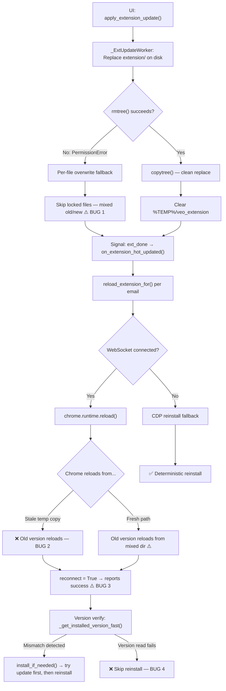

# Extension Hot-Update Bug Report

**Date**: 2026-04-10 (v2)  
**Severity**: P1 — Extension updates may silently fail, leaving outdated code running  
**Affected versions**: Any version using extension-only hot-update path  
**Current versions**: App `v2.3.14` | Extension manifest `v2.3.13` | version.json feed `v2.3.6`

---

## Executive Summary

The extension hot-update mechanism **does not reliably replace the old extension with the new version** in Branded Chrome. The failure chain has **three independent root causes** that can each independently leave the old extension running:

1. **Partial file replacement on disk** — Chrome file locks cause `rmtree(ext_dir)` to fail, triggering a per-file overwrite fallback that silently skips locked files, producing a mixed old/new extension directory.
2. **Stale reload path** — `chrome.runtime.reload()` reloads from the original install path (often a deleted `%TEMP%` copy), not the updated disk files.
3. **False success signal** — The system reports "reload succeeded" based solely on WebSocket reconnection, without verifying the reconnected extension is actually the new version.

These bugs compound: even if one is bypassed, the others can independently prevent the update from taking effect. Runtime logs confirm the bug has occurred in production: extension `v2.3.8` was still running while local files were `v2.3.13`.

---

## Root Cause Analysis

### BUG 1: Partial file replacement on disk (P1) — NEW

**What happens**: The `_ExtUpdateWorker` tries to atomically replace `extension/` on disk via `shutil.rmtree()` → `shutil.copytree()`. But Chrome's service worker and content scripts hold file locks on `background.js`, `content.js`, etc. When `rmtree()` fails with `PermissionError` after 3 retries, the code falls back to per-file overwrite — and **silently skips any file it can't overwrite**:

```python
# auto_updater.py L1456-1474
except PermissionError:
    if attempt < max_retries - 1:
        log.warning(f"Extension files locked (attempt {attempt+1}/{max_retries}), retrying in 2s...")
        _time.sleep(2)
    else:
        log.warning("Extension files locked — force overwriting individual files")
        os.makedirs(ext_dir, exist_ok=True)
        for root, dirs, files in os.walk(src_ext):
            ...
            for f in files:
                try:
                    shutil.copy2(src_f, dst_f)
                except Exception as e:
                    log.warning(f"Cannot overwrite {f}: {e}")  # ← skips, does NOT abort
```

**Impact**: After this fallback, the `extension/` directory may contain a **mix of old and new files**. For example:
- `background.js` (locked by service worker) → **OLD version**
- `manifest.json` (not locked) → **NEW version**
- `content.js` (locked by tab injection) → **OLD version**

This creates a state where even a correct reload would load a corrupted/inconsistent extension. The worker still emits `ext_done`, and `on_extension_hot_updated()` proceeds to reload from this broken directory.

> [!CAUTION]
> This bug occurs **before** any reload attempt. Even if BUG 2 and BUG 3 were fixed, partial file replacement would independently produce a broken extension.

### BUG 2: `chrome.runtime.reload()` loads from stale path (P1)

**What happens**: After hot-update replaces `extension/` on disk, the system calls `chrome.runtime.reload()` via WebSocket. But Chrome reloads the service worker **from the path it was originally installed from** — which may be:
- A stale `%TEMP%\veo_extension` temp copy (for `#` paths)
- The previous physical directory if Chrome cached the unpacked extension ID

**Evidence in code**:
- The codebase **explicitly documents** this problem:
  ```
  extension_bridge.py L1989-1992:
  # NOTE: We do NOT send reload_extension here because chrome.runtime.reload()
  # only reloads from the OLD installed path (stale temp copy), not the updated source.
  ```
- Yet `reload_extension_for()` still uses `chrome.runtime.reload()` as Strategy 1:
  ```
  app_controller.py L1972-2004:
  # Strategy 1: WebSocket hot-reload (if extension is connected)
  → bridge.reload_extension(email, timeout=15.0)
  ```
- `on_extension_hot_updated()` calls `reload_extension_for()` for Branded Chrome (L2232), so the hot-update goes through the unreliable path first.

> [!IMPORTANT]
> **Docstring / implementation mismatch**: The docstring of `on_extension_hot_updated()` claims Branded Chrome uses "CDP reinstall (uninstall old → install new from disk)" (L2188-2189), but the actual implementation calls `reload_extension_for()` first (L2232), which tries `chrome.runtime.reload()` as Strategy 1. Only if WebSocket is disconnected does the code fall through to CDP reinstall. This mismatch means developers reviewing the docstring would incorrectly believe the system is already deterministic.

**Flow diagram**:


### BUG 3: "Reconnect = success" — false success criterion (P1) — NEW

**What happens**: `ExtensionBridge.reload_extension()` defines success as "extension reconnected via WebSocket", NOT "the correct version reconnected":

```python
# extension_bridge.py L1549-1557
# Wait for extension to reload and reconnect
reconnected = await self.wait_for_extension(email, timeout=timeout)

if reconnected:
    log.info(f"[ExtensionBridge] ✅ Extension reloaded and reconnected for {email}")
else:
    log.warning(f"[ExtensionBridge] ⚠️ Extension reloaded but did not reconnect within {timeout}s")
return reconnected  # ← True if ANY version reconnected, not just the new one
```

The caller in `on_extension_hot_updated()` then treats this as definitive success:

```python
# app_controller.py L2232-2234
ok = self.reload_extension_for(email)
if ok:
    results[email] = "✅ reloaded"  # ← reported as success without version check
```

**The version check at L2266-2283 is a secondary, after-the-fact verification** — it runs after the success has already been logged. And if version read fails (BUG 4), it doesn't retroactively correct the result.

### BUG 4: Silent skip when version is unreadable (P1)

**What happens**: `install_if_needed()` at L1371-1373 treats `installed_ver == None` as "version unknown, assume OK":
```python
# extension_manager.py L1371-1373
else:
    # Could not read installed version — assume OK
    log.info(f"[ExtMgr] Extension loaded (version unknown), local v{local_ver} — skipping")
```

Similarly, `on_extension_hot_updated()` at L2273 only reinstalls when **both** versions are readable AND different:
```python
# app_controller.py L2273
if local_ver and installed_ver and installed_ver != local_ver:
```

If `installed_ver` is `None` (MV3 service worker suspended, CDP timeout, etc.), **neither location triggers reinstall**. The old extension continues running indefinitely.

### BUG 5: Startup version-mismatch path has unreliable intermediate step (P2) — NEW

**What happens**: When `install_if_needed()` detects a version mismatch at startup, it **does NOT go directly to `reinstall_extension()`**. Instead, it first tries `_update_unpacked_extension()`:

```python
# extension_manager.py L1359-1368
if installed_ver and installed_ver != local_ver:
    log.warning(f"[ExtMgr] ⚠️ Version mismatch: installed={installed_ver}, local={local_ver}")
    
    # Try fast update first (refresh files + reload button)
    if _update_unpacked_extension(port, extension_dir):  # ← intermediate step
        return True
    
    # Fallback: full reinstall
    log.warning(f"[ExtMgr] Fast update failed — falling back to full reinstall")
    return reinstall_extension(port, extension_dir)
```

`_update_unpacked_extension()` clicks the ↻ reload button on `chrome://extensions` (L1262-1266) — which is functionally equivalent to `chrome.runtime.reload()` and has the **same stale-path problem as BUG 2**. It also refreshes the temp copy via `_get_safe_path()` for `#` paths (L1236-1237), but this only helps if Chrome actually reads from that temp path after reload.

Only if this intermediate step fails does the system fall back to the deterministic `reinstall_extension()`. This means the Impact Assessment row "Startup, version mismatch → reinstall (correct)" from the original report was **inaccurate** — there is always a non-deterministic step first.

### BUG 6: Metadata version drift (P2)

Three version sources are out of sync:

| Source | Value | Location |
|--------|-------|----------|
| `APP_VERSION` | `2.3.14` | `config/constants.py:356` |
| Extension manifest | `2.3.13` | `extension/manifest.json:4` |
| Update feed | `2.3.6` | `version.json:2` |

`AutoUpdater._on_check_result()` at L1279-1283 compares these directly:
```python
app_cmp = compare_versions(current_app, info.version)     # 2.3.14 vs 2.3.6
ext_cmp = compare_versions(current_ext, info.ext_version)  # 2.3.13 vs 2.3.6
```

Since local versions are **newer** than feed versions in all cases, the updater will always report "up to date" — even if a legitimate v2.3.14 release is pushed but the feed still shows v2.3.6.

> [!NOTE]
> `version.json` in the workspace is the **local development copy**, not the hosted feed. The hosted feed (on GitHub) may have different values. This is still a risk if the hosted feed isn't updated in sync with releases.

---

## Runtime Evidence

**Account log** (`veofidelia169_at_tunxelamorintesa_sbs.log`):

Line 145 shows extension registering as `v2.3.8` while the local manifest is `v2.3.13`:
```
15:48:18 [INFO] Extension registered: veofidelia169@tunxelamorintesa.sbs (v2.3.8)
```

This repeats continuously through L800+ — the extension was **never updated** despite the local files being 5 versions ahead. The same `v2.3.8` version persists across multiple WebSocket reconnect/zombie cycles, confirming Chrome kept loading from the original install path.

---

## Affected Code Paths

### Extension-only hot-update flow

| Step | File | Lines | What happens |
|------|------|-------|-------------|
| 1. UI triggers | `settings_sections.py` | L1407 | `updater.apply_extension_update(zip_path)` |
| 2. Worker replaces disk | `auto_updater.py` | L1447-1494 | `rmtree` → retry 3x → per-file fallback (may produce mixed dir) |
| 3. Signal emits | `auto_updater.py` | L1516 | `self.ext_done.emit()` — **even if files were partially replaced** |
| 4. UI handles | `settings_sections.py` | L1491-1513 | `controller.on_extension_hot_updated()` |
| 5. Reload per browser | `app_controller.py` | L2218-2287 | `reload_extension_for()` per email |
| 6. Strategy 1 (unreliable) | `app_controller.py` | L1972-2004 | `chrome.runtime.reload()` via WebSocket |
| 7. Success = reconnect | `extension_bridge.py` | L1549-1557 | Returns True if reconnected, **no version check** |
| 8. Version verify (secondary) | `app_controller.py` | L2266-2283 | Compare installed vs local version |
| 9. Skip if unreadable | `app_controller.py` | L2273 | `if local_ver and installed_ver and installed_ver != local_ver:` |

### Startup check flow

| Step | File | Lines | What happens |
|------|------|-------|-------------|
| 1. Batch check | `app_controller.py` | L2087-2180 | `ensure_all_extensions()` |
| 2. Bridge shortcut | `app_controller.py` | L2152-2167 | Skip if connected + version match |
| 3. Fallback to install_if_needed | `extension_manager.py` | L1319-1377 | Version check → **try reload button first** → reinstall |
| 4. Intermediate step | `extension_manager.py` | L1362-1364 | `_update_unpacked_extension()` — clicks ↻ reload, same stale-path risk |
| 5. Reinstall fallback | `extension_manager.py` | L1367-1368 | `reinstall_extension()` — only if intermediate fails |
| 6. Silent skip | `extension_manager.py` | L1371-1373 | `installed_ver == None` → skip |

### Special path: `#` in directory

The repo lives at `D:\...\#NEW VEO API\...` which contains `#`. This triggers:
- `extension_manager.py L463/L614`: `_get_safe_path()` copies extension to `%TEMP%\veo_extension`
- Chrome is installed from this **temp copy**, not the source directory
- After hot-update clears `%TEMP%\veo_extension` (`auto_updater.py L1510-1513`)...
- `chrome.runtime.reload()` tries to load from the now-deleted temp path → **fails**
- But failure is silent (Chrome falls back to cached service worker)

---

## Design vs Implementation Contradictions

| Location | Docstring/Comment says | Implementation does |
|----------|----------------------|-------------------|
| `on_extension_hot_updated()` L2188-2189 | "Branded Chrome: CDP reinstall (uninstall old → install new from disk)" | Calls `reload_extension_for()` first (L2232), which tries `chrome.runtime.reload()` via WebSocket |
| `extension_bridge.py` L1989-1992 | "`chrome.runtime.reload()` only reloads from OLD path — do NOT use" | `reload_extension_for()` uses it as Strategy 1 (L1972-2004) |
| `install_if_needed()` comment | "update/reinstall if version outdated" | Tries non-deterministic reload button before reinstall (L1363) |

> [!WARNING]
> These contradictions are dangerous: a developer reading the docstrings would believe the system is deterministic when it is not. Any fix must also correct these docstrings to prevent future regression.

---

## Recommended Fix

### Option A: Force deterministic reinstall (recommended)

Modify `on_extension_hot_updated()` to **skip** `reload_extension_for()` entirely for Branded Chrome and go straight to `reinstall_extension()`.

> [!IMPORTANT]
> **Implementation prerequisite**: `cdp_port` is not available in the current hot-update loop — it's only read later at L2263 for the verify step. The fix must discover `cdp_port` **before** the Branded Chrome branch, using the same pattern from `ensure_all_extensions()` at L2115-2138: read from `entry.get("cdp_port")` first, fall back to PID file.

```python
# app_controller.py — on_extension_hot_updated()._reload_all()
for email in running_emails:
    try:
        # ★ FIX: Discover cdp_port + chrome_exe BEFORE branching
        # (reuse pattern from ensure_all_extensions() L2115-2138)
        entry = pc._debug_browsers.get(email, {})
        cdp_port = entry.get("cdp_port")
        chrome_exe = ""
        profile = pc.get_profile(email)
        if profile and profile.browser_profile_path:
            pid_data = _load_pid_file(profile.browser_profile_path)
            if pid_data:
                if not cdp_port:
                    cdp_port = pid_data.get("port")
                chrome_exe = pid_data.get("chrome_exe", "")
        
        if not cdp_port:
            results[email] = "⚠️ no CDP port"
            continue
        
        if is_branded_chrome(chrome_exe):
            # ★ FIX: Skip chrome.runtime.reload() — it loads from stale path.
            # Go directly to CDP uninstall → reinstall.
            log.info(f"[ExtHotUpdate] {email}: Branded Chrome — CDP reinstall...")
            from core.extension_manager import reinstall_extension
            _ext_dir = _client_dir / "extension"
            ok = reinstall_extension(cdp_port, str(_ext_dir), show_window=True)
            results[email] = "✅ reinstalled" if ok else "❌ reinstall failed"
```

This is ~15s slower per browser but **guaranteed correct**.

### Option B: Fix version-unknown fallback

Change `install_if_needed()` to **force reinstall** when version is unreadable:

```python
# extension_manager.py L1371-1373
else:
    # Cannot read version → force reinstall to be safe
    log.warning(f"[ExtMgr] Extension loaded but version unknown — forcing reinstall")
    return reinstall_extension(port, extension_dir)
```

And change `on_extension_hot_updated()` version verify to force reinstall on None:

```python
# app_controller.py L2272-2280
if not installed_ver or (local_ver and installed_ver != local_ver):
    # Force reinstall if version unknown OR mismatched
    ...
```

### Option C: Skip intermediate reload step at startup

Change `install_if_needed()` to go directly to `reinstall_extension()` when version mismatches, bypassing `_update_unpacked_extension()`:

```python
# extension_manager.py L1359-1368
if installed_ver and installed_ver != local_ver:
    log.warning(f"[ExtMgr] ⚠️ Version mismatch: installed={installed_ver}, local={local_ver}")
    # ★ FIX: Skip _update_unpacked_extension() — it uses the same unreliable reload path.
    # Go directly to full reinstall.
    return reinstall_extension(port, extension_dir)
```

### Option D: Add version-gated success criterion to reload_extension()

Make `ExtensionBridge.reload_extension()` compare the version reported in `register_tab` against the expected local version.

> [!IMPORTANT]
> **Implementation prerequisite**: `ExtensionConnection` (L59-68) currently has **no `ext_version` field**. The `register` handler at L1963-1965 reads `msg.get('version')` but only logs it — it does not persist the value. To implement Option D, you must either:
> - **Option D1**: Add `ext_version: str = ""` to the `ExtensionConnection` dataclass, and set `conn.ext_version = ext_version` in the register handler.
> - **Option D2**: Maintain a separate `_email_ext_version: Dict[str, str]` map on `ExtensionBridge`, updated on each `register` message.
>
> `_find_connection()` at L2391-2395 returns an `ExtensionConnection` object (not a dict), so the lookup would be `conn.ext_version`, not `conn.get('ext_version')`.

```python
# Step 1: extension_bridge.py — Add field to ExtensionConnection
@dataclass
class ExtensionConnection:
    ws: Any
    registered_emails: list = field(default_factory=list)
    ext_version: str = ""  # ← NEW: set on register
    ...

# Step 2: extension_bridge.py — Store version in register handler (L1963+)
if action == 'register':
    ext_version = msg.get('version', '')
    conn.ext_version = ext_version  # ← NEW
    ...

# Step 3: extension_bridge.py — reload_extension() version gate
reconnected = await self.wait_for_extension(email, timeout=timeout)
if reconnected:
    from core.extension_manager import get_local_extension_version
    expected = get_local_extension_version()
    found_conn = self._find_connection(email)
    if found_conn and expected and found_conn.ext_version != expected:
        log.warning(f"Reconnected but wrong version: {found_conn.ext_version} != {expected}")
        return False
return reconnected
```

### Option E: Add file-lock integrity check to _ExtUpdateWorker

Make the worker **fail with error** instead of silently continuing when critical files can't be overwritten:

```python
# auto_updater.py — _ExtUpdateWorker.run() file fallback
CRITICAL_FILES = {'background.js', 'content.js', 'manifest.json'}
failed_critical = []
for f in files:
    try:
        shutil.copy2(src_f, dst_f)
    except Exception as e:
        if f in CRITICAL_FILES:
            failed_critical.append(f)
        log.warning(f"Cannot overwrite {f}: {e}")

if failed_critical:
    self.ext_error.emit(f"Cannot update critical files (Chrome lock): {', '.join(failed_critical)}")
    return  # ← abort instead of emitting ext_done
```

### Option F: Sync metadata versions

Ensure all three version sources are updated atomically during release:

1. `config/constants.py` → `APP_VERSION`
2. `extension/manifest.json` → `version`
3. `version.json` (hosted feed) → `version` + `ext_version`

Add a CI/build step that validates all three match before publishing.

---

## Impact Assessment

| Scenario | Current behavior | Expected behavior |
|----------|-----------------|-------------------|
| Hot-update, files locked | Skip locked files → mixed dir → `ext_done` | **Abort with error** (Option E) |
| Hot-update, WS connected | `chrome.runtime.reload()` → may load stale | CDP reinstall → guaranteed fresh (Option A) |
| Hot-update, success check | Reconnect = success (no version check) | Version-verified success (Option D) |
| Hot-update, version unreadable | Skip reinstall | Force reinstall (Option B) |
| Hot-update, WS disconnected | CDP reinstall (correct) | CDP reinstall (correct) |
| Full update / installer | Replace entire app dir → correct | Replace entire app dir → correct |
| Startup, version mismatch | Try reload button first → reinstall fallback | **Direct reinstall** (Option C) |
| Startup, version unknown | Skip → **stale extension runs** | Force reinstall (Option B) |

---

## Verification Plan

After implementing fixes:

1. **Pre-test**: Install extension v2.3.13, verify via `chrome://extensions`
2. **Hot-update**: Trigger ext-only update to v2.3.14
3. **Verify**: Check `chrome://extensions` shows v2.3.14
4. **Log check**: Confirm `register_tab` reports v2.3.14 (not v2.3.13)
5. **Edge case**: Kill service worker → verify `install_if_needed()` still forces reinstall
6. **File lock test**: Lock `background.js` externally → verify worker emits error, not `ext_done`
7. **Docstring audit**: Verify all docstrings match implementation after fix
