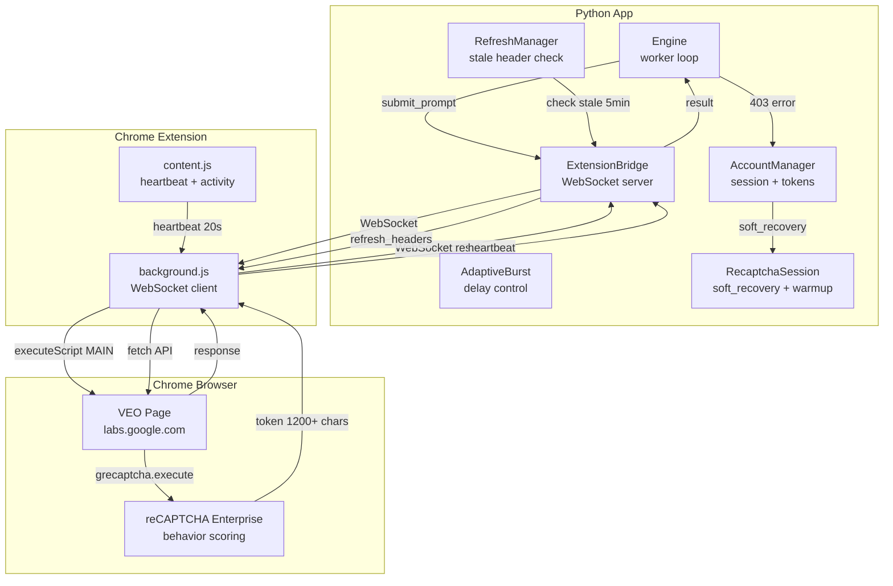
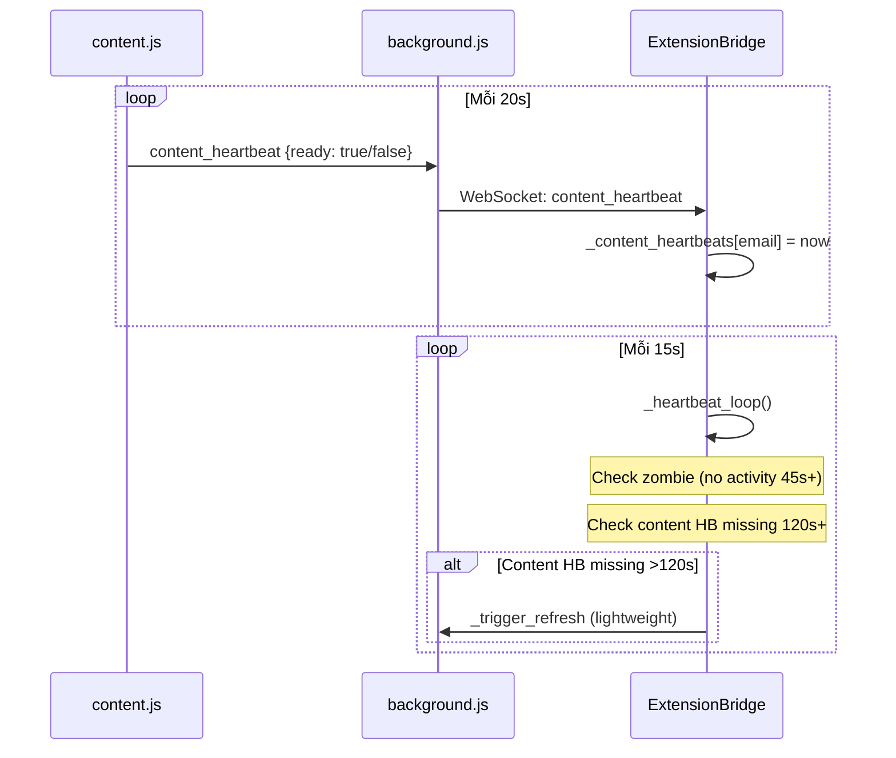
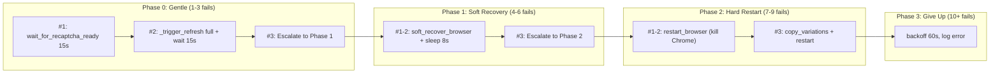
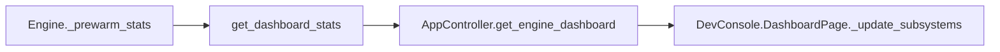
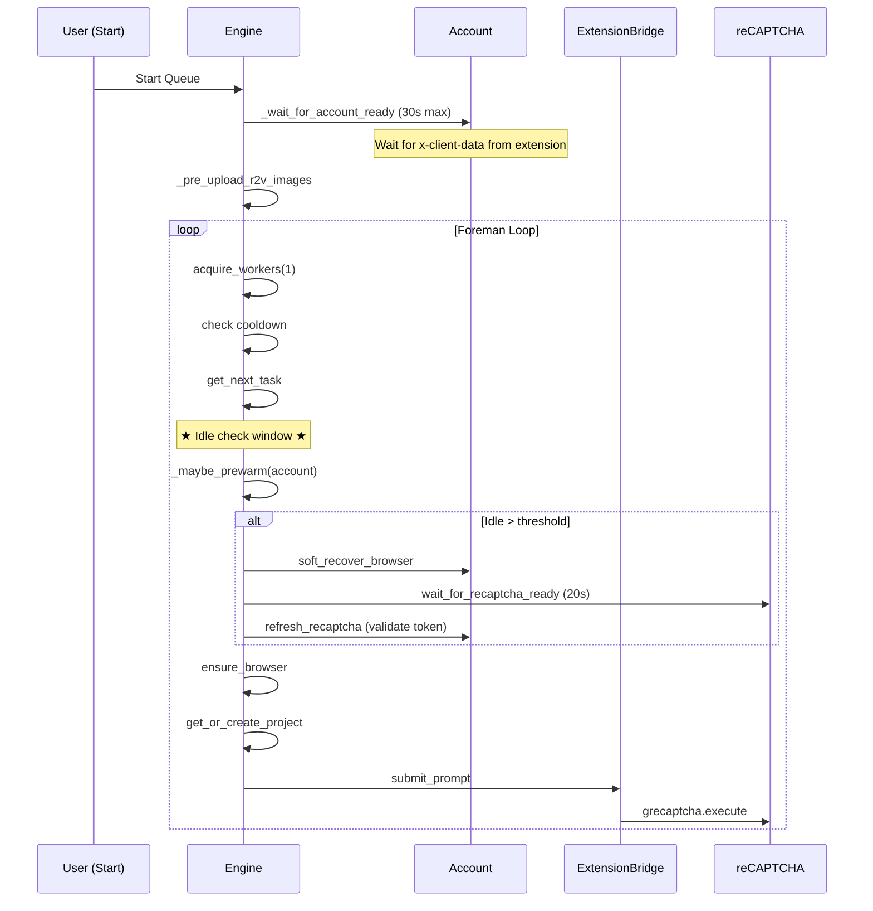

# Architecture Analysis: App ↔ Extension ↔ Browser Recovery for 403 Errors

## Tổng quan kiến trúc



---

## 1. Submit Flow (Bình thường)

### 1.1 Python → Extension → Browser → API

| Bước | File | Hàm | Mô tả |
|------|------|-----|-------|
| 1 | [engine.py](file:///D:/Music/Ruby/Produce%20for%20Customer/%23%23Tools/VEO%20Tool/%23NEW%20VEO%20API/02%20-%20CLIENT%20-%20VEO%20PRO%20MAX/core/engine.py) | Worker loop | Lấy task từ queue, gọi `submit_prompt` |
| 2 | [extension_bridge.py](file:///D:/Music/Ruby/Produce%20for%20Customer/%23%23Tools/VEO%20Tool/%23NEW%20VEO%20API/02%20-%20CLIENT%20-%20VEO%20PRO%20MAX/core/extension_bridge.py#L500-L607) | `submit_prompt()` | **Pre-warm check**: if tab idle >60s → `simulate_activity()`. Gửi WS message `action: submit_prompt` |
| 3 | [background.js](file:///D:/Music/Ruby/Produce%20for%20Customer/%23%23Tools/VEO%20Tool/%23NEW%20VEO%20API/02%20-%20CLIENT%20-%20VEO%20PRO%20MAX/extension/background.js#L680-L900) | `handleAppMessage` → submit_prompt | `executeScript` chạy trong MAIN world trên VEO page |
| 4 | background.js | Script trên page | **Step 1**: Extract reCAPTCHA site key từ DOM |
| 5 | background.js | Script trên page | **Step 2**: `grecaptcha.enterprise.execute(siteKey, {action: 'VIDEO_GENERATION'})` → reCAPTCHA token (1200+ chars) |
| 6 | background.js | Script trên page | **Step 3**: Inject token vào body `clientContext.recaptchaContext` |
| 7 | background.js | Script trên page | **Step 4**: `fetch(endpointUrl, {credentials: 'include'})` — Chrome tự thêm browser headers |
| 8 | extension_bridge.py | Result handler | Parse response, return to engine |

### 1.2 Pre-warm Logic (Idle >60s)

```python
# extension_bridge.py L534-542
last_hb = self._content_heartbeats.get(email, 0)
if last_hb and (time.time() - last_hb) > 60:
    await self.simulate_activity(email, timeout=3.0)
    await asyncio.sleep(0.5)
```

> [!WARNING]
> **Điểm yếu**: `simulate_activity` chỉ gửi WebSocket message yêu cầu extension mô phỏng mouse/scroll. Sau idle **dài** (30+ phút), reCAPTCHA Enterprise đã đánh giá session xuống thấp → simulate_activity 3s **KHÔNG đủ** để phục hồi score.

---

## 2. Background Heartbeat & Activity Monitoring

### 2.1 Heartbeat Chain



### 2.2 Refresh Manager (Stale Headers)

| File | Method | Interval | Action |
|------|--------|----------|--------|
| [refresh_manager.py](file:///D:/Music/Ruby/Produce%20for%20Customer/%23%23Tools/VEO%20Tool/%23NEW%20VEO%20API/02%20-%20CLIENT%20-%20VEO%20PRO%20MAX/core/refresh_manager.py) | `check_sessions_need_refresh` | ~5 min | Check if headers stale >240s → trigger `_trigger_refresh` |
| [extension_bridge.py](file:///D:/Music/Ruby/Produce%20for%20Customer/%23%23Tools/VEO%20Tool/%23NEW%20VEO%20API/02%20-%20CLIENT%20-%20VEO%20PRO%20MAX/core/extension_bridge.py#L177-L208) | `_trigger_refresh` | 30s cooldown/email | Calls `refresh_headers` (full) or `refresh_headers_lightweight` (fetch) |

> [!IMPORTANT]
> **`_trigger_refresh` cooldown 30s** ngăn nhiều nguồn trigger cùng lúc. Tuy nhiên, nó reset `_content_heartbeats[email] = now` → heartbeat loop sẽ KHÔNG detect missing heartbeat sau refresh.

---

## 3. Recovery Architecture (Khi 403 xảy ra)

### 3.1 Engine 403 Recovery Escalation

Engine sử dụng `_circuit_consecutive_403[email]` counter để escalate qua 4 phase:



### 3.2 Chi tiết từng Phase

#### Phase 0: Gentle (consecutive_403 = 1-3)
File: [engine.py L1709-1737](file:///D:/Music/Ruby/Produce%20for%20Customer/%23%23Tools/VEO%20Tool/%23NEW%20VEO%20API/02%20-%20CLIENT%20-%20VEO%20PRO%20MAX/core/engine.py#L1709-L1737)

| Fail # | Action | Backoff |
|--------|--------|---------|
| 1 | `_wait_for_recaptcha_ready(15s)` | 3s |
| 2 | `_trigger_refresh(level="full")` + sleep 15s + wait recaptcha ready 30s | 5s |
| 3 | Log: "Phase 0 exhausted → escalating" | 8s |

#### Phase 1: Soft Recovery (consecutive_403 = 4-6)  
File: [engine.py L1739-1751](file:///D:/Music/Ruby/Produce%20for%20Customer/%23%23Tools/VEO%20Tool/%23NEW%20VEO%20API/02%20-%20CLIENT%20-%20VEO%20PRO%20MAX/core/engine.py#L1739-L1751)

| Fail # | Action | Backoff |
|--------|--------|---------|
| 4-5 | `_do_browser_recovery("soft")` → `soft_recover_browser()` + sleep 8s + wait recaptcha 20s | 10s |
| 6 | Log: "Phase 1 exhausted → escalating to Phase 2" | 10s |

**Soft Recovery** ([recaptcha_session.py L281-326](file:///D:/Music/Ruby/Produce%20for%20Customer/%23%23Tools/VEO%20Tool/%23NEW%20VEO%20API/02%20-%20CLIENT%20-%20VEO%20PRO%20MAX/core/recaptcha_session.py#L281-L326)):
1. Navigate to `about:blank` (destroy old reCAPTCHA context)
2. Wait 1.5s
3. Navigate back to VEO URL
4. Wait 5s for page load
5. Re-initialize reCAPTCHA Enterprise
6. `warmup()` — sleep 1-2s (⚠ minimal)

> [!NOTE]
> Soft recovery **hoạt động** vì nó phá hủy reCAPTCHA context cũ (score thấp), tạo context mới (score mặc định). Không cần kill Chrome.

#### Phase 2: Hard Restart (consecutive_403 = 7-9)
File: [engine.py L1753-1797](file:///D:/Music/Ruby/Produce%20for%20Customer/%23%23Tools/VEO%20Tool/%23NEW%20VEO%20API/02%20-%20CLIENT%20-%20VEO%20PRO%20MAX/core/engine.py#L1753-L1797)

- Kill Chrome process hoàn toàn
- Relaunch → Extension reconnect → Extract fresh tokens
- Variation copy (nếu đã fail 3 lần trong Phase 2)

#### Phase 3: Give Up (consecutive_403 > 9)
- Log error, backoff 60s

### 3.3 Account Cooldown (Multi-worker protection)

File: [engine.py L555-625](file:///D:/Music/Ruby/Produce%20for%20Customer/%23%23Tools/VEO%20Tool/%23NEW%20VEO%20API/02%20-%20CLIENT%20-%20VEO%20PRO%20MAX/core/engine.py#L555-L625)

- Khi 1 worker gặp 403 → `set_account_cooldown()` → **TẤT CẢ workers** trên cùng email chờ
- Circuit breaker: `CIRCUIT_TRIP_THRESHOLD = 5` consecutive 403s → Trip breaker → ALL workers sleep
- Exponential backoff: `30s * 2^(count/5)`, max 600s

---

## 4. Root Cause Analysis: Tại sao idle dài → 403?

### 4.1 Timeline khi idle dài xảy ra

```
T+0min  : Batch T2I hoàn thành → không có submit nào
T+5min  : RefreshManager check stale headers → _trigger_refresh (lightweight)
T+10min : RefreshManager check → _trigger_refresh
T+15min : RefreshManager check → _trigger_refresh
...
T+30min : User start T2V batch
T+30min : submit_prompt() → check idle >60s
            → YES → simulate_activity() → gửi simulate_activity WS
            → Extension mô phỏng mouse/scroll 2-3s
            → submit reCAPTCHA execute → TOKEN GENERATED
```

### 4.2 Vấn đề

**reCAPTCHA Enterprise** đánh giá dựa trên **toàn bộ lịch sử hành vi trên page**, không chỉ vài giây gần nhất:

1. **30 phút idle** → Không có keyboard/mouse interaction nào trên VEO page
2. **Periodic refreshes** (mỗi 5 phút) → Pattern máy, không có user interaction kèm theo
3. **simulate_activity 3s** trước submit → Quá ngắn để "thuyết phục" reCAPTCHA rằng đây là human
4. **Token được generate** (1200+ chars) nhưng **score thấp** → Google server reject → 403

### 4.3 Tại sao soft recovery sửa được?

1. `navigate to about:blank` → **Phá hủy** toàn bộ reCAPTCHA context cũ (bao gồm behavior history)
2. `navigate back to VEO` → reCAPTCHA **load lại từ đầu** → Fresh behavior scoring window
3. `warmup` → Tuy ngắn, nhưng trên fresh context thì score ban đầu đủ cao (Google mặc định score vừa phải cho page mới load)
4. Submit ngay sau load → Token có score đủ → 200 OK

---

## 5. Proposed Fix: Pre-warm sau idle dài

### 5.1 Ý tưởng

Thay vì chờ 403 → Phase 0 → Phase 1 (4-6 fails, ~7 phút), **proactively trigger soft recovery trước khi submit đầu tiên** nếu phát hiện idle dài.

### 5.2 Cách thực hiện

#### Thay đổi 1: Track `last_successful_submit` trong Engine

#### [MODIFY] `engine.py` — `Engine.__init__` (L50-220)

Thêm state vào `__init__`:
```python
# Pre-warm: track last successful submit per account
self._last_successful_submit: Dict[str, float] = {}
# Pre-warm stats for DevConsole monitoring
self._prewarm_stats: Dict[str, dict] = {}  # email → {count, last_idle_secs, last_time, skipped}
```

#### Thay đổi 2: Pre-warm routine trước submit

```python
IDLE_PREWARM_THRESHOLD = 600  # 10 phút — tunable via AppSettings

async def _maybe_prewarm(self, account) -> None:
    """Pre-warm reCAPTCHA nếu idle > threshold.
    
    Gọi trước submit attempt ĐẦU TIÊN sau idle dài.
    Thực hiện soft recovery (navigate away + back) để reset reCAPTCHA scoring context.
    """
    email = account.email
    last = self._last_successful_submit.get(email, 0)
    idle_secs = time.time() - last if last else 0
    
    # Check setting toggle
    if self._settings and not getattr(self._settings, 'prewarm_enabled', True):
        return
    
    threshold = getattr(self._settings, 'prewarm_idle_threshold', 600) if self._settings else 600
    
    if idle_secs < threshold:
        return  # Not idle enough
    
    log.info(
        f"[PreWarm] {email}: idle {idle_secs:.0f}s > {threshold}s "
        f"— triggering soft recovery before submit"
    )
    
    # Update stats for DevConsole
    stats = self._prewarm_stats.setdefault(email, {
        'count': 0, 'last_idle_secs': 0, 'last_time': 0, 'skipped': 0
    })
    stats['count'] += 1
    stats['last_idle_secs'] = idle_secs
    stats['last_time'] = time.time()
    
    # ── Step 1: Simulate activity first (wake tab) ──
    if account.extension_bridge and account.extension_bridge.is_connected(email):
        try:
            await account.extension_bridge.simulate_activity(email, timeout=3.0)
            await asyncio.sleep(1.0)
        except Exception:
            pass
    
    # ── Step 2: Soft recovery = navigate about:blank → VEO → re-init reCAPTCHA ──
    recovered = await account.soft_recover_browser()
    
    if recovered:
        # ── Step 3: Wait for reCAPTCHA readiness after recovery ──
        await self._wait_for_recaptcha_ready(account, max_wait=20.0)
        
        # ── Step 4: Validate — request a test token to confirm score ──
        try:
            test_token = await account.refresh_recaptcha()
            if test_token and len(test_token) > 100:
                log.info(f"[PreWarm] {email}: ✅ reCAPTCHA token validated ({len(test_token)} chars)")
            else:
                log.warning(f"[PreWarm] {email}: ⚠️ reCAPTCHA token weak/missing after pre-warm")
        except Exception as e:
            log.warning(f"[PreWarm] {email}: reCAPTCHA validation failed: {e}")
    
    # Reset AdaptiveBurst delay for fresh start
    self._burst_controller.record_success(email)
    
    self._last_successful_submit[email] = time.time()
    log.info(f"[PreWarm] {email}: ✅ pre-warm complete (idle was {idle_secs:.0f}s)")
```

#### Thay đổi 3: Insertion point — trước submit trong foreman loop

Vị trí: `_account_foreman_loop` (L1105-2033), ngay trước retry loop (L1393):

```python
# ★ Pre-warm: detect idle and trigger soft recovery BEFORE first attempt
# This prevents 403 cascade — cheaper than recovering after failure
await self._maybe_prewarm(account)
```

Cụ thể, sau L1391 (`result = None`) và trước L1393 (`for attempt in range(max_retries + 1):`).

#### Thay đổi 4: Record success timestamp

Tại mỗi nơi xử lý submit thành công, gọi:
```python
self._last_successful_submit[account.email] = time.time()
```
Vị trí: sau `self.record_circuit_success(account.email)` (khi submit trả về 200).

---

## 6. DevConsole Monitoring — Pre-warm Metrics

### 6.1 Data Flow: Engine → AppController → DevConsole



### 6.2 Thay đổi: `Engine.get_dashboard_stats()` (L651-663)

Bổ sung pre-warm metrics vào dict trả về:

```python
def get_dashboard_stats(self) -> dict:
    stats = {}
    # ... existing subsystem stats ...
    
    # Pre-warm stats
    stats["prewarm"] = {
        "enabled": getattr(self._settings, 'prewarm_enabled', True) if self._settings else True,
        "threshold_sec": getattr(self._settings, 'prewarm_idle_threshold', 600) if self._settings else 600,
        "accounts": {}
    }
    for email, ps in self._prewarm_stats.items():
        last = self._last_successful_submit.get(email, 0)
        current_idle = time.time() - last if last else 0
        stats["prewarm"]["accounts"][email] = {
            "total_prewarms": ps.get('count', 0),
            "last_idle_secs": ps.get('last_idle_secs', 0),
            "current_idle_secs": round(current_idle),
            "last_prewarm": ps.get('last_time', 0),
        }
    return stats
```

### 6.3 Thay đổi: `DashboardPage._update_subsystems()` (page_dashboard.py L164-195)

Thêm Pre-warm thông số vào Subsystems card:

```python
# Pre-warm stats
pw = data.get("prewarm", {})
if pw:
    enabled = "✅ ON" if pw.get('enabled', True) else "❌ OFF"
    threshold = pw.get('threshold_sec', 600)
    lines.append(f"• Pre-warm: {enabled} (threshold: {threshold//60}m)")
    for email, acct in pw.get('accounts', {}).items():
        short = email.split('@')[0][:12]
        idle = acct.get('current_idle_secs', 0)
        count = acct.get('total_prewarms', 0) 
        idle_str = f"{idle//60}m{idle%60}s" if idle > 60 else f"{idle}s"
        lines.append(f"  └ {short}: idle={idle_str}, warms={count}")
```

### 6.4 DevConsole hiển thị mẫu (Subsystems card)

```
• reCAPTCHA Pool: hits=24, misses=3, rate=88.9%
• Upscale Queue: pending=2, done=18, failed=0
• Adaptive Burst: avg delay=3.2s
• Pre-warm: ✅ ON (threshold: 10m)
  └ user@gmail: idle=3m42s, warms=2
  └ backup@gma: idle=0s, warms=0
```

### 6.5 AccountsPage bổ sung (page_accounts.py L126-206)

Thêm dòng idle time vào mỗi account card (data lấy từ `health_scores` hoặc `prewarm` dict):

```python
# Pre-warm / Idle
pw_acct = pw_data.get(email, {})
if pw_acct:
    idle = pw_acct.get('current_idle_secs', 0)
    warms = pw_acct.get('total_prewarms', 0)
    idle_str = f"{idle//60}m{idle%60}s" if idle > 60 else f"{idle}s"
    lines.append(f"Idle: {idle_str}  |  Pre-warms: {warms}")
```

---

## 7. Queue Start → First Submit: Wait Window + reCAPTCHA Validation

### 7.1 Vấn đề: Khoảng thời gian từ "Start Queue" đến submit thực tế

Khi user nhấn Start, engine phải hoàn thành nhiều bước trước khi submit được:



### 7.2 Chi tiết thời gian chờ đợi

| Bước | Thời gian | Mô tả |
|------|-----------|-------|
| `_wait_for_account_ready` | 0-30s | Chờ x-client-data từ extension. Chrome Variations Service cần ~5-15s |
| Staggered startup | 0-6s | Worker stagger: `idx * 1.5s` (tránh tất cả cùng request reCAPTCHA) |
| `acquire_workers` | 0-0.5s | Acquire 1 slot |
| Cooldown check | 0-180s | Nếu đang cooldown từ session trước |
| `get_next_task` | 0-2s | Lấy task từ queue (chờ nếu queue rỗng) |
| **★ `_maybe_prewarm`** | **0-25s** | **NEW: Idle check + soft recovery + reCAPTCHA validate** |
| `ensure_browser` | 0-3s | Lazy browser start |
| `get_or_create_project` | 0-5s | TRPC project creation (first time only) |
| `fetch_paygate_tier` | 0-3s | Auto-detect tier (first time only) |
| **Total: first submit** | **~2-50s** | Best case 2s, worst case 50s (idle + first-time setup) |

### 7.3 Trong thời gian chờ: reCAPTCHA Token Validation

Trong `_maybe_prewarm`, **Step 4** chủ động request reCAPTCHA token để validate:

```python
# Step 4: Validate — request a test token to confirm score
test_token = await account.refresh_recaptcha()
if test_token and len(test_token) > 100:
    log.info(f"[PreWarm] reCAPTCHA token validated ({len(test_token)} chars)")
```

Token này được cache trong `TokenCache` (90s TTL) và **sẽ được dùng cho submit đầu tiên** — tức là submit đầu tiên không cần request token mới, giảm latency ~3s.

### 7.4 Readiness Gate: Extension + reCAPTCHA

`_wait_for_account_ready` (L381-413) đã chờ x-client-data, nhưng **chưa validate reCAPTCHA**. Pre-warm bổ sung validation này:

```
Before: Start → wait x-client-data → submit → 403 (stale reCAPTCHA)
After:  Start → wait x-client-data → pre-warm → validate token → submit → 200 ✓
```

---

## 8. Settings Tab: Phân tích nhu cầu toggle

### 8.1 Phân tích

| Tiêu chí | Đánh giá |
|----------|----------|
| **Ảnh hưởng nếu ON** | 0-25s overhead trước submit đầu tiên sau idle. Không ảnh hưởng runtime |
| **Ảnh hưởng nếu OFF** | 403 cascade → 4-6 fails → 2-7 phút recovery → resume |
| **Có tác dụng phụ?** | Không — soft recovery chỉ reload VEO tab, không lost state |
| **User cần điều chỉnh?** | CÓ — threshold (10 phút default) có thể cần tune theo workflow |
| **Comparable setting** | `adaptive_burst_enabled`, `recaptcha_pool_enabled` — cùng pattern ON/OFF + tunable param |

### 8.2 Quyết định: CÓ — thêm toggle vào Pipeline Optimization section

**Lý do**: Feature này thêm 8-25s overhead mỗi lần idle dài. User chạy batch liên tục (không idle) sẽ muốn OFF để tránh false trigger. User chạy mixed workflow (T2I → T2V) CẦN ON.

### 8.3 Vị trí UI: Pipeline Optimization section trong Settings tab

File: `ui/tabs/settings_components/pipeline_enhancer.py` → `_create_pipeline_section()` (L25-225)

Thêm vào sau "Auto-Retry Download" section (L220), trước `return section` (L225):

```python
# --- Pre-warm (Idle Recovery) ---
self.prewarm_switch = self._create_enable_row(
    "🔥 Pre-warm (Idle Recovery):", checked=getattr(_s, 'prewarm_enabled', True),
    bold=True, color=Theme.GREEN
)
layout.addLayout(self.prewarm_switch._row_layout)

prewarm_container = QWidget()
prewarm_layout = QVBoxLayout(prewarm_container)
prewarm_layout.setContentsMargins(0, 0, 0, 0)

# Threshold slider
pw_row = QHBoxLayout()
pw_label = QLabel("Idle Threshold:")
pw_label.setFixedWidth(150)
pw_label.setStyleSheet(f"color: {Theme.TEXT};")
pw_row.addWidget(pw_label)
self.prewarm_threshold = QSpinBox()
self.prewarm_threshold.setRange(5, 60)
self.prewarm_threshold.setValue(getattr(_s, 'prewarm_idle_threshold', 10))
self.prewarm_threshold.setFixedWidth(100)
self.prewarm_threshold.setSuffix(" min")
self.prewarm_threshold.valueChanged.connect(_update('prewarm_idle_threshold'))
pw_row.addWidget(self.prewarm_threshold)

pw_hint = QLabel("Trigger soft recovery if idle longer than this")
pw_hint.setStyleSheet(f"color: {Theme.SUBTEXT0}; font-size: 10px; margin-left: 8px;")
pw_row.addWidget(pw_hint)
pw_row.addStretch()
prewarm_layout.addLayout(pw_row)

layout.addWidget(prewarm_container)
prewarm_container.setVisible(self.prewarm_switch.isToggled())
self.prewarm_switch.toggled_signal.connect(prewarm_container.setVisible)
self.prewarm_switch.toggled_signal.connect(_update('prewarm_enabled'))
```

### 8.4 Thay đổi: `AppSettings` (settings.py L78-89)

Thêm 2 fields vào `PIPELINE OPTIMIZATION` section:

```python
# === PIPELINE OPTIMIZATION ===
# ... existing fields ...
prewarm_enabled: bool = True              # Pre-warm reCAPTCHA after idle period
prewarm_idle_threshold: int = 10          # minutes — trigger soft recovery if idle > this
```

Version bump: `SETTINGS_VERSION = 5 → 6`

Migration `5 → 6`:
```python
5: lambda d: {**d,
    'prewarm_enabled': True,
    'prewarm_idle_threshold': 10,
},
```

### 8.5 Thay đổi: `_save_pipeline_settings()` (pipeline_enhancer.py L238-262)

Thêm persist:
```python
if hasattr(self, 'prewarm_switch'):
    settings.prewarm_enabled = self.prewarm_switch.isToggled()
if hasattr(self, 'prewarm_threshold'):
    settings.prewarm_idle_threshold = self.prewarm_threshold.value()
```

### 8.6 Thay đổi: Engine đọc setting (engine.py)

Engine `_maybe_prewarm()` đã đọc từ `self._settings`:
```python
if self._settings and not getattr(self._settings, 'prewarm_enabled', True):
    return
threshold_secs = getattr(self._settings, 'prewarm_idle_threshold', 10) * 60
```

### 8.7 Live-update via `update_pipeline_setting` (engine.py L681-712)

Thêm handler:
```python
elif key == "prewarm_enabled":
    pass  # Informational — read from settings at runtime
elif key == "prewarm_idle_threshold":
    pass  # Stored in minutes, read at runtime
```

---

## 9. Tổng hợp Files cần thay đổi

| # | File | Thay đổi | Mức độ |
|---|------|----------|--------|
| 1 | `config/settings.py` | +2 fields, version 5→6, migration | Nhỏ |
| 2 | `core/engine.py` | +`_maybe_prewarm()`, state tracking, `get_dashboard_stats` update | Trung bình |
| 3 | `ui/tabs/settings_components/pipeline_enhancer.py` | +Pre-warm toggle + threshold spinner | Nhỏ |
| 4 | `ui/tabs/devconsole/page_dashboard.py` | +Pre-warm metrics trong Subsystems card | Nhỏ |
| 5 | `ui/tabs/devconsole/page_accounts.py` | +Idle time per account | Nhỏ |

---

## 10. Kết quả mong đợi

### Trước fix:
```
Submit → 403 → 403 → timeout → 403 → Phase 1 soft recovery → cooldown 7m → success
Tổng: ~7 phút wasted + 4 attempts failed
```

### Sau fix:
```
Start Queue → detect idle > 10m → soft recovery 8s → validate reCAPTCHA 5s → Submit → 200 ✓
Tổng: ~13s proactive overhead, 0 attempts failed
```

### DevConsole hiển thị:
```
🔧 Subsystems
• reCAPTCHA Pool: hits=24, misses=3, rate=88.9%
• Upscale Queue: pending=2, done=18, failed=0
• Adaptive Burst: avg delay=3.2s
• Pre-warm: ✅ ON (threshold: 10m)
  └ user@gmail: idle=3m42s, warms=2
  └ backup@gma: idle=0s, warms=0
```

### Settings tab hiển thị:
```
🔧 Pipeline Optimization
  ⚡ Adaptive Burst:    [✓]
  🔄 reCAPTCHA Pool:    [✓]
  🔥 Pre-warm (Idle Recovery): [✓]
      Idle Threshold: [10] min   "Trigger soft recovery if idle longer than this"
  🐕 Watchdog Timeout:  10 min
  ...
```

---

## 11. Verification Plan

### Manual Verification

1. **Start app**, tạo batch T2I → chạy hết → **đợi 15 phút** (idle)
2. **Thêm batch T2V** → submit
3. **Kiểm tra log**:
   - Phải thấy: `[PreWarm] ... idle Xs > 600s — triggering soft recovery`
   - Phải thấy: `[PreWarm] ... ✅ pre-warm complete`
   - **KHÔNG** thấy: `[Recovery] ... phase=0` hoặc 403 errors
   - Submit đầu tiên phải 200 OK
4. **Kiểm tra DevConsole** (Ctrl+Shift+D):
   - Subsystems card: `Pre-warm: ✅ ON (threshold: 10m)`
   - Account idle time cập nhật real-time
5. **Kiểm tra Settings tab**:
   - Pipeline section: toggle ON/OFF hoạt động
   - Threshold spinner: thay đổi giá trị → persist qua restart
   - Toggle OFF → restart → submit sau idle → KHÔNG pre-warm (verify log)

> [!IMPORTANT]
> Threshold có thể set xuống 5 phút trong testing để reproduce nhanh hơn.
