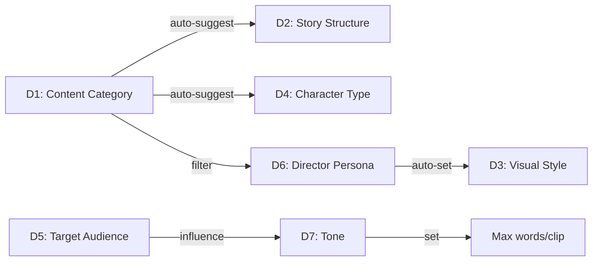
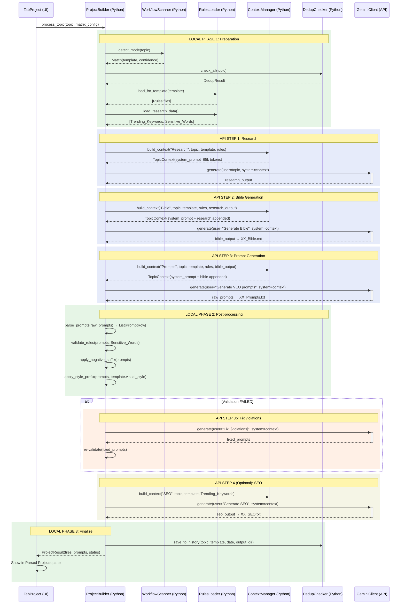
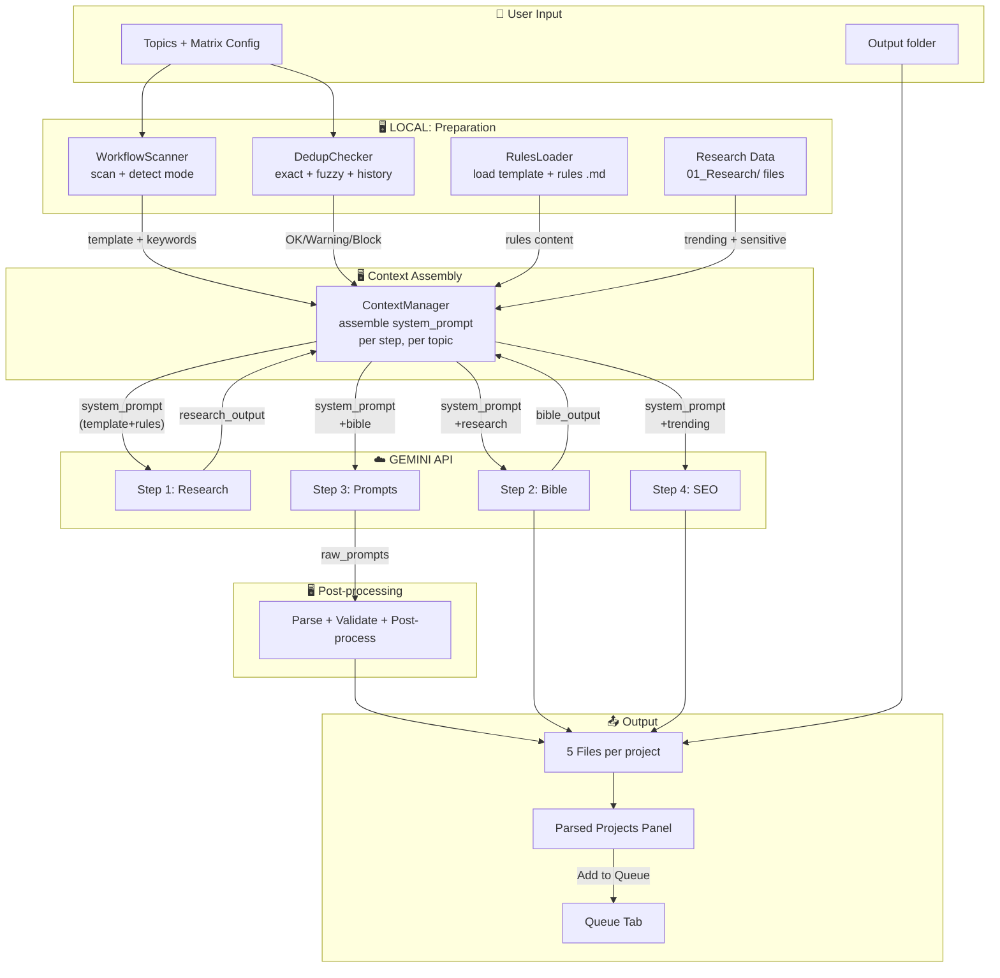

# Project Builder Full Redesign — Implementation Plan v5

> **Nguồn**: [gemini_api_plan.md](file:///D:/Music/Ruby/Produce%20for%20Customer/%23%23Tools/VEO%20Tool/%23NEW%20VEO%20API/00%20-%20Documentation/gemini_api_plan.md) + [00_System/](file:///D:/Music/Ruby/Produce%20for%20Customer/Research/My%20Content/00_System)

---

## Scope

> [!IMPORTANT]
> **SKIP**: Image/Video generation trong tab này.
> **FOCUS**: AI + Python workflow/logic/rule → sinh data 5 files.

---

## 📐 Layout

### Overall: Splitter (Left: Logic Setup | Right: Workspace)

```
┌──────────────────────────────────────────┬─────────────────────────────────────────────────┐
│  LOGIC SETUP (ScrollArea, ~280px wide)   │  WORKSPACE                                      │
│                                          │                                                  │
│  ── 🎯 CONTENT ─────────────────────     │  📝 Topics (1 per line)                         │
│                                          │  ┌──────────────────────────────────────────┐    │
│  Category (multi, max 2):                │  │ Tác hại ăn mì tôm                        │    │
│  [🏥][🎬][👨‍👩‍👧][👗][💡][🦊]              │  │ 10 loại trái cây tốt cho sức khỏe        │    │
│  [📜][🔬][🏗️][🎮][🐱][✏️]              │  └──────────────────────────────────────────┘    │
│                                          │  Auto-detect: [🏥 Health 92%] [PMCS 85%]        │
│  Structure (auto từ Category):           │                                                  │
│  [PMCS] [3-Act] [Tips] [Silent] [POV]    │  [🚀 Generate] [📋 Import] ☑ Auto-add to Queue │
│  [Custom]                                │                                                  │
│                                          │  ════════════════════════════════════════════    │
│  Style (auto từ Persona):                │                                                  │
│  [3D Pixar] [Realistic] [Anime]          │  📊 PARSED PROJECTS                              │
│  [Disney3D] [Sketch]                     │  ┌─────────────────────────────────────────────┐ │
│  [Documentary] [Minecraft]               │  │ 01. Tác hại mì tôm │Bi│Ma│Pr│Du│SE│ [✅ Q] │ │
│  [PhotoReal] [Miniature] [Scientific]    │  │ 02. Trái cây...     │Bi│Ma│Pr│Du│SE│ [❌  ] │ │
│                                          │  │ 03. Tiết kiệm...    │Bi│Ma│Pr│Du│SE│ [⏳  ] │ │
│  Character (auto từ Category):           │  ├─────────────────────────────────────────────┤ │
│  [Nhân hóa] [Người] [Động vật]           │  │ 👁️ FILE VIEWER                              │ │
│  [Đồ chơi] [Kết hợp]                    │  │                                              │ │
│                                          │  │ (adapts to selected file type)               │ │
│  Audience:                               │  │                                              │ │
│  [Kids] [Teens] [Adults] [Family]        │  └─────────────────────────────────────────────┘ │
│                                          │                                                  │
│  Persona:                                │  [📤 Add Selected] [📤 Add All] 2/3 queued      │
│  [▾ Dropdown ─── 13 options ──────]      │                                                  │
│                                          │                                                  │
│  Tone (auto từ Audience):                │                                                  │
│  [Vui] [Nghiêm] [Drama] [Ấm] [Villain]  │                                                  │
│                                          │                                                  │
│  Voice Region (multi):                   │                                                  │
│  [Bắc] [Nam] [Tây] [Trung]              │                                                  │
│                                          │                                                  │
│  ── ⚙️ PRODUCTION ──────────────────     │                                                  │
│                                          │                                                  │
│  📂 Output: [Browse...        ]          │                                                  │
│     ~/VEO_Projects/01_Tac_hai_mi/        │                                                  │
│                                          │                                                  │
│  🖼️ Image:                               │                                                  │
│  Model:  [▾ GEM_PIX_2        ]           │                                                  │
│  Aspect: [▾ LANDSCAPE        ]           │                                                  │
│  Count:  [▲ 10 ▼]                        │                                                  │
│                                          │                                                  │
│  🎬 Video:                               │                                                  │
│  Model:  [▾ veo_3_1_t2v_fast ]           │                                                  │
│  Quality:[▾ 1080p             ]           │                                                  │
│  Aspect: [▾ LANDSCAPE        ]           │                                                  │
│  Count:  [▲ 8  ▼]                        │                                                  │
│                                          │                                                  │
└──────────────────────────────────────────┴─────────────────────────────────────────────────┘
```

### Logic Setup Panel — Behavior

| Row | Widget | Behavior |
|-----|--------|----------|
| Category | 12 toggle buttons (2 rows × 6) | Multi-select max 2. Selected = highlighted. Triggers R1-R4, R7 |
| Structure | 6 toggle buttons | Single-select. **Auto-suggested** khi Category thay đổi (user vẫn có thể override) |
| Style | 10 toggle buttons (flow wrap) | Single-select. **Auto-set** khi Persona thay đổi (R5) |
| Character | 5 toggle buttons | Single-select. **Auto-suggested** khi Category thay đổi |
| Audience | 4 toggle buttons | Single-select. Triggers R6 → Tone |
| Persona | Dropdown (13 items) | Single-select. Triggers R5 → Style |
| Tone | 5 toggle buttons | Single-select. **Auto-suggested** khi Audience thay đổi |
| Voice | 4 toggle buttons | Multi-select. Cho phép chọn nhiều vùng giọng |

### Toggle Button Interaction

```
Trạng thái:   [Default]  ──click──▶  [Selected ✓]  ──click──▶  [Default]

Style:        ┌──────────┐           ┌──────────────┐
              │  Label   │           │  Label  ✓    │
              │ border   │           │ bg=BLUE      │
              └──────────┘           └──────────────┘

Auto-suggest: Khi dimension trigger thay đổi:
              1. Button cũ: unselect (bỏ highlight)
              2. Button mới: select + flash animation 0.3s
              3. User CÓ THỂ override → tắt auto-suggest cho lần này
```

---

## 📊 Parsed Projects — File Viewer Chi tiết

### File Tabs (ngang hàng với tên dự án)

Mỗi dự án: `[#] [Tên topic] │Bible│Master│Prompts│Dubbing│SEO│ [Queue status]`

Click vào file tab nào → phần viewer bên dưới hiển thị nội dung tương ứng.

### Adaptive File Viewer (thay đổi theo loại file)

| File | Viewer Type | Mô tả |
|------|-------------|--------|
| **Bible** (`.md`) | Markdown Viewer | Hiển thị formatted markdown (characters, settings, story structure). Có nút ✏️ Edit → editor markdown + Save |
| **Master** (`.txt`) | **Prompt Table** | Hiển thị dạng bảng giống T2V/I2V tab — mỗi row = 1 scene prompt + image slots. **Đảm bảo cấu trúc khớp `PromptRow` của `generation_tab_base.py`** |
| **Prompts** (`.txt`) | **Prompt Table** | Tương tự Master nhưng chỉ visual prompts (no dialogue). Mỗi row = 1 hình ảnh prompt. Có image slot cho Imagen |
| **Dubbing** (`.txt`) | Text Viewer | Hiển thị script lồng tiếng (voice metadata + dialogue). Có ✏️ Edit + Save |
| **SEO** (`.txt`) | Structured Viewer | Title, Description, Hashtags trong các field riêng. Có ✏️ Edit + Save |

### Prompt Table View (cho Master/Prompts)

> **Quan trọng**: Phải mirror cấu trúc `PromptTable` từ `generation_tab_base.py` để Add to Queue hoạt động chính xác.

```
┌───┬──────────────────────────────────────────┬──────────┬────────┐
│ # │ Prompt                                   │ Image    │ Status │
├───┼──────────────────────────────────────────┼──────────┼────────┤
│ 1 │ The 3D cute animation style, Pixar...    │ [🖼️ ▾]  │ ✅     │
│ 2 │ Camera slowly pans across...             │ [🖼️ ▾]  │ ✅     │
│ 3 │ Close-up shot of...                      │ [🖼️ ▾]  │ ⚠️     │
└───┴──────────────────────────────────────────┴──────────┴────────┘
```

**Cấu trúc dữ liệu** (khớp `generation_tab_base.py` L532-575):
```python
# Khi Add to Queue, gọi:
controller.add_t2v_batch(prompts, settings)
# prompts: List[PromptRow] — từ prompt_table.get_prompts()
# settings: Dict — từ sidebar.get_values() (aspect_ratio, model, etc.)
```

---

## Queue Flow

```
☑ Auto-add = CHECKED:
  Generate → Files saved → Parse prompts → Auto add_t2v_batch() → [✅ Queued]

☐ Auto-add = UNCHECKED:
  Generate → Files saved → [❌ Not queued]
  User clicks file tabs → reviews/edits → Click [📤 Add to Queue]
  → Parse prompts from files → add_t2v_batch() → [✅ Queued]
```

### Queue Status per Project

| Status | Badge | Meaning |
|--------|-------|---------|
| `generating` | ⏳ | Đang sinh files |
| `ready` | ❌ Not queued | Files xong, chưa add |
| `queued` | ✅ Queued | Đã add sang Queue tab |
| `error` | ⚠️ Error | Sinh file thất bại |

---

## 🎯 8 Content Dimensions — Chi tiết

### Tổng quan

| # | Dimension | Widget | Select | Options |
|---|-----------|--------|--------|---------|
| D1 | Content Category | Toggle buttons | Multi (max 2) | 12 |
| D2 | Story Structure | Toggle buttons | Single (auto-suggest từ D1) | 6 |
| D3 | Visual Style | Toggle buttons | Single (auto-set từ D6) | 10 |
| D4 | Character Type | Toggle buttons | Single (auto-suggest từ D1) | 5 |
| D5 | Target Audience | Toggle buttons | Single | 4 |
| D6 | Director Persona | Dropdown | Single | 13 |
| D7 | Tone | Toggle buttons | Single (influence từ D5) | 5 |
| D8 | Voice Region | Toggle buttons | Multi | 4 |

---

### D1: Content Category (12 options)

Từ `Templates/` và `04_Director_Personas.md`:

| ID | Label | Icon | File nguồn |
|----|-------|------|-----------|
| `health` | Health / Sức khỏe | 🏥 | `Templates/Health_PMCS.md` |
| `entertainment` | Entertainment | 🎬 | `Templates/Entertainment_3Act.md` |
| `family` | Family Drama | 👨‍👩‍👧 | `Templates/Family_Drama.md` |
| `fashion` | Fashion / Thời trang | 👗 | `Templates/Fashion_Review_Silent.md` |
| `tips` | Mẹo vặt / Tips | 💡 | `Templates/Social_Tips_Sister.md` |
| `anthropomorphic` | Nhân hóa / Vạn vật | 🦊 | `Templates/Anthropomorphic_Tips.md` |
| `history` | Lịch sử | 📜 | Director Personas 1-2 |
| `science` | Khoa học | 🔬 | Director Persona 4 (BioAnimator) |
| `diy` | DIY / Mô hình | 🏗️ | Director Persona 3 (Microset) |
| `gaming` | Gaming / Minecraft | 🎮 | Director Persona E (Blocky-Verse) |
| `animal` | Động vật | 🐱 | Director Persona G (Realistic Cat) |
| `custom` | Custom | ✏️ | User tự nhập |

**Multi-select (max 2)**: Primary + Secondary → Hybrid mode (`_Hybrid_Guide.md`).

---

### D2: Story Structure (6 options)

Từ `00_Core_Principles.md` và Templates:

| ID | Label | Scenes | Auto khi D1= |
|----|-------|--------|-------------|
| `pmcs` | PMCS (Problem→Mechanism→Consequence→Solution) | 7-9 | `health` |
| `3act` | 3-Act (Setup→Confrontation→Resolution) | 8-12 | `entertainment` |
| `conflict_tips` | Conflict→Tips→Success | 6-8 | `family`, `tips` |
| `silent_review` | Silent Review (no dialogue) | 5-8 | `fashion` |
| `pov_styling` | POV Multi-Outfit | 4-6 | `fashion` (POV variant) |
| `custom` | Custom | User | `custom` |

---

### D3: Visual Style (10 options)

Từ `04_Director_Personas.md` prompt styles:

| ID | Label | Prompt Prefix | Auto khi D6= |
|----|-------|---------------|-------------|
| `3d_pixar` | 3D Pixar Animation | `The 3D cute animation style, Pixar render` | `anthropomorphic_st` |
| `realistic` | Realistic / Cinematic | `Cinematic realistic, film grain, ARRI Alexa` | `chronicle` |
| `anime` | Anime / Chữa lành | `Soft anime, pastel colors, light bloom` | `anime_ai` |
| `disney_3d` | Disney 3D Magical | `Disney Pixar 3D, vibrant colors, magical particles` | `disney` |
| `sketch` | Sketch / Line Art | `Hand-drawn sketch, black ink on white` | `survival_sketch` |
| `documentary` | Documentary Historical | `Documentary, desaturated, film grain` | `mythos` |
| `minecraft` | Blocky / Voxel | `Voxel 3D, 16-bit texture, game lighting` | `blocky` |
| `photorealistic` | Photorealistic CGI | `Hyperrealistic CGI, soft lighting, shallow DOF` | `cat_story`, `paleodoc` |
| `miniature` | Miniature / Tilt-shift | `Tilt-shift miniature, dramatic lighting` | `toy_soldier`, `microset` |
| `scientific` | Scientific 3D | `Scientific 3D visualization, bioluminescent` | `bioanimator` |

---

### D4: Character Type (5 options)

Từ `00_Core_Principles.md` và `Global_Bible_Library.md`:

| ID | Label | Template | Auto khi D1= |
|----|-------|----------|-------------|
| `anthropomorphic` | Nhân hóa (Vạn vật) | `An anthropomorphic [color] [shape]...` | `anthropomorphic`, `health` |
| `human` | Con người | `A [age] Asian [gender], [age]s...` | `entertainment`, `family` |
| `animal` | Động vật nhân hóa | `A [animal], wearing [outfit]...` | `animal` |
| `toy` | Đồ chơi / Mô hình | `Plastic [toy type], classic toy poses...` | `diy` |
| `mixed` | Kết hợp | Anthropomorphic + Human + Expert | `health` (nhân hóa nội tạng + bác sĩ) |

---

### D5: Target Audience (4 options)

| ID | Label | Ảnh hưởng D7 |
|----|-------|-------------|
| `kids` | Kids (6-12) | → `fun` |
| `teens` | Teens (13-18) | → `fun` hoặc `dramatic` |
| `adults` | Adults (18+) | → `serious` hoặc `dramatic` |
| `family` | Family (mọi lứa tuổi) | → `warm` |

---

### D6: Director Persona (13 options — Dropdown)

Từ `04_Director_Personas.md`:

| ID | Label | Visual Style | Use case |
|----|-------|-------------|----------|
| `mythos` | Mythos Chronicle | Documentary | Documentary lịch sử |
| `chronicle` | Chronicle Weaver | Realistic | Kể chuyện lịch sử |
| `microset` | Microset Construction | Miniature | DIY, hobbyist |
| `bioanimator` | BioAnimator 3D | Scientific | Giáo dục khoa học |
| `survival_sketch` | Survival Sketch Lab | Sketch | Explainer |
| `anthropomorphic_st` | Anthropomorphic Storyteller | 3D Pixar | Phim hoạt hình |
| `toy_soldier` | Toy Soldier War | Miniature | Action mô hình |
| `anime_ai` | Anime AI | Anime | Chữa lành |
| `disney` | Disney Dreamweaver | Disney 3D | Fantasy, magical |
| `blocky` | Blocky-Verse | Minecraft | Gaming |
| `paleodoc` | Paleodoc 3D | Photorealistic | Khủng long |
| `cat_story` | Realistic Cat | Photorealistic | Mèo |
| `none` | No Persona | — | Manual prompt |

---

### D7: Tone (5 options)

Từ `00_Core_Principles.md` Section 7:

| ID | Label | Word Speed | Max words/clip |
|----|-------|-----------|---------------|
| `fun` | Vui nhộn / Hài hước | 4 từ/s | 32 |
| `serious` | Nghiêm túc / Giáo dục | 2.5 từ/s | 20 |
| `dramatic` | Kịch tính / Drama | 3 từ/s | 24 |
| `warm` | Ấm áp / Chữa lành | 3 từ/s | 24 |
| `villain` | Villain / Đắc thắng | 3 từ/s | 24 |

---

### D8: Voice Region (4 options — Multi-select)

Từ `00_Core_Principles.md` Section 7:

| ID | Label | Đặc điểm | Dùng cho |
|----|-------|-----------|----------|
| `mien_bac` | Miền Bắc | Chuẩn, formal | Narrator, Expert |
| `mien_nam` | Miền Nam | Thân thiện | Villain, thường |
| `mien_tay` | Miền Tây | Ấm áp, chân chất | Victim, nội tạng |
| `mien_trung` | Miền Trung | Đặc trưng | Đặc biệt |

---

### Inter-dimension Logic (6 rules)



| # | Trigger | → Action | Example |
|---|---------|----------|---------|
| R1 | D1=`health` | D2→`pmcs`, D4→`mixed` | Health → PMCS + nhân hóa nội tạng + bác sĩ |
| R2 | D1=`entertainment` | D2→`3act` | Entertainment → 3-Act |
| R3 | D1=`family` | D2→`conflict_tips`, D3→`realistic` | Family → Conflict→Tips |
| R4 | D1=`fashion` | D2→`silent_review`, E19 relaxed | Fashion → Silent (no dialogue) |
| R5 | D6 selected | D3→ matching visual style (bảng D3 cột "Auto khi D6=") | Anime AI → Soft anime |
| R6 | D5=`kids` | D7→`fun`, strict E10/E11 | Kids → Vui nhộn |
| R7 | D1 (2 selected) | Hybrid mode (`_Hybrid_Guide.md`) | Health + Entertainment → Mix PMCS + Drama |

---

## ⚙️ Production Settings

> Verified từ [sidebar_base.py](file:///D:/Music/Ruby/Produce%20for%20Customer/%23%23Tools/VEO%20Tool/%23NEW%20VEO%20API/02%20-%20CLIENT%20-%20VEO%20PRO%20MAX/ui/components/sidebar_base.py)

### Image

| Setting | Widget | Display → API Value | Source |
|---------|--------|---------------------|--------|
| Image Model | Dropdown | `🔥 Nano Banana Pro` → `GEM_PIX_2` | `sidebar_base.py` L480 |
| | | `🔥 Nano Banana 2` → `NARWHAL` | L481 |
| | | `Imagen 4` → `IMAGEN_3_5` | L483 |
| Aspect Ratio | Dropdown | `16:9 (Landscape)` → `LANDSCAPE` | L390-393 |
| | | `9:16 (Portrait)` → `PORTRAIT` | |
| Quality | Dropdown | `1k`, `2k`, `4k` | L450 |
| Outputs/prompt | Dropdown | `1 image` – `4 images` (default: 4) | L419 |
| Images/project | SpinBox | Default: 10 | — |

### Video

| Setting | Widget | Display Value | Source |
|---------|--------|--------------|--------|
| Video Model | Dropdown | `Veo 3.1 - Fast` | `sidebar_base.py` L261-267 |
| | | `Veo 3.1 - Fast [LP]` | |
| | | `Veo 3.1 - Quality` | |
| | | `Veo 2 - Fast` | |
| | | `Veo 2 - Quality` | |
| Quality | Dropdown | `720p`, `1080p`, `4K` | L280 |
| Aspect Ratio | Dropdown | `16:9 (Landscape)` → `VIDEO_ASPECT_RATIO_LANDSCAPE` | L113, `group_renderer.py` L671 |
| | | `9:16 (Portrait)` → `VIDEO_ASPECT_RATIO_PORTRAIT` | |
| Outputs/prompt | Dropdown | `1 video` – `4 videos` (default: 4) | L251 |
| Videos/project | SpinBox | Default: 8 | — |
| Duration | — | `8` giây (cố định) | `dispatcher.py` L123 |

### Output

| Setting | Widget |
|---------|--------|
| Output Folder | Browse |
| Auto subfolder | `{XX}_{Topic_Name}/` |

---

## 🔄 Backend Orchestration — Python ↔ Gemini API

> Trích từ [gemini_api_plan.md L573-660](file:///D:/Music/Ruby/Produce%20for%20Customer/%23%23Tools/VEO%20Tool/%23NEW%20VEO%20API/00%20-%20Documentation/gemini_api_plan.md#L573-L660)

### Sequence Diagram: Single Topic Processing



### Flowchart: Data Flow Between Components

> Trích từ [gemini_api_plan.md L662-730](file:///D:/Music/Ruby/Produce%20for%20Customer/%23%23Tools/VEO%20Tool/%23NEW%20VEO%20API/00%20-%20Documentation/gemini_api_plan.md#L662-L730)



### Local Code vs Gemini API Boundary

> Trích từ [gemini_api_plan.md L785-829](file:///D:/Music/Ruby/Produce%20for%20Customer/%23%23Tools/VEO%20Tool/%23NEW%20VEO%20API/00%20-%20Documentation/gemini_api_plan.md#L785-L829)

| # | Step | Local / API | Can skip API? |
|---|------|------------|---------------|
| 1 | Template Scan | 🖥️ Local | — |
| 2 | Auto-detect Mode | 🖥️ Local | — |
| 3 | Load Rules | 🖥️ Local | — |
| 4 | Load Research Data | 🖥️ Local | — |
| 5 | Dedup Check | 🖥️ Local | — |
| 6 | **Research** | ☁️ API | ✅ Manual paste |
| 7 | **Bible Gen** | ☁️ API | ✅ Manual write |
| 8 | **Prompt Gen** | ☁️ API | ✅ Manual import |
| 9 | Parse Prompts | 🖥️ Local | — |
| 10 | Validate | 🖥️ Local | — |
| 11 | Post-process | 🖥️ Local | — |
| 12 | SEO Gen | ☁️ API *(opt)* | ✅ Manual write |
| 13 | Add to Queue | 🖥️ Local | — |
---

### Gemini API — Năng lực & Giới hạn

> Trích từ [Gemini Ultra API: Mô hình và giới hạn.docx](file:///D:/Music/Ruby/Produce%20for%20Customer/%23%23Tools/VEO%20Tool/%23NEW%20VEO%20API/00%20-%20Documentation/Gemini%20Ultra%20API_%20M%C3%B4%20h%C3%ACnh%20v%C3%A0%20gi%E1%BB%9Bi%20h%E1%BA%A1n.docx)

#### Models khả dụng

| Model | ID | Input | Output | Giá (≤200K) | Giá (>200K) | Use case |
|-------|---|-------|--------|-------------|-------------|----------|
| **3.1 Pro** | `gemini-3.1-pro-preview` | 1,048,576 | 65,536 | $2/1M in, $12/1M out | $4/1M in, $18/1M out | Complex reasoning, Bible gen |
| **3.1 Flash** | `gemini-3.1-flash-preview` | 1,048,576 | 65,536 | Rẻ hơn Pro | — | High-volume, Research |
| **3.1 Flash-Lite** | — | 1,048,576 | 65,536 | Rẻ nhất | — | Micro tasks, validation |

#### Tier 1 Rate Limits (Ultra $100/mo credits)

| Metric | Tier 1 | Free Tier |
|--------|--------|-----------|
| **RPM** (Requests/min) | 150–300 | 5–15 |
| **TPM** (Tokens/min) | 1,000,000 | 250,000 |
| **RPD** (Requests/day) | Unlimited* | 20–100 |

> [!WARNING]
> *RPD "unlimited" nhưng thực tế có soft caps 250–1500 khi hệ thống quá tải. Cần implement **exponential backoff**.

#### Output Token Limit

| Config | Giá trị |
|--------|---------|
| Default (an toàn) | **8,192** tokens |
| Max configurable | **65,536** tokens (~49,000 từ) |
| Cần set explicitly | `maxOutputTokens` trong request payload |

> [!IMPORTANT]
> Mỗi API step trong pipeline cần set `maxOutputTokens=8192` (Phase 6 config từ `gemini_api_plan.md` L433). Bible và Prompts output dài → cân nhắc tăng lên 16384–32768.

---

### Model Selection Strategy — Per Step

| Step | Model đề xuất | Lý do | `maxOutputTokens` |
|------|--------------|-------|--------------------|
| **Research** | `gemini-3.1-flash-preview` | Tốc độ nhanh, output ngắn | 4096 |
| **Bible** | `gemini-3.1-pro-preview` | Cần reasoning sâu, nhân vật phức tạp | 16384 |
| **Prompts** | `gemini-3.1-pro-preview` | Tuân thủ rules chính xác, format chuẩn | 16384 |
| **Fix violations** | `gemini-3.1-flash-preview` | Fix nhanh, ít token | 4096 |
| **SEO** | `gemini-3.1-flash-lite` | Task đơn giản, tiết kiệm | 2048 |

#### Chi phí ước tính per project (10 topics)

```
System prompt (template + rules): ~65K tokens × 10 topics = 650K input tokens
Research output:  ~2K × 10 = 20K
Bible output:     ~5K × 10 = 50K  
Prompts output:   ~8K × 10 = 80K
SEO output:       ~1K × 10 = 10K

Input total:  ~650K tokens → $1.30 (Flash) hoặc $1.30 (Pro ≤200K)
Output total: ~160K tokens → $1.92 (Pro) hoặc rẻ hơn (Flash)
TOTAL per batch (10 topics): ~$3-5 (tùy model mix)
BUDGET $100/mo: ~20-33 batches = 200-330 topics/tháng
```

---

### Context Caching — Tối ưu chi phí

> Trích từ Gemini Ultra API doc

Template + Rules (~65K tokens) **giống nhau** cho mọi topic cùng template → dùng Context Caching:

| Loại | Giá | So với Input thường |
|------|-----|---------------------|
| Cached input (≤200K) | $0.20/1M | **90% rẻ hơn** ($2.00/1M) |
| Cached input (>200K) | $0.40/1M | **90% rẻ hơn** ($4.00/1M) |
| Storage fee | $4.50/1M/hour | Phí lưu trữ cache|

```
VỚI Context Caching (batch 10 topics cùng template):
  Cache: 65K tokens × 1 lần = $0.13
  10 calls chỉ trả cached: 65K × 10 × $0.20/1M = $0.13
  TỔNG input: $0.26 thay vì $1.30 → TIẾT KIỆM 80%
```

**Python implementation**: `ContextManager.get_or_create_cache(template_id, rules_content)` → reuse across topics.

---

### Step-by-Step Python ↔ API Logic

#### Step 1: Research

```python
# Python (LOCAL): Quyết định input
context = ContextManager.build("Research", template, rules)
user_msg = f"Research topic: {topic}"

# API CALL
response = await gemini.generate(
    user=user_msg, 
    system=context.system_prompt,  # ~65K tokens
    max_tokens=4096,
    model="gemini-3.1-flash-preview"  # Nhanh, rẻ
)

# Python (LOCAL): Xử lý output
research = response.text
# Lưu tạm, không write file (internal use only)
```

#### Step 2: Bible Generation

```python
# Python (LOCAL): Assemble context — APPEND research output
context = ContextManager.build("Bible", template, rules, 
                                previous_outputs={"research": research})

# API CALL
response = await gemini.generate(
    user="Generate Character Bible and Story Structure",
    system=context.system_prompt,  # ~65K + research
    max_tokens=16384,              # Bible dài
    model="gemini-3.1-pro-preview" # Cần reasoning sâu
)

# Python (LOCAL): Parse + Write file
bible = response.text
write_file(f"{output_dir}/{XX}_Bible.md", bible)
```

#### Step 3: Prompt Generation

```python
# Python (LOCAL): Assemble context — APPEND bible
context = ContextManager.build("Prompts", template, rules,
                                previous_outputs={"bible": bible})

# API CALL
response = await gemini.generate(
    user="Generate VEO video prompts following format rules",
    system=context.system_prompt,  # ~65K + bible
    max_tokens=16384,
    model="gemini-3.1-pro-preview"
)

# Python (LOCAL): Parse + Validate + Post-process
raw_prompts = response.text
prompts = parse_prompts(raw_prompts)          # → List[PromptRow]
violations = validate_rules(prompts, rules)   # E-rules check

if violations:
    # API CALL (Step 3b): Fix
    fix_response = await gemini.generate(
        user=f"Fix violations: {violations}",
        system=context.system_prompt,
        max_tokens=4096,
        model="gemini-3.1-flash-preview"  # Nhanh
    )
    prompts = parse_prompts(fix_response.text)
    re_validate(prompts)  # 2nd check

# Python (LOCAL): Apply prefix/suffix
for p in prompts:
    p.text = f"{template.visual_prefix}, {p.text}"  # Style prefix
    p.text += f" {template.negative_suffix}"         # Negative suffix

write_file(f"{output_dir}/{XX}_Prompts.txt", format_prompts(prompts))
write_file(f"{output_dir}/{XX}_Master.txt", format_master(prompts, bible))
write_file(f"{output_dir}/{XX}_Dubbing.txt", format_dubbing(prompts, bible))
```

#### Step 4: SEO (Optional)

```python
# Python (LOCAL): Context với trending keywords
context = ContextManager.build("SEO", template, 
                                research_data=trending_keywords)

# API CALL
response = await gemini.generate(
    user=f"Generate SEO for: {topic}",
    system=context.system_prompt,
    max_tokens=2048,
    model="gemini-3.1-flash-lite"  # Rẻ nhất
)

# Python (LOCAL): Parse structured output
seo = parse_seo(response.text)  # {title, description, tags[]}
write_file(f"{output_dir}/{XX}_SEO.txt", format_seo(seo))
```

### Error Handling & Rate Limiting

```python
# Exponential backoff cho API calls
async def safe_generate(gemini, **kwargs):
    for attempt in range(3):
        try:
            return await gemini.generate(**kwargs)
        except RateLimitError:        # 429
            wait = 2 ** attempt       # 1s, 2s, 4s
            await asyncio.sleep(wait)
        except InvalidKeyError:       # 401/403
            rotate_key()              # GeminiKeyManager
            continue
    raise APIExhaustedError()
```

### Batch Orchestration — Sequential Topics

> Trích từ [gemini_api_plan.md L732-774](file:///D:/Music/Ruby/Produce%20for%20Customer/%23%23Tools/VEO%20Tool/%23NEW%20VEO%20API/00%20-%20Documentation/gemini_api_plan.md#L732-L774)

```
Topic 1: BUILD context → API(R→B→P→SEO) → Parse → DISCARD context ✅
Topic 2: BUILD context → API(R→B→P→SEO) → Parse → DISCARD context ✅
Topic 3: BUILD context → API(R→B→P→SEO) → Parse → DISCARD context ✅
...
```

> [!IMPORTANT]
> **Python giữ quyền kiểm soát TOÀN BỘ flow**. Gemini API chỉ là "data supplier":
> 1. **Input gì** — system prompt assembled từ template + rules (local)
> 2. **Output xử lý thế nào** — parse, validate, post-process (local)
> 3. **Có gọi tiếp không** — validation fail → gọi fix; OK → next step
> 4. **Khi nào dừng** — quota hết, error liên tiếp, user cancel

### Project Deduplication — 3 Layers

| Layer | Scope | Method | Result |
|-------|-------|--------|--------|
| **Exact** | Current batch | Normalize + compare | 🚫 BLOCK |
| **Fuzzy** | Current batch | Jaccard ≥85% | ⚠️ WARNING |
| **History** | Cross-session | `project_history.json` + Jaccard ≥80% | ⚠️ WARNING |

### Semi-Manual Mode (No API)

Fallback khi API quota hết hoặc user muốn tự cung cấp prompts:

```
1. Select template ─────── LOCAL
2. Enter topics ─────────── LOCAL
3. Dedup check ──────────── LOCAL
4. Paste/import prompts ─── USER INPUT
5. Parse → table ────────── LOCAL
6. Validate rules ─────────  LOCAL
7. Post-process ─────────── LOCAL
8. Add to Queue ─────────── LOCAL
```

---

### [MODIFY] [tab_project.py](file:///D:/Music/Ruby/Produce%20for%20Customer/%23%23Tools/VEO%20Tool/%23NEW%20VEO%20API/02%20-%20CLIENT%20-%20VEO%20PRO%20MAX/ui/tabs/tab_project.py)

- Xóa `_create_sidebar()` → `SetupMatrixPanel`
- Xóa flat Prompts Table → `ParsedProjectsPanel`
- Add to Queue gọi `controller.add_t2v_batch(prompts, settings)`

### [NEW] [setup_matrix.py](file:///D:/Music/Ruby/Produce%20for%20Customer/%23%23Tools/VEO%20Tool/%23NEW%20VEO%20API/02%20-%20CLIENT%20-%20VEO%20PRO%20MAX/ui/tabs/project_components/setup_matrix.py)

D1-D8 + Production Settings

### [NEW] [parsed_projects.py](file:///D:/Music/Ruby/Produce%20for%20Customer/%23%23Tools/VEO%20Tool/%23NEW%20VEO%20API/02%20-%20CLIENT%20-%20VEO%20PRO%20MAX/ui/tabs/project_components/parsed_projects.py)

- Horizontal file tabs per project
- Adaptive viewer (markdown / prompt table / text / structured)
- Queue status badges
- Edit + Save per file

### [REUSE] [PromptTable](file:///D:/Music/Ruby/Produce%20for%20Customer/%23%23Tools/VEO%20Tool/%23NEW%20VEO%20API/02%20-%20CLIENT%20-%20VEO%20PRO%20MAX/ui/components/prompt_table.py)

Reuse `PromptTable` widget từ `generation_tab_base.py` cho Prompt/Master viewer → đảm bảo `get_prompts()` output khớp queue intake.

### [MODIFY] [project_builder.py](file:///D:/Music/Ruby/Produce%20for%20Customer/%23%23Tools/VEO%20Tool/%23NEW%20VEO%20API/02%20-%20CLIENT%20-%20VEO%20PRO%20MAX/core/project_builder.py)

Nhận `matrix_config`, output `ProjectResult` with files + parsed prompts

---

## Phased Implementation

| Phase | Nội dung |
|-------|----------|
| **1** | `SetupMatrixPanel` |
| **2** | `ParsedProjectsPanel` (file tabs + adaptive viewer + queue status) |
| **3** | Wire `ProjectBuilder` + Gemini API |
