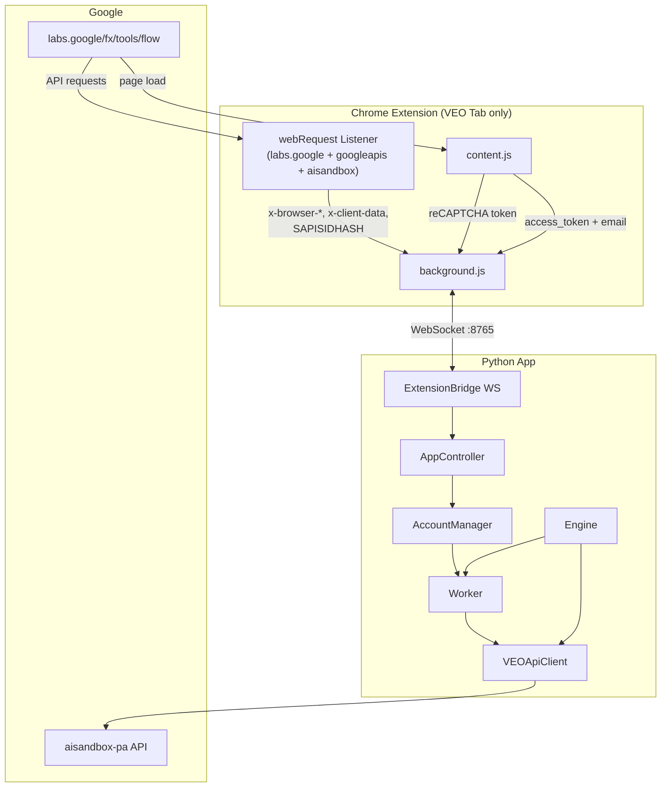

# Extension ↔ App Data Flow Analysis

## Architecture Overview



---

## VEO Tab — Nguồn Dữ Liệu Duy Nhất

> [!IMPORTANT]
> **Chỉ VEO tab (`labs.google/fx/tools/flow`)** cung cấp được TẤT CẢ dữ liệu cần thiết.
> Tab này được auto-open + pin bởi `ensureVeoTab()`, auto-reopen nếu bị đóng.

| Data Type | Capture Method | Code Location |
|-----------|---------------|---------------|
| `x-browser-validation` | `webRequest.onBeforeSendHeaders` | [background.js:224](file:///d:/NEW%20VEO%20PRO%20MAX/veo-pro-max/02%20-%20CLIENT%20-%20VEO%20PRO%20MAX/extension/background.js#L224) |
| `x-browser-channel` | `webRequest.onBeforeSendHeaders` | Same listener |
| `x-browser-copyright` | `webRequest.onBeforeSendHeaders` | Same listener |
| `x-browser-year` | `webRequest.onBeforeSendHeaders` | Same listener |
| `x-client-data` | `webRequest.onBeforeSendHeaders` | Same listener |
| `SAPISIDHASH` | `Authorization` header capture | [background.js:240](file:///d:/NEW%20VEO%20PRO%20MAX/veo-pro-max/02%20-%20CLIENT%20-%20VEO%20PRO%20MAX/extension/background.js#L240) |
| reCAPTCHA Enterprise | `grecaptcha.enterprise.execute(siteKey)` via `chrome.scripting` MAIN world | [background.js:148-198](file:///d:/NEW%20VEO%20PRO%20MAX/veo-pro-max/02%20-%20CLIENT%20-%20VEO%20PRO%20MAX/extension/background.js#L148-L198) |
| reCAPTCHA Readiness | `check_recaptcha_ready` → checks `grecaptcha.enterprise.execute` availability | [background.js:328-385](file:///d:/NEW%20VEO%20PRO%20MAX/veo-pro-max/02%20-%20CLIENT%20-%20VEO%20PRO%20MAX/extension/background.js#L328-L385) |
| Access token (OAuth2) | `__NEXT_DATA__` JSON parse | [content.js:162-186](file:///d:/NEW%20VEO%20PRO%20MAX/veo-pro-max/02%20-%20CLIENT%20-%20VEO%20PRO%20MAX/extension/content.js#L162-L186) |
| Email | `__NEXT_DATA__` JSON parse | [content.js:48-74](file:///d:/NEW%20VEO%20PRO%20MAX/veo-pro-max/02%20-%20CLIENT%20-%20VEO%20PRO%20MAX/extension/content.js#L48-L74) |

---

## Per-Endpoint Audit: Extension Data sử dụng đúng chưa?

### Generation Endpoints (7 endpoints)

Tất cả generation endpoints yêu cầu: **Access Token + reCAPTCHA + x-browser-\* headers**

| # | Endpoint | Caller | `account_headers` | `access_token` | `recaptcha_token` | Status |
|---|----------|--------|:---:|:---:|:---:|:---:|
| 1 | **T2V** `batchAsyncGenerateVideoText` | [worker.py:190](file:///d:/NEW%20VEO%20PRO%20MAX/veo-pro-max/02%20-%20CLIENT%20-%20VEO%20PRO%20MAX/core/worker.py#L190) | ✅ `get_api_headers()` L142 | ✅ `get_access_token()` L110 | ✅ `refresh_recaptcha()` L133 | ✅ OK |
| 2 | **I2V Single** `batchAsyncGenerateVideoStartImage` | [worker.py:204](file:///d:/NEW%20VEO%20PRO%20MAX/veo-pro-max/02%20-%20CLIENT%20-%20VEO%20PRO%20MAX/core/worker.py#L204) | ✅ Same | ✅ Same | ✅ Same | ✅ OK |
| 3 | **I2V Dual (F2V)** `batchAsyncGenerateVideoStartAndEndImage` | [worker.py:220](file:///d:/NEW%20VEO%20PRO%20MAX/veo-pro-max/02%20-%20CLIENT%20-%20VEO%20PRO%20MAX/core/worker.py#L220) | ✅ Same | ✅ Same | ✅ Same | ✅ OK |
| 4 | **R2V** `batchAsyncGenerateVideoReferenceImages` | [worker.py:240](file:///d:/NEW%20VEO%20PRO%20MAX/veo-pro-max/02%20-%20CLIENT%20-%20VEO%20PRO%20MAX/core/worker.py#L240) | ✅ Same | ✅ Same | ✅ Same | ✅ OK |
| 5 | **T2I** `batchGenerateImages` | [worker.py:257](file:///d:/NEW%20VEO%20PRO%20MAX/veo-pro-max/02%20-%20CLIENT%20-%20VEO%20PRO%20MAX/core/worker.py#L257) | ✅ Same | ✅ Same | ✅ Same | ✅ OK |
| 6 | **Upscale Video** `batchAsyncGenerateVideoUpsampleVideo` | [engine.py:1573](file:///d:/NEW%20VEO%20PRO%20MAX/veo-pro-max/02%20-%20CLIENT%20-%20VEO%20PRO%20MAX/core/engine.py#L1573) | ✅ `get_api_headers()` L1580 | ✅ `get_access_token()` L1574 | ✅ Fresh `refresh_recaptcha()` | ✅ OK |
| 7 | **Upscale Image** `upsampleImage` | [api_client.py:783](file:///d:/NEW%20VEO%20PRO%20MAX/veo-pro-max/02%20-%20CLIENT%20-%20VEO%20PRO%20MAX/core/api_client.py#L783) | ⚠️ Defined but **not called in engine** | — | — | ⚠️ Unused |

> [!NOTE]
> **Upscale Image (#7)** được định nghĩa trong `api_client.py` nhưng chưa được gọi trong engine/worker.
> Nếu tương lai cần, endpoint này đã có param `account_headers` sẵn.

### Utility Endpoints (5 endpoints)

| # | Endpoint | Caller | `account_headers` | `access_token` | `recaptcha` | Status |
|---|----------|--------|:---:|:---:|:---:|:---:|
| 8 | **Upload Image** `uploadUserImage` | [engine.py:1441](file:///d:/NEW%20VEO%20PRO%20MAX/veo-pro-max/02%20-%20CLIENT%20-%20VEO%20PRO%20MAX/core/engine.py#L1441) | ✅ `get_api_headers()` L1446 | ✅ `get_access_token()` L1442 | ❌ Không cần (HAR verified) | ✅ OK |
| 9 | **Poll Status** `batchCheckAsyncVideoGenerationStatus` | [engine.py:1032](file:///d:/NEW%20VEO%20PRO%20MAX/veo-pro-max/02%20-%20CLIENT%20-%20VEO%20PRO%20MAX/core/engine.py#L1032) | ✅ `get_api_headers()` L1036 | ✅ `get_access_token()` L1033 | ❌ Không cần | ✅ OK |
| 10 | **Get Credits** `/v1/credits?key=` | [account_manager.py:165](file:///d:/NEW%20VEO%20PRO%20MAX/veo-pro-max/02%20-%20CLIENT%20-%20VEO%20PRO%20MAX/core/account_manager.py#L165) | ✅ `get_api_headers()` L167 | ❌ Không dùng (API key only) | ❌ Không cần | ✅ OK |
| 11 | **Generate GIF** `generatePinholeGif` | [api_client.py:734](file:///d:/NEW%20VEO%20PRO%20MAX/veo-pro-max/02%20-%20CLIENT%20-%20VEO%20PRO%20MAX/core/api_client.py#L734) | ⚠️ Defined but **not called** | — | — | ⚠️ Unused |
| 12 | **App Status** `checkAppAvailability` | [api_client.py:762](file:///d:/NEW%20VEO%20PRO%20MAX/veo-pro-max/02%20-%20CLIENT%20-%20VEO%20PRO%20MAX/core/api_client.py#L762) | ⚠️ Defined but **not called** | — | — | ⚠️ Unused |

### Các call trong Engine khác

| Operation | Code Line | `account_headers` | `access_token` | `recaptcha` | Status |
|-----------|-----------|:---:|:---:|:---:|:---:|
| Frame upload (continuation) | [engine.py:1376](file:///d:/NEW%20VEO%20PRO%20MAX/veo-pro-max/02%20-%20CLIENT%20-%20VEO%20PRO%20MAX/core/engine.py#L1376) | ✅ L1381 | ✅ L1377 | ❌ Không cần | ✅ OK |
| Upscale retry (403 fallback) | [engine.py:1683](file:///d:/NEW%20VEO%20PRO%20MAX/veo-pro-max/02%20-%20CLIENT%20-%20VEO%20PRO%20MAX/core/engine.py#L1683) | ✅ L1690 | ✅ L1684 | ✅ Fresh L1680 | ✅ OK |
| Upscale poll | [engine.py:1762](file:///d:/NEW%20VEO%20PRO%20MAX/veo-pro-max/02%20-%20CLIENT%20-%20VEO%20PRO%20MAX/core/engine.py#L1762) | ✅ L1770 | ✅ L1763 | ❌ Không cần | ✅ OK |
| Re-upscale (UI triggered) | [engine.py:1912](file:///d:/NEW%20VEO%20PRO%20MAX/veo-pro-max/02%20-%20CLIENT%20-%20VEO%20PRO%20MAX/core/engine.py#L1912) | ✅ L1919 | ✅ L1913 | ✅ L1910 | ✅ OK |

---

## Tổng Kết

```
┌─────────────────────────────────────────────────────────────┐
│ 12 endpoints defined in api_client.py                       │
│                                                             │
│  ✅ 9 endpoints có extension data wired đúng                │
│     - 5 Generation (T2V, I2V, F2V, R2V, T2I)               │
│     - 1 Upscale Video                                       │
│     - 1 Upload Image                                        │
│     - 1 Poll Status                                         │
│     - 1 Get Credits                                         │
│                                                             │
│  ⚠️ 3 endpoints CHƯA ĐƯỢC GỌI trong engine/worker          │
│     - Upscale Image (defined, not called)                   │
│     - Generate GIF (defined, not called)                    │
│     - App Status (defined, not called)                      │
│     → Không phải bug — chỉ unused code                      │
│                                                             │
│  Extension pipeline hoạt động đúng:                          │
│     VEO Tab → webRequest → WS → ExtensionBridge             │
│     → AccountManager.get_api_headers() [3-priority chain]   │
│     → api_client._build_headers() → API call                │
│                                                             │
│  reCAPTCHA pipeline:                                         │
│     App → WS request → background.js (MAIN world)           │
│     → grecaptcha.enterprise.execute() → token → WS → App   │
│     → api_client._build_client_context() → body             │
│                                                             │
│  reCAPTCHA 5-Layer Defense [CURRENT]:                        │
│     L1: Readiness Probe (check_recaptcha_ready)             │
│     L2: Smart Cooldown (_wait_for_recaptcha_ready)          │
│     L3: Priority Prefetch (RecaptchaPool.priority_prefetch) │
│     L4: De-escalated Recovery (no tab reload on 1st fail)   │
│     L5: Token Quality Gate (reject < 1000 chars)            │
└─────────────────────────────────────────────────────────────┘
```
