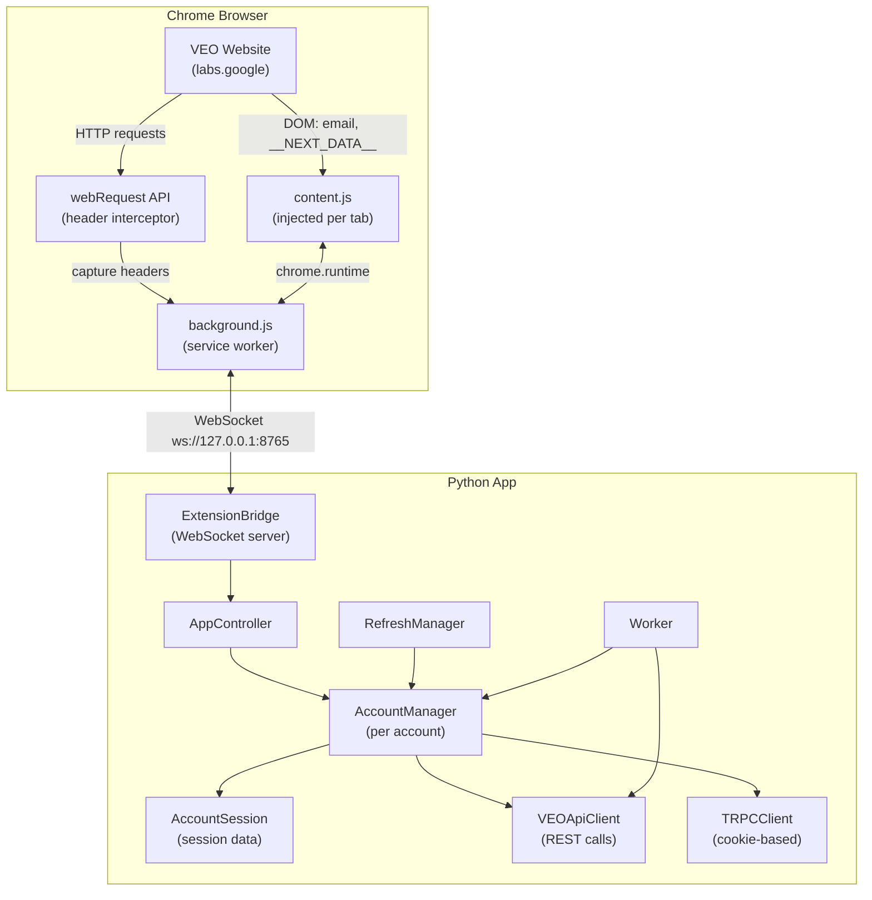
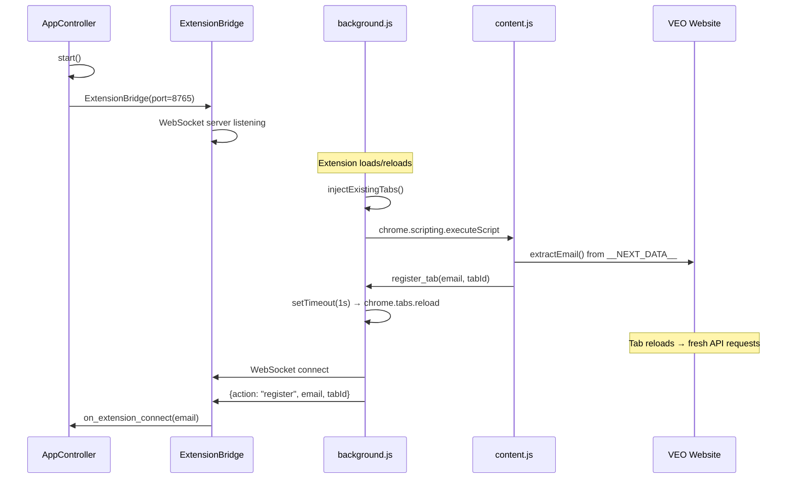
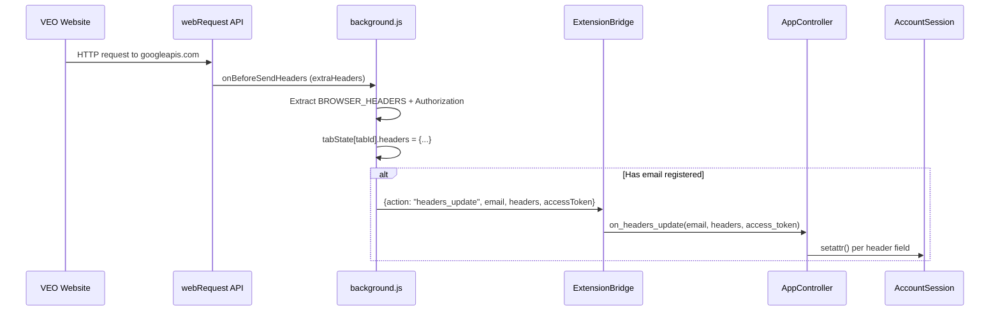
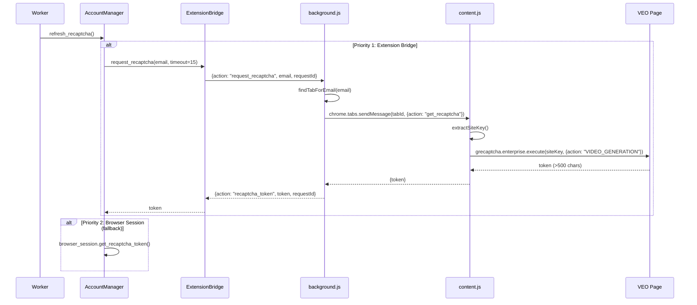
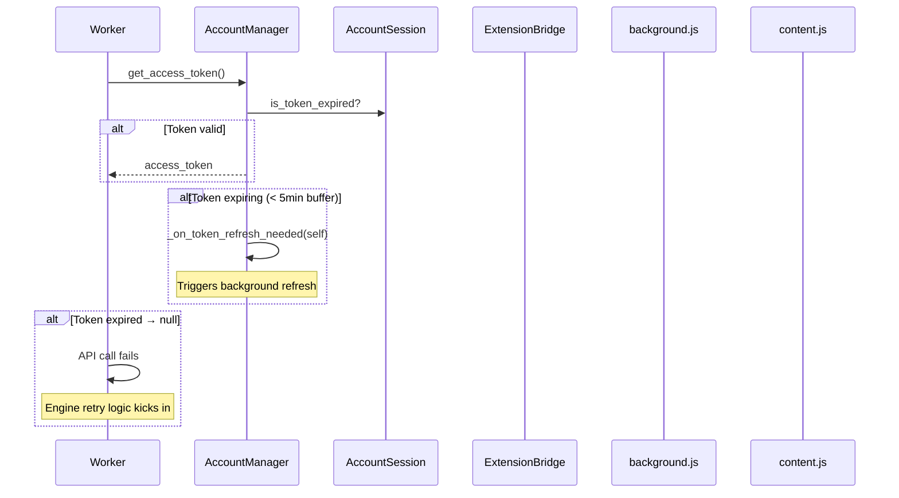
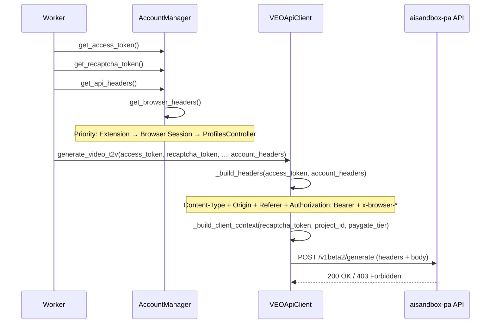
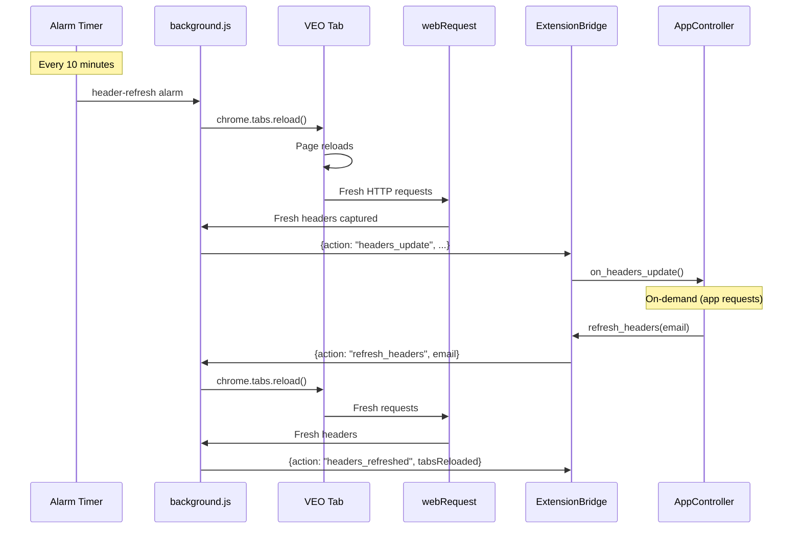

# Extension ↔ Website — Từng Giai Đoạn Thực Tế Trong APP

## Tổng Quan Kiến Trúc



---

## Dữ Liệu Cần Thiết Cho API Calls

| # | Dữ liệu | Nguồn gốc | Vòng đời | Cần mới khi |
|---|---------|-----------|---------|-------------|
| 1 | `x-browser-channel` | Chrome static = `"stable"` | Không đổi | Chrome cập nhật |
| 2 | `x-browser-validation` | Chrome → webRequest | Mỗi session | Browser restart |
| 3 | `x-browser-copyright` | Chrome static | Không đổi | Chrome cập nhật |
| 4 | `x-browser-year` | Chrome static | Không đổi | Chrome cập nhật |
| 5 | `x-client-data` | Chrome Variations Service → webRequest | Mỗi lần Chrome khởi động | Chrome restart, thay đổi Chrome flags |
| 6 | `access_token` | `__NEXT_DATA__` trên VEO page | ~60 phút | Token hết hạn |
| 7 | `reCAPTCHA token` | `grecaptcha.enterprise.execute()` | **Single-use** (~80s max) | **Mỗi API call** |
| 8 | `Authorization` | `Bearer {access_token}` | ~60 phút | Token hết hạn |
| 9 | `Cookies` | Chrome session | Vài giờ–vài ngày | Session hết hạn |
| 10 | `SAPISIDHASH` | Browser tự compute từ SAPISID cookie | Mỗi request | Mỗi request |

---

## Giai Đoạn Chi Tiết

### Giai đoạn 1: Khởi Động App



| Bước | Xử lý | Trạng thái hiện tại | Vấn đề |
|------|--------|---------------------|--------|
| Start WebSocket server | `ExtensionBridge.start()` với threading.Event sync | ✅ OK | — |
| Tìm tab VEO đang mở | `injectExistingTabs()` → query `*://labs.google/*` | ✅ OK | — |
| Inject content.js | `chrome.scripting.executeScript` + double-inject guard | ✅ OK | — |
| Detect email từ page | `extractEmail()` từ `__NEXT_DATA__`/avatar/aria-label | ✅ OK | — |
| Register tab → WebSocket | `register_tab` → `register` action | ✅ OK | — |
| Auto-reload tab | `setTimeout(1s)` → `chrome.tabs.reload()` | ✅ OK | — |

> [!IMPORTANT]
> **Vấn đề #1**: Khi extension đã chạy trước, app khởi động sau → extension không tự reconnect vì alarm chạy 30s 1 lần. Trường hợp tệ nhất phải chờ 30s mới tự kết nối lại.

---

### Giai đoạn 2: Header Capture



| Bước | Xử lý | Trạng thái hiện tại | Vấn đề |
|------|--------|---------------------|--------|
| Intercept HTTP headers | `webRequest.onBeforeSendHeaders` + `extraHeaders` | ✅ OK | — |
| Capture 5 x-browser-* | `BROWSER_HEADERS` list match | ✅ OK | — |
| Capture `x-client-data` | Có trong `BROWSER_HEADERS` + `extraHeaders` flag | ✅ OK | — |
| Capture `Authorization` | Extract SAPISIDHASH | ✅ Capture | 🔴 Không lưu vào session |
| Push qua WebSocket | `headers_update` auto-push khi có email | ✅ OK | — |
| Lưu vào AccountSession | `_on_extension_headers_update` callback | ⚠️ Có bug | 🔴 **Xem bên dưới** |

> [!CAUTION]
> **Vấn đề #2 (CRITICAL)**: `_on_extension_headers_update` trong [app_controller.py](file:///d:/NEW%20VEO%20PRO%20MAX/veo-pro-max/02%20-%20CLIENT%20-%20VEO%20PRO%20MAX/core/app_controller.py#L234-L251) dùng `setattr()` thủ công:
> ```python
> for key, value in headers.items():
>     if key.startswith("x-"):
>         setattr(account._session, key.replace("-", "_").replace("x_", ""), value)
> ```
> Vấn đề:
> - `x-browser-validation` → `browser_validation` ✅
> - `x-browser-channel` → `browser_channel` ✅  
> - **`x-client-data` → `client_data`** ✅ mapping đúng
> - **NHƯNG**: Bỏ qua guard `MIN_GOOD_LENGTH` trong `session.update_browser_headers()` — có thể ghi đè x-client-data tốt bằng giá trị ngắn khi Chrome mới restart
> - **Nên gọi `session.update_browser_headers()`** thay vì `setattr` thủ công

> [!WARNING]
> **Vấn đề #3**: `Authorization` header (SAPISIDHASH) được capture nhưng chỉ kiểm tra prefix rồi log, không lưu vào session cho app sử dụng.

---

### Giai đoạn 3: reCAPTCHA Token



| Bước | Xử lý | Trạng thái | Vấn đề |
|------|--------|-----------|--------|
| Worker cần token | `account.get_recaptcha_token()` → kiểm tra cache | ✅ OK | — |
| Token hết hạn → refresh | `account.refresh_recaptcha()` → 3-priority chain | ✅ OK | — |
| Extension bridge request | `request_recaptcha(email)` → WebSocket | ✅ OK | — |
| Tab lookup | `findTabForEmail(email)` | ✅ OK | — |
| Execute reCAPTCHA | `grecaptcha.enterprise.execute()` trên real page | ✅ OK | — |
| Token validation | Check token length > 500 chars | ✅ OK | — |
| Single-use invalidation | `invalidate_recaptcha()` sau mỗi API call | ✅ OK | — |

> [!NOTE]
> reCAPTCHA flow hoạt động tốt. Extension bridge là priority 1 (highest trust) vì token được tạo trên real page context.

---

### Giai đoạn 4: Access Token



| Bước | Xử lý | Trạng thái | Vấn đề |
|------|--------|-----------|--------|
| Check token validity | `session.is_token_expired` (60s buffer) | ✅ OK | — |
| Early refresh trigger | 5-min buffer → callback | ✅ OK | — |
| Extract fresh token | `extractAccessToken()` từ `__NEXT_DATA__` | ✅ Có thể request | — |
| **Auto-refresh qua extension** | App yêu cầu extension extract token mới | ❌ **THIẾU** | 🔴 **Xem bên dưới** |
| Token expired fallback | Worker nhận null → task fails | ⚠️ Task bị lỗi | 🟡 Cần auto-refresh |

> [!WARNING]
> **Vấn đề #4**: Khi token hết hạn, `_on_token_refresh_needed` callback được trigger nhưng **không có logic tự động refresh qua extension**. App chỉ extract token khi khởi động. Account trở thành "không ready" cho đến khi restart.
>
> **Giải pháp**: Thêm `request_access_token` vào refresh flow:
> 1. Token expiring → trigger extension `request_access_token`
> 2. Extension extract từ `__NEXT_DATA__`
> 3. Nếu `__NEXT_DATA__` cũng hết hạn → reload tab → extract lại

---

### Giai đoạn 5: API Call (Generate/Upscale)



| Bước | Xử lý | Trạng thái | Vấn đề |
|------|--------|-----------|--------|
| Build headers | `_build_headers()` merges account_headers | ✅ OK | — |
| Account headers priority | Extension → Browser → Debug browser | ✅ OK | — |
| Authorization header | `Bearer {access_token}` | ✅ OK | — |
| clientContext + reCAPTCHA | reCAPTCHA trong body, không header | ✅ OK | — |
| **Stale headers → 403** | x-browser-* outdated → Google rejects | ⚠️ Xảy ra | 🟡 **Xem bên dưới** |

> [!IMPORTANT]
> **Vấn đề #5**: Khi `get_browser_headers()` trả về extension cached headers, headers có thể **đã cũ** (từ lần capture trước đó). `get_cached_headers()` trả về dict tĩnh, không kiểm tra freshness.
>
> **Giải pháp**: Thêm timestamp cho cached headers, nếu quá cũ → trigger `refresh_headers()` trước khi dùng.

---

### Giai đoạn 6: Header Refresh Lifecycle



| Bước | Xử lý | Trạng thái | Vấn đề |
|------|--------|-----------|--------|
| Periodic refresh | `header-refresh` alarm mỗi 10 phút | ✅ Vừa triển khai | — |
| On-demand refresh | `refresh_headers()` từ app | ✅ Vừa triển khai | — |
| Tab reload → capture | `reloadVeoTabs()` → `webRequest` intercepts | ✅ OK | — |
| Push headers → app | `headers_update` auto-push | ✅ OK | — |
| **App chưa gọi refresh** | Không code nào trigger `refresh_headers()` tự động | ❌ **THIẾU** | 🟡 **Xem bên dưới** |

> [!WARNING]
> **Vấn đề #6**: `refresh_headers()` method đã triển khai ở Python side nhưng **chưa có code nào gọi nó**. Cần tích hợp vào:
> - `RefreshManager.check_sessions_need_refresh()` khi phát hiện headers cũ
> - `engine.py` retry logic khi gặp 403 do stale headers
> - `AccountManager` trước khi lấy headers cho API call

---

### Giai đoạn 7: Keepalive & Reconnection

| Bước | Xử lý | Trạng thái | Vấn đề |
|------|--------|-----------|--------|
| Service worker keepalive | `ws-keepalive` alarm mỗi 30s | ✅ OK | — |
| WebSocket ping/pong | Extension ping + `websockets` lib pong | ✅ OK | — |
| Auto-reconnect | Extension reconnect nếu WS đóng | ✅ OK | — |
| Tab closed detection | `register_tab` deregister khi tab đóng | ⚠️ Có logic | 🟡 Cần verify |

---

### Giai đoạn 8: TRPC Calls (Cookie-Based)

| Bước | Xử lý | Trạng thái | Vấn đề |
|------|--------|-----------|--------|
| Create/Get projects | `TRPCClient.create_project()` | ✅ OK | — |
| Cookie auth | Browser context tự attach cookies | ✅ OK | Extension không cần can thiệp |
| Session expired | Cookies hết hạn → TRPC fails | ⚠️ Xảy ra | 🟡 Không tự refresh cookies |

---

### Giai đoạn 9: Error Recovery (403/Token Expired)

| Tình huống | Xử lý hiện tại | Cần bổ sung |
|-----------|----------------|------------|
| 403 do stale x-browser-* | Retry with cùng headers | 🔴 Trigger `refresh_headers()` trước retry |
| 403 do stale x-client-data | Retry (có thể cross-pollinate) | 🟡 Extension refresh nhanh hơn cross-pollinate |
| Access token expired | `get_access_token()` → null → task fails | 🔴 Auto-refresh via extension `request_access_token` |
| reCAPTCHA expired | `refresh_recaptcha()` via extension | ✅ Đã có |
| Cookie expired | Auto re-login via ProfilesController | ✅ Đã có |

---

## Tổng Hợp Vấn Đề Cần Fix

| # | Vấn đề | Mức độ | File ảnh hưởng | Chi tiết |
|---|--------|--------|---------------|----------|
| 1 | Reconnect delay 30s khi app khởi động sau extension | 🟡 Nhẹ | [background.js](file:///d:/NEW%20VEO%20PRO%20MAX/veo-pro-max/02%20-%20CLIENT%20-%20VEO%20PRO%20MAX/extension/background.js) | Extension chỉ retry kết nối mỗi 30s |
| 2 | `_on_extension_headers_update` bypass `update_browser_headers()` guard | 🔴 Critical | [app_controller.py#L234-L251](file:///d:/NEW%20VEO%20PRO%20MAX/veo-pro-max/02%20-%20CLIENT%20-%20VEO%20PRO%20MAX/core/app_controller.py#L234-L251) | Ghi đè x-client-data tốt bằng giá trị ngắn |
| 3 | SAPISIDHASH capture nhưng không lưu | 🟡 Medium | [app_controller.py#L247-L248](file:///d:/NEW%20VEO%20PRO%20MAX/veo-pro-max/02%20-%20CLIENT%20-%20VEO%20PRO%20MAX/core/app_controller.py#L247-L248) | Authorization header bị bỏ qua |
| 4 | Access token auto-refresh qua extension thiếu | 🔴 Critical | [account_manager.py#L198-L217](file:///d:/NEW%20VEO%20PRO%20MAX/veo-pro-max/02%20-%20CLIENT%20-%20VEO%20PRO%20MAX/core/account_manager.py#L198-L217) | Token hết hạn → account "chết" |
| 5 | Cached headers không check freshness | 🟡 Medium | [extension_bridge.py](file:///d:/NEW%20VEO%20PRO%20MAX/veo-pro-max/02%20-%20CLIENT%20-%20VEO%20PRO%20MAX/core/extension_bridge.py) | Headers cũ vẫn được trả |
| 6 | `refresh_headers()` chưa được gọi tự động | 🟡 Medium | [app_controller.py](file:///d:/NEW%20VEO%20PRO%20MAX/veo-pro-max/02%20-%20CLIENT%20-%20VEO%20PRO%20MAX/core/app_controller.py), [engine.py](file:///d:/NEW%20VEO%20PRO%20MAX/veo-pro-max/02%20-%20CLIENT%20-%20VEO%20PRO%20MAX/core/engine.py) | Method có nhưng chưa integrate |
| 7 | 403 retry không refresh headers trước | 🔴 Critical | [engine.py](file:///d:/NEW%20VEO%20PRO%20MAX/veo-pro-max/02%20-%20CLIENT%20-%20VEO%20PRO%20MAX/core/engine.py) | Retry cùng stale headers = loop fail |
| 8 | Tab closed → tab state cleanup | 🟡 Low | [background.js](file:///d:/NEW%20VEO%20PRO%20MAX/veo-pro-max/02%20-%20CLIENT%20-%20VEO%20PRO%20MAX/extension/background.js) | Cần verify `tabState` cleanup |
| 9 | TRPC cookie expired → no auto-refresh | 🟡 Low | [trpc_client.py](file:///d:/NEW%20VEO%20PRO%20MAX/veo-pro-max/02%20-%20CLIENT%20-%20VEO%20PRO%20MAX/core/trpc_client.py) | Cookie-based auth không có refresh |
| 10 | `get_browser_headers()` ở AM khác `get_api_headers()` | 🟡 Low | [account_manager.py](file:///d:/NEW%20VEO%20PRO%20MAX/veo-pro-max/02%20-%20CLIENT%20-%20VEO%20PRO%20MAX/core/account_manager.py) | 2 functions: `get_browser_headers` (3-priority) vs `get_api_headers` (chỉ session) |

---

## Thứ Tự Ưu Tiên Fix

### Phase 1: Critical (phải fix ngay)
1. **#2** — Gọi `update_browser_headers()` thay vì `setattr` trong callback
2. **#4** — Auto-refresh access token qua extension khi token hết hạn
3. **#7** — Engine retry 403 → trigger `refresh_headers()` trước retry

### Phase 2: Medium (nên fix sớm)
4. **#5** — Thêm timestamp cho cached headers + freshness check
5. **#6** — Integrate `refresh_headers()` vào `RefreshManager`
6. **#3** — Lưu SAPISIDHASH vào session

### Phase 3: Low (tối ưu)
7. **#1** — Extension retry nhanh hơn khi app chưa sẵn sàng
8. **#8** — Verify tab cleanup logic
9. **#9** — TRPC cookie refresh
10. **#10** — Unify header retrieval methods
