# Phân Tích Toàn Bộ Pipeline reCAPTCHA 403 + Kiến Trúc 4 Tầng + Prompt vs Upscale Priority

> Audit date: 2026-02-22 | Scope: Đại chủ → Chủ → Thầu → Thợ + reCAPTCHA + Workload Priority

---

## 1. Kiến Trúc 4 Tầng

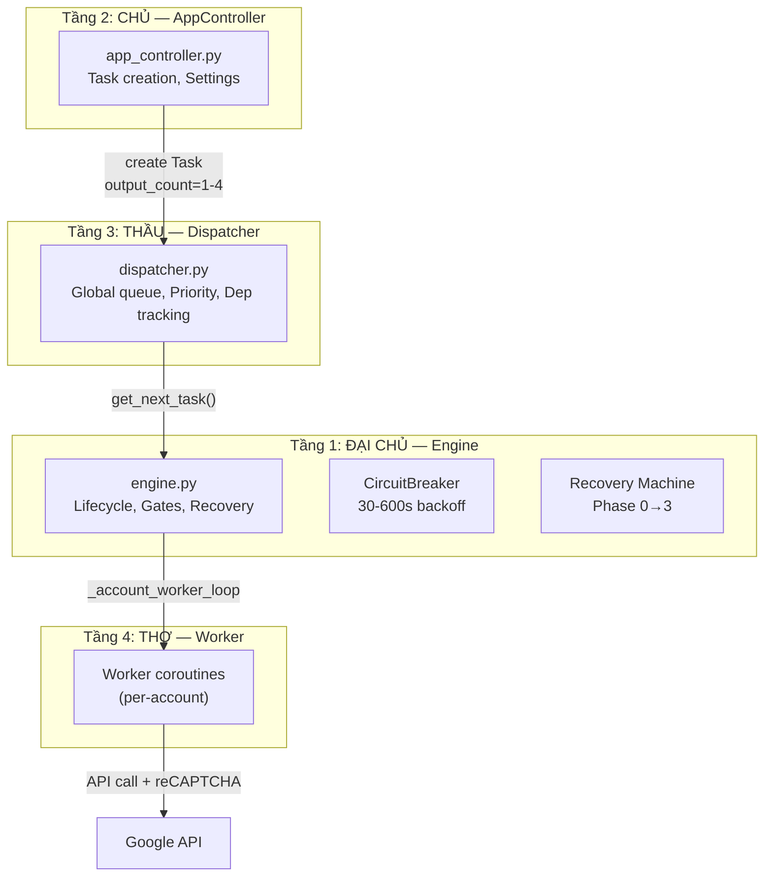

| Tầng | Component | Vai trò | File |
|------|-----------|---------|------|
| **Đại chủ** | Engine | Lifecycle, 5-layer gate, worker spawning, retry, polling | [engine.py](file:///D:/NEW%20VEO%20PRO%20MAX/veo-pro-max/02%20-%20CLIENT%20-%20VEO%20PRO%20MAX/core/engine.py) |
| **Chủ** | AppController | UI interface, Task/TaskGroup creation, settings | [app_controller.py](file:///D:/NEW%20VEO%20PRO%20MAX/veo-pro-max/02%20-%20CLIENT%20-%20VEO%20PRO%20MAX/core/app_controller.py) |
| **Thầu** | Dispatcher | Global FIFO queue, dependency tracking, D2 account affinity | [dispatcher.py](file:///D:/NEW%20VEO%20PRO%20MAX/veo-pro-max/02%20-%20CLIENT%20-%20VEO%20PRO%20MAX/core/dispatcher.py) |
| **Thợ** | Worker | Execute 1 task: validate → reCAPTCHA → submit → process | [worker.py](file:///D:/NEW%20VEO%20PRO%20MAX/veo-pro-max/02%20-%20CLIENT%20-%20VEO%20PRO%20MAX/core/worker.py) |

---

## 2. output_count vs Token Cost

> [!IMPORTANT]
> **1 Generate API call = 1 reCAPTCHA token, bất kể output_count.**
> `output_count=4` → 1 token cho 4 video = **HIỆU QUẢ NHẤT**.

| output_count | Generate tokens | Videos | Token/video |
|-------------|----------------|--------|-------------|
| 1 | 1 | 1 | 1.00 |
| 4 | 1 | 4 | 0.25 |

---

## 3. Phân Tích Prompt-Next vs Upscale Priority ⭐

### 3.1 Ba Chế Độ Workload Priority

Hệ thống có 3 chế độ (engine L197, L601):

| Mode | Mô tả | Behavior |
|------|--------|----------|
| `upscale_first` | Upscale inline, worker giữ slot | Worker chờ upscale hoàn tất (~3-5min) trước khi release slot |
| ~~`balanced`~~ | ~~Background concurrent~~ | ~~Đã đổi default~~ → Gây contention, loại bỏ ưu tiên |
| `prompts_first` | **MẶC ĐỊNH (Fix G1)** — upscale chờ queue trống | UpscaleQueue pause khi còn tasks READY trong queue |

### 3.2 Luồng Sau 720p Download

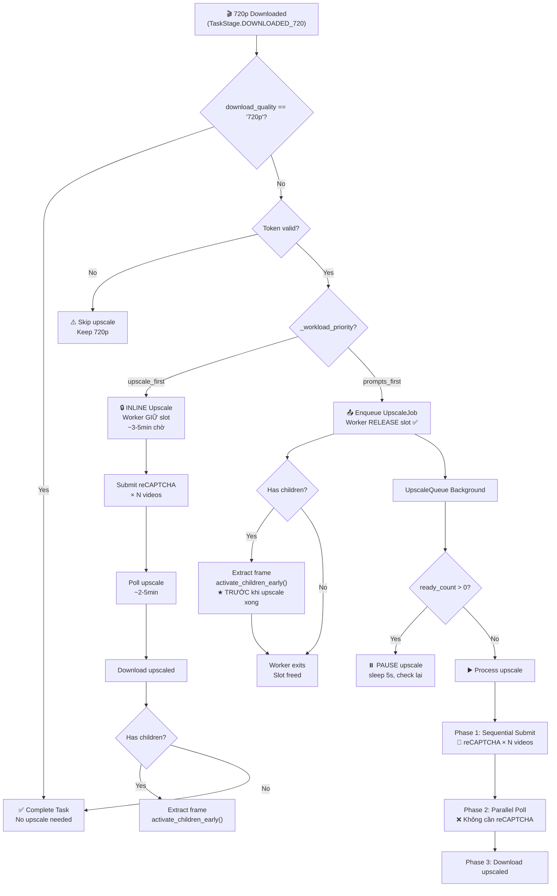

### 3.3 Token Cost Tổng Thể

> [!CAUTION]
> **Upscale submit cần reCAPTCHA PER VIDEO** (L502-536 trong upscale_queue.py). Đây là điểm tốn token nhất!

**Scenario:** 10 prompts × output_count=4 × 1080p upscale

| Stage | upscale_first | prompts_first |
|-------|:----------:|:-------------:|
| **Generate** (10 calls × 1 token) | 10 | 10 |
| **Upscale submit** (40 videos × 1 token) | 40 | 40 |
| **Tổng reCAPTCHA tokens** | **50** | **50** |
| **Thời gian hoàn tất** | ❌ Chậm nhất | ✅ Nhanh nhất cho generate |

> [!NOTE]
> Tổng token **giống nhau**. `prompts_first` tối ưu hơn vì **không gây contention** giữa generate và upscale.

### 3.4 Vấn Đề `balanced` Mode (Đã Fix ✅)

`balanced` gây 3 vấn đề: reCAPTCHA lock contention, rate lock contention, random scheduling — tất cả đã giải quyết bằng Fix G1 (đổi default → `prompts_first`) và Fix G2 (check `ready_count > 0` thay vì scan tất cả tasks).

---

## 4. ĐỀ XUẤT: Loại Bỏ `balanced`, Mặc Định `prompts_first`

### So sánh cuối cùng

| Tiêu chí | upscale_first | prompts_first ✅ |
|----------|:----------:|:-------------:|
| Token efficiency | Trung bình | ✅ Cao nhất |
| Generate throughput | ❌ Thấp (slot locked) | ✅ Cao nhất |
| 403 risk | Thấp | ✅ Thấp nhất |
| User experience | ❌ Chậm thấy video | ✅ Nhanh thấy 720p |
| Upscale delay | Thấp | ❌ Cao nhất |

---

## 5. Tổng Hợp Tất Cả Vấn Đề

### Đã Fix ✅

| # | Vấn đề | Fix | Trạng thái |
|---|--------|-----|:---:|
| 1 | CB probe loop vô hạn | Expo backoff 30-600s | ✅ |
| 2 | open_since reset on re-trip | Preserve timestamp | ✅ |
| 3 | Recovery epoch deadlock | `consecutive_403` counter | ✅ |
| 4 | Worker bypass cooldown | Re-check sau circuit wake | ✅ |
| 5 | Pool refill during outage | `should_skip_fn` gate | ✅ |
| 6 | Trial token lãng phí | `_on_readiness_token()` cache | ✅ |
| **G1** | **`balanced` gây contention** | **Default → `prompts_first`** | ✅ |
| **G2** | **`should_upscale_wait()` quá rộng** | **Check `ready_count > 0`** | ✅ |
| **F** | **Cooldown race 4-worker** | **Re-check inside rate lock** | ✅ |
| **C** | **UpscaleQueue thiếu CB** | **`wait_for_circuit_fn` gate** | ✅ |
| **D** | Dead code recovery vars | Đã clean từ phiên trước | ✅ |
| **E** | Trial token chỉ vào AM | `inject_token()` → Pool + AM | ✅ |

### Còn Lại

| # | Vấn đề | Mức | Trạng thái |
|---|--------|-----|:---:|
| **A** | Account load distribution | Trung bình | 🔍 Phân tích bên dưới |

---

## 6. Account Load Distribution — Phân Tích Chuyên Sâu (Vấn Đề A)

### 6.1 Mô Hình Hiện Tại: Reactive Migration ✅

Hệ thống **ĐÃ CÓ** cơ chế chuyển task lỗi sang account khác:

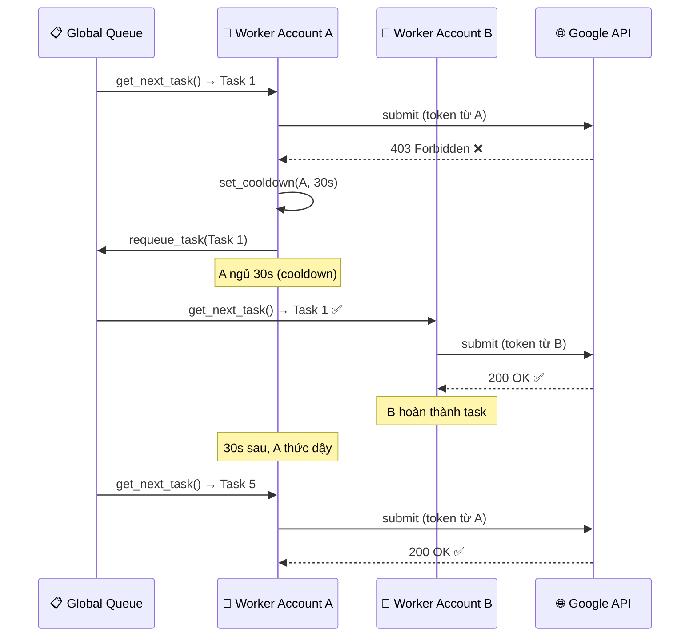

**Luồng reactive:**
1. Task fail trên Account A → `requeue_task()` → quay lại global queue
2. Account A vào cooldown (30-180s) → workers A ngủ
3. Account B workers pick task từ queue → thử lại trên B
4. **Ngoại trừ** continuation chains (`required_account`) — phải chạy cùng account

> [!TIP]
> **Reactive migration đã giải quyết bài toán "chuyển prompt lỗi sang account khác".**
> Khi A bị 403 → A cooldown → B tự động nhận tasks còn lại.

### 6.2 Vấn Đề: Không Có Proactive Balancing

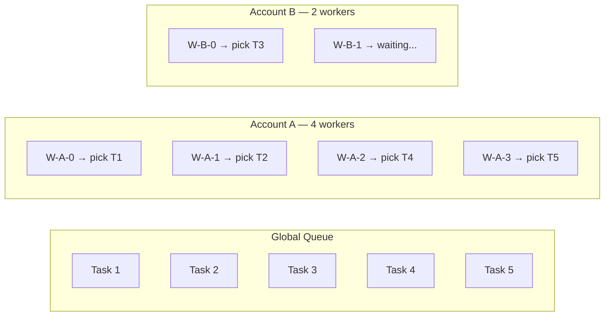

Account A (4 workers) lấy **4/5 tasks**, B chỉ lấy **1/5** → A bị throttle sớm → cooldown → burst 403 trên A trước khi B kịp nhận.

**Token lãng phí:** 1-2 tokens (burst 403 ban đầu trên A) trước khi reactive migration kick in.

### 6.3 Ba Phương Án Proactive Balancing

#### PA1: Per-Account Queue (❌ KHÔNG KHUYẾN NGHỊ)

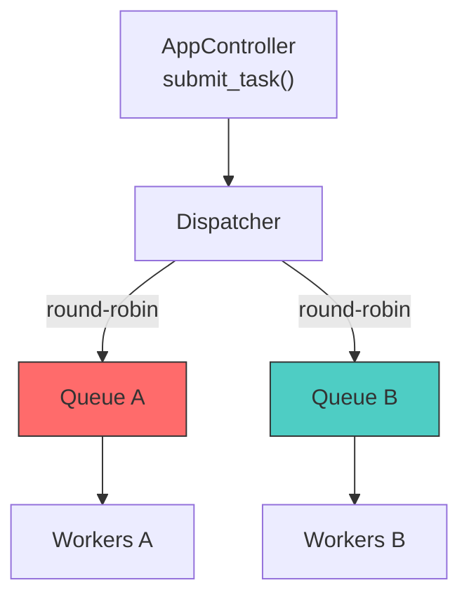

| Ưu | Nhược |
|-----|-------|
| Phân phối đều tuyệt đối | Phá vỡ global queue → **viết lại Dispatcher** |
| | A cooldown → Queue A stuck (mất reactive migration) |
| | Continuation affinity phức tạp thêm |
| | **~100+ dòng code, risk regression cao** |

#### PA2: Worker Throttle (⚠️ TRUNG BÌNH)

```python
# engine.py — _account_worker_loop
running_on_account = sum(1 for t in all_tasks if t.assigned_account == email and t.state == RUNNING)
fair_share = total_running / num_accounts
if running_on_account > fair_share + 1:
    await asyncio.sleep(1)  # Yield cho accounts khác
    continue
```

| Ưu | Nhược |
|-----|-------|
| Không thay đổi Dispatcher | `fair_share` phụ thuộc số accounts (dynamic) |
| ~15 dòng code | Edge case: 1 account → throttle chính nó |
| Global queue giữ nguyên | Worker vẫn race → chỉ giảm, không loại bỏ |

#### PA3: Round-Robin Check Ở `get_next_task()` (✅ KHUYẾN NGHỊ nếu implement)

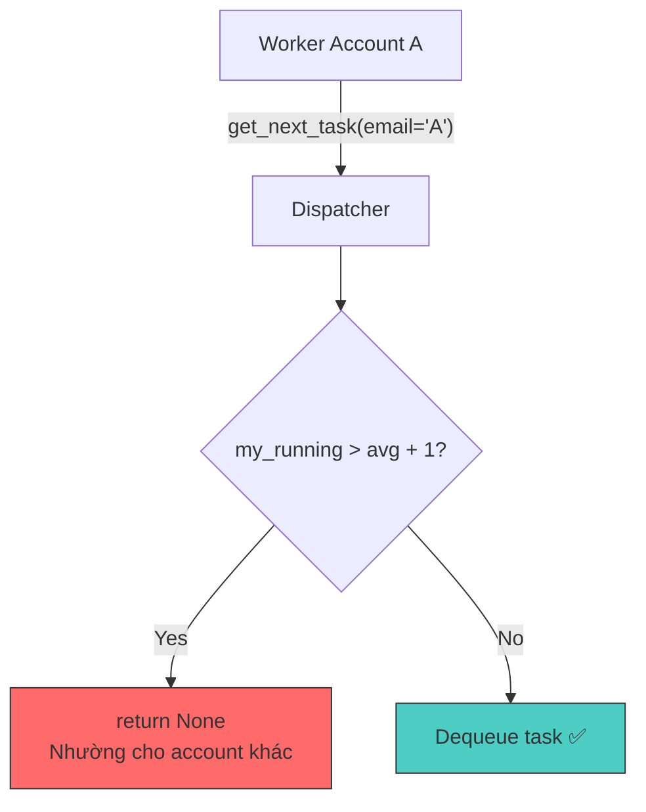

**Mô hình triển khai chi tiết:**

```python
# dispatcher.py — Thêm tracking per-account
class Dispatcher:
    def __init__(self):
        # ... existing code ...
        self._per_account_running: Dict[str, int] = {}  # email → running count
        self._active_accounts: set = set()
    
    def get_next_task(self, account_email: str = None) -> Optional[Task]:
        """Get next task with optional fair-share balancing.
        
        If account_email is provided, check fair-share before dequeue.
        Account with running count > (average + 1) yields its turn.
        """
        # Fair-share gate (only if multi-account)
        if account_email and len(self._active_accounts) > 1:
            total = sum(self._per_account_running.values())
            avg = total / len(self._active_accounts)
            my_running = self._per_account_running.get(account_email, 0)
            if my_running > avg + 1:
                return None  # Yield turn — account is running above fair share
        
        # ... existing dequeue logic ...
        # After dequeue success:
        if account_email:
            self._per_account_running[account_email] = \
                self._per_account_running.get(account_email, 0) + 1
            self._active_accounts.add(account_email)
        return task
    
    def complete_task(self, task_id, ...):
        # ... existing code ...
        # Decrement per-account counter
        if task.assigned_account:
            count = self._per_account_running.get(task.assigned_account, 0)
            self._per_account_running[task.assigned_account] = max(0, count - 1)

# engine.py — Chỉ thay đổi 1 dòng
task = self._dispatcher.get_next_task(account_email=account.email)  # Thêm email param
```

| Ưu | Nhược |
|-----|-------|
| ~20 dòng code | Cần thêm bookkeeping (`_per_account_running`) |
| Global queue giữ nguyên | Edge case: 1 account → avg = running → luôn pass |
| Reactive migration vẫn hoạt động | Cần update cả `fail_task`, `cancel_task` |
| Auto-degrade khi 1 account | |
| **Không cần UI setting** | |

### 6.4 Đánh Giá Tổng Thể

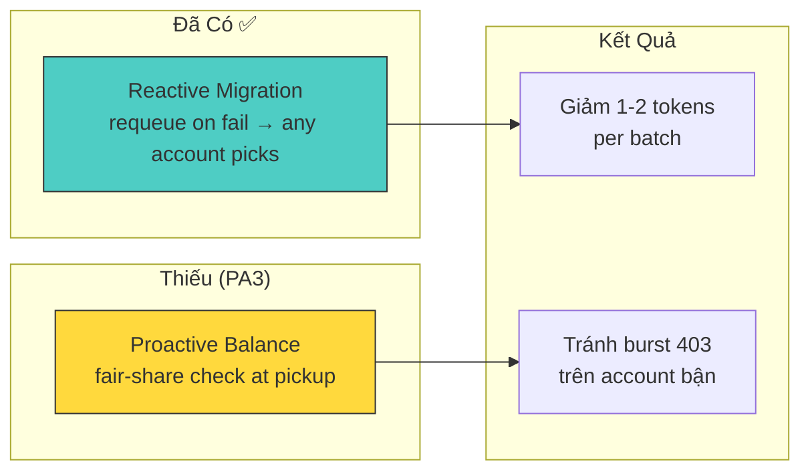

| Tiêu chí | Reactive (đã có) | +PA3 (proactive) |
|----------|:-:|:-:|
| Chuyển task lỗi sang account khác | ✅ | ✅ |
| Phân phối đều trước lỗi | ❌ | ✅ |
| Giảm burst 403 ban đầu | ❌ | ✅ (1-2 tokens) |
| Cần UI setting | Không | **Không** |
| Code thay đổi | 0 | ~20 dòng |
| Risk regression | 0 | Thấp |


> [!NOTE]
> **Reactive migration đã giải quyết 90% bài toán.** PA3 đã được implement — fair-share gate trong `get_next_task(account_email)`, tự động yield turn khi `my_running > avg + 1`.
> 
> **Không cần UI setting** — balancing transparent, auto-degrade khi 1 account.

---

## 7. Browser Lifecycle & Extension Communication

> [!IMPORTANT]
> Đây là **lớp nền tảng**: nếu browser/extension bị lỗi → tất cả downstream (reCAPTCHA, API calls, recovery) đều fail bất kể pipeline có tốt đến đâu.

### 7.1 Kiến Trúc Tổng Thể

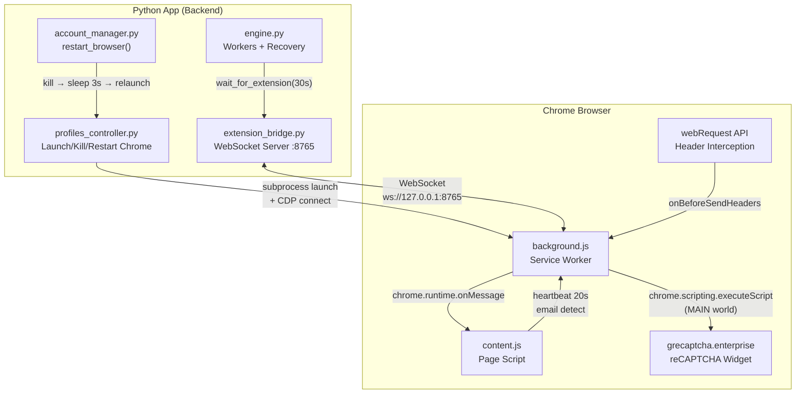

### 7.2 WebSocket Bridge Protocol

| Layer | Component | Port | Interval |
|-------|-----------|:----:|:--------:|
| WebSocket Server | `extension_bridge.py` | 8765-8767 | ping/20s, timeout/10s |
| WebSocket Client | `background.js` | auto-detect | reconnect 3-30s (backoff) |

#### Messages: App → Extension

| Action | Mục đích | Response |
|--------|----------|----------|
| `request_recaptcha` | Lấy token từ `grecaptcha.enterprise.execute()` | `recaptcha_token` |
| `check_recaptcha_ready` | Trial-execute để verify widget sẵn sàng | `recaptcha_ready` |
| `refresh_headers` | Reload VEO tab → capture fresh headers | `headers_refreshed` |
| `refresh_headers_lightweight` | Trigger fetch() → capture headers không reload | `headers_refreshed_lightweight` |
| `probe_browser_headers` | Cross-origin fetch → capture `x-browser-validation` | `probe_browser_headers_result` |
| `assign_email` | Gán email cho connection chưa register | `register` |
| `simulate_activity` | Mouse/scroll trên VEO tab chống idle | `activity_simulated` |
| `check_tab_alive` | Ping tab via `document.readyState` | `tab_alive` |
| `reload_extension` | `chrome.runtime.reload()` hot-reload | `extension_reloaded` |
| `ping` | Health check | `pong` |

#### Messages: Extension → App (Auto-Push)

| Action | Trigger | Dữ liệu |
|--------|---------|----------|
| `register` | content.js detect email | email, tabId |
| `headers_update` | webRequest capture header mới | headers, accessToken |
| `content_heartbeat` | content.js timer (20s) | email, readyState |
| `recaptcha_warmth` | content.js detect widget state | ready, details |
| `tab_frozen` | background.js heartbeat miss (>45s) | email, elapsed, reloadAttempt |
| `tab_dead` | 3 reload attempts failed in 5min | email, reloadAttempts |
| `tab_discarded` | Chrome Memory Saver | email, tabId |
| `account_logged_out` | URL redirect → `accounts.google.com` | email, reason |
| `zombie_tab` | Tab 30s không có email | tabId |

### 7.3 Heartbeat Chain & Frozen Tab Recovery

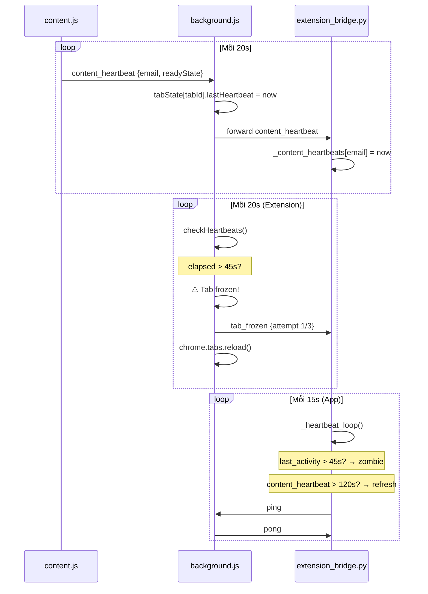

#### Escalation Timeline

| Thời gian | Sự kiện | Phía nào xử lý | Hành động |
|:---------:|---------|:---:|-----------|
| 0s | content.js heartbeat | Extension | Ghi timestamp |
| 20s | Miss heartbeat 1 | — | Chưa trigger |
| 45s | Extension detect frozen | **Extension** | `tab_frozen` → reload tab (attempt 1) |
| 45s | App detect zombie | **App** | Disconnect connection |
| 90s | Frozen attempt 2 | **Extension** | Reload tab (attempt 2) → "full" refresh |
| 120s | App content HB missing | **App** | `_trigger_refresh` lightweight |
| 135s | Frozen attempt 3 | **Extension** | Reload tab (attempt 3) |
| 180s | Frozen > 3 | **Extension** | `tab_dead` → stop reloading |
| 180s | `on_tab_dead` callback | **App** | Log "browser restart recommended" |

> [!WARNING]
> **GAP #1: `tab_dead` không trigger auto-restart.**
> Extension gửi `tab_dead`, app chỉ log warning. Không có automation nào gọi `restart_browser()` sau `tab_dead`. Worker tiếp tục fail vì tab dead → reCAPTCHA timeout → retry loop vô nghĩa.

### 7.4 Browser Restart Flow

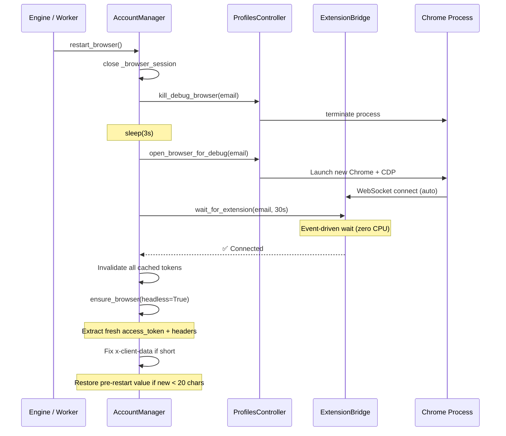

#### Restart được trigger khi nào?

| Trigger | File | Line | Điều kiện |
|---------|------|:----:|-----------|
| Extension disconnect + reconnect fail | engine.py | ~901 | `wait_for_extension` timeout |
| Repeated reCAPTCHA failures | engine.py | ~1420 | Nhiều token=None liên tiếp |
| 403 recovery escalation | engine.py | ~2818 | Recovery phase 3 |
| Upscale reCAPTCHA fail | upscale_queue.py | ~588 | Pool exhausted + extension fail |
| **Manual UI button** | browser_controls.py | ~369 | User click "Restart" |

> [!WARNING]
> **GAP #2: Chờ cố định 3s giữa kill và relaunch.**
> `await asyncio.sleep(3)` — nếu Chrome process chưa kịp exit (lock file, GPU process), relaunch có thể crash do profile lock. Nên poll process exit thay vì sleep cố định.

### 7.5 reCAPTCHA Token Lifecycle

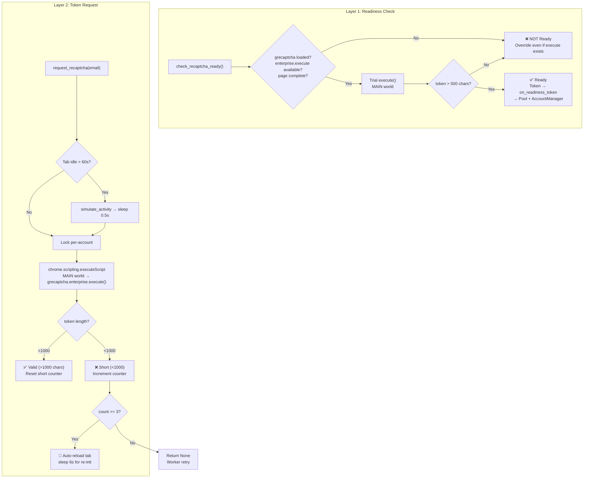

#### Dual Short Token Tracking

| Layer | Tracker | Threshold | Action |
|-------|---------|:---------:|--------|
| **Extension** (`background.js`) | `shortTokenCounts[tabId]` | ≥3 | `chrome.tabs.reload()` + sleep 5s |
| **App** (`extension_bridge.py`) | `_short_token_counts[email]` | ≥3 | Send `refresh_headers` + sleep 6s |

> [!CAUTION]
> **GAP #3: Cả hai layer đều auto-reload tab — có thể double-reload.**
> Extension reload tab (5s sleep) → App cũng trigger reload (6s sleep) = tab reload 2 lần. Nên chọn 1 layer làm authority (recommend: Extension, vì gần hơn).

### 7.6 Header Interception & Freshness

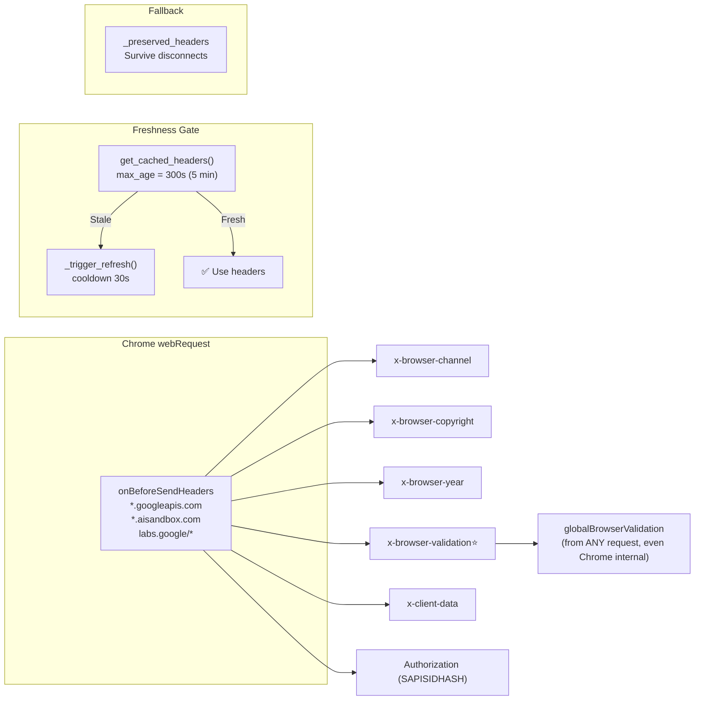

| Header | Nguồn | Quan trọng |
|--------|-------|:---:|
| `x-browser-validation` | Cross-origin requests to `googleapis.com` | ⭐ Quan trọng nhất |
| `x-client-data` | Chrome Variations Service | ⭐ Cần ≥20 chars |
| `x-browser-channel` / `copyright` / `year` | Chrome internal headers | Trung bình |
| `Authorization` (SAPISIDHASH) | User's Google session | ⭐ Authentication |

> [!WARNING]
> **GAP #4: Header freshness chỉ được check khi worker cần — không có proactive refresh schedule.**
> Headers chỉ được refresh khi: (a) worker request headers → stale → trigger refresh, hoặc (b) heartbeat miss → trigger refresh. Không có cron job định kỳ refresh headers trước khi chúng hết hạn. Nếu tab idle (không có webRequest), headers sẽ âm thầm hết hạn 300s mà không ai biết.

### 7.7 ⚠️ Vấn Đề Liên Kết Logic App ↔ Extension

> [!CAUTION]
> **5 điểm thiếu liên kết logic giữa App backend và Extension backend:**

#### GAP #1: `tab_dead` → Không có auto-restart

```
Extension: tab_dead {email, attempts: 3}
    ↓
App: on_tab_dead callback → log.error("Browser restart recommended")
    ↓
??? → KHÔNG CÓ CODE gọi restart_browser()
    ↓
Worker tiếp tục → reCAPTCHA timeout → retry vô nghĩa
```

**Fix đề xuất:** Wire `on_tab_dead` → `restart_browser()` trong engine.py hoặc app_controller.py.

#### GAP #2: Kill Chrome → sleep(3s) → Relaunch (hardcoded)

```python
# account_manager.py L530-533
self._profiles_controller.kill_debug_browser(email)
await asyncio.sleep(3)  # ❌ Hardcoded — có thể không đủ
self._profiles_controller.open_browser_for_debug(email)
```

**Rủi ro:** Chrome có GPU process, utilities processes — kill signal gửi nhưng cleanup mất >3s → profile lock → relaunch crash.

**Fix đề xuất:** Poll process exit trước khi relaunch:
```python
for _ in range(10):
    if not is_chrome_running(profile_path):
        break
    await asyncio.sleep(1)
```

#### GAP #3: Double short-token reload

Cả Extension (L229-242 background.js) lẫn App (L440-447 extension_bridge.py) đều independently track short tokens và auto-reload tab. Kết quả: tab bị reload 2 lần liên tiếp, mất thêm 11s (5s+6s).

**Fix đề xuất:** Extension chỉ forward event, App quyết định reload. Hoặc Extension reload + gửi `tab_reloaded` → App skip reload.

#### GAP #4: Header freshness mismatch giữa Extension (3min) và App (5min)

Extension **ĐÃ CÓ** proactive refresh (background.js L1146-1163):
```javascript
// background.js — HEADER_REFRESH_ALARM every 3 minutes
chrome.alarms.create(HEADER_REFRESH_ALARM, { periodInMinutes: 3 });
// → lightweightRefreshAll() → content.js trigger fetch → webRequest captures headers
```

NHƯNG App dùng `max_age_seconds=300` (5 phút) trong `get_cached_headers()`. Extension refresh ở 3 phút nhưng App coi headers là "fresh" tới 5 phút → window 2 phút nơi App dùng headers mà Extension đã thay thế.

**Fix đề xuất:** Đồng bộ `max_age_seconds` xuống 180s (3 phút) trong `extension_bridge.py`, hoặc Extension push update → App reset freshness timer.

#### GAP #5: Extension reconnect vs App state mismatch

```
Extension disconnect → reconnect sau 3-30s
    ↓
App: _disconnect() → fire on_extension_disconnect → preserve headers
    ↓
Extension reconnect → register emails → push cached headers
    ↓
App: ✅ Nhận lại headers
    ↓
NHƯNG: App đã declare zombie (45s check) hoặc
       Worker đã gọi restart_browser() → CONFLICT
```

**Rủi ro:** Extension tự reconnect (3s) nhưng App đã trigger restart_browser (kill Chrome) → Extension nhận kill signal giữa chừng reconnect.

**Fix đề xuất:** Thêm `_restart_in_progress` flag — nếu restart đang chạy, ignore extension reconnect events.

#### GAP #6: `findTabForEmail()` fallback trả tab sai account

```javascript
// background.js L1099-1111
function findTabForEmail(email) {
  for (const [tabId, state] of Object.entries(tabState)) {
    if (state.email === email) return parseInt(tabId);
  }
  // ❌ FALLBACK: trả ANY tab có email — có thể sai account!
  for (const [tabId, state] of Object.entries(tabState)) {
    if (state.email) return parseInt(tabId);
  }
  return null;
}
```

**Rủi ro:** Account A request reCAPTCHA → không tìm thấy tab A → trả tab B → lấy token từ session B → token không match account → Google reject hoặc cross-account token.

**Fix đề xuất:** Bỏ fallback, return null nếu không tìm đúng email. Để App-side xử lý "no tab" error.

#### GAP #7: `account_logged_out` → mark `is_ready=False` nhưng worker không dừng

```python
# app_controller.py L420-432
def _on_account_logged_out(self, email: str, reason: str):
    self._profiles_controller.update_profile(email, is_ready=False)
    self._push_browser_status()
    # ❌ Không notify engine/workers để dừng
    # Workers tiếp tục attempt API calls → 401/403 liên tục
```

**Rủi ro:** Worker cho account bị logout vẫn chạy → attempt reCAPTCHA (tab đã xóa) → timeout → attempt API → 401 → retry loop cho đến khi cooldown/circuit breaker tác động.

**Fix đề xuất:** Thêm `on_account_logged_out` → engine pause_account(email) hoặc set cooldown dài (ví dụ 5 phút).

#### GAP #8: `tab_closed` (Extension→App) chỉ log, không cleanup state

```python
# extension_bridge.py L1008-1010
elif action == 'tab_closed':
    email = msg.get('email', '')
    log.info(f"[ExtensionBridge] Tab closed for {email}")
    # ❌ Không xóa headers/access_token/readiness
    # ❌ Không notify AccountManager
```

Extension gửi `tab_closed` (khi user đóng tab, L1073-1094), nhưng App chỉ log. Headers cũ vẫn được cache → worker dùng stale headers từ tab đã đóng.

**Fix đề xuất:** Clear `conn.headers[email]`, `conn.access_tokens[email]`, `self._recaptcha_readiness[email]` khi nhận `tab_closed`.

#### GAP #9: `_disconnect()` clear ALL pending futures — multi-email mất requests

```python
# extension_bridge.py L1187-1191
for req_id, future in list(self._pending_requests.items()):
    if not future.done():
        future.set_result({'error': 'Extension disconnected', 'token': None})
self._pending_requests.clear()  # ❌ Clear TOÀN BỘ
```

Nếu 1 connection register 2+ emails và disconnect → ALL pending requests (kể cả từ connection khác) bị clear.

**Rủi ro:** Worker A request reCAPTCHA (connection 1) → Connection 2 disconnect → Worker A nhận error "disconnected" sai.

**Fix đề xuất:** Chỉ clear futures liên quan đến connection đang disconnect (tag requestId với connection).

#### GAP #10: `checkRecaptchaWarmth()` chạy trong isolated world — false negatives

```javascript
// content.js L306-331 — runs in ISOLATED world (content script)
function checkRecaptchaWarmth() {
    const hasGrecaptcha = typeof grecaptcha !== 'undefined';
    // ❌ Content script isolated world → KHÔNG THẤY grecaptcha
    // grecaptcha sống trong MAIN world (page context)
}
```

Tuy nhiên, `request_recaptcha` và `check_recaptcha_ready` dùng `chrome.scripting.executeScript` với `world: 'MAIN'` nên hoạt động đúng. Chỉ warmth check bị false negative → App nghĩ reCAPTCHA chưa sẵn sàng → unnecessary pre-warm delays.

**Impact:** Thấp — warmth chỉ dùng cho logging/monitoring, không gating logic chính.

**Fix đề xuất:** Di chuyển warmth check sang `chrome.scripting.executeScript` MAIN world trong background.js, hoặc accept false negatives (low impact).

### 7.8 Tổng Hợp Gaps

| # | Gap | Severity | Impact | Fix Effort |
|:-:|-----|:--------:|--------|:----------:|
| 1 | `tab_dead` không auto-restart | 🔴 Cao | Worker fail loop vô hạn | ~10 dòng |
| 2 | Kill Chrome sleep(3s) hardcoded | 🟡 Trung bình | Profile lock → crash khi relaunch | ~15 dòng |
| 3 | Double short-token reload | 🟡 Trung bình | Mất 11s extra per encounter | ~20 dòng |
| 4 | Header freshness mismatch (3min vs 5min) | 🟢 Thấp | Dùng stale headers 2 phút | ~1 dòng |
| 5 | Reconnect vs restart race | 🟠 Trung bình-Cao | Kill Chrome during reconnect | ~15 dòng |
| **6** | **`findTabForEmail` fallback trả tab sai account** | **🔴 Cao** | **Cross-account token** | **~5 dòng** |
| **7** | **`account_logged_out` không pause worker** | **🔴 Cao** | **401/403 retry loop** | **~10 dòng** |
| **8** | **`tab_closed` không cleanup state** | **🟡 Trung bình** | **Stale headers/tokens** | **~10 dòng** |
| **9** | **`_disconnect` clear ALL futures** | **🟠 Trung bình-Cao** | **Cross-connection error** | **~15 dòng** |
| **10** | **Warmth check isolated world** | **🟢 Thấp** | **False negative warmth report** | **~15 dòng** |

> [!IMPORTANT]
> **Tổng: 10 gaps** — 3 critical (🔴), 3 medium-high (🟠/🟡), 2 medium (🟡), 2 low (🟢).
> Priority order: **GAP #1 → #6 → #7** → #5 → #9 → #2 → #3 → #8 → #4 → #10.

