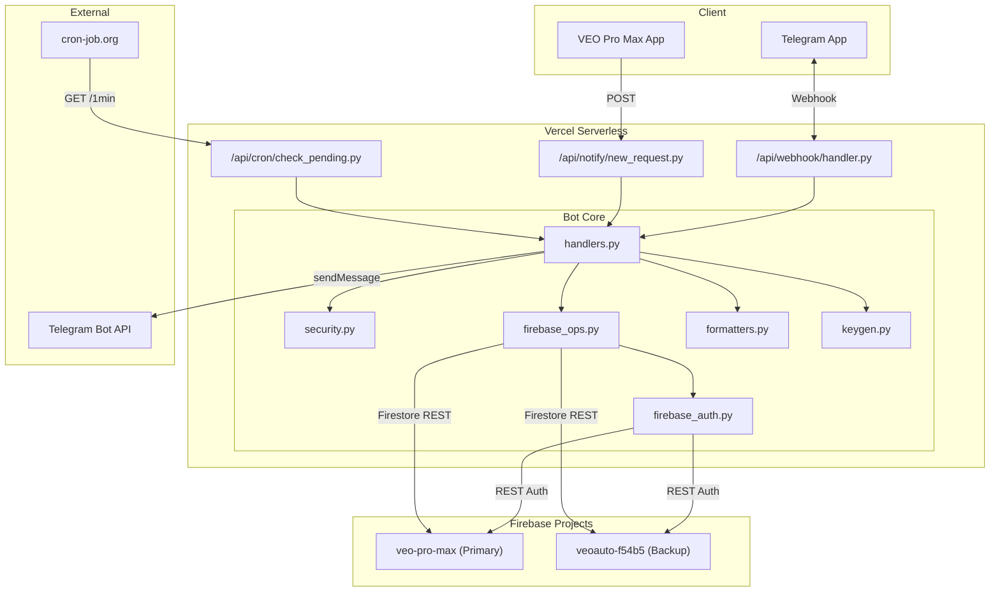
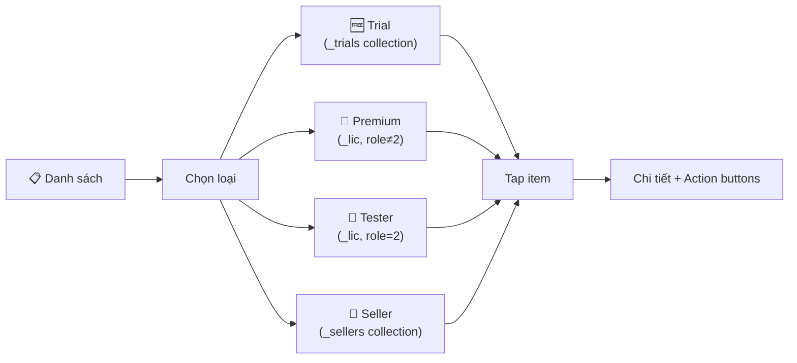
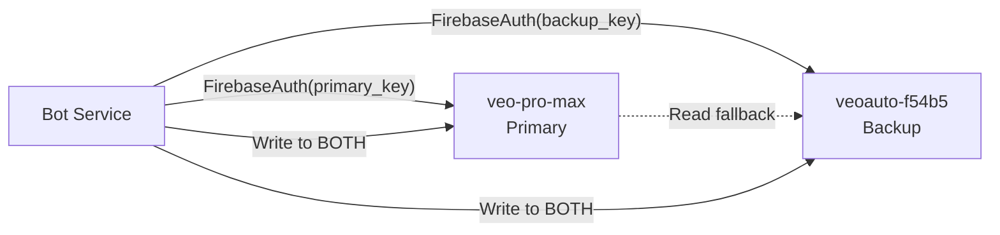

# VEO License Telegram Bot — Architecture Document

> Phiên bản: 1.0 | Cập nhật: 2026-03-06 | Platform: Vercel Serverless + Telegram Bot API

---

## 1. Tổng quan hệ thống

Bot Telegram quản lý license VEO Pro Max 24/7, thay thế admin app desktop khi cần thao tác nhanh từ điện thoại.



---

## 2. Cấu trúc thư mục

```
001 - Telegram Bot/
├── api/                          # Vercel serverless functions
│   ├── webhook/
│   │   └── handler.py            # Telegram webhook receiver
│   ├── notify/
│   │   └── new_request.py        # Real-time alert endpoint
│   └── cron/
│       └── check_pending.py      # Scheduled pending check
├── bot/                          # Core logic
│   ├── __init__.py
│   ├── handlers.py               # Commands, callbacks, menus (1023 lines)
│   ├── firebase_auth.py          # Dual-project auth (127 lines)
│   ├── firebase_ops.py           # Firestore CRUD REST API (324 lines)
│   ├── formatters.py             # Message formatting (174 lines)
│   ├── keygen.py                 # License key generation
│   └── security.py               # Admin whitelist, rate limiting
├── scripts/
│   └── create_bot_account.py     # One-time bot user setup
├── docs/
│   └── ARCHITECTURE.md           # ← This document
├── vercel.json                   # Routes & build config
├── requirements.txt              # requests only
└── .env / .env.generated         # Local env vars
```

---

## 3. API Endpoints

### 3.1. Webhook — `POST /api/webhook/{secret}`

| Item | Value |
|------|-------|
| **Trigger** | Telegram sends updates (messages, callbacks) |
| **Auth** | URL-path secret (`WEBHOOK_SECRET`) |
| **Handler** | `bot/handlers.py` → `handle_message()` / `handle_callback()` |

### 3.2. Notify — `POST /api/notify/new_request`

| Item | Value |
|------|-------|
| **Trigger** | Client app submits upgrade request |
| **Auth** | Header `X-Notify-Key` = `FIREBASE_PRIMARY_API_KEY` |
| **Effect** | Instant Telegram alert to all admins |

### 3.3. Cron — `GET /api/cron/check_pending`

| Item | Value |
|------|-------|
| **Trigger** | cron-job.org every 1 minute |
| **Auth** | Header `X-Cron-Secret` = `CRON_SECRET` |
| **Effect** | Check for unprocessed requests, alert if found |

---

## 4. Telegram Commands & Menu

### 4.1. Slash Commands

| Command | Handler | Description |
|---------|---------|------------|
| `/start` | `handle_start` | Main menu with inline buttons |
| `/status` | `handle_status` | License counts + filter buttons |
| `/list` | `handle_list` | Category picker → list → actions |
| `/health` | `handle_health` | DB connectivity check |
| `/pending` | `handle_pending` | Pending upgrade requests |
| `/lookup <MID>` | `handle_lookup` | Find license by MID |
| `/create <MID> <tier> <days>` | `handle_create` | Create new license |
| `/approve <MID>` | `handle_approve_command` | Approve request → tier picker |
| `/reject <MID>` | `handle_reject_command` | Reject request |
| `/revoke <KEY>` | `handle_revoke` | Revoke a license |
| `/extend <MID> <days>` | `handle_extend` | Extend expiry |

### 4.2. Main Menu Buttons

```
📊 Tổng quan    │  🏥 Health
📋 Danh sách    │  📬 Chờ duyệt
🔍 Tra cứu MID  │  🔑 Tạo key mới
⏱️ Gia hạn      │  🔴 Thu hồi key
```

### 4.3. List Flow (3 bước)



### 4.4. Role-Specific Action Buttons

| Loại | Active | Revoked/Expired |
|------|--------|-----------------|
| 🆓 Trial | ⬆️ Nâng cấp Premium | — |
| 💎 Premium | ⏱️ Gia hạn / 🔴 Thu hồi / 🧪→Tester | 🔑 Tạo key mới |
| 🧪 Tester | ⏱️ Gia hạn / 💎→Premium / 🔴 Thu hồi | 🔑 Tạo key mới |
| 🏪 Seller | (View only) | — |

---

## 5. Firebase Architecture

### 5.1. Dual-Project Setup



**Key insight**: Each Firebase project has its own Auth user pool. Bot has separate user accounts on each project, authenticated with separate API keys.

### 5.2. Bot User Accounts

| Project | UID | Email | Custom Claims |
|---------|-----|-------|--------------|
| `veo-pro-max` | `IhMnCGOCFz...` | `veo-bot@system.local` | `role=bot, level=3` |
| `veoauto-f54b5` | `AdGl4zxBhV...` | `veo-bot@system.local` | `role=bot, level=3` |

### 5.3. Auth Flow (per request)

```
Request → _get_auth_for(project) → FirebaseAuth instance
  → Token cached? Return cached
  → Refresh token? Try refresh
  → Full sign-in: POST identitytoolkit/signInWithPassword
  → Cache id_token (1h TTL, refresh 5min before)
```

### 5.4. Collections & Data Model

| Collection | Source | Key Format | Primary Fields |
|-----------|--------|-----------|----------------|
| `_lic` | License keys | `XXXX-XXXX-...-XXXX` | `_mid, _cn, _ecn, _t, _st, _exp, _role, _dur` |
| `_mid_to_key` | MID→Key index | MID (64 hex) | `key, tier, role, status` |
| `_trials` | Trial users | MID (64 hex) | `client_name, _ecn, email, status, expires_at` |
| `_upgrade_requests` | Pending requests | MID (64 hex) | `machine_id, client_name, tier, status` |
| `_customers` | Customer info | MID (64 hex) | `name, email, purchases` |
| `_sellers` | Seller accounts | Seller ID | `name, machine_id, active` |
| `_bot_audit` | Bot audit trail | `action_{timestamp}` | `action, key_masked, mid_masked` |
| `_config` | App config | Config name | Various |

### 5.5. Security Rules

```javascript
function isBot() {
  return request.auth != null && request.auth.token.role == 'bot';
}

// _lic: Bot read/write, client read by key pattern
// _trials: Bot full, client read by MID length
// _upgrade_requests: Bot full, client create with validation
// _sellers, _seller_audit: Admin SDK only (if false)
// Catch-all: if false
```

---

## 6. Security Layers

### 6.1. Telegram Security

```
Incoming Update
  ├─ URL-path secret (WEBHOOK_SECRET in URL)
  ├─ Admin whitelist (TELEGRAM_ADMIN_IDS)
  └─ Rate limiting (per user, per minute)
```

### 6.2. Firebase Security

```
Bot → Firebase Auth REST API
  ├─ Email/password sign-in → ID token
  ├─ Custom claim: role=bot → Security Rules grant access
  └─ Separate tokens per project (dual-auth)
```

### 6.3. Client Name Encryption

| Field | Content | Access |
|-------|---------|--------|
| `client_name` | `***` (masked) | Client can read |
| `_ecn` | XOR-encrypted name | Only admin/bot can decrypt |

**Algorithm**: `XOR(name_bytes, HMAC-SHA256(salt, MID))`
- Salt: `VEO_MID_KEY_ENCRYPT_2026_v1`
- Key derivation: `HMAC(salt, machine_id) → 32-byte key`
- Encryption: `XOR each byte of name with key[i % 32]`
- Storage: Base64 encoded

### 6.4. Callback Data Constraints

Telegram limits `callback_data` to 64 bytes. Solutions:
- MID (64 hex chars) → use first **16 chars** as prefix
- License key (long) → truncate to **24 chars**
- Lookup via `_find_lic_by_prefix()` — scans `_lic` for prefix match

---

## 7. Environment Variables (Vercel)

| Variable | Required | Description |
|----------|----------|------------|
| `TELEGRAM_BOT_TOKEN` | ✅ | From @BotFather |
| `TELEGRAM_ADMIN_IDS` | ✅ | Comma-separated admin chat IDs |
| `FIREBASE_BOT_EMAIL` | ✅ | `veo-bot@system.local` |
| `FIREBASE_BOT_PASSWORD` | ✅ | Shared password for both projects |
| `FIREBASE_PRIMARY_API_KEY` | ✅ | `veo-pro-max` Web API key |
| `FIREBASE_BACKUP_API_KEY` | ✅ | `veoauto-f54b5` Web API key |
| `FIREBASE_PRIMARY_PROJECT` | ✅ | `veo-pro-max` |
| `FIREBASE_BACKUP_PROJECT` | ✅ | `veoauto-f54b5` |
| `WEBHOOK_SECRET` | ✅ | URL-path secret for Telegram webhook |
| `CRON_SECRET` | ❌ | Header secret for cron endpoint |
| `VEO_LICENSE_SECRET` | ✅ | Keygen HMAC secret |

---

## 8. Alert System

### 8.1. Real-time (Client Push)

```
VEO Client App  --POST-->  /api/notify/new_request
                           Header: X-Notify-Key: <API_KEY>
                           Body: {mid, client_name, tier_requested}
                                    │
                                    ▼
                           Bot sends Telegram alert
                           to all admin IDs instantly
```

### 8.2. Cron Fallback (1 min)

```
cron-job.org  --GET-->  /api/cron/check_pending
                        Header: X-Cron-Secret: <SECRET>
                                    │
                                    ▼
                        Bot checks _upgrade_requests
                        where status == "pending"
                        Alert if any found
```

---

## 9. Key Generation

| Tier | Code | Days | Format |
|------|------|------|--------|
| 1 Month | `1M` | 30 | `XXXX-XXXX-XXXX-XXXX-XXXX-XXXX-XXXX-XXXX-XXXX` |
| 3 Months | `3M` | 90 | Same |
| 6 Months | `6M` | 180 | Same |
| 1 Year | `1Y` | 365 | Same |
| Lifetime | `LT` | 36500 | Same (100 years rolling) |

**Roles**: `0=TRIAL, 1=PREMIUM, 2=TESTER`

---

## 10. Deployment

| Item | Value |
|------|-------|
| **Platform** | Vercel (Hobby plan) |
| **Runtime** | Python 3.12 (Vercel Serverless) |
| **Dependencies** | `requests` only |
| **Build** | `@vercel/python` |
| **Domain** | `veo-license-bot.vercel.app` |
| **Deploy** | `npx vercel deploy --prod --yes` |

### 10.1. Route Config (`vercel.json`)

```json
{
  "routes": [
    { "src": "/api/webhook/(.*)", "dest": "/api/webhook/handler.py" },
    { "src": "/api/cron/(.*)",    "dest": "/api/cron/$1.py" },
    { "src": "/api/notify/(.*)",  "dest": "/api/notify/$1.py" }
  ]
}
```

---

## 11. So sánh Admin App vs Bot

| Feature | Admin App (Python GUI) | Telegram Bot |
|---------|----------------------|--------------|
| Platform | Desktop (Windows) | Mobile (everywhere) |
| Auth | Firebase Admin SDK | Firebase Auth REST API |
| DB Access | Direct Firestore SDK | Firestore REST API |
| Name Decrypt | `_ecn` → XOR | Same algorithm ✅ |
| Trial List | `_trials` collection | Same ✅ |
| Premium Filter | `_role != 2` | Same ✅ |
| Tester Filter | `_role == 2` | Same ✅ |
| Seller | `_sellers` collection | Same ✅ |
| Key Generation | `LicenseKeyGenerator` | Same `keygen.py` ✅ |
| Dual DB | Failover pattern | Same (write both) ✅ |
| Real-time Alert | N/A | `/api/notify` + cron ✅ |
