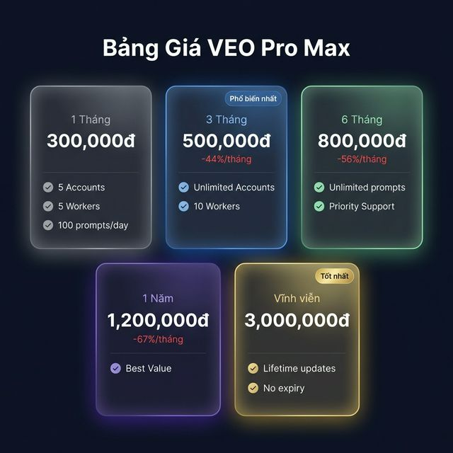

# 🎬 VEO Pro Max — Công cụ tạo Video AI hàng loạt #1 Việt Nam

> **Tạo hàng trăm video AI chất lượng cao chỉ trong vài giờ** — hoàn toàn tự động, không cần ngồi canh, không cần kiến thức kỹ thuật.

---

## Tại sao chọn VEO Pro Max?

Bạn đang tạo video bằng Google VEO 3.1 nhưng chỉ làm được **từng cái một**? Mỗi video mất 2 phút chờ, phải bấm tay, phải giải CAPTCHA, phải download thủ công?

**VEO Pro Max** biến quy trình đó thành **dây chuyền tự động hoàn toàn**:

✅ Nhập 100 prompt → Bấm Start → Đi ngủ → Sáng dậy có 400 video 4K  
✅ Chạy song song nhiều tài khoản Google — gấp 10x tốc độ  
✅ Tự động giải reCAPTCHA, tự retry khi lỗi, tự upscale 4K  
✅ Không bị Google phát hiện — hệ thống anti-detect chuyên nghiệp  

---

## 🎯 6 Chế độ tạo nội dung AI

### Video Generation (VEO 3.1 — Model mới nhất Google 2025)

| | Chế độ | Bạn cung cấp | Nhận được |
|---|--------|-------------|-----------|
| 🎬 | **Text → Video** | Prompt văn bản | Video 8s |
| 🖼️ | **Image → Video** | 1 ảnh + prompt | Video với ảnh làm frame đầu |
| 🎞️ | **Frames → Video** | 2 ảnh + prompt | Video nối 2 ảnh (đầu + cuối) |
| 🎨 | **References → Video** | 1-3 ảnh + prompt | Video lấy cảm hứng từ ảnh |

### Image Generation (Imagen 4 + GEM PIX 2)

| | Chế độ | Bạn cung cấp | Nhận được |
|---|--------|-------------|-----------|
| 🖌️ | **Text → Image** | Prompt văn bản | Ảnh AI chất lượng cao |
| ✨ | **Image → Image** | Ảnh gốc + prompt | Ảnh biến đổi theo ý |

---

## ⚡ Tính năng nổi bật

### 🚀 Chạy hàng loạt — "Set and Forget"
- **Queue Manager**: Nhập tối đa **1,000 prompt** cùng lúc
- **1 prompt → 4 video**: Tạo tối đa 4 phiên bản mỗi prompt
- **Auto-Retry 11 lần**: Video lỗi? App tự retry, bạn không cần làm gì
- **Crash Recovery**: Mất điện giữa chừng? Restart lại — app tự tiếp tục đúng chỗ

### 👥 Đa tài khoản — Gấp 10x năng suất
- Chạy **10 tài khoản Google** đồng thời trên 1 máy
- Mỗi tài khoản xử lý **4-20 video** song song
- Tự động phân bổ công việc — account nào rảnh nhận task mới
- Chrome profile riêng biệt — an toàn, không xung đột

### 🛡️ Anti-Detect — An toàn cho tài khoản
- Tự động giải **reCAPTCHA v3** qua Chrome Extension
- **Adaptive delay** — mô phỏng hành vi người thật
- **Smart cooldown** — dừng đúng lúc khi Google cảnh báo
- **Tab Keepalive** — chống Chrome đóng băng khi chạy lâu

### 📦 Tự động hoàn chỉnh
- **Auto Upscale**: 720p → 1080p hoặc 4K tự động
- **Smart Naming**: Video đặt tên theo project/thứ tự
- **Custom Output**: Chọn thư mục lưu bất kỳ
- **Image Library**: Quản lý ảnh tham chiếu cho I2V, R2V

---

## 💎 Hỗ trợ đầy đủ các chế độ VEO 3.1

| Tùy chọn | Chi tiết |
|-----------|----------|
| **Tỉ lệ khung hình** | Landscape (16:9) — Portrait (9:16) |
| **Tốc độ** | Fast (ưu tiên) — LP (hàng đợi dài hơn, ít bị từ chối) |
| **Chất lượng** | 720p → Auto Upscale 1080p hoặc 4K |
| **Số output** | 1-4 video / prompt |
| **Model** | VEO 3.1 (mới nhất) — VEO 3.0 (legacy) |

---

## 💰 Bảng giá

### Chi tiết các gói

| | 🆓 Trial | 💫 1 Tháng | 🔥 3 Tháng | 💎 6 Tháng | 👑 1 Năm | ♾️ Vĩnh viễn |
|---|---|---|---|---|---|---|
| **Giá** | **Miễn phí** | **300K** | **500K** | **800K** | **1.2M** | **3M** |
| Thời hạn | 7 ngày | 30 ngày | 90 ngày | 180 ngày | 365 ngày | Không giới hạn |
| Accounts | 1 | 5 | ∞ | ∞ | ∞ | ∞ |
| Workers | 2 | 5 | 10 | ∞ | ∞ | ∞ |
| Prompts/ngày | 10 | 100 | ∞ | ∞ | ∞ | ∞ |
| Output/prompt | 2 | 4 | 4 | 4 | 4 | 4 |
| T2V / I2V / R2V | ✅ | ✅ | ✅ | ✅ | ✅ | ✅ |
| T2I / I2I | ✅ | ✅ | ✅ | ✅ | ✅ | ✅ |
| Batch Processing | ❌ | ✅ | ✅ | ✅ | ✅ | ✅ |
| Multi-Account | ❌ | ✅ | ✅ | ✅ | ✅ | ✅ |
| Auto Upscale 4K | ❌ | ✅ | ✅ | ✅ | ✅ | ✅ |
| Priority Support | ❌ | ❌ | ❌ | ✅ | ✅ | ✅ |
| Lifetime Updates | ❌ | ❌ | ❌ | ❌ | ❌ | ✅ |

> 💡 **Gói phổ biến nhất**: **3 Tháng (500K)** — tiết kiệm 44%, unlimited accounts & prompts.
> 
> 💡 **Đầu tư dài hạn**: **Vĩnh viễn (3M)** — mua 1 lần, dùng mãi mãi, cập nhật trọn đời.

---

## 🖥️ Giao diện chuyên nghiệp

VEO Pro Max được xây dựng trên nền tảng **PySide6** với giao diện dark theme hiện đại:

- **8 Tab chuyên biệt** — mỗi workflow có giao diện riêng
- **Queue Monitor** — theo dõi real-time hàng đợi và tiến trình
- **Account Dashboard** — xem trạng thái session, cookies, reCAPTCHA
- **Settings Panel** — cấu hình output, delay, model, upscale
- **License Manager** — kích hoạt key, xem usage stats

---

## 🔧 Yêu cầu hệ thống

| | Tối thiểu | Khuyến nghị |
|---|---|---|
| **OS** | Windows 10 (64-bit) | Windows 11 |
| **RAM** | 8GB | 16GB+ |
| **CPU** | Intel i5 / Ryzen 5 | Intel i7 / Ryzen 7+ |
| **Browser** | Google Chrome (latest) | Google Chrome + Extension |
| **Internet** | 10 Mbps | 50 Mbps+ (download 4K nhanh) |
| **GPU** | Không bắt buộc | NVIDIA (cho Image Enhancer) |

---

## 📞 Liên hệ mua hàng

Để mua license hoặc được tư vấn, vui lòng liên hệ:

- 🌐 **Facebook**: [Liên hệ qua Messenger]
- 📱 **Zalo/Telegram**: [Liên hệ trực tiếp]
- 📧 **Email**: [Địa chỉ email hỗ trợ]

> **Thanh toán**: Chuyển khoản ngân hàng, MoMo, ZaloPay  
> **Kích hoạt**: Nhận key ngay sau thanh toán — kích hoạt trong app, dùng ngay!

---

*VEO Pro Max — Tạo video AI hàng loạt, chuyên nghiệp, tự động hoàn toàn.* 🚀
